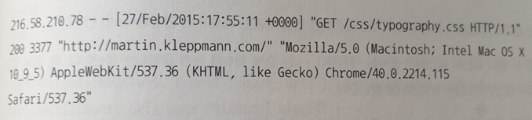
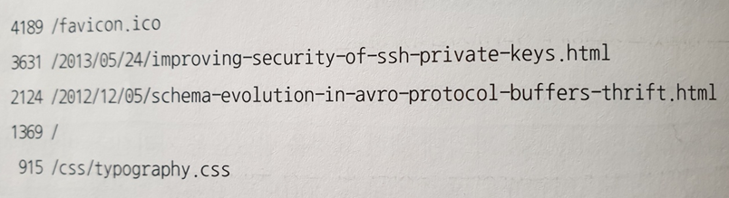
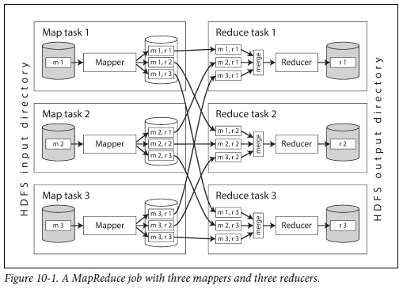
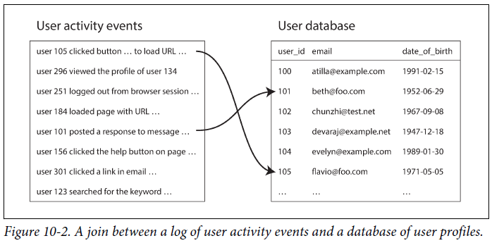

# 일괄 처리

#### 시스템의 3가지 유형
- 서비스(온라인 시스템) 1부, 2부에서 살펴본 내용
  - 클라이언트로부터 요청이나 지시가 올 때 까지 기다림
  - 요청 하나가 들어오면 가능한 빨리 요청을 처리해서 응답을 되돌려줌
  - 응답 시간이 서비스 성능을 측정하는데 중요한 요소
- 일괄 처리 시스템(오프라인 시스템)
  - 매우 큰 입력 데이터를 처리하고 결과 데이터 생산
  - 데이터를 처리하기 위해 수 분 ~ 수 일의 시간이 걸리며 사용자는 이를 기다리지 않음
  - 대부분 일배치 작업으로 반복적인 일정이 진행
  - 일괄 처리 시스템의 주요 성능 지표는 처리량
- 스트림 처리 시스템(준실시간 시스템)
  - 온라인과 오프라인(일괄 처리) 사이 어딘가에 있는 시스템
  - 일괄 처리 시스템과 마찬가지로 요청에 대해 응답하지 않으며 입력데이터를 소비하고 출력 데이터 생산
  - 정해진 크기의 입력 데이터를 대상으로 하지 않으며, 입력 이벤트가 발생한 후 바로 동작
  - 일괄처리 시스템 보다 낮은 지연시간을 가짐

서비스는 1부, 2부에서 주로 살펴본 시스템  
이번 장에서는 일괄처리 시스템에 대해서 다음장에서는 스트림 처리 시스템에 대해서 살펴본다.  

**일괄 처리 시스템은 신뢰할 수 있고 확장 가능하며 유지보수하기 쉬운 애플리케이션을 구축하는 데 매우 중요한 구성 요소** 일괄 처리 시스템을 위한 알고리즘으로 MapReduce(MR)가 있고 이를 구현한 Hadoop, CouchDB, MongoDB 등이 있다.  

일괄 처리를 위한 MR과 유닉스 시스템을 알아보자.

## 유닉스 도구로 일괄 처리하기
웹 서버가 하나 있고 들어온 요청이 처리될 때마다 로그 파일에 한 줄씩 추가한다고 가정  
  
log 형식에 대한 정의
```bash
$remote_addr - $remote_user [$time_local] "$request"
$status $body_bytes_sent "$http_referer" "$http_user_agent"
```
해석하면 다음과 같다.
2015냔 2월 7일 UTC 17시 55분 11초에 서버가 클라이언트 IP주소 216.58.210.78로 부터 /css/typograph.css 파일에 대한 요청을 받았다는 뜻이다.  
해당 요청에 대해 200으로 요청은 성공했으며, 응답 크기는 3,377바이트이다.  

### 단순 로그 분석
실제 유닉스 도구를 사용하여 웹 사이트 트래픽에 관한 보고서를 만들어보자.
```bash
cat /var/log/nginx/access.log   | 
awk '{print $7}'                |
sort                            |
uniq -c                         |
sort -r -n                      |
head -n 5
```
line별로 살펴보자
1. 로그를 읽는다.
2. 줄마다 공백으로 분리하여 요청 URL에 해당하는 7번째 필드만 출력한다.
3. 요청 URL을 알파벳 순으로 정렬한다.
4. uniq 명령은 인접한 두 줄이 같은지 확인해서 중복을 제거한다. -c는 중복 횟수를 함께 출력하는 옵션으로 각 요청이 몇번 있었는지 확인하기 위함이다.
5. -n 옵션을 사용해 매 줄 첫번째로 나타나는 숫자, URL의 요청 수를 기준으로 다시 정렬한다. -r 옵션으로 내림차순으로 정렬된다.
6. head 명령으로 앞에서부터 5줄만 출력한다.
  

위와 같은 방식으로 유닉스 도구를 사용해 로그 파일을 수 초 내로 처리할 수 있고  
필요에 따라 분석 방법을 수정할 수도 있다.  

### 연쇄 명령 대 맞춤형 프로그램
유닉스 연쇄 명령 대신 같은 작업을 수행하는 간단한 프로그램을 작성할 수도 있다.  
```ruby
counts = Hash.new(0)

File.open('/var/log/nginx/access.log') do |file|
  f.each do |line|
    url = line.split[6]
    counts[url] += 1
  end
end

top5 = count.map{|url, count| [count, url]}.sort.reverse[0..5]
top5.each {|count, url| puts "#{count} #{url}" }
```
부분별로 살펴보자.
1. counts는 각 URL이 몇 번 나왔는지 저장할 해시 테이블로 기본값은 0이다
2. 로그 파일의 각 줄에 공백으로 분리해서 7번째 값을 변수 url에 넣는다.
3. 현재 줄에서 추출한 URL의 카운트를 증가시킨다.  
4. 카운트 값으로 해시 테이블을 내림차순 정렬한다.
5. 상위 5개 항목을 추출한다.  

### 정렬 대 인메모리 집계
앞서 루비 스크립트는 URL 해시 테이블을 메모리에 유지하며 URL 출현수를 매핑한다.  
유닉스 파이프라인에는 이런 해시테이블이 없으며 정렬된 목록에서 같은 URL이 반복해서 나타난다.  
어떤 접근법이 더 좋을지는 다른 URL이 얼마나 되느냐에 따라 달라지는데, 메모리에 담을 수 없을 만큼의 데이터라면 정렬 접근법을 사용하는 것이 좋다.  
정렬 접근법은 디스크를 효율적으로 사용하며 데이터 청크를 메모리에서 정렬하고 청크를 세그먼트 파일로 디스크에 저장한고 각각 정렬된 세그먼트 파일 여러 개를 한 개의 큰 정렬 파일로 병합한다.  

### 유닉스 철학
앞서 유닉스 도구를 사용해 로그 파일을 분석할 수 있는 것은 우연이 아니다.  
이는 유닉스의 핵심 설계 아이디어 중 하나이며 유닉스 철학은 아래와 같다.  
1. 각 프로그램이 한 가지 일만 하도록 작성하라. 새 작업을 하려면 기존 프로그램을 고쳐 새로운 "기능"을 추가해 프로그램을 복잡하게 만들기보다는 새로운 프로그램을 작성하라.
2. 모든 프로그램의 출력은 아직 알려지지 않은 다른 프로그램의 입력으로 쓰일 수 있다고 생각하라. 불필요한 정보로 출력이 너저분해서는 안 된다. 입력 형식으로 엄격하게 열을 맞춘다거나 이진 형태를 사용하지 마라. 대화형 입력을 고집하지 마라.
3. 소프트웨어를 빠르게 써볼 수 있게 설계하고 구축하라. 심지어 운영체제도 마찬가지다. 수 주 안에 끝내는 것이 이상적이다. 거슬리는 부분은 과감히 버리고 새로 구축하라.
4. 프로그래밍 작업을 줄이려면 미숙한 도움보단 도구를 사용하라. 도구를 빌드하기 위해 한참 둘러가야 하고 게다가 사용 후 바로 버린다고 할지라도 도구를 써라.

이러한 유닉스 철학으로 유닉스 파이프는 앞선 예제와 같이 데이터 처리 작업을 쉽게 구성할 수 있다.  

### 동일 인터페이스
어떤 프로그램의 출력을 다른 프로그램의 입력으로 쓰고자 한다면 이들 프로그램은 같은 데이터 형식을 사용해야 한다.   
즉, 호환 가능한 인터페이스를 사용해야 한다는 의미인데  
유닉스에서의 인터페이스는 파일이다. 파일은 단지 순서대로 정렬된 바이트의 연속으로 파일시스템의 실제 파일, 프로세스 간의 통신 채널(유닉스 소켓, stdin, stdout, 장치 드라이버) TCP 연결을 나타내는 소켓 등 다른 여러 가지 것을 표현할 수 있다.  
전부는 아니지만 관례상 많은 유닉스 프로그램은 이렇게 연속된 바이트를 아스키 텍스트로 취급하며, 예제에서도 이를 활용한다.  
그러나 유닉스의 동일 인터페이스는 아스키 텍스트에는 큰 문제가 없지만 그다지 깔끔하지는 않다.  
로그 분석 예에서 URL을 추출하기 위해 {print $7}을 사용하는데 이는 가독성이 많이 떨어지기 때문이다.  
이렇게 완벽하지 않음에도 유닉스 동일 인터페이스는 여전히 대단한대, 동일한 데이터 모델인 DB 간에도 데이터를 이관하는 작업이 쉽지 않기 때문이다.  

### 로직과 연결의 분리
유닉스 도구의 다른 특징은 stdin과 stdout를 사용한다는 것이다.  
프로그램을 실행하고 아무것도 설정하지 않는다면 stdin은 키보드로부터 들어오고 stdout은 화면으로 출력한다.  
파이프는 한 프로세스의 stdout을 다른 프로세스의 stdin으로 연결하는 것이며 이때 중간 데이터를 디스크에 쓰지 않고 작은 인메모리 버퍼를 사용해 프로세스 간 데이터를 전송한다.  
필요한 경우라면 파일에 데이터를 쓰는 것도 가능하지만 특정 경로를 지정한다던가 하는 작업이 필요하기 때문에 stdin, stdout를 사용하여 처리하는 유닉스 도구에서의 가장 좋은 접근법이다.  
이렇게 프로그램의 입력이 어디서 들어오는지 출력이 어디로 나가는지 신경쓰거나 알 필요가 없는 것을 **느슨한 결합(loose coupling)**, **지연 바인딩(late binding)**, **제어 반전(inversion of control)** 이라고 한다.  
이러한 방식에도 몇가지 제약사항이 존재하는데, 프로그램이 여러 개의 입력을 받거나 여러 개의 출력이 필요할 때는 매우 까다롭다는 점이다. 프로그램의 출력을 파이프를 이용해 네트워크와 연결하지는 못하기 때문에 파일에 데이터를 쓰거나 다른 프로그램을 구동하거나 네트워크 연결을 사용해야 하기 때문에 유연함이 감소한다.  

### 투명성과 실험
유닉스 도구가 성공적인 이유는 진행 사항을 파악하기 쉽다는 점이다.  
- 유닉스 명령에 들어가는 입력 파일은 일반적으로 불변으로 처리되며 원본 파일에 손상을 주지 않는다.
- 어느 시점이든 파이프라인을 중단하고 출력을 파이프를 통해 less로 보내 원하는 형태의 출력이 나오는지 확인할 수 있다.  
- 특정 파이프라인 단계의 출력을 파일에 쓰고 그 파일을 다음 단계의 입력으로 사용할 수 있다. 이렇게 하면 전체 파이프라인을 다시 시작하지 않고 다음 단계부터 재시작이 가능하다.

유닉스 도구는 RDB의 질의 최적화 도구와 비교하면 상당히 불친절하고 단순하지만 유용하게 사용할 수 있으며 실험용으로 매우 좋다.  
그러나 앞서 언급한 것처럼 단일 장비에서만 실행되기 때문에 Hadoop와 같은 도구가 필요하다.

## 맵리듀스와 분산 파일 시스템
MR과 유닉스 도구의 공통점과 차이점
- 공통점
  - 불친절함
  - 원본 입력을 수정하지 않음
- 차이점
  - 유닉스 도구는 stdin, stdout을 입력과 출력으로 사용하는데 MR은 분산 파일 시스템상의 파일을 입력과 출력으로 사용
  - MR은 수천 대의 장비로 분산하여 데이터를 처리하는 것이 가능

MR을 구현하기 위한 파일 시스템으로 HDFS가 주로 사용되며 GlusterFs, QFS 등 다양한 분산 파일 시스템이 존재하며, 아마존 S3, 애저 Blob, 오픈스택 스위프트와 같은 객체 저장소도 여러 면에서 유사하다.  

HDFS는 비공유 원칙을 기반으로 하는데, NAS(Network Attached Storage)와 SAN(Storage Area Network) 아키텍처에서 사용하는 공유 디스크 방식과는 반대이다.  
공유 디스크는 중앙 집중 저장장치를 사용하는 데 맞춤형 하드웨어를 사용하거나 파이버 채널과 같은 인프라를 사용하지만,  
비공유 방식은 특별한 하드웨어 없이 일반적인 데이터센터 네트워크로 연결된 컴퓨터면 충분하다.  
HDFS는 각 장비에서 실행되는 데몬 프로세스로 구성되며 다른 노드가 해당 장비에 저장된 파일에 접근할 수 있도록 네트워크 서비스를 제공한다.  
**NameNode**는 파일의 블록들이 어느 서버에 저장되었는지를 추적하여 각 노드들에게 알려주며 이를 찾아갈 수 있도록 도와주며 장비나 디스크에 장애가 발생하는 것을 대비하기 위해 블록은 여러 장비에 복제된다.  
데이터를 복제하기 때문에 저장 용량을 효율적으로 사용할 수 없는데, 이를 방지하기 위한 기법으로 Erasure coding등의 방식을 사용하기도 한다.  
이러한 특성으로 HDFS는 확장성이 뛰어나며 저장 용량을 PB등의 많은 양의 데이터를 저장할 수 있다.  

### 맵리듀스 작업 실행하기
MR는 HDFS 같은 분산 파일 시스템 위에서 대용량 데이터셋을 처리하는 코드를 작성하는 프로그래밍 프레임 워크이며, 일반적인 작업 순서는 아래와 같다.
1. 입력 파일을 읽는다. 레코드로 쪼갠다. 웹 서버 로그 예제에서 로그의 각 줄이 레코드가 된다.
2. 각 입력 레코드마다 매퍼 함수를 호출해 키와 값을 추출한다. 예제의 경우 URL($7)을 키로 추출하고 값은 빈 값으로 한다.
3. 키를 기준으로 키-값 쌍을 모두 정렬한다.
4. 정렬된 키-값 쌍 전체를 대상으로 리듀스 함수를 호출하고 같은 키가 여러 번 등장했다면 정렬 과정에서 해당 키-값 쌍은 서로 인접한다.

위의 4가지 단계 중 2단계(맵)과 4단계(리듀스)는 사용자가 직접 작성한 데이터 처리 코드이고, 나머지 단계는 데이터를 처리하기 위해 맵리듀스에 내재된 단계이다.  
앞서 알아본 것 처럼 MR작업을 생성하려면 다음과 같이 동작하는 매퍼와 리듀서라는 두 가지 콜백 함수를 구현해야 한다.
- 매퍼(Mapper)
  - 매퍼는 모든 입력 레코드마다 한 번씩 호출되며, 입력 레코드로부터 키와 값을 추출하는 작업이다. 
  - 입력 레코드로부터 다음 레코드까지 상태를 유지하지 않기 때문에 각 레코드를 독립적으로 처리
- 리듀서(Reducer)
  - MR 프레임 워크는 Mapper가 생산한 키-값 쌍을 받아 같은 키를 가진 레코드를 모으고 해당 값의 집합을 반복해 리듀서 함수 호출
  - 리듀서 함수는 출력 레코드를 생산

앞서 웹 서버 로그 예제에서 5번째 단계인 정렬 단계를 MR에서는 Reducer가 담당

### 맵리듀스의 분산 실행
유닉스 명령어와 MR의 가장 큰 차이는 MR이 병렬로 수행하는 코드를 직접 작성하지 않고도 여러 장비에서 동시에 처리가 가능하다는 것  
매퍼와 리듀서는 한 번에 하나의 레코드만 처리하고 입력이 어디서 오는지 출력이 어디로 가는지 신경 쓰지 않는다.  
분산 연산에서 매퍼와 리듀서로 표준 유닉스 도구를 사용하는 것도 가능하지만 하둡에서는 java로 구현된 MR을 사용하고, MongoDB와 CouchDB에서는 JS로 구현된 MR을 사용  
  
위의 그림은 Hadoop MR 작업에서의 Workflow를 보여주며, 입력은 HDFS상의 디렉토리를 사용하는 것이 일반적이며, 그 크기는 수백 MB에 달한다.  
각 매퍼의 입력 파일의 본제본이 있는 장비에 RAM과 CPU에 여유가 충분하다면 MR 스케쥴러가 입력 파일이 있는 장비에서 작업을 수행하려 하는데, 이를 **데이터 가까이에서 연산하기(데이터 지역성)** 이라 하고, 이를 적용하면 네트워크를 통해 입력 파일을 복사하는 부담과 네트워크 부하가 감소하고 지역성이 증가한다.  
MR에서의 Mapper 작업은 보통 아래와 같은 순서로 이루어진다.  
1. 맵 태스크에서 실행될 애플리케이션 코드는 수행할 장비로 코드를 복사
2. 복사가 끝나면 맵 태스크 실행
3. 레코드를 하나씩 읽어 매퍼 콜백 함수로 전달(key-value 형식 반환)
4. 리듀서에게 전달하기 위해 key의 해시값을 이용해 정렬
5. 정렬된 값을 매퍼의 로컬 디스크에 저장
6. 정렬된 값을 파일에 모두 저장한 이후 리듀서에게 완료 사실 전달

파일에 쓰기 작업이 완료되면 매퍼는 리듀서에게 이를 전달하고 리듀서는 파일을 다운로드 해 정렬된 순서를 유지하면서 병합작업을 진행한다.  
리듀서를 기준으로 파티셔닝하고 정렬한 뒤 매퍼로부터 데이터 파티션을 복사하는 과정을 **셔플(suffle)** 이라고 한다.  
이런 과정을 거치면서 리듀서는 다른 매퍼가 동일한 키로 레코드를 생성하는 경우에도 서로 인접하게 처리할 수 있다.  

### 맵리듀스 워크플로
MR 작업 하나로 해결할 수 있는 문제의 범위는 제한적이다.  
앞서 로그 분석 예제의 경우에서 단일 MR 작업으로 URL당 페이지뷰 수를 구할 수 있지만 가장 인기 있는 URL을 구할 수는 없다.  
따라서 MR 작업을 연결하는 **워크플로(workflow)** 로 구성하는 방식이 일반적이다.  
Hadoop MR은 이를 직접 제공하지 않기 때문에 디렉터리 이름을 통해 암묵적으로 연결되는데,
1. HDFS상에 지정된 디렉토리에 출력하도록 설정
2. 해당 디렉토리를 입력으로 사용하도록 설정
위와 같은 방법으로 처리할 수 있지만 두 작업은 완전히 독립적으로 실행된다.  
서로 독립적인 두 작업은 첫번째 작업이 성공해야 두번째 작업이 유효하다.  
따라서 workflow상 해당 작업의 입력 디렉토리를 생성하는 선행 작업이 끝나야 다음 작업을 시작할 수 있고, 이를 위해 다양한 스케쥴러가 개발되어 있다.  
Oozie, Azkaban, Luigi, **Airflow** , Pinball 등이 있다.  

## 리듀스 사이드 조인과 그룹화
여러 데이터셋에서 한 레코드가 다른 레코드와 연관이 있는 것은 일반적이며, 이를 관계형 모델에서는 외래키, 문서 모델에서는 문서 참조, 그래프 모델에서는 간선을 사용해 나타낼 수 있다.  
연관된 레코드에 모두 접근해야하는 경우 조인은 필수적인 작업이며, 비정규화 작업을 통해 조인을 줄일 수 있지만 완전히 제거하기는 어렵다.  
DB에서는 적은 수의 레코드만 관련된 질의를 실행한다면 색인(index)를 사용해 레코드를 찾을 수 있지만 MR에서는 일반적으로 이야기하는 색인 개념이 없다.  
파일 집합이 입력으로 주어지는 MR의 경우 입력 파일 전체 내용을 읽는데 DB에서는 이 연산을 **full table scan** 이라고 하며, 이는 적은 수의 레코드만 읽는 경우 색인 탐색에 비해 터무니 없이 많은 비용이 발생하기 때문에 사용되지 않지만, MR의 경우 대량의 레코드를 기준으로 집계 연산을 수행하는 것이 일반적이기 때문에 full table scan이 주로 사용된다.  
일괄 처리의 맥락에서 조인은 데이터셋 내 모든 연관 관계를 다루며 특정 사용자의 데이터만 찾는 것이 아니라 모든 사용자의 데이터를 동시에 처리한다.  

### 사용자 활동 이벤트 분석 예제
한 가지 예를 통해 MR의 조인에 대해서 알아보자.
  
왼쪽은 사용자 활동 이벤트, 오른쪽은 사용자 DB이다.  
이 예제에서 사용자 활동과 사용자 프로필 정보를 연관시켜야 하며, 예를 들어 특정 연령군에서 어떤 페이지가 가장 인기 있는지를 확인할 수 있다고 가정하자.  
그러나 활동 이벤트는 단순히 사용자 ID만 포함하고 전체 데이터는 포함하지 않기 때문에 사용자 DB와의 조인이 필요하다.  
조인을 가장 간단히 구현하는 방법은 활동 이벤트의 사용자 ID를 하나씩 사용하여 사용자 DB에 질의를 보내는 것이다.  
이는 DB와의 통신에서 발생하는 비용과 처리량, 캐시의 효율성 때문에 나쁜 성능이 발생할 수 있고, 병렬로 실행되는 경우 DB에 부하가 걸릴 수 있다.  
일괄 처리에서는 처리량을 높이기 위해 가능한 한 장비 내에서 연산을 수행하는 것이 좋다.  
이를 위해 처리할 모든 레코드를 네트워크를 통해 임시 접근 요청하는 것은 너무 느리고, 원격 DB에 질의하는 것은 원격 DB의 데이터에 변화가 발생할 수 있기 때문에 비 결정적이다.  
좋은 방법은 사용자 DB의 사본을 생성하고 사용자 활동 이벤트 로그가 저장된 분산 파일 시스템에서 처리하는 방법이다. 이렇게 처리하는 경우 두 데이터는 HDFS 상에 존재하고 연관된 데이터가 한곳으로 모여 효율적인 처리가 가능하다.  

