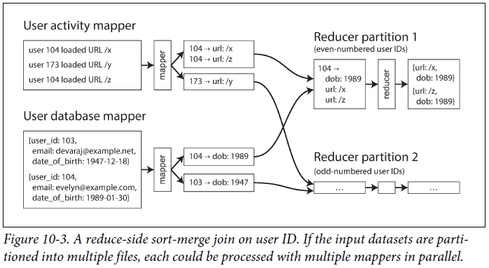

# 일괄 처리

#### 시스템의 3가지 유형
- 서비스(온라인 시스템) 1부, 2부에서 살펴본 내용
  - 클라이언트로부터 요청이나 지시가 올 때 까지 기다림
  - 요청 하나가 들어오면 가능한 빨리 요청을 처리해서 응답을 되돌려줌
  - 응답 시간이 서비스 성능을 측정하는데 중요한 요소
- 일괄 처리 시스템(오프라인 시스템)
  - 매우 큰 입력 데이터를 처리하고 결과 데이터 생산
  - 데이터를 처리하기 위해 수 분 ~ 수 일의 시간이 걸리며 사용자는 이를 기다리지 않음
  - 대부분 일배치 작업으로 반복적인 일정이 진행
  - 일괄 처리 시스템의 주요 성능 지표는 처리량
- 스트림 처리 시스템(준실시간 시스템)
  - 온라인과 오프라인(일괄 처리) 사이 어딘가에 있는 시스템
  - 일괄 처리 시스템과 마찬가지로 요청에 대해 응답하지 않으며 입력데이터를 소비하고 출력 데이터 생산
  - 정해진 크기의 입력 데이터를 대상으로 하지 않으며, 입력 이벤트가 발생한 후 바로 동작
  - 일괄처리 시스템 보다 낮은 지연시간을 가짐

서비스는 1부, 2부에서 주로 살펴본 시스템  
이번 장에서는 일괄처리 시스템에 대해서 다음장에서는 스트림 처리 시스템에 대해서 살펴본다.  

**일괄 처리 시스템은 신뢰할 수 있고 확장 가능하며 유지보수하기 쉬운 애플리케이션을 구축하는 데 매우 중요한 구성 요소** 일괄 처리 시스템을 위한 알고리즘으로 MapReduce(MR)가 있고 이를 구현한 Hadoop, CouchDB, MongoDB 등이 있다.  

일괄 처리를 위한 MR과 유닉스 시스템을 알아보자.

## 유닉스 도구로 일괄 처리하기
웹 서버가 하나 있고 들어온 요청이 처리될 때마다 로그 파일에 한 줄씩 추가한다고 가정  
  
log 형식에 대한 정의
```bash
$remote_addr - $remote_user [$time_local] "$request"
$status $body_bytes_sent "$http_referer" "$http_user_agent"
```
해석하면 다음과 같다.
2015냔 2월 7일 UTC 17시 55분 11초에 서버가 클라이언트 IP주소 216.58.210.78로 부터 /css/typograph.css 파일에 대한 요청을 받았다는 뜻이다.  
해당 요청에 대해 200으로 요청은 성공했으며, 응답 크기는 3,377바이트이다.  

### 단순 로그 분석
실제 유닉스 도구를 사용하여 웹 사이트 트래픽에 관한 보고서를 만들어보자.
```bash
cat /var/log/nginx/access.log   | 
awk '{print $7}'                |
sort                            |
uniq -c                         |
sort -r -n                      |
head -n 5
```
line별로 살펴보자
1. 로그를 읽는다.
2. 줄마다 공백으로 분리하여 요청 URL에 해당하는 7번째 필드만 출력한다.
3. 요청 URL을 알파벳 순으로 정렬한다.
4. uniq 명령은 인접한 두 줄이 같은지 확인해서 중복을 제거한다. -c는 중복 횟수를 함께 출력하는 옵션으로 각 요청이 몇번 있었는지 확인하기 위함이다.
5. -n 옵션을 사용해 매 줄 첫번째로 나타나는 숫자, URL의 요청 수를 기준으로 다시 정렬한다. -r 옵션으로 내림차순으로 정렬된다.
6. head 명령으로 앞에서부터 5줄만 출력한다.
  

위와 같은 방식으로 유닉스 도구를 사용해 로그 파일을 수 초 내로 처리할 수 있고  
필요에 따라 분석 방법을 수정할 수도 있다.  

### 연쇄 명령 대 맞춤형 프로그램
유닉스 연쇄 명령 대신 같은 작업을 수행하는 간단한 프로그램을 작성할 수도 있다.  
```ruby
counts = Hash.new(0)

File.open('/var/log/nginx/access.log') do |file|
  f.each do |line|
    url = line.split[6]
    counts[url] += 1
  end
end

top5 = count.map{|url, count| [count, url]}.sort.reverse[0..5]
top5.each {|count, url| puts "#{count} #{url}" }
```
부분별로 살펴보자.
1. counts는 각 URL이 몇 번 나왔는지 저장할 해시 테이블로 기본값은 0이다
2. 로그 파일의 각 줄에 공백으로 분리해서 7번째 값을 변수 url에 넣는다.
3. 현재 줄에서 추출한 URL의 카운트를 증가시킨다.  
4. 카운트 값으로 해시 테이블을 내림차순 정렬한다.
5. 상위 5개 항목을 추출한다.  

### 정렬 대 인메모리 집계
앞서 루비 스크립트는 URL 해시 테이블을 메모리에 유지하며 URL 출현수를 매핑한다.  
유닉스 파이프라인에는 이런 해시테이블이 없으며 정렬된 목록에서 같은 URL이 반복해서 나타난다.  
어떤 접근법이 더 좋을지는 다른 URL이 얼마나 되느냐에 따라 달라지는데, 메모리에 담을 수 없을 만큼의 데이터라면 정렬 접근법을 사용하는 것이 좋다.  
정렬 접근법은 디스크를 효율적으로 사용하며 데이터 청크를 메모리에서 정렬하고 청크를 세그먼트 파일로 디스크에 저장한고 각각 정렬된 세그먼트 파일 여러 개를 한 개의 큰 정렬 파일로 병합한다.  

### 유닉스 철학
앞서 유닉스 도구를 사용해 로그 파일을 분석할 수 있는 것은 우연이 아니다.  
이는 유닉스의 핵심 설계 아이디어 중 하나이며 유닉스 철학은 아래와 같다.  
1. 각 프로그램이 한 가지 일만 하도록 작성하라. 새 작업을 하려면 기존 프로그램을 고쳐 새로운 "기능"을 추가해 프로그램을 복잡하게 만들기보다는 새로운 프로그램을 작성하라.
2. 모든 프로그램의 출력은 아직 알려지지 않은 다른 프로그램의 입력으로 쓰일 수 있다고 생각하라. 불필요한 정보로 출력이 너저분해서는 안 된다. 입력 형식으로 엄격하게 열을 맞춘다거나 이진 형태를 사용하지 마라. 대화형 입력을 고집하지 마라.
3. 소프트웨어를 빠르게 써볼 수 있게 설계하고 구축하라. 심지어 운영체제도 마찬가지다. 수 주 안에 끝내는 것이 이상적이다. 거슬리는 부분은 과감히 버리고 새로 구축하라.
4. 프로그래밍 작업을 줄이려면 미숙한 도움보단 도구를 사용하라. 도구를 빌드하기 위해 한참 둘러가야 하고 게다가 사용 후 바로 버린다고 할지라도 도구를 써라.

이러한 유닉스 철학으로 유닉스 파이프는 앞선 예제와 같이 데이터 처리 작업을 쉽게 구성할 수 있다.  

### 동일 인터페이스
어떤 프로그램의 출력을 다른 프로그램의 입력으로 쓰고자 한다면 이들 프로그램은 같은 데이터 형식을 사용해야 한다.   
즉, 호환 가능한 인터페이스를 사용해야 한다는 의미인데  
유닉스에서의 인터페이스는 파일이다. 파일은 단지 순서대로 정렬된 바이트의 연속으로 파일시스템의 실제 파일, 프로세스 간의 통신 채널(유닉스 소켓, stdin, stdout, 장치 드라이버) TCP 연결을 나타내는 소켓 등 다른 여러 가지 것을 표현할 수 있다.  
전부는 아니지만 관례상 많은 유닉스 프로그램은 이렇게 연속된 바이트를 아스키 텍스트로 취급하며, 예제에서도 이를 활용한다.  
그러나 유닉스의 동일 인터페이스는 아스키 텍스트에는 큰 문제가 없지만 그다지 깔끔하지는 않다.  
로그 분석 예에서 URL을 추출하기 위해 {print $7}을 사용하는데 이는 가독성이 많이 떨어지기 때문이다.  
이렇게 완벽하지 않음에도 유닉스 동일 인터페이스는 여전히 대단한대, 동일한 데이터 모델인 DB 간에도 데이터를 이관하는 작업이 쉽지 않기 때문이다.  

### 로직과 연결의 분리
유닉스 도구의 다른 특징은 stdin과 stdout를 사용한다는 것이다.  
프로그램을 실행하고 아무것도 설정하지 않는다면 stdin은 키보드로부터 들어오고 stdout은 화면으로 출력한다.  
파이프는 한 프로세스의 stdout을 다른 프로세스의 stdin으로 연결하는 것이며 이때 중간 데이터를 디스크에 쓰지 않고 작은 인메모리 버퍼를 사용해 프로세스 간 데이터를 전송한다.  
필요한 경우라면 파일에 데이터를 쓰는 것도 가능하지만 특정 경로를 지정한다던가 하는 작업이 필요하기 때문에 stdin, stdout를 사용하여 처리하는 유닉스 도구에서의 가장 좋은 접근법이다.  
이렇게 프로그램의 입력이 어디서 들어오는지 출력이 어디로 나가는지 신경쓰거나 알 필요가 없는 것을 **느슨한 결합(loose coupling)**, **지연 바인딩(late binding)**, **제어 반전(inversion of control)** 이라고 한다.  
이러한 방식에도 몇가지 제약사항이 존재하는데, 프로그램이 여러 개의 입력을 받거나 여러 개의 출력이 필요할 때는 매우 까다롭다는 점이다. 프로그램의 출력을 파이프를 이용해 네트워크와 연결하지는 못하기 때문에 파일에 데이터를 쓰거나 다른 프로그램을 구동하거나 네트워크 연결을 사용해야 하기 때문에 유연함이 감소한다.  

### 투명성과 실험
유닉스 도구가 성공적인 이유는 진행 사항을 파악하기 쉽다는 점이다.  
- 유닉스 명령에 들어가는 입력 파일은 일반적으로 불변으로 처리되며 원본 파일에 손상을 주지 않는다.
- 어느 시점이든 파이프라인을 중단하고 출력을 파이프를 통해 less로 보내 원하는 형태의 출력이 나오는지 확인할 수 있다.  
- 특정 파이프라인 단계의 출력을 파일에 쓰고 그 파일을 다음 단계의 입력으로 사용할 수 있다. 이렇게 하면 전체 파이프라인을 다시 시작하지 않고 다음 단계부터 재시작이 가능하다.

유닉스 도구는 RDB의 질의 최적화 도구와 비교하면 상당히 불친절하고 단순하지만 유용하게 사용할 수 있으며 실험용으로 매우 좋다.  
그러나 앞서 언급한 것처럼 단일 장비에서만 실행되기 때문에 Hadoop와 같은 도구가 필요하다.

## 맵리듀스와 분산 파일 시스템
MR과 유닉스 도구의 공통점과 차이점
- 공통점
  - 불친절함
  - 원본 입력을 수정하지 않음
- 차이점
  - 유닉스 도구는 stdin, stdout을 입력과 출력으로 사용하는데 MR은 분산 파일 시스템상의 파일을 입력과 출력으로 사용
  - MR은 수천 대의 장비로 분산하여 데이터를 처리하는 것이 가능

MR을 구현하기 위한 파일 시스템으로 HDFS가 주로 사용되며 GlusterFs, QFS 등 다양한 분산 파일 시스템이 존재하며, 아마존 S3, 애저 Blob, 오픈스택 스위프트와 같은 객체 저장소도 여러 면에서 유사하다.  

HDFS는 비공유 원칙을 기반으로 하는데, NAS(Network Attached Storage)와 SAN(Storage Area Network) 아키텍처에서 사용하는 공유 디스크 방식과는 반대이다.  
공유 디스크는 중앙 집중 저장장치를 사용하는 데 맞춤형 하드웨어를 사용하거나 파이버 채널과 같은 인프라를 사용하지만,  
비공유 방식은 특별한 하드웨어 없이 일반적인 데이터센터 네트워크로 연결된 컴퓨터면 충분하다.  
HDFS는 각 장비에서 실행되는 데몬 프로세스로 구성되며 다른 노드가 해당 장비에 저장된 파일에 접근할 수 있도록 네트워크 서비스를 제공한다.  
**NameNode**는 파일의 블록들이 어느 서버에 저장되었는지를 추적하여 각 노드들에게 알려주며 이를 찾아갈 수 있도록 도와주며 장비나 디스크에 장애가 발생하는 것을 대비하기 위해 블록은 여러 장비에 복제된다.  
데이터를 복제하기 때문에 저장 용량을 효율적으로 사용할 수 없는데, 이를 방지하기 위한 기법으로 Erasure coding등의 방식을 사용하기도 한다.  
이러한 특성으로 HDFS는 확장성이 뛰어나며 저장 용량을 PB등의 많은 양의 데이터를 저장할 수 있다.  

### 맵리듀스 작업 실행하기
MR는 HDFS 같은 분산 파일 시스템 위에서 대용량 데이터셋을 처리하는 코드를 작성하는 프로그래밍 프레임 워크이며, 일반적인 작업 순서는 아래와 같다.
1. 입력 파일을 읽는다. 레코드로 쪼갠다. 웹 서버 로그 예제에서 로그의 각 줄이 레코드가 된다.
2. 각 입력 레코드마다 매퍼 함수를 호출해 키와 값을 추출한다. 예제의 경우 URL($7)을 키로 추출하고 값은 빈 값으로 한다.
3. 키를 기준으로 키-값 쌍을 모두 정렬한다.
4. 정렬된 키-값 쌍 전체를 대상으로 리듀스 함수를 호출하고 같은 키가 여러 번 등장했다면 정렬 과정에서 해당 키-값 쌍은 서로 인접한다.

위의 4가지 단계 중 2단계(맵)과 4단계(리듀스)는 사용자가 직접 작성한 데이터 처리 코드이고, 나머지 단계는 데이터를 처리하기 위해 맵리듀스에 내재된 단계이다.  
앞서 알아본 것 처럼 MR작업을 생성하려면 다음과 같이 동작하는 매퍼와 리듀서라는 두 가지 콜백 함수를 구현해야 한다.
- 매퍼(Mapper)
  - 매퍼는 모든 입력 레코드마다 한 번씩 호출되며, 입력 레코드로부터 키와 값을 추출하는 작업이다. 
  - 입력 레코드로부터 다음 레코드까지 상태를 유지하지 않기 때문에 각 레코드를 독립적으로 처리
- 리듀서(Reducer)
  - MR 프레임 워크는 Mapper가 생산한 키-값 쌍을 받아 같은 키를 가진 레코드를 모으고 해당 값의 집합을 반복해 리듀서 함수 호출
  - 리듀서 함수는 출력 레코드를 생산

앞서 웹 서버 로그 예제에서 5번째 단계인 정렬 단계를 MR에서는 Reducer가 담당

### 맵리듀스의 분산 실행
유닉스 명령어와 MR의 가장 큰 차이는 MR이 병렬로 수행하는 코드를 직접 작성하지 않고도 여러 장비에서 동시에 처리가 가능하다는 것  
매퍼와 리듀서는 한 번에 하나의 레코드만 처리하고 입력이 어디서 오는지 출력이 어디로 가는지 신경 쓰지 않는다.  
분산 연산에서 매퍼와 리듀서로 표준 유닉스 도구를 사용하는 것도 가능하지만 하둡에서는 java로 구현된 MR을 사용하고, MongoDB와 CouchDB에서는 JS로 구현된 MR을 사용  
  
위의 그림은 Hadoop MR 작업에서의 Workflow를 보여주며, 입력은 HDFS상의 디렉토리를 사용하는 것이 일반적이며, 그 크기는 수백 MB에 달한다.  
각 매퍼의 입력 파일의 본제본이 있는 장비에 RAM과 CPU에 여유가 충분하다면 MR 스케쥴러가 입력 파일이 있는 장비에서 작업을 수행하려 하는데, 이를 **데이터 가까이에서 연산하기(데이터 지역성)** 이라 하고, 이를 적용하면 네트워크를 통해 입력 파일을 복사하는 부담과 네트워크 부하가 감소하고 지역성이 증가한다.  
MR에서의 Mapper 작업은 보통 아래와 같은 순서로 이루어진다.  
1. 맵 태스크에서 실행될 애플리케이션 코드는 수행할 장비로 코드를 복사
2. 복사가 끝나면 맵 태스크 실행
3. 레코드를 하나씩 읽어 매퍼 콜백 함수로 전달(key-value 형식 반환)
4. 리듀서에게 전달하기 위해 key의 해시값을 이용해 정렬
5. 정렬된 값을 매퍼의 로컬 디스크에 저장
6. 정렬된 값을 파일에 모두 저장한 이후 리듀서에게 완료 사실 전달

파일에 쓰기 작업이 완료되면 매퍼는 리듀서에게 이를 전달하고 리듀서는 파일을 다운로드 해 정렬된 순서를 유지하면서 병합작업을 진행한다.  
리듀서를 기준으로 파티셔닝하고 정렬한 뒤 매퍼로부터 데이터 파티션을 복사하는 과정을 **셔플(suffle)** 이라고 한다.  
이런 과정을 거치면서 리듀서는 다른 매퍼가 동일한 키로 레코드를 생성하는 경우에도 서로 인접하게 처리할 수 있다.  

### 맵리듀스 워크플로
MR 작업 하나로 해결할 수 있는 문제의 범위는 제한적이다.  
앞서 로그 분석 예제의 경우에서 단일 MR 작업으로 URL당 페이지뷰 수를 구할 수 있지만 가장 인기 있는 URL을 구할 수는 없다.  
따라서 MR 작업을 연결하는 **워크플로(workflow)** 로 구성하는 방식이 일반적이다.  
Hadoop MR은 이를 직접 제공하지 않기 때문에 디렉터리 이름을 통해 암묵적으로 연결되는데,
1. HDFS상에 지정된 디렉토리에 출력하도록 설정
2. 해당 디렉토리를 입력으로 사용하도록 설정
위와 같은 방법으로 처리할 수 있지만 두 작업은 완전히 독립적으로 실행된다.  
서로 독립적인 두 작업은 첫번째 작업이 성공해야 두번째 작업이 유효하다.  
따라서 workflow상 해당 작업의 입력 디렉토리를 생성하는 선행 작업이 끝나야 다음 작업을 시작할 수 있고, 이를 위해 다양한 스케쥴러가 개발되어 있다.  
Oozie, Azkaban, Luigi, **Airflow** , Pinball 등이 있다.  

## 리듀스 사이드 조인과 그룹화
여러 데이터셋에서 한 레코드가 다른 레코드와 연관이 있는 것은 일반적이며, 이를 관계형 모델에서는 외래키, 문서 모델에서는 문서 참조, 그래프 모델에서는 간선을 사용해 나타낼 수 있다.  
연관된 레코드에 모두 접근해야하는 경우 조인은 필수적인 작업이며, 비정규화 작업을 통해 조인을 줄일 수 있지만 완전히 제거하기는 어렵다.  
DB에서는 적은 수의 레코드만 관련된 질의를 실행한다면 색인(index)를 사용해 레코드를 찾을 수 있지만 MR에서는 일반적으로 이야기하는 색인 개념이 없다.  
파일 집합이 입력으로 주어지는 MR의 경우 입력 파일 전체 내용을 읽는데 DB에서는 이 연산을 **full table scan** 이라고 하며, 이는 적은 수의 레코드만 읽는 경우 색인 탐색에 비해 터무니 없이 많은 비용이 발생하기 때문에 사용되지 않지만, MR의 경우 대량의 레코드를 기준으로 집계 연산을 수행하는 것이 일반적이기 때문에 full table scan이 주로 사용된다.  
일괄 처리의 맥락에서 조인은 데이터셋 내 모든 연관 관계를 다루며 특정 사용자의 데이터만 찾는 것이 아니라 모든 사용자의 데이터를 동시에 처리한다.  

### 사용자 활동 이벤트 분석 예제
한 가지 예를 통해 MR의 조인에 대해서 알아보자.
  
왼쪽은 사용자 활동 이벤트, 오른쪽은 사용자 DB이다.  
이 예제에서 사용자 활동과 사용자 프로필 정보를 연관시켜야 하며, 예를 들어 특정 연령군에서 어떤 페이지가 가장 인기 있는지를 확인할 수 있다고 가정하자.  
그러나 활동 이벤트는 단순히 사용자 ID만 포함하고 전체 데이터는 포함하지 않기 때문에 사용자 DB와의 조인이 필요하다.  
조인을 가장 간단히 구현하는 방법은 활동 이벤트의 사용자 ID를 하나씩 사용하여 사용자 DB에 질의를 보내는 것이다.  
이는 DB와의 통신에서 발생하는 비용과 처리량, 캐시의 효율성 때문에 나쁜 성능이 발생할 수 있고, 병렬로 실행되는 경우 DB에 부하가 걸릴 수 있다.  
일괄 처리에서는 처리량을 높이기 위해 가능한 한 장비 내에서 연산을 수행하는 것이 좋다.  
이를 위해 처리할 모든 레코드를 네트워크를 통해 임시 접근 요청하는 것은 너무 느리고, 원격 DB에 질의하는 것은 원격 DB의 데이터에 변화가 발생할 수 있기 때문에 비 결정적이다.  
좋은 방법은 사용자 DB의 사본을 생성하고 사용자 활동 이벤트 로그가 저장된 분산 파일 시스템에서 처리하는 방법이다. 이렇게 처리하는 경우 두 데이터는 HDFS 상에 존재하고 연관된 데이터가 한곳으로 모여 효율적인 처리가 가능하다.  

### 정렬 병합 조인
앞서 매퍼는 입력 레코드로부터 키 값을 추출하는 것이 목적이였다.  
사용자 활동 이벤트 분석 예제의 경우 한 매퍼는 활동 이벤트를 훑어 사용자 ID를 키 활동 이벤트를 값으로 다른 매퍼는 사용자 ID를 키 생일을 값으로 추출한다.  
  
MR을 사용하면 키로 매퍼의 출력을 파티셔닝해 키 값 쌍으로 정렬한다면 같은 사용자의 활동 이벤트와 사용자 레코드는 같은 리듀서의 입력으로 서로 인접하게 들어간다.  
리듀서가 항상 사용자 DB를 먼저 보고 활동 이벤트를 시간순으로 보게 하는 식으로 MR에서 작업 레코드를 재배열하기도 하는데 이를 **보조 정렬(secondary sort)** 라고 한다.  
보조 정렬이 일어난 이후 리듀서는 모든 사용자 ID당 한번만 호출되고 보조 정렬 덕분에 첫 번째 값은 사용자 DB의 생년월일 레코드로 예상할 수 있으며, 생년월일을 지역변수에 저장하고 같은 사용자 ID의 동일한 활동 이벤트를 순회해서 본 URL과 본 사람의 연령을 출력한다.  
리듀서는 특정 사용자 ID의 모든 레코드를 한 번만 처리하므로 한 번에 사용자 한 명의 레코드만 메모리에 유지하면 되고 네트워크 요청으로 보낼 필요도 없으며, 이를 정렬 **정렬 병합 조인(sort-merge join)** 이라고 한다.  
정렬 병합 조인은 매퍼 출력이 키로 정렬된 후 리듀서가 조인 양측의 정렬된 레코드 목록을 병합하기 때문이다.  

### 같은 곳으로 연관된 데이터 가져오기
병합 정렬 조인 중 매퍼와 정렬 프로세스는 특정 사용자 ID로 조인 연산을 할 때 필요한 모든 데이터를 한 곳으로 모으기 때문에 리듀서는 ID별로 한번만 호출하면 된다.  
이렇게 처리하면 레코드를 휘젓고 다닐 때 처리량은 높게 유지하면서 메모리의 부담도 줄일 수 있다.  
1. 매퍼가 리듀서로 메세지를 전송하는 경우 키 값이 목적지의 주소 역할
2. 같은 키-값 쌍은 모두 같은 목적지(리듀서로 전달)

이는 MR과 일반적인 DB와 달리 올바른 장비로 데이터를 모으는 연산의 물리적 네트워크 통신 측면과 받은 데이터를 처리하는 애플리케이션 로직이 분리되며, DB로부터 데이터를 가져오는 요청은 애플리케이션 코드 내에서 주로 발생한다. MR은 모든 네트워크 통신을 직접 관리하기 때문에 특정 장비가 죽는 것과 같이 부분적으로 실패가 발생하더라도 애플리케이션 코드 단에서 고민할 필요없이 재시도가 일어난다.  

### 그룹화
조인 외에도 같은 곳으로 데이터를 모으는 작업으로 그룹화(group by)와 같은 연산이 존재하는데 일반적인 사용법은 다음과 같다.
- 각 그룹의 레코드 수를 카운트( COUNT (*) )
- 특정 필드 내 모든 값을 더하기
- 어떤 랭킹 함수를 실행했을 때 상위 k개의 레코드 고르기

MR로 그룹화를 가장 간단하게 구현하는 방법은 매퍼가 키-값 쌍을 생성할 때 그룹화할 대상을 키로 사용하는 것인데,
파티션 정렬 프로세스가 같은 키를 가진 모든 레코드를 같은 리듀서로 모아 처리한다.  
특정 사용자가 취한 일련의 행동을 찾기 위해 사용자 세션별 호라동 이벤트를 수집 분석할 때도 일반적으로 그룹화를 사용하며 이를 **세션화(sessionizeion)** 라고 한다.  
예를 들어 사용자에게 옛 버전 웹사이트를 보여줬을 때 보다 새 버전 웹사이트를 보여줬을 때 더 구매를 했는지 확인하거나 혹은 어떤 마케팅 활동이 가치 있는지 분석하는 것을 말한다.  
사용자 요청을 받은 웹 서버가 여러 개라면 이는 여러 서버로 분산되어 각각 다른 로그 파일에 저장되며, 이를 세션 쿠키나, 사용자 ID 등의 식별자를 그룹화 키로 사용해 세션화를 구현할 수 있다.  

### 쏠림 다루기
키 하나에 너무 많은 데이터가 연관된다면 같은 키를 가지는 모든 레코드를 같은 장소로 모으는 패턴은 제대로 동작하지 않을 수 있다.  
SNS에서 유명 인사의 팔로워가 수백만명인 경우 불균형이 발생하며 이러한 레코드를 **린치핀 객체(linchpin object)** 또는 **핫 키(hot key)** 라고 한다.  
유명 인사 한 사람에 관련된 활동을 팔로워에게 전달하는 경우 리듀서 한 개에 데이터를 모은다면 상당한 쏠림 현상이 발생하고 이를 **핫스팟(hot spot)** 라고 한다.  
한 리듀서에서 많은 데이터를 처리해야하는 것을 의미하며 모든 매퍼와 리듀석가 완전히 끝나야 MR 작업이 완료되는데 가장 느린 리듀서가 작업을 완료할 때까지 후속작업은 대기상태가 된다.  
이런 현상을 방지하기 위해 여러 가지 알고리즘이 존재하한다.
- pig의 쏠린 조인(skewed join)
  - 어떤 키가 핫키 인지 결정하기 위한 샘플링 작업을 수행
  - 핫 키를 가진 레코드는 여러 리듀서 중 임의로 선택한 하나로 레코드를 보낸다.
  - 키의 해시 값을 기반으로 리듀서를 결정하는 기존 방식과 다름
  - 핫 키로 조인할 때 다른 입력은 핫키가 전송된 모든 리듀서에 복제한다.
- 크런치(crunch)의 공유 조인(shared join)
  - 샘플링 작업 대신 핫 키를 명시적으로 지정
- 하이브(hive)의 맵 사이드 조인
  - 핫 키를 테이블의 메타데이터에 명시적으로 저장하고 핫 키와 관련된 레코드를 나머지 키와 별도 파일에 저장

핫 키를 여러 리듀서에서 처리하게 하는 이 방법은 복제에 많은 비용이 들지만 병렬화에 효과적

## 맵 사이드 조인
지난 절까지 설명한 여러 조인 알고리즘은 조인을 모두 리듀서에서 수행하기 때문에 **리듀스 사이드 조인(reduce-side join)** 이라고 하는데, 리듀스 사이드 조인의 장점은 입력 데이터에 대해 매퍼가 처리하기 때문에 가정이 필요없고, 입력 데이터의 속성과 구조가 무엇이든 조인을 준비할 수 있다는 점이다.  
그러나 정렬 후 리듀서로 복사한 뒤 리듀서 입력을 병합하는 모든 과정에 드는 비용이 상당하다는 것은 큰 단점이며, 이 과정에서 메모리 버퍼에 따라 데이터를 여러 번 디스크에 저장할 수도 있다는 점이다.  
**맵 사이드 조인(map-side join)** 을 사용하면 입력 데이터에 대한 가정이 필요하지만 조인을 훨씬 더 빠르게 수행할 수 있다.  
맵 사이드 조인은 리듀서는 물론 정렬 작업도 없으며 각 매퍼가 할 작업을 분산 파일 시스템에서 단순히 입력 파일 블럭 하나를 읽어 다시 해당 분산 파일 시스템에 출력하는 것이 전분이다.  

### 브로드캐스트 해시 조인
맵 사이드 조인은 작은 데이터셋과 매우 큰 데이터셋을 조인하는 경우에 가장 간단하게 적용해 볼 수 있는데 이 때, 작은 데이터셋은 전체를 각 매퍼 메모리에 적재 가능할 정도로 충분히 작아야 한다.  
이 경우 매퍼가 시작할 때 사용자 DB를 인메모리 해시 테이블에 넣으면 사용자 활동 이벤트를 스캔함과 동시에 사용자 ID를 해시 테이블에서 간단하게 조인할 수 있다.  
이런 조인 방식을 **브로드캐스트 해시 조인(broadcast hash join)** 이라고 한다.  
브로드캐스트라는 단어는 큰 입력의 파티션 하나를 담당하는 각 매퍼는 작은 입력 전체를 읽는다는 것을 의미한다.  
브로드캐스트 해시 조인은 아래의 이름으로 제공된다.
- 피그의 복제 조인
- 하이브의 맵조인
- 캐스캐이딩
- 크런치
- 임팔라

작은 입력 조인은 꼭 메모리에 저장하는 것은 아니며, 디스크에 읽기 전용 색인으로 저장하여 사용하기도 한다.  
이 색인 중 자주 사용된 부분은 운영체제의 페이지 캐시에 남으며 데이터 셋 전체가 메모리에 들어오지 않더라도 거의 인메모리 해시 테이블만큼 빠르게 임의 접근 조회가 가능한 장점이 있다.  

### 파티션 해시 조인
같은 방식으로 맵 사이드 조인의 입력을 파티셔닝한다면 해시 조인 접근법을 각 파티션에 독립적으로 적용할 수 있는데 활동 이벤트와 사용자 DB의 사용자 ID릐 마지막 십진수를 기준으로 파티셔닝해 재배열 한다면 조인할 레코드가 모두 같은 번호의 파티션에 위치하게 되어 각 매퍼는 입력 데이터셋 중 파티션 한 개만 읽어도 충분하며 해시테이블에 적재해야하는 데이터를 줄일 수 있다.  
파티션 해시 조인은 하이브에서 **버킷 맵 조인(bucketed map join)**으로 제공된다.  

### 맵 사이드 병합 조인
입력 데이터셋이 같은 방식으로 파티셔닝 되고 같은 키를 기준으로 정렬됐다면 변형된 맵 사이드 조인을 사용할 수 있다.  
이때 입력 크기가 메모리에 적재 가능한지 고려할 필요가 없으며, 매퍼는 리듀서에서 일반적으로 수행하는 것과 동일한 병합 연산을 수행할 수 있기 때문이다.  
**맵 사이드 병합 정렬(map-side merge join)** 이 가능하다면 선행 MR 작업이 이미 입력 데이터셋을 파티셔닝하고 정렬해 놓았다는 뜻이다.  
이론상으로 맵 사이드 병합 정렬을 이전 맵리듀스 작업의 리듀스 단계에서 수행할 수 있지만, 병합 조인을 수행하는 편이 나을 때도 있는데 파티셔닝 및 정렬된 데이터셋이 바로 이 조인 외에 다른 용도로 필요한 경우이다.  

### 맵 사이드 조인을 사용하는 맵리듀스 워크플로
맵 사이드 조인을 사용하는 방식과 리듀스 사이도 조인을 사용하는 방식에 대해서 알아보았는데,  두 방식은 결국 출력 구조가 달라지게 된다.  
리듀스 사이드 조인은 조인 키로 파티셔닝하고 정렬해서 출력하는 반면, 맵 사이드 조인은 큰 입력과 동일한 방식으로 파티셔닝하고 정렬하는 과정이 필요하다.  
맵 사이드 조인을 수행하기 위해서는 입력 데이터의 크기, 정렬, 입력 데이터의 파티셔닝과 같은 제약 사항이 따르며 데이터의 물리적 레이아웃 파악이 중요하다.  
Hadoop에서는 이를 관리하기 위해 HCatalog, Hive Metastore를 사용한다.  

## 일괄 처리 워크플로의 출력
앞서 MR의 워크플로를 구현하는데 쓰이는 다양한 알고리즘에 대해서 알아보았다.  
이런 워크플로의 결과는 어떻게 나오며 어떤 방식으로 사용될까?  
앞서 OLTP와 OLAP에 대해서 살펴본적이 있는데, 일괄처리는 두 가지 방식중 어디에 속하지도 아니지만, 입력 데이터셋 대부분을 스캔하는 것이 일반적이라 OLAP 쪽에 더 가깝다고 할 수 있다.  

### 검색 색인 구축
현재는 사용하고 있지 않지만 MR은 구글에서 검색 엔진을 사용할 때 색인을 구축하기 위해 처음 사용되었다.
정해진 문서 집합을 대상으로 전문 검색이 필요하다면 일괄 처리가 색인을 구축하는데 매우 효율적이다.  
매퍼는 필요에 따라 문서 집합을 파티셔닝하고 각 리듀서가 해당 파티션에 대한 색인을 구축한다.  
색인 파일은 분산 파일 시스템에 저장되며 키워드로 검색 색인 질의하는 연산은 읽기 전용이라 색인 파일을 한번 생성하면 불변이 된다.  
이렇게 색인된 문서 집합이 변한다면 전체 문서 집합을 대상으로 주기적으로 전체 색인 워크플로를 재시작하거나, 증분 색인을 구축하여 처리가 가능하다. 루씬을 기준으로 세그먼트 파일을 새로 기록하고 백그라운드에서 증분식으로 부분 파일을 병합하고 압축한다.  

### 일괄 처리의 출력으로 키-값을 저장
일괄처리 워크플로 출력을 이용해 검색 색인, 머신러닝 시스템 또는 추천 시스템을 구축할 수 있다.  
일괄 처리의 출력은 일종의 DB가 되기도 한다.  
예를 들어 추천 친구를 가져오기 위한 사용자 DB, 관련 상품 목록을 가져오기 위한 상품 DB가 있다.  
사용자 요청을 받는 웹 애플리케이션에서 이런 DB를 질의한다.  
배치 프로세스의 출력을 이 DB에 요청을 보내는 방법이 있을까?  
간단한 방법은 매퍼와 리듀서 내에서 DB클라이언트 라이브러리를 이용해 일괄 처리 작업이 한번에 **레코드 하나씩** 질의를 DB에 보내는 것이다.  
이 방법은 유용하지만 좋은 아이디어는 아니다.
- 이전 조인과 관련된 설명처럼 모든 레코드마다 네트워크 요청을 하는 작업은 일반적인 일괄 처리 태스크의 처리량에 비해 상당히 느려 성능이 떨어진다.
- MR 작업은 많은 태스크를 동시에 실행하는데, 모든 매퍼나 리듀서가 일괄 처리에서 기대하는 속도로 동시에 같은 DB에 기록한다면 DB가 과부하 상태에 빠질 수 있으며 질의 성능이 떨어진다. 시스템의 다른 부분에 영향을 미칠수도 있다.
- MR은 성공한 경우에만 출력을 생성하는 것을 보장한다. 작업이 성공하면 출력은 각 태스크가 정확하게 한번만 실행한 결과와 같으며, 태스크가 실패해도 작업 과정에서 재시도 한다.
- 매퍼와 리듀서 내에서 외부 시스템에 기록한다면 외부에 드러나는 부수 효과를 나타낸다. 부분적으로만 완료된 작업의 결과가 외부 시스템에 드러나는 상황을 반드시 신경써야 한다.

좋은 해결책은 일괄 처리 작업 내부에 완전히 새로운 DB를 구축해 분산 파일 시스템의 작업 출력 디렉토리에 저장하는 방법이다.  
이를 위해 다양한 키-값 저장소를 사용할 수 있으며, 볼드모트, 테라핀, 엘리펀트DB, HBase 벌크 적재 등이 있다.  
DB 파일을 생성하는 작업은 매우 좋은 MR 활용법이며 볼드모트에 데이터를 적재할 때 분산 파일 시스템에서 서버의 로컬 디스크로 새 데이터 파일을 복사하는 동안 서버는 기존 데이터 파일로 요청을 계속 처리한다.  
복사를 완료하면 서버는 질의 요청을 원자적으로 새 파일로 바꾸고 문제가 발생하면 기존의 남아있는 파일을 사용하여 전환하는것 또한 가능하다.  

### 일괄 처리 출력에 관한 철학
앞서 살펴본 유닉스 철학은 데이터 플로가 프로그램이 입력을 읽어 출력을 내놓는다로 명확하기 때문에 실험용으로 사용된다고 했다.  
입력은 변하지 않고 출력이 이전 출력을 완벽히 교체하며 시스템에 영향도 주지 않기 때문에 프로그램을 수정하거나 디버깅 용도로 명령을 재사용할 수 있기 때문인데  
MR에서도 마찬가지 철학으로 출력이 취급된다. 입력을 불변으로 처리하고 외부 DB에 기록하는 등 부수 효과를 피하기 때문에 일괄 처리 작업은 좋은 성능을 내면서도 유지보수가 훨씬 간단하다.  
- 코드에 버그가 있어 출력이 잘못되거나 오염됐다면 코드를 이전 버전으로 돌리고 작업을 재수행하여 출력을 수정한다. (내결함성을 가진다)
- 쉽게 되돌릴 수 있는 속성의 결과로 실수를 하면 손상을 되돌릴 수 없는 환경보다 기능 개발을 빠르게 진행할 수 있다. (비가역성 최소화(minimizing irreversibility))
- 맵이나 리듀스 태스크가 실패하면 MR은 해당 태스크를 자동으로 다시 스케쥴링하고 동일한 입력을 사용해 재실행
- 다양한 작업에서 입력으로 동일한 집합 사용
- 유닉스 도구와 마찬가지로 MR 작업은 입출력 디렉터리를 설정하는 등 연결 작업과 로직을 분리

위와 내용들을 살펴보면 유닉스도구와 하둡은 거의 동일한 것으로 보이지만, 다른 점도 존재한다.  
유닉스 도구는 대부분 타입이 없는 텍스트 파일을 가정하고 처리하기 때문에 입력을 파싱하는 부담이 있다면(print $7),  
하둡에서는 구조화된 파일 형식을 사용하면 저수준 구문 변환 작업 중 일부를 하지 않아도 되며 Avro, parquet등이 주로 사용된다.  
이런 효율적인 스키마 기반 부호화를 제공하여 시간이 지남에 따라 스키마를 발전시키는 것 또한 가능하다.  

## 하둡과 분산 데이터베이스의 비교
앞서 살펴본 바로는 하둡은 유닉스의 분산 버전과 다소 비슷하며, HDFS는 파일 시스템이고 MR은 특별한 방식으로 구현된 유닉스 프로세스이다.  
그러나 MR은 처음 등장 때 부터 완전 새로운 개념은 아니였다. 이전에 **대규모 병렬 처리(massively parallel processing, MPP)** DB라 불리는 것에서 모두 구현되었다.  
MR과 MPP의 가장 큰 차이점은 MPP DB는 장비 클러스터에서 분석 SQL 질의를 병렬로 수행하는 것에 초점을 두지만 MR과 분산 파일 시스템의 조합은 아무 프로그램이나 실행할 수 있는 운영체제와 비슷한 속성을 제공한다는 점이다.  

### 저장소의 다양성
DB는 특정 몰델을 따라 데이터를 구조화하는데 반면, 분산 파일시스템의 파일은 어떤 데이터 모델과 인코딩을 사용해서도 기록할 수 있는 연속된 바이트일 뿐이다.  
이 파일은 DB 레코드 집합일 수도 있지만 테스트나 이미지, 비디오, 센서 판독값, 희소 행렬, 특징 벡터, 게놈 시퀀스 등 다른 형태도 가능하다.  
정리하면 하둡은 데이터가 어떤 형태라도 상관없이 HDFS로 덤프할 수 있는 가능성을 열어놓았은 것에 비해 MPP DB는 대개 DB에 특화된 저장 형태로 데이터를 가져오기 전에 데이터와 질의 형태를 신중하게 선행 모델링해야 한다는 점이다.  
데이터를 모델링하여 데이터를 가져오는 일이 DB 사용자 입장에서는 양질의 데이터를 가지고 오는것이지만 데이터를 빨리 사용 가능하게 만드는 것이 더 가치가 있을 수 있다.  
커다란 조직에서는 다양한 부분에서 나온 데이터를 한 곳에 모으는 작업만으로도 큰 가치를 가지고 데이터를 조인하여 함께 볼 수 있다는 것이 중요하다.  
MPP DB가 요구하는 세심한 스키마 설계는 데이터 수집을 느리게 만들며, 수집한 이후 스키마를 설계하는 것이 수집 속도를 높이는 방법이다.  
제약없는 데이터 덤핑은 데이터를 해석하는 부담을 이전시키며 생산자가 아닌 소비자가 해결할 문제가 된다.  
하나의 이상적인 데이터 모델은 존재하지 않을지 몰라도 데이터에는 여러 목적에 적합한 다양한 관점이 존재하는데, 이를 위해 원시 데이터를 수집하고 변환시키는 것이 좋은 방법이다. 이를 **초밥 원리(sushi principle)** 라 한다.  
따라서 하둡에서는 원시 데이터를 분산 파일 시스템에 덤프하고 MR을 이용해 데이터를 정리하고 변환한 후 MPP DB로 옮기는 작업을 진행하며, 데이터 모델링과 수집을 디커플링 시킨다.  

### 처리 모델의 다양성
MPP 데이터베이스는 일체식(monolithic) 구조로 디스크 저장소 레이아웃과 질의 계획, 스케쥴링과 실행을 다루는 소프트웨어 조각들이 긴밀하게 통합된다.  
이 구성 요소들은 데이터베이스의 특정한 필요에 따라 튜닝하거나 최적화하기 떄문에 전체 시스템은 설계된 질의 유형에 따라 매우 좋은 성능을 얻을 수 있다.  
SQL 질의 언어를 사용하면 코드를 작성하지 않고도 풍부한 질의 표현과 우아한 시맨틱을 허용하므로 Tableau 같은 비즈니스 전문가용 그래픽 도구에 SQL 질의 언어로 접근이 가능하다.  
그러나 SQL 질의로 모든 종류의 처리를 표현하지는 못하는데 ML이나 추천 시스템 또는 관련성 랭킹 모델을 탑재한 전문 검색 색인을 구축하거나 이미지 분석을 한다면 좀 더 범용적인 데이터 처리 모델이 필요하다.  
이런 처리의 경우 단순한 질의 작성이 아닌 코드의 작성이 필요하다.  
MR의 경우 엔지니어는 자신기 작성한 코드를 대용량 데이터셋 상에서 쉽게 실행할 수 있다. HDFS와 MR이 있으면 그 위에서 SQL질의 실행 엔진을 구축할 수 있는데 하이브가 이런 역할을 한다.  
물론 SQL 질의로 표현하기 어려운 다양한 일괄 처리 형태도 직접 작성하는 것이 가능하다.  
시간이 흘러 사람들은 MR이 너무 제한적이고 어떤 형태의 처리에서는 성능도 나쁘다는 것을 알게 되었으며 이를 해결하기 위해 다양한 처리 모델이 개발되었다.  
하둡 플랫폼의 개방성으로 일체식 MMP 데이터베이스에서 불가능했던 모든 범위의 접근법을 구사할 수 있게 되었다.  
결정저그로 이런 다양한 처리 모델은 모두 단일 공유 클러스터 장비에서 실행되고 분산 파일 시스템 상 존재하는 동일한 파일에 접근이 가능하며, 다른 특정 시스템에 데이터를 보낼 필요가 없다.  
하둡 시스템은 동일한 클러스터 내에서 다양한 작업 부하를 함께 지원할 수 있을 정도로 충분히 유연하며, 데이터로부터 가치를 끌어내기 쉽고 새로운 처리 모델을 사용한 실험도 훨씬 쉽다.  
하둡 생태계에서는 HBase와 같은 OLTP DB, 임팔라와 같은 MPP 스타일의 분석 DB를 모두 포함하고 있어 여러 가지 데이터 모델을 적용할 수 있다.  

### 빈번하게 발생하는 결함을 줄이는 설계
MR과 MPP DB의 설계 방식에서 큰 차이가 나타난다.  
1. 결함을 다루는 방식
2. 메모리 및 디스크를 사용하는 방식

일괄 처리는 온라인 시스템에 비래 결함에 덜 민감한대, 작업이 실패하더라도 즉시 사용자에게 영향을 주지 않고 언제든지 작업을 재실행할 수 있기 때문이다.  
MPP DB는 실행 중 하나의 장비만 죽어도 DB 대부분은 전체 질의가 중단된다. 그러면 사용자가 질의를 다시 제출하던 자동으로 재실행을 하게 하던 해야하는데, 일반적으로 질의는 수초에서 수 분내로 수행이 완료되기 때문에 이런 오류를 다룰며 비용이 크지 않다. MPP DB는 또한 디스크에서 데이터를 읽는 비용을 피하기 위해 해시 조인 같은 방식을 사용해 가능하면 메모리에 많은 데이터를 유지하는 것을 선호한다.  
MR은 MPP DB와 달리 Map, Reduce 태스크의 실패를 견딜 수 있다.  개별 태스크 수준에서 작업을 재수행하기 때문에 전체 작업으로 보면 영향을 받지 않으며 데이터를 되도록이면 디스크에 저장한다.  
디스크에 저장하면 내결함성을 보장하고 다른 한편으로는 메모리에 올릴 수 없는 큰 데이터셋이 있다는 가정이 있기 때문이다.  
MR 작업은 대용량 작업에 더 적합하며 작업 중 태스크가 실패할 가능성이 높다. 태스크가 실패했을 때 작업 전체를 재수행하는 것은 낭비이다.  
개별 태스크 수준에서 복구를 하려면 결함이 없는 처리는 느려지는 오버해드가 생기지만 태스크 실패율이 높다면 해볼만한 시도이다.  
MR에서 내결함성 확보를 위해 오버헤드를 감당하는 것이 의미 있을까?  
각 태스크는 컨테이너를 사용해 CPU, RAM, 디스크를 할당받는데, 모든 태스크에는 우선순위가 있어 우선순위가 높은 태스크에 더 많은 자원이 필요하다면 자원 확보를 위해 같은 장비에서 수행되던 우선순위가 낮은 태스크를 종료할 수도 있다.  
이렇게 우선순위가 있는 시스템에서 우선순위가 낮은 연산에 자원을 초과로 할당하고 자원이 필요할 때 회수하는 방법을 사용할 수 있는데, 이렇게 사용하면 장비 가동률이 높고 효율성도 매우 좋아지지만, 작업이 중지될 가능성도 존재한다.  
실제 구글에서는 어떤 MR 태스크가 1시간 정도 수행된다면 높은 우선순위의 프로세스를 위한 공간을 마련해주기 위해 태스크가 종료될 위험이 약 5%로 하드웨어나 장비 재시작 등 다른 이유로 실패할 확률보다 높다.  
이런 이유로 MR은 내결함성을 지니게 설계되었다.  

## 맵리듀스를 넘어
2000년대 후반 MR은 매우 인기를 끌었고 과대 포장된 면이 있었다. MR은 단지 분산 시스템에서 사용 가능한 여러 프로그래밍 모델 중 하나로 데이터 양, 자료 구조, 데이터를 처리하는 방식에 따라 다른 도구가 연산을 표현하는데 더 적합할 수도 있다.  
이번 장에서 MR에 대해 자세하게 알아보았는데 MR은 학습하기 매우 유용한 도구로 분산 파일 시스템 상에서 상단히 단순 명료하게 추상화된 모델이다.  
여기서의 단순함은 단지 사용하기 쉽다는 것이 아니라 무엇을 하고 있는지 이해하기 쉽다는 뜻이며, 원시 MR API를 사용하여 프로그래밍 하는것은 결코 간단하지 않다.  
MR을 직접 사용하는 것이 어렵기 때문에 MR에서 추상화된 고수준 프로그래밍 모델(피그, 하이브, 캐스캐이딩, 크런치) 등이 등장하였고 이를 사용해 일괄 처리 태스크를 구현하기도 한다.  
그러나 MR이 완벽한 것은 아니고 실행 모델 자체에도 문제가 있으며, 이는 추상화 단계를 올린다고 해결되지 않고 성능 저하를 유발하기도 한다.  
하지만 매우 견고하기 때문에 느릴지언정 성공하며 다른 도구들보다 빠를 때도 있다.  

### 중간 상태 구체화
앞서 RM 작업은 모두 독립적이라고 했는데 작업이 외부 세계와 만나는 주요 접점은 분산 파일 시스템 상의 입력과 출력 디렉토리로 첫번쨰 작업의 출력이 두번째 작업의 읿력으로 사용되기 때문에 이에 대한 설정이 필요하며, 외부 워크플로 스케쥴러에서 반드시 첫번째 작업을 완료한 이후에 두번째 작업을 수행해야 한다.  
첫 번째 작업의 출력이 조직 내에 널리 공개되고 사용되는 데이터 셋이라면 이런 작업이 적절하지만 한 작업의 출력이 같은 팀 내에서 유지보수하는 다른 특정 작업의 입력만으로 사용되는 경우가 대부분이며 이 경우 출력은 **중간 상태(Intermediate state)** 이다.  추천 시스템을 구축하는 복잡한 워크 플로 하나는 MR 작업이 50개 ~ 100개로 구성되는 경우가 있고 이 경우 많은 중간 상태가 존재하게 된다.  
중간 상태를 파일로 기록하는 과정을 **구체화(meterialization)** 이라고 하며 구체화는 요청이 왔을 때 계산을 시작하는 것이 아니라 미리 특정 연산 결과를 만들어 둔다는 것이다.  
반대로 유닉스 파이프는 중간 상태를 구체화 하는 것이 아니라 인메모리 버퍼만을 사용해 점진적으로 출력을 스트리밍 하는 방식인 것을 앞서 살펴보았는데, 중간 상태를 구체화 하는 경우 아래와 같은 단점이 존재한다.  
- MR 작업은 입력을 생성하는 모든 선행 작업이 완료됐을 때만 시작이 가능한대, 유닉스 파이프는 연결된 프로세스들은 동시에 시작되고 출력은 생산되는 즉시 소비된다.
- 장비들 사이 부하가 한쪽으로 쏠리면 선행 작업 태스크가 종료될 때까지 기다리면서 워크플로 전체 수행 시간이 느려진다.  
- 매퍼가 종종 중복되어 리듀서에서 막 기록된 동일한 파일을 읽어 다음 단계인 파티셔닝과 정렬 단계를 준비하는데, 대부분의 매퍼 코드가 리듀서의 일부가 될 수 있는 경우 리듀서의 출력을 매퍼 출력과 같은 방식으로 파티셔닝 하고 정렬한다면 매퍼 단계를 끼워넣지 않고 리듀서끼리 직접 연결할 수 있다.  
- 분산 파일 시스템에서 중간 상태를 저장하는 것은 여러 장비에 걸쳐 복사 되었다는 의미로 임시 데이터에는 과잉 조치이다.  

### 데이터플로 엔진
MR의 이러한 문제를 해결하기 위해 Spark, Tez, Flink 등 다양한 엔진들이 개발되었으며, 엔진들은 전체 워크플로를 독립된 하위 작업으로 나누지 않고 작업 하나로 다룬다.  
따라서 이런 엔진들은 흐름을 명시적으로 모델링 해야하고 그러한 특성 때문에 데이터플로 엔진(dataflow engine)라고 부른다.  
데이터 플로 엔진은 MR처럼 단일 스레드에서 사용자 정의 함수를 반복 호출해 한번에 하나의 레코드를 처리하며, 파티셔닝화해 병렬로 처리한다.  
그리고 한 함수의 출력을 다른 함수의 입력으로 사용하기 위해 네트워크를 통해 복사한다.  
MR 과 달리 이 함수들은 맵과 리듀스를 번갈아 수행하는 식의 규칙을 지킬 필요가 없으며 더 유연하게 함수들을 조합할 수 있는데 이런 함수를 **연산자(operator)** 이라고 부르고 연산자의 출력과 다른 연산자의 입력을 연결하는 여러 선택지를 제공한다.  
- 레코드를 key로 재파티셔닝하고 정렬하는 것으로 MR의 셔플 단계와 비슷하며 MR에서의 정렬 병합 조인과 그룹화를 수행할 수 있다.  
- 여러 입력을 가져와 파티셔닝하는 점은 동일하지만 정렬은 건너뛰는 선택지도 있으며 ㅇ파티션 해시 조인에서 수행하는 일을 덜 수 있다.  
- 브로드캐스트 해시 조인을 사용한다면 한 연산자의 출력을 조인 연산자의 모든 파티션으로 보낼 수 있다.  

이런 스타일의 처리 엔진은 Dryad, Nephele와 같은 연구용 시스템에 기초를 두며 MR 모델과 비교할 때 몇가지 장점이 있다.  
- 정렬과 같은 값 비싼 작업은 실제로 필요할 때 수행, MR은 모든 맵과 리듀스 사이에서 정렬 작업 발생
- 필요없는 맵 태스크가 없다. 매퍼가 수행한 작업은 종종 선행 리듀스 연산자로 통합될 수 있다.
- 워크플로에 모든 조인과 데이터 의존 관계를 명시적으로 선언하기 때문에 스케쥴러가 어느 데이터가 어디에 필요한지에 대한 개요를 가져 지역성 최적화 가능(생산 태스크와 소비 태스크를 같은 장비에 배치)
- 연산자 간 중간 상태는 대개 메모리나 로컬 디스크에 기록하며 HDFS에 기록하는 것보다 I/O가 훨씬 적게 든다. HDFS에 기록하는 경우 데이터를 복제하기 때문
- 연산자들은 입력이 준비되는 즉시 실행이 가능하며 다음 단계를 시작하기 위한 선행 단계를 기다리지 않는다.  
- 새로운 연산자를 실행할 때 이미 존재하는 JVM을 재활용할 수 있다.  

MR과 데이터플로 엔진은 동일한 연산을 구현할 수 있지만, 데이터 플로 엔진에서 제공하는 최적화로 인해 속도는 훨씬 빠르며 연산자는 맵과 리듀스를 일반화한 것으로 피그, 하이브, 캐스캐이딩으로 구현된 워크플로를 코드 수정없이 테즈나 스파크로 전환하는 것 또한 가능하다.

### 내결함성
