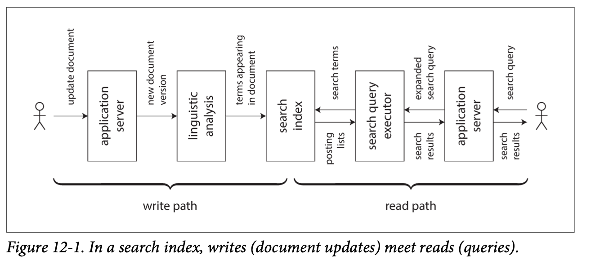

# 데이터 시스템의 미래 

지금까지는 현재 존재하는 것을 설명하는데 할애 했다면 이번 장은 미래에는 **어떻게 돼야 하는지** 를 설명한다.<br/>
이 책의 목적은 어플리케이션과 시스템을 **신뢰할 수 있고 확장가능하며 유지보수 하기 쉽게** 만드는 방법을 탐구하는 것이다.<br/>
예를들어 신뢰성에 도움을 주는 내결함성 알고리즘, 확장성을 위한 파티셔닝, 유지보수를 위한 진화와 추상화 메커니즘을 이전에 설명했다.<br/>
이번 장에서는 그것들을 기반으로 미래를 고찰한다.<br/>

## 데이터 통합 
이 책에서 어떤 문제에 대한 몇 가지 해결책을 놓고 장단점, 트레이드 오프에 대해서 설명했다.
- 3장 저장소 엔진: 로그 구조화 저장소, B 트리, 컬럼 지향 저장소 
- 5장 복제: 단일 리더, 복수 리더, 리더 없는 접근법 

문제가 주어졌을 때 우리는 특정 접근법 하나를 채택한다.<br/>
선택의 폭이 넓을 경우, 우리는 소프트웨어 제품과 그 제품이 어울리는 환경 사이의 대응관계를 파악해야 한다.<br/>
밴더는 소프트웨어가 적합하지 않는 작업부하에 대해 말하는 것을 꺼린다.<br/>
이전 장에서 트레이드 오프에 대해서 설명했으니 참고하기 바란다.<br/>
<br/>
그러나 대응 관계를 완벽히 파악하더라도 복잡한 어플리케이션에서는 데이터를 여러 방법으로 사용하며, <br/>
그에 적합한 소프트웨어 1개를 매칭하기는 어렵다.<br/>
따라서 여러 다른 소프트웨어를 함께 사용하게 된다.<br/>

### 파생 데이터에 특화된 도구의 결합 
OLTP 데이터베이스와 전문 검색 색인을 통합하는 요구는 일반적이다.<br/>
포스트그레스큐엘 같은 데이터베이스는 전문 색인 기능이 포함되어 있어 간단한 어플리케이션을 만들기에는 적합하지만<br/>
더 복잡한 검색 기능을 지원하기 위해서는 새로운 도구가 필요하다.<br/>
반대로 검색 색인은 지속성 있는 레코드 시스템으로는 일반적으로 적합하지 않다.<br/>
<br/>
448p "시스템 동기화 유지하기" 에서 설명했지만 데이터를 다른 방식으로 표현하는 시스템 수가 늘어날수록 통합하기가 더욱 어렵다.<br/>
<br/>
놀랍게도 "내가 해봤는데 99% 는 X만 있으면 돼" or "99% 는 X가 전혀 필요없어" 라는 얘기를 듣곤한다.<br/>
이런 말은 실제로 유용성 보다는 화자의 경험에 대해 얘기하는 것이라고 생각한다.<br/>
따라서 데이터 통합은 조직의 전체 데이터 플로를 고려할 때 비로소 명확해진다.

### 데이터플로에 대한 추론 
데이터 사본을 여러 저장소 시스템에 유지해야 할 때 **입력과 출력** 을 분명히 할 필요가 있다.
- 어디서 데이터를 처음 기록하는지 
- 어떤 표현형이 어디서 파생되었는지 
- 데이터를 적절한 장소에 형태에 맞게 넣는지 

등에 대해서 충분히 고려해야 한다.<br/>
<br/>
그림 11-4 에서 설명한 것 처럼 어플리케이션에서 직접 데이터베이스, 검색 색인에 기록한다면 <br/>
두 클라이언트가 동시에 보낸 쓰기가 충돌을 일으켜 두 저장소 시스템에서 서로 다른 순서로 데이터를 처리한다.<br/>
이 경우 데이터베이스와 검색 색인이 모두 쓰기의 순서를 결정하는 "책임" 이 없기 때문에 모순된 결정을 내리고 불일치가 발생한다.<br/>
<br/>
모든 쓰기의 순서를 결정하는 단일 시스템이 있다면 쓰기를 같은 순서로 처리해 파생하기가 더 쉬워진다.<br/>
이 방법은 345p "전체 순서 브로드캐스트" 에서 설명한 상태 기계 복제 접근법의 응용이다.<br/>
<br/>
파생 데이터 시스템은 이벤트 로그를 기반으로 갱신하면 결정적이고 멱등성을 지녀 결함에서 복구하기가 쉬워진다.

### 파생 데이터 대 분산 트랜잭션 
서로 다른 데이터 시스템 간 일관성을 유지하는 방법은 351p "원자적 커밋과 2단계 커밋" 에서 설명한 분산트랜잭션이다.<br/>
파생 데이터 시스템은 분산 트랜잭션과 비교해보면 어떨까?<br/>
<br/>
파생 데이터와 분산 트랜잭션은 다른 방식으로 유사한 목표를 달성한다.
- 분산 트랜잭션은 상호 배타적인 잠금을 사용해 쓰기 순서를 결정 (256p "2단계 잠금")
- 분산 트랜잭션은 원자적 커밋을 사용해 변경 효과가 한번만 나타나도록 보장 
- CDC 와 이벤트 소싱은 순서를 결정하는데 로그를 사용한다 
- 로그 기반 시스템은 결정적 재시도와 멱등성을 기반으로 동작 

두 시스템은 큰 차이점이 있다.
- 트랜잭션 시스템은 선형성을 지원 (자신이 쓴 내용 읽기 같은 유용한 기능을 보장) 
- 파생 데이터 시스템은 비동기로 갱신되기 때문에 동시간 갱신 보장을 하지 않음 

<br/>
분산 트랜잭션 비용을 지불할 만한 제한된 환경에서 잘 사용해왔지만<br/>
내 생각으로는 XA 는 결함 대응에 취약하고 성능면에서 나쁘다(357p "현실의 분산 트랜잭션")<br/>
나는 분산 트랜잭션에 더 적합한 프로토콜을 만들 수 있다고 믿는다.<br/>
그러나 그런 프로토콜이 기존 도구와 통합되면서 널리 채택되기는 근시일 내에는 어렵다.<br/>
나는 로그 기반 파생 데이터가 이종 데이터 시스템을 통합하는 가장 좋은 접근법이라고 생각한다.<br/>
다만 선형성은 유용한 기능이다. 따라서 최종적 일관성을 어떻게 다루는지에 대한 지침이 필요하다.<br/>

### 전체 순서화의 제약 
작은 시스템에서 이벤트 로그의 전체 순서를 보장하는 것은 가능하지만 <br/>
시스템이 커지면서 복잡한 작업 부하가 발생함에 따라서 한계가 드러나기 시작한다.
- 전체 순서가 정해진 로그를 구축할 때 순서를 결정하려면 모든 이벤트가 **단일 리더 노드** 를 통해야 한다 
  - 그러나 단일 노드가 처리 할 수 있는 양을 넘어선다면 파티셔닝이 필요하고 순서를 결정하는 것은 어렵다 
- 서버가 **지역적으로 분산된** 여러 데이터 센터에 구성되었다면 각 데이터센터에 리더를 둔다 
  - 데이터 센터를 거쳐 동기식 코디네이션 하는 것은 비효율적이기 때문이다 
  - 즉 서로 다른 데이터 센터에서 나온 이벤트는 순서가 정해지지 않았다는 의미이다
- 어플리케이션을 마이크로서비스로 배포한다고 하면 각 서비스는 지속적인 상태 정보를 독립적인 단위로 배포하고 상태를 공유하지 않는다 
  - 따라서 두 이벤트가 서로 다른 서비스에서 발생했다면 순서가 없다 
- 클라이언트 측에서 상태를 유지하는 서비스는 이벤트의 순서가 클라이언트와 서버가 다를 확률이 높다 

이벤트의 순서를 결정하는 것을 공식적인 용어로 **전체 순서 브로드캐스트** 라고 한다.<br/>
전체 순서 브로드캐스트는 합의와 동등하다.(363p "합의 알고리즘과 전체 순서 브로드캐스트")<br/>
합의 알고리즘은 기본적으로 단일 노드에서 전체 이벤트 처리가 가능하다는 가정이 있다.<br/>
여러 노드에 걸친 전체 이벤트 처리를 위한 합의 알고리즘 설계는 아직 해결되지 않은 연구과제다.<br/>


### 인과성 획득을 위한 이벤트 순서화 
이벤트 간 인과성이 없는 경우 전체 순서가 정해지지 않아도 큰 문제가 아니다.<br/>
임의로 순서를 정할 수 있기 때문이다.<br/>
그러나 때로는 인과성이 미묘한 방식으로 발생하기도 한다(337p "순서와와 인과성")<br/>
<br/>
예를들어 SNS 에서 관계를 맺은 두 사용자가 방금 관계를 끊었다고 하자.<br/>
사용자 한명이 친구 관계를 삭제하고 남은 친구들에게 삭제한 친구에 대해 불평하는 메시지를 보냈다.<br/>
이 사용자의 의도는 친구 관계를 끊은 사용자가 이 메시지를 보지 않기를 원했다.<br/>
<br/>
그러나 친구 상태를 저장하는 곳과 메시지를 저장하는 곳이 다른 시스템에서는 **친구 끊기** 이벤트와 **메시지 보내기** 이벤트 사이의 의존성이 없다.<br/>
인과성이 없다면 메시지 보내기 이벤트가 먼저 발송되어서 잘못된 친구에게 메시지가 전송될 수 있다.<br/>
이 예제에서 알림은 결과적으로 메시지와 친구 관계를 조인한 것으로 473p "조인의 시간 의존성" 과 관련이 있다.<br/>
이 문제를 간단히 해결하는 방법은 없고 해결을 위한 출발점 몇 가지를 보자
- 논리적 타임스탬프를 사용하면 코디네이션 없이 전체 순서화를 지원(341p "일련번호 순서화") 할 수 있지만 여전히 수신자가 잘못된 순서로 전달된 이벤트를 처리해야 하고 추가로 메타 데이터를 전달해야 한다
- 사용자가 결정을 내리기 전에 사용자가 본 시스템 상태를 기록하는 이벤트를 로깅할 수 있고 해당 이벤트에 고유 식별자를 부여할 수 있다면 이벤트 식별자를 참조해서 인과적 의존성을 표현할 수 있다 
- 충돌 해소 알고리즘(175p "자동 충돌 해소")은 예상치 못한 순서로 전송된 이벤트를 처리하는데 도움을 준다. 이 알고리즘은 활동에 외부 부수효과(사용자에게 알림을 보내는 작업 등) 가 있다면 도움이 되지 않는다 

### 일괄 처리와 스트림 처리 
나는 데이터 통합의 목표는 데이터를 올바른 장소에 올바른 형태로 두는 것이라고 생각한다.<br/>
그렇게 하기 위해서 입력을 적절한 형태로 바꾸거나 필터링하여 적절한 출력을 만들어야 한다.<br/>
일괄 처리와 스트림 처리의 출력은 파생 데이터 셋이다. <br/>
10장, 11장에서 설명한 것 처럼 일괄 처리와 스트림 처리는 여러 공통 원리가 있다.<br/>
주요 차이점은 스트림 처리는 끝이 없는 데이터셋 상에서 운영되는 반면 일괄 처리는 유한한 크기의 입력을 사용하는 것이다.<br/>
- 스파크는 일괄 처리 엔진 상에서는 스트림을 처리하는데 스트림을 **마이크로 일괄처리** 단위로 나누어 처리한다
- 아파치 플링크는 스트림 처리 엔진 상에서 일괄 처리를 수행한다 

### 파생 상태 유지 
일괄 처리는 함수형 프로그래밍 언어를 사용하지 않아도 함수형 특징을 가진다.<br/>
일괄 처리는 결정적이고 출력이 입력에만 의존하며 다른 부수효과가 없는 순수 함수를 장려하며 입력을 불변으로 간주하고 출력은 추가 전용으로만 사용한다.<br/>
입력과 출력을 잘 정의한 결정적 함수의 원리는 내결함성에 도움이 될 뿐 아니라(475p "멱등성") 데이터플로 추론을 단순화한다.<br/>
데이터 파이프라인은 함수형 어플리케이션 코드를 통해 한 시스템의 상태 변화를 밀어 넣고 그 결과를 파생 시스템에 적용한다.<br/>
파생 데이터 시스템은 관계형 데이터베이스가 색인할 테이블에 보조색인을 갱신하는 것처럼 동기식으로 운영할 수 있다.<br/>
하지만 비동기 방식을 사용하면 이벤트 로그 기반 시스템을 훨씬 견고하게 만든다.<br/>
비동기 방식은 결함이 국소적으로 남아있게 해준다.<br/>
반면 분산 트랜잭션은 일부가 실패하면 어보트하기 때문에 나머지 시스템으로 실패가 확산되어 실패가 증폭되는 경향이 있다.(360p "분산 트랜잭션의 제약")<br/>

### 어플리케이션 발전을 위한 데이터 재처리
파생 데이터를 유지할 때 일괄 처리와 스트림 처리는 모두 유용하다.<br/>
스트림 처리를 이용하면 입력의 변화를 빠르게 파생 뷰에 반영할 수 있다.<br/>
일괄 처리는 누적된 상당한 양의 과거 데이터를 재처리해 기존 데이터셋을 반영한 새 파생 뷰를 만들수 있다.<br/>
<br/>
기존 데이터를 재처리하는 것은 시스템을 유지보수하기 좋은 메커니즘으로 기능 추가와 변경된 요구사항에 대응할 수 있다.<br/>
재처리를 하지 않고 스크마를 변경하는 것은 선택된 필드를 추가하는 것과 같은 간단한 작업으로 제한된다.(39p "문서 모델에서의 스키마 유연성")<br/>
파생 뷰를 사용하면 점진적 발전이 가능하다.<br/>
데이터를 재처리함으로써 이전 뷰와 새로운 뷰을 함께 유지하고 기존 뷰를 제공하면서도 일부 사용자에게 새로운 뷰를 제공할 수 있다.<br/>
점진적 이전의 장점은 처리의 특정 단계가 잘못되었을 떄 쉽게 이전으로 돌릴 수 있다는 점이다.

### 람다 아키텍처
람다 아키텍처는 일괄 처리를 과거 데이터를 재처리 하는데 사용하고 스트림 처리를 최근 갱신 데이터를 처리하는데 사용하는 방법이다.<br/>
핵심 아이디어는 입력 데이터를 불변 이벤트로서 증가하기만 하는 데이터 셋에 추가하는 방식으로 기록해야 한다는 것으로 이벤트 소싱과 유사하다.<br/>
람다 아키텍처는 두 개의 다른 시스템을 병행해서 운용하기를 제안한다.<br/>
- 하둡 맵리듀스 같은 일괄 처리 시스템과 스톰 같은 분리된 스트림 처리 시스템을 함께 운용

<br/>
람다 아키텍처 접근법

- 스트림 처리자는 이벤트를 소비해 근사 갱신을 뷰에 빠르게 반영한다.
- 이후 일괄 처리자가 같은 이벤트 집합을 소비해 정확한 버전의 파생 뷰에 반영한다.

람다 아키텍쳐의 설계 배경은 일괄처리는 간단해서 버그가 생길 가능성이 적은 반면 스트림 처리는 신뢰성이 떨어지고 내결함성을 확보하기 어렵다는 것이다.<br/>
람다 아키텍쳐는 데이터 시스템 설계를 향상 시키는 데 영향을 준 아이디어였다.<br/>
불변 이벤트 스트림에 대한 뷰를 파생하고 필요할 때 이벤트를 재처리하는 원리를 보급했다.<br/>
하지만 나는 람다 아키텍쳐에는 실질적 문제가 몇 가지 있다고 생각한다.
- 일괄 처리와 스트림 처리 양쪽에서 같은 로직을 유지해야 하는 상당한 노력이 필요하다.(디버깅, 튜닝, 운영상 복잡성)
- 스트림 파이프라인과 일괄 처리 파이프라인은 다른 출력을 생산하기 때문에 사용자 요청에 따라 출력을 병합해야 한다(조인이나 세션화 같은 복잡한 연산이 필요한 뷰는 출력이 시계열이 아니라면 어렵다)
- 과거 데이터를 재처리 할 수 있는 점은 훌륭하지만 대용량 데이터 셋에서 그 일을 자주 수행한다면 그 비용도 적지 않다.

### 일괄 처리와 스트림 처리의 통합
최근에는 같은 시스템에서 일괄 처리 연산과 스트림 연산을 모두 구현함으로써 람다 아키텍처의 단점을 빼고 장점만 취할 수 있게 하는 작업이 진행되고 있다.<br/>
한 시스템에서 일괄 처리와 스트림 처리를 통합하려만 아래 기능들이 필요하다
- 최근 이벤트 스트림을 다루는 처리 엔진에서 과거 이벤트를 재생하는 능력 (메시지 브로커는 메시지를 재생하는 능력)
- 스트림 처리자에서 사용되는 정확히 한 번 시맨틱 (결함이 발생해도 결함이 없었던 것처럼 동일한 출력을 보장)
- 이벤트 시간 기준으로 윈도우를 처리하는 도구 

## 데이터베이스 언번들링 
데이터베이스는 특정 데이터 모델의 레코드로 데이터를 저장한다.<br/>
반면 OS는 데이터를 파일로서 파일 시스템에 저장한다.<br/>
양쪽 모두 "정보 관리" 시스템이다. 10장에서 설명한 것 처럼 하둡 생태계는 유닉스의 분산 버전과 비슷하다.<br/>
유닉스와 관계형 데이터베이스는 정보 관리 문제는 다른 철학으로 접근했다.
- 유닉스는 논리적이지만 저순준인 하드웨어 추상화를 프로그래머에게 제공하는 목적 
- 관계형 데이터베이스는 디스크 상의 자료구조, 동시성, 장애 복구 등 복잡성을 감추는 고수준의 추상화를 프로그래머에게 제공하려고 했다 

어느 것이 더 좋을까 ?<br/>
당연하게도 무엇을 원하는지에 따라 다르다.<br/>
유닉스와 관계형 데이터베이스 사이의 긴장감은 수 세기 동안 지속됐고 해결되지 않았다.<br/>
이를테면 나는 NoSQL 을 유닉스의 저수준 추상화 접근법을 분산 OLTP 데이터 저장소 분야로 적용하려는 움직임으로 해석한다.<br/>

### 데이터 저장소 기술 구성하기 
이 책에서 데이터베이스가 제공하는 다양한 기능을 설명하고 어떻게 동작하는지를 설명했다.
- 보조 색인은 필드 값을 기반으로 레코드를 효율적으로 검색할 수 있는 기능 
- 구체화 뷰는 질의 결과를 미리 연산한 캐시의 일종
- 복제 로그는 데이터의 복사본을 다른 노드에 최신 상태로 유지하는 기능 
- 전문 검색 색인은 텍스트에서 키워드 검색을 가능하게 하는 기능 

10장, 11장에서도 비슷한 주제가 등장했다.<br/>
407p "일괄 처리 워크플로의 출력" 에서 전문 검색 색인을 구축하는 방법, 464p "구체화 뷰 유지하기" 에서 구체화 뷰를 유지하는 방법, 405p "변경 데이터 캡처" 에서 DB 변경 사항을 파생 데이터 시스템으로 복제하는 방법
<br/>
데이터베이스에 내장된 기능과 일괄 처리와 스트림 처리로 구축하는 파생 시스템 사이에는 유사점이 있다.

### 색인 생성하기
관계형 데이터베이스에 색인을 생성하기 위해 ```CREATE INDEX``` 를 실행 했을 때 무슨 일이 일어나는지 생각해보자.
- 테이블의 일관된 스냅숏을 사용해 스캔하고
- 색일할 필드 값을 모두 골라 정렬하고 색인에 기록한다
- 그 다음에는 일관된 스냅숏을 만든 이후에 실행된 쓰기의 백로그를 처리한다 
- 색인 생성을 완료하면 데이터베이스는 트랜잭션이 테이블에 쓸 때마다 꾸준히 색인에 반영해야 한다 

이 과정은 새 팔로워 복제본을 구축하는 과정과 대단히 비슷하다.(157p "새로운 팔로워 설정")<br/>
스트림 시스템에서 변경 데이터 캡처의 예비 과정과도 상당히 유사하다.(452p "초기 스냅숏")<br/>

### 모든 것의 메타 데이터베이스 
이런 관점에서 내게는 조직의 데이터 플로가 거대한 데이터베이스처럼 보이기 시작했다.<br/>
데이터를 특정 형태에서 다른 장소에 있는 다른 형태로 바뀌 전송할 때마다 색인이나 구체화 뷰를 최신으로 유지하는 데이터베이스의 하위 시스템과 동일하게 동작한다.<br/>
유사한 관점으로 일괄 처리와 스트림 처리는 트리거와 스토어드 프로시저 그리고 구체화 뷰 유지 루틴을 정교하게 구현한 것과 같다.<br/>
파생 데이터 시스템이 만든 파생 데이터는 마치 다양한 색인 유형과 비슷하다.<br/>
파생 데이터 시스템 아키텍처가 등장하면서 통합된 데이터베이스로 기능을 구현하지 않고 여러 장비에서 실행되고 여러 팀에서 관리하는 다양한 소프트웨어를 사용한다.<br/>
<br/>
이런 개발 방법은 미래에 우리를 어디로 데려갈까?<br/>
나는 서로 다른 처리 도구를 사용하지만 하나의 응집된 시스템으로 구성할 수 있는 2가지 길이 있다고 생각힌다.
- 연합 데이터베이스: 읽기를 통합 
  - 연합 데이터베이스 or 폴리스토어 라고 알려진 접근법은 엄청나게 많은 하단 저장소 엔진과 처리 메서드를 통합해 질의하는 인터페이스를 제공한다
- 언번들링 데이터베이스: 쓰기를 통합
  - 다른 여러 시스템을 읽기 전용으로 질의하는 문제를 해결하지만 여러 시스템에 걸친 쓰기를 동기화하기에는 적합하지 않은 해결책이다
  - 단일 데이터베이스 내에서 일관된 색인을 생성하는 것은 내장된 기능이다.
  - 여러 시스템으로 구성됐을 때도 모든 데이터가 올바른 장소에 반영되도록 보장해야 한다. 결함에 직면하더라도 말이다.
  - 저장소 시스템들을 신뢰성 있게 결합하기 쉽게 만드는것은 데이터베이스의 색인 유지 기능을 다른 기술에 걸친 쓰기를 동기화 할 수 있는 방식으로 언번들링하는 방식과 유사하다.
  - 언번들링 접근법은 하나만 잘하는 작은 도구를 사용하는 유닉스 전통을 따른다.
  - 이 도구들은 저수준 API(파이프) 를 통해 통신한다. 또한 고수준 언어를 사용해 구성하는 것도 가능하다.

### 언번들링 동작하게 만들기 
다양한 구성 요소로부터 신뢰할 수 있고, 확장 가능하며, 유지보수 하기 쉬운 시스템을 만든다는 것에서 **연합과 언번들링은 동전의 양면과 같다.** <br/>
- 연합된 읽기 전용 질의는 한 데이터 모델을 다른 모델로 사상해야 한다.
  - 이것은 생각할 부분들이 있지만 궁극적으로 관리가 가능한 문제다.
- 하지만 여러 저장 시스템에 쓰기를 동기화 하는것 (언번들링) 은 연합보다 어려운 엔지니어링 문제라 생각한다.

쓰기를 동기화하는 전통적인 접근법은 이종 저장소 시스템 간 **분산 트랜잭션** 이 필요하다.<br/>
나는 이 방법이 잘못된 해결책이라고 생각한다.(490p "파생 데이터 분산 트랜잭션")<br/>
데이터가 다른 기술 사이의 경계를 오간다면 멱등성을 기반으로 쓰기를 수행하는 비동기 이벤트 로그를 사용하는 편이 분산 트랜잭션 보다 더 강력하고 현실적인 접근법이라고 본다.<br/>
<br/>
예를 들어 분산 트랜잭션은 스트림 처리자 내에서 정확히 한 번 시멘틱을 달성하기 위해 사용 (475p "원자적 커밋 재검토") 할 수 있는데 상당히 잘 작동한다.<br/>
그러나 다른 그룹의 사람들이 만든 시스템이 트랜잭션에 개입하려면 표준 트랜잭션이 없어 통합하기 매우 어렵다. 
- ex) 스트림 처리자에서 키-값 저장소에 데이터를 기록할 때 

멱등적 소비자가 사용하는 순서가 정해진 이벤트 로그(475p "멱등성") 는 단순한 추상화라서 이종 시스템에 걸쳐 구현하기도 더 쉽다.<br/>
로그 기반 통합의 큰 장점은 구성 요소 간 **느슨한 결합** 이다.
- 시스템 수준에서 비동기 이벤트 스트림을 사용하면 시스템이 개별 구성 요소의 장애나 성능 저하가 생겨도 잘 견디게 할 수 있다.
  - 이벤트 소비자가 느리거나 장애가 나면 이벤트 로그는 버퍼링을 하고 생산자와 다른 소비자는 영향없이 계속 작업을 수행한다 
  - 결함 있는 소비자가 해결되면 버퍼링된 메시지를 사용해 따라 잡을 수 있다
  - 결국 데이터는 누락되지 않고 다른 곳에 영향을 주지도 않는다 
  - 반대로 분산 트랜잭션의 동기식 상호작용은 지역적 결함이 대규모 장애로 확대되는 경향이 있다.(360p "분산 트랜잭션의 제약")
- 인적 수준에서 데이터 시스템을 언번들링하면 구성 요소와 서비스를 다른 팀에서 각자 개발하고 개선하도록 독립적으로 유지할 수 있다.
  - 다른 팀 시스템과 인터페이스를 잘 정의하는 방식으로 연동한다면 각 팀은 한 가지 일에 집중 할 수 있다.
  - 이벤트 로그는 강력한 일관성 속성을 캡쳐(지속성과 이벤트 순서화 덕분에) 하는 인터페이스를 제공하고 어떤 데이터에도 적용할 수 있을 정도로 범용적이다.

### 언번들링 대 통합 시스템 
언번들링이 실제로 미래에 사용될 방법이라고 가정해도 현재 형태의 데이터베이스를 대체하지는 못할 것 이다.<br/>
- 데이터 베이스는 여전히 스트림 처리자의 상태를 유지하기 위해 필요하고 일괄 처리와 스트림 처리자의 출력에 대한 질의를 처리하기 위해서도 필요하다. (407p "일괄 처리 워크플로의 출력")
- 전문화된 질의 엔진은 특정 작업부하에 쓰는 용도로 여전히 중요할 것이다. (예를들어 MPP 데이터 웨어하우스의 질의 엔진은 탐구적 분산 질의에 최적화 됐고 어런 종류의 작업부하를 잘 다룬다)

<br/>
여러 다른 인프라에서 수행하는 복잡성도 문제가 될 수 있다.<br/>
학습 곡선과 설정 문제, 운영상에서만 나타나는 특성이 있다.<br/>
따라서 동적 부분을 가능하면 적게 배포해야 유리하다.<br/>
단일 통합 소프트웨어는 설계된 용도에 맞게 사용하면 어플리케이션 코드로 연결한 여러 구성요소를 갖는 시스템보다 뛰어나고 예측 가능한 성능을 낼 수 있다.<br/>
서문에서 언급했듯이 필요하지도 않은 확장성을 고려해 시스템을 구축하는 노력은 전적으로 낭비일 뿐이고 유연하지 못한 설계에 갇힐 수 있다.<br/>
사실 이것은 성급한 최적화의 한 형태다.<br/>
<br/>
언번들링의 목표는 특정 작업부하에 대한 성능 측면에서 개별 데이터베이스와 경쟁하는 것이 아니다.<br/>
몇 개의 다른 데이터베이스를 결합해 단일 소프트웨어로 가능한 것 보다 더 넓은 범위의 작업 부하에 좋은 성능을 달성하기 위함이다.<br/>
411p "하둡과 분산 데이터베이스 비교" 에서 설명한 저장소, 처리 모델의 다양성과 같은 맥락이다.<br/>

### 뭐가 빠졌지 ? 
데이터 시스템을 구성하는 도구는 점점 좋아지고 있다.<br/>
그러나 나는 중요한 부분 하나가 빠졌다고 생각한다.<br/>
아직까지 유닉스 셸(단순하고 선언적인 방법으로 저장소와 처리 시스템을 구성하는)과 동일한 언번들링된 데이터베이스가 존재하지 않는다.<br/>
<br/>
나는 유닉스 파이프와 비슷하게 ```mysql | elasitcsearch``` 로 단순하게 선언할 수 있다면 너무 좋을 것 같다.<br/>
이 선언은 언번들링된 데이터베이스 관점으로 나타낸 것으로 MySQL 모든 문서를 가져와 엘라스틱서치 클러스터에서 이 문서들을 색인한다는 의미이다.<br/>
그 동작은 지속적으로 MySQL 모든 변경 사항을 캡쳐해서 자동으로 검색 색인에 반영할 것이다.<br/>
이 과정에서 맞춤형 어플리케이션 코드는 없다. 이런 종류의 통합은 거의 모든 저장소와 색인 시스템에서 가능해야 한다.<br/>
<br/>
마찬가지로 캐시를 사전 계산하고 좀 더 쉽게 갱신할 수 있으면 좋을 것이다.<br/>
구체화 뷰는 본질적으로 사전 계산된 캐시이다.<br/>
따라서 그래프에 대한 재귀질의와 어플리케이션 로직을 포함한 복잡한 질의에 대한 구체화 뷰를 선언적으로 지정하여 캐시를 만드는 것을 상상할 수 있다.<br/>
이 분야에서 **미분 데이터플로(differential dataflow)** 같은 연구가 진행되고 있다.

### 데이터 플로 주변 어플리케이션 설계 
어플리케이션 코드로 특화된 저장소와 처리 시스템을 조립하는 언번들링 데이터베이스 접근법은 "데이터베이스 인사이드 아웃" 접근법이라고 불린다.
- 내가 2014년 컨퍼런스 발표의 제목으로 사용한 이후 그렇게 불린다.

이 아이디어는 내 생각이 아니며, 여러 다른 사람의 아이디어를 합쳤을 뿐이다.<br/>
오즈와 저틀 같은 데이터 플로 언어와 엘름 같은 함수형 반응형 프로그래밍 언어, 블룸 같은 논리적 프로그래밍 언어와 많은 부분이 겹친다.<br/>
여기서 사용하는 **언번들링** 은 제이 크랩스가 제안한 용어다.<br/>
<br/>
스프레드 시트 조차 주류 프로그래밍 언어 보다 앞선 데이터플로 능력을 보유하고 있다.<br/>
스프레드 시트 에서 한 셀에 수식을 넣으면 입력이 바뀔 때 마다 수식 결과가 자동으로 계산된다.<br/>
이것이 데이터 시스템 수준에서 필요한 기능이다.<br/>
레코드가 변할 때도 색인을 자동으로 갱신하고 의존하는 캐시 뷰나 집계를 자동으로 갱신할 필요가 있다.<br/>
<br/>
따라서 나는 데이터 시스템 대부분이 비지칼크가 1979년에 이미 가지고 있는 기능에서 배울 것이 있다고 생각한다.<br/>
스프레드 시트와 차이점은 데이터 시스템은 내결함성과 확장성이 있어야 하고 지속성있게 데이터를 저장해야 한다는 점이다.<br/>
또한 데이터 시스템은 다른 그룹의 사람들이 개발한 이종 기술과 통합이 가능해야한다.<br/>
나는 이번 절에서 이런 아이디어를 확장해 언번들링 데이터베이스와 데이터플로의 아이디어 주변에서 어플리케이션을 구축하는 몇 가지 방법을 탐구하려 한다.

### 파생 함수로서의 어플리케이션 코드 
데이터 셋이 다른 데이터 셋으로 파생될 때는 변환 함수 몇 가지를 거친다.
- 보조 색인은 단순한 변환 함수를 사용하는 파생 데이터 셋의 일종이다.
- 전문 검색 색인은 언어 감지, 단어 분리, 어간 추출, 기본형 처리, 철자 교정, 동의어 식별 등의 자연어 처리함수를 활용한 효율적인 자료구조를 구축한다.(역색인)
- 머신러닝 시스템에서 모델은 다양한 특징(feature) 추출과 통계 분석 함수를 사용해 학습 데이터로부터 파생된 것으로 간주할 수 있다.
- 캐시는 흔히 사용자 인터페이스에 보여줄 데이터 집합을 포함한다.

파생 데이터 셋을 생성하는 함수가 보조 색인 생성 함수와 같은 표준 함수가 아니라면 사용자 정의 코드를 써서 어플리케이션에서 특화된 측면을 다뤄야 한다.<br/>
많은 데이터베이스가 고군분투하는 곳이 이 사용자 정의 코드다.<br/>
관계형 데이터베이스는 일반적으로 사용자 정의 어플리케이션 코드를 실행하도록 트리거, 스토어드 프로시저, 사용자 정의 함수를 지원하지만 이 기능들은 데이터베이스 설계 이후에 추가된 부분이다.<br/>

### 어플리케이션 코드와 상태의 분리 
이론상 데이터베이스가 OS 와 같이 임의의 어플리케이션 코드를 배포하는 환경이 될 수 있다.<br/>
하지만 실제로 이런 용도로 사용하기에 적합하지 않다고 밝혀졌다.<br/>
데이터베이스는 의존성과 패키지 관리, 버전 컨트롤, 롤링 업그레이드, 발전성, 모니터링, 지표, 네트워크 서비스 호출, 외부 시스템과 통합 등의 어플리케이션 배포 요구사항에 맞지 않는다.<br/>
<br/>
반면 얀, 도커, 쿠버네티스 등과 같은 배포와 클러스터 관리 도구는 어플리케이션 코드를 수행하는 목적으로 설계되었다.<br/>
이 도구들은 데이터베이스의 사용자 정의 함수가 지원하는 것들 보다 더 잘할 수 있다.<br/>
<br/>
오늘날 웹 어플리케이션이 상태 비저장 서비스로 배포된다. 그렇기 때문에 사용자 요청은 어떤 어플리케이션 서버로도 라우트 될 수 있다.<br/>
그리고 응답 결과를 보내고 요청에 대해서는 완전히 잊어버린다.<br/>
이런 배포 양식은 원할 때 서버를 추가하거나 제거하기에 매우 편리하다.<br/>
그러나 **상태는 어딘가에 있어야한다.** 일반적으로 그곳은 데이터베이스가 된다.<br/>
요즘 추세는 상태 관리(데이터베이스)와 상태 비저장 어플리케이션 로직을 분리한다.<br/>
즉 데이터베이스에 어플리케이션 로직을 넣지 않고 어플리케이션에 영구적인 상태를 넣지 않는다.<br/>
웹 어플리케이션에서 데이터베이스는 네트워크를 통해 동기식으로 접근할 수 이는 변경 가능한 공유 변수와 같다.<br/>
<br/>
그러나 대부분의 프로그래밍 언어에서 변경 가능한 변수의 변경을 구독할 수 없다.<br/>
단지 주기적으로 읽어볼 수 밖에 없다.<br/>
**관찰자 패턴** 으로 알려진 알림 기능을 직접 구현할 수 있지만 대부분의 언어는 이 패턴을 내장기능으로 지원하지 않는다.<br/>
따라서 데이터베이스의 변경 사항을 확인하고 싶다면 폴링, 즉 주기적으로 질의를 해야한다.<br/>
변경 데이터 구독은 이제 막 등장하기 시작한 기능이다.(453p "변경 스트림 API 지원")

### 데이터플로: 상태 변경과 어플리케이션 코드 간 상호작용 
데이터 플로 측면에서 어플리케이션을 생각하는 것은 어플리케이션 코드와 상태 관리 간의 관계를 재조정한다는 것이다.<br/>
데이터 베이스를 어플리케이션 조작하는 변수로 취급하는 대신 상태 변경과 그 상태 변경을 처리하는 코드 간의 상호 작용에 대해서 생각해 볼 수 있다.<br/>
어플리케이션 코드는 상태 변화를 트리거해 다른 곳의 상태 변화에 응답한다.<br/>
448p "데이터베이스와 스트림" 에서 데이터베이스 변경 로그를 구독 가능한 이벤트 스트림으로 취급하는 내용을 설명했다.<br/>
액터와 같은 메시지 전달 시스템 또한 이러한 이벤트 응답의 개념을 갖고 있다.<br/>
1980년 대에 이미 튜플 공간 모델에서 상태 변화를 관찰해 변화에 반응하는 과정의 측면으로 분산 연산을 표현하는 방법을 연구했다.<br/>
<br/>
위에서 설명한 것 처럼 데이터의 변경으로 트리거가 발생하여 어플리케이션이 변경을 처리하는 것은 보조색인을 갱신하는 것과 비슷하다.<br/>
데이터베이스 언번들링의 의미는 위 아이디어를 채택해 파생 데이터 셋을 생성할 수 있다는 뜻이다.
<br/>
가장 명심해야 할 점은 파생 데이터를 유지하는 것이 전통 메시징 시스템의 설계 목적인 비동기 작업 실행과는 같지 않다는 것이다.
- 파생 데이터를 유지할 때 상태 변경 순서가 중요할 때가 있다.
  - 여러 뷰가 한 이벤트 로그로 부터 파생된다면 뷰 간의 서로 일관성을 유지하기 위해 같은 순서로 이벤트를 처리할 필요가 있다.
  - 442p "확인 응답과 재전송" 에서 설명한 것 처럼 응답을 받지 못한 메시지를 다시 전달할 때 많은 메시지 브로커가 이런 속성을 갖고 있지 않다. (이중기록도 마찬가지)
- 내결함성은 파생 데이터의 핵심이다.
  - 메시지 하나를 잃는 것만으로 파생 데이터 셋이 영구적으로 데이터 원본과 동기화가 깨진다.
  - 메시지 전달과 파생 상태 갱신 양쪽 모두 신뢰성이 있어야 한다.

메시지 순서화와 내결함성이 있는 메시지 처리는 엄격한 요구사항이지만 분산 트랜잭션 보다 훨씬 저렴하면서 탄탄한 운영을 가능하게 한다.<br/>
최신 스트림 처리자는 대규모로 순서화와 신뢰성 보장을 제공한다.<br/>
그리고 스트림 처리자에서 어플리케이션 코드를 스트림 연산자로 실행할 수 있다.

### 스트림 처리자와 서비스 
최근 유행하는 어플리케이션 개발 스타일은 각 기능을 REST API 같은 동기 네트워크 요청을 통해 통신하는 서비스 집합으로 나누는 것이다.<br/>
단일 일체형 어플리케이션에 비해 서비스 지향 아키텍처의 가장 큰 장점은 느슨한 연결을 통한 조직적 확장성이다.<br/>
스트림 연산자로 데이터플로 시스템을 구성하는 것은 마이크로 서비스 접근법과 유사한 특징이 많다.<br/>
마이크로 서비스 접근법이 동기식 요청/응답 상호작용을 사용하지만 스트림 연산자로 구성한 시스템은 단방향 비동기식 메시지 스트림을 사용하는 점이 다르다.<br/>
<br/>
향상된 내결함성 외에도 데이터플로 시스템은 뛰어난 성능을 낼 수 있다.<br/>
예를들어 소비자가 특정 통화로 가격이 매겨진 상품을 구매했지만 지불은 다른 통화로 했다고 가정하자.<br/>
통화 변환을 위해서는 환율을 알아야 한다. 이 것은 2가지 방법으로 구현이 가능하다.
1. 마이크로 서비스 접근법에서 구매 처리 코드는 특정 통화의 현재 환율을 얻기 위해서 환율 서비스나 데이터베이스를 질의한다.
2. 데이터플로 접근법에서 구매 처리 코드는 미리 환율 갱신 스트림을 구독하고 환율이 바뀔때 마다 로컬 데이터베이스에 환율을 기록한다. 따라서 환율을 로컬 데이터베이스에 질의하여 얻는다. 

데이터 플로 접근법이 빠를 뿐 아니라 다른 서비스 장애에도 훨씬 잘 버틸 수 있다.<br/>
가장 신뢰성 있는 네트워크 요청은 네트워크 요청을 전혀 하지 않는 것이다.<br/>
이제 RPC 를 대신해 구매 이벤트와 환율 갱신 이벤트 간의 스트림 조인이 생겼다.<br/>
이 조인에는 시간 의존성이 있다.<br/> 
구매 이벤트를 이후 시점에 재처리한다면 환율을 변경됐을 것이다.<br/>
원래 출력이 다시 나오기를 원한다면 구매 시점의 과거 환율을 얻어야 한다.<br/>
이런 시간 의존성은 환율 서비스에 질의를 하든 환율 갱신 스트림을 구독하든 상관없이 다뤄야 한다.(473p "조인의 의존성")<br/>
시간 의존성 조인과 관련된 문제 등 아직 해결되지 않은 문제들이 많지만 나는 데이터플로 아이디어를 사용해 어플리케이션을 구축하는 것은 매우 유망한 방법이라 생각한다.

### 파생 상태 관찰하기 
데이터플로 시스템은 검색 색인이나 구체화 뷰 또는 예측 모델과 같은 파생 데이터 셋을 생성하고 최신 상태로 유지하는 과정에 사용할 수 있다.<br/>
이 과정을 **쓰기 경로** 라고 부르자. 시스템에 정보를 기록할 때마다 일괄 처리와 스트림 처리의 단계를 거쳐 모든 파생 데이터 셋에 통합해 갱신한다.<br/>

 <br/>

그런데 애초에 파생 데이터 셋은 왜 생성할까?<br/>
다시 질의할 가능성이 크기 때문이다. 이것이 **읽기 경로** 이다.<br/>
읽기 경로와 쓰기 경로를 종합하면 데이터를 수집하는 지점에서 데이터를 소비하는 지점까지 데이터의 모든 여정을 포함한다.<br/>
- 쓰기 경로는 데이터의 여정 중에서 미리 계산된 부분이다. (eager evaluation)
- 읽기 경로는 데이터의 여정 중에서 누군가 요청했을 때만 발생하는 부분이다. (lazy evaluation)

### 구체화 뷰와 캐싱 
전문 검색 색인은 좋은 예제이다.<br/>
쓰기 경로는 색인을 갱신하고 읽기 경로는 색인을 사용해 키워드를 찾는다.<br/>
색인이 존재하지 않는다면 검색 질의는 모든 문서를 스캔해야 해며 문서량이 많다면 상당한 비용이 드는 작업이다.<br/>
모든 가능한 질의 검색 결과를 미리 계산해 놓는다고 가정해보자.<br/>
이 경우 읽기 경로에서 처리할 작업량은 줄어들지만 쓰기 경로에 많은 비용이 발생한다.<br/>
질의의 집합은 무한하다. 따라서 모든 가능한 검색 결과를 미리 계산하는 것은 어렵다.<br/>
<br/>
따라서 고정된 가장 공통적인 질의 집합의 검색 결과를 미리 계산해 두는 방법이 있다.<br/>
이 방법을 구체화 뷰라고 부를 수도 있다. <br/>
공통 질의 중 하나의 결과에 포함해야 하는 새 문서가 나타낼 때 갱신돼야 하기 때문이다.<br/>
일반적으로 공통 질의 캐시라고 부른다.<br/>
캐시와 색인 그리고 구체화 뷰는 읽기 경로와 쓰기 경로 사이의 경계를 옮기는 단순한 역할을 한다.<br/>
이런 파생 데이터 셋을 사용하면 쓰기 경로에서 더 많은 일을 수행해 읽기 경로의 작업이 줄어든다.

### 오프라인 대응 가능한 상태 저장 클라이언트 
지난 20년 간 웹 어플리케이션은 대단한 인기를 끌었고 인기 때문에 당연하다고 생각하기 쉬운 웹 어플리케이션에 관한 몇 가지 가정이 생겼다.<br/>
클라이언트는 대체로 상태 비저장이고 서버가 데이터를 관장하는 클라이언트/서버 모델은 너무 일반적이다.<br/>
그러나 최근 "단일 페이지" 자바스크립트 웹은 클라이언트 측 로컬 저장소를 이용한 상태 저장 능력을 얻었다.<br/>
마찬가지로 모바일 앱은 상태를 모바일 장치에 저장할 수 있고 사용자 상호작용 대부분을 처리할 때 서버까지 왕복할 필요가 없다.<br/>
오프라인 우선 어플리케이션에 관심을 불러일으켰다. <br/>
오프라인 우선 어플리케이션은 인터넷 연결 없이 장치의 로컬 데이터베이스를 이용해서 많은 일을 하고 네트워크 연결이 가능할 때 백그라운드에서 원격 서버와 동기화한다.<br/>
이 방식은 사용자 인터페이스가 네트워크 요청을 동기식으로 기다리지 않아도 되고 오프라인 작동하기 때문에 사용자에게 상당한 이점이다.<br/>
사용자 장치에서 상태를 유지하는 쪽으로 나아가면 새로운 기회가 있는 세상이 열린다.<br/>
장치 상 상태를 서버 상 상태 캐시로 볼 수 있다.<br/>

### 상태 변경을 클라이언트에게 푸시하기 
웹 브라우저에서 웹 페이지가 로드된 후 데이터가 변경되면 페이지가 새로 로드할 때 까지 변경사항을 알 수 없다.<br/>
브라우저는 특정 시점의 데이터만 읽고 해당 데이터는 정적이고 갱신사항을 구독하지 않는다.<br/>
변경사항을 폴링하지 않으면 장치의 상태는 갱신되지 않은 신선도가 떨어지는 캐시이다.<br/>

최신 HTTP 프로토콜은 기본적인 요청/응답 패턴을 벗어나고 있다.<br/>
서버 전송 이벤트(이벤트 소스 API)와 웹소켓은 브라우저가 서버와 TCP 접속을 유지하면서 서버가 주도적으로 메시지를 보내는 통신 채널을 제공한다.<br/>
서버는 저장된 상태에 변경이 발생했을 때 주도적으로 클라이언트 측 최신상태가 되도록 해줄 수 있다.<br/>
<br/>
쓰기 경로와 읽기 경로 모델 측면에서 상태 변화를 클라이언트 장치에게까지 푸시하면 쓰기 경로가 최종 사용자까지 확장된다.<br/>
클라이언트를 처음 초기화할 때 초기 상태를 읽기 경로를 이용하고 이후에는 서버가 보내주는 상태 변경 스트림만 따르면된다.<br/>
장치가 오프라인이라서 상태 변경 알림을 받지 못할 수 있다.<br/>
그러나 이 문제는 "소비자 오프셋" 에서 이미 해결했다.<br/>
로그 기반 메시지 브로커를 사용하는 소비자가 접속이 실패하거나 끊긴 이후 어떻게 재접속하고 접속이 끊겼을 동안 메시지를 빠짐없이 받을 수 있는 지를 설명했다.<br/>

### 종단 간 이벤트 스트림 
상태 저장 클라이언트와 사용자 인터페이스 개발용 최신 도구는 내부적으로 사용자 입력을 표현하는 이벤트 스트림이나 서버 응답 스트림을 구독하는 방식을 사용해 클라이언트 측 상태를 관리한다.
(엘름 언어, 리액트, 플럭스, 리덕스)<br/>
이 방식은 구조적으로 이벤트 소싱과 비슷하다.(454p "이벤트 소싱)<br/>

서버가 상태 변경 이벤트를 클라이언트 측 이벤트 파이프라인으로 푸시하게끔 프로그래밍 모델을 확장 할 수 있다.<br/>
상태 변경이 트리거된 한 장치의 상호작용으로부터 이벤트 로그를 거쳐 여러 파생 데이터 시스템과 스트림 처리자를 통해 다른 장치의 사용자 인터페이스까지 이어진다.<br/>
이런 상태 변경이 전파되는 지연 시간은 상당히 낮고 대게 1초 이하로 끝난다.<br/>

그런데 왜 모든 어플리케이션이 이런 방식으로 구축하지 않을까 ?<br/>
문제는 상태 비저장 클라이언트와 요청/응답 방식의 상호작용이 데이터베이스, 라이브러리, 프레임워크, 프로토콜에 뿌리 깊게 배어 있기 때문이다.<br/>
많은 데이터스토어가 요청 하나에 응답 하나를 하는 읽기 쓰기 연산을 지원하지만 변경 사항 구독 기능을 지원하는 스토어는 드물다.<br/>

쓰기 경로를 최장 사용자까지 확장한다면 시스템을 구축하는 방식을 제고할 필요가 있다.<br/>
즉 요청/응답 상호작용 방식에 벗어나 발행/구독 데이터 플로 방식으로 변경해야 한다는 의미이다.<br/>
나는 더 반응성이 있는 사용자 인터페이스를 지원하고 더 나은 오프라인 지원을 하기 위해 들이는 노력이 가치있다고 생각한다.<br/>
데이터시스템을 설계한다면 현재 상태를 질의하는 방식이 아니라 변경 사항을 구독하는 방식을 염두에 둬야 한다고 생각한다.

### 읽기도 이벤트다

### 다중 파티션 데이터 처리 

## 정확성을 목표로 

### 데이터베이스에 관한 종단 간 논증 

### 연산자의 정확히 한 번 실행 

### 중복 억제 

### 연산 식별자

### 종단 간 논증 

### 종단 간 사고를 데이터 시스템에 적용하기 

### 제약 조건 강제하기 

### 유일성 제약 조건은 합의가 필요하다 

### 로그 기반 메시징의 유일성 

### 다중 파티션 요청 처리 

### 적시성과 무결성 

### 데이터 플로 시스템의 정확성 


### 느슨하게 해석되는 제약 조건 

### 코디네이션 회피 데이터 세스템

### 믿어라. 하지만 확인하라 

### 소프트웨어 버그가 발생해도 무결성 유지하기 

### 약속을 맹목적으로 믿지 마라.

### 검증하는 문화 

### 감사 기능 설계

### 다시 종단 간 논증 

### 감사 데이터 시스템용 도구 

## 옳은 일 하기 

### 예측 분석 

### 편견과 차별

### 책임과 의무 

### 피드백 루프 

### 사생활 추적

### 감시 

### 동의와 선택의 자유

### 사생활과 데이터 사용

### 자산과 권력으로서의 데이터

### 산업 혁명의 기억 

### 법률과 자기 규제 


