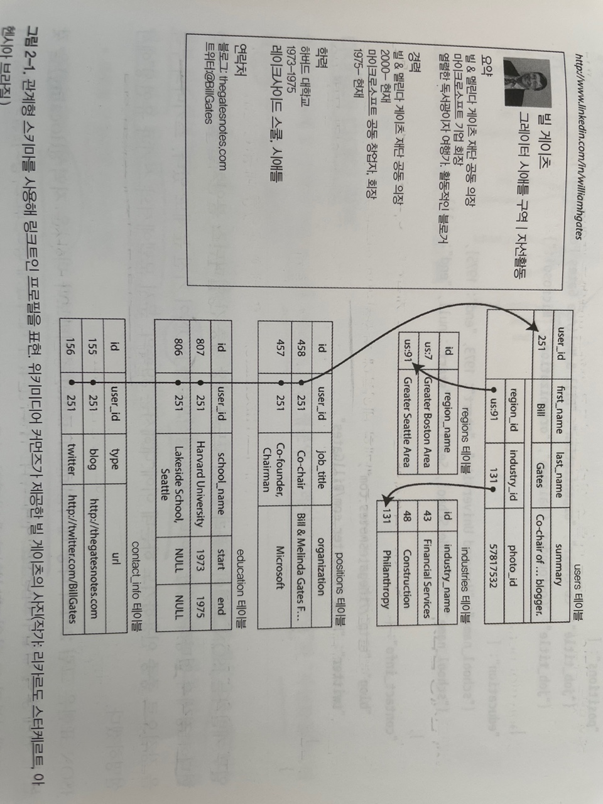
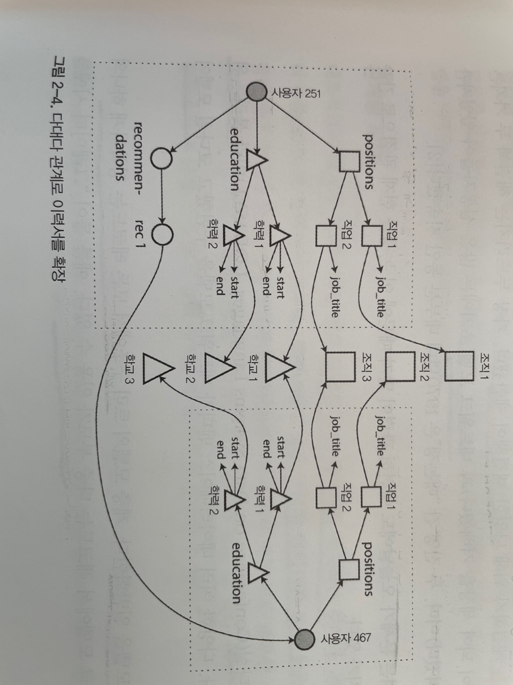

# 2장 데이터 모넬과 질의 언어 

- 데이터 모델은 소프트웨어 개발에서 제일 중요한 부분
- 데이터 모델은 **문제를 어떻게 해결해야 하는지에** 대해서도 큰 영향을 미침 
  
대부분의 어플리케이션 여러 데이터 모델을 계층을 둬서 만든다 
- 개발자는 현실의 구조를 다루는 API 를 모델링한다 
- 데이터 구조 저장하는 방법은 JSON, XML, 관계형 데이터 베이스의 테이블, 그래프 모델 등이 있다 
  
## 관계형 모델과 문서 모델 

오늘날 가장 잘 알려진 데이터 모델은 1970년도에 에드가 코드(Edgar Codd)가 제안한 관계형 모델을 기반으로 한 SQL이다.  
데이터는 **관계**로 구성되고 각 관계는 순서 없는 **튜플** 모음이다.  
관계형 데이터 베이스에 근원은 1960 ~ 1970 년대에 **비즈니스 데이터 처리** 에 있다. 이 사례는 보통 **트랜잭션 처리**와 **일괄 처리**로 오늘날 일상적으로 수행되는 일이다.  

1970 ~ 1980 년대 초반에는 **네트워크 모델**과 **계층 모델**이 관계형 모델에 대한 대안이었지만 결국 관계형 모델이 우위를 차지했다.  


### NoSQL 탄생 
2010년대에 NoSQL 은 관계형 모델의 우위를 뒤집으려는 최신의 시도다.  
NoSQL 은 Not Only SQL 을 의미한다.  
  
NoSQL 데이터베이스를 채택한 이유 
- 대규모 데이터셋이나 **매우 높은 쓰기 처리량** 달성을 관계형 데이터베이스보다 쉽게 할 수 있다  
- 상용 데이터베이스 제품보다 무료 오픈소스 소프트웨어에 대한 선호도 확산 > NoSQL 은 오픈소스가 많음 
- 관계형 모델에서 지원하지 않는 특수 질의 동작 
- **관계형 스키마의 제한에 대한 불만**과 동적이고 표현력이 풍부한 데이터 모델에 대한 바람 

가까운 미래에는 관계형과 비관계형을 함께 사용할 것이다. 이를 **다중 저장소 지속성(polyglot persistence)**  이라 한다  

### 객체 관계형 불일치 
대부분의 어플리케이션은 객체지향 프로그래밍 언어로 개발한다. 데이터를 관계형 테이블에 저장하려면 어플리케이션 코드와 데이터 베이스 모델 객체(테이블에 매핑되는 객체) 사이에 전환 계층이 필요하다. 이런 모델 사이의 분리를 **임피던스 불일치(impedencae mismatch)** 라고 한다.  
  
Active Record 나 Hibernate 같은 ORM 프레임워크는 전환 계층에 필요한 코드의 양을 줄이지만 두 모델간의 차이를 완벽히 숨길 순 없다. 
  
이력서에 대한 관계형 스키마 예시를 보자  

- 이력서는 user_id 로 식별한다 
- 이름과 달리 직업, 경력은 하나 이상이며 다양할 수 있다.
- 따라서 사용자와 이런 항목들(직업, 경력)은 일대다 관계이다.

이력서 같은 데이터 구조는 모든 내용을 갖추고 있는 **문서** 라서 JSON 표현이 매우 적합하다.  
- 몽고DB, RethinkDB, CouchDB 같은 문서지향 데이터베이스는 JSON 형식을 지원함  
```json
{
    "user_id": 251,
    "first_name": "Bill",
    "last_name": "Gates",
    // 중략 .. 
    "positions": [
        {"job_title": "Co-chair", "organization": "Bill & Medlinda Gates Foundation"},
        {"job_title": "Co-founder, Chairman", "organization": "Microsoft"}
    ],
    // 중략 ..
}
```
- 일부 개발자들은 JSON 모델이 어플리케이션 코드와 저장 계층 간 임피던스 불일치를 줄인다고 생각한다.
- 데이터 부호화 형식으로써 JSON 이 가진 문제점도 있다. (4장에서 설명한다)
- JSON 표현은 다중 테이블 스키마보다 더 나은 지역성(locality)을 갖는다 
    * 관계형 예제에서 이력서를 가져오려면 다중 질의나 조인을 수행해야 한다 
    * JSON 표현에서는 모든 관련 정보가 한 곳에서 있어서 질의 하나로 충분하다 

### 다대일과 대다다 관계 
앞에 관계형 모델의 그림에서 region_id 는 평문인 "그레이터 시애틀 구역" 이 아닌 ID 로 주어졌다.  
ID 와 텍스트 문자열의 저장 여부는 **중복**의 문제이다. ID 를 사용하는 경우 사람에게 의미있는 문자열은 한 곳에 저장하고 (row) 그것을 참조하는 모든것은 ID 를 사용한다. (ID 는 데이터 내에서만 의미가 있음)  
ID 를 사용하는 장점으로는 ID 는 아무런 의미를 갖지 않기 때문에 변경할 필요가 없다.  
하지만 ID 가 의미를 갖게 된다면 언젠가는 ID 를 변경해야 할 수도 있다. 만약 정보가 중복된다면 **모든 중복 항목을 변경해야 한다.** 이것은 쓰기 오버 헤드와 불일치의 위험이 있다.  
  
중복된 데이터를 정규화 하려면 **다대일** 관계가 필요한데 안타깝게도 **다대일관계는 문서모델에 적합하지 않다**.  
관계형 데이터베이스는 조인이 쉽기 때문에 ID 로 다른 테이블의 로우를 참조하는 게 일반적이다.  
문서 데이터베이스는 일대다 트리 구조로 보통 조인이 필요하지 않고 조인에 대한 지원도 약하다.  

데이터베이스가 조인을 지원하지 않으면 어플리케이션 코드에서 조인을 흉내내야 한다.  
어플리케이션 초기 버전이 조인이 없는 문서 모델에 적합하다고 하더라도 어플리케이션에 기능을 추가하면서 **데이터는 점차 상호 연결되는** 경향이 있다.  
  
이전 예제에서 추천서를 작성하는 기능을 추가한다고 해보자.  
- 추천받은 사용자 이력서에는 추천인의 이름과 사진이 함께 보여진다.
- 추천인이 자신의 사진을 갱신하면 모든 추천서에 새로운 사진을 반영해야한다.


- 추천서와 같은 새로운 기능은 위 그림 처럼 **다대다 관계**를 필요로 한다.
- 각 점선 내 데이터는 하나의 문서로 묶을 수 있지만 조직, 학교, 기타 사용자는 참조로 표현해야 하고 질의 할 때는 조인이 필요하다. 

## 문서 데이터 베이스는 역사를 반복하고 있나 ? 
1970 년대 IBM의 정보관리시스템 IMS 는 아폴로 우주 프로그램에서 재고관리를 위해서 개발되었다. 
IMS 는 계층 모델을 사용했고 문서 데이터베이스의 JSON 모델과 비슷하다. 
IMS 는 일대다 관계에서는 잘 동작하지만 다대다 관계 표현은 어려웠다.  

계층의 모델의 한계를 해결하기 위해서 다양한 해결책이 제안됬다. 관계형 모델과 네트워크 모델이 대표적이다.  

### 네트워트 모델 
네트워크 모델은 코다실(CODASYL)이라고 불리는 위원회에서 표준화했다. 
계층 모델의 트리 구조에서 모든 레코드는 정확하게 하나의 부모가 있다.
네트워크 모델에서 레코드는 다중 부모가 있을 수 있다. 

네트워크 모델에서 레코드 간 연결은 외래 키보다는 프로그래밍 언어의 포인터와 더 비슷하다. 
레코드에 접근하는 유일한 방법은 최상위 레코드에서 부터 연결 정보를 따르는 방법이다. (접근경로) 
- 맨 앞 레코드에서 원하는 레코드가 나올때 까지 탐색하는 방법이다.  

이 모델의 문제점은 다중 부모를 갖게 될 경우 어플리케이션 코드는 다양한 관게를 모두 추적해야 한다. (탐색 느림)
그리고 데이터베이스 질의와 갱신을 위한 코드가 복잡하고 유연하지 못했다.  
접근 경로는 변경 할 수 있지만 아주 많은 수작업 데이터베이스 질의 코드를 살펴보고 접근경로 질의를 재작성 해야 했다.  

### 관계형 모델 
대조적으로 관계형 모델은 알려진 모든 데이터를 배치하는 것이다.  
관계(테이블)과 튜플(로우)가 전부다. 따라서 중첩 구조와 데이터를 보고 싶을 때 따라가야 할 복잡한 접근경로가 없다.
임의 조건과 일치하는 로우를 선택해서 읽을 수 있고 다른 테이블과의 관계에 신경 쓰지 않고 테이블에 새 로우를 삽입할 수 있다.  
관계형 데이터베이스에서는 질의 최적화기(Query Optimizer)는 어떤 순서로 질의를 실행할지 결정하고 사용할 색인을 자동을 결정한다.  
네트워크 모델과 가장 큰 차이점은 접근 경로를 개발자가 아닌 **질의 최적화기가 자동으로 만든다**는 점이다.  
  
관계형 모델의 가장 큰 장점으로 질의 최적화기를 한번 만들면 데이터베이스를 사용하는 모든 어플리케이션이 혜택을 받을 수 있다는 점이다.  

### 문서 데이터베이스와의 비교 
문서 데이터베이스는 한 가지 측면에서는 계층모델로 되돌아갔다. 문서 데이터베이스는 별도 테이블이 아닌 상위 레코드 내에 중첩된 레코드를 저장한다.  
하지만 다대일과 다대다 관계를 표현할 관계형 데이터베이스와 문서 데이터베이스는 근본적으로 다르지않다. 둘다 관련 항목은 고유한 식별자로 참조한다.  
관계형 모델의 외래키는 문서 모델에서는 **문서 참조(document reference)** 라 부른다.  


### 관계형 데이터베이스와 문서 데이터베이스 비교 
내결함성과 동시성 처리를 포함해서 고려해야할 점이 많이 있다. 
- 내결함성(5장), 동시성 처리(7장) 에서 설명한다.
이번 장에서는 데이터 모델의 차이점에만 집중해서 비교해본다.  
  
문서 데이터 모델을 선호하는 주요 이유는 스키마 유연성, 지역성에 기인한 더 나은 성능 때문이고 어플리케이션에서 사용하는 데이터 구조와 더 가깝기 때문이다. 
관계형 모델은 조인, 다대일/다대다 관게를 더 잘 지원한다.  

### 어떤 데이터 모델이 어플리케이션 코드를 더 간단하게 할까 ?  
애플리케이션에서 데이터가 문서와 비슷한 구조라면 문서 모델을 사용하는 것이 좋다.
- 일대다 관계 트리로 보통 한 번에 전체 트리를 적재

문서 모델에는 제한이 있다.
- 문서 내 중첩 항목을 바로 참조할 수가 없다.
- 하지만 문서가 너무 깊게 중첩되지 않으면 일반적으로 문제가 되지 않는다.

다대다 관계에서는 문서 모델의 매력이 떨어진다.
- 애플리케이션에서 조인을 흉내내어야 하는데 데이터베이스에서 수행하는 조인보다 성능이 떨어진다.

일반적으로 어떤 데이터 모델이 애플리케이션 코드를 더 간단하게 만드는지 말할 수 없다.
- 데이터 항목 간에 존재하는 관계 유형에 따라 다르다.
- **상호 연결이 많은 데이터** 의 경우 문서 모델은 곤란하지만 **관계형 모델은 무난** 하며 **그래프 모델은 매우 자연스럽다**.

### 문서 모델에서의 스키마 유연성
- 쓰기 스키마(schema-on-write) : 데이터를 쓸 때 데이터의 유효성을 검사.
  - 프로그래밍 언어에서 **정적(컴파일 타임) 타입 확인** 과 유사
- 읽기 스키마(schema-on-read) : 데이터를 읽을 때 데이터의 유효성을 검사
  - 프로그래밍 언어에서 **동적(런타임) 타입 확인** 과 유사

`동적 타입`의 데이터베이스 스키마에서는 새로운 필드를 가진 새로운 문서를 작성하기 시작하고 애플리케이션에서는 예전 문서를 읽은 경우를 처리하는 코드만 있으면 된다.
```javascript
if (user && user.name && !user.first_name) {
    // 2013년 12월 8일 이전에 쓴 문서는 first_name이 없음
    user.first_name = user.name.split(" ")[0];
}
```

`정적 타입`의 데이터베이스 스키마에서는 보통 다음 행과 같이 **마이그레이션(migration)** 을 수행한다.
```sql
ALTER TABLE user ADD COLUMN first_name text;
UPDATE users SET first_name = split_part(name, ' ', 1); -- postgresql
UPDATE users SET first_name = substring_index(name, ' ', 1); -- MySQL
```

※ 대부분의 관계형 데이터베이스 시스템은 ALTER TABLE 문을 수 밀리초 안에 수행한다.   
하지만 MySQL은 ALTER TABLE 시 전체 테이블을 복사하기 때문에수 분에서 수 시간까지 중단시간이 발생할 수 있다.
<br>
읽기 스키마 접근 방식은 컬렉션 안의 항목이 어떤 이유로 모두 동일한 구조가 아닐 때 유리하다.
- 다른 여러 유형의 오브젝트가 있고 각 유형의 오브젝트별로 자체 테이블에 넣는 방법은 실용적이지 않다.
- 사용자가 제어할 수 없고 언제나 변경 가능한 외부 시스템에 의해 데이터 구조가 결정된다.
  
이 같은 상황에서는 스키마리스 문서가 더 자연스러운 데이터 모델이다.
하지만 모든 레코드가 동일한 구조라서 예상 가능하다면 스키마가 문서화와 구조를 강제하기 위한 유용한 메커니즘이다.

### 질의를 위한 데이터 지역성
문서는 보통 JSON, XML로 부호호된 단일 연속 문자열이나 JSON 또는 XML의 Binary 데이터로 저장된다.
웹 페이지 상에 문서를 보여주는 동작처럼 애플리케이션이 자주 전체 문서에 접근해야 할때 **저장소 지역성(storage locality)** 을 활용하면 성능 이점이 있다.
- 지역성의 이점은 한 번에 해당 문서의 많은 부분을 필요로 하는 경우에만 적용된다.

일반적으로 문서를 아주 작게 유지하면서 문서의 크기가 증가하는 쓰기를 피하라고 권장한다.
이 성능 제한 때문에 문서 데이터베이스가 유용한 상황이 많이 줄어든다.
<br>
지역성을 위해 관련 데이터를 함께 그룹화하는 개념이 문서 모델에만 국한되지는 않는다는 점이 중요하다.
- Oracle은 다중 테이블 색인 클러스터 테이블(multi-table index cluster table) 기능을 사용해 동일한 특성을 제공한다.
- 빅테이블(Bigtable) 데이터 모델의 칼럼 패밀리(column-family) 개념(카산드라와 HBase에서 사용)이 지역성 관리와 유사항 목적이 있다.

### 문서 데이터베이스와 관계형 데이터베이스의 통합
대부분의 관계형 데이터베이스에서도 XML이나 JSON 문서를 지원한다.
또한, 문서 데이터베이스도 리싱크DB는 질의 언어에서 관계형 조인을 지원하고 몽고DB 드라이버는 자동으로 데이터베이스 참조를 확인한다.
- 실제로 클라이언트 측 조인을 수행한다. 네트워크 왕복이 추가로 필요하고 최적화가 덜 되기 때문에 데이터베이스에서 수행되는 조인보다 느릴수 있다.

관계형 데이터베이스와 문서 데이터베이스는 시간이 지남에 따라 점점 더 비슷해지고 있다.
각 데이터 모델이 서로 부족한 부분을 보완해 나가고 있기 때문이다.
관계형과 문서의 혼합 모델은 미래 데이터베이스들이 가야 할 올바른 길이다.

## 데이터를 위한 질의 언어
SQL은 **선언형** 질의 언어인 반면 IMS와 코다실은 **명령형** 코드를 사용해 데이터베이스에 질의한다.

**명령형 코드**
```javascript
function getSharks() {
    var sharks = [];
    for (var i = 0; i < animals.length; i++) {
        if (animals[i].family === "Sharks") {
            sharks.push(animals[i]);
        }
    }
    return sharks;
}
```

**관계 대수(relational algebra)**
> sharks = σ<sub>family = "Sharks"</sub>(animals)

**SQL**
```sql
SELECT * FROM animals WHERE family = 'Sharks';
```

명령형 언어는 특정 순서로 특정 연산을 수행하게끔 컴퓨터에게 지시한다.
SQL이나 관계 대수 같은 선언형 질의 언어에서는 목표를 달성하기 위한 **방법** 이 아니라 알고자 하는 데이터의 패턴, 즉 결과가 충족해야 하는 조건과 데이터를 어떻게 변환(예를 들어 정렬, 그룹화, 집계)할지를 지정하기만 하면 된다.
<br>
선언형 질의 언어는 일반적으로 명령형 API보다 더 간결하고 쉽게 작업할 수 있기 때문에 매력적이다.
하지만 더 중요한 점은 데이터베이스 엔진의 상세 구현이 숨겨져 있어 질의를 변경하지 않고도 데이터베이스 시스템의 성능을 향상시킬 수 있다는 점이다.
<br>
선언형 언어는 종종 병렬 실행에 적합하다.
오늘날 CPU는 이전보다 훨씬 더 높은 클록 속도로 실행해 빨라지기보다 더 많은 코어를 추가해 빨라지고 있다.
명령형 코드는 명령어를 특정 순서로 수행하게끔 지정하기 때문에 다중 코어나 다중 장비에서 병렬 처리가 매우 어렵다.

### 웹에서의 선언형 질의

- 생략

### 맵리듀스 질의

**맵리듀스(MapReduce)** 는 많은 컴퓨터에서 대량의 데이터를 처리하기 위한 프로그래밍 모델로, 구글에 의해 널리 알려졌다.
이 메커니즘은 많은 문서를 대상으로 읽기 전용(read-only) 질의를 수행할 때 사용한다.
맵리듀스는 여러 함수형 프로그래밍 언어에 있는 map(collect라고도 함)과 reduce(fold나 inject라고도 함) 함수를 기반으로 한다.

**postgresql**
```sql
SELECT date_trunc('month', observation_timestamp) AS observation_month,
    sum(num_animals) AS total_animals
FROM observations
WHERE family = 'Sharks'
GROUP BY observation_month;
```

**MongoDB MapReduce**
```javascript
db.observations.mapReduce(
    function map() {
        var year = this.observationTimestamp.getFullYear();
        var month = this.observationTimestamp.getMonth() + 1;
        emit(`${year}-${month}`, this.numAnimals);
    },
    function reduce(key, values) {
        return Array.sum(values);
    },
    {
        query: {
            family: "Sharks"
        },
        out: "monthlySharkReport"
    }
);
```

예들 들어 observations 컬렉션에 다음의 두 문서가 있다고 가정해보자.

```javascript
{
    observationTimestamp: Date.parse("Mon, 25 Dec 1995 12:34:56 GMT"),
    family: "Sharks",
    species: "Carcharondon carcharias",
    numAnimals: 4
},
{
    observationTimestamp: Date.parse("Tue, 12 Dec 1995 16:17:18 GMT"),
    family: "Sharks",
    species: "Carcharias taurus",
    numAnimals: 4
}
```

**map 함수** 는 각 문서마다 한 번 호출되고 결국 `emit("1995-12", 3)`과 `emit("1995-12", 4)`가 실행된다.
그 뒤에 **reduce 함수** 는 `reduce("1995-12", [3, 4])`로 호출되고 7을 반환한다.
map과 reduce 함수는 **순수(pure)** 함수여야한다.
<br>
클러스터 환경에서 분산 실행을 위한 프로그래밍 모델인 맵리듀스는 상당히 저수준 프로그래밍 모델이다.
질의 중간에 자바스크립트 코드를 사용할 수 있다는 점은 고급 질의가 가능한 훌륭한 기능이지만 맵리듀스에만 해당하는 것은 아니다.
<br>
맵리듀스의 사용성 문제는 연계된 자바스크립트 함수 두 개를 신중하게 작성해야 한다는 점인데 이는 종종 하나의 질의를 작성하는 것보다 어렵다.
더욱이 선언형 질의 언어는 질의 최적화기가 질의 성능을 높일 수 있는 기회를 제공한다.
이런 이유로 MongoDB는 **집계 파이프라인(aggregation pipeline)** 이라 부르는 선언형 질의 언어 지원을 추가했다.

```javascript
db.observation.aggregate([
    {
        $match: {
            family: "Sharks"
        }
    },
    {
        $group: {
            _id: {
                year: {
                    $year: "$observationTimestamp"
                },
                month: {
                    $month: "$observationTimestamp"
                }
            },
            totalAnimals: {
                $sum: "$numAnimals"
            }
        }
    }
]);
```

## 그래프형 데이터 모델
