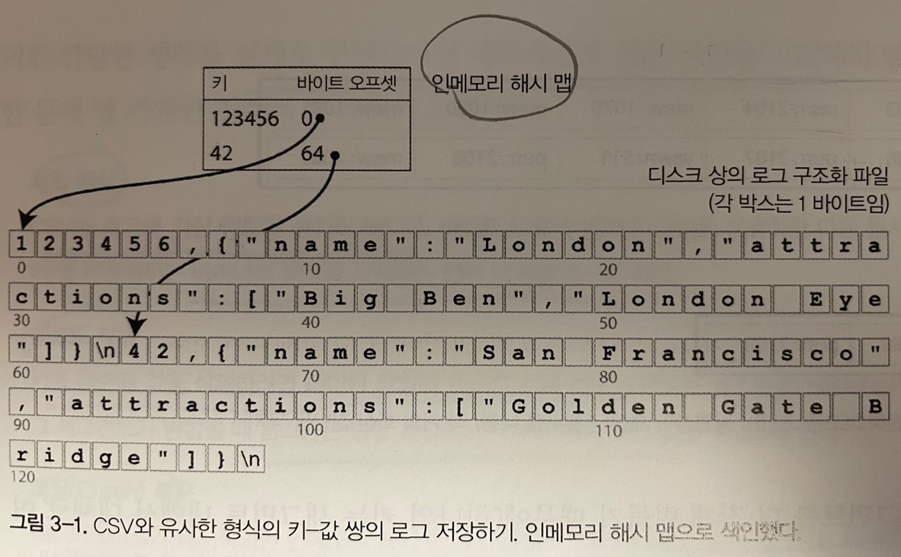
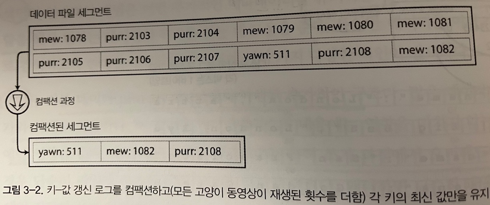
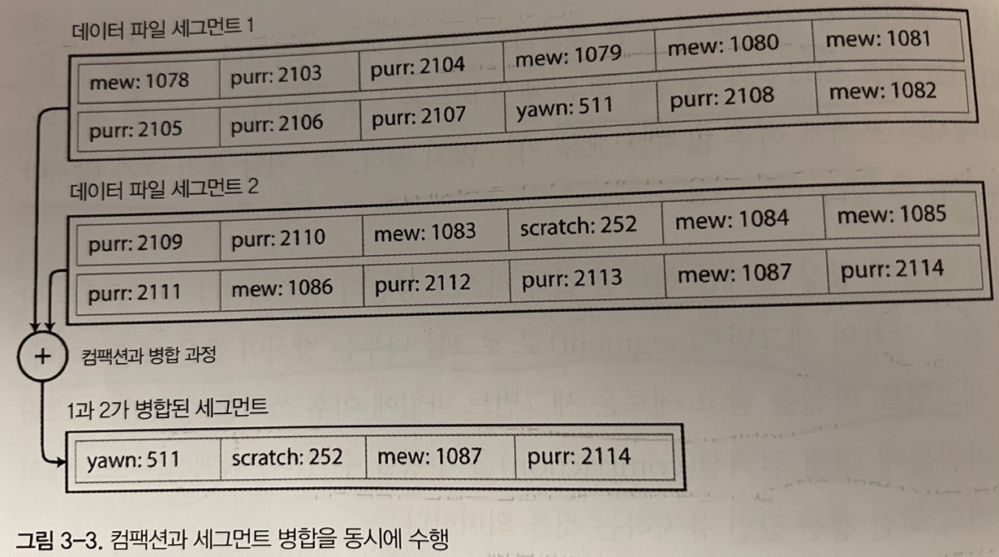
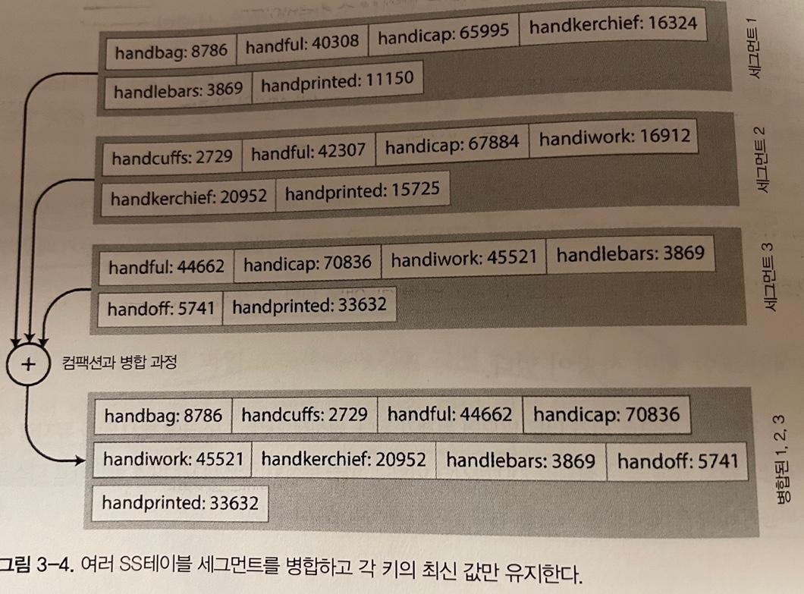
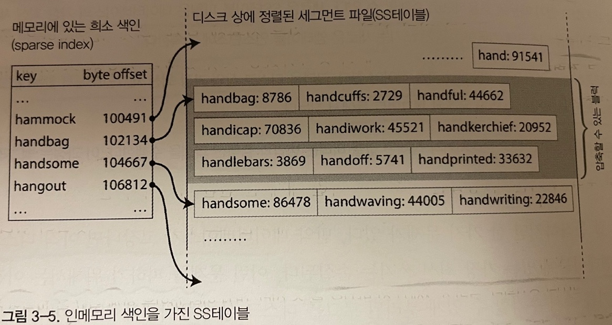
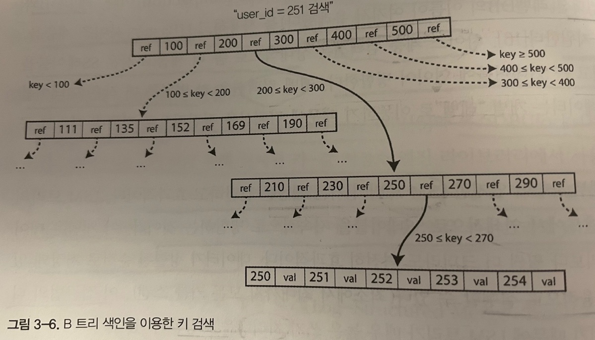
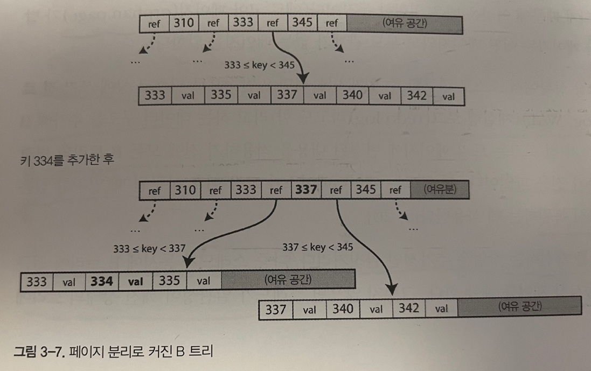

# 저장소와 검색 
  
가장 기본적인 수준에서 데이터 베이스는 2 가지 작업을 수행함 
- 데이터를 저장
- 저장한 데이터를 요청하면 데이터를 제공 
  
이번장에서는 데이터 베이스가 데이터를 **저장**과 **검색** 처리하는 방법을 알아본다  
  
애플리케이션 개발자는 자신의 저장소 엔진을 구현하기 보다는 사용 가능한 여러 저장소 엔진 중에서 애플리케이션에 적합한 엔진을 선택하는 작업이 필요함   
특정 작업부하(workload) 유형에서 좋은 성능을 내는 저장소 엔진 선택하고 사용하기 위해서는 **저장소 내부에서 수행되는 작업에 대한 대략적인 개념을 이해할 필요가 있음** 
  
## 데이터 베이스를 강력하게 만드는 데이터 구조 
세상에서 가장 간단한 데이터 베이스
```shell script
#!/bin/bash 

db_set() {
    echo "$1,$2" >> database
}

db_get() {
    grep "^$1," database | sed -e "s/^$1,//" | tail -n 1
}
```
key-value 저장소 함수를 2개로 구현했다 
- db_set 함수 
    * key, value 파라미터를 입력받아 ```,```를 구분자로 사용해 database 파일에 append 한다 
- db_get 함수
    * key 를 입력받아 database 에서 line 을 추출하고 key + ```,``` 를 제거 한 뒤 가장 마지막 line 1개만 출력 
    * db_set 에서 데이터를 append 하기 때문에 마지막 값을 출력하려면 가장 마지막 라인을 출력해야 한다 
  
실행 예제 
```shell script
$ db_set 123456 '{"name":"London","attractions":["Big Ben","London Eye"]}'
$ db_set 42 '{"name":"San Francisco","attractions":["Golden Gate Bridge"]}'

$ db_get 42
{"name":"San Francisco","attractions":["Golden Gate Bridge"]}

$ db_set 42 '{"name":"San Francisco","attractions":["Exploratorium"]}'
$ db_get 42
{"name":"San Francisco","attractions":["Exploratorium"]}

$ cat database
123456,{"name":"London","attractions":["Big Ben","London Eye"]}
42,{"name":"San Francisco","attractions":["Golden Gate Bridge"]}
42,{"name":"San Francisco","attractions":["Exploratorium"]}
```

db_set 함수는 매우 간단한 작업의 경우에는 꽤 좋은 성능을 보여준다  
실제로 많은 데이터베이스는 내부적으로 추가 전용(append-only) 데이터 파일인 **로그(log)** 를 사용한다  
- 실제 데이터베이스는 처리해야할 여러가지 문제들이 있지만 기본 원리는 같음 
- 여러가지 문제 = 동시성 제어, 디스크 공간 회수, 오류 처리, 부분적으로 기록된 레코드 처리 

> **로그** 라는 단어는 애플리케이션 로그를 언급할때 종종 사용되기도 하는데  
> 이 책에서는 조금 더 일반적인 의미로 연속된 추가 전용 레코드의 의미로 **로그** 라는 단어를 사용한다 
  
반면에 db_get 함수는 많은 레코드가 있으면 성능이 매우 좋지 않다  
key 로 value 를 찾기 위해서 모든 레코드를 탐색하기 때문에 검색 비용이 ```O(n)``` 이다  

데이터베이스에서 key 로 value 을 효율적으로 찾기 위해서는 다른 데이터 구조가 필요한데 바로 **색인** 이다  
**색인**은 어떤 **부가적인 메타 데이터**를 이용해서 데이터의 위치를 찾는것이다  
  
색인은 기본 데이터에서 파생된 **추가적인 구조** 이다  
- 이런 추가적인 구조는 일반적으로 쓰기 작업에서 오버헤드가 발생함 
    * 데이터를 쓸 때마다 매번 색인도 함께 갱신되어야 함 
- 하지만 색인을 잘 선택했다면 읽기 속도는 향상된다 
> 이것은 저장소 시스템에서 중요한 트레이드 오프다

## 해시 색인 
키-값 데이터를 색인해보자  
키-값 저장소는 대부분의 프로그래밍 언어에서 볼 수 있는 사전 타입(dictionary type) 과 매우 유사하다  
  
앞의 예제처럼 단순히 파일에 추가하는 방식으로 데이터 저장소를 구성한다고 가정해보자.  
가장 간단하게 사용할 수 있는 색인 전략은 인메모리 해시 맵에 각 key 의 byte offset 을 매핑해 두는 것이다  
  
그림 3-1 에서 보는 것 처럼 새로운 키-값이 파일에 추가 될 때마다 해시맵에도 기록하고 검색시에는 해시 맵에서 key 를 이용해 바이트 오프셋을 찾아서 해당 위치를 구하고 값을 읽는다  
  
이 방식은 매우 단순해 보이지만 실제로 많이 사용하는 접근법이다  
대표적으로 비트캐스크(Bitcask)(리악(Riak)의 기본저장소 엔진) 가 있다  
비트캐스크는 해시맵을 전부 메모리에 유지하기 때문에 모든 키가 램(RAM)에 저장된다는 전제로 고성능으로 읽기, 쓰기를 보장한다  
값을 한번의 디스크 탐색으로 디스크에서 적재(load)할 수 있기 때문에 메모리보다 더 많은 공간을 사용할 수 있다  
그리고 데이터 파일의 일부가 이미 파일 시스템 캐시에 있다면 읽기 작업에서 디스크 입출력이 필요하지 않음  
  
비트 캐스크 같은 저장 소 엔진은 각 키의 값이 자주 갱신되는 상황에 매우 적합하다  
예를들어 key = 고양이 비디오 URL 이고 value = 재생된 횟수 인 경우이다  
이런 경우 key 당 쓰기 수가 많지만 고유 키가 많지 않기 때문에 메모리에 모든 key 를 보관할 수 있다  
  
데이터를 항상 파일에 추가만 한다면 **디스크가 부족**해진다  
이런 문제를 해결하기 위해서 로그를 특정 크기의 **세그먼트**로 나누는 방식이 좋은 해결책이다  
특정 크기에 도달하면 세그먼트 파일을 닫고 새로운 세그먼트 파일에 이후 쓰기를 수행한다  
그리고 디스크가 차는것을 방지하기 위해 세그먼트 파일들에 대해서 컴팩션(compaction)을 수행할 수 있다
-  컴팩션: 중복된 키를 버리고 각 키의 최신 갱신 값만 유지하는 것 
  
  
  
컴팩션은 보통 세그먼트를 더 작게 만들기 때문에 아래 3-3 그림 처럼 여러 세그먼트의 병합도 함께 수행할 수 있다  
   
세그먼트는 불면이기 때문에 병합 과정에서 새로운 세그먼트 파일을 생성한다  
읽기 요청이 발생하면 병합이 끝나기 전에서는 이전 세그먼트에서 데이터를 읽고  
병합이 끝난 이후에는 새로운 세그먼트에서 데이터를 읽도록 전환한다  
전환 이후에는 이전 세그먼트 파일들을 삭제하면된다  
  
이제 각 세그먼트는 키를 파일 오프셋에 매핑한 자체 인메모리 해시 테이블을 갖는다  
키의 값을 찾기 위해서 최신 세그먼트 해시 맵을 먼저 확인하고 값이 없다면 두번째 최신 세그먼트 등을 확인해서 값을 찾는다  
병합 과정에서 적은 수의 세그먼트를 유지하기 때문에 많은 해시맵을 확인 할 필요가 없다  
  
위 내용을 실제로 구현하려면 세부적으로 많은 사항을 고려해야 한다 
- 파일 형식
    * CSV 는 로그에 적합한 형식이 아님 
    * 문자열을 부호화하는 바이너리 형식을 사용하는 편이 더 빠르고 간편함 
- 레코드 삭제 
    * 키와 관련된 값을 삭제하려면 데이터 파일에 특수한 삭제 레코드를 추가해야 함 
    * 이런 삭제 레코드를 **툼스톤(tombstone)** 이라고 한다 
    * 로그 세그먼트가 병합될 떄 툼스톤은 병합 과정에서 삭제된 키의 이전 값을 무시하게 함 
- Crash 복구 
    * 데이터베이스가 재시작되면 인메모리 해시 맵은 손실됨 
    * 전체 세그먼트 파일을 처음부터 끝까지 읽어서 해시 맵을 복원할 수 있지만 파일이 크면 매우 오래 걸림 
    * 비트캐스크는 각 세그먼트 해시 맵을 snapshot 을 디스크에 저장함으로써 복구 속도를 높인다 
- 부분적으로 레코드 쓰기
    * 데이터베이스는 로그에 레코드를 추가하는 도중에도 죽을 수 있음 
    * 비트캐스크 파일은 체크섬을 포함하고 있어 로그의 손상된 부분을 무시할 수 있음 
- 동시성 제어 
    * 쓰기를 순차적으로 로그에 추가할 때 일반적인 구현 방법은 1개의 쓰기 스레드만 사용하는 것 
    * 세그먼트는 추가전용 or 불변 이기 때문에 다중 스레드로 동시에 읽을 수 있음 
  
추가 전용 로그는 낭비 처럼 보일 수 있다. 예전 값을 새로운 값으로 덮어 쓰는게 아니라 추가하는 방식을 사용하기 때문에 ..  
하지만 추가 전용 설계는 여러 장점들이 존재한다  
- 추가와 세그먼트 병합은 순차적인 쓰기 작업이기 때문에 무작위 쓰기 보다 훨씬 빠름 
    * 특히 자기 회전 디스크 하드드라이브에서 빠름 
    * 일부 확장된 순차 쓰기는 플래시 기반 솔리드 스테이트 드라이브(SSD)도 선호된다 
- 세그먼트 파일이 추가전용이나 불변이면 **동시성과 crash 복구**가 훨씬 간단하다 
    * 예를들어 값을 덮어쓰는 동안 데이터베이스가 죽는 경우에 대한 걱정 할 필요가 없음 
    * 이전 값 부분과 새로운 값 부분을 포함 파일을 나누어 남겨두기 때문에 
- 오래된 세그먼트 병합은 시간이 지남에 따라 조각화되는 데이터 파일 문제를 피할 수 있음 
  
하지만 해시 테이블 색인도 제한 사항이 있다 
- 해시 테이블은 메모리에 저장해야 하기 때문에 key 가 많으면 문제가 된다 
    * 디스크에 해시 맵을 유지하는 방식은 성능이 매우 나쁘고 해시 충돌 해소를 위한 성가신 로직이 필요함 
- 해시 테이블은 범위 질의(range query)에 효율적이지 않음  
    * kity0000 ~ kity9999 사이의 모든 레코드를 검색하고 싶을때 해시 맵에서는 모든 키를 조회해야 한다 

## SS 테이블과 LSM 트리 
세그먼트 파일의 형식에 변경사항 한 가지를 적용해보자  
변경 요구사항은 **키로 정렬** 하는 것이다  
  
이 처럼 키로 정렬된 형식을 **정렬된 문자열 테이블(Sorted String Table) 또는 SS테이블** 이라고 부른다  
각 키는 병합된 세그먼트 파일 내에 한 번만 나타나야 한다(컴팩션 과정이 이를 보장)  
SS테이블은 해시 색인을 가진 로그 세그먼트보다 몇 가지 큰 **장점**이 있다
- 세그먼트 병합은 파일이 사용 가능한 메모리 보다 크더라도 간단하고 효율적 
    * 이 접근 법은 병합정렬 알고리즘에서 사용하는 방식과 유사함 
    * 입력 파일을 함께 읽고 각 파일의 첫 번째 키를 보고 낮은 키를 출력 파일에 기록
    * 같은 키가 존재하면 가장 최근 세그먼트의 값을 출력 파일에 기록 
   
- 파일에서 키를 찾기 위해 더는 메모리에 모든 키의 색인을 유지할 필요가 없다 
    * 예를들어 아래 3-5 에서 handiwork 키를 찾는다고 가정한다 
    * handiwork 는 메모리에 있는 색인 정보에 존재하지 않지만 handbag 과 handsome 의 오프셋을 알고 있고 정렬되어 있다 
    * 따라서 handbag 오프셋으로 이동해 handiwork 가 나올 때까지 스캔하면 된다 
    * 일부 키에 대한 오프셋을 알려주는 인메모리 색인이 여전히 필요함 
    * 하지만 색인하는 key 가 적기 때문에 빠르게 스캔할 수 있음 
    * 세그먼트 파일 내 수 킬로바이트 당 하나의 키로 충분함 
> 모든 키와 값이 고정 크기라면 이진 검색을 사용하면 되기 때문에 인메모리 색인을 전혀 사용하지 않을 수 있음   
> 하지만 현식적으로 보통 키-값은 가변길이이므로 색인이 없다면 다음 레코드가 시작하는 부분을 알기 어려움  

   
- 읽기 요청은 여러 키-값 쌍을 스캔해야 하기 때문에 해당 레코드들을 블록으로 그룹화 해서 디스크 쓰기전에 압축한다. (그림 3-5에 음영부분)
    * 희소 인메모리 색인의 항목은 압축된 블록의 시작을 가리키게 됨 
    * 압축방식은 디스크 공간을 절약하고 I/O 대역폭 사용도 줄일 수 있음 


### SS테이블 생성과 유지 
위에서 컴팩션과 병합 과정에서 key 를 정렬할 수 있었다. 그렇다면 유입되는 쓰기는 임의 순서대로 발생하는데 key 를 어떻게 정렬할까?  
디스크 상에 정렬된 구조를 유지(뒤에 B트리 참고)하는 일은 가능하지만 메모리에 유지하는 편이 훨씬 쉽다.  
레드 블랙 트리, AVL 트리 처럼 잘 알려진 데이터 구조는 많이 있다. 이런 구조를 이용하면 임의 순서로 키를 삽입하고 정렬된 순서로 키를 다시 읽을 수 있음  
  
이제 저장소 엔진을 다음과 같이 만들수 있다. 
- 쓰기가 발생하면 **인메모리 균형 트리 데이터 구조**에 추가한다.
    * 인 메모리 트리는 **멤테이블(memtable)** 이라고 함 
- 멤테이블이 임계 값 보다 커지면 SS테이블 파일로 디스크에 기록한다.
    * 트리가 이미 키로 정렬되어 있어 디스크 저장을 효율적으로 수행할 수 있음 
    * 새로운 SS테이블 파일은 데이터베이스의 가장 최신 세그먼트가 됨 
    * SS테이블을 디스크에 기록하는 동안 쓰기가 발생하면 새로운 맴테이블에 기록한다.
- 읽기요청이 발생하면 멤테이블에서 먼저 키를 찾고 없으면 최신 세그먼트부터 찾는다. 
- 가끔 병합과 컴팩션 과정을 수행한다. 
    * 이 과정은 백그라운드에서 수행 

### SS 테이블에서 LSM 트리 만들기 
여기에 기술된 알고리즘은 레벨DB(LevelDB)와 록스DB(RocksDB), 다른 애플리케이션에 내장하기 위해 설계된 키-값 저장소 엔진 라이브러리에서 사용한다.  
구글의 빅테이블(Bigtable) 논문에서 **SS테이블과 멤테이블**이라는 용어가 소개되었고 카산드라, HBase 에서도 유사한 저장소 엔진을 사용한다. 
  
이 색인 구조는 LSM 트리(Log-Structured Merge-Tree) 란 이름으로 패트릭 오닐(Patrick O'Neil) 등이 발표했다.  
정렬된 파일 병합과 컴팩션 원리를 기반으로 하는 저장소 엔진을 **LSM 저장소 엔진**이라 부른다. 
  
루씬(Lucene)은 엘라스틱 서치나 솔라에서 사용하는 전문 검색 색인 엔진이다. 루씬은 **용어 사전(term dictionary)** 을 저장하기 위해 유사한 방법을 사용한다.  
검색 질의로 단어가 들어오면 단어가 언급된 모든 문서를 찾는다. 이 방법은 키를 단어(용어)로, 값은 단어를 포함된 모든 문서의 ID 목록으로 하는 키-값 구조로 구현한다.
루씬에서 단어와 문서 ID 목록의 매핑은 SS테이블 같은 정렬 파일에 유지하고 필요에 따라 백그라운드에서 병합한다.  

### 성능 최적화 
LSM 트리 알고리즘은 데이터베이스에 존재하지 않는 키를 찾는 경우 느릴수 있다. 
- 멤테이블을 확인하고 해당 키가 없다는 것을 확인하기 위해 가장 오래된 세그먼트까지 확인하기 때문에 
  
이런 문제를 최적화하기 위해 저장소 엔진은 보통 **블룸 필터(Bloom Filter)** 를 추가적으로 사용한다. 
- 블룸필터는 집합 내용을 근사한 메모리 효율적 데이터 구조
- 블룸필터는 키가 데이터베이스에 존재하지 않음을 알려줌 
  
SS 테이블을 압축하고 병합하는 순서와 시기를 결정하는 다양한 전략이 있다. 가장 일반적인 전략은 **크기 계층(size-tiered)과 레벨 컴팩션(leveled compaction)** 이다.
레벨DB, 록스DB 는 레벨 컴팩션을 사용하고 HBase 는 사이즈 계층을 사용하며 카산드라는 2개 모두 지원한다.  
- 사이즈 계층 컴팩션
    * 이 전략은 아주 큰 SS 테이블을 병합한다. 이런 큰 SS 테이블이 누적되면 더 큰 SS 테이블로 병합한다.
    * 따라서 같은 시기에 다양한 크기에 SS 테이블이 존재하게 된다.
    * 이 전략은 쓰기 집약적은 워크로드에서 적합하지만 데이터를 그룹화하지 않기 때문에 읽는 속도가 느려짐 
    * 가장 큰 SS 테이블의 크기가 커지면 압축 동안 새 SS테이블과 이전 SS 테이블에 동시에 필요한 디스크 공간의 양이 노드와 일반적이 디스크 공간을 초과할 수 있음 
- 레벨 컴팩션
    * level 로 그룹화되는 고정된 작은 크기의 SS테이블을 만든다.
    * SS 테이블은 지속적으로 더 큰 level 로 압축되기 때문에 더 균일하고 예측 가능함 
    * 각 level 의 키는 다음 수준에서 겹치지 않는 SS 테이블로 병합됨 
    * 이 프로세스는 읽기 성능을 향상 시킬 수 있음 

Reference: 
- [카산드라 블로그](https://docs.datastax.com/en/cassandra-oss/3.0/cassandra/dml/dmlHowDataMaintain.html)

  
여러 중요한 세부 사항이 있지만 LSM 트리의 기본 개념은 간단하고 효과적이다.  
- LSM 트리의 기본 개념은 백그라운드에서 연쇄적으로 SS 테이블을 지속적으로 병합하는 것
- 데이터셋이 메모리보다 훨씬 더 크더라도 효과적임 
- 데이터가 정렬된 순서로 저장돼 있다면 범위 질의를 효율적으로 실행할 수 있다.
- 디스크 쓰기는 순차적이기 때문에 매우 높은 쓰기 처리량을 보장함 

## B 트리
- 대부분의 관계형 데이터베이스에서 사용되는 색인 구조 
- 많은 비관계형 데이터에비이스에서도 사용됨 
- B 트리는 정렬된 키-값 쌍을 유지하기 때문에 범위 질의에 효율적임 
- 앞에서 살펴본 로그 구조화 색인은 가변 크기의 세그먼트로 나누고 항상 순차적으로 기록하지만 
- B 트리는 4KB 고정 크기 **블록** 이나 **페이지**로 나누고 한 번에 페이지에 읽기 또는 쓰기를 수행
- 디스크가 고정 크기 블록으로 배열되기 때문에 이런 설계는 하드웨어와 밀접한 관련이 있음 
- 각 페이지는 주소나 위치를 이용해 식별 할 수 있다 
- 이 페이지 참조는 그림 3-6과 같이 페이지 트리를 구성하는 데 사용함  

- 한 페이지는 B Tree 의 **루트(root)** 로 지정됨  
- 색인에서 key 를 찾으려면 루트에서 시작해서 하위 페이지 참조를 따라가며 key 를 찾는다.  
- 위 3-6 그림에서 key = 251 을 찾고 있기 때문에 루트 페이지의 200 과 300 사이의 페이지 참조를 따라간다. 
- 200 ~ 300 사이의 페이지에서도 같은 방식으로 250 과 270 사이의 페이지 참조를 따라간다.
- 위 과정을 leaf 페이지에 도달할 때까지 key 를 검색한다. 
- **분기 계수(branching factor)** : B 트리의 한 페이지에서 하위 페이지를 참조하는 수 
- 위 3-6 그림의 분기 계수는 6 (각 페이지의 하위 페이지 참조 ref 의 수)
  

- B 트리의 값을 갱신 하려면 키를 포함하는 모든 페이지를 검색하고 페이지의 값을 바꾼 다음 페이지를 디스크에 다시 기록함 
- 키를 추가하려면 새로운 키를 포함하는 범위의 페이지를 찾아 해당 페이지에 키와 값을 추가
- 페이지의 충분한 공간이 없다면 (분기 계수가 넘으면) 페이지 하나를 둘로 나누고 상위 페이지가 새로운 키 범위의 하위 부분들을 알 수 있게 갱신함 
- 이 알고리즘은 트리가 계속 **균형** 을 유지하는 것을 보장함 
- n 개의 키를 가진 B 트리는 깊이가 *log n*
- 대부분의 데이터 베이스는 B 트리의 깊이가 3이나 4 단계면 충분하기 때문에 많은 페이지 참조가 일어나지는 않음 
- 분기 계수 500의 4KB 페이지의 4단계 트리는 256TB 까지 저장 할 수 있음

### 신뢰할 수 있는 B 트리 만들기 
B 트리의 기본적인 쓰기 동작은 새로운 데이터를 디스크 상에 페이지를 덮어쓴다.<br/>
이 동작은 덮어쓰기가 페이지의 위치를 변경하지 않는다는 가정이 있다.<br/>
- 덮어쓰기를 수행해도 페이지 참조는 여전히 유지됨

이런 점이 LSM 트리와 아주 대조적인 점이다.
- 파일에 추가만 할 뿐 기존의 값을 변경하지 않음

<br/>   
디스크의 페이지를 덮어쓰는 일은 실제 하드웨어 동작이다.<br/>
자성의 하드 드라이브의 경우 디스크 헤드를 적절한 곳으로 옮겨서 회전하는 플래터의 위치를 올바른 위치가 되기 까지 대기한 뒤에 적합한 섹터에 데이터를 덮어쓴다.<br/>
SSD 의 경우는 저장소 칩의 상당한 블록을 한번에 지우고 다시 쓰기를 해야 하기 때문에 조금 더 복잡하다. 

> 페이지를 덮어쓰는 작업은 하드웨어 입장에서는 오버헤드가 좀 있다는 것을 얘기하고 싶은 듯 ..

<br/>
B 트리의 일부 동작은 다양한 페이지의 덮어쓰기를 필요로 한다.<br/>
ex) 삽입 때문에 페이지가 너무 많아져 페이지를 나눠야 한다면 분할된 두 페이지의 상위 페이지 참조를 갱신해야 한다.<br/> 
만약 일부 페이지만 기록하고 데이터 베이스가 고장난다면 색인이 훼손 될 수 있다. (고아 페이지가 발생할 수 있음)<br/>
<br/>

데이터베이스 고장 상황에서 스스로 복구 할 수 있게 하려면 일반적으로 디스크 상에 **쓰기 전 로그(write-ahead log, WAL)(재실행 로그, redo log)** 를 추가해 B 트리를 구현한다.<br/>
쓰기 전 로그는 트리 페이지에 변경된 내용을 적용하기 전에 모든 B 트리의 변경 사항을 기록하는 추가 전용 파일이다.<br/>
이 로그 파일은 데이터 베이스가 복구 될 때 B 트리를 다시 복원하는데 사용된다.<br/>
<br/>
같은 자리의 페이지를 갱신하는 작업은 추가적인 문제를 야기할 수 있다.<br/>
다중 스레드가 동시에 접근한다면 동시성 제어가 필요하다.<br/>
동시성 제러는 보통 **래치(latch)(가벼운 잠금, lock)** 을 이용해 트리의 데이터 구조를 보호한다.<br/>
이런 동시성 제어에서는 로그 구조화 접근 방식이 훨씬 간단하다.<br/>
- 유입 질의의 간섭 없이 백그라운드에서 병합을 수행하고 원자적으로 새로운 세그먼트를 생성하여 바꾸기 때문
<br/>

### B 트리 최적화
B 트리는 오랜기간 사용되어 왔기 때문에 많은 최적화 기법들이 있다. 
최적화 기법들
- 페이지 덮어 쓰기와 고장 복구를 위한 WAL 유지 대신 일부 데이터베이스는 쓰기 시 복사 방식을 사용함
    * 변경된 페이지는 다른 위치에 기록하고 트리의 상위 페이지의 새로운 버전을 만들어 새로운 위치를 가리키게 한다.
    * 이 방식은 동시성 제어에서도 유용함 (236 page 스냅샷 격리와 반복 읽기에서 나옴)
- 페이지에 전체 키를 저장하는 게 아니라 키를 축약해 쓰면 공간을 절약할 수 있다.
    * 트리 내부 페이지에서 키가 키 범위 사이의 경계 역할을 하는데 충분한 정보를 제공하면 됨 
    * 페이지 하나에 키를 더 많이 채우면 트리는 더 높은 분기 계수를 얻고 깊이를 낮출 수 있다.
- 리프 페이지를 디스크 상에 연속된 순서로 나타나게 끔 트리를 배치한다.
    * 페이지는 디스크 상 어디에나 위치 할 수 있는데 질의가 정렬된 순서로 키 범위를 스캔해야 한다면 모든 페이지에 대해서 디스크 찾기가 필요하기 때문에 비효울적이다.
    * 따라서 리프 페이지를 연속된 순서로 배치함
    * 반면에 LSM 트리는 병합하는 과정에서 세그먼트를 한 번에 다시 쓰기 때문에 디스크에서 연속된 키를 서로 가깝게 유지하기 쉬움 
- 트리에 포인터를 추가한다.
    * ex) 각 리프 페이지가 양쪽 형제 페이지에 대한 참조를 가지면 상위 페이지로 다시 이동하지 않아도 순서대로 키를 스캔할 수 있음 = B+ 트리 
- 프랙탈 트리(fractal tree) 같은 B 트리 변형은 디스크 찾기를 줄이기 위해 로그 구조화 개념을 일부 빌려서 구현됨 

### B 트리와 LSM 트리 비교 
B 트리가 LSM 트리 보다 일반적으로 구현 성숙도가 더 높지만 LSM 트리도 성능 특성 때문에 관심을 받고 있다.<br/>
LSM 트리
- 보통 쓰기에서 빠름 
- 보통 읽기가 느린 이유는 각 컴팩션 단계에 있는 여러 가지 데이터 구조와 SS 테이블을 확인해야 하기 때문

B 트리 
- 읽기에서 더 빠르다고 느낌 

비교가 유효하려면 실제 필요한 작업부하로 시스템을 테스트 해야한다. 
> 개발하려는 어플리케이션의 작업 부하로 실제로 테스트 해봐야 정확한 장단점이 나온다는 말 인듯 ..

#### LSM 트리의 장점
B 트리 색인은 모든 데이터 조각을 최소한 두 번 기록해야 한다. (쓰기 전 로그 + 트리 페이지 = 2번 ) <br/>
B 트리는 페이지 내의 몇 바이트만 바뀌어도 한 번에 전체 페이지를 기록해야 하는 오버헤드도 있다. <br/><br/>
로그 구조화 색인 또한 SS 테이블의 반복된 컴팩션과 병합으로 인해 여러 번 데이터를 다시 쓴다.<br/>
데이터베이스에 쓰기 한 번이 데이터베이스 life cycle 동안 디스크에 여러 번의 쓰기를 야기하는 것을 **쓰기 증폭(write amplifiction)** 이라 한다.<br/> 
SSD 는 수명이 다할 때 까지 블록 덮어쓰기 횟수가 제한되기 때문에 쓰기 증폭은 SSD 의 경우 특별한 관심사이다.<br/>
쓰기가 많은 어플리케이션에서 성능 병목은 디스크에 쓰는 속도 일 수 있다. 이 경우 쓰기 증폭은 성능 비용이다.<br/>

- LSM 트리는 보통 B 트리 보다 쓰기 처리량이 높음 
    * 저장소 엔진의 설정과 작업 부하에 따라 다르긴 함 
    * LSM 트리가 상대적으로 쓰기 증폭이 더 낮음 
    * B 트리는 페이지를 덮어쓰지만 LSM 트리는 순차적으로 컴팩션된 SS 테이블 파일을 쓰기 때문이다.
    * 이런 차이는 자기하이드라이브에서 순차쓰기가 임의쓰기 보다 빠르기 때문에 중요하다
- LSM 트리는 압축률이 더 좋다 
    * B 트리 보다 더 적은 파일을 생성한다.
    * B 트리는 파편화로 인해 사용하지 않는 디스크 공간 일부가 남을 수 있다.
    * 파편화를 줄이기 위해서 주기적으로 ss 테이블을 다시 기록하기 때문에 저장소 오버헤드가 낮다.
    * 특히 레벨 컴팩션을 사용하면 극대화됨 

<br/>
대다수의 SSD 펌웨어는 내장 저장소 칩에서 임의 쓰기를 순차 쓰기로 전환하기 위해 내부적으로 로그 구조화 알고리즘을 사용한다.<br/>
저장소 엔진의 쓰기 패턴이 SSD 에 미치는 영향은 분명하지 않지만 낮은 쓰기 증폭과 파편화 감소는 SSD 의 경우 훨씬 유리하다.<br/>
데이터를 더 밀접하게 표현하면 I/O 대역폭 내에서 더 많은 읽기와 쓰기 요청이 가능하다.

#### LSM 트리의 단점 
- 컴팩션 과정의 때로는 진행중인 읽기와 쓰기 성능에 영향을 준다. 
    * 저장소 엔진은 컴팩션을 점진적으로 수행하고 동시 접근의 영향이 없게 수행하려고 하지만 디스크가 가진 자원의 한계가 존재함 
    * 그래서 디스크에서 비싼 컴팩션 연산이 끝날 때까지 요청이 대기해야 하는 상황이 발생하기 쉽다.
    * 상위 백분위 질의의 응답시간은 때때로 길다.
    * 상위 백분위는 예측한 응답시간 대비 특이값이 없는 정도이다. ex) 95 분위 이면 95% 는 예측치 내에 응답을 했고 5% 만 특이값(느린 응답시간)이 존재함 
    * B 트리는 LSM 트리보다 성능을 예측하기 쉽다.
- 데이터베이스가 커질수록 컴팩션을 위해 더 많은 디스크 대역폭이 필요하다.
    * 초기 쓰기(로깅과 멤테이블을 디스크로 방출(flushing))와 백그라운드에서 수행되는 컴팩션 스레드가 이 대역폭을 공유해야 한다.
    * 하지만 디스크의 쓰기 대역폭은 유한함 
- 컴팩션 설정을 주의 깊게 하지 않으면 컴팩션이 유입 쓰기 속도를 따라 갈 수 없다. 
    * 디스크 상의 병합되지 않은 세그먼트 수는 디스크 공간이 부족할 때까지 증가한다.
    * 그리고 더 많은 세그먼트를 확인하기 때문에 읽기 또한 느려진다. 
    * 유입 쓰기 속도에 대한 명시적인 모니터링이 필요하다.
- 트랜잭션 지원이 어려움 
    * B 트리는 키가 색인의 한 곳에만 존재한다.
    * 반면 LSM 트리는 다른 세그먼트에 같은 키의 다중 복사본이 존재 할 수 있기 때문에 트랜잭션 시맨틸을 제공하기 어렵다.
    * 관계형 데이터베이스에서 트랜잭션 결리는 키 범위의 잠금을 사용해 구현한다 (7장에서 자세히 알아본다)

<br/>
B 트리는 데이터베이스 아키텍처에 아주 깊게 뿌리내렸다. 그리고 많은 작업부하에 대해 지속적으로 좋은 성능을 제공하므로 곧 사라질 가능성은 없다.<br/>
새로운 데이터 저장소에는 로그 구조화 색인 점점 인기를 끌고 있다.<br/>
사용 사례에 적합한 저장소 엔진의 유형을 결정하기 위해서 테스트를 통해 경험적으로 결정하는 것이 좋다.<br/>
<br/>

## 기타 색인 구조
지금까지 키-값 색인을 살펴 봤다. 키-값 색인의 대표적인 예는 관계형 모델의 기본키 색인이다.<br/>기본키로 관계형 테이블에서는 하나의 로우, 문서 데이터베이스에서 하나의 문서, 그래프 데이터베이스에서 하나의 정점을 고유 하게 식별할 수 있다.<br/>
<br/>
보조 색인(secondary index)을 사용하는 방법도 매우 일반적이다.<br/>관계형 데이터베이스에서는 ```CREATE INDEX``` 명령을 사용해 같은 테이블에 다양한 보조색인을 생성 할 수 있다.<br/>
기본키 색인과 보조 색인의 차이점은 키가 고유하지 않다는 점이다.<br/>이런 문제점은 2가지 방법으로 해결할 수 있다.
- 색인의 각 값에 일치하는 로우 식별자 목록(전문 색인에서 포스팅 목록)을 만드는 방법
- 로우 식벽자를 추가해 각 키를 고유하게 만드는 방법 

어떤 방법이든 보조 색인으로 B 트리와 로그 구조화 색인 둘 다 사용할 수 있다.

### 색인 안에 값 저장하기 
색인에서 키는 질의가 검색하는 대상, 값은 2가지 중 1개에 해당함.<br/>
- 질의에 대한 실제 로우(문서, 정점)
- 다른 곳에 저장된 로우를 가리키는 참조 
    * 로우가 저장되는 곳을 **힙 파일(heap file)** 이라고 한다.
    * 힙 파일 접근은 일반적인 방법인데 여러 보조 색인이 필요할 경우 중복을 피할 수 있기 때문이다.
    * 색인의 값이 힙 파일에서 위치를 나타냄 
<br/>

**힙 파일 접근 방식** 은 키를 변경하지 않고 값을 갱신할 때 효율적이다. 
- 새로운 값이 이전 값 보다 적은 공간을 필요로 하면 레코드를 제자리에 덮어 쓸 수 있다.
- 새로운 값이 이전 값 보다 큰 공간을 필요로 하면 힙에서 충분한 공간이 있는 새로운 곳으로 위치를 이동해야 해서 조금 복잡하다.
    * 이 경우에 모든 색인이 레코드의 새로운 힙 위치를 가리키게끔 갱신 하거나 이전 힙 위치에 전방향 포인터를 남겨두어야 한다.
<br/>

**클러스터드 색인(clustered index)**
색인에서 힙 파일로 다시 이동하는 일은 읽기 성능에 불이익이 너무 많기 때문에 색인안에 로우를 저장하는 편이 바람직하다.<br/>ex) MySQL 의 InnoDB 에서는 테이블의 기본키가 언제나 클러스터드 색인이고 보조 색인은 기본키를 참조한다. (힙 파일 참조 아님)<br/>
<br/>
클러스터드 색인과 비클러스터드 색인 사이의 절충안을 **커버링 색인(covering index)** 이나 **포괄열이 있는 색인(index with included column)** 이라고 한다.<br/>이 색인은 색인안에 테이블의 컬럼 일부를 저장한다.<br/>이렇게 하면 일부 질의에서는 색인만 이용하여 응답이 가능하다.<br/>
<br/>
클러스터드 색인과 커버링 색인은 읽기 성능을 높일 수 있지만 추가적인 저장소가 필요하고 쓰기 과정에서 오버헤드가 발생한다.<br/>어플리케이션 단에서 복제로 인한 불일치를 파악할 수 없기 때문에 데이터베이스는 트랜잭션 보장을 강화하기 위한 노력이 필요하다.
<br/>

### 다중 컬럼 색인 
**결합 색인**
- 다중 컬럼 색인의 가장 일반적인 유형 
- 하나의 키에 여러 컬럼을 단순히 결합하는 방식 
- ex) (성,이름) 으로 정렬된 전화번호부와 비슷하다.
- 순서가 정렬되어 있어서 (성, 이름) 을 가진 사람의 전화번호 뿐만 아니라 (성) 을 가지는 전화번호 리스트를 찾을 때에도 유용하다.
- 하지만 (이를) 만 가진 모든 사람의 전화번호 리스트는 검색이 어렵다.
<br/>

**다차원 색인**
- 한 번에 여러 컬럼에 질의하는 조금 더 일반적인 방법 
- 특히 지리 공간 데이터에서 중요하게 사용된다.
- ex) 레스토랑 검색 사이트에서 지도에 주변 레스토랑을 표시해주어야 한다고 하자.
    * 지도영역에 네모난 영역에 있는 레스토랑을 모두 표시해주기 위해서는 2차원 질의가 필요하다.

```sql
SELECT * FROM restaurants WHERE latitude > 51.4946 AND latitude < 51.5079
                            AND longitude > -0.1162 AND longitude < -0.1004;
```
B 트리나 LSM 트리는 이런 유형의 질의에 효율적으로 응답할 수 없다.
<br/>
이차원 위치를 공간 채움 곡선(space-filling curve)을 이용해 단일 숫자로 변환한 다음 B 트리 색인을 사용해서 해결 할 수 있다.<br/>좀 더 일반적인 방법은 R 트리 처럼 전문 공간 색인(specialized Search Tree)을 사용하는 방법이 있다.
- ex) 포스트 GIS는 R 트리 같은 지리 공간 색인을 구현했다. 
<br/><br/>

흥미로운 점은 다차원 색인의 활용이 지리학적인 위치에만 국한되지 않는다는 점이다.<br/>
ex) 전자상거래 웹 사이트에서 특정 색상 범위를 검색하기 위해서 (빨강, 초록, 파랑)의 3차원 색인을 사용하거나, 날씨 관측 데이터 베이스에서 (날짜, 기온)의 2차원 색인을 사용할 수 있다.
<br/>

### 전문 검색과 퍼지 색인 
이제까지는 키의 정확한 값이나 범위를 이용해서 질의할 수 있다고 가정했다.<br/>이 색인으로는 철자가 틀린 단어와 같이 **유사한 키**에 대해서는 질의를 할 수 없다.<br/>이처럼 **애매모호한(fuzzy)** 질의에는 다른 기술이 필요하다.<br/>
<br/>
예를들어 전문 검색 엔진은 특정 단어를 검색할 때 해당 단어의 동의어로 질의를 확장한다.<br/>
동의어 후보군 
- 단어의 문법적 활용을 무시하고 동일한 문서에서 서로 인접해 나타난 단어를 (TF-IDF)
- 언어학적으로 텍스트를 분석해 추출한 단어 

루씬은 문서나 질의의 오타를 대처하기 위해 특정 편집거리(edit distance) 내 단어를 검색할 수 있다.
- 편집거리 1은 한 글자가 추가되거나 삭제되거나 교체됐음을 의미 
루씬은 용어 사전을 위해 SS 테이블 같은 구조를 사용한다.<br/>이 구조에서 인메로리 색인은 여러 키 내 문자에 대한 유한 상태 오토마톤(finite state automaton)으로 **트라이(trie)** 와 유사하다.<br/>이 오토마톤은 **레벤슈타인 오토마톤(levenshtein automaton)** 으로 변환할 수 있다.<br/>레벤슈타인 오토마톤은 특정 편집 거리 내에서 효율적인 단어 검색을 제공한다.<br/>
<br/>
최근의 퍼지 검색 기술은 문서 분류 및 머신러닝의 방향으로 진행되고있다.

### 모든 것을 메모리에 보관 
이번장에서 설명한 데이터 구조는 모두 디스크 한계에 대한 해결책이었다. 디스크는 메인 메모리와 비교해 다루기 어렵다. 이런 단점을 참을 수 있는 이유는 디스크에는 주요한 2가지 장점이 있기 때문이다.
- 디스크는 지속성이 있음 (전원이 꺼져도 손실되지 않음)
- 램 보다 기가 바이트당 가격이 더 저렴함 
<br/>

램이 점점 저렴해지면서 데이터 셋이 크지 않다면 데이터 전체를 메모리에 보관하는 방식도 꽤 현실적이다. 하지만 다른 인메모리 데이터베이스는 지속성을 목표로 한다.<br/>
디스크에 지속성을 제공하는 방법
- 특수 하드웨어(배터리 전원 공급 RAM)를 사용하는 방법
- 디스크에 변경 사항의 로그를 기록하는 방법
- 디스크에 주기적인 스냅샷을 기록하는 방법
- 다른 장비의 인메모리에 상태를 복제하는 방법 

<br/>
볼트DB, 멤SQL, 오라클 타임즈텐 같은 제품은 관계형 모델의 인메모리 데이터베이스다. 이런 제품 벤더는 디스크 상 데이터 구조 관리와 관련된 오버헤드를 제거했기 때문에 성능을 크게 개선했다고 주장한다.<br/>램 클라우드는 지속성 있는 오픈소스 인메모리 키-값 저장소이다. 메모리와 디스크 데이터를 로그 구조화 접근방식을 사용한다.<br/>레디스와 카우치베이스는 비동기로 디스크에 기록하기 때문에 약한 지속성을 제공한다.<br/>
<br/>
인메모리 데이터베이스는 성능 장점이 있다고 생각한다. 하지만 디스크 기반 저장소 엔진도 운영체제가 디스크 블록을 메모리에 캐시하기 때문에 충분한 메모리가 있다면 디스크에서 읽을 필요가 없다.<br/>
<br/>
성능 외에도 인메모리 데이터베이스는 디스크 기반 색인으로 구현하기 어려운 데이터 모델을 제공한다.<br/>ex) 레디스는 우선순위 큐와 셋 같은 다양한 데이터 구조를 데이터베이스 같은 인터페이스로 제공한다.<br/>또한 메모리에 모든 데이터를 유지하기 때문에 구현이 비교적 간단하다.<br/>
<br/>
최근 연구에 따르면 인메모리 데이터 베이스 아키텍처가 디스크 중심 아키텍처에서 발생하는 오버헤드 없이 가용한 메모리보다 더 큰 데이터 셋을 지원하게끔 확장할 수 있다.<br/> 
**안티캐싱(anti-caching)** 접근 방식은 메모리가 충분하지 않을 때 최근에 사용하지 않은 데이터를 메모리에서 디스크로 내부내고 나중에 접근 할 때 메모리에 적재하는 방식으로 동작한다.
- 이 방식은 OS 에서 가상 메모리와 스왑 파일에서 수행하는 방식과 유사하다.
- 전체 페이지보다 개별 레코드 단위로 작업을 할 수 있기 때문에 OS 보다 더 효율적으로 메로리를 관리 할 수 있다.
<br/>

나아가 비휘발성 메모리(non-volatile memory, NVM) 기술이 널리 채택되면 저장소 엔진 설계의 변경이 필요할 것이다. 비휘발성 메모리 기술은 새로운 연구분야지만 앞으로 주목할 가치가 있다.
