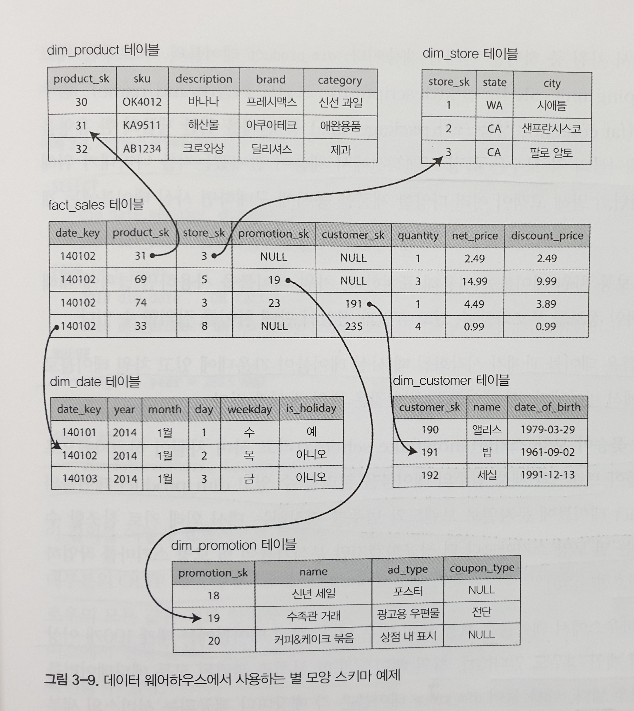
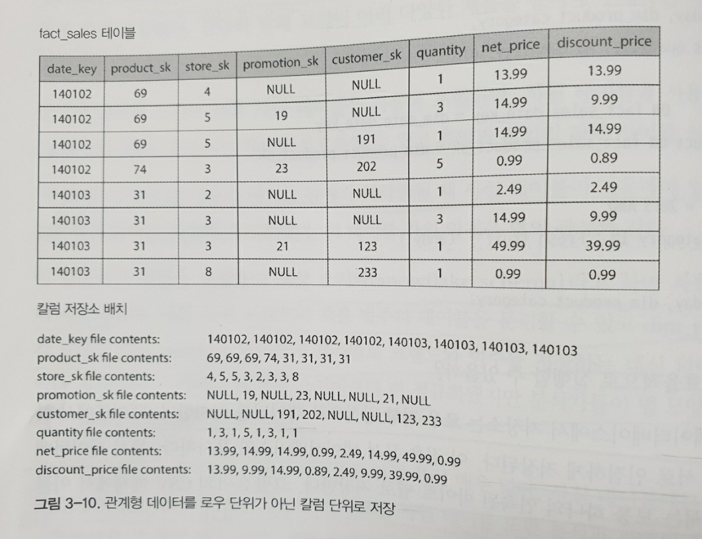
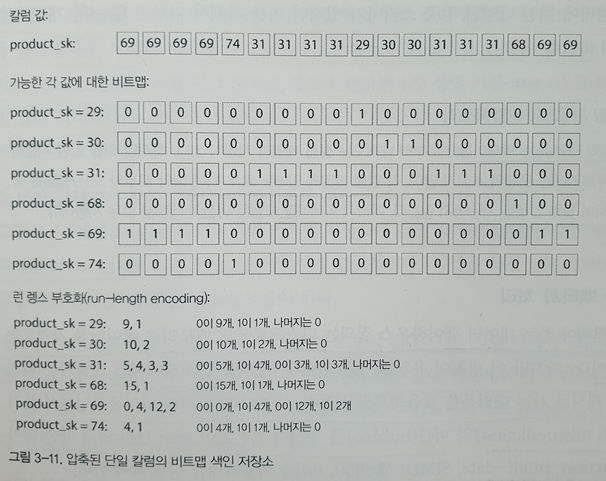
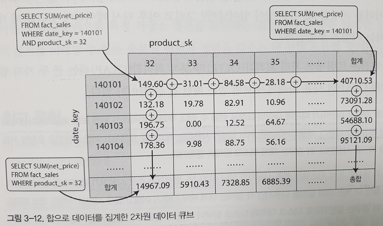

## 트랜잭션 처리나 분석
**트랜잭션** 이란 논리 단위 형태로 읽기와 쓰기 그룹을 나타냄  
반드시 ACID(원자성, 일관성, 격리성, 지속성)을 가질 필요는 없으며 일괄처리 작업과 달리 클라이언트가 지연시간이 낮은 읽기와 쓰기를 가능하게 한다는 의미  

보통 애플리케이션은 색인을 사용해 일부 키에 대한 적은 수의 레코드를 찾는다. 레코드는 사용자 입력을 기반으로 삽입되거나 갱신되며, 대화식이기 때문에 **온라인 트랜잭션 처리(online transaction processing, OLTP)** 라고 한다.

그러나 최근 DB를 데이터 분석(data analytic)용도로도 많이 사용하기 시작했는데, 이는 전통적인 트랜잭션과는 접근 패턴이 매우 다름  
보통의 분석 질의는 원시 데이터를 반환하는 것이 아니라 많은 수의 레코드를 스캔해 일부 컬럼만 읽어 집계 통계를 계산한다.
- 1월의 각 매장의 총 수익
- 최근 프로모션 기간 동안 평소보다 얼마나 더 많은 바나나를 판매했는가
- X 브랜드 기저귀와 함께 가장 자주 구매하는 유아식 브랜드

이러한 분석용 질의는 분석가가 작성하여 경영진이 더 나은 의사결정을 하기 위해 돕는 보고서를 제공(Business intelligence, BI)이러한 사용 패턴을 **온라인 분석 처리(online analytic processing, OLAP)** 라고 한다.

|특성|트랜잭션 처리 시스템(OLTP)|분석 시스템(OLAP)|
|---|---|---|
|주요 읽기 패턴|질의당 적은 수의 레코드, 키 기준으로 가져옴|많은 레코드에 대한 집계|
|주요 쓰기 패턴|임의 접근, 사용자 입력을 낮은 지연 시간으로 기록|대규모 불러오기(bulk import, ETL) 또는 이벤트 스트림|
|주요 사용처|웹 애플리케이션을 통한 최종 사용자/소비자|의사결정 지원을 위한 내부 분석가|
|데이터 표현|데이터의 최신 상태(현재 시점)|시간이 지나며 일어난 이벤트 이력|
|데이터셋 크기|GB ~ TB|TB ~ PB |

처음에는 OLTP와 OLAP를 위해 SQL을 이용하는 동일한 DB를 사용했지만 1980년대 후반부터 이를 분리하여 분석을 수행하기 시작 OLAP를 위한 DB를 **데이터 웨어하우스(data warehouse, DW)** 라고 부르기 시작

### 데이터 웨어하우징
OLTP와 OLAP가 분리되어 사용된 이유는 다음과 같다
- OLTP시스템은 운영상 매우 중요하여 높은 가용성과 낮은 지연 시간의 트랜잭션을 요구
- OLTP에 대한 중요도가 매우 높음
- OLAP 작업은 매우 비용이 비싼 작업이기 때문에 다른 트랜잭션의 성능을 저하시킬 가능성이 있음

위와 같은 문제로 인해 OLTP DB는 분리되었고 분석 접근 패턴에 맞게 최적화하는 것도 가능하며, 분석가들은 이러한 작업 환경에서 OLAP 작업을 진행하게 된다.  
DW는 회사 내의 모든 다양한 OLTP 시스템에 있는 읽기 전용의 복사본으로 OLTP DB에서 주기적으로 데이터를 추출(Extract), 분석 친화적 스키마로 변환(Transform)한 후 DW에 적재(Load)하는 과정을 거치며 이를 ETL(Extract-Transform-Load)라 한다.  


### OLTP DB와 DW의 차이점
SQL은 일반적으로 분석 질의에 적합하기 때문에 DW의 데이터 모델은 가장 일반적인 관계형 모델을 사용  
SQL 질의를 생성하고 결과를 시각화하고 분석가가(드릴 다운(drill-down), 슬라이싱(slicing), 다이싱(dicing)) 데이터를 탐색할 수 있게 해주는 여러 그래픽 데이터 분석 도구가 있음  
OLTP와 DW가 모두 SQL을 지원한다고 내부 모델이 같은 것은 아니다 각각 다른 질의 패턴에 맞게 최적화 되었기 때문에 내부는 완전히 다르며 각각 하나의 관점에서 최적의 성능을 내는 것에 중점을 둔다.  
DW에서 사용되는 SQL DB는 Teradata, Vertica, SAP HANA, ParAccel 등이 있지만 이는 가격이 매우 비싼 시스템으로 최근에는 SQL on Hadoop의 오픈 소스 프로젝트들이 다수 생성되어 사용된다.  
- Apache Hive
- Spark SQL
- Cloudera Impala
- Facebook Presto
- Apache Tajo
- Apache Drill

### 분석용 스키마: 별 모양 스키마와 눈꽃송이 모양 스키마
OLTP에서의 데이터 모델은 애플리케이션에 따라 다양한 모델을 가지지만 OLAP에서는 데이터 모델의 다양성이 훨씬 적다. 많은 DW에서는 **별 모양 스키마(star schema)(차원 모델링(dimensional modeling))** 으로 알려진 정형화된 방식을 사용한다.
별 모양 스키마에서는 사실 테이블(fact table)이라는 개념을 사용하여 fact table의 각 로우는 특정 시각에 발생한 이벤트에 해당된다.
보통 fact table에는 개별 이벤트를 담으며, 이는 나중에 분석의 유연성을 극대화할 수 있다.  
fact table의 일부 컬럼은 제품이 판매된 가격과 공급자로부터 구매한 비용과 같은 속성이다. fact table의 다른 컬럼은 차원 테이블이라 부르는 다른 테이블을 가리키는 외래 키 참조이다. fact table의 각 로우는 이벤트를 나타내고 차원은 이벤트의 속성인 누가, 언제 어디서, 어떻게 왜를 나타낸다.  
  
위의 그림에서 fact_sales 테이블을 제외한 모든 테이블은 차원 테이블이며, fact_sales 테이블의 각 로우는 특정 트랜잭션에서 제품이 판매됐는지를 나타내기 위해 차원 테이블의 외래키를 사용한다.  
별 모양 스키마라는 이름은 그림에서  보이는 것과 같이 fact table가 가운데 있고 여러 차원 테이블로 둘러싸고 있다는 사실에서 비롯되었다.  
**눈꽃송이 모양 스키마(snowflack schema)** 는 차원이 하위 차원으로 더 세분화되며, 브랜드와 제품 범주의 테이블을 분리할 수 있고 dim_product 테이블의 각 로우는 dim_product 테이블에 문자열로 브랜드와 범주를 저장하는 대신 외래 키로 참조할 수 있다. 간단히 말해 눈꽃송이 모양 스키마는 별 모양 스키마보다 테이블이 더 정규화된 형태이지만 분석가들은 작업하기 쉽다는 이유로 별 모양 스키마를 더 선호한다.

### 컬럼 지향 저장소
데이터의 양이 PB단위로 많아지는 경우 SELECT * 과 같이 테이블의 모든 데이터를 조회하는 경우가 거의 없음  
OLTP의 경우 데이터를 **로우 지향**으로 저장하는 편이 데이터가 인접하게 저장되기 때문에 유리하지만 OLAP의 경우 **컬럼 지향**으로 데이터를 저장하는 것이 유리한대 로우 지향 저장소는 일부 컬럼에 대해 필터링을 하는 해야하기 때문에 작업 시간이 오래 걸릴 수 있는대 반해 **컬럼 지향 저장소**는 로우의 모든 값을 하나의 파일에 저장하지 않고 컬럼별로 파일을 나누어 저장하고, 파일 안에서의 순서에 따라 데이터를 조합한다. 테이블의 23번째 데이터를 읽기 위해서 개별 컬럼 파일의 23번째 항목을 가지고 온 다음 조합  
  

### 컬럼 압축
동일한 값이 반복해서 나타나는 경우 **비트맵 부호화(bitmap encoding)** 를 통해 데이터를 압축  
  
보통 컬럼에서 고유 값의 수는 로우 수에 비해 적음 고유 값 하나가 하나의 비트맵이고 각 로우는 한 비트를 가진다. 해당 값을 가지면 비트는 1이고 아니면 0
```sql
WHERE product_sk IN (30, 68, 69):
product_sk = 30, product_sk = 68, product_sk = 69에 대한 비트맵 세 개를 적재하고 세 비트맵의 비트 OR를 계산한다. 이 계산은 매우 효율적으로 수행할 수 있다.

WHERE product_sk = 31 AND store_sk =3:
product_sk = 31, store_sk = 3으로 비트맵을 적재하고 비트맵의 비트 AND를 계산한다. 이 계산은 각 칼럼에 동일한 순서로 로우가 포함되기 때문이다. 따라서 한 칼럼의 비트맵에 있는 k번째 비트는 다른 칼럼의 비트맵에서 k번째 비트와 같은 로우에 해당한다.
```

### 메모리 대역폭과 벡터화 처리
- 수백만 로우를 스캔하는 웨어하우스의 경우 디스크에서 메모리로 데이터를 가지고 오는 것이 큰 병목
- 디스크로부터 적재할 데이터 양 줄이기 외에도 컬럼 저장소 배치는 CPU주기를 효율적으로 사용하기에 적합
- 질의 엔진은 압축된 컬럼 데이터를 CPU의 L1 캐시에 딱 맞게 덩어리로 나누어 가져오고 이 작업을 타이트 루프에서 반복
- CPU는 함수 호출이 많이 필요한 코드나 각 레코드 처리를 위해 분기가 필요한 코드보다 타이트 루프를 훨씬 빨리 실행
- 컬럼 압축을 사용하면 같은 양의 L1 캐시에 컬럼의 더 많은 로우를 저장

### 컬럼 저장소의 순서 정렬
- 컬럼 저장소에서 순서는 중요하지 않음 
- SS 테이블에서와 같이 순서를 도입해 이를 색인 메커니즘으로 사용 가능
- 컬럼을 독립적으로 정렬하는 것이 불가능
- 독립적으로 정렬하는 경우 어떤 항목에 동일한 로우에 속하는지 알 수 없음
- 특정 키로 데이터를 정렬하면 데이터를 압축하는데도 도움이 됨

### 다양한 순서 정렬
- 같은 데이터를 다양한 방식으로 저장하여 질의를 처리할 때 패턴에 가장 적합한 데이터를 활용
- 복제 데이터를 서로 다른 방식으로 정렬
- 다양한 정렬 방식을 사용하는 것은 2차 색인을 갖는 것과 비슷한 방식

### 컬럼 지향 저장소에 쓰기
앞서 살펴본 컬럼 지향 저장소의 장점은 압축, 정렬, 읽기와 관련된 부분으로 쓰기에는 적합하지 않음 
컬럼 지향 저장소 테이블에 데이터를 쓰기 위해서는 모든 컬럼 파일을 재작성해야하는 상황이 발생 이러한 상황을 앞서 살펴본 LSM트리를 이용해 해결할 수 있으며 충분한 쓰기 작업이 일어난 이후 디스크의 컬럼 파일과 병합하고 새로운 파일에 기록하고 질의 데이터는 디스크와 메모리를 모두 확인

### 데이터 큐브와 구체화 뷰
데이터웨어하우스에서는 SUM, COUNT, AVG, MIN, MAX 와 같은 집계 함수를 많이 사용하는데, 이를 매번 집계하는 경우 성능상 이점을 얻지 못함 이러한 데이터를 미리 저장하는 것을 **구체화 집계(materialized aggregate)** 라고 함 구체화 집계를 캐시하는 방법에는 여러 가지가 있는데 여기서는 **구체화 뷰(materialized view)** 방식에 대해 설명

- 데이터의 집계 정보를 저장
- 자동으로 작업을 수행할 수 있음
- OLTP의 경우 갱신으로 인한 비용이 많이 발생하여 사용하지 않음
- 특정 질의를 효과적으로 미리 계산해놓기 때문에 해당 질의를 수행할 때 매우 빠름
- 원시 데이터에 질의하는 것과 동일한 유연성이 존재하지 않음(차원에 존재하지 않는 질의의 경우 계산할 수 있는 방법이 없음)