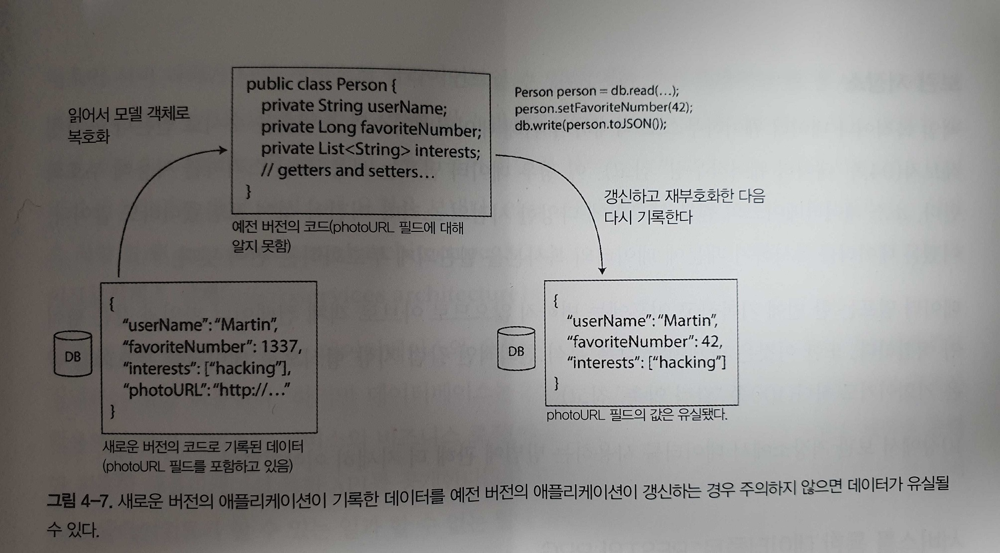

# 부호화와 발전

대부분의 경우 애플리케이션 기능을 변경하려면 저장하는 데이터도 변경해야 한다.<br>
관계형 데이터베이스는 특정 시점에는 정확하게 하나의 스키마가 적용된다.<br>
반면 읽기 스키마(scheme-on-read, schemaless) 데이터베이스는 스키마를 강요하지 않으므로 다른 시점에 쓰여진 이전 데이터 타입과 새로운 데이터 타입이 섞여 포함될 수 있다.<br>
시스템이 계속 원할하게 실행되게 하려면 양방향으로 호환성을 유지해야 한다.
- 하위 호환성 : 새로운 코드는 예전 코드가 기록한 데이터를 읽을 수 있어야 한다.
- 상위 호환성 : 예전 코드는 새로운 코드가 기록한 데이터를 읽을 수 있어야 한다.
  
## 데이터 부호화 형식

프로그램은 보통 (최소한) 두 가지 형태로 표현된 데이터를 사용해 동작한다.<br>
데이터를 파일에 쓰거나 네트워크를 통해 전송하려면 스스로를 포함한 일련의 바이트열(예를 들어 JSON 문서)의 형태로 부호화해야 한다.<br>
따라서 두 가지 표현 사이에 일종의 전환이 필요하다.<br>
인메모리 표현에서 바이트열로의 전환을 부호화(**직렬화**나 **마샬링**이라고도 함)라고 하며, 그 반대를 복호화(**파싱**, **역직렬화**, **언마샬링** 이라고도 함)라고 한다.
- 이 장에서 7장의 트랜잭션 맥락에서 사용되는 직렬화와 용어 중복을 피하기 위해 부호화를 사용한다.

### 언어별 형식

많은 프로그래밍 언어는 인메모리 객체를 바이트열로 부호화하는 기능을 내장한다.<br>
내장 라이브러리 사용의 문제점<br>
- 부호화는 보통 특정 프로그래밍 언어와 묶여 있어 다른 언어에서 데이터를 읽기는 매우 어렵다.
- 동일한 객체 유형의 데이터를 복원하려면 복호화 과정이 임의의 클래스를 인스턴스화할 수 있어야 한다. 이것은 종종 보안 문제의 원인이 된다.
- 데이터를 빠르고 쉽게 부호화하기 위해 상위, 하위 호환성의 불편한 문제가 등한시되곤 한다.
- 효율성(부호화나 복호화에 소요되는 CPU 시간과 부호화된 구조체의 크기)도 종종 나중에 생각하게 된다. (자바의 내장 직렬화는 성능이 좋지 않고 비대해지는 부호화로 유명)
이런 이유로 매우 일시적인 목적 외에 언어에 내장된 부호화를 사용하는 방식은 일반적으로 좋지않다.

### JSON과 XML, 이진 변형

XML은 종종 너무 장황하고 불필요하게 복잡하다고 비판받는다.<br>
JSON의 인기는 주로 웹 브라우저에 내장된 지원과 XML 대비 단순하기 때문이다.<br>
강력하지 않지만 CSV도 인기 있는, 언어 독립적 형식이다.<br>
JSON, XML, CSV는 텍스트 형식이라 어느 정도 사람이 읽을 수 있다.<br>
피상적인 문법적 문제 외에도 일부 미묘한 문제가 있다.
- 수(number)의 부호화에는 많은 애매함이 있다. XML과 CSV에서는 수와 숫자(digit)로 구성된 문자열을 구분할 수 없다. JSON은 문자열과 수를 구분하지만 정수와 부동소수점 수를 구별하지 않고 정밀도를 지정하지 않는다.
- 이 애매함은 큰 수를 다룰 때 문제가 된다. 예를 들어, 2^53^보다 큰 정수는 IEEE 754 배정도 부동소수점 수에서는 정확하게 표현할 수 없으므로 이런 수는 부동소수점 수를 사용하는 언어(javascript 등)에서는 파싱할 때 부정확해질 수 있다.
- JSON과 XML은 유니코드 문자열을 잘 지원한다. 그러나 이진 문자열(문자 부호화가 없는 바이틀열)을 지원하지 않는다. 이진 문자열은 매우 유용한 기능이기 때문에 사람들은 이진 데이터를 Base64를 사용해 텍스트로 부호화해 이런 제한을 피한다. 대신 데이터 크기가 33% 증가한다.
- 필수는 아니지만 XML과 JSON 모두 스키마를 지원한다. XML과 JSON을 정의하는 스키마 언어는 상당히 강력하지만 익히고 구현하기가 상당히 난해하다. XML 스키마는 꽤 널리 사용하지만 많은 JSON 기반 도구는 스키마 사용을 강제하지 않는다. 데이터의 올바른 해석은 스키마의 정보에 따라 다르기 때문에 XML/JSON 스키마를 사용하지 않는 애플리케이션은 필요한 부호화/복호화 로직을 하드코딩해야 할 가능성이 있다.
- CSV는 스키마가 없으므로 각 로우와 칼럼의 의미를 정의하는 작업은 애플리케이션이 해야 한다. 애플리케이션이 새로운 로우나 칼럼 추가를 변경하려면 수동으로 변경을 처리해야 한다. 또한 CSV는 매우 모호한 형식이다(값이 쉼표나 개행 문자를 포함하면 어떻게 될까?). 이스케이핑 규칙을 공식적으로 규정했지만 모든 파서가 규칙을 정확하게 구현하지는 않는다.

#### 이진 부호화
작은 데이터셋의 경우에는 부호화 형식 선택으로 얻는 이득이 무시할 정도지만 테라바이트 정도가 되면 데이터 타입의 선택이 큰 영향을 미친다.<br>
JSON은 XML보다 덜 장황하지만 이진 형식과 비교하면 둘 다 훨씬 많은 공간을 사용한다.<br>
이런 관찰이 JSON과 XML용으로 사용 가능한 다양한 이진 부호화의 개발로 이어졌다.<br>
이런 형식 중일부는 데이터타입 셋을 확장하지만 JSON/XML 데이터 모델은 변경하지 않고 유지했다.<br>
특히 스키마를 지정하지 않기 때문에 부호화된 데이터 안에 모든 객체의 필드 이름을 포함해야 한다.

```json
// 이번 장에서 다양한 형식으로 이진 부호화할 레코드 예(예제 4-1)
{
    "userName": "Martin",
    "favoriteNumber": 1337,
    "interests": ["daydreaming", "hacking"]
}
```

메시지팩의 예

1. 첫 번째 바이트인 0x83은 이어지는 내용이 세 개의 필드(하위 4비트=0x03)를 가진 객체(상위 4비트=0x80)라는 뜻이다. (객체가 15개 넘는 필드를 가지고 있어 4비트에 맞지 않으면 어떻게 될지 궁금할 수 있다. 그러면 다른 타입 지시자를 얻어 필드 수를 2 또는 4바이트로 부호화한다.)
2. 두 번째 바이트인 0xa8은 이어지는 내용이 8바이트 길이(하위 4비트=0x08)의 문자열(상위 4비트=0xa0)이라는 의미다.
3. 다음 8바이트는 필드 이름인 userName의 아스키 코드다. 길이는 이전에 표시됐기 때문에 문자열이 끝나는 곳을 표시(또는 이스케이핑)할 필요가 없다.
4. 다음 7바이트는 앞에 0xa6이 붙고 Martin이라는 6글자 문자열 값을 부호화한다.

 

### 스리프트와 프로토콜 버퍼

아파치 스리프트(Apache Thrift)와 프로토콜 버퍼(Protocol Buffers, 줄여서 protobuf) 모두 부호화할 데이터를 위한 스키마가 필요하다.<br>
스리프트로 예제 4-1의 데이터를 부호화하려면 다음과 같이 스리프트 인터페이스 정의 언어(interface definition language, IDL)로 스키마를 기술해야 한다.

```thrift
struct Person {
    1: required string          userName,
    2: optional i64             favoriteNumber,
    3: optional list<string>    interests
}
```

프로토콜 버퍼로 정의한 동등한 스키마는 스리프트 스키마와 매우 비슷하다.

```protobuf
message Person {
    required string user_name       = 1;
    optional int64 favorite_number  = 2;
    repeated string interests       = 3;
}
```

스리프트와 프로토콜 버퍼는 각각 여기서 본 것처럼 스키마 정의를 사용해 코드를 생성하는 도구가 있다.<br>
스리프트는 **바이너리프로토콜(BinaryProtocol)**과 **컴팩트프로토콜(CompactProtocol)**이라는 두 가지 다른 이진 부호화 형식이 있다.
- 덴스프로토콜(DenseProtocol)은 C++ 구현만 지원하기 때문에 교차 언어로 간주하지 않는다.

 

각 필드에는 (타입이 문자열, 정수, 목록 등인지 나타내기 위해) 타입 주석(annotation)이 있고 필요한 경우 길이(문자열의 길이, 목록의 항목 개수) 표시가 있다.<br>
데이터에 나타난 문자열("Martin", "daydreaming", "hacking")도 이전과 유사하게 아스키(또는 UTF-8)로 부호화한다.<br>
큰 차이점으로 필드 이름(userName, favoriteNumber, interests)이 없다.<br>
대신 부호화된 데이터는 숫자(1, 2, 3)과 같은 **필드 태그(field tag)**를 포함한다.<br>
스리프트 컴팩트프로토콜 부호화는 의미상으로는 바이너리프로토콜과 같지만 동일한 정보를 단지 34바이트로 줄여 부호화한다.

 

프로토콜 버퍼는 같은 데이터를 33바이트로 만든다.


필드를 부호화하는 방법에는 차이가 없다.<br>
required를 사용하면 필드가 설정되지 않은 경우를 실행 시에 확인할 수 있다.<br>
이 기능은 버그를 잡을 때 유용하다.

#### 필드 태그와 스키마 발전

스키마는 필연적으로 시간이 지남에 따라 변한다. 이를 **스키마 발전(schema evolution)**이라고 부른다.<br>
부호화된 레코드는 부호화된 필드의 연결일 뿐이다.<br>
각 필드는 태그 숫자로 식별하고 데이터타입을 주석으로 단다.<br>
필드 값을 설정하지 않은 경우는 단순히 부호화 레코드에서 생략한다.<br>
필드 태그는 부호화된 데이터를 해석하기 위해 매우 중요하다는 사실을 알 수 있다.<br>
부호화된 데이터는 필드 이름을 전혀 참조하지 않기 때문에 스키마에서 필드 이름은 변경할 수 있다.<br>
그러나 필드 태그는 기존의 모든 부호화된 데이터를 인식 불가능하게 만들 수 있기 때문에 변경할 수 없다.<br>
<br>
**필드 추가에서 상위 호환성 유지**<br>
필드에 새로운 태그 번호를 부여하는 방식으로 스키마에 새로운 필드를 추가할 수 있다.<br>
예전 코드에서 새로운 코드로 기록한 데이터를 읽으려는 경우에는 해당 필드를 간단히 무시할 수 있다.<br>
데이터타입 주석은 파서가 몇 바이트를 건너뛸 수 있는지 알려준다.<br>
<br>
**필드 추가에서 하위 호환성 유지**<br>
각 필드에 고유한 태그 번호가 있는 동안에는 태그 번호가 계속 같은 의미를 가지고 있기 때문에 새로운 코드가 예전 데이터를 항상 읽을 수 있다.<br>
하위 호환성을 유지하려면 스키마의 초기 배포 후에 추가되는 모든 필드는 optional로 하거나 기본값을 가져야 한다.<br>
<br>
**필드를 삭제하는 방법**<br>
필드를 추가할 때 하위 호환성과 상위 호환성 문제를 해결하는 방식과 반대로 하면된다.<br>
즉 optional 필드만 삭제할 수 있고(required 필드는 결코 삭제할 수 없다) 같은 태그 번호는 절대 다시 사용할 수 없다는 의미다.

#### 데이터타입과 스키마 발전

필드의 데이터타입은 변경할 수는 있지만 값이 정확하지 않거나 잘릴 위험이 있다.<br>
프로토콜 버퍼가 가진 흥미로운 기능 하나로 프로토콜 버퍼에는 목록이나 배열 데이터타입이 없지만 대신 필드에 repeated 표시자가 있다.<br>
repeated 필드의 부호화는 레코드에 단순히 동일한 필드 태그가 여러 번 나타난다.<br>
(단일 값인) optional 필드를 (다중 값인) repeated 필드로 변경해도 문제가 없다.
- 예전 코드는 목록의 마지막 엘리먼트만 보게 된다.

스리프트에는 전용 목록 데이터타입이 있다.<br>
목록 데이터타입은 프로토콜 버퍼와는 다르게 단일 값에서 다중 값으로의 변경을 허용하지 않지만 중첩된 목록을 지원한다는 장점이 있다.

### 아브로(Avro)

아파치 아브로도 부호화할 데이터 구조를 지정하기 위해 스키마를 사용한다.<br>
아브로에는 두 개의 스키마 언어가 있다.<br>
- 하나는 사람이 편집할 수 있는 아브로 IDL(Avro IDL)이고
```avro
record Person {
    string                  userName;
    union { null, long }    favoriteNumber = null;
    array<string>           interests;
}
```

- 하나는 기계가 더 쉽게 읽을 수 있는 JSON 기반 언어다.
```json
{
    "type": "record",
    "name": "Person",
    "fields": [
        {
            "name": "userName",
            "type": "string"
        },
        {
            "name": "favoriteNumber",
            "type": ["null", "long"],
            "default": null
        },
        {
            "name": "interests",
            "type": {
                "type": "array",
                "items": "string"
            }
        }
    ]
}
```

먼저 스키마에 태그 번호가 없다는 점에 주목하자.<br>
레코드를 부호화한다면 아브로 이진 부호화 길이는 32바이트로 살펴본 모든 부호화 중 길이가 가장 짧다.<br>
바이트열을 살펴보면 필드나 데이터타입을 식별하기 위한 정보가 없음을 알 수 있다.<br>
정수는 가변 길이 부호화를 사용해서 부호화된다.
- 스리프트의 컴팩트프로토콜과 같다.
  


아프로를 이용해 이진 데이터를 파싱하려면 스키마에 나타난 순서대로 필드를 살펴보고 스키마를 이용해 각 필드의 데이터타입을 미리 파악해야 한다.<br>
**정확히 같은 스키마**를 사용하는 경우에만 이진 데이터를 올바르게 복호화할 수 있음을 의미한다.<br>
즉 읽기와 쓰기 간 스키마가 불일치한다면 데이터 복호화가 정확하지 않다는 의미다.

#### 쓰기 스키마와 읽기 스키마

어떤 데이터를 아브로로 부호화하길 원한다면 알고 있는 스키마 버전을 사용해 데이터를 부호화한다.<br>
예를 들어 해당 스키마를 애플리케이션에 포함할 수 있고 이를 **쓰기 스키마(writer's schema)**라고 한다.<br>
어떤 데이터를 복호화하길 원한다면 데이터가 특정 스키마로 복호화하길 기대한다.<br>
이 스키마를 **읽기 스키마(reader's schema)**라 한다.<br>
복호화 코드는 애플리케이션을 빌드하는 동안 스키마로부터 생성된다.<br>
아브로의 핵심 아이디어는 쓰기 스키마와 읽기 스키마가 동일하지 않아도 되며 단지 호환 가능하면 된다는 것이다.<br>
데이터를 복호화(읽기)할 때 아브로 라이브러리는 쓰기 스키마와 읽기 스키마를 함께 살펴본 다음 쓰기 스키마에서 읽기 스키마로 데이터를 변환해 그 차이를 해소한다.<br>
데이터를 읽는 코드가 읽기 스키마에는 없고 쓰기 스키마에 존재하는 필드를 만나면 이 필드는 무시한다.<br>
데이터를 읽는 코드가 기대하는 어떤 필드가 쓰기 스키마에는 포함돼 있지 않은 경우에는 읽기 스키마에 선언된 기본값으로 채운다.


#### 스키마 발전 규칙

아브로에서 상위 호환성은 새로운 버전을 쓰기 스키마와 예전 버전의 읽기 스키마를 가질 수 있음을 의미한다.<br>
반대로 하위 호환성은 새로운 버전의 읽기 스키마와 예전 버전의 쓰기 스키마를 가질 수 있음을 의미한다.<br>
호환성을 유지하기 위해서는 기본값이 있는 필드만 추가하거나 삭제할 수 있다.<br>
기본값이 없는 필드를 추가하면 새로운 읽기는 예전 쓰기가 기록한 데이터를 읽을 수 없기 때문에 하위 호환성이 깨진다.<br>
아브로의 필드에 널(null)을 허용하려면 **유니온 타입(union type)**을 사용해야 한다.<br>
필드가 유니온 엘리먼트 중 하나인 경우에만 기본값으로 널을 사용할 수 있다.<br>
널일 수 있는 것과 널일 수 없는 것이 명확하기 때문에 버그를 막는데 도움이 된다.<br>
아브로는 타입을 변환할 수 있으므로 필드의 데이터타입 변경이 가능하다.<br>
읽기 스키마는 필드 이름의 별칭을 포함할 수 있다.<br>
따라서 별칭에 예전 쓰기 스키마 필드 이름을 매치할 수 있다.<br>
즉 필드 이름 변경은 하위 호환성이 있지만 상위 호환성은 없다는 의미다.<br>
이와 비슷하게 유니온 타입에 엘리먼트를 추가하는 것은 하위 호환성은 있지만 상위 호환성은 없다.

#### 쓰기 스키마란?

아브로를 사용하는 상황
- 많은 레코드가 있는 대용량 파일
- 개별적으로 기록된 레코드를 가진 데이터베이스
- 네트워크 연결을 통해 레코드 보내기
  
스키마 버전을 사용하는 데이터베이스는 어떤 경우라도 유용하다.<br>
스키마 버전들이 설명서처럼 동작해 스키마 호환성 체크를 직접할 수 있기 때문이다.

#### 동적 생성 스키마

프로토콜 버퍼와 스리프트에 비해 아브로 방식은 한 가지 장점이 있다.<br>
아브로가 **동적 생성** 스키마에 더 친숙하다는 점에서 온다.<br>
새로운 데이터 파일을 읽는 사람은 레코드 필드가 변경된 사실을 알게 되지만 필드는 이름으로 식별되기 때문에 갱신된 쓰기 스키마는 여전히 이전 읽기 스키마와 매치 가능하다.<br>
이에 반해 스리프트나 프로토콜 버퍼를 이런 용도로 사용한다면 필드 태그를 수동으로 할당해야만 한다.<br>
즉 데이터베이스 스키마가 변경될 때마다 관리자는 데이터베이스 칼럼 이름과 필드 태그의 매핑을 수동으로 갱신해야 한다.

#### 코드 생성과 동적 타입 언어

스리프트와 프로토콜 버퍼는 코드 생성에 의존한다.<br>
이 방식은 정적 타입 언어에서 유용하다.<br>
왜냐하면 복호화된 데이터를 위해 효율적인 인메모리 구조를 사용하고 데이터 구조에 접근하는 프로그램을 작성할 때 IDE에서 타입 확인과 자동 완성이 가능하기 때문이다.<br>
아브로는 정적 타입 프로그래밍 언어를 위해 코드 생성을 선택적으로 제공한다.<br>
하지만 코드 생성 없이도 사용할 수 있다.<br>
(쓰기 스키마를 포함한) 객체 컨테이너 파일이 있다면 아브로 라이브러리를 사용해 간단히 열어 JSON 파일을 보는 것과 같이 데이터를 볼 수 있다.<br>
이 파일은 필요한 메타데이터를 모두 포함하기 때문에 **자기 기술(self-describing)**적이다.<br>
이 특성은 아파치 피그 같은 동적 타입 데이터 처리 언어와 함께 사용할 때 특히 유용하다.

### 스키마의 장점

프로토콜 버퍼와 스리프트, 아브로는 스키마를 사용해 이진 부호화 형식을 기술한다.<br>
이 스키마 언어는 XML 스키마나 JSON 스키마보다 훨씬 간단하며 더 자세한 유효성 검사 규칙을 지원한다.<br>
스키마 발전은 스키마리스(schemaless) 또는 읽기 스키마(schema-on-read) JSON 데이터베이스가 제공하는 것과 동일한 종류의 유연성을 제공하며 데이터나 도구 지원도 더 잘 보장한다.

## 데이터플로 모드

발전성은 한 번에 모든 것을 변경할 필요 없이 시스템의 다양한 부분을 독립적으로 업그레이드해 변경 사항을 쉽게 반영하는 능력이다.<br>
호환성은 데이터를 부호화하는 하나의 프로세스와 그것을 복호화하는 다른 프로세스 간의 관계다.<br>

### 데이터베이스를 통한 데이터플로

데이터베이스에 기록하는 프로세스는 데이터를 부호화하고 데이터베이스에서 읽는 프로세스는 데이터를 복호화한다.<br>



#### 다양한 시점에 기록된 다양한 값

대부분의 관계형 데이터베이스는 기존 데이터를 다시 기록하지 않고 널을 기본값으로 갖는 새로운 칼럼을 추가하는 간단한 스키마 변경을 허용한다.
- MySQL은 예외다. 꼭 필요하지 않은 상황에서도 대개 전체 테이블을 다시 기록한다.
예전 로우를 읽는 경우 디스크 상의 부호화된 데이터에서 누락된 임의 칼럼은 널로 채운다.

#### 보관 저장소

데이터 덤프는 보통 최신 스키마를 사용해 부호화한다. 소스 데이터베이스의 원본 부호화에 다양한 시점 스키마 버전이 섞여 포함됐더라도 말이다.<br>
어쨌든 데이터를 복사하기 때문에 데이터의 복사본을 일관되게 부호화하는 편이 낫다.<br>
데이터 덤프는 한 번에 기록하고 이후에는 변하지 않으므로 아브로 객체 컨테이너 파일과 같은 형식이 적합하다.<br>
또한 이것은 파케이와 같은 분석 친화적인 칼럼 지향 형식으로 데이터를 부호화할 좋은 기회이기도 하다.<br>

### 서비스를 통한 데이터플로: REST와 RPC

가장 일반적인 방법으로 **클라이언트** 와 **서버** 의 두 역할을 배치한다.<br>
**웹 동작 방식**
- 클라이언트(웹 브라우저)는 웹 서버로 요청을 보낸다.
- 이때 HTML, CSS, 자바스크립트, 이미지 등을 다운로드하기 위해서는 GET 요청을 보내고, 서버로 데이터를 전송하기 위해서는 POST 요청을 보낸다.
- API는 표준화된 프로토콜과 데이터 타입(HTTP, URL, SSL/TLS, HTML 등)으로 구성된다.
- 웹 브라우저, 웹 서버, 웹 사이트 작성자 대부분이 이 표준에 동의하기 때문에 (최소한 이론적으로는!) 모든 웹 브라우저로 모든 웹 사이트에 접근할 수 있다.

웹 브라우저 내에서 수행되는 클라이언트 측 자바스크립트 애플리케이션은 XMLHttpRequest를 사용해 HTTP 클라이언트가 될 수 있다. (이 기술을 에이잭스(Ajax)라고 한다.)<br>
이 경우 서버 응답은 보통 사람이 볼 수 있게 표시하는 HTML보다는 클라이언트 측 애플리케이션 코드가 이후 처리를 편리하게 할 수 있게 부호화한(JSON과 같은) 데이터다.<br>
하나의 서비스가 다른 서비스의 일부 기능이나 데이터가 필요하다면 해당 서비스에 요청을 보낸다.<br>
이런 애플리케이션 개발 방식을 전통적으로는 **서비스 지향 설계(service-oriented architecture, SOA)** 라고 불렀으며 최근에는 이를 더욱 개선해 **마이크로서비스 설계(microservice architecture, MSA)** 란 이름으로 재탄생했다.<br>
서비스 지향 및 마이크로서비스 아키텍처의 핵심 설계 목표는 서비스를 배포와 변경에 독립적으로 만들어 애플리케이션 변경과 유지보수를 더 쉽게 할 수있게 만드는 것이다.<br>
다시 말해 예전 버전과 새로운 버전의 서버와 클라이언트가 동시에 실행되기를 기대한다.<br>
따라서 서버와 클라이언트가 사용하는 데이터 부호화하는 서비스 API의 버전 간 호환이 가능해야 한다.

#### 웹 서비스

보통 서비스와 통신하기 위한 기본 프로토콜로 HTTP를 사용할 때 이를 **웹 서비스**라고 한다.<br>
이것은 웹 서비스가 웹뿐만 아니라 다양한 다른 상황에서도 사용되기 때문에 아마도 약간 잘못된 표현이다.
1. 사용자 디바이스에서 실행하며 HTTP를 통해 서비스에 요청하는 클라이언트 애플리케이션(모바일 디바이스에서의 기본 앱이나 에이잭스를 사용하는 자바스크립트 웹 앱)
2. 서비스 지향/마이크로서비스 아키텍처의 일부로서 대개 같은 데이터센터에 위치한 같은 조직의 다른 서비스에 요청하는 서비스(**미들웨어**)
3. 보통 인터넷을 통해 다른 조직의 서비스에 요청하는 서비스. 이것은 다른 조직의 백엔드 시스템 간 데이터 교환을 위해 사용한다. 이 범주에는 신용카드 처리 시스템 같은 온라인 서비스가 제공하는 공개 API나 사용자 데이터의 공유 접근을위한 OAuth가 포함된다.

웹 서비스에는 대중적인 두 가지 방법인 REST와 SOAP이 있다.<br>
REST는 프로토콜이 아니라 HTTP의 원칙을 토대로 한 설계 철학이다.<br>
REST는 간단한 데이터 타입을 강조하며 URL을 사용해 리소스를 식별하고 캐시 제어, 인증, 콘텐츠 유형 협상에 HTTP 기능을 사용한다.<br>
REST 원칙에 따라 설계된 API를 **RESTful** 이라고 한다.<br>
반대로 SOAP은 네트워크 API 요청을 위한 XML 기반 프로토콜이다.<br>
비록 SOAP은 HTTP 상에서 가장 일반적으로 사용되지만 HTTP와 독립적이며 대부분 HTTP 기능을 사용하지 않는다.<br>
그 대신 다양한 기능을 추가한 광범위하고 복잡한 여러 관련 표준(WS-*라고 알려진 **웹 서비스 프레임워크**)을 제공한다.<br>
SOAP 웹 서비스의 API는 웹서비스 기술 언어(Web Services Description Language) 또는 WSDL이라고 부르는 XML 기반 언어를 사용해 기술한다.<br>
WSDL은 클라이언트가 (XML 메시지로 부호화하고 프레임워크가 다시 복호화하는) 로컬 클래스와 메서드 호출을 사용해 원격 서비스에 접근하는 코드 생성이 가능하다.<br>
이것은 정적 타입 프로그래밍 언어에는 유용하지만 동적 타입 언어에는 유용성이 떨어진다.<br>
비록 SOAP과 다양한 확장이 표면상으로는 표준이 됐지만 다른 벤더의 구현 간 상호운용성은 종종 문제를 일으킨다.<br>
이 같은 이유로 많은 대기업에서 SOAP를 사용하지만 대부분의 작은 기업에서는 선호하지는 않는다.<br>
RESTful API는 간단한 접근 방식을 선호한다.<br>
일반적으로 코드 생성과 자동화된 도구와 관련되지 않은 접근 방식을 말한다.
- Swagger
  
#### 원격 프로시저 호출(RPC) 문제

RPC(remote procedure call) 모델은 원격 네트워크 서비스 요청을 같은 프로세스 안에서 특정 프로그래밍 언어의 함수나 메서드로 호출하는 것과 동일하게 사용 가능하게 해준다.(이런 추상화를 **위치 투명성(location transparency)** 이라 한다).<br>
로컬 함수 호출은 예측 가능하다.
- 그래서 제어 가능한 매개변수에 따라 성공하거나 실패한다.
  
네트워크 요청은 예측이 어렵다.
- 네트워크 문제로 요청과 응답이 유실되거나 원격 장비가 느려지거나 유청에 응답하지 않을 수 있다.
- 이런 문제는 전혀 제어할 수 없다.

예를 들어 실패한 요청을 다시 보내는 것과 같은 대책을 세워야 한다.
- 네트워크 요청은 **타임아웃(timeout)** 으로 결과 없이 반환될 수 있다. 이 경우 무슨 일이 있었는지 쉽게 알 수 있는 방법이 없다.
- 실패한 네트워크 요청을 다시 시도할 때 요청이 실제로는 처리되고 응답만 유실될 수 있다. 이 경우 프로토콜에 중복 제거 기법(**멱등성(idempotence)**)을 적용하지 않으면 재시도는 작업이 여러 번 수행되는 원인이 된다.
- 네트워크 요청은 함수 호출보다 훨씬 느리고 지연 시간은 매우 다앙하다.
- 네트워크로 요청하는 경우에는 모든 매개변수는 네트워크를 통해 전송할 수 있게끔 바이트로열로 부호화해야 한다. 매개변수가 숫자나 문자열처럼 원시형이면 괜찮지만 큰 객체라면 즉시 문제가 될 수 있다.
- RPC 프레임워크는 하나의 언어에서 다른 언어로 데이터타입을 변환해야 한다. 모든 언어가 같은 타입을 가지는 것은 아니기 때문에 깔끔하지 않은 모습이 될 수 있다.
  
REST의 장점 중 하나는 REST가 네트워크 프로토콜이라는 사실을 숨기려 하지 않는다는 점이다.

#### RPC의 현재 방향

스리프트와 아브로는 RPC 지원 기능을 내장하고 있다.<br>
gRPC는 프로토콜 버퍼를 이용한 RPC 구현이다.<br>
차세대 RPC 프레임워크는 원격 요청이 로컬 함수 호출과 다르다는 사실을 더욱 분명히 한다.<br>
**퓨처(future)(프라미스(promise))** 는 병렬로 여러 서비스에 요청을 보내야 하는 상황을 간소화하고 요청 결과를 취합한다.<br>
gRPC는 하나의 요청과 하나의 응답뿐만 아니라 시간에 따른 일련의 요청과 응답으로 구성된 스트림을 지원한다.<br>
REST 상에서 JSON과 같은 부류의 프로토콜보다 이진 부호화 형식을 사용하는 사용자 정의 RPC 프로토콜이 우수한 성능을 제공할지 모른다.<br>
하지만 RESTful API는 다른 중요한 이점이 있다.<br>
실험과 디버깅에 적합(코드 생성이나 소프트웨어 실치 없이 웹 브라우저나 커맨드 라인 도구인 curl을 사용해 간단히 요청을 보낼수 있다.)하다.<br>
그리고 모든 주요 프로그래밍 언어와 플랫폼이 지원하고 사용 가능한 다양한 도구 생태계(서버, 캐시, 로드 밸런서, 프락시, 방화벽, 모니터링, 디버깅 도구, 테스팅 도구 등)가 있다.<br>
RPC 프레임워크의 주요 초점은 보통 같은 데이터센터 내의 같은 조직이 소유한 서비스 간 요청에 있다.

#### 데이터 부호화와 RPC의 발전

발전성이 있으려면 RPC 클라이언트와 서버를 독립적으로 변경하고 배포할 수 있어야 한다.<br>
RPC 스키마의 상하위 호환 속성은 사용된 모든 부호화로부터 상속된다.
- 스리프트, gRPC(프로토콜 버퍼), 아브로 RPC는 각 부호화 형식의 호환성 규칙에 따라 발전할 수 있다.
- SOAP에서 요청과 응답은 XML 스키마로 지정된다. 이 방식은 발전 가능하지만 일부 미묘한 함정이 있다.
- RESTful API는 응답에 JSON(공식적으로 지정된 스키마는 없음)을 가장 일반적으로 사용한다. 그리고 요청에는 JSON이나 URI 부호화/폼 부호화(form-encoded) 요청 매개변수를 사용하곤 한다. 선택적 요청 매개변수 추가나 응답 객체의 새로운 필드 추가는 대개 호환성을 유지하는 변경으로 간주한다.
  
RPC가 종종 조직 경계를 넘나드는 통신에 사용된다는 사실은 서비스 호환성 유지를 더욱 어렵게 한다.<br>
서비스 제공자는 보통 클라이언트르 제어할 수 없고 강제로 업그레이드도 할 수 없기 때문에 호환성은 오랜 시간 동안(아마도 무한정) 유지돼야 한다.<br>
호환성을 깨는 변경이 필요하면 서비스 제공자는 보통 여러 버전의 서비스 API를 함께 유지한다.<br>
RESTful API는 URL이나 HTTP Accept 헤더에 버전 번호를 사용하는 방식이 일반적이다.<br>
특정 클라이언트를 식별하는 데 API 키를 사용하는 서비스는 클라이언트의 요청 API 버전을 서버에 저장한 뒤 버전 선택을 별도 관리 인터페이스를 통해 갱신할 수 있게 하는 것이 한 가지 방식이다.

### 메시지 전달 데이터플로

RPC와 데이터베이스 간 **비동기 메시지 전달 시스템(asynchronous message passing system)** 을 간단히 살펴본다.<br>
멤시지를 직접 네트워크 연결로 전송하지 않고 임시로 메시지를 저장하는 **메시지 브로커(message broker)(또는 메시지 큐(message queue)** 나 **메시지 지향 미들웨어(message-oriented middleward)**)라는 중간 단계를 거쳐 전송한다는 점은 데이터베이스와 유사하다.<br>
메시지 브로커를 사용하는 방식은 직접 RPC를 사용하는 방식과 비교했을 때 여러 장점이 있다.
- 수신자(recipient)가 사용 불가능하거나 과부하 상태라면 메시지 브로커가 버퍼처럼 동작할 수 있기 때문에 시스템 안정성이 향상된다.
- 죽었던 프로세스에 메시지를 다시 전달할 수 있기 때문에 메시지 유실을 방지할 수 있다.
- 송신자(sender)가 수신자의 IP 주소나 포트 번호를 알 필요가 없다(주로 가상 장비를 사용하는 클라우드 배포 시스템에서 특히 유용하다).
- 하나의 메시지를 여러 수신자로 전송할 수 있다.
- 논리적으로 송신자는 수신자와 분리된다(송신자는 메시지를 게시(publish)할 뿐이고 누가 소비(consume)하는지 상관하지 않는다).

메시지 전달 통신은 일반적으로 단방향이라는 점이 RPC와 다르다.<br>
즉 송신 프로세스는 대개 메시지에 대한 응답을 기대하지 않는다.<br>
프로세스가 응답을 전송하는 것은 가능하지만 이것은 보통 별도 채널에서 수행한다.
- 이런 통신 패턴이 **비동기** 다.

#### 메시지 브로커

프로세스 하나가 메시지를 이름이 지정된 **큐** 나 **토픽** 으로 전송하고 브로커는 해당 큐나 토픽 하나 이상의 **소비자(consumer)** 또는 **구독자(subscriber)** 에게 메시지를 전달한다.<br>
동일한 토픽에 여러 생산자(producer)와 소비자가 있을 수 있다.<br>
토픽은 단방향 데이터플로만 제공한다.<br>
하지만 소비자 스스로 메시지를 다른 토픽으로 게시하거나 원본 메시지의 송신자가 소비하는 응답 큐로 게시할 수 있다.<br>
메시지는 일부 메타데이터를 가진 바이트열이므로 모든 부호화 형식을 사용할 수 있다.<br>
부호화가 상하위 호환성을 모두 가진다면 메시지 브로커에서 게시자(publisher)와 소비자를 독립적으로 변경해 임의 순서로 배포할 수 있는 유연성을 얻게 된다.

#### 분산 액터 프레임워크

**액터 모델(actor model)** 은 단일 프로세스 안에서 동시성을 위한 프로그래밍 모델이다.<br>
스레드(경쟁 조건, 잠금(locking), 교착 상태(deadlock)와 연관된 문제들)를 직접 처리하는 대신 로직이 **액터** 에 캡슐화된다.<br>
액터는 (다른 액터와 공유되지 않는) 로컬 상태를 가질 수 있고 비동기 메시지의 송수신으로 다른 액터와 통신하다.<br>
액터는 메시지 전달을 보장하지 않는다.<br>
어떤 에러 상황에서 메시지는 유실될 수 있다.<br>
각 액터 프로세스는 한 번에 하나의 메시지만 처리하기 때문에 스레드에 대해 걱정할 필요가 없고 각 액터는 프레임워크와 독립적으로 실행할 수 있다.<br>
액터 모델은 단일 프로세스 안에서도 메시지가 유실될 수 있다고 이미 가정하기 때문에 위치 투명성은 RPC보다 액터 모델에서 더 잘 동작한다.<br>
비록 네트워크를 통한 지연 시간이 동일한 프로세스 안에서 보다 더 높을 수 있지만 액터 모델을 사용한 경우 로컬과 원격 통신 간 근본적인 불일치가 적다.<br>
액터 기반 애플리케이션의 순회식 업그레이드 수행을 원한다면 메시지가 새로운 버전을 수행하는 노드에서 예전 버전을 수행하는 노드로 전송하거나 그 반대의 경우도 있을 수 있으므로 여전히 상하위 호환성에 주의해야 한다.<br>
인기 있는 분산 액터 프레임워크 세 가지의 부호화 처리
- **아카(Akka)** 는 기본적으로 자바 내장 직렬화를 사용한다. 이는 상위 호환성이나 하위 호환성을 제공하지 않는다. 하지만 프로토콜 버퍼와 같은 부호화 형식으로 대체할 수 있으므로 순회식 업그레이드를 수행할 수 있다.
- **올리언스(Orleans)** 는 기본적으로 사용자 정의 데이터 부호화 형식을 사용한다. 이 부호화 형식은 순회식 업그레이드 배포를 지원하지 않는다. 애플리케이션의 새로운 버전을 배포하려면 새로운 클러스터를 설정하고 나서 이전 클러스터의 트래픽을 새로운 클러스터로 이전한 뒤 이전 클러스터를 종료해야 한다. 올리언스는 아카와 마찬가지로 사용자 정의 직렬화 플러그인을 사용할 수 있다.
- **얼랭(erlang)** OTP에서는 (시스템이 고가용성을 위해 설계된 많은 기능이 있음에도) 레코드 스키마를 변경하는 일은 의외로 어렵다. 순회식 업그레이드는 가능하지만 신중하게 계획해야 한다. 실험적인 새로운 maps 데이터타입은 향후에 순회식 업그레이드를 더 쉽게 할 수 있게 만들 것이다.