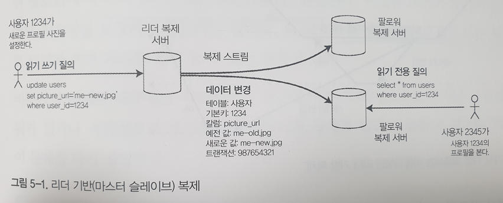
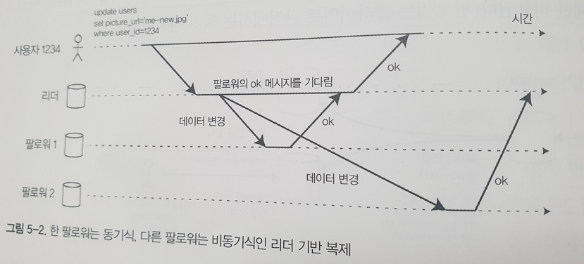
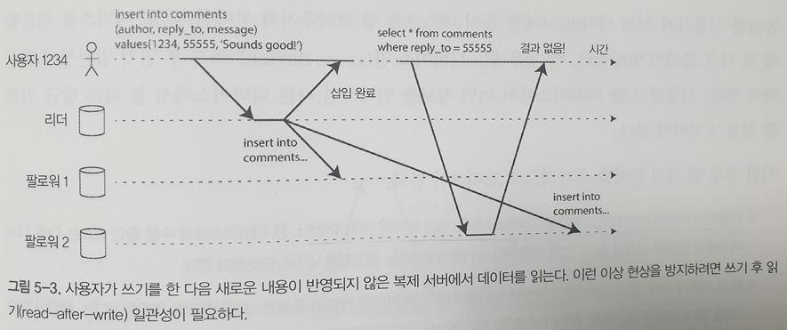
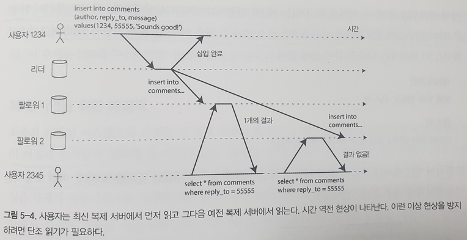

# 복제
**복제**란 네트워크로 연결된 여러 장비에 동일한 데이터의 복사본을 유지한다는 의미  
복제가 필요한 이유  
- 지리적으로 사용자와 가깝게 데이터를 유지해 지연 시간을 줄일 수 있음
- 시스템의 일부에 장애가 발생해도 지속적으로 동작할 수 있게 해 가용성을 높임
- 읽기 질의를 제공하는 장비의 수를 확장해 읽기 처리량을 늘림

이번 장에서 이야기 하는 복제는 각 장비에 전체 데이터셋의 복사본을 보유할 수 있다고 가정한다는 것을 유의하자. 단일 장비에 넣기에 너무 큰 데이터를 대상으로 한 파티셔닝(샤딩)에 대한 내용은 6장에서 다룬다.  

복제 중인 데이터가 시간이 지나도 변경되지 않는다면 한번에 모든 노드에 데이터를 복사해 복제 데이터를 유지할 수 있지만, 복제된 데이터의 변경이 일어나는 경우 다양한 문제가 발생할 수 있다.  
노드 간 변경을 복제하기 위해 인기 있는 알고리즘
- 단일 리더(single-leader)
- 다중 리더(multi-leader)
- 리더 없는(leaderless)  

거의 모든 분산 DB는 이 세 가지 방법 중 하나를 사용  

또한, 복제에서 고려해야하는 많은 트레이드 오프가 있는데 예를 들어 동기식 복제와 비동기식 복제, 잘못된 복제본을 어떻게 처리할지에 대한 부분이다.  

## 리더와 팔로워
DB의 복사본을 저장하는 각 노드를 복제 서버(replica)라고 하는데, 다중 복제 서버를 사용하는 경우 모든 복제 서버에 모든 복제 데이터가 있다는 사실을 어떻게 보장할 수 있을까에 대한 부분에 대해 고민해야 한다. DB의 모든 쓰기는 모든 복제 서버에서 처리돼야 한다. 그렇지 않으면 복제 서버는 더 이상 동일한 데이터를 유지할 수 없기 때문이다. 이 문제를 해결하기 위한 일반적인 해결책은 **리더 기반 복제(leader-based-replication) 능동(active)/수동(passive) 마스터(master)/(slave) 복제**라는 방식을 사용한다.  
이 방식은 복제 서버 중 하나를 리더(leader)로 지정하고 클라이언트가 DB에 데이터를 쓰는 경우 리더가 요청을 받아 로컬이 기록하게 되고, 다른 복제 서버(팔로워(follower))는 리더가 로컬 저장소에 새로운 데이터를 기록할 때마다 데이터 변경을 복제 로그(replication log)나 변경 스트림(change stream)의 일부로 팔로워에게 전송한다.  
  
이 복제 모드는 postgresQL, MySQL, Oracle Data Guard등에 내장된 기능이다.

### 동기식 대 비동기식 복제
복제 시스템의 중요한 세부 사항은 복제가 **동기식**으로 발생하는지 **비동기식**으로 발생하는지 여부이다. 
  

위의 이미지에서 팔로워1은 동기식, 팔로워2는 비동기식 복제를 나타내며, 동기식에서 리더는 팔로워1이 쓰기를 수신했는지 여부를 확인할 때까지 기다리며 복제가 끝난 이후 다른 클라이언트에게도 데이터를 보여주게 된다. 반면 비동기식에서는 리더가 메세지를 팔로워에게 전달한 후 팔로워의 응답을 확인하지 않는다.  

**동기식 복제의 장점**
- 팔로워가 리더와 일관성 있게 최신 데이터 복사본을 가지는 것을 보장
- 갑자기 리더가 작동하지 않아도 데이터는 팔로워에서 계속 사용할 수 있음을 확신할 수 있다.

**동기식 복제의 단점**
- 어떤 이유로 동기 팔로워가 응답하지 않는다면 쓰기 처리를 완료할 수 없음

명확한 단점이 존재하기 때문에 모든 팔로워가 동기식인 상황은 비현실적이고, 임의의 한 노드의 장애가 시스템 전체를 멈추게 할 가능성을 내포하게 된다. 따라서 현실적으로 DB에서 동기식 복제를 사용하려면, 보통 하나의 팔로워는 동기식으로 하고 그 밖에는 비동기식으로 하는 것을 의미하며, 동기식 팔로워가 사용할 수 없게 되거나 느려지면 비동기식 팔로워중 하나가 동기식으로 변경하는 방식으로 동작하는데 이는 적어도 두 대의 노드에 데이터의 최신 복사본이 있다는 것을 보장하며 **반동기식(semi-synchronous)** 라고 한다.  

보통 리더 기반 복제는 완전히 비동기식으로 이루어지며, 이런 경우 리더가 잘못되고 복구할 수 없으면 팔로워에 아직 복제되지 않은 쓰기는 유실되지만, 모든 팔로워가 잘못되더라도 리더가 쓰기 처리를 계속 할 수 있다는 장점이 있음  

### 새로운 팔로워 설정
복제 서버 수를 늘리거나 장애 노드의 대체를 위해서는 새로운 팔로워를 설정해야하는데, 새로운 팔로워가 리더의 데이터 복제본을 정확히 가지고 있는지 어떻게 보장할까  
간단히 한 노드에서 다른 노드로 데이터 파일을 복사하는 것만으로는 충분하지 않다. 클라이언트는 지속적으로 DB에 기록하고 데이터는 항상 유동적이기 때문이다.  
DB lock를 통해 일관성을 유지할 수 있지만 고가용성 목표에 부합하지 않는다.  
다행히 팔로워 설정은 대개 중단없이 수행할 수 있고 아래와 같은 과정으로 수행된다.
- 가능하다면 전체 DB를 잠그지 않고 리더의 DB 스냅숏을 일정 시점에 가지고 온다
- 스냅숏을 새로운 팔로워 노드에 복사
- 팔로워는 리더에 연결해 스냅숏 이후 발생한 모든 데이터 변경을 요청
- 팔로워가 스냅숏 이후 데이터 변경의 미처리분을 모두 처리했을 때 따라잡았다라고 말하며, 리더로 부터 데이터 변화를 받아 처리할 수 있음

## 노드 중단 처리
시스템의 모든 노드는 장애로 인해 예기치 않게 중단될 수 있지만 계획된 유지보스로 인해 중단될 수도 있다 중단 시간 없이 개별 노드를 재부팅할 수 있다는 점은 운영과 유지보수에 큰 장점이다. 리더 기반 복제에서 고가용성은 어떻게 달성될까

### 팔로워 장애: 따라잡기 복구
각 팔로워는 리더로부터 수신한 데이터 변경 로그를 로컬 디스크에 보관하고 있기 때문에 장애가 발생해도 쉽게 복구가 가능하다.
- 보관된 로그에서 결함이 발생하기 전에 처리한 마지막 트랜잭션을 알아냄
- 리더에 연결이 성공했을 때 끊어진 동안 발생한 데이터를 변경을 모두 요청
- 변경사항이 적용되어 리더를 따라잡게 되면 이전과 같이 동작

### 리더 장애: 장애 복구
리더에서의 장애는 팔로워에서 발생하는 장애와 달리 처리가 까다로움  
장애를 복구하기 위해 자동 장애복구와 수동 장애 복구가 있는데 자동 장애 복구의 절차는 아래와 같다.
- 리더가 장애인지 판단 타임아웃값을 이용해 장애 여부 판단
- 새로운 리더 선출 제어 노드에 의해 새로운 리더가 임명
- 새로운 리더 사용을 위해 시스템 재설정

자동 장애 복구 과정에서 발생할 수 있는 문제점
- 비동기식 복제를 사용하면 새로운 리더는 이전 리더가 실패하기 전 이전 리더의 쓰기를 일부 수신하지 못할 가능성이 발생 쓰기에 대해 충돌이 발생할 가능성과 폐기가 발생했을 가능성이 있음
- 쓰기를 폐기하는 방법은 DB외부의 다른 저장소 시스템이 DB내용에 맞춰 조정돼야 한다면 특히 위험하다
- 특정 결함 시나리오에서는 두 노드 리더로 설정될 수도 있으며, 이를 스플릿 브레인(split brain)이라고 하며, 두 리더가 쓰기를 받으며 충돌이 발생할 수 있다.
- 장애를 판단하기 적절한 시간을 정하는 것조차 조심스럽게 설정해야 한다. 값이 작은 경우 불필요한 장애 복구가 발생할 수 있고, 값이 크게 되면 실제 장애가 발생하는 경우 복구까지의 시간이 오래 걸리게 된다.  

## 복제 로그 구현
리더 기반 복제의 내부적 동작 방식을 알아보자.

### 구문 기반 복제
리더는 모든 쓰기 요청(**구문(statement)**)을 기록하고 쓰기를 실행한 다음 구문 로그를 팔로워에게 전송  
INSERT, UPDATE, DELETE등의 구문을 팔로워에게 전달하여 각 팔로워에서 직접 SQL문을 수행하는데 이는 아래의 문제점이 발생할 수 있음
- 현재 날짜와 시간을 얻기 위한 NOW(), RAND()와 같은 비결정적 함수를 호출하는 모든 구문은 각 복제 서버마다 다른 값을 생성할 가능성이 발생
- 자동증가 컬럼을 사용하는 구문이나 DB에 있는 데이터에 의존한다면 해당 Query는 정확히 같은 순서로 실행되어야 함
- 트리거, 프로시저등 부수 효과가 완벽하게 결정적이지 않으면 각 복제 서버에서 다른 부수 효과가 발생할 수 있음  
이를 해결하기 위한 방법으로 리더는 구문을 기록할 때 모든 비결정적 함수 호출을 고정 값을 반환하게 끔 대체하는 방식을 사용할 수 있음

### 쓰기 전 로그 배송
3장 트랜잭션에서 살펴본 내용으로 일반적으로 모든 쓰기는 로그에 기록되는데, 이를 log를 이용하는 방식도 있다. 완전히 동일한 로그를 사용해 다른 노드에서 복제 서버를 구축하고, 리더는 디스크에 로그를 기록하고 해당 로그를 클라이언트에 전달
postgresQL이나 Oracle에서 사용하는 방법으로 WAL(Write-ahead log)는 어떤 디스크 블록에서 어떤 바이트를 변경했는지와 같이 상세한 부분도 포함

### 논리적 로그 복제
복제 로그를 저장소 엔진 내부와 분리하기 위한 대안 하나는 복제와 저장소 엔진을 위해 다른 로그 형식을 사용하는 것인데 이렇게 사용하는 로그를 **논리적 로그(logical log)** 라고 한다. 논리적 로그는 아래의 정보를 포함
- 삽입된 로우의 로그는 모든 칼럼의 새로운 값을 포함
- 삭제된 로우의 로그는 로우를 고유하게 식별하는 데 필요한 정보를 담음
- 갱신된 로우의 로그는 로우를 고유하게 식별하는 데 필요한 정보와 모든 컬럼의 새로운 값을 포함
이러한 논리적 로그 형식은 외부 애플리케이션이 파싱하기 더 쉬우며 이를 변경 데이터 캡쳐(Change Data Capture(CDC))라고 한다.

### 트리거 기반 복제
위에서 언급한 방식은 모두 DB시스템에 의해 구현되는데, 트리거 기반 복제는 데이터의 서브셋만 복제하거나 DB를 다른 종류의 DB에 복제해야하는 경우 충돌 해소 로직이 필요하다면 복제를 통해 다른 애플리케이션 층으로 옮겨야한다.  
트리거는 사용자 정의 애플리케이션 코드를 등록할 수 있으며, DB시스템에서 데이터가 변경되는 경우 자동으로 실행되어 분리된 테이블로의 복제가 가능하도록 한다.  
다른 시스템과의 연결이 필요하기 때문에 일반적으로 더 많은 오버헤드가 발생  

## 복제 지연 문제
리더 기반 복제는 모든 쓰기가 단일 노드를 거쳐야 하지만 읽기 전용 질의는 어떤 복제 서버에서도 가능한대, 대부분이 읽기 요청이고 쓰기가 아주 작은 비율로 구성된 작업부하라면 많은 팔로워를 만들어 팔로워 간 읽기 요청을 분산시킬 수 있다.  
이 것을 **읽기 확장(read-scaling)** 아키텍쳐라 하며 팔로워를 더 추가하여 읽기 전용 요청을 처리하기 위한 용량을 늘리는 것도 가능하다.  
하지만 이 방식은 비동기식 복제에서만 동작하는데, 비동기의 경우 리더와 팔로워가 동일한 데이터를 가진다는 것을 보장하지 않기 때문에 팔로워에서 보여주는 데이터와 리더가 가진 데이터가 일치 하지 않을 수 있지만 결국에는 같은 결과를 가지게 되 정상적으로 동작하게 된다. 이를 **최종적 일관성**이라고 한다.  

### 자신이 쓴 내용 읽기
위에서 언급한 리더와 팔로워 간에 발생하는 차이를 줄이기 위해 여러 가지 방법을 사용할 수 있는데, 해결법에 대해서 알아보도록 하자.  
데이터를 쓴 후 팔로워에서 동기화가 되지 않고 읽기 요청이 들어오는 경우 작성한 데이터를 보지 못할 수 있는데 **쓰기 후 일관성(자신의 쓰기 읽기 일관성)** 이 필요하다.
  

사용자가 페이지를 재로딩했을 때 항상 자신이 제출한 모든 갱신을 볼 수 있음을 보장하며 다른 사용자에 대해서는 보장하지 않는다. 이를 구현하기 위한 방법은 아래와 같다.  
- 사용자가 수정한 내용을 읽을 때는 리더에서 읽고, 그 밖의 내용은 팔로워에서 읽기
- 데이터 갱신 후 1분간은 모든 데이터 읽기를 리더에서 수행
- 클라이언트는 가장 최근 쓰기의 타임스탬프를 기억할 수 있는데, 이를 이용해 복제 서버가 아직 최신 내용이 아닌 경우 다른 복제 서버가 읽기를 처리하거나 복제 서버가 따라잡을 때까지 질의를 대기
- 복제 서버가 여러 데이터 센터에 분산되어 있다면 복잡도 증가

추가적으로 동일한 사용자가 여러 디바이스를 사용하는 경우에는 디바이스 간 쓰기 후 읽기 일관성에 대한 내용도 고려해야하는데
- 사용자의 마지막 갱신 타임스탬프를 기억해야 하는 접근 방식은 더욱 어렵다.
- 복제 서버가 여러 데이터센터 간 분산되어 있다면 다른 디바이스의 연결이 동일한 데이터센터로 라우팅된다는 보장이 없기에 리더에서 읽어야 할 필요가 있는 접근법이라면 먼저 사용자 디바이스의 요청을 동일한 데이터센터로 라우팅할 필요가 있음

### 단조 읽기
시간이 거꾸로 흐르는 현상에 대한 내용도 고려 내용중 하나인데, 이는 사용자가 각기 다른 복제 서버에서 여러 읽기를 수행할 때 발생할 수 있다. 한 사용자가 동일한 질의를 두 번 수행하는 경우 첫번째 팔로워는 복제 작업이 빨라 결과를 반환하고 두번째 작업은 복제 작업이 느려 결과를 반환하지 않는 것이다.  
  
**단조 읽기(monotonic read)** 는 이런 종류의 이상 현상이 발생하지 않음을 보장한다. 단조 읽기는 이전에 새로운 데이터를 읽은 후에는 이전 데이터를 읽지 않게 하며 각 사용자의 읽기가 항상 동일한 복제 서버에서 수행되게끔 하는 것이다.

### 일관된 순서로 읽기
세번째는 인과성 위반 우려이다. 실제 메세지의 작성이 A->B로 이루어졌지만 동기화 B->A로 메세지의 동기화가 이루어 지는 경우에 발생한다.  
이는 파티셔닝된(샤딩) DB에서 발생하는 특징적인 문제이다.
  
**일관된 순서로 읽기(Consistent Prefix Read)** 는 일관된 순서로 읽기는 일련의 쓰기가 특정 순서로 발생한다면 이 쓰기를 읽는 모든 사용자는 같은 순서로 쓰여진 내용을 보게 됨을 보장하는 것으로 서로 인과성이 있는 쓰기가 동일한 파티션에 기록되게끔 하는 방법이 있다.  

### 복제 지연을 위한 해결책
최종적 일관성이 보장되지만 복제로 인해 발생하는 지연이 몇 분, 몇 시간으로 이어지는 경우 사용자에게는 좋지 않은 경험이 되기 때문에 쓰기 후 읽기와 같은 강한 보장을 제공하도록 시스템을 설계해야 하며, 이를 명확하게 보장하기 위해서는 있는 것이 **트랜잭션**이다.