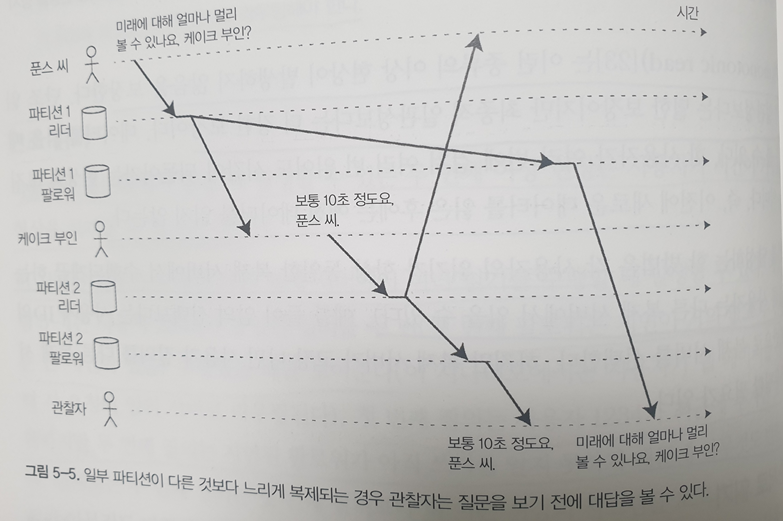
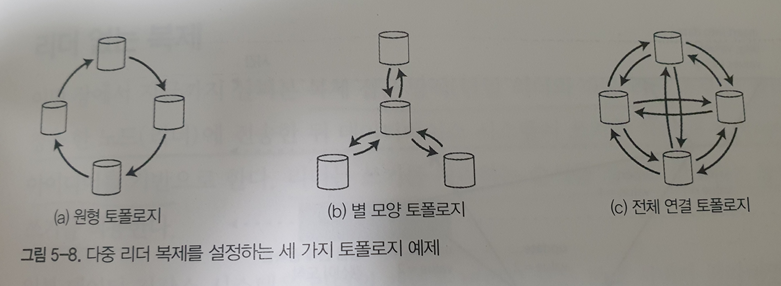

# 복제
**복제**란 네트워크로 연결된 여러 장비에 동일한 데이터의 복사본을 유지한다는 의미  
복제가 필요한 이유  
- 지리적으로 사용자와 가깝게 데이터를 유지해 지연 시간을 줄일 수 있음
- 시스템의 일부에 장애가 발생해도 지속적으로 동작할 수 있게 해 가용성을 높임
- 읽기 질의를 제공하는 장비의 수를 확장해 읽기 처리량을 늘림

이번 장에서 이야기 하는 복제는 각 장비에 전체 데이터셋의 복사본을 보유할 수 있다고 가정한다는 것을 유의하자. 단일 장비에 넣기에 너무 큰 데이터를 대상으로 한 파티셔닝(샤딩)에 대한 내용은 6장에서 다룬다.  

복제 중인 데이터가 시간이 지나도 변경되지 않는다면 한번에 모든 노드에 데이터를 복사해 복제 데이터를 유지할 수 있지만, 복제된 데이터의 변경이 일어나는 경우 다양한 문제가 발생할 수 있다.  
노드 간 변경을 복제하기 위해 인기 있는 알고리즘
- 단일 리더(single-leader)
- 다중 리더(multi-leader)
- 리더 없는(leaderless)  

거의 모든 분산 DB는 이 세 가지 방법 중 하나를 사용  

또한, 복제에서 고려해야하는 많은 트레이드 오프가 있는데 예를 들어 동기식 복제와 비동기식 복제, 잘못된 복제본을 어떻게 처리할지에 대한 부분이다.  

## 리더와 팔로워
DB의 복사본을 저장하는 각 노드를 복제 서버(replica)라고 하는데, 다중 복제 서버를 사용하는 경우 모든 복제 서버에 모든 복제 데이터가 있다는 사실을 어떻게 보장할 수 있을까에 대한 부분에 대해 고민해야 한다. DB의 모든 쓰기는 모든 복제 서버에서 처리돼야 한다. 그렇지 않으면 복제 서버는 더 이상 동일한 데이터를 유지할 수 없기 때문이다. 이 문제를 해결하기 위한 일반적인 해결책은 **리더 기반 복제(leader-based-replication) 능동(active)/수동(passive) 마스터(master)/(slave) 복제**라는 방식을 사용한다.  
이 방식은 복제 서버 중 하나를 리더(leader)로 지정하고 클라이언트가 DB에 데이터를 쓰는 경우 리더가 요청을 받아 로컬이 기록하게 되고, 다른 복제 서버(팔로워(follower))는 리더가 로컬 저장소에 새로운 데이터를 기록할 때마다 데이터 변경을 복제 로그(replication log)나 변경 스트림(change stream)의 일부로 팔로워에게 전송한다.  
  
이 복제 모드는 postgresQL, MySQL, Oracle Data Guard등에 내장된 기능이다.

### 동기식 대 비동기식 복제
복제 시스템의 중요한 세부 사항은 복제가 **동기식**으로 발생하는지 **비동기식**으로 발생하는지 여부이다. 
  

위의 이미지에서 팔로워1은 동기식, 팔로워2는 비동기식 복제를 나타내며, 동기식에서 리더는 팔로워1이 쓰기를 수신했는지 여부를 확인할 때까지 기다리며 복제가 끝난 이후 다른 클라이언트에게도 데이터를 보여주게 된다. 반면 비동기식에서는 리더가 메세지를 팔로워에게 전달한 후 팔로워의 응답을 확인하지 않는다.  

**동기식 복제의 장점**
- 팔로워가 리더와 일관성 있게 최신 데이터 복사본을 가지는 것을 보장
- 갑자기 리더가 작동하지 않아도 데이터는 팔로워에서 계속 사용할 수 있음을 확신할 수 있다.

**동기식 복제의 단점**
- 어떤 이유로 동기 팔로워가 응답하지 않는다면 쓰기 처리를 완료할 수 없음

명확한 단점이 존재하기 때문에 모든 팔로워가 동기식인 상황은 비현실적이고, 임의의 한 노드의 장애가 시스템 전체를 멈추게 할 가능성을 내포하게 된다. 따라서 현실적으로 DB에서 동기식 복제를 사용하려면, 보통 하나의 팔로워는 동기식으로 하고 그 밖에는 비동기식으로 하는 것을 의미하며, 동기식 팔로워가 사용할 수 없게 되거나 느려지면 비동기식 팔로워중 하나가 동기식으로 변경하는 방식으로 동작하는데 이는 적어도 두 대의 노드에 데이터의 최신 복사본이 있다는 것을 보장하며 **반동기식(semi-synchronous)** 라고 한다.  

보통 리더 기반 복제는 완전히 비동기식으로 이루어지며, 이런 경우 리더가 잘못되고 복구할 수 없으면 팔로워에 아직 복제되지 않은 쓰기는 유실되지만, 모든 팔로워가 잘못되더라도 리더가 쓰기 처리를 계속 할 수 있다는 장점이 있음  

### 새로운 팔로워 설정
복제 서버 수를 늘리거나 장애 노드의 대체를 위해서는 새로운 팔로워를 설정해야하는데, 새로운 팔로워가 리더의 데이터 복제본을 정확히 가지고 있는지 어떻게 보장할까  
간단히 한 노드에서 다른 노드로 데이터 파일을 복사하는 것만으로는 충분하지 않다. 클라이언트는 지속적으로 DB에 기록하고 데이터는 항상 유동적이기 때문이다.  
DB lock를 통해 일관성을 유지할 수 있지만 고가용성 목표에 부합하지 않는다.  
다행히 팔로워 설정은 대개 중단없이 수행할 수 있고 아래와 같은 과정으로 수행된다.
- 가능하다면 전체 DB를 잠그지 않고 리더의 DB 스냅숏을 일정 시점에 가지고 온다
- 스냅숏을 새로운 팔로워 노드에 복사
- 팔로워는 리더에 연결해 스냅숏 이후 발생한 모든 데이터 변경을 요청
- 팔로워가 스냅숏 이후 데이터 변경의 미처리분을 모두 처리했을 때 따라잡았다라고 말하며, 리더로 부터 데이터 변화를 받아 처리할 수 있음

## 노드 중단 처리
시스템의 모든 노드는 장애로 인해 예기치 않게 중단될 수 있지만 계획된 유지보스로 인해 중단될 수도 있다 중단 시간 없이 개별 노드를 재부팅할 수 있다는 점은 운영과 유지보수에 큰 장점이다. 리더 기반 복제에서 고가용성은 어떻게 달성될까

### 팔로워 장애: 따라잡기 복구
각 팔로워는 리더로부터 수신한 데이터 변경 로그를 로컬 디스크에 보관하고 있기 때문에 장애가 발생해도 쉽게 복구가 가능하다.
- 보관된 로그에서 결함이 발생하기 전에 처리한 마지막 트랜잭션을 알아냄
- 리더에 연결이 성공했을 때 끊어진 동안 발생한 데이터를 변경을 모두 요청
- 변경사항이 적용되어 리더를 따라잡게 되면 이전과 같이 동작

### 리더 장애: 장애 복구
리더에서의 장애는 팔로워에서 발생하는 장애와 달리 처리가 까다로움  
장애를 복구하기 위해 자동 장애복구와 수동 장애 복구가 있는데 자동 장애 복구의 절차는 아래와 같다.
- 리더가 장애인지 판단 타임아웃값을 이용해 장애 여부 판단
- 새로운 리더 선출 제어 노드에 의해 새로운 리더가 임명
- 새로운 리더 사용을 위해 시스템 재설정

자동 장애 복구 과정에서 발생할 수 있는 문제점
- 비동기식 복제를 사용하면 새로운 리더는 이전 리더가 실패하기 전 이전 리더의 쓰기를 일부 수신하지 못할 가능성이 발생 쓰기에 대해 충돌이 발생할 가능성과 폐기가 발생했을 가능성이 있음
- 쓰기를 폐기하는 방법은 DB외부의 다른 저장소 시스템이 DB내용에 맞춰 조정돼야 한다면 특히 위험하다
- 특정 결함 시나리오에서는 두 노드 리더로 설정될 수도 있으며, 이를 스플릿 브레인(split brain)이라고 하며, 두 리더가 쓰기를 받으며 충돌이 발생할 수 있다.
- 장애를 판단하기 적절한 시간을 정하는 것조차 조심스럽게 설정해야 한다. 값이 작은 경우 불필요한 장애 복구가 발생할 수 있고, 값이 크게 되면 실제 장애가 발생하는 경우 복구까지의 시간이 오래 걸리게 된다.  

## 복제 로그 구현
리더 기반 복제의 내부적 동작 방식을 알아보자.

### 구문 기반 복제
리더는 모든 쓰기 요청(**구문(statement)**)을 기록하고 쓰기를 실행한 다음 구문 로그를 팔로워에게 전송  
INSERT, UPDATE, DELETE등의 구문을 팔로워에게 전달하여 각 팔로워에서 직접 SQL문을 수행하는데 이는 아래의 문제점이 발생할 수 있음
- 현재 날짜와 시간을 얻기 위한 NOW(), RAND()와 같은 비결정적 함수를 호출하는 모든 구문은 각 복제 서버마다 다른 값을 생성할 가능성이 발생
- 자동증가 컬럼을 사용하는 구문이나 DB에 있는 데이터에 의존한다면 해당 Query는 정확히 같은 순서로 실행되어야 함
- 트리거, 프로시저등 부수 효과가 완벽하게 결정적이지 않으면 각 복제 서버에서 다른 부수 효과가 발생할 수 있음  
이를 해결하기 위한 방법으로 리더는 구문을 기록할 때 모든 비결정적 함수 호출을 고정 값을 반환하게 끔 대체하는 방식을 사용할 수 있음

### 쓰기 전 로그 배송
3장 트랜잭션에서 살펴본 내용으로 일반적으로 모든 쓰기는 로그에 기록되는데, 이를 log를 이용하는 방식도 있다. 완전히 동일한 로그를 사용해 다른 노드에서 복제 서버를 구축하고, 리더는 디스크에 로그를 기록하고 해당 로그를 클라이언트에 전달
postgresQL이나 Oracle에서 사용하는 방법으로 WAL(Write-ahead log)는 어떤 디스크 블록에서 어떤 바이트를 변경했는지와 같이 상세한 부분도 포함

### 논리적 로그 복제
복제 로그를 저장소 엔진 내부와 분리하기 위한 대안 하나는 복제와 저장소 엔진을 위해 다른 로그 형식을 사용하는 것인데 이렇게 사용하는 로그를 **논리적 로그(logical log)** 라고 한다. 논리적 로그는 아래의 정보를 포함
- 삽입된 로우의 로그는 모든 칼럼의 새로운 값을 포함
- 삭제된 로우의 로그는 로우를 고유하게 식별하는 데 필요한 정보를 담음
- 갱신된 로우의 로그는 로우를 고유하게 식별하는 데 필요한 정보와 모든 컬럼의 새로운 값을 포함
이러한 논리적 로그 형식은 외부 애플리케이션이 파싱하기 더 쉬우며 이를 변경 데이터 캡쳐(Change Data Capture(CDC))라고 한다.

### 트리거 기반 복제
위에서 언급한 방식은 모두 DB시스템에 의해 구현되는데, 트리거 기반 복제는 데이터의 서브셋만 복제하거나 DB를 다른 종류의 DB에 복제해야하는 경우 충돌 해소 로직이 필요하다면 복제를 통해 다른 애플리케이션 층으로 옮겨야한다.  
트리거는 사용자 정의 애플리케이션 코드를 등록할 수 있으며, DB시스템에서 데이터가 변경되는 경우 자동으로 실행되어 분리된 테이블로의 복제가 가능하도록 한다.  
다른 시스템과의 연결이 필요하기 때문에 일반적으로 더 많은 오버헤드가 발생  

## 복제 지연 문제
리더 기반 복제는 모든 쓰기가 단일 노드를 거쳐야 하지만 읽기 전용 질의는 어떤 복제 서버에서도 가능한대, 대부분이 읽기 요청이고 쓰기가 아주 작은 비율로 구성된 작업부하라면 많은 팔로워를 만들어 팔로워 간 읽기 요청을 분산시킬 수 있다.  
이 것을 **읽기 확장(read-scaling)** 아키텍쳐라 하며 팔로워를 더 추가하여 읽기 전용 요청을 처리하기 위한 용량을 늘리는 것도 가능하다.  
하지만 이 방식은 비동기식 복제에서만 동작하는데, 비동기의 경우 리더와 팔로워가 동일한 데이터를 가진다는 것을 보장하지 않기 때문에 팔로워에서 보여주는 데이터와 리더가 가진 데이터가 일치 하지 않을 수 있지만 결국에는 같은 결과를 가지게 되 정상적으로 동작하게 된다. 이를 **최종적 일관성**이라고 한다.  

### 자신이 쓴 내용 읽기
위에서 언급한 리더와 팔로워 간에 발생하는 차이를 줄이기 위해 여러 가지 방법을 사용할 수 있는데, 해결법에 대해서 알아보도록 하자.  
데이터를 쓴 후 팔로워에서 동기화가 되지 않고 읽기 요청이 들어오는 경우 작성한 데이터를 보지 못할 수 있는데 **쓰기 후 일관성(자신의 쓰기 읽기 일관성)** 이 필요하다.
  

사용자가 페이지를 재로딩했을 때 항상 자신이 제출한 모든 갱신을 볼 수 있음을 보장하며 다른 사용자에 대해서는 보장하지 않는다. 이를 구현하기 위한 방법은 아래와 같다.  
- 사용자가 수정한 내용을 읽을 때는 리더에서 읽고, 그 밖의 내용은 팔로워에서 읽기
- 데이터 갱신 후 1분간은 모든 데이터 읽기를 리더에서 수행
- 클라이언트는 가장 최근 쓰기의 타임스탬프를 기억할 수 있는데, 이를 이용해 복제 서버가 아직 최신 내용이 아닌 경우 다른 복제 서버가 읽기를 처리하거나 복제 서버가 따라잡을 때까지 질의를 대기
- 복제 서버가 여러 데이터 센터에 분산되어 있다면 복잡도 증가

추가적으로 동일한 사용자가 여러 디바이스를 사용하는 경우에는 디바이스 간 쓰기 후 읽기 일관성에 대한 내용도 고려해야하는데
- 사용자의 마지막 갱신 타임스탬프를 기억해야 하는 접근 방식은 더욱 어렵다.
- 복제 서버가 여러 데이터센터 간 분산되어 있다면 다른 디바이스의 연결이 동일한 데이터센터로 라우팅된다는 보장이 없기에 리더에서 읽어야 할 필요가 있는 접근법이라면 먼저 사용자 디바이스의 요청을 동일한 데이터센터로 라우팅할 필요가 있음

### 단조 읽기
시간이 거꾸로 흐르는 현상에 대한 내용도 고려 내용중 하나인데, 이는 사용자가 각기 다른 복제 서버에서 여러 읽기를 수행할 때 발생할 수 있다. 한 사용자가 동일한 질의를 두 번 수행하는 경우 첫번째 팔로워는 복제 작업이 빨라 결과를 반환하고 두번째 작업은 복제 작업이 느려 결과를 반환하지 않는 것이다.  
  
**단조 읽기(monotonic read)** 는 이런 종류의 이상 현상이 발생하지 않음을 보장한다. 단조 읽기는 이전에 새로운 데이터를 읽은 후에는 이전 데이터를 읽지 않게 하며 각 사용자의 읽기가 항상 동일한 복제 서버에서 수행되게끔 하는 것이다.

### 일관된 순서로 읽기
세번째는 인과성 위반 우려이다. 실제 메세지의 작성이 A->B로 이루어졌지만 동기화 B->A로 메세지의 동기화가 이루어 지는 경우에 발생한다.  
이는 파티셔닝된(샤딩) DB에서 발생하는 특징적인 문제이다.
  
**일관된 순서로 읽기(Consistent Prefix Read)** 는 일관된 순서로 읽기는 일련의 쓰기가 특정 순서로 발생한다면 이 쓰기를 읽는 모든 사용자는 같은 순서로 쓰여진 내용을 보게 됨을 보장하는 것으로 서로 인과성이 있는 쓰기가 동일한 파티션에 기록되게끔 하는 방법이 있다.  

### 복제 지연을 위한 해결책
최종적 일관성이 보장되지만 복제로 인해 발생하는 지연이 몇 분, 몇 시간으로 이어지는 경우 사용자에게는 좋지 않은 경험이 되기 때문에 쓰기 후 읽기와 같은 강한 보장을 제공하도록 시스템을 설계해야 하며, 이를 명확하게 보장하기 위해서는 있는 것이 **트랜잭션**이다.

## 다중 리더 복제
앞서 살펴본 내용은 모두 단일 리더 복제에서 발생하는 상황들로 리더가 하나만 존재하고 모든 쓰기가 해당 리더를 거쳐야 하기 때문에 어떤 이유로 리더에 연결할 수 없다면 DB에 데이터를 쓰지 못하는 문제가 발생한다. 이로 인해 리더 기반 복제 모델은 쓰기를 허용하는 노드를 하나 이상 두는 것으로 자연스럽게 확장된다.  

쓰기 처리를 하는 각 노드는 데이터 변경을 다른 모든 노드에 전달해야 하며, 이 방식을 **다중 리더**(마스터 마스터, 액티브/액티브 복제)라고 부른다.  

### 다중 리더 복제의 사용 사례
단일 데이터센터 내 다중 리더 설정을 사용하는 설정은 이로 인해 추가된 복잡도에 비해 이점이 크지 않아 적절하지 않으며, 사용하기 적절한 사례는 아래와 같다.
- 다중 데이터 센터
- 오프라인 작업을 하는 클라이언트
- 협업 편집

#### 다중 데이터 센터 운영
여러 다른 데이터센터에 DB 복제 서버가 있는 경우로 일반적인 리더 기반 복제의 경우 리더가 하나의 데이터센터에 있기 때문에 모든 쓰기가 해당 데이터센터를 거쳐야함  
다중 리더 설정의 경우에는 각 데이터센터마다 리더가 존재할 수 있음  
  
다중 데이터 운영시 단일 리더와 다중 리더의 차이점
- 성능 : 단일 리더 설정에서 모든 쓰기는 인터넷을 통해 리더가 있는 데이터센터로 이동, 이에 따라 쓰기 지연시간이 상당히 늘어날 수 있음. 다중 리더의 경우 로컬 데이터센터에서 쓰기를 수행한 이후 비동기 방식으로 다른 데이터 센터에 복제
- 데이터센터 중단 내성 : 단일 리더의 경우 리더가 있는 데이터센터에 장애가 발생하면 장애 복구를 위해 다른 데이터센터에서 한 팔로워를 리더로 승진시켜야하지만, 다중 리더의 경우 각 데이터센터가 독립적이기 때문에 장애가 발생한 데이터 센터가 복구된 이후에 복제를 따라잡는 것으로 해결
- 네트워크 문제 내성 : 단일 리더 설정의 경우 데이터센터 내 연결의 쓰기 동작이 동기식으로 이루어지기 때문에 네트워크 문제에 민감하지만 다중 리더의 경우 네트워크에 대한 민감도가 적은 편

일부 DB에서는 기본적으로 다중 리더 설정을 제공하고 있음.  
그러나 다중 리더방식을 사용한다고 좋은 점만 있는 것은 아니며, 동일한 데이터를 다른 두 개의 데이터 센터에서 동시에 변경하는 등에 대한 추가 처리가 필요  

#### 오프라인 작업을 하는 클라이언트
단일 리더의 경우 리더와 클라이언트가 연결되어 있는 경우에만 쓰기가 가능한 것에 비해 다중 리더를 사용하여 클라이언트가 자체적으로 리더가 된다면, 오프라인에서 작업이 발생하는 경우에도 작업에 대한 쓰기가 가능  
오프라인으로 작업된 내용은 이후 인터넷이 연결된 이후 비동기 방식으로 동기화  

#### 협업 편집
동시에 여러 사람이 문서를 편집할 수 있는 애플리케이션을 **실시간 협업 편집** 이라고 하며, 오프라인 편집과 비슷하게 쓰기가 발생하는 경우 로컬에 먼저 기록되며, 다른 사용자와 서버에 비동기식으로 복제  
편집 과정에서의 충돌 과정을 없애기 위해 사용자가 편집하기 전 문서의 잠금을 얻으며, 다른 사용자가 같은 문서를 편집하려면 첫 번째 사용자의 변경이 커밋되고 잠금이 해제될 때까지 대기, 더 빠른 협업을 위해 변경 단위를 매우 작게 하여 이에 걸리는 시간을 짧게 할 수 있음

### 쓰기 충돌 다루기
다중 리더 복제에서의 제일 큰 문제는 **쓰기 충돌** 이다.
  

#### 동기 대 비동기 충돌 감지
단일 리더 DB의 경우 첫번째 쓰기가 완료될 때까지 두번째 쓰기를 차단하고 기다리거나 트랜잭션을 중단해 사용자가 쓰기를 다시 시도하도록 할 수 있는데, 다중 리더 DB의 경우 두 쓰기는 모두 성공하고 충돌 이후 특정 시점에서 비동기로 감지  
동기식으로 쓰기 성공 사실을 사용자에게 말하기 전에 모든  복제 서버가 쓰기를 복제하기를 기다리면 되는데, 이는 다중 리더 복제의 주요 장점을 잃는다.  

#### 충돌 회피
충돌 처리의 가장 간단한 방법은 충돌 자체를 피하는 것으로 레코드의 모든 쓰기가 동일한 리더를 거치도록 애플리케이션이 보장한다면 충돌은 발생하지 않는다. 예를 들어 사용자가 자신의 데이터를 편집할 수 있는 애플리케이션에서 특정 사용자의 요청을 동일한 데이터센터로 항상 라우팅하고 데이터센터 내 리더를 사용해 읽기와 쓰기를 하게끔 보장하는 것이 있다.  
하지만 데이터센터에 장애가 발생해서 트래픽을 다른 데이터센터로 다시 라우팅해야 하는 경우 리더를 재설정하는 과정이 필요하고 이런 상황에서 충돌 회피가 실패할 수 있음.

#### 일관된 상태 수렴
단일 리더 DB에서는 순차적으로 쓰기가 적용되지만, 다중 리더에서는 순서에 대한 개념을 잡기 힘들고, 리더별로 최종 상태가 다를 수 있음, DB는 **수렴(convergent)** 방식으로 충돌을 해소해야 하고, 모든 변경이 복제돼 모든 복제 서버에 동일한 최종값이 전달되게 해야하며, 수렴은 아래와 같은 방식으로 이루어질 수 있다.
- 각 쓰기에 대해 고유 ID를 부여하고 가장 높은 ID를 가진 쓰기를 골라 사용
- 각 복제 서버에 고유 ID를 부여하고 높은 숫자의 복제 서버에서 생긴 쓰기가 낮은 숫자의 복제 서버에서 생긴 쓰기보다 항상 우선적 적용 (데이터 유실 가능성이 있음)
- 어떻게든 값을 병합 ex) B/C
- 명시적 데이터 구조에 충돌을 기록해 정보를 보관

#### 사용자 정의 충돌 해소 로직
쓰기 수행 중
- 복제된 변경 사항 로그에서 DB 시스템이 충돌을 감지하자마자 핸들러 호출  
읽기 수행 중 
- 충돌을 감지하면 모든 충돌 쓰기 저장, 다음 번 데이터를 읽을 때 이런 여러 버전의 데이터가 애플리케이션이 반환

#### 자동 충돌 해소
충돌 해소 규칙은 빠르게 복잡해질 수 있고 맞춤형 코드는 오류가 발생할 가능성이 있음. 이를 방지하기 위한 연구로 일부 사례
- 충돌 없는 복제 데이터 타입 : set, map, 정렬 목록, 카운터 등을 위한 데이터 구조의 집합으로 동시에 여러 사용자가 편집할 수 있고 합리적인  방법으로 충돌을 자동 해소
- 병합 가능한 영속 데이터 구조 : git 버전 제어 시스템과 유사하게 명시적으로 히스토리를 추적하고 삼중 병함 함수 사용
- 운영 변환 : 이더패드, 구글 독스 같은 협업 편집 애플리케이션의 충돌 해소 알고리즘

### 다중 리더 복제 토폴로지
**복제 토폴로지** 란 쓰기를 한 노드에서 다른 노드로 전달하는 통신 경로  
  
- 전체 연결 토폴로지 : 모든 리더가 각자의 쓰기를 다른 모든 리더에 전송
- 원형 토폴로지 : 각 노드가 하나의 노드로부터 쓰기를 받고, 이 쓰기를 다른 한 노드에 전달
- 별 모양 토폴로지 : 지정된 루트 노드  하나가 다른 모든 노드에 쓰기 전달  

원형과 별 모양 토폴로지에서 쓰기는 모든 복제 서버에 도달하기 전에 여러 노드를 거쳐야하기 때문에 하나의 노드라도 장애가 발생하면 다른 노드 간 복제에도 문제가 발생할 수 있음  
장애가 발생하는 경우 장애 노드를 회피하게 수동으로 설정이 가능하며, 단일 장애점을 피할 수 있음  
전체 토폴로지는 이와 같은 단점을 피할 수 있지만, 일부 네트워크 연결이 다른 네트워크보다 빠르다면 메세지 추월 현상이 발생할 수 있음.  
  
이런 메세지를 올바르게 정렬하기 위해 **버전 벡터(version vector)** 기법을 활용할 수 있음

## 리더 없는 복제
앞서 살펴본 형식과 달리 리더 없는 복제는 모든 복제 서버가 쓰기를 직접 받을 수 있게 허용하는 접근 방식  
이전에 사용되다가  잊혀졌지만, 아마존이 내부 **다이나모(Dynamo)** 시스템에서 사용한 후 다시 DB 아키텍쳐로 유행하게 되었으며, 리악, 카산드라, 볼드모트 등은 이와 같은 방식을 채택 이런 종류의 DB를 **다이나모 스타일**이라고 함  

### 노드가 다운됐을 때 DB에 쓰기
리더 없는 복제에서는 모든 서버가 쓰기 작업을 할 수 있기 때문에 별도의 장애 복구 과정은 필요하지 않음.  
특정 서버에 문제가 발생하는 경우 위 그림과 같은 현상이 발생하고 노드가 다운된 동안 발생한 모든 쓰기가 장애가 발생한 노드에서 누락되기 때문에 해당 노드에서 값을 읽는 경우 오래된 값을 얻을 수 있음  
이를 방지하기 위해 클라이언트는 DB에서 데이터를 읽을 때 하나의 복제 서버로 요청을 보내지 않고 여러 노드에 요청을 전달하여 버전 숫자를 사용해 어떤 값이 최신 내용인지 결정  

### 읽기 복구와 안티 엔트로피
복제 계획은 최종적으로 모든 데이터가 모든 복제 서버에 복사된 것을 보장  
- 읽기 복구  
클라이언트가 여러 노드에서 병렬로 읽기를 수행하면 오래된 응답을 감지할 수 있음  
- 안티 엔트로피 처리  
백그라운드 프로세스를 두고 복제 서버 간 데이터르 차이를 지속적으로 찾아 누락된 데이터를 하나의 복제 서버에서 다른 서버로 복사, 리더 기반 복제에서의 복제 로그와 달리 이 안티 엔트로피 처리는 특성 순서로 쓰기를 복사하기 때문에 데이터가 복사되기까지 상당한 지연이 발생할 수 있음.  

### 읽기와 쓰기를 위한 정족수
n개의 복제  서버가 있을 때 모든 쓰기는 w개의 노드에서 성공해야 쓰기가 확정, 모든 읽기는 최소한 r개의 노드에 질의(n=3, w=2, r=2) w+r > n이면 읽을 때 최신 값을 얻을 것으로 기대, 최소한 r개의 노드 중 하나에서 최신 값을 읽을 수 있기 때문이며, 이런 r과 w를 따르는 읽기와 쓰기를 정족수 읽기와 쓰기라 부른다.  
다이나모 스타일 DB에서는 n,w,r은 대부분 설정이 가능하며 일반적으로 n은 홀수, w=r=(n+1)/2(반올림)으로 설정하게 된다. 상황에 따라 설정을 바꾸는 것이 가능하며 쓰기가 적고 읽기가 많은 경우 w=n, r=1로 설정하면 읽기는 빨라지지만 노드 하나에서 장애가 발생하는 경우 모든 DB에서 쓰기가 실패하게 된다.  

일반적인 정족수 조건 w+r > n을 설정하면 다음과 같이 사용 불가능한 노드를 용인한다.
- w < n이면 노드 하나를 사용할 수 없어도 쓰기를 처리할 수 있다.
- r < n이면 노드 하나를 사용할 수 없어도 읽기를 처리할 수 있다.
- n=3, w=2, r=2 이면 사용 불가능한 노드 하나를 용인한다.
- n=5, w=3, r=3 이면 사용 불가능한 노드 둘을 용인한다.
- 일반적으로 읽기와 쓰기는 항상 모든 n개의 복제 서버에 병렬로 전송되며 w와 r은 얼마나 많은 노드를 기다릴지 결정한다.
  

### 정족수 일관성의 한계
앞서 n개의 복제 서버에서 w + r > n 이 되면 일반적으로 모든 읽기는 키의 최신값을 반환할 것을 기대한다고 설명했는데, 이런 경우에도 오래된 값을 반환하는 에지 케이스가 존재
- 느슨한 정족수를 사용한다면 w개의 쓰기는 r개의 읽기와 다른 노드에서 수행될 수 있으므로 r개의 노드와 w개의 노드가 겹치는 것을 보장하지 않는다.
- 두 개의 쓰기가 동시에 발생하는 경우 어떤 쓰기가 먼저 일어났는지 분명하지 않다. 이 경우 동시 쓰기를 합치는 방법을 사용
- 쓰기와 읽기가 동시에 발생하면 쓰기는 일부 복제 서버에만 반영될 수 있다.
- 쓰기는 일부 복제 서버에서 성공했지만 다른 복제 서버에서 실패해 전체에서 성공한 서버가 w 복제보다 적으면 성공한 복제 서버에서는 롤백하지 않는다. 
- 새 값을 전달하는 노드가 고장나면 예전 값을 가진 다른 복제 서버에서 해당 데이터가 복원되고 새로운 값을 저장한 복제 서버 수가 w 보다 낮아져 정족수 조건이 깨진다.
- 모든 과정이 올바르게 동작해도 시점 문제로 에지 케이스가 있을 수 있다.

### 최신성 모니터링
운영 관점에서 DB가 최신 결과를 반환하는지 여부를 모니터링하는 것은 매우 중요하며, 복제가 명확히 뒤쳐진다면 원인을 조사할 수 있게 알려줘야 한다.  
리더 기반 복제에서는 이에 대한 지표를 노출하고 모니터링 할 수 있다  
리더 없는 복제 DB에서는 복제 서버의 오래됨을 측정하고 n,w,r에 따라 오래된 값의 비율을 예측하는 연구가 있지만 아직 일반적으로 사용되지는 않음

### 느슨한 정족수와 암시된 핸드오프
적절히 설정된 정족수가 있는 DB는 장애 복구 없이 개별 노드 장애를 용인
또한 모든 요청에 대해 w나 r개 노드가  응답할 때 반환할 수 있는 모든 n개의 노드가 응답할 때까지 기다릴 필요가 없기 때문에 개별 노드의 응답이 느려지는 것도 허용이 가능하며, 이런 특성 때문에 높은 가용성과 낮은 지연시간이 필요하다.  
노드가 n개 이상인 대규모 클러스터에서 클라이언트는 네트워크 장애 상황에서 일부 DB노드에 연결될 가능성이 있다. 이 경우 DB설계자가 직면하는 트레이드 오프는 아래와 같다.
- w나 r 노드 정족수를 만족하지 않는 모든 요청에 오류를 반환하는 편이 더 좋을까?
- 일단 쓰기를 받아들이고 값이 보통 저장되는 n개 노드에 속하지는 않지만 연결할 수 있는 노드에 기록할까  

후자를 **느슨한 정족수** 라고 부른다. 느슨한 정속수가 적용되면 쓰기와 읽기에 여전히 w와 r개의 성공 응답이 필요하지만 값을 위해 지정된 n개의 홈 노드에 없는 노드가 포함될 수 있다.  
이런 상황은 네트워크 장애 상황이 해제되면 한 노드가 다른 노드를 위해 일시적으로 수용한 모든 쓰기를 해당 홈 노드로 전송하여 문제가 해결되며, 이를 **암시된 핸드오프** 라고 부른다.  
느슨한 정족수는 쓰기 가용성을 높이는 데 특히 효과적이지만, 암시된 핸드오프가 완료될 때까지는 r 노드의 읽기가 저장된 데이터를 본다는 보장은 없다.

### 다중 데이터 센터 운영
다중 리더 복제 운영 사례와 마찬가지로 리더 없는 복제도 동시 쓰기 충돌, 네트워크 중단, 지연 시간 급증을 허용하기 때문에 다중 데이터 센터 운영에 적합  
n개의 복제 서버 수에는 모든 데이터선터의 노드가 포함되고 설정에서 각 데이터 센터마다 n개의 복제 서버 중 몇 개를 보유할지 지정, 일반적으로 로컬 데이터센터 안에서 정족수 노드의 확인 응답을 기다리기 때문에 데이터센터 간 연결의 지연과 중단에 영향을 받지 않음

### 동기 쓰기 감지
다이나모 스타일 DB는 여러 클라이언트가 동시에 같은 키에 쓰는 것을 허용하기 때문에 엄격한 정속수를 사용하더라도 충돌이 발생

네트워크 지연 및 부분적인 장애 때문에 이벤트가 다른 노드에 다른 순서로 도착할 수 있음
최종적 일관성을 달성하기 위해서는 모든 복제본들이 동일한 값을 가져야 하는데 이를 보장하기 위해서는 어떻게 해야할까?

#### 최종 쓰기 승리(동시 쓰기 버리기)
최종적으로 값을 수렴하기 위한 접근 방식 중 하나는 복제본이 가진 "예전" 값을 버리고 가장 "최신" 값으로 덮어쓰는 방법이 있으며, 어떤 쓰기가 "최신"인지 명확하게 결정할 수 있는 모든 쓰기는 최종적으로 모든 복제 서버에 복사되므로 복제본은 최종적으로 동일한 값으로 수렴  
서로 다른 클라이언트가 "최신"이라는 정보에 대해 확실하지 않으므로 이에 대해서는 동시 쓰기라고 함  
자연적인 순서는 없지만 타임스탬프를 이용해서 가장 "최신"이라는 의미로 제일 큰 타임스탬프를 선택하고 이전 타임스탬프의 쓰기를 무시할 수 있으며, 이를 **최종 쓰기 승리(LWW)** 라 부른다. LWW는 카산드라에서 유일하게 제공하는 충돌 해소 방법이고 리악에서는 선택적 기능으로 사용된다.  
LWW는 최종적 수렴 달성이 목표지만 지속성을 희생. 동일한 키에 여러 번의 동시 쓰기가 발생한다면 클라이언트에게 모두 성공으로 보내졌어도 쓰기 중 하나만 남고 다른 쓰기는 모두 무시되며, 동시 쓰기가 아니더라도 쓰기가 삭제될 가능성도 존재 LWW로 DB를 안전하게 사용하는 유일한 방법은 키를 한번만 쓰고 이후에는 불변 값으로 다루는 것으로 카산드라를 사용할 때 추천하는 방법은 키로 UUID를 사용해 모든 쓰기 작업에 고유한 키를 부여하는 것이다.  

#### "이전 발생" 관계와 동시성
두 가지 작업이 동시에 수행되었음을 확인하는 방법은 어떤것이 있을까
작업 B가 작업 A에 대해 알거나 A에 의존적이거나 어떤 방식으로든 A를 기반으로 한다면 작업 A는 작업 B의 **이전 발생(happens-before)**이다.  
한 작업이 다른 작업 이전에 발생했는지가 동시성의 의미를 정의하는 핵심으로 다른 작업보다 먼저 발생하지 않거나 다른 작업에 대해 영향이 없다면 단순하게 동시 작업이라 말한다.  

#### 이전 발생 관계 파악하기
두 작업이 동시에 발생했는지 또는 하나가 이전에 발생했는지 여부를 결정하는 알고리즘
- 클라이언트 1(c1)은 장바구니에 우유를 추가, key에 대한 첫번째 쓰기를 서버는 저장에 성공하고 버전 1 할당하고 클라이언트에게 값을 보여줌
- 클라이언트 2(c2)는 c1이 우유를 추가한 사실을 모른채 장바구니에 달걀 추가, 서버는 버전 2를 해당 쓰기에 할당하고 달걀과 우유를 개별 값으로 저장 클라이언트에게 버전 2를 가진 2개의 값[우유, 달걀]을 반환
- c2가 쓴 내용을 모트는 c1은 밀가루를 추가, 현재 장바구니에는 [우유, 밀가루]가 있다고 생각. 이 값은 이전 서버가 c1에게 전달한 버전 1과 함께 서버로 전달. 서버는 이 시점에서 [우유]를 [우유, 밀가루]로 대체하고, [달걀]과도 동시에 작업된 것을 확인 따라서 서버는 [우유, 밀가루]를 버전3에 할당하고, 버전2의 [달걀]은 유지하고 남은 두 값을 클라이언트에게 반환
- c2는 c1이 밀가루를 추가했는지 모른 채 햄을 장바구니에 추가하려 함. c2는 지난 응답에서 서버로 부터 [우유, 달걀]을 받았기 때문에 c2는 응답 값에 햄을 추가해서 새로운 값인 [달걀, 우유, 햄]으로 합쳐 버전 2를 가지고 전송. 서버는 버전2로 [달걀]을  덮어쓰지만 [우유, 밀가루]는 동시에 수행된 사실을 감지하기 때문에 [우유, 밀가루]라는 두 값은 버전 3으로 남고 [달걀, 우유, 햄]은 버전 4를 가지게 됨.
- c1이 베이컨을 추가이전에 서버로부터 버전 3의 [우유, 밀가루]와 [달걀]을 받았으므로 여기에 베이컨을 추가해 [우유, 밀가루, 달걀, 베이컨]으로 합쳐 버전 3으로 서버에 전송, 이 값은 [우유, 밀가루]를 덮어쓰지만 [달걀, 우유, 햄]은 동시에 수행됐기 때문에 서버는 두 개의 동시 수행된 값을 유지  
- 
  
화살표는 어떤 작업이 다른 작업 이전에 발생했는지와 나중 작업이 이전에 수행된 작업을 알거나 의존했다는 사실을 나타냄. 클라이언트는 서버 데이터와 동일한 최신 상태로 유지하지 못하는데 이는 작업들이 동시에 일어났기 때문. 그러나 데이터의 유실은 발생하지 않는 데 예전 값을 새로운 값으로 덮어쓰기 때문에 유실이 발생하지 않음  
  
서버는 버전 번호를 이용해 작업이 동시에 수행됐는지 여부를 결정할 수 있으므로, 값 자체를 해석할 필요는 없다.
따라서 값을 데이터 구조로 사용할 수 있으며, 알고리즘의 동작 방식은 다음과 같음
- 클라이언트가 키를 읽을 때 서버는 최신 버전뿐만 아니라 덮어쓰지 않은 모든 값을 반환. 클라이언트는 쓰기 전에 키를 읽음
- 클라이언트가 키를 기록할 때 이전 읽기 버전  번호를 포함해야 하고 이전 읽기에서 받은 모든 값을 합치는 과정이 필요
- 서버가 특정 버전 번호를 가진 쓰기를 받을 때 해당 버전 이하 모든 값을 덮어쓸 수 있음. 하지만 이보다 높은 버전의 값은 모두 유지 이 값들은 유입된 쓰기와 동시에 발생했기 때문  

쓰기가 이전 읽기의 버전 번호를 포함하면 쓰기가 수행되기 이전 상태를 알 수 있고, 버전 번호를 포함하지 않은 쓰기는 다른 쓰기와 동시에 수행된 것이므로 아무것도 덮어쓰지 않는다. ex) 우유, 달걀

#### 동시에 쓴 값 병합
이 알고리즘은 어떤 데이터도 자동으로 삭제되지 않음을 보장하지만 클라이언트의 추가 작업이 필요.  
여러 작업이 동시에 발생하는 경우 클라이언트는 동시에 쓴 값을 합쳐 정리하는데 리악에서는 이런 동시 값을 **형제(sibling)** 값이라 부름  

간단한 접근 방식으로 버전 번호나 타임스탬프를 기반으로 하나의 값을 선택하는 방법이 있지만 데이터 손실이 발생할 수 있다.  
장바구니 예제에서 형제를 병합하는 합리적인 접근 방식을 합집합을 취하는 것  
장바구니에서 최종적인 2개의 형태 [우유, 밀가루, 달걀, 베이컨], [달걀, 우유, 햄]의 합집합의 결과는 [우유, 밀가루, 달걀, 베이컨, 햄]으로 중복이 제거된다.  
하지만 상품이 제외되는 경우 합집합으로는 올바른 결과를 얻을 수 없다. 두 형제 바구니 중 하나에서만 데이터가 제거되어도 합집합에서는 상품이 다시 등장한다.  
이를 방지하기 위해 삭제가 일어날 때 데이터를 바로 삭제하는 것이 아닌 삭제 표시를 달아두어야 하는데, 이를 툼스톤이라 한다.

#### 버전 벡터
장바구니 예제에서는 각 작업 간 의존성 파악을 위해 단일 버전 번호를 사용했는데, 이 방식은 다중 복제본의 동시 쓰기를 받아들일 때 충분하지 않음. 키당 버전 번호뿐만 아니라 복제보본당  버전 번호도 사용해야 하며, 각 복제본은 쓰기를 처리할 때 자체 버전 번호를 증가시키고 각기 다른 복제본의 버전 번호도 계속 추적이 필요하다.  
모든 복제본의 버전 번호 모음을 **버전 벡터(version vector)** 이라 하고, 리악에서는 이를 **도티드 버전 벡터(dotted version vector)** 이라 한다.  
장바구니에서의 버전 번호 처럼 버전 벡터는 값을 읽을 때 DB 복제본에서 클라이언트로 보내며, 이후 값이 기록될 때마다 다시 전송한다.  
버전 벡터 구조는 하나의 복제본을 읽은 다음 이어 다른 복제본에 다시 쓰는 작업이 안전함을 보장하며, 형제가 생성되도 올바르게 병합되면 데이터의 유실은 발생하지 않음.