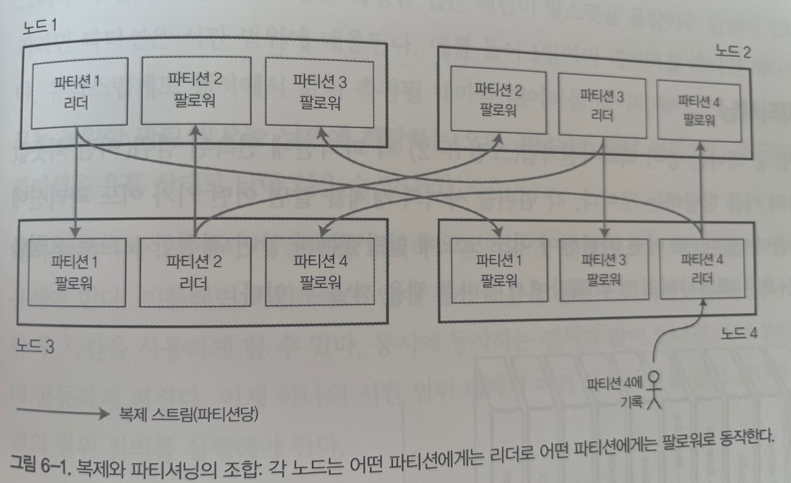

# 파티셔닝 

파티셔닝이란 ?  
- 데이터 셋이 매우 크거나 질의 처리량이 매우 높다면, 데이터를 **파티션** 으로 쪼갤 필요가 있음 
- 이런 작업을 **샤딩** 이라고 함
- 파티션은 데이터 단위(레코드, 로우, 문서)가 하나의 파티션에 속하게 해서 데이터를 분리함  
- 데이터 베이스가 여러 파티션을 동시에 건드리는 연산을 지원할 수 도 있지만, (보통 클러스터에서 지원)
- 각 파티션은 그 자체로 작은 데이터 베이스
- 파티션의 주된 이유는 **확장성**
  - 비공유 클러스터(shared-nothing cluster) 에서 각 파티션은 다른 노드에 저장될 수 있음 
  - 따라서 데이터 셋이 분산되어 저장되고 질의도 분산될 수 있음 
  - 각 노드에서 자신의 파티션에 해당하는 질의를 독립적으로 수행하기 때문에 노드를 추가하여 질의 처리량을 높일 수 있음 
  - 크고 복잡한 질의는 어렵기는 하지만 여러 노드에서 병렬 처리 할 수 있음

> 용어 혼동 <br/>
> 여기서 말하는 **파티션** 은 몽고 DB, 엘라스틱 서치, 솔라클라우드의 **샤드(shard)**, HBase 의 **리전(region)** 빅테이블 **테블릿(tablet)**, 
> 카산드라와 리악에서는 **브이노드(vnode)**, 카우치 베이스에서는 **브이버켓(vBucket)** 이라고 부름 <br/>
> **파티셔닝** 이 가장 널리 사용되므로 여기서는 파티셔닝으로 표현함 

파티셔닝 지원 데이터베이스 
- 1980년대에 테라데이터(Teradata), 탠덤 논스톱 SQL(Tandem NonStop SQL) 등 에서 개척됨 
- 최근에는 NoSQL 데이터베이스와 하둡 기반 데이터 웨어하우스에서 재발견됨 
- 어떤 시스템들은 트랜잭션 작업부하용, 분석용으로 설계되었음 (93쪽 참고)

## 파티셔닝과 복제 
보통 복제와 파티셔닝을 함께 적용해 각 파티션의 복사본을 여러 노드에 저장함. <br/>
각 레코드는 한 파티션에 속하더라도 이를 다른 노드에 복제하여 내결함성을 보장 가능 <br/>
<br/>
**리더 팔로워 복제 모델** <br/>
 <br/>
- 한 노드에 여러 파티션을 저장하는 모델 
- 각 파티션의 리더는 하나의 노드에 할당되고 팔로워 들은 다른 노드에 할당됨 
- 각 노드는 어떤 파티션에서는 리더이지만 다른 파티션에게는 팔로워가 됨 

## 키-값 데이터 파티셔닝 
대량의 데이터를 파티셔닝한다면 어떤 레코드를 어느 노드에 저장할지 어떻게 결정해야 할까 ? <br/>
파티셔닝의 목적은 **데이터와 질의 부하를 노드 사이에 고르게 분산** 시키는 것 <br/>
10 대의 노드를 사용하면 1 대를 사용할 때 보다 이론상으로 10배의 데이터를 저장하고 10배의 읽기, 쓰기 요청을 처리할 수 있다. (복제는 일단 무시한다) <br/>
<br/>
파티셔닝이 고르게 이뤄지지 않아서 데이터가 많거나 질의를 많이 받을때 **쏠렸다(skewed)** 고 한다. <br/>
이런 쏠림 현상은 파티셔닝의 효과가 매우 떨어지며 특정 노드에 병목이 생길 수 있다. <br/>
불균형하게 부하가 높은 파티션을 **핫스팟** 이라고 한다. <br/>
<br/>
그렇다면 핫스팟을 어떻게 회피할까 ? 

### 무작위 파티셔닝  
- 가장 단순한 방법은 레코드를 할당할 노드를 무작위로 선택하는 것
- 데이터가 노드들 사이에 매우 고르게 분산됨 
- 하지만 어떤 레코드를 읽으려고 할 때 해당 레코드가 어느 노드에 저장됐는지 알 수 없는 문제가 있음  
- 모든 노드에서 병렬적으로 질의를 실행해야함 

### 키 범위 기준 파티셔닝 
- 백과사전 처럼 각 파티션에 연속된 범위의 키를 할당하는 방법 
- 각 범위들 사이의 경계를 알면 어떤 키가 어느 파티션에 속하는지 쉽게 찾을 수 있음  
- 데이터가 고르게 분산하기 위해서 각 범위의 크기가 동일 할 필요는 없음 
  - 예를들어 1권은 A,B 로 시작하는 내용을 담고 12권은 T,U,V,W,X,Y,Z 로 시작하는 내용을 담을 수 있음 
  - 전체 데이터 수를 균등하게 분산하기 위함일 뿐 범위가 중요한 것은 아님 
- 파티션 경계는 관리자가 수동으로 선택하거나 데이터베이스에서 자동으로 선택되게 할 수 있음 
- 이 파티션 전략은 빅테이블, HBase, 리싱크DB(RethinkDB), 몽고DB 등에서 사용 
- 각 파티션 내에 키를 정렬된 상태로 저장하여 범위 스캔이 쉬워지도록 할 수 있음 
- 키를 연쇄된 색인(다중 컬럼 색인)으로 간주해서 질의 하나로 관련 레코드 여러 개를 읽어올 수 있음 

센서 네트워크 데이터를 저장하는 어플리케이션에서 측정값의 타임스탬프를 키로 사용한다고 해보자.<br/>
이런 경우 범위 스캔을 이용해서 특정 월의 모든 데이터를 쉽게 읽을 수 있다.<br/>
그러나 특정한 접근 패턴이 **핫스팟을 유발** 한다는 단점이 있다.<br/>
키가 타임 스탬프 이기 때문에 1일치 데이터를 파티션 하나가 담당하여 쓰기 연산이 특정 파티션에만 쏠려 과부하가 생긴다.<br/>
이런 문제점을 회피하기 위해서 키를 ```센서이름+타임스탬프``` 형식으로 사용하여 쓰기 부하를 분산할 수 있다. <br/> 
하지만 1일치 모든 센서 데이터를 조회하려면 여러 번의 질의를 수행해야 하는 단점이있다. 

### 키 해시값 기준 파티셔닝 
- 쏠림과 핫스팟의 위험 때문에 많은 분산 데이터스토어는 키의 파티션을 정하는 데 **해시 함수** 를 사용한다.
- 좋은 해시 함수는 데이터를 균일하게 분산되게 한다.
  - 32비트 해시 함수는 문자열을 넣으면 0과 2<sup>32</sup> - 1 사이의 무작위 숫자를 반환함 
  - 입력 문자열이 유사해도 해시 값은 숫자 범위 내에서 균일하게 분산됨 
- 파티셔닝용 해시 함수는 암호적으로 강력할 필요가 없다.
  - 일반적으로 암호학적으로 강력한 해시 함수는 해시 함수 수행하는데 느림 
- 카산드라, 몽고 DB 는 MD5, 볼드 모트는 파울러 놀 보(Fowler-Noll-Vo) 함수를 사용
- 간단한 해시 함수는 많은 프로그래밍 언어에 내장되어 있지만 파티셔닝에 적합하지 않을 수 있다.
  - Java 의 ```Object.hashCode()``` 와 Ruby 의 ```Object#hash``` 는 같은 키를 넣어도 다른 프로세스 에서는 다른 해시값이 반환될 수 있음 
- 키를 이용해 해시 값을 구하고 해시 값 범위에 해당하는 파티션에 해당 키를 할당 하면 됨
 <br/>
- 이 기법은 키를 파티션 사이에 균일하게 분산하는데 좋음 
- 파티션 경계는 크기 동일하도록 나눌 수도 있고 무작위에 가깝게 선택할 수도 있음 (이런 기법을 **일관성 해싱** 이라고 부르기도 함)

> 일관성 해싱 <br/>
> 일관성 해싱은 카저(Karger)가 정의한 대로 CDN(Content Delivery Network) 같은 인터넷 규모의 캐시 시스템 에서 부하를 균등하게 분산시키는 방법이다. <br/>
> 중앙 제어나 분산 합의(distributed consensus)가 필요하지 않도록 파티션의 경계를 무작위로 선택한다. <br/>
> 209쪽 파티션 재균형화 에서 보겠지만 이 특별한 방법은 데이터베이스에서 실제로는 잘 동작하지 않아서 현재 거의 사용되지 않는다.
> 여기서 말하는 **일관성** 은 복제 일관성이나 ACID 일관성과는 관련이 없고 재균형화(rebalancing) 방법을 의미함 <br/>
> 혼동하기 쉬우므로 **일관성 해싱** 보다는 **해시 파티셔닝** 으로 쓰는게 좋다. 

- 해시 파티셔닝은 해시 값을 이용하기 때문에 범위 질의를 수행 할 수 없다.
- 몽고 DB 에서는 해시 기반 샤딩 모드를 사용하면 범위 질의가 모든 파티션에 전송돼야 한다.
- 카산드라는 두 가지 (키 범위, 해시) 전략 사이에서 타협한다.
  - 카산드라에서 테이블 선언 시 여러 칼럼을 포함하는 **복합 기본키** 를 사용할 수 있음 
  - 키의 첫 부분에만 해싱을 적용하고 남은 컬럼은 카산드라의 SS 테이블에서 데이터를 정렬하는 연쇄된 색인으로 사용한다.
  - 따라서 키의 첫 부분을 제외한 컬럼들은 범위 질의가 효율적으로 가능하다.
  - ex) 소셜 미디어 사이트에서 사용자 한명의 문서 여러 개를 올릴 수 있을때, 기본키로 ```(user_id, update_timestamp)``` 구성하면 사용자의 문서를 수정일자 기준으로 범위 질의가 가능하다. 

### 쏠린 작업 부하와 핫스팟 완화
키를 해싱해서 파티션을 정하면 핫스팟을 줄이는 데 도움이 된다.<br/>
그렇지만 핫스팟을 완벽히 제거할 수 는 없다. <br/> 
ex) 동일한 키로 읽고 쓰는 상황 <br/>
소셜 미디어에서 수백만 명의 팔로워를 거느린 유명인이 뭔가를 하면 후폭풍이 발생할 수 있음 <br/>
<br/>
현재 데이터 시스템은 대부분 쏠린 작업부하를 자동으로 보정하지 못하기 때문에 어플리케이션에서 쏠림을 완화해야한다.<br/>
요청이 쏠리는 키를 발견 했을때 간단한 해결책은 각 키의 시작 or 종료 부분에 임의의 숫자를 붙이는 것이다.<br/>
10진수 2개만 추가해주어도 한 키에 대한 쓰기 작업이 100개의 다른 키로 균등하게 분산될 수 있다.<br/>
<br/>
그러나 다른 키에 쪼개서 쓰면 읽기를 수행할 때 100개의 키에 해당하는 데이터를 읽어서 조합해야 하는 추가적인 작업이 필요해진다. <br/>
이 기법은 요청이 몰리는 소수의 키에만 적용해야 한다. 처리량이 낮은 키에서는 불필요한 오버헤드가 생기기 때문이다. <br/>
따라서 어떤 키가 쪼개서 처리되었는지 추적할 방법도 필요하다.

## 파티셔닝과 보조 색인
지금까지 설명한 파티셔닝 방식은 키-값 데이터 모델에 의존한다.<br/>
보조 색인이 연관되면 상황은 복잡해진다. 보조 색인은 보통 레코드를 유일하게 식별하는 용도가 아닌 특정한 값이 발생한 항목을 검색하는 수단이다.<br/>
많은 키-값 저장소에서는 구현 복잡도가 추가되는 것을 피하려고 보조 색인을 지원하지 않지만 보조 색인은 데이터 모델링에 매우 유용하기 때문에 일부 저장소에서 이를 지원하기 시작했다.<br/>
솔라나 엘라스틱서치 같은 검색 서버에서는 **보조 색인은 존재의 이유** 이다.<br/>
<br/>
보조 색인은 파티션에 깔끔하게 대응되지 않는 문제점이 있다. 보조 색인을 파티셔닝하는 데 널리 쓰이는 2가지 방법이 있다.
- 문서 기반 파티션 
- 용어 기반 파티션 

### 문서 기반 파티션 
중고차를 판매하는 웹 사이트를 운영한다고 하자.<br/>
각 항목에서는 문서 ID 라는 고유 ID 가 있고 문서 ID 를 기준으로 파티셔닝되어 있다.<br/>
사용자들이 차를 검색할 때 색상, 제조사로 필터링 할 수 있게 하려면 color, make 보조 색인이 필요하다.<br/>
보조 색인을 선언했다면 데이터베이스가 자동으로 색인을 생성할 수도 있다. <br/>
 <br/>
- 예를 들어 빨간색 자동차가 데이터베이스에 추가되면 데이터베이스 파티션은 `color:red` 색인 항목에 해당하는 문서 목록 ID 를 추가한다.
- 이런 색인 방법은 각 파티션이 완전히 독립적으로 동작한다.
- 각 파티션은 자신의 보조 색인을 유지하며 파티션에 속하는 문서들만을 담당한다.
- 다른 파티션에 어떤 데이터가 저장되는지 신경쓰지 않는다.
- 문서 추가, 삭제, 갱신 등의 쓰기 작업에서 해당 문서 ID 를 포함하는 파티션만 다룰수 있다.
- 그렇기 때문에 문서 파티셔닝은 **지역 색인(local index)** 라고 한다.
- 이 방법은 읽기에서 단점이 있는데 위 그림에서 처림 ```color:red``` 인 문서를 읽기 위해서 모든 파티션을 검사해야 한다.
- 이런식으로 질의를 보내는 방법을 **스캐터/게더(scatter/gather)** 라고 함 
- 여러 파티션에서 질의를 병렬로 수행하더라도 꼬리 지연 시간 증폭이 발생하기 쉬워서 큰 비용이 발생할 수 있음 
  - 꼬리 지연 시간 증폭 : 명령을 병렬로 수행했지만 마지막 응답을 기다려야 함을 의미 
- 그럼에도 보조색인을 문서 기준 파티셔닝하는 경우가 많음 
  - 몽고 DB, 리악, 카산드라, 엘라스틱 서치, 솔라클라우드, 볼트 DB
- 데이터베이스 벤더 들은 대부분 보조 색인 질의가 단일 파티션에서만 실행되도록 권장하지만 **항상 가능한 것이 아님**
  - 자동차를 색상으로 필터링 하면서 동시에 제조사로도 필터링 할 때 

### 용어 기반 파티션
각 파티션이 자신만의 보조 색인(지역 색인)을 갖게 하는 대신 모든 파티션의 데이터를 담당하는 **전역 색인(global index)** 을 만들 수 있다.<br/>
 <br/>
- 위 그림을 보면 ```color:red``` 항목에 빨간색 자동차 정보가 저장된다.
- 이처럼 ```[a-r]``` 글자로 시작하는 색상은 파티션0 에 저장하고 ```[s-z]``` 글자로 시작하는 색상은 파티션1 에 저장하는 방식 
- 찾고자 하는 용어에 따라 파티션이 결정되므로 **용어 기준으로 파티셔닝됐다(term-partitioned)** 라고 한다.
  - **용어(term)** 는 전문색인 에서 나온 말로 문서에 등장하는 모든 단어를 의미함 
- 위 예제 처럼 용어 자체를 색인 할 수 있고 용어의 해시를 구해 색인 할 수 있다.
  - 용어 자체 색인 : 범위 색인이 가능함 
  - 용어 해시를 색인 : 부하가 좀 더 고르게 분산됨 
- 문서 기반 파티션에 비해서 갖는 장점은 읽기가 효율적이라는 것 
  - 모든 파티션에 스캐터/개더를 실행할 필요 없이 특정 파티션에서 읽을 수 있음 
- 그렇지만 전역 색인은 쓰기가 느리고 복잡하다는 단점이 있다.
  - 단일 문서를 쓸때 해당 색인이 여러 파티션에 영향을 줄 수 있기 때문이다. (문서에 있는 용어가 다른 노드에 있는 파티션에 속할 수 있다.)
  - 이상적이라면 데이터베이스에 기록된 문서는 바로 색인되어야 한다.
  - 하지만 용어 기반 파티션에서는 쓰기에 영향을 받는 모든 파티션에 걸친 분산 트랜잭션이 필요한데
  - 모든 데이터베이스에서 분산 트랜잭션을 지원하지 않는다. (7장, 9장 참고)
- 현실에서 전역 보조 색인은 대개 비동기로 갱신된다. 
  - 쓰기를 실행한 후 바로 색인을 읽으면 변경사항이 색인에 반영되지 않았을 수 있다.
  
12 장에서 용어 파티셔닝 보조 색인을 구현하는 주제에 대해서 다시 설명한다. 

## 파티션 리밸런싱(rebalancing/재균형화)
시간이 지나면 데이터 베이스에 변화가 생긴다.
- 질의 처리량 증가에 따른 부하로 CPU 추가하고 싶다.
- 데이터 셋 크기 증가에 따른 디스크, 램을 추가하고 싶다.
- 장비에 장애가 발생해서 새로운 장비를 투입해 교체해야 한다.

이런 변화가 생기면 한 노드에서 다른 노드로 데이터와 부하를 옮겨야한다. <br/>
클러스터에서 한 노드가 담당하던 부하를 다른 노드로 옮기는 과정을 리밸런싱이라고 한다.<br/>

리밸런싱이 실행될 때 만족해야 하는 최소 요구사항 
- 리밸런싱 후, 부하가 노드들 사이에 균등하게 분배된다.
- 리밸런싱 도중에도 데이터베이스는 읽기/쓰기 요청이 가능해야 한다.
- 리밸런싱이 빨리 실행되고 네트워크와 디스크 I/O 부하를 최소화 할 수 있도록, 노드들 사이에 데이터가 필요 이상으로 옮겨져서는 안된다.

### 리밸런싱 전략 
파티션을 노드에 할당하는 방법이 몇 가지 있다.

### 해시 값에 모드 N 연산 실행 (쓰면 안되는 방법)
해시 값 기준으로 파티셔닝 할 때 해시를 구하고 나서 파티션을 선정하기 위해 mod(나누기) 연산을 사용하는 방법이다.<br/>
가장 단순한 방법인데 왜 쓰면 안될까 ? <br/>
10 개의 노드가 있을 때 ```hash(key) mod 10``` 을 수행하면 0-9 사이의 값으로 노드를 선택할 수 있다.<br/>
이런 모드연산의 문제는 N 이 변경될 때 발생한다. N 이 변경되면 대부분의 키가 다른 노드로 변경되어야 하는 오버헤드가 있다.<br/>
- ```hash(key) = 123456``` 이라고 가정하면 N = 10 이라면 해당 키는 노드 6에 할당된다.
- 노드가 추가되어 N = 11 이라면 해당 키는 노드 3으로 N = 12 라면 노드 0 으로 옮겨진다.
이 처럼 모드 를 이용한 방법은 노드 추가/삭제 시에 리밸런싱을 해야 하는 대상 키의 숫자가 너무 많은 문제가 있다.

### 파티션 개수 고정 
- 파티션을 노드 대수보다 많이 만들고 각 노드에 여러 파티션을 할당 
  - 노드 10 라면 1000 파티션을 각 노드에 할당 (ES, 카프카)
- 노드가 추가되면 새 노드는 파티션이 다시 균일하게 분배될때까지 기존 노드에서 파티션을 뺏어오는 방법 
- 파티션 개수는 바뀌지 않고 파티션에 할당된 키도 변경하지 않는다. 파티션이 다른 노드로 이동하기만 한다.
- 파티션 할당 변경은 즉시 반영되지 않기 때문에 리밸런싱 진행중에는 기존의 파티션에서 읽기와 쓰기를 수행한다.

 <br/>
- 성능이 더 좋은 노드에 더 많은 파티션을 할당 할 수 있음 
- 이런 리밸런싱 방법은 리악, 엘라스틱 서치, 카우치베이스, 볼드모트 등에서 사용한다.
- 파티션 개수가 처음 데이터베이스가 구축될 때 고정되고 이후에는 변경되지 않음 
- 이론적으로 파티션을 쪼개거나 합치는 게 가능하지만 파티션 개수를 고정하는 것이 운영이 단순해지기 때문에 대부분의 데이터베이스는 파티션 분할을 지원하지 않음 
- 처음 설정한 파티션 개수가 사용가능한 노드의 최대치가 되기 때문에 충분히 높은 값으로 설정해야 함 
  - 그러나 너무 큰 수를 선택하면 파티션을 관리하기 위한 오버헤드가 발생함 
- 데이터 셋의 크기 변동이 심하다면 적절한 파티션 개수를 정하기 어려움 
  - 예를들어 처음에는 데이터 셋이 작지만 시간이 지나면서 훨씬 더 커질 수 있다.
- 각 파티션에는 전체 데이터의 고정된 비율이 포함되기 때문에 개별 파티션의 크기는 클러스터의 전체 데이터에 비례하여 증가함 
- 각 파티션의 데이터가 너무 크면 리밸런싱이나 장애 복구에 비용이 많이 든다.
- 그러나 파티션이 너무 작으면 오버헤드가 크기 때문에 적당한 크기를 설정하는 것이 좋지만 데이터 셋의 크기는 변하면 적당한 크기를 정하기 어려울 수 있다.

## 동적 파티셔닝 
이전의 키 범위 파티셔닝, 해시 파티셔닝은 파티션의 경계와 개수가 고정되어 있어 매우 불편했다.<br/>
파티션 경계를 잘못 지정하면 데이터 쏠림 현상이 발생할 수 있다.<br/>
이런 이유로 HBase, 리싱크 DB 에서는 파티션을 동적으로 생성한다.<br/>
- 파티션의 크기가 설정된 값(HBase default 10G)을 넘어서면 파티션을 두 개로 쪼갠다.
- 반대로 파티션의 크기가 임계값 아래로 떨어지면 인접한 파티션과 합친다.

각 노드에 여러 파티션을 사용하는 구성인 경우 
- 큰 파티션은 쪼개진 후 부하의 균형을 맞추기 위해서 파티션이 다른 노드로 이동될 수 있다.
- HBase 의 경우 분산 파일 시스템인 HDFS 를 통해 파티션 파일이 전송됨

동적 파티셔닝은 파티션 개수가 전체 데이터 용량에 맞춰 조정된다는 이점이 있음.<br/>
데이터 양이 작으면 파티션 개수가 적어도 되므로 오버헤드도 작다.<br/>
빈 데이터베이스는 파티션 경계를 정해야 하는지 **사전 정보** 가 없기 때문에 처음에는 파티션이 1개 라는 함정이 있다.<br/>
모든 쓰기 요청이 하나의 노드에서 실행되어 부하가 있을 수 있기 때문에 HBase, 몽고 DB 에서는 초기 파티션 집합을 설정할 수 있다.<br/>
- **사전 분할(pre-splitting)** 이라고 함
사전 분할을 할려면 어떤식으로 분할될지 알고 있어야 함 (키 or 해시)

## 노드 비례 파티셔닝 
동적 파티셔닝에서는 파티션 분할과 병합을 통해 개별 파티션 크기가 고정된 최솟값, 최대값 사이를 유지되기 때문에 파티션 갯수가 데이터 셋 크기에 비례함.<br/>
반면 파티션 개수를 고정하면 각 파티션의 크기는 전체 데이터 셋 크기에 비례함.<br/>
위 두 가지 모두 노드 갯수를 고려하지 않음.<br/>
<br/>
노드 비례 파티셔닝 
- 카산드라와 케타마(Ketama) 에서 사용되는 방법으로 파티션 개수가 노드 대수에 비례하게 설정하는 방법 
- **노드당 할당되는 파티션 개수를 고정**한다.
- 노드 대수가 고정적일때는 개별 파티션 개수가 전체 데이터 셋의 크기에 비례하지만 
- 노드의 대수를 늘리면 파티션의 크기가 다시 작아진다.
- 일반적으로 데이터 용량이 클 수록 노드도 많이 필요하다는 것에 착안한 방법으로 파티션 크기도 안정적으로 유지된다.
- 새 노드가 클러스터에 추가되면 고정된 개수의 파티션을 선택해 분할하고 분할된 파티션의 절반은 그대로 두고 다른 절반은 새 노드에 할당함 
- 무작위로 선택하기 때문에 균등하지 않은 분할이 생길 수 있지만 여러 파티션에 대해 평균적으로 보면 새 노드도 균등한 부하를 할당받게 된다.
- 카산드라 3.0 에는 불균등한 분할을 회피할 수 있는 대안적인 리밸런싱 알고리즘이 추가됐다.
- 파티션 경계를 무작위로 선택하려면 해시 기반 파티셔닝을 사용해야 한다.
  - 해시 함수를 통해 생성된 숫자 범위로 부터 파티션 경계를 선택 
- 실제로 이 방법은 일관성 해싱의 원래 정의에 가장 가깝게 대응한다.

## 운영: 자동 리밸런싱과 수동 리밸런싱 
- 완전 자동 리밸런싱 : 관리자의 개입 없이 시스템이 자동으로 파티션을 노드 사이에 이동할지 결정 
- 완전 수동 리밸런싱 : 관리자가 명시적으로 파티션을 노드에 할당하도록 설정 
- 중간 방법 : 카우치베이스, 리악, 볼드모트는 자동으로 파티션 할당하지만 반영되려면 관리자가 확정해야함 

완전 자동 리밸런싱 
- 유지보수에 손이 덜 가므로 편리하다.
- 그러나 예측하기 어렵다.
  - 리밸런싱은 요청 경로 재설정, 대량의 데이터를 노드 사이에서 이동 등 비용이 큰 연산 
  - 주의깊게 처리하지 않으면 네트워크나 노드에 과부하가 걸릴 수 있고 리밸런싱 중에 요청은 성능저하 될 수 있음  
- 자동 리밸런싱 + 자동 장애 감지 상황에서 문제가 발생 할 수 있음 
  - 예를들어 노드 한 대에 과부하가 걸려 요청에 대한 응답이 느려졌다고 가정하자.
  - 다른 노드들은 해당 노드가 죽었다고 간주하고 해당 노드의 부하를 옮기기 위해 자동으로 클러스터 리밸런싱을 수행한다.
  - 과부하 걸린 노드와 다른 노드들, 네트워크 부하를 더해서 연쇄 장애가 발생할 수 있음 

이런 이유로 리밸런싱 과정에 사람이 개입하는게 좋을 수 있음.
- 자동 리밸런싱보다 느릴 수 있지만 예상치 못한 일을 방지 할 수 있다.

## 요청 라우팅 
파티션이 리밸런싱 되면서 노드에 할당되는 파티션이 바뀐다.<br/>
클라이언트에서 요청을 보내려고 할 때 어느 노드로 접속해야 하는지 어떻게 알 수 있을까 ? <br/>
<br/>
이 문제는 데이터베이스에 국한되지 않은 **서비스 찾기(service discovery)** 의 일종이다.<br/>
- 네트워크를 통해 접속되는 소프트웨어에서 발생할 수 있음 
- 특히 고가용성(이중화)을 지향하는 소프트웨어라면 모두 발생함 

이 문제를 해결하는 몇 가지 접근법 <br/>
 <br/>
1. 클라이언트가 아무 노드에 접속하여 해당 노드에 파티션이 있으면 직접 처리하고 없으면 다른 노드로 전달해서 응답을 클라이언트로 전달하는 방식 
2. 클라이언트의 모든 요청을 라우팅 계층으로 보내고 라우팅 계층에서 요청을 처리할 노드를 알아내어 해당 노드로 요청을 전달하는 방식 
   1. 라우팅 계층은 파티션 인지(partition-aware) 로드 밸런서 
3. 클라이언트가 파티셔닝 방법과 파티션이 어느 노드에 할당되어 있는지 알고 있게 하는 방법 
   1. 이 방법은 중계자 없이 올바른 노드로 직접 접속할 수 있다.

이 문제는 참여하는 모든 곳에서 정보가 일치해야 함.<br/>
분산 시스템에서 합의를 이루는 데 쓰이는 프로토콜이 있지만 제대로 구현하기가 까다로움(9장 참고)<br/>
<br/>
주키퍼를 이용한 서비스 디스커버리 
 <br/>
- 많은 분산 데이터 시스템은 클러스터 메타 데이터를 추적하기 위해서 **주키퍼(ZooKeeper)** 같은 별도의 코디네이션 서비스를 사용함 
- 각 노드는 주키퍼에 자신을 등록하고 주키퍼는 파티션과 노드 사이의 신뢰성있는 할당 정보를 관리함 
- 라우팅 계층이나 파티션 인지 클라이언트 같은 다른 구성요소들은 **주키퍼의 정보를 구독** 할 수 있음 
- 파티션의 소유자가 변경되거나 노드의 추가, 삭제 되면 주키퍼는 라우팅 계층에 이를 알려서 라우팅 정보를 최신으로 유지할 수 있게 해준다.
- HBase, 솔라클라우드 카프카도 파티션 할당을 추적하는 데 주키퍼를 사용함 

몽고 DB 도 아키텍처는 비슷하지만 자체 **설정 서버** 구현에 의존하고 **몽고스(mongos)** 데몬으로 라우팅 계층을 사용 <br/>
카산드라, 리악은 **가십 프로토콜(gossip protocol)** 을 사용해 클러스터 상태 변화를 노드 사이에서 퍼뜨리는 방법을 사용함<br/>
- 아무 노드나 요청을 받을 수 있고 요청을 받은 노드는 요청을 처리할 노드로 요청을 전달함 (1번 방법)
- 이 모델은 데이터베이스 노드의 복잡성을 높이지만 **주키퍼 같은 외부 코디네이션 서비스에 의존하지 않음**
카우치베이스는 리밸런싱을 자동으로 실행하지 않아서 설계가 단순함
- 클러스터 노드로부터 변경된 라우팅 정보를 알아내는 **목시(moxi)** 라는 라우팅 계층을 설정함 

<br/>
IP 주소는 파티션 만큼 자주 바뀌지 않기 때문에 IP 를 찾는데는 대개 DNS 만으로 충분함 

## 병렬 질의 실행 
분석용으로 사용되는 **대규모 병렬 처리(Massively Parallel Processing, MMP)** 관계형 데이터베이스 제품은 더 복잡한 종류의 질의를 지원함 <br/>
전형적인 데이터 웨어하우스 질의는 조인(join), 필터링(filtering), 그룹화(grouping), 집계(aggregation) 연산을 포함한다.<br/>
MMP 질의 최적화기는 복잡한 질의를 여러 실행 단계와 파티션으로 분해하여 클러스터 내의 서로 다른 노드에서 병렬적으로 실행될 수 있다.<br/>
데이터 셋의 많은 부분을 스캔하는 연산을 포함하는 질의는 특히 병렬 실행의 혜택을 받는다.<br/>
<br/>
데이터 웨어하우스의 질의 고속 병렬 실행은 전문적인 주제이며 분석 업무가 비지니스적으로 중요해짐에 따라 상업적 관심을 많이 받고 있음
병렬 질의 실행 기법 몇 가지는 10장에서 살펴본다.
