- 트랜잭션 : 애플리케이션에서 몇 개의 읽기와 쓰기를 하나의 논리적 단위로 묶은 방법

## 애매모호한 트랜잭션의 개념

새로운 세대의 데이터베이스 중 다수는 트랜잭션을 완전히 포기하거나 과거에 인식되던 것보다 훨씬 약한 보장을 의미하는 단어로 트랜잭션의 의미를 재정의했다.

### ACID의 의미

트랜잭션이 제공하는 안전성 보장은 흔히 원자성(Atomicity), 일관성(Consistency), 격리성(Isolation), 지속성(Durability)을 의미하는 약어인 ACID로 잘 알려져 있다.<br>
그러나 현실에서는 데이터베이스마다 ACID 구현이 제각각이다.<br>
ACID 표준을 따르지 않는 시스템은 때로 **BASE** 라고 불린다.<br>
- 기본적으로 가용성을 제공하고(Basically Available), 유연한 상태를 가지며(Soft state), 최종적 일관성(Eventual consistency)을 지닌다는 뜻이다.

#### 원자성(Atomicity)

일반적으로 **원자적** 이란 더 작은 부분으로 쪼갤 수 없는 뭔가를 가리킨다.<br>
시스템은 연산을 실행하기 전이나 실행한 후의 상태에만 있을 수 있으며 그 중간 상태에는 머물 수 없다.<br>
여러 쓰기 작업이 하나의 원자적인 트랜잭션으로 묶여 있는데 결함 때문에 완료(커밋)될 수 없다면 어보트되고 데이터베이스는 이 트랜잭션에서 지금까지 실행한 쓰기를 무시하거나 취소해야 한다.<br>
원자성 없이는 여러 변경을 적용하는 도중 오류가 발생하면 어떤 변경은 효과가 있고 어떤 것은 그렇지 않은지 알기 어렵다.<br>
오류가 생겼을 때 트랜잭션을 어보트하고 해당 트랜잭션에서 기록한 모든 내용을 취소하는 능력은 ACID 원자성의 결정적인 특징이다.

#### 일관성(Consistency)

ACID 일관성의 아이디어는 항상 진실이어야 하는, 데이터에 관한 어떤 선언(불변식(invariant))이 있다는 것이다.<br>
데이터베이스는 불변식을 위반하는 잘못된 데이터를 쓰지 못하도록 막을 수 없다.<br>
일반적으로 애플리케이션에서 데이터가 유효한지 아닌지를 정의하고 데이터베이스는 데이터를 저장할 뿐이다.<br>
원자성, 격리성, 지속성은 데이터베이스의 속성인 반면 (ACID에서의) 일관성은 애플리케이션의 속성이다.

#### 격리성(Isolation)

ACID에서 **격리성** 은 동시에 실행되는 트랜잭션은 서로 격리된다는 것을 의미한다.<br>
트랜잭션은 다른 트랜잭션을 방해할 수 없다.<br>
고전적인 데이터베이스 교과서에서는 격리성을 **직렬성** 이라는 용어로 공식화한다.<br>
직렬성은 각 트랜잭션이 전체 데이터베이스에서 실행되는 유일한 트랜잭션인 것처럼 동작할 수 있다는 것을 의미한다.<br>
데이터베이스는 실제로는 여러 트랜잭션이 동시에 실행됐더라도 트랜잭션이 커밋됐을 때의 결과가 트랜잭션의 **순차적으로** (하나씩 차례대로) 실행됐을 때의 결과와 동일하도록 보장한다.

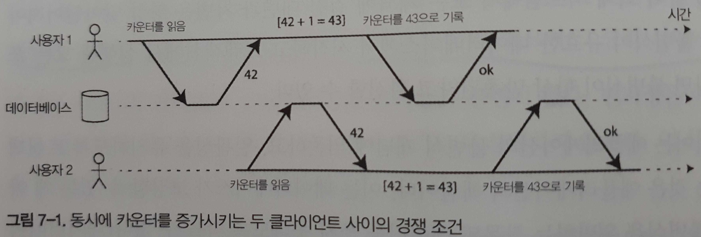

#### 지속성(Durability)

데이터베이스 시스템의 목적은 데이터를 잃어버릴 염려가 없는 안전한 저장소를 제공하는 것이다.<br>
**지속성(durability)** 은 트랜잭션이 성공적으로 커밋됐다면 하드웨어 결함이 발생하거나 데이터베이스가 죽더라도 트랜잭션에서 기록한 모든 데이터는 손실되지 않는다는 보장이다.<br>
복제 기능이 있는 데이터베이스에서 지속성은 데이터가 성공적으로 다른 노드 몇 개에 복사됐다는 것을 의미할 수 있다.

### 단일 객체 연산과 다중 객체 연산

**다중 객체 트랜잭션** 은 흔히 데이터의 여러 조각이 동기화된 상태로 유지돼야 할 때 필요하다.<br>
어떤 사용자의 읽지 않은 메시지 개수를 보여주려면 다음과 같은 질의를 실행할 수 있다.

```sql
SELECT COUNT(*) FROM emails WHERE recipient_id = 2 AND unread_flag = true;
```

그러나 이메일이 많으면 이 질의가 너무 느려서 읽지 않은 메시지 개수를 별개의 필드에 저장하고 싶을 것이다. (일종의 비정규화)<br>
그림 7-2에서 사용자 2는 이상 현상을 경험한다.<br>
우편함 목록에 읽지 않은 메시지 개수는 아직 증가되지 않아서 읽지 않은 메시지 개수가 0으로 나온다.<br>
격리성은 사용자 2가 삽입된 이메일과 갱신된 개수를 모두 보거나 모두 보지 못하게 하고 일관성이 깨진 중간 지점을 보는 일을 없게 해준다.

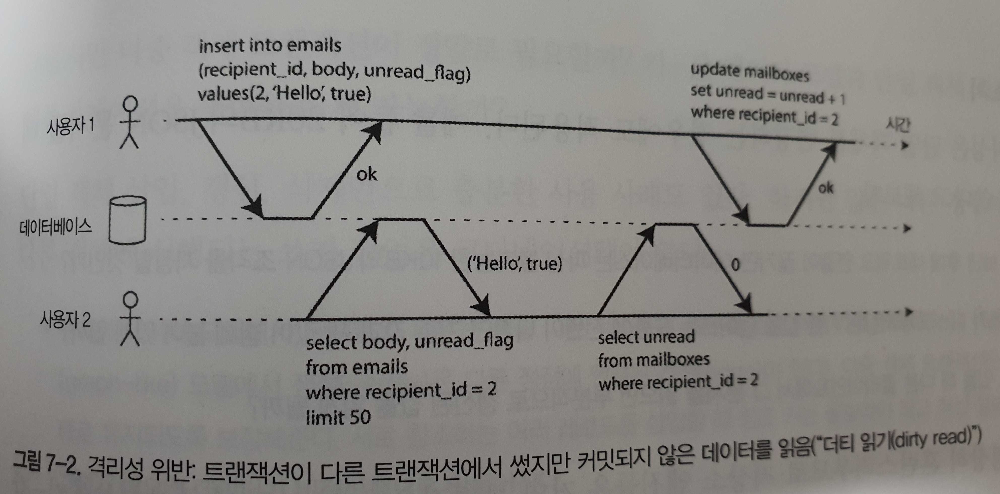

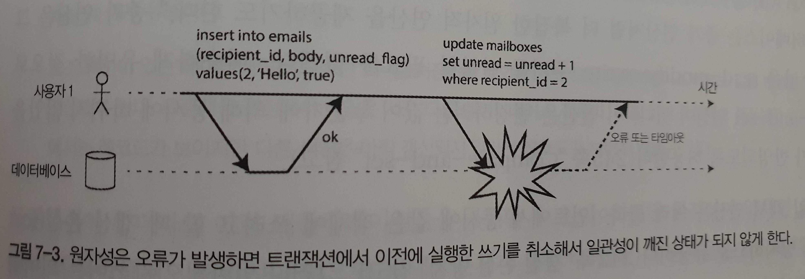

다중 객체 트랜잭션은 어떤 읽기 연산과 쓰기 연산이 동일한 트랜잭션에 속하는지 알아낼 수단이 있어야 한다.<br>
어떤 특정 연결 내에서 BEGIN TRANSACTION 문과 COMMIT 문 사이의 모든 것은 같은 트랜잭션에 속하는 것으로 여겨진다.<br>
반면 비관계형 데이터베이스는 다중 객체 API가 있더라도 반드시 트랜잭션 시맨틱을 뜻하지는 않는다.<br>
어떤 키에 대한 연산은 성공하고 나머지 키에 대한 연산은 실패해서 데이터베이스가 부분적으로 갱신된 상태가 될 수 있다.

#### 단일 객체 쓰기

원자성은 장애 복구(crash recovery)용 로그를 써서 구현할 수 있고 격리성은 각 객체에 잠금을 사용해 (동시에 한 스레드만 객체에 접근하도록) 구현할 수 있다.<br>
증가 연산은 그림 7-1에 나온 read-modify-write 주기를 반복할 필요를 없앤다.<br>
비슷하게 유명한 것으로 compare-and-set 연산이 있다.<br>
이러한 단일 객체 연산은 여러 클라이언트에서 동시에 같은 객체에 쓰려고 할 때 갱신 손실(lost update)을 방지하므로 유용하다.

#### 다중 객체 트랜잭션의 필요성

단일 객체 삽입, 갱신, 삭제만으로 충분한 사용 사례도 있다.<br>
하지만 많은 다른 경우에는 여러 개의 다른 객체에 실행되는 쓰기 작업은 코디네이션돼야 한다.

- 관계형 데이터 모델에서 다중 객체 트랜잭션은 참조가 유효한 상태로 유지되도록 보장해준다. 서로 참조하는 여러 레코드를 삽입할 때 참조 키는 올발라야 하고 최신 정보를 반영해야 한다.
- 문서 데이터 모델에서는 비정규화된 정보를 갱신할 때 한 번에 여러 문서를 갱신해야 한다.
- 보조 색인이 있는 데이터베이스에서는 값을 변경할 때마다 색인도 갱신돼야 한다.

원자성이 없으면 오류 처리가 훨씬 더 복잡해지고 격리성이 없으면 동시성 문제가 생길 수 있다.

#### 오류와 어보트 처리

트랜잭션의 핵심 기능은 오류가 생기면 어보트되고 안전하게 재시도할 수 있다는 것이다.<br>
리더 없는 복제를 사용하는 데이터스토어는 "최선을 다하는(best effort)" 원칙을 기반으로 훨씬 더 많은 일을 한다.<br>
"데이터베이스는 가능한 모든 것을 할 것이며 그 때문에 오류가 발생하면 이미 한 일은 취소하지 않는다".<br>
따라서 오류 복구는 애플리케이션에게 책임이 있다.

## 완화된 격리 수준

두 트랜잭션이 동일한 데이터에 접근하지 않으면 서로 의존하지 않으므로 안전하게 병렬 실행될 수 있다.<br>
동시성 버그는 타이밍에 운이 없을 때만 촉발되기 때문에 테스트로 발견하기 어렵다.<br>
그러한 까닭에 데이터베이스는 오랫동안 **트랜잭션 격리** 를 제공함으로써 애플리케이션 개발자들에게 동시성 문제를 감추려고 했다.<br>
**직렬성** 격리는 데이터베이스가 여러 트랜잭션들이 **직렬적으로** 실행된다는 것과 동일한 결과가 나오도록 보장한다는 것을 의미한다.<br>
직렬성 격리는 성능 비용이 있고 많은 데이터베이스들은 그 비용을 지불하려고 하지 않는다.<br>
맹목적으로 도구에 의존하기보다는 존재하는 동시성 문제의 종류를 잘 이해하고 방지하는 방법을 배울 필요가 있다.

### 커밋 후 읽기(read committed)

가장 기본적인 수준의 트랜잭션 격리는 **커밋 후 읽기** 고 다음 두 가지를 보장해준다.

1. 데이터베이스에서 읽을 때 커밋된 데이터만 보게 한다. (더티 읽기가 없음)
2. 데이터베이스에 쓸 때 커밋된 데이터만 덮어쓰게 된다. (더티 쓰기가 없음)

#### 더티 읽기 방지

트랜잭션이 데이터베이스에 데이터를 썼지만 아직 커밋되거나 어보트되지 않았다고 하자.<br>
다른 트랜잭션에서 커밋되지 않은 데이터를 볼 수 있을까?<br>
만약 그렇다면 이를 **더티 읽기(dirty read)** 라고 한다.

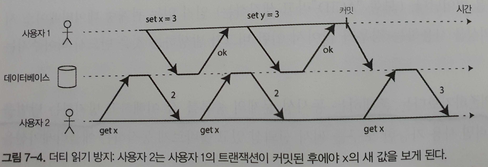

더티 읽기를 막는 게 유용한 이유가 몇 가지 있다.
- 부분적으로 갱신된 상태에 있는 데이터베이스를 보는 것은 사용자에게 혼란스러우며 다른 트랜잭션들이 잘못된 결정을 하는 원인이 될 수 있다.
- 데이터베이스가 더티 읽기를 허용하면 트랜잭션이 나중에 롤백될 데이터, 즉 실제로는 데이터베이스에 결코 커밋되지 않을 데이터를 볼 수 있다.

#### 더티 쓰기 방지

먼저 쓴 내용이 아직 커밋되지 않는 트랜잭션에서 쓴 것이고 나중에 실행된 쓰기 작업이 커밋되지 않은 값을 덮어 써버리면 어떻게 될까?<br>
이를 **더티 쓰기(dirty write)** 라고 부른다.<br>
보통 먼저 쓴 트랜잭션이 커밋되거나 어보트될 때까지 두 번째 쓰기를 지연시키는 방법을 사용한다.<br>
더티 쓰기를 막음으로써 이 격리 수준은 몇 가지 동시성 문제를 회피한다.
- 웹 사이트에 있는 목록이 구매자를 반영하도록 갱신돼야 하고 판매 송장이 구매자에게 전송돼야 한다. 그림 7-5의 경우 밥에게 판매됐지만(밥이 목록 테이블을 최종 갱신) 송장은 앨리스에게 전송됐다(앨리스가 송장 테이블을 최종 갱신). 커밋 후 읽기는 이런 사고를 막아준다.
- 그림 7-1에서 나온 두 번의 카운터 증가 사이에 발생하는 경쟁 조건은 막지 못한다.

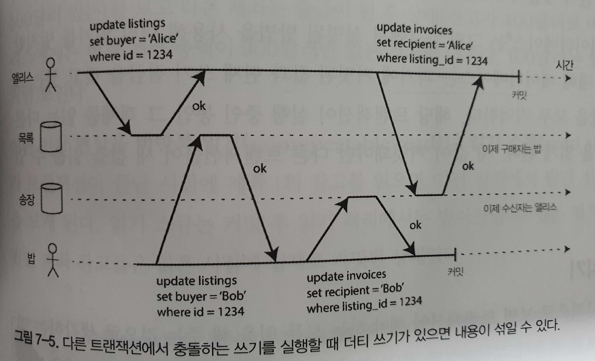

#### 커밋 후 읽기 구현

가장 흔한 방법으로 데이터베이스는 로우 수준 잠금을 사용해 더티 쓰기를 방지한다.<br>
오직 한 트랜잭션만 어떤 주어진 객체에 대한 잠금을 보유할 수 있다.<br>
이런 잠금은 커밋 후 읽기 모드(또는 더 강한 격리 수준)에서 데이터베이스에 의해 자동으로 실행된다.<br>
그러나 읽기 잠금을 요구하는 방법은 현실에서는 잘 동작하지 않는다.<br>
읽기만 실행하는 여러 트랜잭션들이 오랫동안 실행되는 쓰기 트랜잭션 하나가 완료될 때까지 기다려야 할 수 있기 때문이다.<br>
이런 이유로 대부분의 데이터베이스는 그림 7-4에서 설명된 방법을 사용해 더티 읽기를 방지한다.<br>
해당 트랜잭션이 실행 중인 동안 그 객체를 읽는 다른 트랜잭션들은 과거의 값을 읽게 된다.<br>
새 값이 커밋돼야만 다른 트랜잭션들이 새 값을 읽을 수 있게 된다.

### 스냅숏 격리(snapshot isolation)와 반복 읽기(repeatable read)

커밋 후 읽기(read committed) 격리 수준을 사용하더라도 동시성 버그가 생길 수 있는 경우가 아직 많이 있다.<br>

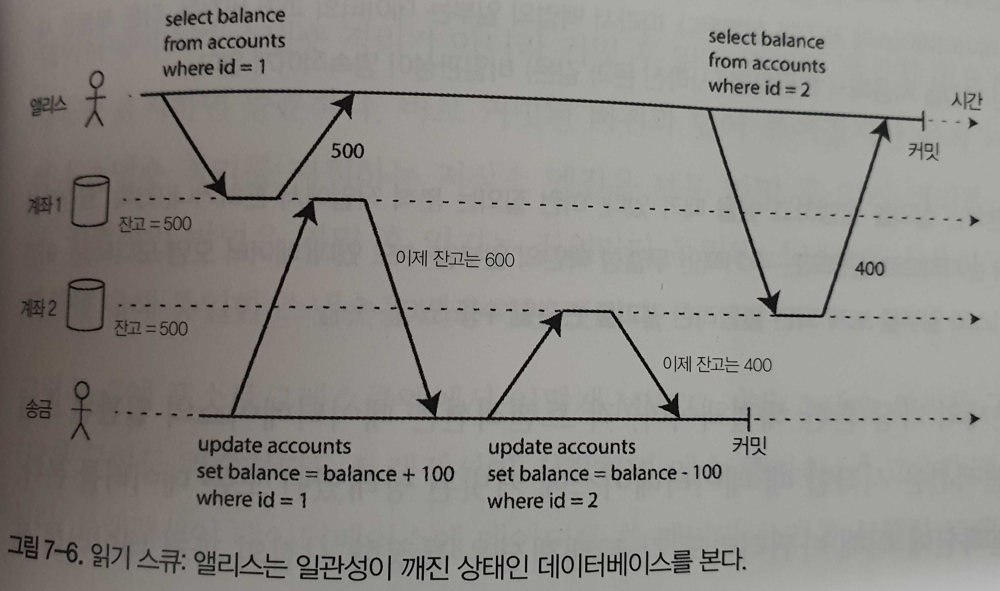

이런 이상 현상을 **비반복 읽기(nonrepeatable read)** 나 **읽기 스큐(read skew)** 라고 한다.<br>
몇 초 후 애플리케이션에서 데이터 리로드를 통해서 일관성이 지켜지는 경우(웹 사이트 새로고침 등)도 있다.<br>
어떤 상황에서는 이런 일시적인 비일관성을 감내할 수 없는 경우도 있다.

- 백업 : 백업을 하려면 데이터베이스 전체의 복사본을 만들어야 하는데 백업의 일부는 데이터의 과거 버전을, 다른 부분은 새 버전을 갖고 있을 수 있다.
- 분석 질의와 무결성 확인 : 데이터베이스의 큰 부분을 스캔하는 질의를 실행하고 싶을 때가 있다. 분석 작업에서 흔하거나 모든 것이 순차적으로 실행되는 주기적인 무결성 확인의 일부일 수도 있다.

**스냅숏 격리** 는 이런 문제의 가장 흔한 해결책이다.<br>
각 트랜잭션은 데이터베이스의 **일관된 스냅숏** 으로부터 읽는다.<br>
즉 트랜잭션은 시작할 때 데이터베이스에 커밋된 상태였던 모든 데이터를 본다.

#### 스냅숏 격리 구현

스냅숏 격리 구현은 커밋 후 읽기 격리처럼 전형적인 더티 쓰기를 방지하기 위해 쓰기 잠금을 사용한다.<br>
스냅숏 격리의 핵심 원리는 **읽는 쪽에서 쓰는 쪽을 결코 차단하지 않고 쓰는 쪽에서 읽는 쪽으 결코 차단하지 않는다** 는 것이다.<br>
스냅숏 격리를 구현하기 위해 데이터베이스는 객체마다 커밋된 버전 여러 개를 유지할 수 있어야 한다.<br>
데이터베이스가 객체의 여러 버전을 함께 유지하므로 이 기법은 **다중 버전 동시성 제어(multi-version concurrency control, MVCC)** 라고 한다.<br>
전형적인 방법은 커밋 후 읽기는 질의마다 독립된 스냅숏을 사용하고 스냅숏 격리는 전체 트랜잭션에 대해 동일한 스냅숏을 사용하는 것이다.<br>
트랜잭션이 시작하면 계속 증가하는 고유한 트랜잭션 ID(txid)를 할당받는다.<br>
트랜잭션이 데이터베이스에 데이터를 쓸 때마다 쓰기를 실행한 트랜잭션의 ID가 함께 붙는다.

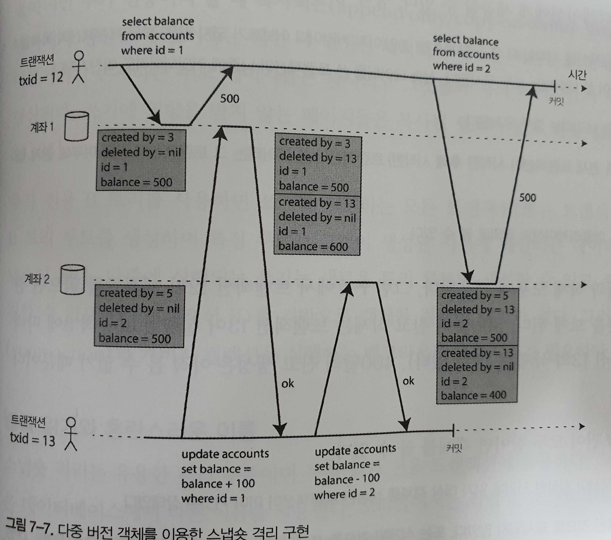

#### 일관된 스냅숏을 보는 가시성 규칙

면밀하게 가시성 규칙을 정의함으로써 데이터베이스는 데이터베이스의 일관된 스냅숏을 애플리케이션에게 제공할 수 있다.

1. 데이터베이스는 각 트랜잭션을 시작할 때 그 시점에 진행 중인(아직 커밋이나 어보트가 되지 않은) 모든 트랜잭션의 목록을 만든다.
2. 어보트된 트랜잭션이 쓴 데이터는 모두 무시된다.
3. 트랜잭션 ID가 더 큰 트랜잭션이 쓴 데이터는 그 트랜잭션의 커밋 여부에 관계 없이 모두 무시된다.
4. 그 밖의 모든 데이터는 애플리케이션의 질의로 볼 수 있다.

아래 두 조건이 모두 참이면 객체를 볼 수 있다.

- 읽기를 실행하는 트랜잭션이 시작한 시점에 읽기 대상 객체를 생성한 트랜잭션이 이미 커밋된 상태였다.
- 읽기 대상 객체가 삭제된 것으로 표시되지 않았다. 또는 삭제된 것으로 표시됐지만 읽기를 실행한 트랜잭션이 시작한 시점에 삭제 요청 트랜잭션이 아직 커밋되지 않았다.

오래 실행되는 트랜잭션은 오랫동안 스냅숏을 사용해서 덮어써지거나 삭제된 지 오래된 값을 계속 읽을 수도 있다.<br>
데이터베이스는 갱신할 때 값을 교체하지 않고 값이 바뀔 때마다 새 버전을 생성함으로써 작은 오버헤드만 유발하면서 일관된 스냅숏을 제공할 수 있다.

#### 색인과 스냅숏 격리

포스트그레스큐엘은 동일한객체의 다른 버전들이 같은 페이지(page)에 저장될 수 있다면 색인 갱신을 회피하는 최적화를 한다.<br>
카우치DB, 데이토믹, LMDB에서는 다른 방법을 쓴다.<br>
이것들도 B 트리를 사용하지만 **추가 전용이며 쓸 때 복사되는(append-only/copy-on-write)** 변종을 사용한다.<br>
트리의 페이지가 갱신될 때 덮어쓰는 대신 각 변경된 페이지의 새로운 복사본을 생성한다.

#### 반복 읽기와 혼란스러운 이름

스냅숏 격리는 유용한 격리 수준이며 특히 읽기 전용 트랜잭션에 유용하다.<br>
오라클에서는 **직렬성** , 포스트그레스큐엘과 MySQL에서는 **반복 읽기(repeatable read)** 라고 한다.

### 갱신 손실 방지

두 트랜잭션이 동시에 카운터를 증가시키는 것은 **갱신 손실(lost update)** 은 대표적인 예이다.<br>
갱신 손실 문제는 애플리케이션이 데이터베이스에서 값을 읽고 변경한 후 변경된 값을 다시 쓸 때(read-modify-write 주기) 발생할 수 있다.<br>
이런 패턴은 다양한 시나리오에서 발생한다.

- 카운터를 증가시키거나 계좌 잔고를 갱신한다.
- 복잡한 값을 지역적으로 변경한다.
- 전체 페이지 내용을 서버에 보내서 현재 데이터베이스에 저장된 내용을 덮어 쓰도록 만들어진 위키에서 두 명의 사용자가 동시에 같은 페이지를 편집한다.

#### 원자적 쓰기 연산

여러 데이터베이스에서 원자적 갱신 연산을 제공한다.<br>
다음 명령은 대부분의 관계형 데이터베이스에서 동시성 안전(concurrency-safe)하다.

```sql
UPDATE counters SET `value` = `value` + 1 WHERE `key` = 'foo';
```

몽고DB 같은 문서 데이터베이스는 JSON 문서의 일부를 지역적으로 변경하는 원자적 연산을 제공하고 레디스는 우선순위 큐(priority queue) 같은 데이터 구조를 변경하는 원자적 연산을 제공한다.<br>
원자적 연산은 보통 객체를 읽을 때 그 객체에 독점적인(exclusive) 잠금을 획득해 구현한다.<br>
이 기법을 **커서 안정성(cursor stability)** 이라고 부르기도 한다.<br>
다른 선택지는 그냥 모든 원자적 연산을 단일 스레드에서 실행하도록 강제하는 것이다.<br>
객체 관계형 매핑 프레임워크를 사용하면 뜻하지 않게 데이터베이스가 제공하는 원자적 연산을 사용하는 대신 불안전한 read-modify-write 주기를 실행하는 코드를 작성하기 쉽다.

#### 명시적인 잠금

데이터베이스에 내장된 원자적 연산이 필요한 기능을 제공하지 않을 때 갱신 손실을 막는 또 다른 선택지는 애플리케이션에서 갱신할 객체를 명시적으로 잠그는 것이다.

```sql
BEGIN TRANSACTION;

SELECT * FROM figures
    WHERE `name` = 'robot' AND game_id = 222
    FOR UPDATE;

-- 이동이 유효한지 확인한 후
-- 이전의 SELECT에서 반환된 것의 위치를 갱신한다.

UPDATE figures SET position = 'c4' WHERE id = 1234;

COMMIT;
```

#### 갱신 손실 자동 감지

대안으로 이들의 병렬 실행을 허용하고 트랜잭션 관리자가 갱신 손실을 발견하면 트랜잭션을 어보트시키고 read-modify-write 주기를 재시도하도록 강제하는 방법이 있다.<br>
이 방법의 이점은 데이터베이스가 이 확인을 스냅숏 격리와 결합해 효율적으로 수행할 수 있다는 것이다.<br>
MySQL/InnoDB의 반복 읽기(repeatable read)는 갱신 손실을 감지하지 않는다.<br>
갱신 손실 감지는 애플리케이션 코드에서 어떤 특별한 데이터베이스 기능도 쓸 필요가 없게 도와주므로 매우 좋은 기능이다.

#### Compae-and-set

트랜잭션을 제공하지 않는 데이터베이스 중에는 원자적 compare-and-set 연산을 제공하는 것도 있다.<br>
이 연산의 목적은 값을 마지막으로 읽은 후로 변경되지 않았을 때만 갱신을 허용함으로써 갱신 손실을 회피하는 것이다.

```sql
-- 데이터베이스 구현에 따라 안전할 수도 안전하지 않을 수도 있다
UPDATE wiki_pages SET content = 'new content'
    WHERE id = 1234 AND content = 'old content';
```

#### 충돌 해소와 복제

여러 노드에 데이터의 복사본이 있어서 데이터가 다른 노드들에서 동시에 변경될 수 있으므로 갱신 손실을 방지하려면 추가 단계가 필요하다.<br>
잠금과 compare-and-set 연산은 데이터의 최신 복사본이 하나만 있다고 가정한다.<br>
이렇게 복제가 적용된 데이터베이스에서 흔히 쓰는 방법은 쓰기가 동시에 실행될 때 한 값에 대해 여러 개의 충돌된 버전( **형제(sibling)** 라고도 한다)을 생성하는 것을 허용하고 사후에 애플리케이션 코드나 특별한 데이터 구조를 사용해 충돌을 해소하고 이 버전들을 병합하는 것이다.<br>
**최종 쓰기 승리(last write wins, LWW)** 충돌 해소 방법은 갱실 손실이 발생하기 쉽다.<br>
유감스럽게도 많은 복제 데이터베이스는 LWW가 기본 설정이다.

### 쓰기 스큐와 팬텀

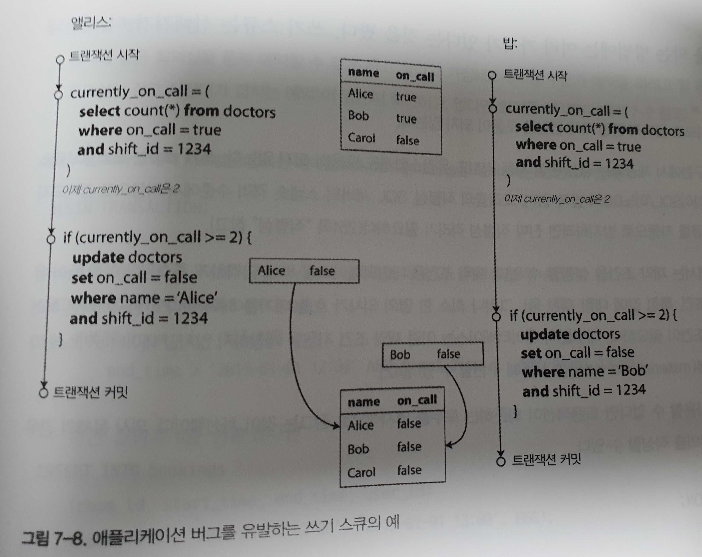

두 트랜잭션 모두 커밋되고 호출 대기하는 의사가 한 명도 없게 된다.<br>
최소 한 명의 의사가 호출 대기해야 한다는 요구사항을 위반했다.

#### 쓰기 스큐를 특정짓기

**쓰기 스큐(write skew)** 는 두 트랜잭션이 같은 객체들을 읽어서 그중 일부를 갱신할 때 나타날 수 있다<br>
다른 트랜잭션이 하나의 동일한 객체를 갱신하는 특별한 경우에 (타이밍에 따라) 더티 쓰기나 갱신 손실 이상 현상을 겪게 된다.<br>
직렬서 격리 수준을 사용할 수 없다면 트랜잭션이 의존하는 로우를 명시적으로 잠그는 것이 차선책이다.

```sql
BEGIN TRANSACTION;

SELECT * FROM doctors
    WHERE on_call = true
    AND shift_id = 1234 FOR UPDATE;

UPDATE doctors
    SET on_call = true
    WHERE `name` = 'Alice'
    AND shift_id = 1234;

COMMIT;
```

#### 추가적인 쓰기 스큐의 예

- 회의실 예약 시스템
- 다중플레이어 게임
- 사용자명 획득
- 이중 사용(double-spending) 방지

#### 쓰기 스큐를 유발하는 팬텀

이 모든 예는 비슷한 패턴을 따른다.

1. SELECT 질의가 어떤 검색 조건에 부합하는 로우를 검색함으로써 어떤 요구사항을 만족하는지 확인한다.
2. 첫 번째 질의의 결과에 따라 애플리케이션 코드는 어떻게 진행할지 결정한다.
3. 애플리케이션이 계속 처리하기로 결정했다면 데이터베이스에 쓰고(INSERT, UPDATE, DELETE) 트랜잭션을 커밋한다.

1단계의 로우를 잠금으로써(SELECT FOR UPDATE) 트랜잭션을 안전하게 만들고 쓰기 스큐를 회피할 수 있다.<br>
1단계의 질의가 어무 로우도 반환하지 않으면 SELECT FOR UPDATE는 아무것도 잠글 수 없다.<br>
이처럼 어떤 트랜잭션에서 실행한 쓰기가 다른 트랜잭션의 검색 질의 결과를 바꾸는 효과를 **팬텀(phantom)** 이라고 한다.
#### 충돌 구체화

인위적으로 데이터베이스에 잠금 객체를 추가하는 방법을 **충돌 구체화(materializing conflict)** 라고 한다.<br>
유감스럽게도 충돌을 구체화하는 방법은 알아내기 어렵고 오류가 발생하기 쉽다.<br>
대부분의 경우에 직렬성 격리 수준이 훨씬 더 선호된다.

## 직렬성

쓰기 스큐와 팬텀과 관련된 까다로운 문제점

- 격리 수준은 이해하기 어렵고 데이터베이스마다 그 구현이 일관성이 없다.(ex. 반복 읽기)
- 애플리케이션 코드를 보고 특정한 격리 수준에서 해당 코드를 실행하는 게 안전한지 알기 어렵다.
- 경쟁 조건을 감지하는 데 도움이 되는 좋은 도구가 없다. 동시성 문제는 보통 비결정적이라서 테스트하기 어렵다.

직렬성 격리는 보통 가장 강력한 격리 수준이라고 여겨진다.<br>
여러 트랜잭션이 병렬로 실행되더라도 최종 결과는 동시성 없이 한 번에 하나씩 **직렬로** 실행될 때와 같도록 보장한다.<br>
데이터베이스가 발생할 수 있는 **모든** 경쟁 조건을 막아준다.<br>
오늘날 직렬성을 제공하는 데이터베이스는 대부분 세 가지 기법 중 하나를 사용한다.

- 말 그대로 트랜잭션을 순차적으로 실행하기
- 수십 년 동안 유일한 수단이었단 2단계 잠금
- 직렬성 스냅숏 격리 같은 낙관적 동시성 제어(optimistic concurrency control) 기법

### 실제적인 직렬 실행

동시성 문제를 피하는 가장 간단한 방법은 동시성을 완전히 제거하는 것이다.<br>
높은 성능을 위해 다중 스레드 동시성이 필수적인 것으로 여겨졌다면 단일 스레드 실행이 가능하게 된 이유는 무엇일까?<br>
두 가지 발전이 생각을 바꾸게 했다.

- 렘 가격이 저렴해서 활성화된 데이터셋 실행하게 가능하게 된 이유는 무엇일까?
- OLTP 트랜잭션이 보통 짧고 실행하는 읽기와 쓰기의 개수가 적다는 것을 깨달았다. 반대로 분석 질의는 전형적으로 읽기 전용이라서 직렬 실행 루프 밖에서 일관된 스탭숏을 사용해 실행할 수 있다.

트랜잭션을 순차적으로 실행하는 방법은 볼트DB/H-스토어, 레디스, 데이토믹에서 구현돼 있다.<br>
그렇지만 이들의 처리량은 CPU 코어 하나의 처리량으로 제한된다.<br>
단일 스레드를 최대한 활용하려면 트랜잭션이 전통적인 형태와는 다르게 구조화돼야 한다.

#### 트랜잭션을 스토어드 프로시저 안에 캡슐화하기

데이터베이스의 초창기에는 데이터베이스 트랜잭션이 사용자 활동의 전체 흐름을 포함할 수 있게 하려는 의도가 있었다.<br>
데이터베이스 설계자들은 그러한 전체 과정이 하나의 트랜잭션으로 표현되고 원자적으로 커밋될 수 있다면 깔끔한 것으로 생각했다.<br>
사람은 결정하는 것도 반응하는 것도 매우 느리다.<br>
대부분의 데이터베이스는 이를 효율적으로 처리할 수 없어서 거의 모든 OLTP 애플리케이션은 트랜잭션 내에서 대화식으로 사용자 응답을 대기하는 것을 회피함으로써 트랜잭션을 짧게 유지한다.<br>
상호작용식 트랜잭션은 애플리케이션과 데이터베이스 사이의 네트워크 통신에 많은 시간을 소비한다.<br>
데이터베이스에서 동시성을 허용하지 않고 한 번에 트랜잭션 하나씩만 처리하면 처리량은 끔찍할 것이다.<br>
단일 스레드에서 트랜잭션을 순차적으로 처리하는 시스템들은 상호작용하는 다중 구문 트랜잭션을 허용하지 않는다.<br>
대신 애플리케이션은 트랜잭션 코드 전체를 **스토어드 프로시저** 형태로 데이터베이스에 미리 제출해야 한다.

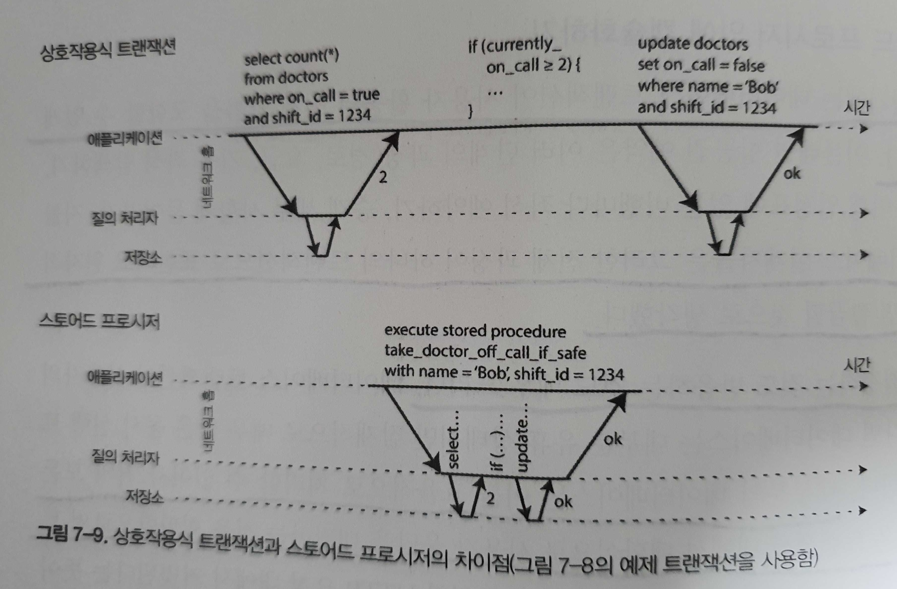

#### 스토어드 프로시저의 장단점

스토어드 프로시저는 다양한 이유로 약간 악평을 받았다.

- 데이터베이스 벤더마다 제각각 스토어드 프로시저용 언어가 있다.
- 데이터베이스에서 실행되는 코드는 관리하기 어렵다. 디버깅하기 어렵고 버전 관리 및 배포가 불편하며 테스트하기도 까다롭고 모니터링용 지표 수집 시스템과 통합하기도 어렵다.
- 데이터베이스는 애플리케이션 서버보다 훨씬 더 성능에 민감할 때가 많다.

현대의 스토어드 프로시저 구현은 PL/SQL을 버리고 대신 기존의 범용 프로그래밍 언어를 사용한다.<br>
스토어드 프로시저가 있고 데이터가 메모리에 저장된다면 모든 트랜잭션을 단일 스레드에서 실행하는 게 가능하다.<br>
I/O 대기가 필요 없고 다른 동시성 제어 메커니즘을 오버헤드를 회피하므로 단일 스레드로 상당히 좋은 처리량을 얻을 수 있다.

#### 파티셔닝

여러 CPU 코어와 여러 노드로 확장하기 위해 데이터를 파티셔닝할 수도 있다.<br>
각 트랜잭션이 단일 파티션 내에서만 데이터를 읽고 쓰도록 데이터셋을 파티셔닝할 수 있다면 각 파티션은 다른 파티션과 독립적으로 실행되는 자신만의 트랜잭션 처리 스레드를 가질 수 있다.<br>
그러나 여러 파티션에 접근해야 하는 트랜잭션이 있다면 데이터베이스가 해당 트랜잭션이 접근하는 모든 파티션에 걸쳐서 코디네이션을 해야 한다.<br>
여러 파티션에 걸친 트랜잭션은 추가적인 코디네이션 오버헤드가 있으므로 단일 파티션 트랜잭션보다 엄청나게 느리다.<br>
트랜잭션이 단일 파티션에서 실행될 수 있는지 여부는 애플리케이션에서 사용되는 데이터 구조에 매우 크게 의존한다.<br>
여러 보조 색인이 있는 데이터는 여러 파티션에 걸친 코디네이션이 많이 필요할 가능성이 높다.

#### 직렬 실행 요약

- 모든 트랜잭션은 작고 빨라야 한다.
- 활성화된 데이터셋이 메모리에 적재될 수 있는 경우로 사용이 제한된다.
- 쓰기 처리량이 단일 CPU 코어에서 처리할 수 있을 정도로 충분히 낮아야 한다.
- 여러 파티션에 걸친 트랜잭션도 쓸 수 있지만 이것을 사용할 수 있는 정도에는 엄격한 제한이 있다.

### 2단계 잠금(2PL)

**2단계 잠금(two-phase locking, 2PL)** 에서 쓰기 트랜잭션은 다른 쓰기 트랜잭션뿐만 아니라 읽기 트랜잭션도 진행하지 못하게 막고 그 역도 성립한다.<br>
스냅숏 격리는 **읽는 쪽은 결코 쓰는 쪽을 막지 않으며 쓰는 쪽도 결코 읽는 쪽을 막지 않는다** 는 원칙이 있는데 이게 스냅숏 격리와 2단계 잠금의 중요한 차이다.

#### 2단계 잠금 구현

2PL은 MySQL(InnoDB)과 SQL Server에서 직렬성 격리 수준을 구한하는 데 사용되고 DB2에서는 반복 읽기(repeatable read) 격리 수즌을 구현하는 데 사용된다.
잠금은 **공유 모드(shared mode)** 나 **독점 모드(exclusive mode)** 로 사용될 수 있다.

- 공유 모드 : 트랜잭션에서 객체를 읽기 위해 사용. 동시에 여러 트랜잭션이 잠금을 획득할 수 있음
- 독점 모드 : 트랜잭션에서 객체를 쓰기 위해 사용. 동시에 여러 트랜잭션이 잠금을 획득할 수 없고 잠금을 가진 트랜잭션이 커밋이나 어보트돼야 다른 트랜잭셔에서 처리가 가능

자금이 아주 많이 사용되므로 트랜잭션 A는 트랜잭션 B가 잠금을 해제하기를 기다리는라 멈춰 있고 트랜잭션 B도 트랜잭션 A가 잠금을 해제하기를 기다리느라 멈춰 있는 상황이 매우 쉽게 발생할 수 있다.<br>
이런 상황을 **교착 상태(deadlock)** 라 한다.<br>
데이터베이스는 트랜잭션 사이의 교착 상태를 자동으로 감지하고 트랜잭션 중 하나를 어보터시켜서 다른 트랜잭션들이 진행할 수 있게 한다.<br>
어보트된 트랜잭션은 애플리케이션에서 재시도해야 한다.

#### 2단계 잠금의 성능

2단계 잠금의 큰 약점은 성능이다.<br>
그 원인은 부분적으로는 잠금을 획득하고 해제하는 오버헤드 때문이지만 더 중요한 원인은 동시성이 줄어드는 것이다.

#### 서술 잠금

**서술 잠금(predicate lock)** 은 앞에서 설명한 공유/독점 잠금과 비슷하게 동작하지만 특정 객체(예를 들어 테이블 내의 한 로우)에 속하지 않고 아래와 같은 어떤 검색 조건에 부합하는 모든 객체에 속한다.

```sql
SELECT * FROM bookings
    WHERE room_id = 123 AND
        end_time > '2018-01-01 12:00' AND
        start_time < '2018-01-01 13:00';
```

서술 잠금이 접근을 제한하는 방법은 다음과 같다.

- 어떤 조건에 부합하는 객체를 읽기 원한다면 질의의 조건에 대한 공유 모드 서술 잠금을 획득해야 한다.
- 부합하는 서술 잠금을 트랜잭션 B가 잡고 있다면 A는 진행하기 전에 B가 커밋되거나 어보트될 때까지 기다려야 한다.

여기서 핵심 아이디어는 서술 잠금은 데이터베이스에 아직 존재하지 않지만 미래에 추가될 수 있는 객체(팬텀)에도 적용할 수 있다는 것이다.

#### 색인 범위 잠금

유감스럽게도 서술 잠금은 잘 동작하지 않는다.<br>
진행 중인 트랜잭션들이 획득한 잠금이 많으면 조건에 부합하는 잠금을 확인하는 데 시간이 오래 걸린다.<br>
이 때문에 2PL을 지원하는 대부분의 데이터베이스는 실제로는 **색인 범위 잠금(index-range locking, 다음 키 잠금(next-key locking)** 이라고도 한다)을 구현한다.<br>
더 많은 객체가 부합하도록 서술 조건을 간략화하는 것은 안전하다.

- room_id = 123을 통해 모든 시간대에서 123번 방에 대한 조회를 했다고 표시한다.
- start_time, end_time 값을 이용해 해당 시간에 모든 방에 대한 조회를 했다고 표시한다.

어떤 방법을 쓰든지 간략화한 검색 조건이 색인 중 하나에 붙는다.<br>
이 방법을 쓰면 팬텀과 쓰기 스큐로부터 보호해주는 효과를 낳는다.<br>
색인 범위 잠금은 서술 잠금보다 정밀하지 않지만(직렬성을 유지하기 위해 반드시 필요한 것보다 큰 범위를 잠금 수도 있다) 오버헤드가 훨씬 더 낮기 때문에 좋은 타협안이 된다.<br>
범위 잠금을 잡을 수 있는 적합한 색인이 없다면 데이터베이스는 테이블 전체에 공유 잠금을 잡는 것으로 대체할 수 있다.

### 직렬성 스냅숏 격리(SSI)

**직렬성 스냅숏 격리(serializable snapshot isolation, SSI)** 는 완전한 직렬성을 제공하지만 스냅숏 격리에 비해 약간의 성능 손해만 있을 뿐이다.

#### 비관적 동시성 제어 대 낙관적 동시성 제어

 2단계 잠금은 이른바 **비관적** 동시성 제어 메커니즘이다.<br>
 뭔가 잘못될 가능성이 있으면 뭔가를 하기 전에 상황이 다시 안전해질 때까지 기다리는 게 낫다는 원칙을 기반을노 한다.<br>
 **상호 배제(mutual exclusion)**와 비슷하다.<br>
 직렬 실행은 어떤 면에서 보면 극단적으로 비관적이다.<br>
 개별 트랜잭션이 아주 빨리 실행되게 해서 '잠금'을 유지하는 시간을 줄이는 방법으로 비관죽의를 보완한다.<br>
 반대로 직렬성 스냅숏 격리는 **낙관적** 동시성 제어 기법이다.<br>
 뭔가 위험한 상황 발생할 가능성이 있을 때 트랜잭션을 막는 대신 모든 것이 괜찮아질 거라는 희망을 갖고 계속 진행한다는 뜻이다.<br>
 트랜잭션이 커밋되기를 원할 때 데이터베이스는 나쁜 상황이 발생했는지(격리가 위반됐는지) 확인한다.<br>
 만약 그렇다면 트랜잭션은 어보트되고 재시도해야 한다.<br>
 직렬로 실행된 트랜잭션만 커밋이 허용된다.<br>
 예비 용량이 충분하고 트랜잭션 사이의 경쟁이 너무 심하지 않으면 낙관적 동시성 제어 기법은 비관적 동시성 제어보다 성능이 좋은 경향이 있다.<br>
 경쟁은 가환(commutative) 원자적 연산을 써서 줄일 수 있다.
 SSI는 스냅숏 격리 위에 쓰기 작업 사이의 직렬성 충돌을 감지하고 어보트시킬 트랜잭션을 결정하는 알고리즘을 추가한다.

 #### 뒤처진 전제 기반한 결정

데이터베이스가 어떻게 질의 결과가 바뀌었는지 알 수 있을까? 두 가지 상황을 고려해야 한다.

- 오래된(stale) MVCC 객체 버전을 읽었는지 감지하기(읽기 전에 커밋되지 않은 쓰기가 발생했음)
- 과거의 읽기에 영향을 미치는 쓰기 감지하기(읽은 후에 쓰기가 실행됨)
  
#### 오래된 MVCC 읽기 감지하기

트랜잭션이 MVCC 데이터베이스의 일관된 스냅숏에서 읽으면 스냅숏 생성 시점에 다른 트랜잭션이 썼지만 아직 커밋되지 않은 데이터는 무시한다.<br>
일관된 스냅숏에서 읽을 때는 무시됐던 쓰기가 지금은 영향이 있고 트랜잭션 43의 전제가 더 이상 참이 아니라는 뜻이다.

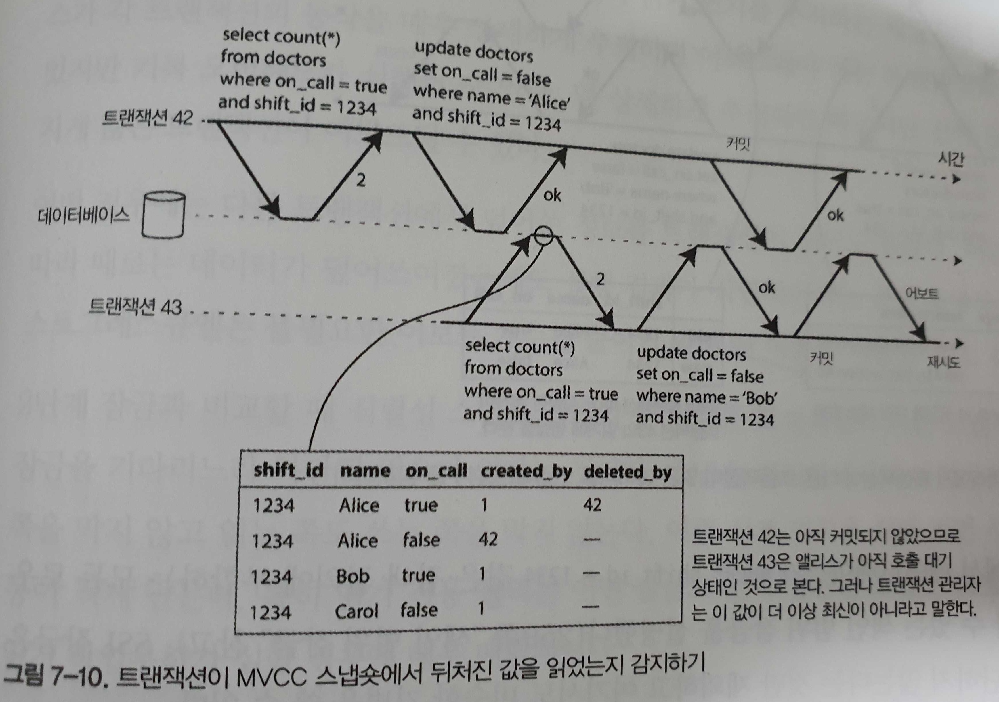

이런 이상 현상을 막으려면 데이터베이스는 트랜잭션이 MVCC 가시성 규칙에 따라 다른 트랜잭션의 쓰기를 무시하는 경우를 추적해야 한다.<br>
SSI는 불필요한 어보트를 피해서, 일관된 스냅숏에서 읽으며 오래 실행되는 작업을 지원하는 스냅숏 격리의 특성을 유지한다.

#### 과거의 읽기에 영향을 미치는 쓰기 감지하기

고려해야 하는 두 번째 경우는 데이터를 읽은 후 다른 트랜잭션에서 그 데이터를 변경할 때다.

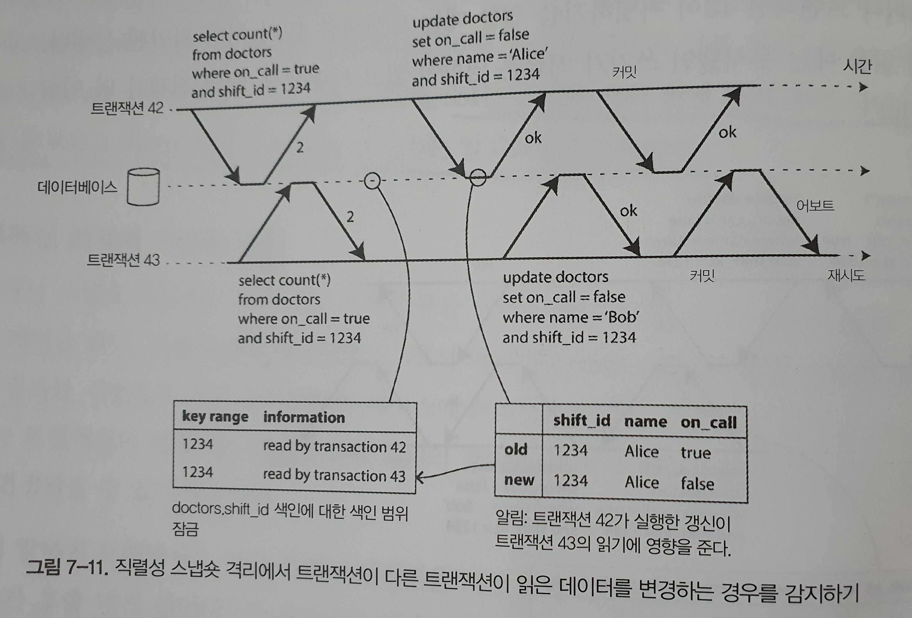

트랜잭션이 데이터베이스에 쓸 때 영향받는 데이터를 최근에 읽은 트랜잭션이 있는지 색인에서 확인해야 한다.

#### 직렬성 스냅숏 격리의 성능

2단계 잠금과 비교할 때 직렬성 스냅숏 격리의 큰 이점은 트랜잭션이 다른 트랜잭션들이 잡고 있는 잠금을 기다리느라 차단될 필요가 없다는 것이다.<br>
특히 읽기 전용 질의는 어떤 잠금도 없이 일관된 스냅숏 위에서 실행될 수 있다.<br>
읽기 작업부하가 심한 경우에 매우 매력적이다.<br>
순차 실행과 비교할 때 직렬성 스냅숏 격리는 단일 CPU 코어의 처리량에 제한되지 않는다.<br>
어보트 비율은 SSI의 전체적인 성능에 큰 영향을 미친다.<br>
이를테면 오랜 시간 동안 데이터를 읽고 쓰는 트랜잭션은 충돌이 나고 어보트되기 쉬워서 SSI는 읽기 쓰기 트랜잭션이 상당히 짧기를 요구한다.<br>
그러나 SSI는 아마 2단계 잠금이나 순차 실행보다는 느린 트랜잭션에 덜 민감할 것이다.

## 정리

- 더티 읽기(dirty read) : 한 클라이언트가 다른 클라이언트가 썻지만 아직 커밋되지 않은 데이터를 읽는다. 커밋 후 읽기(read-committed) 또는 그보다 강한 격리 수준은 더티 읽기를 방지한다.
- 더티 쓰기(dirty write) : 한 클라이언트가 다른 클라이언트가 썼지만 아직 커밋되지 않은 데이터를 덮어쓴다. 거의 모든 트랜잭션 구현은 더티 쓰기를 방지한다.
- 읽기 스큐(read skew, 비반복 읽기(non-repeatable read)) : 클라이언트는 다른 시점에 데이터베이스의 다른 부분을 본다. 이 문제를 막기 위한 해결책으로 트랜잭션이 어느 시점의 일관된 스냅숏으로부터 읽는 스냅숏 격리(shapshot isolation, 반복 읽기(repeatable read))를 가장 흔히 사용한다. 스냅숏 격리는 보통 **다중 버전 동시성 제어(MVCC)** 를 써서 구현한다.
- 갱신 손실(update lost) : 두 클라이언트가 동시에 read-modify-write 주기를 실행한다. 한 트랜잭션이 다른 트랜잭션의 변경을 포함하지 않는 채로 다른 트랜잭션이 쓴 내용을 덮어써서 데이터가 손실된다. 스냅숏 격리 구현 중 어떤것은 이런 이상 현상을 자동으로 막아주지만 그렇지 않은 것은 수동 잠금(SELECT FOR UPDATE)이 필요하다.
- 쓰기 스큐(write skew) : 트랜잭션이무언가를 읽고 읽은 값을 기반으로 어떤 결정을 하고 그 결정을 데이터베이스에 쓴다. 그러나 쓰기를 실행하는 시점에는 결정의 전체가 더 이상 참이 아니다. 직렬성(serializable) 격리만 이런 현상을 막을 수 있다.
- 팬텀 읽기(phantom read) : 트랜잭션이 어떤 검색 조건에 부합하는 객체를 읽는다. 다른 클라이언트가 그 검색 결과에 영향을 주는 쓰기를 실행한다. 스냅숏 격리는 간단한 팬텀 읽기는 막아주지만 쓰기 스큐 맥락에서 발생하는 팬텀은 색인 범위 잠금(index-range locking, 다음 키 잠금(next-key locking))처럼 특별한 처리가 필요하다.

직렬성 트랜잭션을 구현하는 세 가지 다른 방법을 설명했다.

- 말 그대로 트랜잭션을 순서대로 실행하기 : 트랜잭션의 실행 시간이 아주 짧고 트랜잭션 처리량이 단일 CPU 코어에서 처리할 수 있을 정도로 트랜잭션 처리량이 낮다면 아주 간단하고 효과적인 선택이다.
- 2단계 잠금(two-phase locking, 2PL) : 수십년 동안 직렬성을 구현하는 표준적인 방법이었지만 성능 특성 때문에 사용을 피하는 애플리케이션이 많다.
- 직렬성 스냅숏 격리(serializable snapshot isolation, SSL) : 앞에서 언급한 방법들의 결점 중 대부분을 피하는 상당히 새로운 알고리즘이다. 낙관적 방법을 사용해서 트랜잭션이 차단되지 않고 진행할 수 있게 한다. 트랜잭션이 커밋을 원할 때 트랜잭션을 확인해서 실행이 직렬적이지 않다면 어보트시킨다.