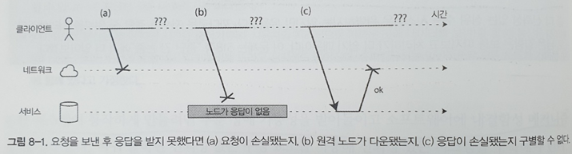
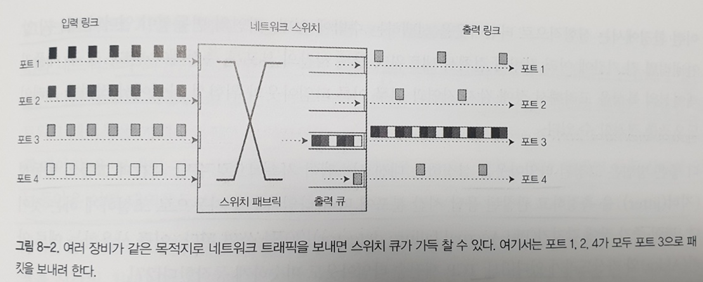

# 분산 시스템의 골칫거리
**어떤 것이든 잘못될 가능성이 있다면 잘못된다**  
분산 시스템을 다루는 것은 한 컴퓨터에서 실행되는 소프트웨어를 작성하는 일과 근본적으로 다르다.  
핵심적인 차이는 뭔가 잘못될 수 있는 흥미진진한 방법이 많다는 점  

## 결함과 부분 장애
한 컴퓨터에서 프로그램을 작성하는 경우 보통 예측 가능한 방식으로 동작 돌아가거나 돌아가지 않음  
단일 컴퓨터에서 실행되는 소프트웨어를 믿지 못할 근복적인 이유는 없으며, 하드웨어가 정상적으로 동작하는 경우 같은 연산은 항상 같은 결과를 낸다. 하드웨어에 문제가 있는 경우 보통 시스템이 완전히 실패  
분산 시스템에서는 이상화된 시스템 모델에서 동작하지 않는대 하나의 시스템에서 장애가 발생하더라도 다른 시스템에서 잘 동작하는 등 예측할 수 없는 방식으로 장애가 발생할 수 있는데, 이를 **부분 장애(partial failure)** 라고 함. 부분 장애는 비결정적으로 여러 노드와 네트워크와 관련된 뭔가를 시도하면 어떨 때는 동작하지만 어떨 때는 예측할 수 없는 방식으로 실패하며, 심지어 뭔가 성공했는지 아닌지 알지 못할 수도 있다.  

### 클라우드 컴퓨팅과 슈퍼컴퓨팅
대규모 컴퓨팅 시스템 구축 방법
- 고성능 컴퓨팅(High-performance Computing, HPC) 수천 개의 CPU를 가진 슈퍼컴퓨터는 보통 일기예보나 분자 동력학 처럼 계산 비용이 매우 높은 과학 계산 작업에 사용
- 클라우드 컴퓨팅 멀티 테넌트 데이터센터, IP 네트워크로 연결된 상용 컴퓨터, 신축적/주문식 자원 할당, 계량 결제와 관련에 사용

#### 슈퍼 컴퓨터
- 계산 상태를 지속성 있는 저장소에 체크포인트로 저장
- 노드 하나에 장애가 발생했을 때 전체 클러스터 작업부하를 중단
- 장애 복구후 마지막 체크포인트부터 계산 재시작
- 분산 시스템보다 단일 노드 컴퓨터와 가까움
- 부분의 장애를 전체를 장애로 확대하여 처리
- 일괄 처리 등 작업을 멈췄다 시작해도 충격이 덜 한 시스템에 사용

#### 클라우드 컴퓨팅
- 낮은 지연시간을 가지는 서비스를 제공하는 온라인
- 다중 노드 환경
- 부분 장애의 가능성을 생각하고 소프트웨어에 내결함성 메커니즘이 필요

분산 시스템 환경에서는 부분 장애를 고려하는 것이 매우 중요  
몇 개의 노드만으로 구성된 작은 시스템의 경우 시스템에서는 거의 항상 구성 요소 대부분이 올바르게 동작할 가능성이 있지만 언젠가는 결함이 발생하고 결함을 처리해야함  
발생 가능성이 상당히 낮더라도 생길 수 있는 결함을 광범위하게 고려하고 테스트하는 것이 중요

#### 신뢰성 없는 구성 요소를 사용해 신뢰성 있는 시스템 구축하기
구성 요소에서 발생할 수 있는 문제에 대해 인지하고 신뢰성을 높일 수 있는 방법을 적용

## 신뢰성 없는 네트워크
분산 시스템은 **비공유 시스템** , 즉 네트워크로 연결된 다수의 장비이며 자신만의 장비와 메모리를 가짐.  
서로 간의 메모리나 디스크에 접근할 수 없다고 가정  
인터넷과 데이터센터 내부 네트워크는 대부분 **비동기 패킷 네트워크(asynchronous packet network)** 로 다른 노드로 메세지를 보낼 수 있지만 메세지가 언제 도착할지 메세지가 도착하기는 할 것인지 보장하지 않음  
요청을 보낸 후 여러 가지 이유로 잘못될 수 있음
1. 요청 손실(케이블 뽑힘)
2. 요청이 큐에서 대기하다가 나중에 전송(네트워크나 수신자에 과부하 가능성)
3. 원격 노드에 장애가 생겼을 가능성(죽었거나 전원 관련 이슈)
4. 원격 노드가 일시적으로 응답을 멈춘 후 다시 응답
5. 원격 노드가 응답을 처리했지만 응답이 네트워크에서 손실(네트워크 스위치 설정 문제)
6. 원격 노드가 요청을 처리했지만 지연되다가 나중에 전송
  

이런 문제를 흔히 해결하는 방법은 **타임아웃** 얼마 간의 시간이 지나면 응답 대기를 멈추고 응답이 도착하지 않는다고 가정  

### 현실의 네트워크 결함
실제 중간 규모의 IDC센터에서의 사례
1. 단일 장비의 연결이 끊어짐
2. 전체 랙의 연결이 끊어짐
3. 상어가 해저 케이블을 물어뜯어 손상
   
등 다양한 이유로 네트워크 결함이 발생할 수 있고 이렇게 발생하는 문제를 **네트워크 결함(network fault)** 라고 정의

네트워크 결함에 대한 정의 테스트가 이루어지지 않는다면 아래와 같은 일이 발생할 수 있다.
- 네트워크가 복구되어도 요청을 처리할 수 없음
- 모든 데이터를 삭제  

하지만 네트워크가 상당한 신뢰성을 보장한다면 네트워크 결함을 반드시 처리하도록 보장해야하는 것은 아니며 네트워크에 문제가 있을 시 사용자에게 오류 메세지를 보여주는 것도 하나의 방법  

### 결함 감지
- 로드 밸런서는 죽은 노드로 요청을 그만 보내야 한다.
- 단일 리더 복제를 사용하는 분산 데이터베이스에서 리더에 장애가 나면 팔로워 중 하나가 리더로 승격되어야 한다.

하지만 네트워크는 불확실성으로 인해 노드가 동작 중인지 아닌지 구별하기 어려우며, 어떤 특정한 환경에서는 뭔가 동작하지 않는다고 명시적으로 알려주는 피드백을 받는 것도 가능
- 노드가 실행 중인 장비에 연결할 수 있지만 목적지 포트에서 수신 대기하는 프로세스가 없다면 운영체제가 친절하게 RST나 FIN 패킷을 응답으로 보내서 TCP연결을 거부
- 노드 프로세스가 죽었지만 노드의 운영체제는 아직 실행중이라면 스크립트로 다른 노드에게 프로세스가 죽었다고 알려서 다른 노드의 타임아웃이 만료되기를 기다릴 필요 없음
- 데이터센터 내 네트워크 스위치의 관리 인터페이스에 접근할 수 있으면 질의를 보내 하드웨어 수준의 링크 장애를 감지
- 접속하려는 IP 주소에 도달할 수 없다고 라우터가 확신하면 ICMP Destination Unreachable패킷으로 응답

원격 노드가 다운되고 있다는 빠른 피드백은 유용하지만 전달받은 것에 대한 확인 응답과 처리 응답은 다르므로 의존할 수 없으며 아무 응답도 받지 못하는 경우도 가정해야함

### 타임아웃과 기약 없는 지연
타임아웃이 길면 노드가 죽었다고 선언될 때까지 기다리는 시간이 길어지며, 짧으면 결함을 빨리 발견하지만 노드가 일시적으로 느려졌을 뿐인데도 죽었다고 잘못 선언할 위험이 높아짐  
너무 빨리 노드가 죽었다고 판단하는 경우 해당 노드에서 처리해야할 요청이 다른 노드로 전달되어 부하가 발생할 수 있으며 이는 연쇄 장애를 유발할 수 있다.  
모든 패킷이 d내에 전송되거나 손실되지만 전송 시간이 결코 d보다 더 걸리지 않고 장애가 나지 않은 노드는 항상 요청을 r 시간 내에 처리한다고 보장할 수 있다면 성공한 모든 요청은 2d + r 시간 내에 응답을 받는다고 보장  
비동기 네트워크는 **기약 없는 지연(unbounded deley)** 가 존재

### 네트워크 혼잡과 큐 대기
- 여러 노드에서 동시에 같은 목적지로 패킷을 보내려고 하면 네트워크 스위치는 패킷을 큐에 넣고 한 번에 하나씩 목적지 네트워크로 전달하는데 네트워크 링크가 붐비면 패킷은 슬롯을 얻을 수 있을때까지 대기 **네트워크 혼잡** 이라 한다.
- 패킷이 목적지에 도착해도 모든 CPU코어가 바쁜 상태라면 네트워크에 들어온 요청은 애플리케이션에서 처리할 준비가 될 때까지 운영체제가 큐에 넣어둔다.
- 가상 환경에서 실행되는 운영체제는 다른 가상 장비가 CPU 코어를 사용하는 동안 수십 밀리초 동안 멈출때가 흔하다.
- TCP는 흐름 제어를 수행하여 노드가 네트워크 링크나 수신 노드에 과부하를 가하지 않도록 자신의 송신율을 제한하는데, 이는 데이터가 네트워크로 들어가기 전에도 부가적인 큐를 대기할 수 있다는 뜻
  

네트워크 환경에서의 타임아웃은 지연의 변동성이 얼마나 되는지 알 수 없기 때문에 충분한 테스트를 통해서 네트워크 왕복 시간의 분포를 측정해야하며, 트레이드 오프 사이에서 적절한 값을 결정해야 함

#### TCP와 UDP
TCP : 타임아웃 안에 확인 응답을 받지 않으면 패킷이 손실되었다고 간주하고 재전송  
UCP : 흐름 제어를 하지 않고 손실된 패킷을 재전송하지 않음

### 동기 네트워크 대 비동기 네트워크
패킷 전송 지연시간의 최대치가 고정된다면 패킷을 유실하지 않는 네트워크에 기댈 수 있다면 분산 시스템은 훨씬 더 단순해진다.
전화 네트워크는 극단적인 신뢰성을 지니며 회선을 만들어 두 명 사이에 있는 전체 경로를 따라 보장된 대역폭을 할당받아 사용하고 이를 **동기식 네트워크** 라고 한다.  
동기식 네트워크는 큐 대기가 없으므로 네트워크 종단 지연 시간의 최대치가 고정되며 **제한 있는 지연(bounded delay)** 라고 한다.  

### 네트워크 지연 예측
회선이 만들어져 있는 경우 다른 누구도 사용할 수 없는 고정된 대역폭을 할당받지만 TCP는 가변적으로 사용하기 때문에 네트워크 지연 예측은 불가능  
TCP는 순간적으로 몰리는 트래픽에 대해 최적화되어 있고 여러 용도(웹 페이지 요청, 이메일 전송, 파일 전송)로 사용되기 때문에 예측이 쉽지 않고 대역폭을 미리 할당하는 것이 어렵다.  
예측을 위해 **서비스 품질(Quality of Service, QoS)와 진입 제어(admission control)** 을 사용할 수 있다.

## 신뢰성 없는 시계
애플리케이션은 아래와 같은 질문에 대답하기 위해 다양한 방식으로 시계에 의존  
1. 이 요청이 타임아웃됐나?
2. 이 서비스의 99분위 응답 시간은 어떻게 되나?
3. 이 서비스는 지난 5분 동안 평균 초당 몇 개의 질의를 처리했나?
4. 사용자가 우리 사이트에서 시간을 얼마나 보냈나?
5. 이 기사가 언제 게시됐나?
6. 며칠 몇시에 미리 알림 이메일을 보내야 하나?
7. 이 캐시 항목은 언제 만료되나?
8. 로그 파일에 남은 이 오류 메세지의 타임스탬프는 무엇인가?

1~4의 경우 지속시간(요청을 보낸 시점과 응답을 받은 시점 사이의 시간 구간) 측정  
5~8의 경우 시점(특정 날짜의 특정 시간에 발생하는 이벤트) 기술  
분산 시스템에서는 통신이 즉각적이지 않아 시간을 다루기 까다롭고, 메세지 전달에 걸리는 시간과 네트워크 지연의 변동성 때문에 보내는 시간과 받는 시간의 차이를 알기 어려움  
또한, 장비는 모두 서로 다른 시계를 가지고 있어 다른 장비와 동기화 작업이 필요  
가장 널리 쓰이는 메커니즘은 네트워크 시간 프로토콜(Network Time Protocol, NTP)로 컴퓨터 시계를 조종할 수 있음  

### 단조 시계 대 일 기준 시계
현대 컴퓨터는 두 가지 종류의 시계를 사용
- 일 기준 시계(time-of-dat clock)  
  - 직관적인 시계
  - 달력에 따라 현재 날짜와 시간 반환
  - linux의 clock_gettime(CLOCK_REALTIME), java의 System.currentTimeMillis()
  - NTP로 동기화
  - 로컬 시계가 NTP 서버보다 너무 앞서면 강제로 리셋되어 과거 시점으로 거꾸로 뛰는 것처럼 보일 가능성이 존재

- 단조 시계(monotonic clock)
  - 타임아웃이나 서비스 응답 시간 같은 지속 시간을 측정하는데 적합
  - linux의 clock_getting(CLOCK_MONOTINIC), java의 System.nanoTime()
  - 항상 앞에서 흐른다
  - 한 시점에서 단조 시계의 값을 확인하고 어떤 일을 한 후 나중에 다시 시계를 확인할 수 있다 -> 두 값 사이의 차이로 두 번의 확인 사이에 시간이 얼마나 흘렀는지 파악

분산 시스템에서 경과 시간을 재는 데 단조 시계를 사용하는 것은 일반적으로 괜찮은 방법

### 시계 동기화와 정확도
단조 시계는 동기화가 필요없지만 일 기준 시계는 NTP나 다른 외부 시간 출처에 맞게 설정되어야 유용(서버간 시간을 맞추기 위해) 이러한 방법도 기대만큼 신뢰성이 있거나 정확하지 않고 하드웨어 시계와 NTP는 사이에서 문제가 발생할 수 있음
- 컴퓨터의 수정 시계는 아주 정확하지 않고 드래프트(drift) 현상이 발생
- 컴퓨터 시계가 NTP 서버 사이 너무 많은 차이가 나면 동기화가 거부되거나 로컬 시계가 강제로 리셋
- 뜻하지 않게 노드와 NTP 서버 사이 방화벽이 막히면 잘못된 설정이 얼마동안 알려지지 않을 가능성이 존재
- NTP 동기화는 잘해야 네트워크 지연만큼만 좋음
- 어떤 NTP 서버들은 이상이 있거나 설정이 잘못돼서 몇 시간 정도 차이 나는 시간을 보고
- 윤초가 발생하면 1분의 길이가 59초 61초가 되어 윤초를 고려하지 않고 설계된  시스템에서는 시 간에 관한 가정이 엉망이 된다
- 가상 장비에서 하드웨어 시계는 가상화돼서 정확한 시간 엄수가 필요한 애플리케이션에게 추가적인 어려움 발생
- 와전히 제어할 수 없는 장치에서 소프트웨어를 실행하면 그 장치의 하드웨어 시계를 전혀 믿을 수 없음

시계 정확도가 매우 중요한 시스템에서는 GPS 수신기, 정밀 시간 프로토콜을 사용해  배모 및 모니터링을 사용해 달성할 수 있으며, NTP 데몬 설정이 잘못되거나 방화벽이 NTP 트래픽을 차단하면 드리프트에 따른 시계 오류가 빠르게 커질 수 있음.

### 동기화된 시계에 의존하기
시계는 간단해보이지만 하루는 정확히 86,400초가 아닐 수도 있고, 일 기준 시계의 시간이 거꾸로 갈 수도 있으며, 노듸의 시간이 다른 노드의 시간과 차이가 많이 날 수도 있다.  
네트워크가 대부분 잘 동작하더라도 소프트웨어는 결함이 생길 수 있다는 가정하에 설계돼야 하며 우아하게 처리해야한다고 했는데, 시계도 마찬가지로 처리해야한다.  
시계는 다른 결함과 달리 결함을 파악하는 것이 쉽지 않다. CPU나 네트워크에 문제가 생기는 경우 장비가 전혀 동작하지 않을 가능성이 높지만 시계에 드래프트가 생겨서 점점 실제 시간과 달라져도 잘 동작하는 것처럼 보인다. 동기화된 시계가 필요한 소프트웨어를 사용한다면 필수적으로 모든 장비 사이의 시계 차이를 모니터링하고 차이가 많이 나는 노드는 죽은 것으로 선언에 클러스터에서 제거해야 한다.

### 이벤트 순서화용 타임스탬프
시계 관련 위험 상황을 하나 살펴보자. 여러 노드에 걸친 이벤트들의 순서를 정하는 문제로 두 클라이언트가 분산 DB에 쓰면 누가 먼저 쓰게 되고 누가 쓴 게 최근 것이 될까?  
[이미지]  

DB에서 일 기준 시간을 사용하는 경우를 가정한다.
1. A가 노드 1에 x=1을 쓴다.
2. 쓰기가 노드 3으로 복제된다.
3. B가 노드 3에 있는 x를 증가시킨다(x=2)
4. 두 쓰기 모두 노드 2에 복제된다.  

쓰기가 다른 노드로 복제될 때 쓰기가 발생한 노드의 일 기준 시계에 따른 타임스탬프가 붙는다.  
분명 B가 작업한 x+1 작업이 나중에 일어났지만 노드 2에서 보는 타임스탬프는 x=1이 나중에 일어나게 되어 B의 증가 연산이 손실된다. 이는 앞서 살펴본 최종 쓰기 승리(LWW)방식 카산드라 리악 같이 리더 없는 DB에서 사용된다. 이는 어떤 문제가 있을까

- DB 쓰기가 불가사의하게 사라짐 시계가 뒤처지는 노드는 시계가 빠른 노드가 먼저 쓴 내용을 그들 사이에 차이나는 시간이 흐를  떄까지 덮어쓸 수 없음
- LWW는 순차적인 쓰기가 빠른 시간 내에 연속으로 실행되는 것과 동시에 쓰기가 실행되는 것을 구별할 수 없음
- 두 노드가 독립적으로 동일한 타임스탬프를 가진 쓰기 작업을 만들 수 있음

따라서 가장 최근 값을 유지하고 다른 것들을 버려 충돌을 해소하고 싶어도 최근의 정의가 로컬 일 기준 시계에 의존하며 시계는 틀릴 수도 있다는 것을 아는 것이 중요하다.  
네트워크 지연시간도 시계를 동기화 하는 과정에서 무시하고 넘어갈 수 없는 부분으로 사실상 동일하게 시간을 맞추는 것은 거의 불가능 하다.  
**논리적 시계(logical clock)** 는 진동하는 수정 대신 증가하는 카운터를 기반으로 하며 이벤트 순서화의 안전한 대안으로 사용할 수 있다. 논리적 시계는 일 기준 시간이나 경과한 초 수를 측정하지 않고 이벤트의 상대적인 순서만 측정하며, 반대로 일 기준 시계와 단조 시계는 실제 경과시간을 측정하며 **물리적 시계(physical clock)** 라고도 한다.

### 시계 읽기는 신뢰 구간이 있다.
일 기준 시계는 마이크로초, 나노초 해상도로 읽을 수 있는데 그렇다고 실제로 정확하다는 뜻은 아니다.  
공개 인터넷에 있는 NTP 서버를 사용하는 경우 달성 가능한 최선의 정확도는 아마 수십 밀리초 정도이며 네트워크 혼잡이 발생하는 경우 100밀리초 이상으로 쉽게 급증할 수 있다.  
따라서 시계 읽기를 어떤 시점으로 생각하는 것이 아니라, 어떤 신뢰 구간에 속하는 시간의 범위로 읽는게 나을 것 이다. 현재 시간이 어떤 분의 10초라면 9.5~10.5 사이의 시간이라는 범위로 생각할 수 있다는 것이다. 하지만 이 역시도 여러 가지 변수 때문에 오차 범위가 어느정도인지 정확한 시간인지 알 수 없다.  
예외적으로 스패너에 있는 구글 **트루타임(TrueTiem)** 은 로컬 시계의 신뢰 구간을 명시적으로 보고하면 가능한 타임스탬프 범위 중 가장 이른 것과 가장 늦을 것을 반환해준다.  

### 전역 스냅숑용 동기화된 시계
앞서 스냅숏 격리에 대해 설명한 적이 있는데 스냅숏 격리는 작고 빠른 읽기 쓰기 트랜잭션과 크고 오래 실행되는 읽기 전용 트랜잭션 모두를 지원해야 하는 DB에서 아주 유용한 기능이다. 잠금을 쓰지 않고 읽기 쓰기 트랜잭션을 방해하지 않으면서 읽기 전용 트랜잭션이 특정 시점의 일관적인 상태에 있는 DB를 볼 수 있게 한다.  
스냅숏 격리의 경우 나중에 실행된 쓰기에 전역 단조 증가 트랜잭션 ID를 생성하는데 여러 DB가 여러 데이터 센터에 나누어져 있는 경우 시계의 문제로 이를 완벽하게 보장하기 어렵다 이를 앞서 설명한 스패너를 통해서 구현할 수 있으며 스패너는 읽기 쓰기 트랜잭션을 커밋하기 전에 의도적으로 신뢰 구간의 길이만큼 기다리고 데이터를 읽을지도 모르는 트랜잭션은 충분히 나중에 실행되는 게 보장되므로 신뢰 구간이 겹치지 않게 된다.

### 프로세스 중단
파티션마다 리더가 하나씩 있는 DB에서 리더는 쓰기를 받아들이는데, 노드가 여전히 리더인지 혹은 안전하게 쓰기를 받아들일 수 있는지는 어떻게 판단하는 방법  
- 다른 노드들로부터 임차권(lease) 얻기
  - 특정 시점에서 오직 하나의 리더만 임차권을 얻음
  - 임차권이 만료될 때까지 자신이 리더라고 판단

```java
while (true) {
  request = getIncomingRequest();

  // 임차권에 대해 적어도 10초 보장
  if (lease.expiryTimeMillis - System-currentTimeMillis() < 10000) {
    lease = lease.renwe();
  }

  if(lease.isValid()) {
    process(request);
  }
}
```

위의 코드에는 잘못된 점이 있다.
- 동기화된 시계에 의존
  - 임차권 만료 시간이 다른 장비에서 설정됐는데 로컬 시스템 시계와 비교
  - 시계가 몇 초 이상으로 동기화가 깨지면 코드가 정상적으로 동작하지 않음
- 시간을 확인하는 시점(System.CurrentTimeMillis())과  요청이 처리되는 시점(process(request)) 사이에 매우 짧은 시간을  가정
  - 10초의 버퍼는 요청을 처리하는 중 임차권이 만료되지 않도록 보장하는데 필요한 것 이상

프로그램 실행중 예상치 못한 중단이 발생하는 경우
- 스레드가 lease.isValid() 근처에서 마지막으로 진행하기 전에 15초 동안 멈춘 경우
  - 요청을 처리하는 시점에서 임차권이 만료돼서 다른 노드가 이미 리더 역할을 할 가능성이 있음
  - 이 스레드에 너무 오랫동안 멈춰 있었다고 아무도 이야기해주지 않으므로 다음 반복 회차까지 임차권 만료를 인지하지 못함

스레드가 멈추는 이유
- java GC의 "stop-the-world" 할당 패턴을 변경하거나 GC 설정 튜닝을 변경
- 가상 환경의 장비가 서스펜드 발생
- 운영체제가 다른 스레드로 컨텍스트 스위치하거나 하이퍼바이저가 다른 가상 장비로 스위치 되면 현재 실행중인 스레드는 코드의 임의의 지점에서 멈출 가능성 존재
- Application이 동기식으로 디스크에 접근하는 경우 스레드가 느린 I/O 연산이 완료되기를 기다리느라 중단될 가능성이 존재
- 운영체제가 디스크로 스왑(페이징) 할 수 있게 설정됐다면 메모리 접근만 해도 페이지를 디스크에서 메모리로 로딩하는 페이지에서 폴트가 발생할 가능성이 있음
- 유닉스 프로세스는 SIGSTOP 신호를 보내서 멈출 수 있는데 Ctrl + Z 명령어롤 보내면 이런 경우 CPU를 할당받지 못함

위와 같은 경우가 발생하면 실행중인 스레드를 어떤 시점에 선점하고 얼마간의 시간이 흐른 뒤 재개되는데, 선점된 스레드는 이를 알지 못한다. context switch가 임의로 발생할 수 있고 병렬성이 발생할 수도 있으므로 타이밍에 대한 어떤 가정도 할 수 없다.  
단일 장비에서 다중 스레드 코드를 작성할 때 그 코드를 스레드 안전하게 만들기 위해서는 다음과 같은  방법을 사용할 수 있다.  
- 뮤텍스(mutex)
- 세마포어(semaphore)
- 원자적 카운터(atomic counter)
- 잠금 없음(lock-free)
- 블로깅 큐(blocking queue)

분산 시스템은 공유 메모리가 없고 단지 신뢰성 없는 네트워크를 통해 메세지를 전달하기 때문에 위의 방법들을 분산 시스템에 바로 적용하는 것은 불가능하다.

### 응답 시간 보장
앞서 살펴본 여러가지 이유로 스레드와 프로세스는 모두 기약 없는 시간동안 중단될 가능성이 존재하는데, 어떤 시스템은 명시된 시간 안에 응답에 실패하면 심각한 손상을 유발할 수 있는 환경을 가정해보자  
- 항공기
- 로켓
- 자동차
- 로봇
  
이와 같은 시스템에는 소프트웨어가 응답해야 하는 **데드라인(deadline)** 이 존재하고 이를 **엄격한 실시간 시스템(hard real-time)** 라고 한다.  
실시간 시스템을 개발하기 위해서는 아래와 같은 요구사항이 필요
- 시스템에서 실시간을 보장하려면 CPU 시간을 할당받을 수 있게 보장되도록 스케쥴링 해주는 **실시간 운영체제(real-time operting system, RTOS)**
- 라이브러리 함수는 최악의 실행 시간에 대한 문서화
- 동적 메모리 할당은 제한되거나 완전히 금지
- 보장을 만족시킨다는 것을 확신할 수 있도록 막대한 양의 테스트와 측정

이러한 이유로 실시간 시스템 개발은 매우 많은 비용이 들고, 안전이 필수적인 임베디드 장치에서 사용  

### 가비지 컬렉션의 영향을 제한하기
GC중단을 노드가 잠시 동안 계획적으로 중단되는 것으로 간주하고 노드가 가비지 컬렉션을 하는 동안 클라이언트로부터의 요청을 다른 노드들이 처리하게 하는 것  
런타임이 애플리케이션에게 노드가 곧 GC 중단이 필요하다는 경고를 할 수 있다면 애플리케이션은 그 노드로 새로운 요청 보내기를 멈추고, 처리되지 않은 요청을 완료한 후 아무 요청도 처리하지 않는 동안 GC를 실행하기를 기다릴 수 있음 이런 트릭은 GC중단을 클라이언트로부터 감추고 응답 시간의 상위 백분위를 줄여주며, 비슷한 방법으로 수명이 짧은 객체만 GC를 사용하고 긴 객체는 전체 GC가 full GC가 필요한 만큼 객체가 쌓이기 전에 주기적으로 프로세스를 재시작 하는 방법이다.  

## 지식, 진실, 그리고 거짓말
앞서 여러 가지 장애 상황을 살펴보았는데, 분산 시스템의 노드들은 부분 장애, 신뢰성 없는 시계, 프로세스 중단 중단 등에  시달릴 수 있으며 네트워크에 있는 노드는 어떤 것도 확실히 알지 못한다. 네트워크를 통해 받은 메세지를 기반으로 노드가 정상적으로 어떤 상태에 있고 어떤 데이터를 저장하고 있는지 알 수 있을뿐이다.

### 진실은 다수결로 결정된다
비대칭적인 결함이 있는 네트워크의 경우
- 자신에게 보내지는 메세지는 수신 가능
- 밖으로 나가는 메세지는 유실되거나 지연
- 다른 노드가 보낸 요청을 받을 수는 있지만 다른 노드에 응답을 보낼 수 없음
- 타임아웃 이후 해당 노드가 죽은것으로 판단

STW GC
- 긴 STW GC가 발생하는 경우 노드의 모든 스레드는 GC에 선점되고 1분간 동작을 멈춤
- 요청을 처리하지 못하고 응답할 수 없는 상황 발생
- 다른 노드들은 해당 노드를 죽었다고 판단
- GC가 끝난 노드는 응답을 전송

위의 2가지 사례에서 알 수 잇는 것은 노드가 상황에 대한 자신의 판단을 반드시 믿을 수 있는 것은 아니라는 것으로 노드에 언제든 장애가 발생하면 시스템이 멈추고 복구가 불가능해질 수 있음  
대신 여러 분산 알고리즘은 **정족수(quorum)** 노드들 사이의 투표에 의존하고 결정을 위해 여러 노드로부터 최소 개수의 투표를 받아야 함  
여기에는 노드가 죽었다고 선언하는것도 포함하며 정족수를 이룬 노드들이  다른 노드를 죽었다고 선언하면 노드가 살아 있다고 하더라도 죽은 것으로 간주된다.

### 리더와 잠금
시스템이 오직 하나의 뭔가가 필요할 때가 자주 있다.
- 스플릿 브레인을 피하기 위해 오직 한 노드만 DB 파티션의 리더가 된다.
- 특정한 자원이나 객체에 동시에 쓰거나 오염시키는 것을 방지하기 위해 오직 하나의 트랜잭션이나 클라잉언트만 자원이나 객체의 잠금을 획득할 수 있다
- 사용자명으로 사용자를 유일하게 식별할 수 있어야 하므로 오직 한 명의 사용자만 특정한 사용자명으로 등록할 수 있다.

분산 시스템에서 이를 구현할 때, 어떤 노드가 스스로를 master라고 믿을지라도 노드의 정족수에 적합하지 않을 수도 있으며, 이 경우 해당 노드는 강등되고 다른 리더가 선출되어 있을지도 모른다.  
노드의 과반수가 어떤 노드가 죽었다고 선언했음에도 그 노드가 master인 것처럼 계속 행동한다면 신중하게 설계되지 않은 시스템에서는 문제를 유발할 수 있으며 master의 능력으로 다른 노드들에게 메세지를 보내고 다른 노드들은 이를 처리하며 시스템에 문제가 발생할 가능성 수 있다.  
[이미지]  

임차권을 가진 클라이언트가 너무 오랫동안 멈춰 있으면 그 임차권이 만료되는데, 예제의 경우 클라이언트1이  STW로 인해 임차권이 만료되어 클라이언트2가 임차권을 획득했지만 STW가 완료된 이후 클라이언트1은 이를 인지하지 못하고 데이터를 기록하여 쓰기 충돌이 발생해 파일이 오염된다.  

### 펜싱 토큰
