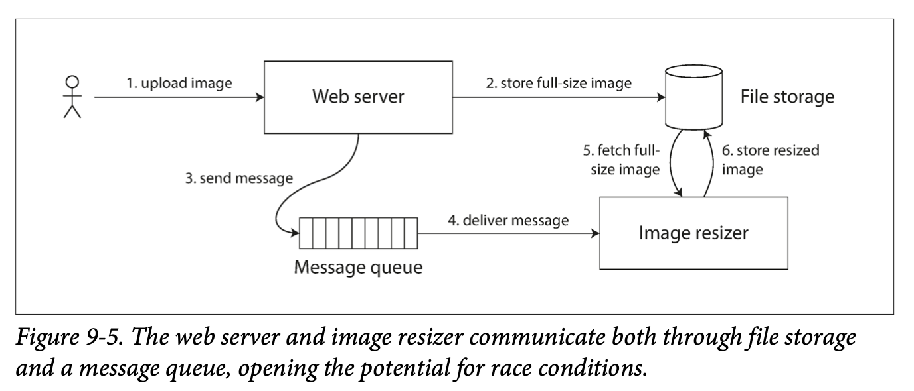

# 일관성과 합의 

8장에서 설명했지만 분산 시스템에서는 많은 것들이 잘못될 수 있다. 
이런 결함을 다루는 가장 간단한 방법은 사용자에게 오류 메시지 노출하는 것 
하지만 결함을 견뎌낼(tolerating) 서비스 구축하기 위해서는 방법을 찾아야 한다. 
 
이번 장에서 다룰 내용
- **내결함성** 을 지닌 분산 시스템을 구축하는데 쓰이는 알고리즘과 프로토콜 몇 가지 소개 
- 8장에서 설명한 모든 문제가 발생할 수 있다고 가정한다.
  - 네트워크에서 패킷 손실 
  - 패킷의 순서가 바뀌거나 중복됨
  - 임의의 시간에 응답 지연
- 분산 시스템의 극복 가능한 한계, 극복 불가능한 한계의 개요 

내결함성을 지닌 시스템을 구축하는 좋은 방법은 **내결함성을 보장해주는 범용 추상화** 를 찾아 이를 구현하는 것 
7장에서 설명한 트랜잭션 추상화가 하나의 범용 추상화이다.
- 트랜잭션 추상화로 어플리케이션은 충돌, 경쟁 조건, 디스크 장애 문제를 걱정하지 않아도 됨 

분산 시스템에서 가장 중요한 추상화 중 하나는 **합의** 이다. 
합의는 모든 노드가 어떤 것에 동의하도록 만드는 것 
ex) 단일 리더를 복제하는 데이터베이스 
- 리더가 죽어서 새 리더를 선출할 때 합의를 사용할 수 있음 
- 두 노드가 자신이 리더라고 생각하는 상황을 **스플릿 브레인(split brain)** 이라 부르며 이는 데이터 손실이 종종 발생함
- 올바르게 구현된 합의는 이런 문제들을 피하는데 도움이 됨 

먼저 분산 시스템에서 **제공될 수 있는 보장과 추상화의 범위** 를 알아봐야 함  
어떤 것을 할 수 있고 어떤 것을 할 수 없는지에 대한 범위를 이해해야 함  
이런 가능한 한계, 불가능한 한계는 구현 측면에서 깊이 연구되어왔고 자료도 많지만 이번 장에서 모두 다루기에는 힘듬 
- 공식적인 모델과 증명에 대한 것들은 참고 문헌에서 확인해라 

## 일관성 보장 
"복제 지연 문제" 에서 데이터베이스에서 발생하는 **타이밍 문제** 가 있었음 
- 동시에 데이터베이스 2개 노드를 본다면 각 노드에서 서로 다른 데이터를 볼 가능성이 크다. 
- 노드들에 쓰기 요청이 도착하는 시간이 다르기 때문 
- 이런 불일치는 데이터베이스가 어떤 복제 방법(단일 리더, 다중 리더, 리더 없는 복제 등) 을 사용하든지 항상 일어남 

복제 데이터 베이스는 대부분 **최종적 일관성** 을 제공한다.
- 최종적 일관성 : 불특정 시간동안 기다리면 결국 모든 읽기 요청이 같은 값을 반환 

그러나 이것은 매우 약한 보장이다. **언제 복제본이 수렴(최종적 일관성)될지에 대해서는 모르기 때문이다.**  
약한 보장만 제공하는 데이터베이스를 다룰 때는 그 제한을 알아야 하고 너무 많은 것을 가정해서는 안된다. 
대부분의 시간에는 잘 동작할 수 있기 때문에 버그는 테스트로 발견하기 어렵다.  
최종적 일관성의 에지 케이스는 시스템에 결함(네트워크 끊킴)이 있거나 동시성이 높을 때만 분명히 드러난다. 

분산 일관성 모델과 트랜잭션 격리 수준 계층은 비슷한 점이 있다.(232p 완화된 격리수준 참고) 
그러나 겹치는 부분이 있어도 이들은 독립적인 관심사이다.
- 트랜잭션 격리는 동시에 실행되는 트랜잭션 때문에 발생하는 **경쟁 조건을 회피** 하는 것에 관한 것 
- 분산 일관성은 지연과 결함이 있어도 복제본의 상태를 **코디네이션** 하는 것에 관한 것 

### 선형성 
최종적 일관성을 지닌 데이터베이스에서 두 개의 다른 복제본에 같은 query 동시에 하면 다른 응답을 받을 수 있다. 
복제본이 하나만 있다는 환상을 만들어 주면 어떨까 ?  
그러면 모든 클라이언트는 똑같이 데이터를 보고 복제 지연을 걱정할 필요가 없다.  
 
이것이 **선형성** 을 뒷바침하는 아이디어 이다.
- 선형성은 **원자적 일관성(atomic consistency)**, **강한 일관성(strong consistency)**, **즉각 일관성(immediate consistency)**, **외부 일관성(external consistency)** 라고도 함 

선형성의 정의는 매우 미묘하며 뒤에서 살펴본다. 
기본 아이디어는 시스템에 **데이터 복사본이 하나만 있고 그 데이터를 대상으로 수행하는 모든 연산은 원자적인 것 처럼 만드는 것** 이다.. 
이런 보장이 있다면 실제로 여러 복제본이 있더라도 어플리케이션은 거기에 신경 쓸 필요가 없다. 
 
선형성 시스템에서는 클라이언트가 쓰기를 완료하면 모든 클라이언트는 해당 값을 읽을 수 있어야 한다. 
복사본이 하나만 있다는 환상을 유지하기 위해서는 해당 값이 최신 값이며 캐시나 복제본에서 나온 값이 아니라고 보장해주어야 한다. 
선형성은 **최신성 보장(recency guarantee)** 이다. 
이 아이디어를 명확하기 하기 위해 **비선형 시스템의 예** 를 보자  
 
비선형 스포츠 웹사이트  
  
- 앨리스와 밥은 같은 방에서 휴대폰으로 2014 월드컵 결승전 결과를 확인하고 있다.
- 앨리스는 웹 페이지에서 우승팀이 결정된 것을 보고 밥에게 말한다.
- 밥은 휴대폰으로 새로고침 하지만 그 요청은 지연된 데이터베이스 복제본으로 전달되어 아직 경기중인것으로 보인다. 
- 밥은 앨리스가 최종 결과를 외친 것을 들은 후에 새로고침 버튼을 눌렀기 때문에 최신 값이 노출될 것으로 기대했다.
- 밥의 요청이 오래된 결과를 반환 했다는 것은 선형성 위반이다.

### 시스템에 선형성을 부여하는 것은 무엇인가 ? 
선형성 데이터베이스에서 동시에 같은 키(x) 를 읽고 쓰는 3 클라이언트의 예 
분산 시스템 분야에서 x 는 **레지스터** 라고 불린다. 
  
각 막대는 요청을 보낸 시점과 응답을 받은 시간을 나타낸다.
- x 의 값은 처음에 0 이고 C 가 값을 1로 설정하는 쓰기를 수행 
- 쓰기가 실행되는 동안 A와 B는 최신 값을 읽기 위해 데이터베이스를 폴링한다.
- 쓰기가 완료되지 않았을때 A와 B는 0 or 1 을 반환했을 수 있다. 읽기 연산이 처리되는 시점에 쓰기에 영향을 발생했는지 알 수 없기 때문이다.
- A는 3번째 읽기에서 쓰기가 완료되었기 때문에 1을 반환받았다.

그러나 위 그림은 선형성을 완전히 설명하기에는 부족하다. 
쓰기와 동시에 실행되는 읽기가 오래된 값 or 새로운 값 반환하기 때문에 A와 B의 읽기에서 선형성이 깨질 수 있다.  
이것은 "데이터의 단일 복사본" 을 모방하는 시스템에서 기대하는 바가 아니다. 
 

시스템을 선형적으로 만드려면 9-3 처럼 다른 제약조건을 추가해야 함  
- 선형적 시스템에서 우리는 x의 값이 0에서 1로 바뀌는 어떤 시점이 있어야 한다고 가정한다.
- 따라서 한 클라이언트가 새로운 값(1) 을 읽었다면 이후 모든 읽기는 새로운 값을 반환해야 한다.
- 쓰기 연산이 아직 완료되지 않았더라도 말이다.

   
- A는 2번째 읽기에서 새로운 값 1을 읽었다.
- 그 다음으로 B가 읽기를 수행하면 새로운 값 1을 읽어야 한다. 
- 아직 쓰기가 진행중이라도 말이다.

이 타이밍 다이어그램을 더 개선해서 어떤 시점에 원자적으로 영향을 주는 개별 연산을 시각화 할 수 있다. 
이번에 추가되는 다이어그램에서는 새로운 연산이 추가된다. 
> cas(x, vold, vnew) => r  
> 클라이언트가 원자적 연산(compare-and-set) 을 요청했다는 뜻이다.  
> x 의 현재 값 = vold 이면, vnew 로 설정되어야 한다.  
> 값이 같지 않으면 레지스터를 그대로 두고 오류를 반환해야 한다.

   
- B 가 읽기 요청을 보낸 후 D 가 x 를 0 으로 설정하는 요청을 하고 A 가 1로 설정하는 요청을 보낸다.
- B 읽기가 반환한 값은 1 (A가 쓰기한 값) 이다.
  - 이것은 문제가 없다. 데이터베이스가 D 의 쓰기 이후에 A 의 쓰기를 처리했고 마지막으로 B 의 읽기를 처리했다는 의미이다.
- 이 모델은 어떤 트랜잭션 격리도 가정하지 않는다. C는 처음 읽을때 1을 반환했지만 2번째 읽을때 2를 반환했다.
- B, C, D 는 cas(compare and set) 연산을 수행하는데 B와 C는 성공하지만 D 는 실패한다.
- B의 마지막 읽기는 **선형적이지 않다.** 
- C 의 cas 연산으로 x 는 2 > 4 로 변경되었고 A 는 이미 x 의 4를 읽었기 때문에 B 는 과거의 값을 읽는것은 허용되지 않는다.

이것이 선형성 뒤에 있는 직관이다. 
모든 요청과 응답 시점을 기록하고 그것들이 유효한 순서로 배열되는지 확인함으로써 시스템의 동작이 선형적인지 테스트 할 수 있다. 
 
> **선형성 대 직렬성**
> 선형성은 직렬성과 혼동하기 쉽다. 두 단어 모두 "순차적인 순서로 배열될 수 있는" 무언가를 의미하기 때문이다. 
> 그러나 이들은 매우 다른 보장이며 구별하는게 중요하다. 
>  
> 직렬성 
> 직렬성은 **트랜잭션들의 격리 속성** 이다. 트랜잭션들이 어떤 순서에 따라 실행되는 것처럼 동작하도록 보장해준다. 실제로 실행되는 순서와 관련없이 말이다. 
>  
> 선형성 
> 선형성은 레지스터에 실행되는 읽기와 쓰기에 대한 **최신성 보장**이다. 선형성 연산은 충돌 구체화 같은 부가적인 수단을 사용하지 않으면 쓰기 스큐 같은 문제를 막지 못한다. 
>  
> 데이터 베이스는 직렬성, 선형성을 모두 제공 할 수도 있으며 이런 조합은 **엄격한 직렬성(strict serializability)** 이나 **강한 단일 복사본 직렬성(strong one-copy serializability, strong-1SR)** 이라고 한다. 
> 2단계 잠금(256p)이나 실제적인 직렬실행(252p)을 기반으로 한 직렬성 구현은 보통 선형적이다. 
>  
> 그러나 직렬성 스냅숏 격리(260p) 는 선형적이지 않다. 설계상 잠금 경쟁을 피하기 위해서 일관된 스냅숏에서 읽는다. 
> 따라서 스냅숏 보다 나중에 실행된 쓰기가 포함되지 않으며 스냅숏에서 읽기를 수행하면 이것은 선형적이지 않다. 

## 선형성의 기대기 
어떤 환경에서 선형성이 유용할까?  
스포츠 시합의 최종 점수 조회는 시시한 예이다. 이 상황에서 결과가 몇 초 뒤쳐진다고 해도 손해를 유발할 가능성은 거의 없다. 
그러나 선형성이 중요한 요구사항이 되는 영역이 몇 가지 있다.
- 잠금과 리더 선출 
- 제약 조건과 유일성 보장 
- 채널 간 타이밍 의존성 

### 잠금과 리더 선출
단일 리더 복제를 사용하는 시스템은 리더가 여러개(스플릿 브레인) 가 아니라 하나만 존재하도록 보장해야함. 
스플릿 브레인을 방지하는 방법 중 하나는 **잠금** 을 이용하는 것이다. 
노드들은 시작할 때 잠금을 획득하고 성공한 노드가 리더가 된다. 
이 잠금은 **선형적** 이어야 하며 모든 노드들은 특정 노드가 잠금을 갖고 있다면 리더가 되는 것에 동의해야 한다. 
 
분산 잠금과 리더 선출을 구현하기 위해 코디네이션 서비스가 사용된다.
- 아파치 주키퍼(Apache Zookeeper)
- etcd
- 아파치 큐레이터(Apache Curator)

이런 코디네이션 서비스는 합의 알고리즘을 사용해 선형성 연산을 내결함성이 있는 방식으로 구현한다. 
- 이런 알고리즘은 361p "내결함성을 지닌 합의" 에서 설명 

잠금과 리더 선출을 구현하기 위해서는 미묘한 세부 사항이 많은데, (301p "리더와 잠금"에 나온 펜싱 문제) 
아파치 큐레이터(Apache Curator) 는 주키퍼 위에서 고수준 레시피를 제공하여 도움을 준다. 
이런 코디네이션 작업에는 선형성 저장소 서비스가 기초적인 기반이 된다. 
 
분산 잠금은 오라클 리얼 어플리케이션 클러스터(Oracle Real Application Cluster, RAC) 같은 분산 데이터베이스에서 세분화된 수준으로 사용되기도 함 
RAC 는 여러 노드가 동일한 디스크 저장 시스템을 공유해서 접근하며 디스크 페이지 마다 잠금을 사용한다. 
선형성 잠금은 트랜잭션 실행의 중요 경로(critical path)에 있어서 RAC 를 배치할 때는 보통 데이터베이스 노드들 사이에 통신용으로 전용 클러스터 연결 네트워크를 사용한다.

### 제약 조건과 유일성 보장 
유일성 제약 조건은 데이터베이스에서 흔한 일이다.  
ex) 사용자명, 이메일 주소 
데이터가 기록될 때 제약 조건을 강제하고 싶다면 **선형성이 필요** 하다. 
이런 유일성 제약 조건은 잠금, compare-and-set 연산과 비슷하다. 
> 제약 조건을 구현하는 방법의 차이라고 생각된다.

 

하지만 조금 더 복잡한 제약 조건들도 있다.
- 은행 잔고가 음수가 되지 않게 하기
- 재고의 갯수 보다 더 많이 팔지 않게 하기 

이런 복잡한 제약 조건은 모든 노드가 동의하는 하나의 최신 값이 있기를 요구한다. 
 
실제 어플리케이션에서 때때로 이런 제약 조건을 느슨하게 다루는 경우도 있다. 
- 예를들어 항공편이 초과 예약 됐다면 고객에게 다른 항공편으로 옮기고 불편함에 대한 보상을 지급할 수 있다.
- 이런 경우에는 선형성이 필요 없을 수 있다. 
- (523p "적시성과 무결성" 에서 느슨하게 이해되는 제약 조건을 살펴볼 예정)

그러나 관계형 데이터베이스에서 볼 수 있는 엄격한 유일성 제약 조건은 선형성이 필요하다. 
- 외래키나 속성 제약 조건 같은 다른 종류의 제약조건은 선형성 없이도 구현가능 

### 채널 간 타이밍 의존성 
그림 9-1 에서 앨리스가 승리 팀을 외치지 않았다면 밥은 자신의 질의 결과가 뒤쳐졌다는 것을 알지 못했을 것이다. 
**선형성 위반** 은 시스템에 부가적인 통신 채널이 있었기 때문에 발견됐다.(앨리스의 소리 > 밥의 귀) 
 
컴퓨터 시스템에서 예를 보자. 
사용자들이 이미지를 업로드 하면 백그라운드 프로세스가 이미지를 저해상도로 바꾸는(썸네일) 웹 사이트가 있다. 
  
- 사용자가 이미지를 업로드 하면 이미지는 웹 서버를 통해 파일 저장소에 저장됨 
- 웹 서버는 메시지 큐에 메시지를 전달하고 
- 이미지 크기 변경 모듈은 메시지 큐를 통해 파일 저장소의 이미지를 가져와 크기 변경 후 파일 저장소에 다시 저장한다.

파일 저장 서비스가 선형적이면 시스템을 잘 동작한다. 
하지만 선형적이지 않다면 **경쟁 조건** 의 위험이 있다. 
- 웹 서비스에서 이미지 크기 변경 모듈까지 메시지를 전달하는 것(3 ~ 4번 과정)이 파일 저장소의 이미지 복제(2번 이후 파일 저장소 내부) 보다 빠를 수 있다.
- 이때 이미지 크기 변경 모듈이 이미지를 읽으면 과거의 이미지를 읽거나 이미지를 읽지 못할 수 있다.

이 문제는 웹 서버와 크기 변경 모듈 사이에 두 가지 통신 채널(파일 저장소, 메시지 큐)이 존재하기 때문에 발생한다. 
따라서 선형성의 최신성 보장이 필요하다. 
선형성이 경쟁 조건을 회피하는 유일한 방법은 아니지만 이해하기 가장 단순하다. 
선형성을 만들기 위해 복잡성을 추가 하는 대신 164p "자신이 쓴 내용 읽기" 와 같은 대안을 사용할 수도 있다. 

## 선형성 시스템 구현하기 
선형성은 "데이터 복사본이 하나만 있는 것처럼 동작하고 그 데이터에 실행되는 모든 연산은 원자적" 이라는 것을 의미한다. 
선형성을 구현하는 가장 간단한 방법은 데이터 복사본을 하나만 사용하는것이다. 
그러나 이 방법으로는 결함을 견뎌낼 수 없다. (복사본을 저장한 노드에 장애가 발생 할 수 있음) 
 
시스템이 내결함성을 갖도록 하기 위해서 **복제** 를 사용할 수 있다. 5장에서 다뤘던 복제 방법을 살펴보면서 선형적으로 만들 수 있는지 확인해보자.
- 단일 리더 복제(선형적이 될 가능성이 있음)
  - 단일 리더 복제에서 리더는 쓰기에 사용되는 데이터의 주 복사본을 갖고 있고 팔로워는 데이터 백업 복사본을 보관함 
  - 리더나 동기식으로 복제되는 팔로워에서 실행된 읽기는 **선형적이 될 가능성이 있다**
  - 그러나 단일 리더 복제를 사용하는 데이터베이스가 실제로 선형적인 것은 아니다.
  - 스냅숏 격리와 같은 설계 때문이거나 동시성 버그 때문일 수 도 있다.
- 합의 알고리즘(선형적)
  - 이번 장 후반부에서 설명할 어떤 합의 알고리즘은 단일 리더 복제를 유사함 
  - 그러나 합의 프로토콜에는 스플릿 브레인과 복제본이 뒤쳐지는 문제를 막을 수단이 포함되어 선형성 저장소를 안전하게 구현할 수 있음 
  - ex) etcd 나 주키퍼가 이렇게 동작함 
- 다중 리더 복제(비선형적)
  - 다중 리더 복제 시스템은 일반적으로 선형적이지 않다. 
  - 여러 노드에서 동시에 쓰기를 처리하고 다른 노드에서 비동기로 복제를 수행하기 때문이다.
  - 이런 이유로 다중 리더 복제 시스템은 충돌 쓰기가 발생할 수 있다.(173p 참고)
  - 이런 충돌은 단일 복사본만 존재하는게 아니기 때문에 발생하는 부산물이다.
- 리더 없는 복제(아마도 비선형적)
  - 리더 없는 복제 시스템에서 때때로 정족수 읽기와 쓰기(w + r > n)를 요구 함으로써 "엄격한 일관성" 을 달성할 수 있다고 주장하는 사람들이 있다.
  - 하지만 정족수 설정에 따라 엄격한 일관성을 어떻게 정의하느냐에 따라서 위 주장은 사실이 아니다.
  - 일 기준 시계를 기반으로 한 "최종 쓰기 승리" 충돌 해소 방법은 거의 비선형적이다. 
  - 시계 타임 스탬프는 시계 스큐(clock skew) 때문에 이벤트의 실제 순서와 일치한다고 보장할 수 없기 때문이다. 
  - 바로 다음에 설명하겠지만 엄격한 정족수를 사용하더라도 비선형적일 수 있다. 

### 선형성과 정족수 
다이나모 스타일 모델(179p)에서 엄격한 정족수를 사용한 읽기 쓰기는 선형적인 것처럼 보인다. 
그러나 아래 그림에서 처럼 네트워크 지연의 변동이 심하면 경쟁 조건이 생길 수 있다. 
  
- x 의 초기값은 0 이며 쓰기 클라이언트는 3개 복제본에 x = 1 쓰기 요청 (n = 3, w = 3)
  - n : 복제 서버 
  - w : 쓰기를 수행할 서버 수  
- 클라이언트 A는 2개 노드로 구성된 정족수로부터 읽기를 수행해 1 을 확인 (r = 2)
- 클라리언트 B도 2개 노드에서 읽기를 수행해서 0 을 확인
- 정족수의 조건이 만족 (w + r > n) 됨에도 이 실행은 선형적이지 않다.
  - A 보다 B 가 나중에 요청하여 응답을 받았지만 최신 값이 추출되지 않음 

성능이 떨어지는 비용을 지불하면 다이나모 스타일 정족수를 선형적으로 만드는게 가능하다. 
- 읽기 클라이언트는 결과를 어플리케이션에 반환하기 전에 읽기 복구를 동기식으로 수행(180p "읽기 복구와 안티 엔트로피")
- 쓰기 클라이언트는 쓰기 요청전에 정족수로부터 최신 값을 읽은 후 쓰기를 수행 

정족수를 사용하는 데이터베이스 시스템 
- 리악은 성능상 불이익 때문에 동기식 읽기를 수행하지 않음 
- 카산드라는 정족수 읽기를 할 때 읽기 복구를 기다리지만, **최종 쓰기 승리** 충돌 해소 방법을 쓰기 때문에 같은 키에 동시에 쓰기를 수행하면 선형성을 잃게된다. 

이 방법을 이용하면 선형성 읽기와 쓰기를 구현할 수 있다. 하지만 compare-and-set 연산은 합의 알고리즘이 필요하기 때문에 구현할 수 없다. 
결론적으로 리더 없는 복제는 **선형성을 제공하지 않는다.** 라고 보는게 안전하다.

### 선형성의 비용
다중 리더 복제는 다중 데이터센터의 아키텍쳐에서 좋은 선택이다.(170p) 
두 데이터센터 사이에 네트워크 끊기면 무슨일이 생길까? 
각 데이터센터 내부 네트워크는 정상 동작하고 데이터센터 끼리는 서로 연결할 수 없다고 가정한다. 
 
다중 리더 데이터베이스를 사용하면 데이터센터는 정상 동작한다.  
  
- 한 데이터센터에 쓰여진 내용이 비동기로 다른 데이터센터로 복제되기 때문에 쓰기는 그냥 큐에 쌓였다가 네트워크 연결이 복구되면 복제가 재개된다.

반면 단일 리더 복제를 사용하면 문제가 생긴다. 
- 리더는 특정 데이터센터에 위치하며 모든 쓰기와 선형성 읽기는 리더로 전달되어야 한다.
- 따라서 팔로워 데이터센터에 접속한 클라이언트의 읽기와 쓰기 요청은 네트워크를 통해 동기식으로 리더 데이터센터로 전송되어야 한다.
- 데이터센터 사이의 네트워크가 끊기면 팔로워 데이터센터에 접속한 클라이언트는 아무것도 쓸 수 없고 선형성 읽기도 전혀 할 수 없다.
- 팔로워로 부터 읽을 수는 있지만 데이터가 비선형적일 수 있다. (최신 값이 아님)
- 클라이언트가 리더 데이터센터로 접속할 수 있다면 문제가 되지 않지만, 팔로워 데이터센터에만 접속할 수 있는 클라이언트는 네트워크가 복구되기 전까지 중단을 경험한다.

### CAP 정리 
이 문제는 단일 리더 복제나 다중 리더 복제의 문제는 아니며 **어떤 선형성 데이터 베이스라도 이 문제가 있다.** 
이 문제는 다중 데이터 센터 뿐만 아니라 신뢰성 없는 네트워크, 한 데이터센터 내에서도 발생 할 수 있다. 
트레이드 오프 
- 어플리케이션에서 선형성이 요구됨
  - 네트워크 문제 때문에 일부 복제 서버가 다른 복제 서버와 연결이 끊기면 복제서버는 연결이 끊긴 동안 요청을 처리할 수 없다.
  - 네트워크가 복구될 때까지 기다려야 한다. (가용성이 없다.)
- 어플리케이션에서 선형성이 요구되지 않음 
  - 각 복제서버가 다른 복제서버와 연결이 끊기더라도 독립적으로 요청을 처리하는 방식으로 쓰기를 처리가능하다.
  - 어플리케이션은 네트워크 문제에 **가용한 상태** 를 유지하지만 선형적이지 않다.

따라서 선형성이 필요없는 어플리케이션은 **네트워크 문제에 더 강인하다.** 
이런 통찰력은 2000년대 에릭 브루어(Eric Brewer) 가 이름 붙인 **CAP 정리** 로 널리 알려졌다. 
CAP 는 원래 데이터베이스에서 트레이드 오프에 대한 논의를 위한 목적으로 정확한 정의는 없고 경험 법칙으로 제안됐다. 
당시에는 많은 분산 데이터베이스가 공유 저장소를 장비 클러스터에서 선형성 시민틱을 제공하는데 중점을 두었다. 
CAP 는 데이터베이스 엔지니어가 대규모 웹 서비스를 구현하는 데 더 적합한 분산 비공유 시스템의 설계를 장려했다. 
- 2000년대 중반부터 새로운 데이터비이스 기술(NoSQL)이 폭발적으로 증가함 
- CAP 는 이런 새로운 데이터베이스 기술에 문화적 변화의 공로가 있음 

공식적으로 정의된 CAP 는 매우 범위가 좁다.
- 오직 하나의 일관성 모델(선형성)과 하나의 결함(네트워크 분단)만 고려함
- 네트워크 지연, 죽은 노드 처럼 다른 트레이드 오프에 대해서는 어떤 언급도 없다.

따라서 CAP 는 역사적인 영향력은 있지만 실용적인 가치는 거의 없다. 

> **도움이 안되는 CAP 정리**  
> CAP = Consistency(일관성), Availability(가용성), Partition tolerance(분단 내성)  
> CAP 는 세 개 중 2개를 고르라는 식으로 표현되는데 이것은 오해의 소지가 있다. 
> **네트워크 분단** 은 일종의 결함이기 때문에 선택할 수 있는 것이 아니며, 좋든 싫든 발생한다. 
> 네트워크의 결함이 생기면 **선형성** 과 **완전한 가용성** 사이에서 선택해야 한다.  
> 따라서 CAP 는 **네트워크 분단이 생겼을 경우 선형성과 가용성 중에 하나를 선택** 하라는 의미로 보는게 좋다. 
>  
> CAP 의 가용성은 몇 가지 모순된 정의가 있고 공식적인 정리는 보통의 의미에 부합하지 않는다. 
> 일반적인 "고가용성" 시스템들은 CAP 의 가용성에 대한 정의를 만족하지 않는다.(CAP 가용성의 정의가 이상하다는 뜻) 
> CAP 는 시스템을 이해하는데 도움을 주지 않으므로 피하는게 최선이다.

### 선형성과 네트워크 지연 
선형성은 유용한 보장이지만 현실에서 선형적인 시스템은 놀랄만큼 드물다. 
ex) 최신 다중코어 CPU 의 RAM  
- 하나의 CPU 코어에서 실행 중인 스레드가 메모리 주소에 write 한 뒤 
- 다른 CPU 코어에서 실행되는 스레드가 같은 주소를 읽으면 
- 이전 스레드가 write 한 값을 읽을 것이라고 보장하지 않는다.(메모리 베리어나 펜스를 쓰지 않으면)
- 이렇게 동작하는 이유는 각 CPU 는 메모리 캐시와 저장 버퍼를 갖고 있기 때문이다.
- CPU 는 기본적으로 캐시에 먼저 연산을 수행하고 쓰기 작업일 경우 비동기로 메인 메모리에 기록된다.
- 캐시에서 데이터를 읽는 것이 메인 메모리보다 훨씬 빠르기 때문에 최신 CPU 에서는 좋은 성능을 위해 필수적이다.
- 데이터 복사본이 여러개 생기면 (하나는 메인 메모리 다른 데이터는 CPU 캐시) 복사본은 비동기로 갱신되므로 선형성이 손실된다.

왜 이런 트레이드 오프를 만들까 ? 
- CAP 정리는 말이 안된다. 한 컴퓨터 안에서 CPU 코어 하나가 다른 부분과 연결이 끊겼을 때 정상적으로 동작하기를 기대하지 않기 때문이다.
- 선형성을 제거한 이유는 **내결함성이 아니라 성능** 이다.

선형성을 보장하지 않는 여러 분산 데이터베이스도 마찬가지이다. 
분산 데이터베이스들은 내결함성이 아닌 성능을 향상 시키기 위해서 선형성을 포기했다. 
선형성은 네트워크 결함과 관련 없이 항상 느리다. 
 
좀 더 효율적인 선형성 저장소 구현은 없을까? 
- 질문의 답은 "없다" 이다
- 아티야(Attiya)와 웰치(Welch)는 선형성을 원하면 읽기/쓰기 요청의 응답 시간이 적어도 네트워크 지연의 불확실성에 비례해야 함을 증명했다.
- 대부분의 네트워크는 지연 변동이 매우 심하기 때문에(281p "타임아웃과 기약 없는 지연") 선형성 읽기/쓰기 요청에 응답시간은 필연적으로 높아진다.
- 선형성을 제공하는 빠른 알고리즘은 없지만 완화된 일관성 모델은 더 빠를 수 있다.

12 장에서는 정확성을 희생하지 않고 선형성을 회피하는 방법을 설명한다.

## 순서화 보장 
앞에서 선형성 레지스터는 데이터 복사본이 하나만 있는 것처럼 동작하고 모든 연산이 어느 시점에 원자적 효과가 나타는 것처럼 보인다고 했다. 
이 정의는 연산들이 어떤 잘 정의된 순서대로 실행된다는 것을 암시한다. 
순서화는 이 책에서 되풀이된 주제이며 순서화가 근본적인 문제 해결을 위한 아이디어 일 수 있다는 것을 시사한다. 
- 5장 "단일 리더 복제" 에서 리더의 목적은 복제 로그에서 **쓰기의 순서** 를 결정하는 것이다.
  - 즉, 팔로워가 쓰기를 적용하는 순서를 결정함 
  - 단일 리더가 없다면 동시에 실행되는 연산 때문에 충돌이 발생할 수 있음 (173p 쓰기 충돌 다루기)
- 7장 "직렬성" 은 트랜잭션들이 **어떤 일련의 순서에 따라 실행되는 것 처럼 보장** 하는 것과 관련이 있다. 
  - 트랜잭션을 직렬적인 순서로 실행하여 직렬성을 업을 수 있고 동시 실행을 허용하고 충돌 방지 기법을 사용할 수 도 있다. (격리성 레벨)
- 8장 "분산 시스템에서 타임스탬프와 시계 사용"(208p 동기화된 시계에 의존하기) 은 순서가 없는 세상에 순서를 부여하려는 것이다.
  - 두 개의 쓰기 충돌 중 어떤 것이 먼저 일어났는지 알 수 있음 

위 사례들을 보면 순서화, 선형성, 합의 사이에는 깊은 연관 관계가 있음을 알 수 있다. 
이 개념은 약간 이론적이고 추상적이지만 시스템이 무엇을 할 수 있고 무엇을 할 수 없는지에 대한 이해를 하는 데 도움이 된다. 

### 순서화와 인과성 
순서화가 계속 등장하는 이유는 **순서화가 인과성을 보존** 하는 데 도움을 주기 때문이다. 
우리는 이미 인과성이 중요한 몇 가지 사례를 이미 살펴봤다. 
- 167p "일관된 순서로 읽기"(그림 5-5) 에서 일부 파티션이 다른 것 보다 느리게 복제되어 관찰자가 질문에 대한 응답을 먼저 보고 나서 응답의 질문을 보는 예
  - 질문은 답변보다 항상 선행되어야 한다. 
  - 이를 가리켜 질문과 답변 사이에 **인과적 의존성(causal dependency)** 가 있다고 한다.
- 그림 5-9 "다중 리더 복제에서 일부 복제 서버에 쓰기가 잘못된 순서로 도착" 하는 경우를 보면 네트워크 지연으로 어떤 쓰기가 다른 쓰기를 추월할 수 있음을 봤다.
  - 복제 서버 중 한 대에서는 존재하지 않는 로우를 갱신하는 것 처럼 보인다.
- 186p "동시 쓰기 감지" 에서 2 개의 연산 A와 B가 있으면 3가지 가능성이 있음을 보았다.
  - A 가 B 보다 먼저 실행되거나, B가 A 보다 먼저 실행되거나, A와 B는 동시 실행될 수 있다.
  - 이런 **이전 발생(happened before)** 관계는 인과성을 포현하는 또 다른 방법 
  - A 와 B 가 동시에 실행되는 경우를 제외하면 A 와 B 는 인과적 연결이 있을 수 있다. 
- 트랜잭션용 스냅숏 격리 맥락(236p 스냅숏 격리와 반복 읽기) 에서 트랜잭션은 일관된 스냅숏으로부터 읽기를 수행한다.
  - 여기서 일관적의 의미는 **인과성에 일관적(consistent with causality)** 의미한다
  - 스냅숏에 답변이 포함된다면 질문도 포함되어야 한다.
  - 인과성 측면에서 그 시점 전에 실행된 모든 연산의 효과를 알 수 있지만 나중에 실행된 연산의 효과느 알 수 없다.
  - 읽기 스큐(그림 7-6 설명한 비반복 읽기)는 인과성을 위반하는 상태에 있는 데이터를 읽는 것을 의미함 
- 트랜잭션들 상의 쓰기 스큐 예제(246p 쓰기 스큐와 팬텀) 는 인과적 의존성을 보여준다. 
  - 그림 7-8 에서 각각의 트랜잭션을 갖는 앨리스, 밥은 on_call 상태에서 on_call=false 가 허용되었다. (commit 되지 않아서)
  - 여기서 on_call=false 로 지정하는 것은 현재 누가 on_call=true 인지 관찰하는 것에 인과적으로 의존한다.
  - 직렬성 스냅숏 격리(206p) 는 트랜재션 사이의 인과적 의존성을 추적하여 쓰기 스큐를 검출한다.
- 앨리스와 밥이 축구를 결과를 보는 예제(그림 9-1) 에서 밥은 앨리스의 결과를 외치는 것을 들은 후 뒤쳐진 결과를 받았다는 것은 인과성 위반이다.
  - 앨리스의 결과를 외치는 행위는 결과 발표에 의존적이므로 밥 또한 그 결과를 볼 수 있어야 한다.

**인과성은 이벤트에 순서를 부여한다.**  
시스템이 인과성에 의해 부과된 순서를 지키면 시스템은 **인과적으로 일관적** 이라고 한다. 
예를 들어 스냅숏 격리는 인과적 일관성을 제공한다. 
데이터베이스에서 읽어서 데이터의 조각을 봤다면 그보다 먼저 발생한 어떤 데이터도 볼 수 있어야 한다. 

### 인과적 순서가 전체 순서는 아니다 
**전체 순서(total order)** 는 어떤 두 요소를 비교 할 수 있게 하므로 항상 어떤 것이 더 크고 작은지 말할 수 있다. 
예를들어 자연수는 전체 순서를 정할 수 있다.  
그러나 수학적 집합은 항상 전체 순서를 정할 수 있는 것은 아니다.  
{a, b} 가 {b, c} 보다 클까 ?  
두 집합은 부분집합의 관계가 아니기 때문에 실제로 비교할 수 없다. 
따라서 수학적 집합은 부분적으로 순서가 정해진다.(partially ordered) 
 
전체 순서와 부분 순서의 차이점은 다른 데이터베이스 일관성 모델에 반영된다.  
- 선형성 
  - 선형성 시스템에서는 연산의 **전체 순서** 를 정할 수 있다. 
  - 데이터 복사본이 하나만 있는 것처럼 동작하고 모든 연산이 원자적이면 두 연산중 하나가 먼저 실행됐다고 말할 수 있다.
- 인과성 
  - 두 연산 중 어떤 것도 다른 것보다 먼저 실행되지 않았다면 두 연산이 동시적이다. (188p 이전 발생 관계와 동시성)
  - 다르게 말하면 두 이벤트에 인과적인 관계가 있으면 이들은 순서가 있지만 전체 순서가 아닌 부분 순서를 정의한다는 의미이다.

그러므로 선형성 데이터 스토어에는 동시적 연산이 없다.  
데이터 스토어는 동시성 없이 하나의 타임라인을 따라서 단일 데이터 복사본에 연산을 실행해 모든 요청이 한 시점에 원자적으로 처리되도록 보장해준다. 
 
동시성은 타임라인 갈라졌다가 다시 합쳐지는 것을 의미한다. 
이 경우 다른 가지에 있는 연산은 비교 불가하다. 
예를들어 5장의 5-14 그림에서 전체 순서가 직선이 아니고 동시에 실행되는 연산들을 섞여 있었다. 
다이어그램의 화살표는 인과적 의존성, 즉 연산의 부분 순서화를 가리킨다. 
 
git 같은 분산 버전 관리 시스템에서 버전 히스토리는 인과적 의존성 그래프와 매우 유사하다. 
하나의 커밋은 다른 것보다 일직선 상에서 나중에 실행되지만 때때로 브랜치를 만들고 머지할때 동시에 만들어진 커밋들을 합친다. 

### 선형성은 인과적 일관성 보다 강하다
인과적 순서와 선형성 사이에는 어떤 관계가 있을까 ?  
그 답은 **선형성은 인과성을 내포**한다는 것이다. 
선형적인 시스템은 인과성도 올바르게 유지한다.  
그림 9-5 메시지 큐와 파일 저장소 시스템 에서 처럼 여러 통신 채널이 있을 때 선형성 시스템은 아무것도 하지 않아도 인과성이 보장된다. 
 
선형성이 인과성을 보장해준다는 사실은 시스템을 이해하기 쉽고 매력적으로 보이게 한다. 
그러나 333p "선형성의 비용" 에서 설명했듯이 네트워크 지연이 크만 성능과 가용성에 해가 될 수 있다. 
이런 이유로 분산 데이터 시스템들은 선형성을 포기해서 좋은 성능을 달성하지만 사용하기는 더 어렵다. 
 
좋은 소식은 **절충이 가능하다** 는 것이다.  
선형성은 인과성을 보존하는 유일한 방법이 아니며 다른 방법도 존재한다. 
성능 손해를 유발하지 않으면서 인과적 일관성을 만족 시킬 수 있으면 된다. 
- 인과적 일관성은 네트워크 지연 때문에 느려지지 않고 네트워크 장애에도 가용한 일관성 모델 중 가장 강한 것이다.

선형성 시스템이 필요하다고 생각되는 대부분의 경우 실제로 필요한 것은 인과적 일관성이다. 
최근에 최종적 일관성 시스템과 성능 및 가용성 특성이 비슷하면서 인과성을 보장하는 새로운 데이터베이스를 연구하고있다. 
아직 프로덕션 시스템에 반영된 연구분야는 아니지만 미래 시스템에 유망한 방향이다. 

### 인과적 의존성 담기 
비선형 시스템이 어떻게 인과적 일관성을 유지할 수 있는지에 핵심 세부 사항을 여기서 다루지는 않고 핵심 아이디어 중 일부만 살펴보겠다. 
 
인과성을 유지하기 위해서는 어떤 연산이 다른 연산보다 **먼저 실행됐는지** 알아야 한다.
- 이것은 부분 순서이다.
- 한 연산이 다른 연산보당 먼저 실행됐지만 모든 복제서버에서 그 순서로 처리돼야 한다.
- 따라서 복제 서버가 연산을 처리할 때 인과적으로 앞서는 모든 연산이 이미 처래됐다고 보장해야 한다.
- 선행 연산 중 빠진게 있다면 후행 연산은 선행 연산이 처리될 때까지 기다려야 한다.

인과적 의존성을 결정하려면 시스템의 노드에 관한 "지식" 을 기술할 방법이 필요하다. 
노드가 쓰기 Y를 실행했을 때 X 를 이미 본 상황이라면 X 와 Y 는 인과적인 관련이 있을지도 모른다. 
 
어떤 연산이 다른 연산보다 실행됐는지 결정하는 기법은 186p "동시 쓰기 감지" 에서 살펴본 것과 비슷하다.
- 리더 없는 데이터스토어의 인과성에서 설명했음 
- 리더 없는 데이터 저장소는 갱신 손실을 방지하기 위해 같은 키에 대한 동시 쓰기를 검출한다.

인과적 의존성에서는 단일 키 뿐만이 아니라 전체 데이터베이스에 걸친 인과적 의존성을 추적해야 한다. 
이를 위해서 버전 벡터를 일반화 할 수 있다. 
인과적 순서를 결정하기 위해서 데이터베이스는 어플리케이션이 데이터의 어떤 버전을 읽었는지 알아야 한다. 
그림 5-13 에서 쓰기를 실행할 때 이전 연산의 버전 번호를 데이터베이스로 돌려주는 것이 이 때문이다. 
206p "직렬성 스냅숏 격기(SSI)" 에서 충돌 검출에서도 비슷한 아이디어가 나타난다. 
트랜젹신이 커밋을 원할 때 데이터베이스는 읽은 데이터의 버전이 여전히 최신인지 확인한다. 

### 일련번호 순서화 
인과성은 중요한 이론적 개념이지만 모든 인과적 의존성을 실제로 추적하는 것은 **실용성이 떨어진다.**  
어플리케이션이 읽은 데이터를 모두 명시적으로 추적하는 것은 오버헤드가 크다. 
 
그러나 더 좋은 방법이 있다. **일련번호** 나 **타임 스탬프** 를 이용해 이벤트의 순서를 정할 수 있다.
- 타임스탬프는 일 기준 시계가 아닌 논리적 시계에서 얻을 수 있다. (287p 신뢰성 없는 시계)
- 논리적 시계는 연산을 식별하는 일련번호를 생성하는 알고리즘이고 보통 모든 연산마다 증가하는 카운터를 사용한다.

일련번호, 타임스탬프는 크기가 작고(보통 몇 바이트 수준) **전체 순서** 를 제공한다. 
즉 모든 연산은 고유 일련번호를 갖고 두 일련번호를 비교해서 어떤 것이 큰지(나중에 실행됐는지) 결정할 수 있다. 
 
단일 리더 복제를 쓰는 데이터베이스(p154 리더와 팔로워) 에서는 복제 로그가 인과성에 일관적인 쓰기 연산의 전체 순서를 정의한다. 
리더는 연산 마다 카운터를 증가시키고 복제 로그의 연산에 증가하는 일변번호를 할당하기만 하면된다. 
팔로워가 복제 로그에 나오는 순서대로 쓰기를 적용하면 팔로워의 상태는 언제나 인과성에 일관적이다.(리더보다 뒤쳐지더라도) 

### 비인과적 일련번호 생성기 
단일 리더가 없다면 연산에 사용할 일변번호를 생성하는 방법이 명확해 보이지 않는다. 
- 각 노드가 자신만의 독립적인 일련번호 집합을 생성할 수 있다. 
  - 예를 들어 한 노드는 홀수만, 다른 노드는 짝수만 일련번호를 생성 할 수 있다. 
- 각 연산에 일 기준 시계 타임 스탬프를 붙일 수 있다.
  - 타임 스탬프는 순차적이지 않지만 해싱도가 충분히 높다면 전체 순서를 정하는 데 충분 할 수도 있다.
  - 최종 쓰기 승리 충돌 해소(291p 이벤트 순서화용 타임스탬프) 에서 사용된다.
- 일련번호 블록을 미리 할당 할 수 있다.
  - 노드 A = 1 ~ 1,000 / 노드 B = 1,001 ~ 2,000 블록을 할당할 수 있다.

이런 3 가지 방법은 모두 잘 동작하고 단일 리더에 모든 연산을 밀어 넣는것 보다 확장성이 좋다. 
이 방법들은 연산마다 고유한 근사 증가(approximately increasing) 일련번호를 생성한다. 
그러나 이 일련번호는 인과성에 일관적이지 않다. 
 
인과성의 문제는 일련번호 생성기들이 여러 노드에 걸친 연산들의 순서를 올바르게 담지 못하기 때문에 발생한다.
- 각 노드는 초당 연산 수가 다를 수 있다.
  - 따라서 한 노드가 짝수를 생성하고 다른 노드가 홀수를 생성하면 한쪽 카운터가 뒤쳐지는 현상이 발생할 수 있다.
  - 이럴 경우 홀수와 짝수 연산이 있을 때 어떤 것이 인과적으로 먼저 실행됐는지 정확히 알기 어렵다.
- 물리적 시계에서 얻은 타임스탬프는 시계 스큐에 종속적이엉서 인과성에 일관적이지 않게 될 수 있다.
  - 그림 8-3 인과적으로 나중에 실행된 연산이 실제로 더 낮은 타임 스탬프를 배정하는 시나리오를 보여준다.
- 블록 할당자의 경우 한 연산이 노드 B(1,001 ~ 2,000) 에서 일련번호를 받고 다음에 노드 A(1 ~ 1,000) 에 일련번호를 받을 수 있다.
  - 일련번호가 인과성에 일관적이지 않다.
  
### 램포트 타임 스탬프
인과성에 일관적인 일련번호를 생성하는 간단한 방법이 있다. 
레슬리 램포트(Leslie Lamport) 가 1978년에 한 논문에 제안한 방법으로 **램포트 타임스탬프(Lamport timestamp)** 라고 부르며, 현재 분산 시스템 분야에서 가장 많이 인용된 논문 중 하나이다. 
 

램포트 타임 스탬프 규칙 
- 각 노드는 고유 식별자를 갖고 노드는 처리한 연산 개수 카운터로 유지한다.
- (카운터, 노드 ID) 의 쌍으로 램포트 타임 스탬프를 표현
- 두 노드는 때때로 카운터가 같을 수 있지만 노드 ID 로 타임 스탬프는 유일하게 된다.
- 두 타임 스탬프가 있으면 카운터가 큰 것이 크다
- 카운터가 같다면 노드 ID 가 큰 것이 크다
- 램포트 타임 스탬프는 전체 순서화를 제공한다.
- 지금까지 설명한 내용은 짝수/홀수 카운터와 본질적으로 같다.
- 램포트 타임 스탬프를 인과성에 일관적으로 만들어주는 핵심 아이디어는 이렇다.
- 모든 노드와 모든 클라이언트가 지금까지 본 값 중 **최대 값을 추적** 하고 모든 요청에 최대 값을 포함시킨다.
- 노드가 자신의 카운터 값보다 큰 최대 카운터를 가진 요청/응답을 받으면 바로 자신의 카운터를 최대 값으로 증가 시킨다.

아래 그림에 램포트 타임스탬프를 사용하는 방법이 설명돼 있다. 
  
- 클라이언트 A는 노드 2로 부터 카운터 값 5를 받고 노드 1 에게 최대값 5를 보낸다.
- 노드 1의 카운터는 1 이었지만 바로 5로 바뀌고 따라서 다음 연산은 증가된 카운터 6을 갖는다.

모든 연산에 최대 카운터 갑싱 따라다니는 이 방법은 순서가 인과성에 일관적이도록 보장해준다. 
모든 인과적 의존성이 타임 스탬프를 증가 시키기 때문이다. 
 
램포트 타임스탬프는 때떄로 186p "동시 쓰기 감지"에서 봤던 버전 벡터와 혼동된다. 
비슷한 점이 있지만 목적이 다르다. 
- 버전 벡터는 두 연산이 동시적인지 또는 어떤 연산이 다른 연산에 인과적으로 의존하는지 구별할 수 있다.
- 램포트 타임 스탬프는 항상 전체 순서화를 강제한다.
  - 램포트 타임 스탬프의 전체 순서화는 두 연산이 동시적인지 or 인과적으로 의존성이 있는지 알 수 없다.
버전 벡터보다 램포트 타임 스탬프의 장점은 크기가 더 작다는 것이다.

### 타임 스탬프 순서화로는 충분하지 않다 
램포트 타임 스탬프가 연산의 전체 순서를 정의하지만 분산 시스템의 여러 공통 문제를 해결하기에는 충분하지 않다. 
 
예를들어 사용자명으로 사용자 계정을 유일하게 보장하는 시스템을 고려해보자. 
두 사용자가 동시에 동일한 이름으로 계정을 생성하려고 하면 둘 중 한명은 성공하고 나저미는 실패해야 한다. 
전체 순서화가 이 문제를 해결하면 두 계정 중 타임 스탬프가 더 낮는 것을 성공시킨다. 
이 방법은 사후에 성공하는 쪽을 결정하는 데는 효과적이다. 
시스템에서 사용자명 생성 연산을 모두 모으면 그들의 타임 스탬프를 비교할 수 있다. 
그러나 노드가 사용자로부터 사용자명 생성요청을 받을때 **성공 or 실패 여부를 당장 결정** 해야 할때는 이 방법으로는 부족하다. 
이 방법는 한 노드에 생성 요청이 도달했을 때 다른 노드가 동일한 사용자 명으로 요청을 처리하고 있는지, 해당 연산에 어떤 타임 스탬프를 사용하는 지 알 수 없다. 
이를 해결하려면 다른 모든 노드가 무엇을 하고 있는지 확인해야 한다. 
다른 노드 중 하나에 장애가 생기거나 네트워크 문제가 생기면 시스템이 멈추게 된다. 
이것은 내결함성 시스템의 유형이 아니다. 
 
여기서의 문제는 연산의 전체 순서는 모든 연산을 모은 후에야 드러난다는 것이다. 
결론적으로 사용자 명에 대한 유일성 제약 조건 같은 것을 구현하려면 연산의 전체 순서가 있는 것으로 충분하지 않다. 
언제 그 순서가 확정되는지도 알아야 한다. 
언제 전체 순서가 확정되는지 알아야 한다는 아이디어를 **전체 순서 브로드캐스트** 의 주제로 다루겠다.

### 전체 순서 브로드캐스트 
### 전체 순서 브로드캐스트 사용하기 
### 전체 순서 브로드캐스트 사용해 선형성 저장소 구현하기 
### 선형성 저장소를 사용해 전체 순서 브로드캐스트 구현하기 