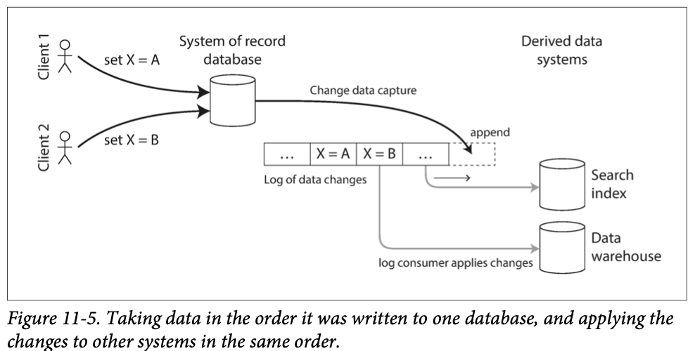
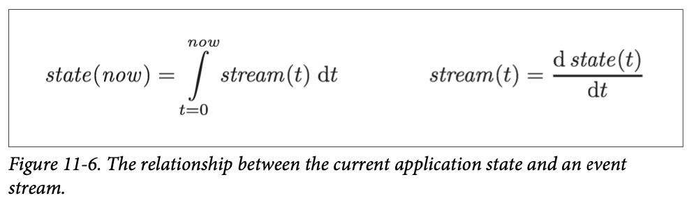
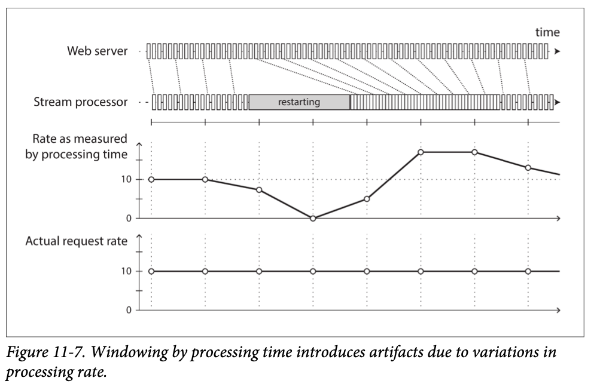

# 이벤트 스트림 전송

## 메시징 시스템

## 파티셔닝된 로그

# 데이터베이스와 스트림

## 시스템 동기화 유지하기

## 변경 데이터 캡쳐

클라이언트는 일반적으로 복제 로그를 파싱해서 데이터를 추출하는 방식을 사용하지 않고 데이터 모델과 질의 언어를 통해 데이터베이스에 질의한다. 
그렇기 때문에 데이터베이스에서 발생하는 데이터 변화를 감지해서 변경된 내용을 검색 색인, 캐시, 데이터 웨어하우스 같은 다른 저장 기술에 복제하기 어려웠다. 
**변경 데이터 캡쳐(change data capture, CDC)** 는 데이터베이스에 기록하는 모든 데이터의 변화를 관찰해 다른 시스템으로 데이터를 복제할 수 있는 형태로 추출하는 과정이다.

### 변경 데이터 캡쳐의 구현

변경 데이터 캡쳐는 본질적으로 변경 사항을 캡쳐할 데이터베이스 하나를 리더로 하고 나머지를 팔로워로 한다. 
로그 기반 메시지 브로커는 원본 데이터베이스에서 변경 이벤트를 전송하기에 적합하다.
- 로그 기반 메시지 브로커는 메시지 순서를 유지하기 때문이다.

변경 데이터 캡쳐를 구현하는 데 데이터베이스 트리거를 사용하기도 한다. 
하지만 이 방식은 고장 나기 쉽고 성능 오버헤드가 상당하다. 
변경 데이터 캡쳐는 메시지 브로커와 동일하게 비동기 방식으로 동작한다. 
레코드 데이터베이스 시스템은 변경 사항을 커밋하기 전에 변경 사항이 소비자에게 적용될 때까지 기다리지 않는다. 
하지만 복제 지연의 모든 문제가 발생하는 단점이 있다.

### 초기 스냅숏

데이터베이스에서 발생한 모든 변경 로그가 있다면 로그를 재현해서 데이터베이스의 전체 상태를 재구축할 수 있다. 
하지만 모든 변경 사항을 영구적으로 보관하는 일은 디스크 공간이 너무 많이 필요하고 모든 로그를 재생하는 작업도 너무 오래 걸리기 때문에 로그를 적당히 잘라야 한다. 
전문 색인을 새로 구축할 때도 예를 들면 전체 데이터베이스 복사본이 필요하다. 
최근에 갱신하지 않은 항목은 로그에 없기 때문에 최근 변경 사항만 반영하는 것으로는 충분하지 않다.
- 일관성 있는 스냅숏을 사용해야 한다.

데이터베이스 스냅숏은 변경 로그의 위치나 오프셋에 대응돼야 한다. 
그래야 스냅숏 이후에 변경 사항을 적용할 시점을 알 수 있다.

### 로그 컴팩션(log compaction)

저장 엔진은 주기적으로 같은 키의 로그 레코드를 찾아 중복을 제거하고 각 키에 대해 가장 최근에 갱신된 내용만 유지한다. 
컴팩션과 병합 과정은 백그라운드로 실행된다. 
로그 구조화 저장 엔진에서 특별한 널 값(툼스톤(tombstone))으로 갱신하는 것은 키의 삭제를 의미하고 로그 컴팩션을 수행할 때 실제로 값을 제거한다. 
CDC 시스템에서 모든 변경에 기본키가 포함되게 하고 키의 모든 갱신이 해당 키의 이전 값을 교체한다면 특정 키에 대해 최신 쓰기만 유지하면 충분하다. 
검색 색인과 같은 파생 데이터 시스템을 재구축할 때마다 새 소비자는 컴팩션된 로그 토픽을 오프셋 0부터 시작해서 순차적으로 데이터베이스의 모든 키를 스캔하면 된다.

### 변경 스트림용 API 지원

최근 데이터베이스들은 기능 개선이나 리버스 엔지니어링을 통해 CDC 지원을 하기보다 점진적으로 변경 스트림을 기본 인터페이스로서 지원하기 시작했다.

## 이벤트 소싱

이벤트 소싱은 도메인 주도 설계(domain-driven design, DDD) 커뮤니티에서 개발한 기법이다. 
이벤트 소싱은 변경 데이터 캡쳐와 유사하게 애플리케이션 상태 변화를 모두 변경 이벤트 로그에 저장한다. 
변경 데이터 캡쳐와 가장 큰 차이점은 이 아이디어를 적용하는 추상화 레벨이 다르다는 점이다.
- 변경 데이터 캡쳐에서 변경 로그는 데이터베이스에서 저수준으로 추출한다. 데이터베이스에 기록하는 애플리케이션은 CDC가 실행 중인지 알 필요가 없다.
- 이벤트 소싱에서 이벤트 저장은 단지 추가만 가능하고 갱신이나 삭제는 권장하지 않거나 금지한다. 이벤트는 저수준에서 상태 변경을 반영하는 것이 아니라 애플리케이션 수준에서 발생한 일을 반영하게끔 설계됐다.

이벤트 소싱을 사용하면 애플리케이션을 지속해서 개선하기가 매우 유리하다. 
어떤 상황이 발생한 후에 상황 파악이 쉽기 때문에 디버깅에 도움이 되고 애플리케이션 버그를 방지한다. 
이벤트 스토어(Event Store) 같은 특화된 데이터베이스는 이벤트 소싱을 사용하는 애플리케이션을 지원하게끔 개발하고 있지만 일반적으로 이벤트 소싱 접근법은 특정 도구와 독립적이다.

### 이벤트 로그에서 현재 상태 파생하기

이벤트 소싱을 사용하는 애플리케이션은 시스템에 **기록한** 데이터를 표현한 이벤트 로그를 가져와 사용자에게 보여주기에 적당한 애플리케이션 상태(시스템에서 데이터를 읽는 방식)로 변환해야 한다. 
변경 데이터 캡쳐와 마찬가지로 이벤트 로그를 재현하면 현재 시스템 상태를 재구성할 수 있다. 
하지만 로그 컴팩션은 다르게 처리해야 한다.
- 레코드 갱신용 CDC 이벤트는 레코드의 가장 최신 버전을 보유한다. 그래서 기본키의 현재 값은 전적으로 기본키의 가장 최신 이벤트로 결정되고 같은 키의 이전 이벤트는 로그 컴팩션을 통해 버린다.
- 이벤트 소싱은 뒤에 발생한 이벤트가 앞선 이벤트를 덮어쓰지 않는다. 그래서 마지막 상태를 재구축하기 위해서는 이벤트의 전체 히스토리가 필요하다. 로그 컴팩션이 불가능하다.

### 명령과 이벤트

이벤트 소싱 철학은 **이벤트** 와 **명령(command)** 을 구분하는 데 주의한다. 
애플리케이션은 먼저 명령이 실행 가능한지 확인해야 한다. 
무결성이 검증되고 명령이 승인되면 명령은 지속성 있는 불변 이벤트가 된다. 
이벤트는 생성 시점에 **사실(fact)** 이 된다. 
이벤트 스트림 소비자는 이벤트를 거절하지 못한다. 
명령의 유효성은 이벤트가 되기 전에 동기식으로 검증해야 한다. 
혹은 사용자 요청을 이벤트 두 개(선점 후 검증)로 분할할 수 있다. 
이렇게 분할하면 비동기 처리로 유효성 검사를 할 수 있다.

## 상태와 스트림 그리고 불변성

일반적으로 데이터베이스는 애플리케이션의 현재 상태를 저장한다고 생각한다. 
- 상태의 본질은 변하는 것이다.

모든 **변경 로그(changelog)** 는 시간이 지남에 따라 바뀌는 상태를 나타낸다. 

팻 헬랜드(Pat Helland)가 언급한 내용

> 트랜잭션 로그는 데이터베이스에 적용된 모든 변경 사항을 기록한다. 로그는 고속으로 덧붙여지고, 덧붙이기가 로그를 변경하는 유일한 방법이다. 이런 측면에서 데이터베이스의 내용은 로그의 최근 레코드 값을 캐시하고 있는 셈이다. 즉 로그가 진실이다. 데이터베이스는 로그의 부분 집합의 캐시다. 캐시한 부분 집합은 로그로부터 가져온 각 레코드와 색인의 최신 값이다.

로그 컴팩션은 로그와 데이터베이스 상태 사이의 차이를 메우는 한 가지 방법이다. 
로그 컴팩션은 각 레코드의 최신 버전만을 보유하고 덮어 쓰여진 버전은 삭제한다.

### 불변 이벤트의 장점

우연히 버그가 있는 코드를 배포해서 데이터베이스에 잘못된 데이터를 기록했을 때 코드가 데이터를 덮어썼다면 복구하기가 매우 어렵다. 
추가만 하는 불변 이벤트 로그를 썼다면 문제 상황의 진단과 복구가 훨씬 쉽다. 
불변 이벤트는 현재 상태보다 훨씬 많은 정보를 포함한다.

### 동일한 이벤트 로그로 여러 가지 뷰 만들기

불변 이벤트 로그에서 가변 상태를 분리하면 동일한 이벤트 로그로 다른 여러 읽기 전용 뷰를 만들 수 있다. 
스키마 설계, 색인, 저장소 엔진이 가진 복잡성은 특정 질의와 특정 접근 형식을 지원하기 위한 결과로 발생한다. 
이런 이유로 데이터를 쓰는 형식과 읽는 형식을 분리해 다양한 읽기 뷰를 허용한다면 상당한 유연성을 얻을 수 있다. 
이 개념을 **명령과 질의 책임의 분리(command query responsibility segregation, CQRS)** 라고 부른다.

### 동시성 제어

이벤트 소싱과 변경 데이터 캡쳐의 가장 큰 단점은 이벤트 로그의 소비가 대개 비동기로 이루어진다는 점이다. 
그래서 사용자가 로그에 이벤트를 기록하고 이어서 로그에서 파생된 뷰를 읽어도 기록한 이벤트가 아직 읽기 뷰에 반영되지 않았을 가능성이 있다. 
해결책 하나는 읽기 뷰의 갱신과 로그에 이벤트를 추가하는 작업을 동기식으로 수행하는 방법이다. 
이 방법을 쓰려면 트랜잭션에서 여러 쓰기를 원자적 단위로 결합해야 하므로 이벤트 로그와 읽기 뷰를 같은 저장 시스템에 담아야 한다. 
다른 시스템에 있다면 분산 트랜잭션이 필요하다. 
반면 이벤트 로그로 현재 상태를 만들면 동시성 제어 측면이 단순해진다. 
다중 객체 트랜잭션은 단일 사용자 동작이 여러 다른 장소의 데이터를 변경해야 할 때 필요하다. 
이벤트 소싱을 사용하면 사용자 동작에 대한 설명을 자체적으로 포함하는 이벤트를 설계할 수 있다. 
그러면 사용자 동작은 한 장소에서 한 번 쓰기만 필요하다. 
즉 이벤트를 로그에 추가만 하면 되며 원자적으로 만들 수 쉽다. 
이벤트 로그와 애플리케이션 상태를 같은 방식으로 파티셔닝하면 간단한 단일 스레드 로그 소비자는 쓰기용 동시성 제어는 필요하지 않다. 
파티션 내에서 이벤트의 직렬 순서를 정의하면 로그에서 동시성의 비결정성을 제거할 수 있다. 
한 이벤트가 여러 개의 상태 파티션에 영향을 준다면 더 많은 작업이 필요하다.

### 불변성의 한계

대부분 데이터를 추가하는 작업이고 갱신이나 삭제는 드물게 발생하는 작업부하는 불변으로 만들기 쉽다. 
상대적으로 작은 데이터셋에서 매우 빈번히 갱신과 삭제를 하는 작업부하는 불변 히스토리가 감당하기 힘들 정도로 커지거나 파편화 문제가 발생할 수도 있다. 
또한 컴팩션과 가비지 컬렉션의 성능 문제가 견고한 운영을 하는 데 큰 골칫거리가 되기도 한다. 
성능적인 이유 외에도 데이터가 모두 불변성임에도 관리상의 이유로 데이터를 삭제할 필요가 있는 상황일 수 있다. 
이런 상황에서는 이전 데이터를 삭제해야 한다는 또 다른 이벤트를 로그에 추가한다고 해결되지 않는다. 
실제로 원하는 바는 히스토리를 새로 쓰고 문제가 되는 데이터를 처음부터 기록하지 않았던 것처럼 하는 것이다. 
데이터를 진짜로 삭제하는 작업은 놀라울 정도로 어렵다. 
많은 곳에 복제본이 남아 있기 때문이다. 
즉 삭제는 해당 데이터를 "찾기 불가능하게끔" 하는 문제라기보다는 "찾기 어렵게" 하는 문제다.

# 스트림 처리

스트림을 처리하는 방법에는 크게 세 가지 선태지가 있다.
1. 이벤트에서 데이터를 꺼내 데이터베이스나 캐시, 검색 색인 또는 유사한 저장소 시스템에 기록하고 다른 클라이언트가 이 시스템에 해당 데이터를 질의한다. 이 방법은 시스템의 다른 부분에서 발생한 변화와 데이터베이스를 동기화하기에 좋은데, 특히 스트림 소비자가 데이터베이스에 데이터를 기록하는 유일한 클라이언트일 경우가 그렇다.
2. 이벤트를 사용자에 직접 보낸다. 이메일 경고나 푸시 알림을 전송하거나 이벤트를 시각화하는 실시간 대시보드에 이벤트를 스트리밍한다. 이 경우 사람이 스트림의 최종 소비자다.
3. 하나 이상의 입력 스트림을 처리해 하나 이상의 출력 스트림을 생산하다. 여러 처리 단계로 구성된 파이프라인을 통과할 수도 있다.

스트림을 처리하는 코드 조각을 **연산자(operator)** 나 **작업(job)** 이라 부른다. 
그 데이터플로의 양식도 비슷한데 스트림 처리자는 읽기 전용 방식으로 입력 스트림을 소비해 추가 전용 방식으로 다른 곳에 출력을 쓴다. 
일괄 처리 작업과 가장 크게 다른 점은 스트림이 끝나지 않는다는 점이다.
- 정렬 병합 조인을 사용할 수 없다.
- 내결함성 메커니즘 또한 변경이 필요하다.

## 스트림 처리의 사용

스트림 처리는 특정 상황이 발생하면 조직에 경고를 해주는 모니터링 목적으로 오랜 기간 사용돼 왔다. 
이런 종류의 애플리케이션은 상당히 복잡한 패턴 매칭과 상관 관계 규명이 필요하다.

### 복잡한 이벤트 처리

**복잡한 이벤트 처리(complex event processing, CEP)** 는 1990년대에 이벤트 스트림 분석용으로 개발된 방법이다. 
CEP는 특정 이벤트 패턴을 검색해야 하는 애플리케이션에 특히 적합하다. 
CEP는 정규 표현식으로 문자열에서 특정 문자 패턴을 찾는 방식과 유사하게 스트림에서 특정 이벤트 패턴을 찾는 규칙을 규정할 수 있다. 

### 스트림 분석

스트림 처리를 사용하는 다른 영역으로 스트림 **분석(analytics)** 이 있다. 
일반적으로 분석은 연속한 특정 이벤트 패턴을 찾는 것보다 대량의 이벤트를 집계하고 통계적 지표를 뽑는 것을 더 우선한다. 
일반적으로 이런 통계는 고정된 시간 간격 기준으로 계산한다. 
집계 시간 간격을 **윈도우(window)** 라 한다. 
스트림 분석 시스템은 확률적 알고리즘을 사용하기도 한다. 
집합 구성원 확인 용도의 블룸 필터(Bloom filter), 원소 개수 추정 용도의 하이퍼로그로그(HyperLogLog), 다양한 백분위 추정 알고리즘 등이 있다. 
확률적 알고리즘은 근사 결과를 제공한다. 
근사 알고리즘을 사용하다 보면 가끔 스트림 처리 시스템이 항상 데이터를 누락하거나 부정확하다고 생각하기 쉬운데 잘못된 생각이다. 
스트림 처리가 본질적으로 근사적인 것은 아니다. 
확률적 알고리즘은 일종의 최적화 기법일 뿐이다.

### 구체화 뷰 유지하기

데이터베이스 변경에 대한 스트림은 캐시, 검색 색인, 데이터 웨어하우스 같은 파생 데이터 시스템이 원본 데이터베이스의 최신 내용을 따라잡게 하는 데 쓸 수 있다. 
이런 예들은 **구체화 뷰** 를 유지하는 특별한 사례로 볼 수 있다.
어떤 데이터셋에 대한 또 다른 뷰를 만들어 효율적으로 질의할 수 있게하고 기반이 되는 데이터가 변경될 때마다 뷰를 갱신한다. 
마찬가지로 이벤트 소싱에서 애플리케이션 상태는 이벤트 로그를 적용함으로써 유지된다. 
구체화 뷰를 만들려면 잠재적으로 임의의 시간 범위에 발생한 **모든** 이벤트가 필요하다.

### 스트림 상에서 검색하기

전통적인 검색 엔진은 먼저 문서를 색인하고 색인을 통해 질의를 실행한다. 
반대로 스트림 검색은 처리 순서가 뒤집힌다. 
질의를 먼저 저장한다. 
그리고 CEP와 같이 문서는 질의를 지나면서 실행된다.

### 메시지 전달과 RPC

스트림 처리와 액터 모델과의 차이점
- 액터 프레임워크는 주로 동시성을 관리하고 통신 모듈을 분산 실행하는 메커니즘이다. 반면 스트림 처리는 기본적으로 데이터 관리 기법이다.
- 액터 간 통신은 주로 단기적이고 일대일이다. 반면 이벤트 로그는 지속성이 있고 다중 구독이 가능하다.
- 액터는 임의의 방식으로 통신할 수 있다(순환 요청/응답 패턴도 포함). 그러나 스트림 처리자는 대개 비순환 파이프라인에 설정된다. 이런 파이프라인에서 모든 스트림은 특정 작업의 출력이며 잘 정의된 입력 스트림 집합에서 파생된다.

유사한 RPC 시스템과 스트림 처리 사이에 겹치는 영역이 있다. 
아파치 스톰에는 **분산 RPC(distributed RPC)** 라 부르는 기능이 있다. 
이 기능을 사용하면 이벤트 스트림을 처리하는 노드 집합에 질의를 맡길 수 있다. 
이 질의는 입력 스트림 이벤트가 끼워지고 그 결과들을 취합해 사용자에게 돌려준다. 
또한 액터 프레임워크를 이용한 스트림 처리도 가능하다. 
그러나 액터 프레임워크는 대부분 장애 상황에서 메시지 전달을 보장하지 않기 때문에 추가적인 재시도 로직을 구현하지 않으면 처리에 내결함성을 보장하지 못한다.

## 시간에 관한 추론

스트림 처리자는 종종 시간을 다뤄야할 때가 있다. 
특히 분석 목적으로 사용하는 경우에 그렇다. 
이때 주로 "지난 5분 동안 평균" 같은 시간 윈도우를 자주 사용한다. 
일괄 처리에서 태스크는 과거에 쌓인 대량의 이벤트를 빠르게 처리한다. 
시간 단위로 쪼갤 필요가 있다면 일괄 처리는 각 이벤트에 내장된 타임스탬프를 봐야 한다. 
하지만 일괄 처리를 수행하는 장비의 시스템 시계를 보는 것은 의미가 없다. 
반면 많은 스트림 처리 프레임워크는 윈도우 시간을 결정할 때 처리하는 장비의 시스템 시계(처리 시간)를 이용한다. 
이벤트 생성과 이벤트 처리 사이의 간격이 무시할 정도로 작다면 꽤 합리적이다. 
그러나 눈에 띌 정도로 처리가 지연되면, 즉 이벤트가 실제로 발생한 시간보다 처리 시간이 많이 늦어지면 문제가 생긴다.

### 이벤트 시간 대 처리 시간

처리가 지연되는 데는 많은 이유가 있다. 
네트워크 결함, 메시지 브로커나 처리자에서 경쟁을 유발하는 성능 문제, 스트림 소비자의 재시작, 결함에서 복구하는 도중이나 코드 상의 버그를 고친 후 과거 이벤트의 재처리 등의 이유다. 
게다가 메시지가 지연되면 메시지 순서를 예측하지 못할 수도 있다. 
사람은 그런 불연속에 대해 대처하는 능력이 있지만 스트림 처리 알고리즘은 그런 타이밍과 순서 문제를 처리하게끔 명확히 작성할 필요가 있다. 
이벤트 시간과 처리 시간을 혼동하면 좋지 않은 데이터가 만들어진다.

### 준비 여부 인식

이벤트 시간 기준으로 윈도우를 정의할 때 발생하는 까다로운 문제는 특정 윈도우에서 모든 이벤트가 도착했다거나 아직도 이벤트가 계속 들어오고 있는지를 확신할 수 없다는 점이다. 
윈도우를 이미 종료한 후에 도착한 **낙오자** 이벤트를 처리할 방법이 필요하다.
1. 낙오자 이벤트는 무시한다.
2. 수정 값을 발행한다.

어떤 경우에는 "이제부터 t보다 이른 타임스탬프를 가진 메시지는 없다"고 가리키는 특별한 메시지를 사용하기도 한다. 
이 메시지는 윈도우를 트리거하는 소비자가 사용한다. 
그러나 다른 장비에 있는 여러 생산자가 저마다 최소 타임스탬프 임계치를 가지고 이벤트를 만든다면 소비자는 개별 생산자를 모두 추적해야 한다. 
이 경우 생산자를 추가하거나 제거하기가 더 까다롭다.

### 어쨌든 어떤 시계를 사용할 것인가?

이벤트가 시스템의 여러 지점에 버퍼링됐을 때 이벤트에 타임스탬프를 할당하는 것은 더 어렵다. 
이벤트의 타임스탬프는 모바일 장치 로컬 시계를 따르는, 실제 사용자와 상호작용이 발생했던 실제 시각이어야 한다. 
그러나 우연히 또는 고의로 잘못된 시간이 설정됐을 가능성이 있기 때문에 사용자가 제어하는 장비의 시계를 항상 신뢰하기는 어렵다. 
서버는 운영자가 관리하기 때문에 (서버의 시계를 따르는) 이벤트 서버에서 받은 시각이 좀 더 정확하지만 사용자와의 상호작용을 설명하기에는 의미가 부족하다. 
잘못된 장치 시계를 조정하는 한 가지 방법은 세 가지 타임스탬프를 로그로 남기는 것이다.
- 이벤트가 발생한 시간 (장치 시계)
- 이벤트를 서버로 보낸 시간 (장치 시계)
- 서버에서 이벤트를 받은 시간 (서버 시계)

두 번째와 세 번째의 타임스탬프 차이를 구하면 장치 시계와 서버 시계 간의 오프셋을 추정할 수 있다. 
이때 필요한 타임스탬프 정확도에 비해 네트워크 지연은 무시할 만하고 이벤트가 발생한 시간과 이벤트를 서버로 보낸 시간 사이에는 장치 시계 오프셋이 변하지 않았다고 가정한다. 
이 문제가 스트림 처리에서만 나타나는 것은 아니다. 
일괄 처리에서도 시간을 추론하는 데 정확하게 동일한 문제가 발생한다.

### 윈도우 유형

이벤트 타임스탬프를 어떻게 결정할지 안다면 다음 단계는 윈도우 기간을 어떻게 정의해야 하는지 결정하는 일이다. 
일반적으로 사용하는 윈도우 유형 및 몇 가지가 아래에 있다.
- **텀블링 윈도우(Tumbling window)** : 텀블링 윈도우의 크기는 고정 길이다.
- **홉핑 윈도우(Hopping window)** : 홉핑 윈도우는 고정 길이를 사용한다. 그러나 홉핑 윈도우는 결과를 매끄럽게 만들기 위해 윈도우를 중첩할 수 있다.
- **슬라이딩 윈도우(Sliding window)** : 슬라이딩 윈도우는 각 시간 간격 사이에서 발생한 모든 이벤트를 포함한다. 슬라이딩 윈도우는 시간 기준으로 정렬한 이벤트를 버퍼에 유지하고 오래된 이벤트가 만료되면 윈도우에서 제거하는 방식으로 구현할 수 있다.
- **세션 윈도우(Session window)** : 이전 윈도우 유형과는 다르게 세션 윈도우는 고정된 기간이 없다. 대신 같은 사용자가 짧은 시간 동안 발생시킨 모든 이벤트를 그룹화해서 세션 윈도우를 정의한다. 그리고 일정 시간이 지나 사용자가 비활성화되면 윈도우를 종료한다. 세션화는 웹사이트 분석을 할 때 흔히 필요하다.

## 스트림 조인

## 내결함성

# 정리