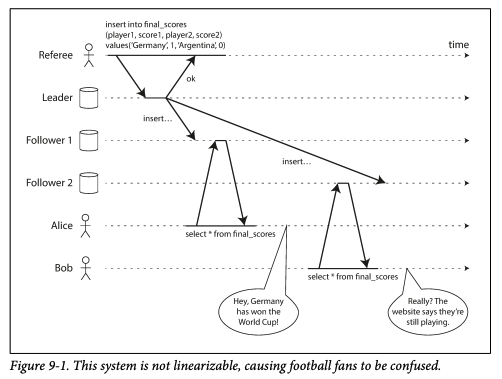
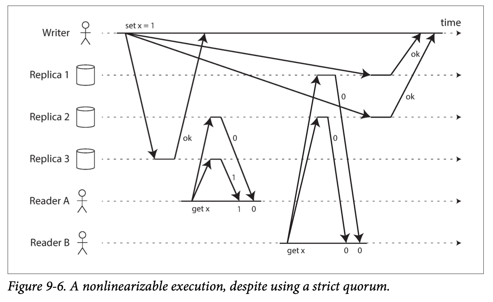
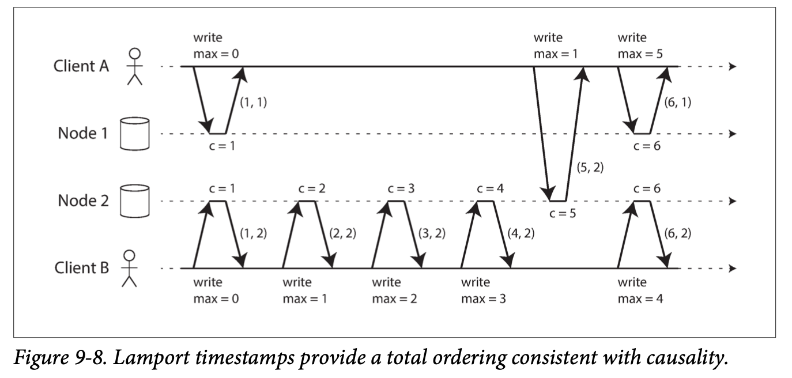
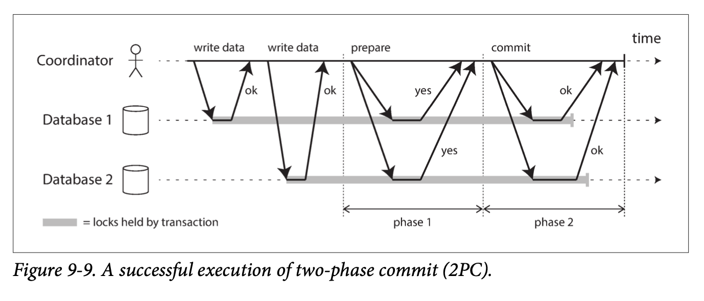
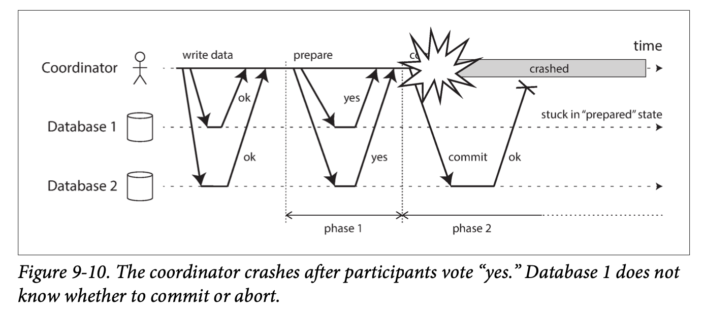

# 일관성과 합의 

8장에서 설명했지만 분산 시스템에서는 많은 것들이 잘못될 수 있다. 
이런 결함을 다루는 가장 간단한 방법은 사용자에게 오류 메시지 노출하는 것 
하지만 결함을 견뎌낼(tolerating) 서비스 구축하기 위해서는 방법을 찾아야 한다. 
 
이번 장에서 다룰 내용
- **내결함성** 을 지닌 분산 시스템을 구축하는데 쓰이는 알고리즘과 프로토콜 몇 가지 소개 
- 8장에서 설명한 모든 문제가 발생할 수 있다고 가정한다.
  - 네트워크에서 패킷 손실 
  - 패킷의 순서가 바뀌거나 중복됨
  - 임의의 시간에 응답 지연
- 분산 시스템의 극복 가능한 한계, 극복 불가능한 한계의 개요 

내결함성을 지닌 시스템을 구축하는 좋은 방법은 **내결함성을 보장해주는 범용 추상화** 를 찾아 이를 구현하는 것 
7장에서 설명한 트랜잭션 추상화가 하나의 범용 추상화이다.
- 트랜잭션 추상화로 어플리케이션은 충돌, 경쟁 조건, 디스크 장애 문제를 걱정하지 않아도 됨 

분산 시스템에서 가장 중요한 추상화 중 하나는 **합의** 이다. 
합의는 모든 노드가 어떤 것에 동의하도록 만드는 것 
ex) 단일 리더를 복제하는 데이터베이스 
- 리더가 죽어서 새 리더를 선출할 때 합의를 사용할 수 있음 
- 두 노드가 자신이 리더라고 생각하는 상황을 **스플릿 브레인(split brain)** 이라 부르며 이는 데이터 손실이 종종 발생함
- 올바르게 구현된 합의는 이런 문제들을 피하는데 도움이 됨 

먼저 분산 시스템에서 **제공될 수 있는 보장과 추상화의 범위** 를 알아봐야 함  
어떤 것을 할 수 있고 어떤 것을 할 수 없는지에 대한 범위를 이해해야 함  
이런 가능한 한계, 불가능한 한계는 구현 측면에서 깊이 연구되어왔고 자료도 많지만 이번 장에서 모두 다루기에는 힘듬 
- 공식적인 모델과 증명에 대한 것들은 참고 문헌에서 확인해라 

## 일관성 보장 
"복제 지연 문제" 에서 데이터베이스에서 발생하는 **타이밍 문제** 가 있었음 
- 동시에 데이터베이스 2개 노드를 본다면 각 노드에서 서로 다른 데이터를 볼 가능성이 크다. 
- 노드들에 쓰기 요청이 도착하는 시간이 다르기 때문 
- 이런 불일치는 데이터베이스가 어떤 복제 방법(단일 리더, 다중 리더, 리더 없는 복제 등) 을 사용하든지 항상 일어남 

복제 데이터 베이스는 대부분 **최종적 일관성** 을 제공한다.
- 최종적 일관성 : 불특정 시간동안 기다리면 결국 모든 읽기 요청이 같은 값을 반환 

그러나 이것은 매우 약한 보장이다. **언제 복제본이 수렴(최종적 일관성)될지에 대해서는 모르기 때문이다.**  
약한 보장만 제공하는 데이터베이스를 다룰 때는 그 제한을 알아야 하고 너무 많은 것을 가정해서는 안된다. 
대부분의 시간에는 잘 동작할 수 있기 때문에 버그는 테스트로 발견하기 어렵다.  
최종적 일관성의 에지 케이스는 시스템에 결함(네트워크 끊킴)이 있거나 동시성이 높을 때만 분명히 드러난다. 

분산 일관성 모델과 트랜잭션 격리 수준 계층은 비슷한 점이 있다.(232p 완화된 격리수준 참고) 
그러나 겹치는 부분이 있어도 이들은 독립적인 관심사이다.
- 트랜잭션 격리는 동시에 실행되는 트랜잭션 때문에 발생하는 **경쟁 조건을 회피** 하는 것에 관한 것 
- 분산 일관성은 지연과 결함이 있어도 복제본의 상태를 **코디네이션** 하는 것에 관한 것 

### 선형성 
최종적 일관성을 지닌 데이터베이스에서 두 개의 다른 복제본에 같은 query 동시에 하면 다른 응답을 받을 수 있다. 
복제본이 하나만 있다는 환상을 만들어 주면 어떨까 ?  
그러면 모든 클라이언트는 똑같이 데이터를 보고 복제 지연을 걱정할 필요가 없다.  
 
이것이 **선형성** 을 뒷바침하는 아이디어 이다.
- 선형성은 **원자적 일관성(atomic consistency)**, **강한 일관성(strong consistency)**, **즉각 일관성(immediate consistency)**, **외부 일관성(external consistency)** 라고도 함 

선형성의 정의는 매우 미묘하며 뒤에서 살펴본다. 
기본 아이디어는 시스템에 **데이터 복사본이 하나만 있고 그 데이터를 대상으로 수행하는 모든 연산은 원자적인 것 처럼 만드는 것** 이다.. 
이런 보장이 있다면 실제로 여러 복제본이 있더라도 어플리케이션은 거기에 신경 쓸 필요가 없다. 
 
선형성 시스템에서는 클라이언트가 쓰기를 완료하면 모든 클라이언트는 해당 값을 읽을 수 있어야 한다. 
복사본이 하나만 있다는 환상을 유지하기 위해서는 해당 값이 최신 값이며 캐시나 복제본에서 나온 값이 아니라고 보장해주어야 한다. 
선형성은 **최신성 보장(recency guarantee)** 이다. 
이 아이디어를 명확하기 하기 위해 **비선형 시스템의 예** 를 보자  
 
비선형 스포츠 웹사이트  
  
- 앨리스와 밥은 같은 방에서 휴대폰으로 2014 월드컵 결승전 결과를 확인하고 있다.
- 앨리스는 웹 페이지에서 우승팀이 결정된 것을 보고 밥에게 말한다.
- 밥은 휴대폰으로 새로고침 하지만 그 요청은 지연된 데이터베이스 복제본으로 전달되어 아직 경기중인것으로 보인다. 
- 밥은 앨리스가 최종 결과를 외친 것을 들은 후에 새로고침 버튼을 눌렀기 때문에 최신 값이 노출될 것으로 기대했다.
- 밥의 요청이 오래된 결과를 반환 했다는 것은 선형성 위반이다.

### 시스템에 선형성을 부여하는 것은 무엇인가 ? 
선형성 데이터베이스에서 동시에 같은 키(x) 를 읽고 쓰는 3 클라이언트의 예 
분산 시스템 분야에서 x 는 **레지스터** 라고 불린다. 
  
각 막대는 요청을 보낸 시점과 응답을 받은 시간을 나타낸다.
- x 의 값은 처음에 0 이고 C 가 값을 1로 설정하는 쓰기를 수행 
- 쓰기가 실행되는 동안 A와 B는 최신 값을 읽기 위해 데이터베이스를 폴링한다.
- 쓰기가 완료되지 않았을때 A와 B는 0 or 1 을 반환했을 수 있다. 읽기 연산이 처리되는 시점에 쓰기에 영향을 발생했는지 알 수 없기 때문이다.
- A는 3번째 읽기에서 쓰기가 완료되었기 때문에 1을 반환받았다.

그러나 위 그림은 선형성을 완전히 설명하기에는 부족하다. 
쓰기와 동시에 실행되는 읽기가 오래된 값 or 새로운 값 반환하기 때문에 A와 B의 읽기에서 선형성이 깨질 수 있다.  
이것은 "데이터의 단일 복사본" 을 모방하는 시스템에서 기대하는 바가 아니다. 
 

시스템을 선형적으로 만드려면 9-3 처럼 다른 제약조건을 추가해야 함  
- 선형적 시스템에서 우리는 x의 값이 0에서 1로 바뀌는 어떤 시점이 있어야 한다고 가정한다.
- 따라서 한 클라이언트가 새로운 값(1) 을 읽었다면 이후 모든 읽기는 새로운 값을 반환해야 한다.
- 쓰기 연산이 아직 완료되지 않았더라도 말이다.

   
- A는 2번째 읽기에서 새로운 값 1을 읽었다.
- 그 다음으로 B가 읽기를 수행하면 새로운 값 1을 읽어야 한다. 
- 아직 쓰기가 진행중이라도 말이다.

이 타이밍 다이어그램을 더 개선해서 어떤 시점에 원자적으로 영향을 주는 개별 연산을 시각화 할 수 있다. 
이번에 추가되는 다이어그램에서는 새로운 연산이 추가된다. 
> cas(x, vold, vnew) => r  
> 클라이언트가 원자적 연산(compare-and-set) 을 요청했다는 뜻이다.  
> x 의 현재 값 = vold 이면, vnew 로 설정되어야 한다.  
> 값이 같지 않으면 레지스터를 그대로 두고 오류를 반환해야 한다.

   
- B 가 읽기 요청을 보낸 후 D 가 x 를 0 으로 설정하는 요청을 하고 A 가 1로 설정하는 요청을 보낸다.
- B 읽기가 반환한 값은 1 (A가 쓰기한 값) 이다.
  - 이것은 문제가 없다. 데이터베이스가 D 의 쓰기 이후에 A 의 쓰기를 처리했고 마지막으로 B 의 읽기를 처리했다는 의미이다.
- 이 모델은 어떤 트랜잭션 격리도 가정하지 않는다. C는 처음 읽을때 1을 반환했지만 2번째 읽을때 2를 반환했다.
- B, C, D 는 cas(compare and set) 연산을 수행하는데 B와 C는 성공하지만 D 는 실패한다.
- B의 마지막 읽기는 **선형적이지 않다.** 
- C 의 cas 연산으로 x 는 2 > 4 로 변경되었고 A 는 이미 x 의 4를 읽었기 때문에 B 는 과거의 값을 읽는것은 허용되지 않는다.

이것이 선형성 뒤에 있는 직관이다. 
모든 요청과 응답 시점을 기록하고 그것들이 유효한 순서로 배열되는지 확인함으로써 시스템의 동작이 선형적인지 테스트 할 수 있다. 
 
> **선형성 대 직렬성**
> 선형성은 직렬성과 혼동하기 쉽다. 두 단어 모두 "순차적인 순서로 배열될 수 있는" 무언가를 의미하기 때문이다. 
> 그러나 이들은 매우 다른 보장이며 구별하는게 중요하다. 
>  
> 직렬성 
> 직렬성은 **트랜잭션들의 격리 속성** 이다. 트랜잭션들이 어떤 순서에 따라 실행되는 것처럼 동작하도록 보장해준다. 실제로 실행되는 순서와 관련없이 말이다. 
>  
> 선형성 
> 선형성은 레지스터에 실행되는 읽기와 쓰기에 대한 **최신성 보장**이다. 선형성 연산은 충돌 구체화 같은 부가적인 수단을 사용하지 않으면 쓰기 스큐 같은 문제를 막지 못한다. 
>  
> 데이터 베이스는 직렬성, 선형성을 모두 제공 할 수도 있으며 이런 조합은 **엄격한 직렬성(strict serializability)** 이나 **강한 단일 복사본 직렬성(strong one-copy serializability, strong-1SR)** 이라고 한다. 
> 2단계 잠금(256p)이나 실제적인 직렬실행(252p)을 기반으로 한 직렬성 구현은 보통 선형적이다. 
>  
> 그러나 직렬성 스냅숏 격리(260p) 는 선형적이지 않다. 설계상 잠금 경쟁을 피하기 위해서 일관된 스냅숏에서 읽는다. 
> 따라서 스냅숏 보다 나중에 실행된 쓰기가 포함되지 않으며 스냅숏에서 읽기를 수행하면 이것은 선형적이지 않다. 

## 선형성의 기대기 
어떤 환경에서 선형성이 유용할까?  
스포츠 시합의 최종 점수 조회는 시시한 예이다. 이 상황에서 결과가 몇 초 뒤쳐진다고 해도 손해를 유발할 가능성은 거의 없다. 
그러나 선형성이 중요한 요구사항이 되는 영역이 몇 가지 있다.
- 잠금과 리더 선출 
- 제약 조건과 유일성 보장 
- 채널 간 타이밍 의존성 

### 잠금과 리더 선출
단일 리더 복제를 사용하는 시스템은 리더가 여러개(스플릿 브레인) 가 아니라 하나만 존재하도록 보장해야함. 
스플릿 브레인을 방지하는 방법 중 하나는 **잠금** 을 이용하는 것이다. 
노드들은 시작할 때 잠금을 획득하고 성공한 노드가 리더가 된다. 
이 잠금은 **선형적** 이어야 하며 모든 노드들은 특정 노드가 잠금을 갖고 있다면 리더가 되는 것에 동의해야 한다. 
 
분산 잠금과 리더 선출을 구현하기 위해 코디네이션 서비스가 사용된다.
- 아파치 주키퍼(Apache Zookeeper)
- etcd
- 아파치 큐레이터(Apache Curator)

이런 코디네이션 서비스는 합의 알고리즘을 사용해 선형성 연산을 내결함성이 있는 방식으로 구현한다. 
- 이런 알고리즘은 361p "내결함성을 지닌 합의" 에서 설명 

잠금과 리더 선출을 구현하기 위해서는 미묘한 세부 사항이 많은데, (301p "리더와 잠금"에 나온 펜싱 문제) 
아파치 큐레이터(Apache Curator) 는 주키퍼 위에서 고수준 레시피를 제공하여 도움을 준다. 
이런 코디네이션 작업에는 선형성 저장소 서비스가 기초적인 기반이 된다. 
 
분산 잠금은 오라클 리얼 어플리케이션 클러스터(Oracle Real Application Cluster, RAC) 같은 분산 데이터베이스에서 세분화된 수준으로 사용되기도 함 
RAC 는 여러 노드가 동일한 디스크 저장 시스템을 공유해서 접근하며 디스크 페이지 마다 잠금을 사용한다. 
선형성 잠금은 트랜잭션 실행의 중요 경로(critical path)에 있어서 RAC 를 배치할 때는 보통 데이터베이스 노드들 사이에 통신용으로 전용 클러스터 연결 네트워크를 사용한다.

### 제약 조건과 유일성 보장 
유일성 제약 조건은 데이터베이스에서 흔한 일이다.  
ex) 사용자명, 이메일 주소 
데이터가 기록될 때 제약 조건을 강제하고 싶다면 **선형성이 필요** 하다. 
이런 유일성 제약 조건은 잠금, compare-and-set 연산과 비슷하다. 
> 제약 조건을 구현하는 방법의 차이라고 생각된다.

 

하지만 조금 더 복잡한 제약 조건들도 있다.
- 은행 잔고가 음수가 되지 않게 하기
- 재고의 갯수 보다 더 많이 팔지 않게 하기 

이런 복잡한 제약 조건은 모든 노드가 동의하는 하나의 최신 값이 있기를 요구한다. 
 
실제 어플리케이션에서 때때로 이런 제약 조건을 느슨하게 다루는 경우도 있다. 
- 예를들어 항공편이 초과 예약 됐다면 고객에게 다른 항공편으로 옮기고 불편함에 대한 보상을 지급할 수 있다.
- 이런 경우에는 선형성이 필요 없을 수 있다. 
- (523p "적시성과 무결성" 에서 느슨하게 이해되는 제약 조건을 살펴볼 예정)

그러나 관계형 데이터베이스에서 볼 수 있는 엄격한 유일성 제약 조건은 선형성이 필요하다. 
- 외래키나 속성 제약 조건 같은 다른 종류의 제약조건은 선형성 없이도 구현가능 

### 채널 간 타이밍 의존성 
그림 9-1 에서 앨리스가 승리 팀을 외치지 않았다면 밥은 자신의 질의 결과가 뒤쳐졌다는 것을 알지 못했을 것이다. 
**선형성 위반** 은 시스템에 부가적인 통신 채널이 있었기 때문에 발견됐다.(앨리스의 소리 > 밥의 귀) 
 
컴퓨터 시스템에서 예를 보자. 
사용자들이 이미지를 업로드 하면 백그라운드 프로세스가 이미지를 저해상도로 바꾸는(썸네일) 웹 사이트가 있다. 
  
- 사용자가 이미지를 업로드 하면 이미지는 웹 서버를 통해 파일 저장소에 저장됨 
- 웹 서버는 메시지 큐에 메시지를 전달하고 
- 이미지 크기 변경 모듈은 메시지 큐를 통해 파일 저장소의 이미지를 가져와 크기 변경 후 파일 저장소에 다시 저장한다.

파일 저장 서비스가 선형적이면 시스템을 잘 동작한다. 
하지만 선형적이지 않다면 **경쟁 조건** 의 위험이 있다. 
- 웹 서비스에서 이미지 크기 변경 모듈까지 메시지를 전달하는 것(3 ~ 4번 과정)이 파일 저장소의 이미지 복제(2번 이후 파일 저장소 내부) 보다 빠를 수 있다.
- 이때 이미지 크기 변경 모듈이 이미지를 읽으면 과거의 이미지를 읽거나 이미지를 읽지 못할 수 있다.

이 문제는 웹 서버와 크기 변경 모듈 사이에 두 가지 통신 채널(파일 저장소, 메시지 큐)이 존재하기 때문에 발생한다. 
따라서 선형성의 최신성 보장이 필요하다. 
선형성이 경쟁 조건을 회피하는 유일한 방법은 아니지만 이해하기 가장 단순하다. 
선형성을 만들기 위해 복잡성을 추가 하는 대신 164p "자신이 쓴 내용 읽기" 와 같은 대안을 사용할 수도 있다. 

## 선형성 시스템 구현하기 
선형성은 "데이터 복사본이 하나만 있는 것처럼 동작하고 그 데이터에 실행되는 모든 연산은 원자적" 이라는 것을 의미한다. 
선형성을 구현하는 가장 간단한 방법은 데이터 복사본을 하나만 사용하는것이다. 
그러나 이 방법으로는 결함을 견뎌낼 수 없다. (복사본을 저장한 노드에 장애가 발생 할 수 있음) 
 
시스템이 내결함성을 갖도록 하기 위해서 **복제** 를 사용할 수 있다. 5장에서 다뤘던 복제 방법을 살펴보면서 선형적으로 만들 수 있는지 확인해보자.
- 단일 리더 복제(선형적이 될 가능성이 있음)
  - 단일 리더 복제에서 리더는 쓰기에 사용되는 데이터의 주 복사본을 갖고 있고 팔로워는 데이터 백업 복사본을 보관함 
  - 리더나 동기식으로 복제되는 팔로워에서 실행된 읽기는 **선형적이 될 가능성이 있다**
  - 그러나 단일 리더 복제를 사용하는 데이터베이스가 실제로 선형적인 것은 아니다.
  - 스냅숏 격리와 같은 설계 때문이거나 동시성 버그 때문일 수 도 있다.
- 합의 알고리즘(선형적)
  - 이번 장 후반부에서 설명할 어떤 합의 알고리즘은 단일 리더 복제를 유사함 
  - 그러나 합의 프로토콜에는 스플릿 브레인과 복제본이 뒤쳐지는 문제를 막을 수단이 포함되어 선형성 저장소를 안전하게 구현할 수 있음 
  - ex) etcd 나 주키퍼가 이렇게 동작함 
- 다중 리더 복제(비선형적)
  - 다중 리더 복제 시스템은 일반적으로 선형적이지 않다. 
  - 여러 노드에서 동시에 쓰기를 처리하고 다른 노드에서 비동기로 복제를 수행하기 때문이다.
  - 이런 이유로 다중 리더 복제 시스템은 충돌 쓰기가 발생할 수 있다.(173p 참고)
  - 이런 충돌은 단일 복사본만 존재하는게 아니기 때문에 발생하는 부산물이다.
- 리더 없는 복제(아마도 비선형적)
  - 리더 없는 복제 시스템에서 때때로 정족수 읽기와 쓰기(w + r > n)를 요구 함으로써 "엄격한 일관성" 을 달성할 수 있다고 주장하는 사람들이 있다.
  - 하지만 정족수 설정에 따라 엄격한 일관성을 어떻게 정의하느냐에 따라서 위 주장은 사실이 아니다.
  - 일 기준 시계를 기반으로 한 "최종 쓰기 승리" 충돌 해소 방법은 거의 비선형적이다. 
  - 시계 타임 스탬프는 시계 스큐(clock skew) 때문에 이벤트의 실제 순서와 일치한다고 보장할 수 없기 때문이다. 
  - 바로 다음에 설명하겠지만 엄격한 정족수를 사용하더라도 비선형적일 수 있다. 

### 선형성과 정족수 
다이나모 스타일 모델(179p)에서 엄격한 정족수를 사용한 읽기 쓰기는 선형적인 것처럼 보인다. 
그러나 아래 그림에서 처럼 네트워크 지연의 변동이 심하면 경쟁 조건이 생길 수 있다. 
  
- x 의 초기값은 0 이며 쓰기 클라이언트는 3개 복제본에 x = 1 쓰기 요청 (n = 3, w = 3)
  - n : 복제 서버 
  - w : 쓰기를 수행할 서버 수  
- 클라이언트 A는 2개 노드로 구성된 정족수로부터 읽기를 수행해 1 을 확인 (r = 2)
- 클라리언트 B도 2개 노드에서 읽기를 수행해서 0 을 확인
- 정족수의 조건이 만족 (w + r > n) 됨에도 이 실행은 선형적이지 않다.
  - A 보다 B 가 나중에 요청하여 응답을 받았지만 최신 값이 추출되지 않음 

성능이 떨어지는 비용을 지불하면 다이나모 스타일 정족수를 선형적으로 만드는게 가능하다. 
- 읽기 클라이언트는 결과를 어플리케이션에 반환하기 전에 읽기 복구를 동기식으로 수행(180p "읽기 복구와 안티 엔트로피")
- 쓰기 클라이언트는 쓰기 요청전에 정족수로부터 최신 값을 읽은 후 쓰기를 수행 

정족수를 사용하는 데이터베이스 시스템 
- 리악은 성능상 불이익 때문에 동기식 읽기를 수행하지 않음 
- 카산드라는 정족수 읽기를 할 때 읽기 복구를 기다리지만, **최종 쓰기 승리** 충돌 해소 방법을 쓰기 때문에 같은 키에 동시에 쓰기를 수행하면 선형성을 잃게된다. 

이 방법을 이용하면 선형성 읽기와 쓰기를 구현할 수 있다. 하지만 compare-and-set 연산은 합의 알고리즘이 필요하기 때문에 구현할 수 없다. 
결론적으로 리더 없는 복제는 **선형성을 제공하지 않는다.** 라고 보는게 안전하다.

### 선형성의 비용
다중 리더 복제는 다중 데이터센터의 아키텍쳐에서 좋은 선택이다.(170p) 
두 데이터센터 사이에 네트워크 끊기면 무슨일이 생길까? 
각 데이터센터 내부 네트워크는 정상 동작하고 데이터센터 끼리는 서로 연결할 수 없다고 가정한다. 
 
다중 리더 데이터베이스를 사용하면 데이터센터는 정상 동작한다.  
  
- 한 데이터센터에 쓰여진 내용이 비동기로 다른 데이터센터로 복제되기 때문에 쓰기는 그냥 큐에 쌓였다가 네트워크 연결이 복구되면 복제가 재개된다.

반면 단일 리더 복제를 사용하면 문제가 생긴다. 
- 리더는 특정 데이터센터에 위치하며 모든 쓰기와 선형성 읽기는 리더로 전달되어야 한다.
- 따라서 팔로워 데이터센터에 접속한 클라이언트의 읽기와 쓰기 요청은 네트워크를 통해 동기식으로 리더 데이터센터로 전송되어야 한다.
- 데이터센터 사이의 네트워크가 끊기면 팔로워 데이터센터에 접속한 클라이언트는 아무것도 쓸 수 없고 선형성 읽기도 전혀 할 수 없다.
- 팔로워로 부터 읽을 수는 있지만 데이터가 비선형적일 수 있다. (최신 값이 아님)
- 클라이언트가 리더 데이터센터로 접속할 수 있다면 문제가 되지 않지만, 팔로워 데이터센터에만 접속할 수 있는 클라이언트는 네트워크가 복구되기 전까지 중단을 경험한다.

### CAP 정리 
이 문제는 단일 리더 복제나 다중 리더 복제의 문제는 아니며 **어떤 선형성 데이터 베이스라도 이 문제가 있다.** 
이 문제는 다중 데이터 센터 뿐만 아니라 신뢰성 없는 네트워크, 한 데이터센터 내에서도 발생 할 수 있다. 
트레이드 오프 
- 어플리케이션에서 선형성이 요구됨
  - 네트워크 문제 때문에 일부 복제 서버가 다른 복제 서버와 연결이 끊기면 복제서버는 연결이 끊긴 동안 요청을 처리할 수 없다.
  - 네트워크가 복구될 때까지 기다려야 한다. (가용성이 없다.)
- 어플리케이션에서 선형성이 요구되지 않음 
  - 각 복제서버가 다른 복제서버와 연결이 끊기더라도 독립적으로 요청을 처리하는 방식으로 쓰기를 처리가능하다.
  - 어플리케이션은 네트워크 문제에 **가용한 상태** 를 유지하지만 선형적이지 않다.

따라서 선형성이 필요없는 어플리케이션은 **네트워크 문제에 더 강인하다.** 
이런 통찰력은 2000년대 에릭 브루어(Eric Brewer) 가 이름 붙인 **CAP 정리** 로 널리 알려졌다. 
CAP 는 원래 데이터베이스에서 트레이드 오프에 대한 논의를 위한 목적으로 정확한 정의는 없고 경험 법칙으로 제안됐다. 
당시에는 많은 분산 데이터베이스가 공유 저장소를 장비 클러스터에서 선형성 시민틱을 제공하는데 중점을 두었다. 
CAP 는 데이터베이스 엔지니어가 대규모 웹 서비스를 구현하는 데 더 적합한 분산 비공유 시스템의 설계를 장려했다. 
- 2000년대 중반부터 새로운 데이터비이스 기술(NoSQL)이 폭발적으로 증가함 
- CAP 는 이런 새로운 데이터베이스 기술에 문화적 변화의 공로가 있음 

공식적으로 정의된 CAP 는 매우 범위가 좁다.
- 오직 하나의 일관성 모델(선형성)과 하나의 결함(네트워크 분단)만 고려함
- 네트워크 지연, 죽은 노드 처럼 다른 트레이드 오프에 대해서는 어떤 언급도 없다.

따라서 CAP 는 역사적인 영향력은 있지만 실용적인 가치는 거의 없다. 

> **도움이 안되는 CAP 정리**  
> CAP = Consistency(일관성), Availability(가용성), Partition tolerance(분단 내성)  
> CAP 는 세 개 중 2개를 고르라는 식으로 표현되는데 이것은 오해의 소지가 있다. 
> **네트워크 분단** 은 일종의 결함이기 때문에 선택할 수 있는 것이 아니며, 좋든 싫든 발생한다. 
> 네트워크의 결함이 생기면 **선형성** 과 **완전한 가용성** 사이에서 선택해야 한다.  
> 따라서 CAP 는 **네트워크 분단이 생겼을 경우 선형성과 가용성 중에 하나를 선택** 하라는 의미로 보는게 좋다. 
>  
> CAP 의 가용성은 몇 가지 모순된 정의가 있고 공식적인 정리는 보통의 의미에 부합하지 않는다. 
> 일반적인 "고가용성" 시스템들은 CAP 의 가용성에 대한 정의를 만족하지 않는다.(CAP 가용성의 정의가 이상하다는 뜻) 
> CAP 는 시스템을 이해하는데 도움을 주지 않으므로 피하는게 최선이다.

### 선형성과 네트워크 지연 
선형성은 유용한 보장이지만 현실에서 선형적인 시스템은 놀랄만큼 드물다. 
ex) 최신 다중코어 CPU 의 RAM  
- 하나의 CPU 코어에서 실행 중인 스레드가 메모리 주소에 write 한 뒤 
- 다른 CPU 코어에서 실행되는 스레드가 같은 주소를 읽으면 
- 이전 스레드가 write 한 값을 읽을 것이라고 보장하지 않는다.(메모리 베리어나 펜스를 쓰지 않으면)
- 이렇게 동작하는 이유는 각 CPU 는 메모리 캐시와 저장 버퍼를 갖고 있기 때문이다.
- CPU 는 기본적으로 캐시에 먼저 연산을 수행하고 쓰기 작업일 경우 비동기로 메인 메모리에 기록된다.
- 캐시에서 데이터를 읽는 것이 메인 메모리보다 훨씬 빠르기 때문에 최신 CPU 에서는 좋은 성능을 위해 필수적이다.
- 데이터 복사본이 여러개 생기면 (하나는 메인 메모리 다른 데이터는 CPU 캐시) 복사본은 비동기로 갱신되므로 선형성이 손실된다.

왜 이런 트레이드 오프를 만들까 ? 
- CAP 정리는 말이 안된다. 한 컴퓨터 안에서 CPU 코어 하나가 다른 부분과 연결이 끊겼을 때 정상적으로 동작하기를 기대하지 않기 때문이다.
- 선형성을 제거한 이유는 **내결함성이 아니라 성능** 이다.

선형성을 보장하지 않는 여러 분산 데이터베이스도 마찬가지이다. 
분산 데이터베이스들은 내결함성이 아닌 성능을 향상 시키기 위해서 선형성을 포기했다. 
선형성은 네트워크 결함과 관련 없이 항상 느리다. 
 
좀 더 효율적인 선형성 저장소 구현은 없을까? 
- 질문의 답은 "없다" 이다
- 아티야(Attiya)와 웰치(Welch)는 선형성을 원하면 읽기/쓰기 요청의 응답 시간이 적어도 네트워크 지연의 불확실성에 비례해야 함을 증명했다.
- 대부분의 네트워크는 지연 변동이 매우 심하기 때문에(281p "타임아웃과 기약 없는 지연") 선형성 읽기/쓰기 요청에 응답시간은 필연적으로 높아진다.
- 선형성을 제공하는 빠른 알고리즘은 없지만 완화된 일관성 모델은 더 빠를 수 있다.

12 장에서는 정확성을 희생하지 않고 선형성을 회피하는 방법을 설명한다.

## 순서화 보장 
앞에서 선형성 레지스터는 데이터 복사본이 하나만 있는 것처럼 동작하고 모든 연산이 어느 시점에 원자적 효과가 나타는 것처럼 보인다고 했다. 
이 정의는 연산들이 어떤 잘 정의된 순서대로 실행된다는 것을 암시한다. 
순서화는 이 책에서 되풀이된 주제이며 순서화가 근본적인 문제 해결을 위한 아이디어 일 수 있다는 것을 시사한다. 
- 5장 "단일 리더 복제" 에서 리더의 목적은 복제 로그에서 **쓰기의 순서** 를 결정하는 것이다.
  - 즉, 팔로워가 쓰기를 적용하는 순서를 결정함 
  - 단일 리더가 없다면 동시에 실행되는 연산 때문에 충돌이 발생할 수 있음 (173p 쓰기 충돌 다루기)
- 7장 "직렬성" 은 트랜잭션들이 **어떤 일련의 순서에 따라 실행되는 것 처럼 보장** 하는 것과 관련이 있다. 
  - 트랜잭션을 직렬적인 순서로 실행하여 직렬성을 얻을 수 있고 동시 실행을 허용하고 충돌 방지 기법을 사용할 수 도 있다. (격리성 레벨)
- 8장 "분산 시스템에서 타임스탬프와 시계 사용"(208p 동기화된 시계에 의존하기) 은 순서가 없는 세상에 순서를 부여하려는 것이다.
  - 두 개의 쓰기 충돌 중 어떤 것이 먼저 일어났는지 알 수 있음 

위 사례들을 보면 순서화, 선형성, 합의 사이에는 깊은 연관 관계가 있음을 알 수 있다. 
이 개념은 약간 이론적이고 추상적이지만 시스템이 무엇을 할 수 있고 무엇을 할 수 없는지에 대한 이해를 하는 데 도움이 된다. 

### 순서화와 인과성 
순서화가 계속 등장하는 이유는 **순서화가 인과성을 보존** 하는 데 도움을 주기 때문이다. 
우리는 이미 인과성이 중요한 몇 가지 사례를 이미 살펴봤다. 
- 167p "일관된 순서로 읽기"(그림 5-5) 에서 일부 파티션이 다른 것 보다 느리게 복제되어 관찰자가 질문에 대한 응답을 먼저 보고 나서 응답의 질문을 보는 예
  - 질문은 답변보다 항상 선행되어야 한다. 
  - 이를 가리켜 질문과 답변 사이에 **인과적 의존성(causal dependency)** 가 있다고 한다.
- 그림 5-9 "다중 리더 복제에서 일부 복제 서버에 쓰기가 잘못된 순서로 도착" 하는 경우를 보면 네트워크 지연으로 어떤 쓰기가 다른 쓰기를 추월할 수 있음을 봤다.
  - 복제 서버 중 한 대에서는 존재하지 않는 로우를 갱신하는 것 처럼 보인다.
- 186p "동시 쓰기 감지" 에서 2 개의 연산 A와 B가 있으면 3가지 가능성이 있음을 보았다.
  - A 가 B 보다 먼저 실행되거나, B가 A 보다 먼저 실행되거나, A와 B는 동시 실행될 수 있다.
  - 이런 **이전 발생(happened before)** 관계는 인과성을 표현하는 또 다른 방법 
  - A 와 B 가 동시에 실행되는 경우를 제외하면 A 와 B 는 인과적 연결이 있을 수 있다. 
- 트랜잭션용 스냅숏 격리 맥락(236p 스냅숏 격리와 반복 읽기) 에서 트랜잭션은 일관된 스냅숏으로부터 읽기를 수행한다.
  - 여기서 일관적의 의미는 **인과성에 일관적(consistent with causality)** 의미한다
  - 스냅숏에 답변이 포함된다면 질문도 포함되어야 한다.
  - 인과성 측면에서 그 시점 전에 실행된 모든 연산의 효과를 알 수 있지만 나중에 실행된 연산의 효과는 알 수 없다.
  - 읽기 스큐(그림 7-6 설명한 비반복 읽기)는 인과성을 위반하는 상태에 있는 데이터를 읽는 것을 의미함 
- 트랜잭션들 상의 쓰기 스큐 예제(246p 쓰기 스큐와 팬텀) 는 인과적 의존성을 보여준다. 
  - 그림 7-8 에서 각각의 트랜잭션을 갖는 앨리스, 밥은 on_call 상태에서 on_call=false 가 허용되었다. (commit 되지 않아서)
  - 여기서 on_call=false 로 지정하는 것은 현재 누가 on_call=true 인지 관찰하는 것에 인과적으로 의존한다.
  - 직렬성 스냅숏 격리(206p) 는 트랜재션 사이의 인과적 의존성을 추적하여 쓰기 스큐를 검출한다.
- 앨리스와 밥이 축구를 결과를 보는 예제(그림 9-1) 에서 밥은 앨리스의 결과를 외치는 것을 들은 후 뒤쳐진 결과를 받았다는 것은 인과성 위반이다.
  - 앨리스의 결과를 외치는 행위는 결과 발표에 의존적이므로 밥 또한 그 결과를 볼 수 있어야 한다.

**인과성은 이벤트에 순서를 부여한다.**  
시스템이 인과성에 의해 부과된 순서를 지키면 시스템은 **인과적으로 일관적** 이라고 한다. 
예를 들어 스냅숏 격리는 인과적 일관성을 제공한다. 
데이터베이스에서 읽어서 데이터의 조각을 봤다면 그보다 먼저 발생한 어떤 데이터도 볼 수 있어야 한다. 

### 인과적 순서가 전체 순서는 아니다 
**전체 순서(total order)** 는 어떤 두 요소를 비교 할 수 있게 하므로 항상 어떤 것이 더 크고 작은지 말할 수 있다. 
예를들어 자연수는 전체 순서를 정할 수 있다.  
그러나 수학적 집합은 항상 전체 순서를 정할 수 있는 것은 아니다.  
{a, b} 가 {b, c} 보다 클까 ?  
두 집합은 부분집합의 관계가 아니기 때문에 실제로 비교할 수 없다. 
따라서 수학적 집합은 부분적으로 순서가 정해진다.(partially ordered) 
 
전체 순서와 부분 순서의 차이점은 다른 데이터베이스 일관성 모델에 반영된다.  
- 선형성 
  - 선형성 시스템에서는 연산의 **전체 순서** 를 정할 수 있다. 
  - 데이터 복사본이 하나만 있는 것처럼 동작하고 모든 연산이 원자적이면 두 연산중 하나가 먼저 실행됐다고 말할 수 있다.
- 인과성 
  - 두 연산 중 어떤 것도 다른 것보다 먼저 실행되지 않았다면 두 연산이 동시적이다. (188p 이전 발생 관계와 동시성)
  - 다르게 말하면 두 이벤트에 인과적인 관계가 있으면 이들은 순서가 있지만 전체 순서가 아닌 부분 순서를 정의한다는 의미이다.

그러므로 선형성 데이터 스토어에는 동시적 연산이 없다.  
데이터 스토어는 동시성 없이 하나의 타임라인을 따라서 단일 데이터 복사본에 연산을 실행해 모든 요청이 한 시점에 원자적으로 처리되도록 보장해준다. 
 
동시성은 타임라인 갈라졌다가 다시 합쳐지는 것을 의미한다. 
이 경우 다른 가지에 있는 연산은 비교 불가하다. 
예를들어 5장의 5-14 그림에서 전체 순서가 직선이 아니고 동시에 실행되는 연산들을 섞여 있었다. 
다이어그램의 화살표는 인과적 의존성, 즉 연산의 부분 순서화를 가리킨다. 
 
git 같은 분산 버전 관리 시스템에서 버전 히스토리는 인과적 의존성 그래프와 매우 유사하다. 
하나의 커밋은 다른 것보다 일직선 상에서 나중에 실행되지만 때때로 브랜치를 만들고 머지할때 동시에 만들어진 커밋들을 합친다. 

### 선형성은 인과적 일관성 보다 강하다
인과적 순서와 선형성 사이에는 어떤 관계가 있을까 ?  
그 답은 **선형성은 인과성을 내포**한다는 것이다. 
선형적인 시스템은 인과성도 올바르게 유지한다.  
그림 9-5 메시지 큐와 파일 저장소 시스템 에서 처럼 여러 통신 채널이 있을 때 선형성 시스템은 아무것도 하지 않아도 인과성이 보장된다. 
 
선형성이 인과성을 보장해준다는 사실은 시스템을 이해하기 쉽고 매력적으로 보이게 한다. 
그러나 333p "선형성의 비용" 에서 설명했듯이 네트워크 지연이 크면 성능과 가용성에 해가 될 수 있다. 
이런 이유로 분산 데이터 시스템들은 선형성을 포기해서 좋은 성능을 달성하지만 사용하기는 더 어렵다. 
 
좋은 소식은 **절충이 가능하다** 는 것이다.  
선형성은 인과성을 보존하는 유일한 방법이 아니며 다른 방법도 존재한다. 
성능 손해를 유발하지 않으면서 인과적 일관성을 만족 시킬 수 있으면 된다. 
- 인과적 일관성은 네트워크 지연 때문에 느려지지 않고 네트워크 장애에도 가용한 일관성 모델 중 가장 강한 것이다.

선형성 시스템이 필요하다고 생각되는 대부분의 경우 실제로 필요한 것은 인과적 일관성이다. 
최근에 최종적 일관성 시스템과 성능 및 가용성 특성이 비슷하면서 인과성을 보장하는 새로운 데이터베이스를 연구하고있다. 
아직 프로덕션 시스템에 반영된 연구분야는 아니지만 미래 시스템에 유망한 방향이다. 

### 인과적 의존성 담기 
비선형 시스템이 어떻게 인과적 일관성을 유지할 수 있는지에 핵심 세부 사항을 여기서 다루지는 않고 핵심 아이디어 중 일부만 살펴보겠다. 
 
인과성을 유지하기 위해서는 어떤 연산이 다른 연산보다 **먼저 실행됐는지** 알아야 한다.
- 이것은 부분 순서이다.
- 한 연산이 다른 연산보다 먼저 실행됐지만 모든 복제서버에서 그 순서로 처리돼야 한다.
- 따라서 복제 서버가 연산을 처리할 때 인과적으로 앞서는 모든 연산이 이미 처래됐다고 보장해야 한다.
- 선행 연산 중 빠진게 있다면 후행 연산은 선행 연산이 처리될 때까지 기다려야 한다.

인과적 의존성을 결정하려면 시스템의 노드에 관한 "지식" 을 기술할 방법이 필요하다. 
노드가 쓰기 Y를 실행했을 때 X 를 이미 본 상황이라면 X 와 Y 는 인과적인 관련이 있을지도 모른다. 
 
어떤 연산이 다른 연산보다 실행됐는지 결정하는 기법은 186p "동시 쓰기 감지" 에서 살펴본 것과 비슷하다.
- 리더 없는 데이터스토어의 인과성에서 설명했음 
- 리더 없는 데이터 저장소는 갱신 손실을 방지하기 위해 같은 키에 대한 동시 쓰기를 검출한다.

인과적 의존성에서는 단일 키 뿐만이 아니라 전체 데이터베이스에 걸친 인과적 의존성을 추적해야 한다. 
이를 위해서 버전 벡터를 일반화 할 수 있다. 
인과적 순서를 결정하기 위해서 데이터베이스는 어플리케이션이 데이터의 어떤 버전을 읽었는지 알아야 한다. 
그림 5-13 에서 쓰기를 실행할 때 이전 연산의 버전 번호를 데이터베이스로 돌려주는 것이 이 때문이다. 
206p "직렬성 스냅숏 격기(SSI)" 에서 충돌 검출에서도 비슷한 아이디어가 나타난다. 
트랜젹신이 커밋을 원할 때 데이터베이스는 읽은 데이터의 버전이 여전히 최신인지 확인한다. 

### 일련번호 순서화 
인과성은 중요한 이론적 개념이지만 모든 인과적 의존성을 실제로 추적하는 것은 **실용성이 떨어진다.**  
어플리케이션이 읽은 데이터를 모두 명시적으로 추적하는 것은 오버헤드가 크다. 
 
그러나 더 좋은 방법이 있다. **일련번호** 나 **타임 스탬프** 를 이용해 이벤트의 순서를 정할 수 있다.
- 타임스탬프는 일 기준 시계가 아닌 논리적 시계에서 얻을 수 있다. (287p 신뢰성 없는 시계)
- 논리적 시계는 연산을 식별하는 일련번호를 생성하는 알고리즘이고 보통 모든 연산마다 증가하는 카운터를 사용한다.

일련번호, 타임스탬프는 크기가 작고(보통 몇 바이트 수준) **전체 순서** 를 제공한다. 
즉 모든 연산은 고유 일련번호를 갖고 두 일련번호를 비교해서 어떤 것이 큰지(나중에 실행됐는지) 결정할 수 있다. 
 
단일 리더 복제를 쓰는 데이터베이스(p154 리더와 팔로워) 에서는 복제 로그가 인과성에 일관적인 쓰기 연산의 전체 순서를 정의한다. 
리더는 연산 마다 카운터를 증가시키고 복제 로그의 연산에 증가하는 일변번호를 할당하기만 하면된다. 
팔로워가 복제 로그에 나오는 순서대로 쓰기를 적용하면 팔로워의 상태는 언제나 인과성에 일관적이다.(리더보다 뒤쳐지더라도) 

### 비인과적 일련번호 생성기 
단일 리더가 없다면 연산에 사용할 일변번호를 생성하는 방법이 명확해 보이지 않는다. 
- 각 노드가 자신만의 독립적인 일련번호 집합을 생성할 수 있다. 
  - 예를 들어 한 노드는 홀수만, 다른 노드는 짝수만 일련번호를 생성 할 수 있다. 
- 각 연산에 일 기준 시계 타임 스탬프를 붙일 수 있다.
  - 타임 스탬프는 순차적이지 않지만 해상도가 충분히 높다면 전체 순서를 정하는 데 충분 할 수도 있다.
  - 최종 쓰기 승리 충돌 해소(291p 이벤트 순서화용 타임스탬프) 에서 사용된다.
- 일련번호 블록을 미리 할당 할 수 있다.
  - 노드 A = 1 ~ 1,000 / 노드 B = 1,001 ~ 2,000 블록을 할당할 수 있다.

이런 3 가지 방법은 모두 잘 동작하고 단일 리더에 모든 연산을 밀어 넣는것 보다 확장성이 좋다. 
이 방법들은 연산마다 고유한 근사 증가(approximately increasing) 일련번호를 생성한다. 
그러나 이 일련번호는 인과성에 일관적이지 않다. 
 
인과성의 문제는 일련번호 생성기들이 여러 노드에 걸친 연산들의 순서를 올바르게 담지 못하기 때문에 발생한다.
- 각 노드는 초당 연산 수가 다를 수 있다.
  - 따라서 한 노드가 짝수를 생성하고 다른 노드가 홀수를 생성하면 한쪽 카운터가 뒤쳐지는 현상이 발생할 수 있다.
  - 이럴 경우 홀수와 짝수 연산이 있을 때 어떤 것이 인과적으로 먼저 실행됐는지 정확히 알기 어렵다.
- 물리적 시계에서 얻은 타임스탬프는 시계 스큐에 종속적이어서 인과성에 일관적이지 않게 될 수 있다.
  - 그림 8-3 인과적으로 나중에 실행된 연산이 실제로 더 낮은 타임 스탬프를 배정하는 시나리오를 보여준다.
- 블록 할당자의 경우 한 연산이 노드 B(1,001 ~ 2,000) 에서 일련번호를 받고 다음에 노드 A(1 ~ 1,000) 에 일련번호를 받을 수 있다.
  - 일련번호가 인과성에 일관적이지 않다.
  
### 램포트 타임 스탬프
인과성에 일관적인 일련번호를 생성하는 간단한 방법이 있다. 
레슬리 램포트(Leslie Lamport) 가 1978년에 한 논문에 제안한 방법으로 **램포트 타임스탬프(Lamport timestamp)** 라고 부르며, 현재 분산 시스템 분야에서 가장 많이 인용된 논문 중 하나이다. 
 

램포트 타임 스탬프 규칙 
- 각 노드는 고유 식별자를 갖고 노드는 처리한 연산 개수 카운터로 유지한다.
- (카운터, 노드 ID) 의 쌍으로 램포트 타임 스탬프를 표현
- 두 노드는 때때로 카운터가 같을 수 있지만 노드 ID 로 타임 스탬프는 유일하게 된다.
- 두 타임 스탬프가 있으면 카운터가 큰 것이 크다
- 카운터가 같다면 노드 ID 가 큰 것이 크다
- 램포트 타임 스탬프는 전체 순서화를 제공한다.
- 지금까지 설명한 내용은 짝수/홀수 카운터와 본질적으로 같다.
- 램포트 타임 스탬프를 인과성에 일관적으로 만들어주는 핵심 아이디어는 이렇다.
- 모든 노드와 모든 클라이언트가 지금까지 본 값 중 **최대 값을 추적** 하고 모든 요청에 최대 값을 포함시킨다.
- 노드가 자신의 카운터 값보다 큰 최대 카운터를 가진 요청/응답을 받으면 바로 자신의 카운터를 최대 값으로 증가 시킨다.

아래 그림에 램포트 타임스탬프를 사용하는 방법이 설명돼 있다. 
  
- 클라이언트 A는 노드 2로 부터 카운터 값 5를 받고 노드 1 에게 최대값 5를 보낸다.
- 노드 1의 카운터는 1 이었지만 바로 5로 바뀌고 따라서 다음 연산은 증가된 카운터 6을 갖는다.

모든 연산에 최대 카운터 값이 따라다니는 이 방법은 순서가 인과성에 일관적이도록 보장해준다. 
모든 인과적 의존성이 타임 스탬프를 증가 시키기 때문이다. 
 
램포트 타임스탬프는 때떄로 186p "동시 쓰기 감지"에서 봤던 버전 벡터와 혼동된다. 
비슷한 점이 있지만 목적이 다르다. 
- 버전 벡터는 두 연산이 동시적인지 또는 어떤 연산이 다른 연산에 인과적으로 의존하는지 구별할 수 있다.
- 램포트 타임 스탬프는 항상 전체 순서화를 강제한다.
  - 램포트 타임 스탬프의 전체 순서화는 두 연산이 동시적인지 or 인과적으로 의존성이 있는지 알 수 없다.
버전 벡터보다 램포트 타임 스탬프의 장점은 크기가 더 작다는 것이다.

### 타임 스탬프 순서화로는 충분하지 않다 
램포트 타임 스탬프가 연산의 전체 순서를 정의하지만 분산 시스템의 여러 공통 문제를 해결하기에는 충분하지 않다. 
 
예를들어 사용자명으로 사용자 계정을 유일하게 보장하는 시스템을 고려해보자. 
두 사용자가 동시에 동일한 이름으로 계정을 생성하려고 하면 둘 중 한명은 성공하고 나머지는 실패해야 한다. 
전체 순서화가 이 문제를 해결하면 두 계정 중 타임 스탬프가 더 낮는 것을 성공시킨다. 
이 방법은 사후에 성공하는 쪽을 결정하는 데는 효과적이다. 
시스템에서 사용자명 생성 연산을 모두 모으면 그들의 타임 스탬프를 비교할 수 있다. 
그러나 노드가 사용자로부터 사용자명 생성요청을 받을때 **성공 or 실패 여부를 당장 결정** 해야 할때는 이 방법으로는 부족하다. 
이 방법는 한 노드에 생성 요청이 도달했을 때 다른 노드가 동일한 사용자 명으로 요청을 처리하고 있는지, 해당 연산에 어떤 타임 스탬프를 사용하는 지 알 수 없다. 
이를 해결하려면 다른 모든 노드가 무엇을 하고 있는지 확인해야 한다. 
다른 노드 중 하나에 장애가 생기거나 네트워크 문제가 생기면 시스템이 멈추게 된다. 
이것은 내결함성 시스템의 유형이 아니다. 
 
여기서의 문제는 연산의 전체 순서는 모든 연산을 모은 후에야 드러난다는 것이다. 
결론적으로 사용자 명에 대한 유일성 제약 조건 같은 것을 구현하려면 연산의 전체 순서가 있는 것으로 충분하지 않다. 
언제 그 순서가 확정되는지도 알아야 한다. 
언제 전체 순서가 확정되는지 알아야 한다는 아이디어를 **전체 순서 브로드캐스트** 의 주제로 다루겠다.

### 전체 순서 브로드캐스트
프로그램이 단일 CPU 에서만 실행된다면 연산의 전체 순서를 정하기 쉽다. 
그러나 분산 시스템에서는 모든 노드에서 연산의 전체 순서가 동일하도록 합의하기가 까다롭다. 
이전에 타임스탬프, 일련번호를 이용한 순서화를 설명 했지만 단일 리더 복제 만큼 강력하지 않다는 것을 확인했다. 
 
단일 리더 복제는 연산의 전체 순서를 정할 수 있다. 
하지만 단일 리더는 시스템을 어떻게 확장할 것인가와 어떻게 장애 복구를 처리할 것인가의 문제가 있다. 
분산 시스템 분야에서 이 문제는 **전체 순서 브로드캐스트(total order broadcast) 나 원자적 브로드캐스트(atomic broadcast)** 로 알려져 있다. 

> **순서화 보장의 범위**  
> 단일 리더를 갖도록 파티셔닝된 데이터베이스는 종종 각 파티션에서만 순서를 유지하는데 
> 이는 여러 파티션에 걸친 일관성 보장을 제공할 수 없다는 뜻이다.  
> 모든 파티션에 걸친 전체 순서화를 하기 위해서 추가적인 코디네이션이 필요하다. 

전체 순서 브로드캐스트는 보통 노드 사이의 메시지를 교환하는 프로토콜로 기술된다. 
비공식적으로 2 가지 안전성 속성을 항상 만족해야 한다.
- 신뢰성있는 전달(reliable delivery) : 어떤 메시지도 손실되지 않는다. 메시지가 한 노드에 전달되면 모든 노드에도 전달된다.
- 전체 순서가 정해진 전달(totally ordered delivery) : 메시지는 모든 노드에 같은 순서로 전달된다.

전체 순서 브로드캐스트를 구현하는 알고리즘은 노드나 네트워크 결함이 있어도 신뢰성과 순서화 속성이 항상 만족되도록 보장해야 한다. 
네트워크가 끊기면 메시지를 전달할 수 없겠지만 알고리즘이 재시도를 해서 네트워크가 복구되면 결국 메시지가 전달되도록 할 수 있다. 

### 전체 순서 브로드캐스트 사용하기 
주키퍼나 etcd 같은 합의 서비스는 전체 순서 브로드캐스트를 실제로 구현한다. 
전체 순서 브로드캐스트와 합의 사이에는 강한 연관이 있으며 이번 장 후반부에서 살펴볼 것이다. 
 
전체 순서 브로드캐스트는 데이터베이스 복제에 필요한 것이다. 
모든 복제 서버가 쓰기 연산을 같은 순서로 처리하면 복제 서버들은 서로 일관성 있는 상태를 유지한다.(일시적인 복제 지연 제외) 
이 원리를 **상태 기계 복제(state machine replication)** 라고 하는데 11장에서 살펴볼 것이다. 
 
전체 순서 브로드캐스트는 직렬성 트랜잭션을 구현하는 데도 쓸 수 있다. 
252p "실제적인 직렬 실행" 에서 설명했듯이 모든 메시지가 스토어드 프로시저로 실행되는 결정적 트랜잭션을 나타낸다면,  
그리고 모든 노드가 메시지들을 같은 순서로 처리한다면 데이터베이스의 파티션과 복제본은 서로 일관적인 상태를 유지한다. 
 
전체 순서 브로드캐스트의 중요한점은 **메시지가 전달되는 시점에 그 순서가 고정** 된다는 것이다. 
후속 메시지가 있어도 메시지를 중간에 끼워 넣는것은 불가능하며 이런 점 때문에 타임 스탬프 순서화 보다 강하다. 
 
전체 순서 브로드캐스트를 보는 다른 관점은 **로그** 를 만드는 방법 중 하나라는 것이다. 
메시지 전달은 로그에 추가하는 것과 비슷하다. 
모든 노드가 같은 메시지를 같은 순서로 전달해야 하기 때문에 모든 노드는 로그를 읽어서 순서가 동일한 메시지를 볼 수 있다. 
 
전체 순서 브로드캐스트는 펜싱 토큰(302p 펜싱 토큰) 을 제공하는 잠금 서비스를 구현하는데도 유용하다. 
잠금을 획득하는 모든 요청은 메시지로 로그에 추가되고 모든 메시지들은 로그에 나타난 순서대로 일련 번호가 붙는다. 
일련번호는 단조 증가하므로 펜싱 토큰의 역할을 할 수 있다. 
주키퍼에서는 이 일련번호를 zxid 라고 한다. 

### 전체 순서 브로드캐스트 사용해 선형성 저장소 구현하기
그림 9-4 에서 선형성 시스템에는 연산의 전체 순서가 있음을 봤다. 
그럼 선형성과 전체 순서 브로드캐스트는 같은 것 일까 ? 
선형성과 전체 순서 브로드캐스트는 같지는 않지만 밀접한 관계가 있다. 
 
전체 순서 브로드캐스트는 비동기식으로 메시지를 전달하여 고정된 순서로 전달되지만 **언제** 전달되는지 보장하지 않는다. 
따라서 어떤 수신자는 다른 것들보다 뒤쳐질 수 있다. 
선형성은 최신성 보장으로 읽기가 최근에 쓰여진 값을 보는게 보장된다. 
 
그러나 전체 순서 브로드캐스트 구현이 있다면 이를 기반으로 선형성 저장소를 만들 수 있다. 
예를 들어 사용자 명을 유일하게 만든다고 했을때  
모든 사용자 명마다 원자적 compare-and-set 연산이 구현된 선형성 저장소가 있다고 해보자.
- 모든 레지스터는 초기에 null 
- 사용자가 사용자 명을 생성하기 원할 때 사용자 명에 해당하는 레지스터에 compare-and-set 연산을 수행해 그 값을 사용자 계정 ID 로 설정
- 여러 사용자가 동시에 같은 사용자 명을 요청하면 compare-and-set 중 하나만 성공

전체 순서 브로드캐스트를 추가 전용 로그로 사용해 compare-and-set 을 다음과 같이 구현할 수 있다.
1. 메시지를 로그에 추가해서 점유하기 원하는 사용자명을 가리킨다.
2. 로그를 읽고 추가한 메시지가 되돌아 오기를 기다린다.
3. 원하는 사용자명을 점유하려고 하는 메시지가 있는지 확인한다.
   1. 사용자명에 해당하는 첫 번째 메시지가 자신의 메시지라면 성공 
   2. 사용자명 획득을 커밋하고 클라이언트에게 확인 응답을 보낸다.
   3. 원하는 사용자명의 메시지가 첫번째가 아니라면 어보트 시킨다.

로그는 모든 노드에 같은 순서로 전달되므로 여러 쓰기가 실행되면 모든 노드가 어떤 쓰기가 먼저 샐행된 것인지 동의한다. 
충돌하는 쓰기 중에서 처음 실행된 것을 승자로 택하고 나머지를 어보트 시킨다. 
로그를 기반으로 직렬성 다중 객체 트랜잭션을 구현할 때도 비슷한 방법을 쓸 수 있다. 
 
이 과정은 선형성 쓰기를 보장하지만 선형성 읽기를 보장하지는 않는다. 
로그로 부터 비동기로 갱신되는 저장소를 읽으면 오래된 값이 읽힐 수 있다. 
따라서 위 구현은 **순차적 일관성, 타임 라인 일관성** 으로 알려진 선형성 보다 조금 약한 보장을 제공한다. 
읽기를 선형적으로 만드려면 몇 가지 선택지가 있다.
- 로그를 통해 순차 읽기를 할 수 있다.
  - 로그에 메시지를 추가하고 로그를 읽어서 메시지가 되돌아 왔을때 실제 읽기를 수행하면 된다.
  - 따라서 로그 상의 메시지 위치는 읽기가 실행된 시점을 나타낸다 
  - etcd, 정족수 읽기가 이와 비슷하게 동작
- 로그에서 최신 로그 메시지의 위치를 선형적 방법으로 얻을 수 있다면 그 위치를 질의하고 그 위치까지 모든 항목이 전달되기를 기다린 후 읽을 수 있다.
  - 주키퍼의 sync() 기반이 되는 아이디어
- 쓰기를 실행할 때 동기적으로 갱신돼서 최신이 보장되는 복제 서버에서 읽을 수 있다.
  - 이 기법은 연쇄 복제에서 사용된다 (157p 복제에 대한 연구)

### 선형성 저장소를 사용해 전체 순서 브로드캐스트 구현하기 
선형성 저장소가 있을때 이를 기반으로 전체 순서 브로드 캐스트를 구현하는 것도 가능하다. 
가장 쉬운 방법은 정수를 저장하고 원자적 increment-and-get 연산이 지원되는 선형성 레지스터가 있다고 가정하는 것이다.(compare-and-set 이 있어도됨) 
알고리즘은 간단하다.
- 전체 순서 브로드캐스트를 통해 모든 메시지에 대해 선형성 정수로 increment-and-get 연산을 수행
- 레지스터에서 얻은 값을 일련번호로 메시지에 붙임 
- 메시지를 모든 노드에 보내고 수신자들은 일련번호 순서대로 메시지를 전달 

램포트 타임스탬프와 달리 선형성 레지스터로 얻은 숫자들은 틈이 없는 순열을 형성한다. 
따라서 어떤 노드가 메시지 4 를 요청하고 일련번호 6인 메시지를 받으면 메시지 6을 전달하기 전에 메시지 5를 기다려야 한다는 것을 알 수 있다. 
이것이 전체 순서 브로드캐스트와 타임 스탬프 순서화의 핵심 차이 이다. 
 
원자적 increment-and-get 연산이 지원되는 정수를 만드는 것은 어려울까? 
늘 그렇듯 실패가 없다면 쉽다. 노드 하나에 변수 하나로 저장하면 된다. 
문제는 네트워크 연결이 끊긴 상황을 처리하거나 노드에 장애가 날때 그 값을 복구하는 데 어려움이 있다. 
일반적으로 이런 문제를 고심하다 보면 필연적으로 **합의 알고리즘** 에 도달하게 된다. 
선형성 compare-and-set(increment-and-get) 레지스터와 전체 순서 브로드캐스트는 둘 다 **합의와 동등하다고** 증명할 수 있다.

## 분산 트랜잭션 합의 
합의는 분산 컴퓨팅에서 가장 중요하고 근본적인 문제 중 하나다. 
비공식적으로 합의의 목적은 단지 **여러 노드들이 뭔가에 동의하게 만드는 것** 이다. 
합의는 매우 중요하지만 이제서야 다루는 이유는 이 주제는 아주 미묘하며 미묘함을 이해하기 위해서는 선행지식이 필요하기 때문이다. 
우리는 복제(5장), 트랜잭션(7장), 시스템 모델(8장), 그리고 선형성과 전체 순서 브로드캐스트(이번장) 에서 설명했고 이제 합의 문제를 맞설 준비가 되었다. 
 
노드가 동의하는 것이 중요한 상황이 많이 있다.
- 리더 선출
  - 단일 리더 복제를 사용하는 데이터베이스에서 모든 노드는 어떤 노드가 리더인지 동의해야한다.
  - 네트워크 결함 때문에 스플릿 브레인과 같은 문제가 발생할 수 있다.
  - 합의는 이런 스플릿 브레인을 피하는 데 중요하다.
- 원자적 커밋
  - 여러 노드나 파티션에 걸친 트랜잭션을 지원하는 데이터베이스에는 트랜잭션이 어떤 노드에서는 성공하고 어떤 노드에서는 실패할 수 있다.
  - 원자성을 유지하기 위해서 모든 노드가 트랜잭션 결과에 동의하게 만들어야 한다.
  - 모든 노드는 모두 커밋되거나 롤백되어야 함을 의미한다. 이를 **원자적 커밋** 문제 라고 한다.

> **합의 불가능성**  
> 저자 피셔(Ficher), 린치(Lynch), 패터슨(Paterson) 의 이름을 따서 명명한 FLP 결과에 대해 들어봤을지 모르겠다. 
> 이것은 어떤 노드가 죽을 위험이 있다면 항상 합의에 이를 수 있는 알고리즘은 없는 것을 증명한 것이다. 
> 분산 시스템에서는 노드가 죽을 수 있다고 가정해야 하고 따라서 신뢰성 있는 합의는 불가능하다. 
> 하지만 우리는 여기서 합의를 얻는 알고리즘을 살펴보고 있다. 
>  
> FLP 결과는 어떤 시계나 타임아웃도 사용할 수 없는 결정적인 알고리즘을 가정하는 매우 제한된 모델인 비동기 시스템 모델(306p 시스템 모델과 현실) 에서 증명된 것이다. 
> 알고리즘이 타임아웃을 쓰는 게 허용되거나 죽은 것으로 의심되는 노드를 식별하는 다른 방법이 있다면 합의는 해결 가능해진다. 
> 알고리즘이 단지 임의의 숫자를 사용하는 것을 허용하기만 해도 불가능성 결과를 회피 하는데 충분하다. 
> 그러므로 합의 불가능성에 대한 FLP 결과는 이론적으로는 중요하지만 분산 시스템은 보통 현실에서 합의를 달성 할 수 있다. 

### 원자적 커밋과 2단계 커밋(2PC)
7장에서 트랜잭션 원자성의 목적은 여러 쓰기를 실행하는 도중 뭔가 잘못되는 경우 간단한 시멘틱을 제공하기 위함이라고 배웠다. 
트랜잭션의 결과는 **커밋(성공)** 이나 어보트다. 
원자성은 실패한 트랜잭션이 절만만 성공하는 것과 같은 것을 막아준다. 
이것은 다중 트랜잭션(228p 단일 객체 연산과 다중 객체 연산)과 보조 색인을 유지하는 데이터베이스에서 특히 중요하다. 

### 단일 노드에서 분산 원자적 커밋으로 
단일 데이터베이스 노드에서 실행되는 트랜잭션의 원자성은 흔히 저장소 엔진에서 구현된다. 
단일 노드에서 트랜잭션 커밋은 데이터가 디스크에 쓰여지는 순서에 결정적으로 의존한다. 
트랜잭션이 커밋되거나 어보트되는지 결정하는 핵심적인 시점은 디스크에 커밋 레코드가 쓰여지는 시점이다. 
그 시점 전에는 아직 어보트 될 가능성이 있지만 그 시점 후에는 트랜잭션이 커밋된 상태이다. 
- 커밋 레코드를 쓰기 전에 데이터베이스가 죽으면 어보트 될 수 있음 
- 커밋 레코드를 썼다면 데이터베이스가 죽었다가 살아나도 커밋된 상태임 

그러나 트랜잭션에 여러 노드가 관여한다면 어떻게 될까 ?  
예를들어 파티셔닝된 데이터베이스에서 다중 객체 트랜잭션을 쓰거나 용어 파티셔닝된 보조 색인을 사용할 수 있다.(206p 파티셔닝과 보조 색인) 
대부분의 "NoSQL" 분산 데이터스토어는 분산 트랜잭션을 지원하지 않지만 다양한 클러스트 관계형 시스템은 지원한다.(357p 현실의 분산 트랜잭션) 
분산 트랜잭션의 경우 단지 모든 노드에 커밋 요청을 보내고 각 노드에서 독립적으로 트랜잭션을 커밋하는 것으로는 충분하지 않다. 
어떤 노드에서는 커밋이 성공하고 다른 노드에서는 실패할 수 있기 때문이다.(원자성 위반) 
따라서 트랜잭션에 참여하는 모든 노드는 커밋 될 것이라고 확신할 때만 커밋되어야 한다. 
 
트랜잭션 커밋은 되돌릴 수 없어야 한다. 
이 규칙의 이유는 데이터가 커밋되면 다른 트랜잭션에게 보이게 되고 따라서 다른 클라이언트들은 그 데이터에 의존하기 시작하기 때문이다. 
트랜잭션이 커밋 된 후에 어보트 되는것이 허용되면 커밋된 데이터를 읽은 트랜잭션들도 취소돼야 한다. 

### 2단계 커밋 소개 
2단계 커밋은 여러 노드에 걸친 원자적 트랜잭션 커밋을 달성하는 알고리즘이다. 
일부 데이터베이스에서는 2PC 가 내부적으로 사용되고 **XA 트랜잭션** (예를들어 Java 트랜잭션 API) 의 형태나 SOAP 웹 서비스용 WS-AtomicTransaction 을 통해 어플리케이션에서도 사용할 수 있다. 
 
2PC 는 커밋/어보트 과정이 두 단계로 나뉜다. 
2PC 의 기본 흐름은 아래 그림을 통해서 보자. 
  
- 2PC 는 코디네이터라는 새로운 컴포넌트를 사용한다.
- 코디네이터는 트랜잭션을 요청하는 어플리케이션에서 라이브러리 형태로 구현되지만 분리된 프로세스나 서비스가 될 수 있다.
  - 코디네이터의 예 : Narayana, JOTM, BTM, MSDTC
- 2PC 트랜잭션은 여러 데이터베이스 노드에서 데이터를 읽고 쓰면서 시작한다.
- 데이터베이스 노드를 트랜잭션의 **참여자** 라고 부른다.
- 어플리케이션이 커밋할 준비가 되면 코디네이터가 1단계를 시작한다.
  - 각 노드에 준비 요청을 보내서 커밋할 수 있는지 확인함 
- 모든 참여자가 yes 로 응답하면 코디네이터는 2단계에서 커밋 요청을 보내고 실제로 커밋한다.
- 참여자 중 누구라도 no 로 응답하면 코디네이터는 2단계에서 모든 노드에 어보트 요청을 보낸다.

### 약속에 관한 시스템
위의 짧은 설명으로는 2단계 커밋이 원자성을 어떻게 보장하는지 명확해 보이지 않는다. 
무엇이 2PC 를 다르게 만들어줄까 ? 
1. 어플리케이션은 분산 트랜잭션을 시작하기 원할때 코디네이터에게 트랜잭션 ID 를 요청 
2. 어플리케이션은 각 참여자에서 단일 노드 트랜잭션을 시작하고 전역적으로 유일한 트랜잭션 ID 붙여서 요청을 보낸다.
   1. 모든 읽기와 쓰기는 이런 단일 노드 트랜잭션 중 하나에서 실행된다.
   2. 이 단계에서 뭔가 잘못되면 코디네이터나 참여자 중 누군가 어보트 할 수 있다.
3. 어플리케이션이 커밋할 준비가 되면 코디네이터는 모든 참여자에게 전역 트랜잭션 ID 로 태깅된 준비 요청을 보낸다.
   1. 어떤 요청 중 실패가 있으면 코디네이터는 모든 참여자에게 어보트 요청을 보낸다.
4. 참여자가 준비 요청을 받으면 트랜잭션을 커밋할 수 있는지 확인한다.
   1. 모든 트랜잭션 데이터를 디스크에 쓰는 것과 충돌이나 제약 조건 위반을 확인하는 게 포함된다.
   2. 코디네이터에게 yes 라고 응답함으로써 노드는 요청이 있으면 트랜잭션을 오류없이 커밋할 것이라고 약속한다.
5. 코디네이터가 모든 준비 요청에 대해 응답을 받으면 트랜잭션을 커밋할 것인지 어보트 할 것인지 최종적 결정을 한다.
   1. 코디네이터는 추후 죽는 경우에 어떻게 결정했는지 알 수 있도록 그 결정을 디스크에 있는 트랜잭션 로그에 기록한다.
   2. 이를 커밋 포인트라고 한다.
6. 코디네이터의 결정에 디스크에 쓰여지면 모든 참여자에게 커밋이나 어보트 요청이 전송된다.
   1. 이 요청이 실패하거나 타임아웃이 되면 코디네이터는 성공 할 때까지 영원히 재시도 해야 한다.
   2. 그 결정이 커밋이었다면 재시도를 몇 번 하든지 상관없이 그 결정을 강제해야 한다.
   3. 도중에 참여자가 죽었다면 트랜잭션은 그 참여자가 복구될때 커밋된다.
   4. 참여자가 yes 라고 투표했으므로 복구할 때 커밋을 거부할 수 없다.

따라서 이 프로토콜에는 두 개의 중대한 "돌아갈 수 없는 지점" 이 있다.  
- 참여자는 yes 투표를 할 때 나중에 무조건 커밋할 것이라고 약속한다.
- 코디네이터는 한 번 결정하면 (커밋, 어보트) 그 결정을 변경할 수 없다.

이런 약속 때문에 2PC 원자성을 보장한다.

### 코디네이터 장애 
준비 요청 중에 어떤게 실패하면 코디네이터는 트랜잭션을 어보트한다. 
커밋이나 어보트 요청이 실패하면 무한으로 재시도한다. 
그러나 코디네이터가 죽으면 어떻게 될까 ? 

코디네이터가 준비 요청을 하기전에 장애가 난 경우 
- 참여자가 안전하게 트랜잭션을 어보트 할 수 있음 

참여자가 준비 요청에 yes 응답을 한 뒤 코디네이터에 장애가 나면 
- 참여자는 어보트 할 수 없음 
- 코디네이터가 커밋, 어보트 요청을 참여자가 응답을 받기 전까지 계속 기다려야 함 

이런 상태에 있는 트랜잭션을 의심스럽다 또는 불확실하다고 한다. 
이 상황이 9-10 그림에 설명되어있다. 
   

- 코디네이터는 커밋하기로 결정했고 데이터베이스 2 는 커밋 요청을 받았다.
- 근데 데이터베이스 1에 커밋 요청을 하기 전에 장애가 났다.
- 따라서 데이터베이스 1은 커밋할지 어보트 할지 알 수 없다.
- 여기서 타임아웃은 도움이 안된다.
- 타임아웃으로 데이터베이스 1이 어보트되면 커밋한 데이터베이스 2와 일관성이 깨진다.

2PC 에서 코디네이터 장애가 발생하면 할 수 있는 유일한 방법은 코디네이터가 복구 되기를 기다리는 것 뿐이다. 
코디네이터가 커밋 요청 전에 디스크에 트랜잭션 로그를 써야 하는 이유이다. 
2PC 의 커밋 포인트는 코디네이터에서 보통의 단일 노드 원자적 커밋으로 내려온다. 

### 3단계 커밋 
2PC 가 코디네이터가 복구하기를 기다리느라 멈출 수 있기 때문에 블로킹 원자적 커밋으로 불린다.
이론상으로 논블로킹하게 만들 수 있으나 현실에서는 어렵다.

2PC 의 대안으로 3단계 커밋(3PC) 알고리즘이 제안됐다.
3PC 는 지연에 제한이 있는 네트워크와 응답시간에 제한이 있는 노드를 가정한다. 
기약 없는 네트워크 지연과 프로스세 중단이 있는 대부분의 시스템에서 3PC 는 원자성을 보장하지 못한다.

논블로킹 원자적 커밋은 **완벽한 장애 감지기** , 노드가 죽었는지 아닌지를 구별할 수 있는 신뢰성 있는 메커니즘이 필요하다. 
기약 없는 네트워크에서 타임아웃은 신뢰성 있는 장애 감지기가 아니다.
아무 노드도 죽지 않았지만 네트워크 문제로 죽었다고 판단할 수 있다.
이런 까닭으로 코디네이터 장애와 관련된 알려진 문제가 있지만 2PC 계속 쓰이고 있다.

### 현실의 분산 트랜잭션 
2단계 커밋으로 구현된 분산 트랜잭션은 평판이 엇갈린다.
- 다른 방법으로 달성하기 어려운 중요한 안전성 보장을 제공하는 것으로 본다.
- 운영상의 문제를 일으키고 성능을 떨어뜨리며 그것들이 제공할 수 있는 보다 더 약속한다고 비판받는다.

여러 클라우드 서비스들은 분산 트랜잭션이 낳는 운영성 문제 때문에 분산 트랜잭션을 구현하지 않는 선택을 한다. 
어떤 분산 트랜잭션 구현은 성능 손해를 수반한다.
- MySQL 의 분산 트랜잭션은 단일 노드 트랜잭션에 비해 10배 이상 느리다고 한다.

따라서 분산 트랜잭션을 쓰지 말라고 하는 것도 놀랍지 않다. 
2단계 커밋에 내장된 성능 비용의 많은 부분은 장애 복구를 위해 필요한 부가적인 디스크 강제 쓰기(fsync)와 부가적인 네트워크 왕복 시간 때문이다. 
그러나 분산 트랜잭션을 일축하기보다는 좀 더 자세히 조사해보아야 한다. 
이로부터 배울 수 있는 중요한 교훈이 있기 때문이다. 
 
분산 트랜잭션이 무엇을 의미하는지 정확히 하자. 2 가지 다른 종류의 분산 트랜잭션이 혼용된다.
- 데이터베이스 내부 분산 트랜잭션
  - 분산 데이터 베이스는 노드 사이에 내부 트랜잭션을 지원한다.
  - 예를들어 볼트DB, 마이SQL 클러스터의 NDB 저장소 엔진은 이런 내부 트랜잭션을 지원한다.
  - 이런 경우 트랜잭션에 참여하는 모든 노드는 동일한 데이터베이스 소프트웨어를 실행한다.
- 이종 분산 트랜잭션 
  - 이종(hetergeneous) 트랜잭션에서 참여자들은 2개 이상의 다른 기술이다.
  - 이를테면 2 가지 서로 다른 벤더의 데이터베이스 일 수도, 메시지 브로커처럼 비데이터베이스 일 수도 있다.
  - 이런 시스템에 걸친 분산 트랜잭션 시스템의 내부가 완전히 달라도 원자적 커밋을 보장해야 한다.

데이터베이스 내부 트랜잭션은 다른 시스템과 호환될 필요가 없으므로 아무 프로토콜이나 쓸 수 있고 특정 기술에 최적화를 적용할 수 있다. 
그래서 데이터베이스 내부 분산 트랜잭션은 흔히 잘 동작한다. 
반면에 이종 기술에 걸친 분산 트랜잭션은 훨씬 어렵다. 

### 정확히 한 번 메시지 처리 
이종 분산 트랜잭션은 다양한 시스템들이 통합될 수 있게 한다. 
예를들어 메시지 큐에서 나온 메시지는 메시지를 처리하는 데이터베이스 트랜잭션이 커밋될 때만 처리된 것으로 확인 받을 수 있다. 
메시지 확인과 데이터베이스 쓰기를 단일 트랜잭션에서 원자적으로 커밋함으로써 이를 구현할 수 있다. 
메시지 전달이나 트랜잭션 중 하나가 실패하면 둘 다 어보트되고 메시지 브로커는 나중에 메시지를 안전하게 다시 전달 할 수 있다. 
그러므로 메시지와 그 처리과정의 부수효과를 원자적으로 커밋함으로써 메시지가 **결과적으로 정확히 한 번** 처리되도록 보장할 수 있다. 
 
그렇지만 이런 분산 트랜잭션은 트랜잭션의 영향을 받는 모든 시스템이 동일한 원자적 커밋 프로토콜을 사용할 수 있을때만 가능하다. 
예를들어 메시지 처리하는 부수 효과가 이메일을 전송하는 것이고 이메일 서버는 2단계 커밋을 지원하지 않는다고 하자. 
메시지 처리가 실패하고 재시도되면 이메일이 2번 이상 전송될 수 있다. 
그러나 트랜잭션이 어보트 될 때 메시지를 처리하는 모든 부수효과가 롤백된다면 처리 단계는 아무 일도 없었던 것 처럼 안전하게 재시도 될 수 있다. 
11 장에서 정확히 한 번 메시지 처리 주제 를 다시 설명한다.

### XA 트랜잭션 
**X/Open XA(eXtended Architeture)** 는 이종 기술에 걸친 2단계 커밋을 구현하는 표준이다. 
- 1991년에 소개되었음 
- XA 는 포스트그레스큐엘, MySQL, DB2, SQL 서버, 오라클 등의 전통 관계형 데이터베이스와 액티브MQ, 호닛Q, MSMQ, IBM MQ 등 메시지 브로커에서 지원된다. 
- XA 는 트랜잭션 코디네이터와 연결되는 인터페이스를 제공하는 C API (다른 언어에도 API 가 있음)
- 자바 EE 어플리케이션에서는 XA 트랜잭션을 자바 트랜잭션 API(JTA, Java Transaction API) 를 사용해 구현됨
- JTA 는 JDBC(Java Database Connectivity) 를 사용하는 데이터베이스 드라이버와 자바 메시지 서비스(Java Message Service, JMS) API 사용하는 메시지 브로커용 드라이버에서 지원된다.

XA는 어플리케이션이 네트워크 드라이버나 클라이언트 라이브러리를 사용해 참여자 데이터베이스나 메시징 서비스와 통신한다고 가정한다. 
드라이버가 XA를 지원한다는 것은 연산이 분산 트랜잭션의 일부가 돼야 하는지 알아내기 위해 XA API를 호출하는것을 뜻한다. 
드라이버는 코디네이터가 참여자에게 준비, 커밋, 어보트 요청할 수 있는 콜백도 제공한다. 
 
트랜잭션 코디네이터는 XA API 를 구현한다. 
표준에는 명시되어 있지 않지만 흔히 트랜잭션을 시작하는 어플리케이션과 같은 프로세스에서 로딩되는 단순한 라이브러리이다. 
그것은 트랜잭션 참여자를 추적하고 참여자들에게(드라이버로 가는 콜백을 통해) 준비 요청을 보낸 후 그들의 응답을 수집하고 각 트랜잭션에 대한 커밋/어보트 결정을 추적하기 위해 로컬 디스크의 로그를 사용한다. 
어플리케이션 프로세스가 죽으면 코디네이터도 사라지게된다. 
준비됐지만 커밋되지 않는 트랜잭션들을 가진 참여자들은 의심스러운 상태에 빠지게 된다. 
코디네이터 로그는 어플리케이션 서버의 로컬 디스크에 있으므로 서버는 재시작될 때 코디네이터 라이브러리가 그 로그를 읽어서 트랜잭션의 커밋/어보트 결과를 복구해야한다. 
그 후에야 코디네이터는 XA 콜백을 사용해 참여자들에게 적절히 커밋하거나 어보트하라고 요청할 수 있다. 
모든 통신이 클라이언트 라이브러리를 거쳐야 하므로 데이터베이스 서버는 코디네이터에 직접 연결 할 수 없다.

### 의심스러운 상태에 있는 동안 잠금을 유지하는 문제 
트랜잭션이 의심스러운 상태에 빠지는 것에 왜 이렇게 신경 쓸까 ? 
시스템의 나머지 부분은 그냥 자기 일을 하고 결국에 정리될 의심스러운 트랜잭션은 무시하면 안될까? 
 
문제는 **잠금** 과 관련이 있다. 
234p "커밋 후 읽기"에서 설명했듯이 데이터베이스 트랜잭션은 보통 더티 쓰기를 막기 위해 변경한 로우에 로우 수준 잠금을 획득한다. 
추가로 직렬성 격리를 원한다면 2단계 잠금을 사용하는 데이터베이스는 트랜잭션에서 읽은 로우에 공유 잠금도 획득해야 한다.(256p 2단계 잠금) 
 
데이터베이스는 트랜잭션이 커밋하거나 어보트 할 때까지 잠금을 해제할 수 없다.(그림 9-9) 
그러므로 2단계 커밋을 사용할 때 트랜잭션은 의심스러운 상태에 있는 동안 내내 잠금을 잡고 있어야 한다. 
코디네이터가 죽어서 재시작에 20분이 걸린다면 잠금이 20분 동안 유지된다. 
코디네이터의 로그가 완전히 소실되면 이런 잠금은 영원히, 관리자가 수동으로 해결할 때까지 유지된다. 
따라서 의심스러운 트랜잭션이 해소 될때까지 어플리케이션의 많은 부분을 사용할 수 없는 원인이 된다. 

### 코디네이터 장애에서 복구하기 
이론상으로 코디네이터가 죽은 후에 재시작하면 로그로부터 그 상태를 복구하고 의심스러운 트랜잭션을 해소해야한다. 
그러나 현실에서는 **고아가 된(orphaned)** 의심스러운 트랜잭션이 생길 수 있다. 
예를들어 트랜잭션 로그가 손실됬거나 소프트웨어 버그로 오염됬기 때문에 .. 
이런 문제는 서버를 재부팅해도 문제를 해결할 수 없다. 
2PC 의 올바른 구현은 재시작을 하더라도 의심스러운 트랜잭션의 잠금을 유지해야 하기 때문이다.(그렇지 않으면 원자성 보장을 위험이 있음) 
문제를 해결하는 유일한 방법은 관리자가 수동으로 트랜잭션을 커밋하거나 롤백할지 결정하는것 뿐이다. 
이런 과정은 많은 수작업이 필요하고, 대부분 심각한 서비스 중단이 있는 도중에 시간의 압박이 있는 상태에서 처리해야 할 가능성이 높다. 
여러 XA 구현에는 참여자가 코디네이터로부터 확정적 결정을 얻지 않고 의심스러운 트랜잭션을 어보트하거나 커밋할지 일방적으로 결정할 수 있도록 **경험적 결정** 이라는 비상 탈출구가 있다. 
여기서 경험적은 2단계 커밋의 약속을 위반하기 때문에 **아마도 원자성을 깰 수 있다** 를 완곡하게 표현한 것이다. 
따라서 경험적 결정은 큰 장애 상황을 벗어나고자 할 때만 쓰도록 의도된 것이다.

### 분산 트랜잭션의 제약 
XA 트랜잭션은 여러 참여 데이터 시스템이 서로 일관성을 유지하게 하는 실제적이고 중요한 문제를 해결해 주지만 XA 트랜잭션도 중요한 운영상의 문제를 가져온다. 
특히 핵심 구현은 트랜잭션 코디네이터 자체가 (트랜잭션 결과를 저장할 수 있는) 일종의 데이터베이스여야 한다는 점이고 따라서 다른 데이터베이스와 동일하게 신경써서 접근해야 한다.
- 코디네이터가 복제 되지 않고 단일 장비에서 실행되면 시스템의 단일 장애점이 된다.
  - 여러 코디네이터 구현은 기본적으로 고가용성을 제공하지 않거나 기초적인 복제만 지원한다.
- 여러 서버 사이드 어플리케이션은 모든 영속적인 상태를 데이터베이스에 저장하고 상태 비저장 모드로 개발된다
  - 그러면 어플리케이션 서버를 추가하거나 제거하기에 용이하다.
  - 그러나 코디네이터가 어플리케이션 서버의 일부가 되면 상황이 변한다.
  - 코디네이터 로그는 죽은 후에 의심스러운 트랜잭션을 복구하기 위해 필요하므로 어플리케이션 서버는 상태를 저장하게 된다.
- XA 는 광범위한 데이터 시스템과 호한돼야 하므로 최소 공통 분모가 될 필요가 있다.
  - 예를들어 여러 시스템에 걸친 교착 상태를 감지할 수 없고, SSI(260p 직렬성 스냅숏 격리) 와 함께 동작하지 않는다.
  - 교착 상태를 감지하려면 각 트랜잭션이 대기 중인 잠금에 대한 정보를 교환하기 위한 표준화된 프로토콜이 필요하다.
  - SSI 를 지원하려면 여러 시스템에 걸친 충돌을 식별할 프로토콜이 필요하기 때문이다.
- 데이터베이스 내부 트랜잭션은 그 제한이 크지 않다 
  - 예를들어 분산 버전 SSI 를 쓸 수 있다.
  - 그러나 2PC 가 성공적으로 트랜잭션을 커밋하려면 모든 참여자가 응답해야 한다는 문제가 남는다.
  - 결과적으로 시스템의 어떤 부분이라도 고장 나면 트랜잭션도 실패한다.
  - 따라서 분산 트랜잭션은 **장애를 증폭 시키는 경향** 이 있으며 이는 내결함성을 지닌 시스템을 구축하는 목적에 어긋난다.

이런 사실들은 여러 시스템이 서로 일관성을 유지하게 만들려는 모든 희망을 포기해야 한다는 것을 의미할까? 
완전히 그렇지는 않다. 이종 분산 트랜잭션의 고통없이 같은 것을 달성할 수 있게 허용해주는 대안적인 방법이 있다. 
11장과 12장에서 이 방법을 다시 살펴본다.

### 내결함성을 지닌 합의
합의는 여러 노드가 어떤 것에 동의해야 한다는 것이다. 
합의 문제는 보통 하나 또는 그 이상의 노드들이 값을 **제안** 할 수 있고 합의 알고리즘이 그 값 중 하나를 **결정** 한다. 
좌석 예약 예제에서 여러 고객이 동시에 마지막 좌석을 구입하려고 할 때 고객 요청을 처리하는 각 노드는 서비스하는 고객의 ID를 제안할 수 있고 결정은 이 고객들 중 누가 좌석을 사게 될지 가리킨다. 
 
이 형식에서 합의 알고리즘은 다음 속성을 만족해야 한다.
- 균일한 동의 : 어떤 두 노드도 다르게 결정하지 않는다.
- 무결성 : 어떤 노드도 두 번 결정하지 않는다.
- 유효성 : 한 노드가 값 v 를 결정한다면 v 는 어떤 노드에서 제안된 것이다.
- 종료 : 죽지 않은 모든 노드는 결국 어떤 값을 결정한다.

균일한 동의와 무결성 속성은 합의의 핵심 아이디어이다. 
모두 같은 결과로 결정하며 한 번 결정하면 마음을 바꿀 수 없다. 
유효성 속성은 주로 뻔한 해결책을 배제하기 위해 존재한다. 
무엇을 제안하든지 상관 없이 항상 null 로 결정하는 알고리즘이 있을 수 있다. 
이 알고리즘은 균일한 동의와 무결성 속성을 만족하지만 유효성 속성은 만족하지 않는다. 
 
내결함성이 상관 없다면 처음 세 개의 속성을 만족시키는 것은 쉽다. 
그냥 한 노드들 "독재자"로 하드코딩하고 그 노드가 모든 결정을 내리면 된다. 
그러나 독재자 노드가 장애가 나면 시스템은 더 이상 어떤 결정도 내릴 수 없다. 
 
종료 속성은 내결함성의 아이디어를 형식화한다. 
이 속성은 본질적으로 "합의 알고리즘은 그냥 그 상태에 머물러서 영원히 아무것도 안 할 수는 없다." 다시 말해서 진행해야 한다고 규정한다. 
어떤 노드들에 장애가 나더라도 다른 노드들은 여전히 결정을 내려야 한다. (종료는 활동성 속성인 반면 다른 3개는 안전성 속성이다. 308p 안전성과 활동성) 
합의 시스템 모델은 "노드가 죽으면" 그 노드가 갑자기 사라져서 결코 돌아오지 않는다고 가정한다. 
시스템 모델에서 노드가 복구되기를 기다리는 알고리즘은 어떤 것이라도 종료 속성을 만족할 수 없다. 
특히 2PC 는 종료에 대한 요구사항을 만족하지 않는다. 
사실 모든 노드가 죽으면 아무것도 결정할 수 없다. 
어떤 합의 알고리즘이라도 종료를 보장하려면 최소한 노드의 과반수가 올바르게 동작해야 한다는 점이 증명될 수 있다. 
과반수는 안전하게 정족수를 형성 할 수 있다.(181p 읽기와 쓰기를 위한 정족수) 
대부분의 합의 구현은 과반수의 노드에 장애가 나거나 심각한 네트워크 문제가 있더라도 안전성 속성(동의, 무결성, 유효성)을 항상 만족한다. 
그러므로 대규모 중단이 발생하면 시스템이 요청을 처리할 수 없게 될 수는 있지만 유효하지 않은 결정을 내려서 합의 시스템을 오염시키지는 않는다. 
 
대부분의 합의 알고리즘은 304p "비잔틴 결함" 에서 설명한 비잔틴 결함이 없다고 가정한다. 
즉 노드가 프로토콜을 올바르게 따르지 않으면(예를들어 다른 노드에게 모순되는 메시지를 보낸다면) 프로토콜의 안전성 속성이 깨질지도 모른다. 
1/3 미만의 노드만 비잔틴 결함이 있다면 비잔틴 결함에도 견고하도록 합의를 만들 수 있지만 이 책에서 다루지는 않겠다.

### 합의 알고리즘과 전체 순서 브로드캐스트 
내결함성을 지닌 합의 알고리즘 중 널리 알려진 것은 뷰 스탬프 복제(ViewStamped Replication, VSR), 팍소스(Paxos), 라프트(Raft), 잽(Zab) 이다. 
이 알고리즘들 사이에는 상당한 유사성이 있지만 똑같지는 않다. 
합의 알고리즘을 구현하는 건 어렵고 구현할 일이 많지 않기 때문에 여기서는 이러한 알고리즘의 공통으로 있는 고수준의 아이디어를 살펴본다. 
 
이 알고리즘 중 대다수는 이전에 설명한 형식적 모델(동의, 무결성, 유효성, 종료 속성)을 직접 사용하지 않는다. 
대신 그것들은 값의 **순차열(sequence)** 에 대해 결정해서 앞 부분에서 설명한 **전체 순서 브로드캐스트** 알고리즘을 만든다. 
전체 순서 브로드캐스트를 하려면 모든 노드에게 메시지가 정확히 한 번, 같은 순서로 전달돼야 한다는 점을 기억하자. 
생각을 해보면 이것은 합의를 몇 회 하는 것과 동일하다. 
각 회마다 노드들은 다음에 보내기 원하는 메시지를 제안하고 전체 순서 상에서 전달될 다음 메시지를 결정한다. 
그래서 전체 순서 브로드캐스트는 합의를 여러 번 반복하는 것과 동일하다.(하나의 결정이 하나의 메시지 전달에 해당한다.)
- 합의의 동의 속성 때문에 모든 노드는 같은 메시지를 같은 순서로 전달하도록 결정한다.
- 무결성 속성 때문에 메시지는 중복되지 않는다.
- 유효성 속성 때문에 메시지는 오염되지 않고 조작되지 않는다.
- 종료 속성 때문에 메시지는 손실되지 않는다.

뷰 스탬프 복제, 라프트, 잽은 전체 순서 브로드캐스트를 직접 구현한다. 
그렇게 하는 게 한 번에 한 값을 처리하는 합의를 여러 번 하는 것보다 효율적이기 때문이다. 
팍소스의 최적화 구현은 다중 팍소스(Multi-Paxos) 라고 한다.

### 단일 리더 복제와 합의 
5장에서 모든 쓰기를 리더에게 전달하고 쓰기를 같은 순서로 팔로워에 적용해서 복제본이 최신 상태를 유지하는 **단일 리더 복제** (154p 리더와 팔로워) 를 설명했다. 
이것은 전체 순서 브로드캐스트가 아닐까?  
왜 5장에서는 합의에 대해 걱정할 필요가 없었을까?  
그 답은 **리더를 어떻게 선택하느냐** 에 있다. 
리더를 사람이 수동으로 선택하면 독재자 방식의 합의 알고리즘을 사용하는 것이다. 
이 방식은 리더가 죽었을 때 사람이 수동으로 리더를 선택할 때 까지 쓰기를 할 수 없게 된다. 
즉 종료속성을 만족하지 않는다. 
 
어떤 데이터베이스는 리더에 장애가 나면 팔로워 하나를 리더로 승격시켜 자동 리더 선출과 장애 복구를 수행한다.(158p 노드 중단 처리) 
이렇게 하면 내결함성을 지닌 전체 순서 브로드캐스트에 가까워지고 따라서 합의를 해결하는 데도 가까워진다. 
그러나 한 가지 문제가 있다. 
스플릿 브레인 문제를 앞에서 설명했고 모든 노드들이 누가 리더인지 동의해야 한다고 했다. 
따라서 리더를 선출하려면 합의가 필요하다. 
그러나 여기서 설명한 합의 알고리즘들이 실제로는 전체 순서 브로드캐스트 알고리즘이라면 
전체 순서 브로드캐스트는 단일 리더 복제와 같고 
단일 리더 복제는 리더가 필요하고 ..  
리더를 선출하려면 먼저 리더가 필요한 것으로 보인다. 
합의를 해결하려면 먼저 합의를 해결해야 한다. 
이 난제에서 어떻게 벗어날 수 있을까 ? 

### 에포크 번호 붙이기와 정족수 
지금까지 설명한 합의 프로토콜은 모두 어떤 형태로든 리더를 사용하지만 리더가 유일하다고 보장하지는 않는다. 
대신 그들은 더 약한 보장을 할 수 있다. 
이 프로토콜들은 **에포크 번호(epoch number)** , 팍소스의 **투표번호(ballot number)** , 뷰 스탬프 복제의 **뷰 번호(view number)** , 라프트의 **텀 번호(term number)** 를 정의 하고 에포크 내에서는 리더가 유일하다고 보장한다. 
리더가 죽었다고 생각될 때마다 새 노드를 선출하기 위해 노드 사이에서 투표가 시작된다. 
이 선출은 에포크 번호를 증가시키며 따라서 에포크 번호는 전체 순서가 있다. 
2 가지 다른 에포크에 있는 두 리더의 충돌이 있으면 에포크 번호가 높은 리더가 이긴다. 
 
리더가 뭔가를 결정하도록 허용되기 전에 에포크 번호가 더 높은 다른 리더가 없는지 먼저 확인해야 한다. 
리더는 어떻게 자신이 에포크 번호가 높은 리더라는 것을 알 수 있을까 ?  
300p "진실은 다수결로 결정된다" 를 상기하라. 
노드가 자신이 리더라고 생각한다고 해서 다른 노드가 그 노드를 리더로 받아들이는 뜻은 아니다. 
 
따라서 노드의 정족수로부터 투표을 받는다.(181p 읽기와 쓰기를 위한 정족수) 
리더는 모든 결정에 대해 제안된 값을 다른 노드에게 보내서 노드의 정족수가 그 제안을 찬성한다고 응답하기를 기다려야 한다. 
정족수는 항상은 아니지만 전형적으로 노드의 과반수로 구성된다. 
노드는 에포크 번호가 더 높은 다른 리더를 알지 못할 때만 제안에 찬성하는 투표를 한다. 
 
따라서 2번의 투표가 있다.  
한 번은 리더를 선출하기 위해, 두 번째는 리더의 제안에 투표하기 위해서이다. 
중요한 것은 두 번의 투표를 하는 정족수가 겹쳐야 한다는 점이다. 
제안에 대한 투표가 성공하면 그것에 투표한 노드 중 최소 하나는 가장 최근의 리더 선출에도 참여했어야 한다. 
따라서 제안에 대한 투표를 할 때 에포크 번호가 더 큰 것이 있다고 밝혀지지 않았다면 현재 리더는 에포크 번호가 더 높은 리더 선출이 발생하지 않았다고 결정 내릴 수 있다. 
따라서 자신이 여전히 리더쉽을 유지한다고 확신 할 수 있다. 
 
이 튜표 과정은 겉보기에는 2단계 커밋과 비슷해 보인다.  
가장 큰 차이는 2PC 에서 코디네이터는 선출되 않는 다는 것과 2PC 는 모든 참여자로부터 "네" 투표가 필요하지만  
내결함성을 지닌 합의 알고리즘은 노드의 과봔수로부터만 투표를 받으면 된다는 것이다. 
합의 알고리즘은 새로운 리더가 선출된 후 노드를 일관적인 상태로 만들어 주는 복구 과정을 정의해서 안전성 속성이 항상 만족되도록 보장한다. 
이런 차이점은 합의 알고리즘의 정확성과 내결함성의 핵심이다. 

### 합의의 제약
합의 알고리즘은 분산 시스템의 커다란 발전이다. 
불확실한 시스템에 안전성 속성(동의, 무결성, 유효성)을 가져오고, 내결함성을 유지한다.(노드의 과반수가 동작한다고 하면..) 
그들은 전체 순서 브로드캐스트를 제공하고 따라서 내결함성이 있는 방식으로 선형성 원자적 연산을 구현할 수도 있다.(347p 전체 순서 브로드 캐스트를 사용해 선형성 저장소 구현하기) 
 
그럼에도 합의 알고리즘이 모든 곳에 쓰이지는 않는다. 이득에는 대가가 따르기 때문이다. 
제안이 결정되기 전에 노드가 제안에 투표하는 과정은 일종의 동기식 복제다. 
데이터베이스는 종종 비동기 복제를 사용하도록 설정된다. 
이런 설정에서 커밋된 데이터는 장애 복구 시 잠재적으로 손실 될 수 있다. 
그러나 많은 사람들이 더 나은 성능을 위해 이 위험을 받아들이기로 한다. 
 
합의 시스템은 항상 엄격한 과반수가 동작하기를 요구한다. 
노드 1대의 장애를 견디려면 최소한 3대의 노드가 필요하고 2 대 장애를 견디려면 최소한 5대 노드가 필요하다. 
네트워크 장애 때문에 노드들이 연결이 끊기면 네트워크의 과반수 부분만 진행할 수 있고 나머지는 차단된다.(333p 선형성의 비용) 
 
대부분의 합의 알고리즘은 투표에 참여하는 노드 집합이 고정돼 있다고 가정하며 이는 클러스터에 노드를 그냥 추가하거나 제거할 수 없다는 뜻이다. 
합의 알고리즘의 **동적 맴버십** 확장은 클러스터에 있는 노드 집합이 시간이 지남에 따라 바뀌는 것을 허용하지만 정적 맴버쉽 알고리즘보다 훨씬 더 이해하기가 어렵다. 
 
합의 시스템은 장애 노드를 감지하기 위해 타임아웃에 의존한다. 
네트워크 문제 때문에 노드가 리더에 장애가 발생했다고 잘못 생각하는 일이 종종 생긴다. 
이 오류는 안전성 속성을 해치지는 않지만 잦은 리더 선출은 시스템의 유용한 일을 하는 시간보다 리더를 선택하는 데 시간을 더 쓰게 될 수도 있다. 
 
때때로 합의 알고리즘은 네트워크 문제에 민감하다. 
예를들어 라프트는 불쾌한 에지 케이스가 있는 것으로 나타났다. 
특정 네트워크 링크 하나가 끈임없이 불안정하다면 라프트는 리더십이 두 노드 사이에서 지속적으로 왔다 갔다 하거나 
현재 리더가 꾸준히 리더에서 강제로 내려오는 상황이 발생해서 시스템이 사실상 전혀 진행하지 못할 수 있다. 
다른 합의 알고리즘도 비슷한 문제가 있고 신뢰성이 없는 네트워크에 더욱 견고한 알고리즘을 설계하는 것은 여전히 해결되지 않는 연구 문제 이다.

### 맴버쉽과 코디네이션 서비스 
주키퍼나 etcd 같은 프로젝트는 종종 "분산 키-값 저장소" 나 "코디네이션 설정 서비스" 라고 설명된다. 
이런 서비스의 API 는 데이터베이스의 API 와 매우 비슷해보인다. 
주어진 키에 대한 값을 읽거나 쓸 수 있고 키에 대해 순회할 수 있다. 
이것들이 기본적으로 데이터베이스라면 왜 이것들은 합의 알고리즘을 구현하는 데 모든 노력을 다하는 것일까? 
무엇이 다른 데이터베이스와 다르게 만들까? 
 
주키퍼 같은 서비스가 어떻게 사용되는지 잠깐 살펴보는게 도움이된다. 
주키퍼는 실제로 범용 데이터베이스에는 적합하지 않기 때문이다. 
다른 프로젝트를 통해서 간접적으로 주키퍼에 의존하게 될 가능성이 높다. 
HBase, 하둡 얀, 오픈스택 노다, 카프카는 모두 배후에서 실행되는 주키퍼에 의존한다. 
 
주키퍼와 etcd 는 완전히 메모리 안에 들어올 수 있는 작은 양의 데이터를 보관하도록 설계됐다.(여전히 지속성을 위해 디스크에 쓰기는 하지만) 
이 소량의 데이터는 내결함성을 지닌 전체 순서 브로드캐스트 알고리즘을 사용해 모든 노드에 걸쳐 복제된다. 
앞서 설명했듯이 전체 순서 브로드캐스트는 데이터베이스 복제에 딱 필요한 것이다. 
개별 메시지가 데이터베이스에 쓰기를 나타낸다면 같은 쓰기를 같은 순서로 적용함으로써 복제본들이 서로 일관성을 유지할 수 있다. 
 
주키퍼는 구글의 처비(Chubby) 잠금서비스를 모델로 삼아 전체 순서 브로드캐스트뿐만 아니라 분산 시스템을 구축할 때 특히 유용한 것으로 알려진 다른 흥미로운 기능 집합도 구현하다.
- 선형성 원자적 연산 
  - 원자적 compare-and-set 연산을 사용해 잠금을 구현할 수 있다.
  - 여러 노드가 동시에 같은 연산을 수행하려고 하면 그것 중 1개만 성공한다.
  - 합의 프로토콜은 노드에 장애가 나거나 네트워크가 끊기더라도 그 연산이 원자적이고 선형적일 것을 보장한다.
  - 분산 잠금은 보통 클라이언트에 장애가 난 경우 결국에는 해제되도록 만료 시간이 있는 **임차권(lease)** 으로 구현된다.(295p 프로세스 중단)
- 연산의 전체 순서화
  - 301p "리더와 잠금" 에서 설명한 어떤 자원이 잠금이나 임차권으로 보호될 때는 프로세스가 중단되는 경우 클라이언트들이 서로 충돌하는 것을 막기 위해 **펜싱 토큰** 이 필요했다.
  - 펜싱 토큰은 잠금을 획득할 때마다 단조 증가하는 어떤 숫자다.
  - 주키퍼는 모든 연산에 전체 순서를 정하고 각 연산에 단조 증가하는 트랜잭션 ID(zxid) 와 버전 번호(cversion) 를 할당해서 이를 제공한다.
- 장애 감지
  - 클라이언트는 주키퍼 서버에 수명이 긴 세션을 유지하고 클라이언트와 서버는 주기적으로 하트비트를 교환해서 다른쪽이 살아 있는지 확인한다.
  - 연결이 일시적으로 끊기거나 주키퍼 노드에 장애가 나더라도 세션을 살아 있다.
  - 그러나 세션 타임아웃보다 긴 기간 동안 하트비트가 멈추면 주키퍼는 세션이 죽었다고 선언한다.
  - 세션에서 획득한 잠금은 세션이 타임아웃 됐을 때 자동으로 해제되도록 설정할 수 있다.(주키퍼에서는 이를 **단명 노드(ephemeral node)** 라고 함)
- 변경 알림
  - 클라이언트는 다른 클라이언트가 생성한 잠금과 값을 읽을 수 있을 뿐만 아니라 거기에 변경이 있는지 감시할 수도 있다.
  - 따라서 클라이언트는 다른 클라이언트가 언제 클러스터에 합류 했는지(그 클라이언트가 주키퍼에 쓰는 값을 기반으로) , 다른 클라이언트에서 장애가 났는지 알아챌 수 있다.
  - 알림을 구독함으로써 클라이언트 변경을 발견하기 위해 주기적으로 폴링해야 하는 필요를 피할 수 있다.

이 기능들 중에서 오직 선형성 연산만 실제로 합의가 필요하다. 
그러나 주키퍼 같은 시스템을 분산 코디네이션에 매우 유용하게 만들어주는 것은 이 기능들의 조합이다.

### 작업을 노드에 할당하기 
주키퍼/처비 모델이 잘 동작하는 한 가지 예는 여러 개의 프로세스나 서비스가 있고 그 중 하나가 리더나 주 구성요소로 선택돼야 할 때다. 
리더에 장애가 나면 다른 노드 중 하나가 넘겨 받아야 한다. 
 
또 다른 예는 파티셔닝된 자원(DB, 메시지 스트림, 파일 저장소, 분산 액터 시스템 등)이 있고 어떤 파티션을 어느 노드에 할당해야 할지 결정하는 경우다. 
새 노드들이 클러스터에 합류하면서 부하의 재균형화를 위해 어떤 파티션들은 기존 노드에서 새로운 노드로 이동해야 한다. 
노드가 재시작되거나 장애가 나면 다른 노드들이 장애가 노드의 작업을 넘겨 받아야 한다. 
 
이런 작업은 주키퍼에서 원자적 연산, 단명 노드, 알림을 사용하면 잘 해낼 수 있다. 
사람의 개입 없이도 어플리케이션이 결함으로 부터 자동으로 복구 될 수 있게 한다. 
쉽지는 않다. 
주키퍼 클라이언트 API 위에서 고수준 도구를 제공하려고 생긴 아파치 큐레이터 같은 라이브러리들이 등장했는데도 말이다. 
그러나 합의 알고리즘을 밑바닥부터 구현하려고 시도하는 것 보다는 훨씬 더 낫다.(이런 시도는 성공한 기록이 거의 없다.) 
 
어플리케이션을 처음에는 단일 노드에서만 실행될지 모르지만 결국에는 수천 대의 노드로 늘어 날 수 있다. 
매우 많은 노드에서 과반수로 투표를 수행하려고 하는 것은 비효율적이다. 
대신 주키퍼는 고정된 수의 노드에서 실행되고 이 노드들 사이에서 과반수 투표를 수행하면서 많아질 수 있는 클라이언트들을 지원한다. 
따라서 주키퍼 노드들은 코디네이트하는 작업(합의, 연산 순서화, 장애 감지) 의 일부를 외부 서비스에 "위탁" 하는 방법을 지원한다. 
 
보통 주키퍼로 관리되는 데이터의 종류는 매우 느리게 변한다. 
"10.1.1.23 에서 실행되는 노드가 파티션 7의 리더다" 처럼 몇 분이나 몇 시간 단위로 변경될 수 있는 정보를 표현한다. 
매초에 수천번, 수만번까지 변경될지 모르는, 어플리케이션의 런타임 상태 저장용으로 의도된게 아니다. 
어플리케이션 상태를 한 노드에서 다른 노드로 복제해야 한다면 다른 도구(아파치 북키퍼 같은)를 사용할 수 있다.

### 서비스 찾기 
주키퍼, etcd, 콘술(Consul) 은 **서비스 찾기(service discovery)** , 즉 특정 서비스에 연결하려면 어떤 IP 주소로 접속해야 하는지 알아내는 용도로 자주 사용된다. 
가상 장비가 쉽게 추가, 제거되는 클라우드 데이터센터 환경에서 서비스의 IP 주소를 사전에 알지 못할 때가 자주 있다. 
대신 서비스가 시작할 때 자신의 네트워크 종점을 서비스 등록소에 등록하도록 설정할 수 있다. 
그러면 다른 서비스들은 서비스 등록서에서 서비스를 찾을 수 있다. 
 
그러나 서비스 찾기가 실제로 합의가 필요한지는 분명해 보이지 않는다. 
DNS 는 서비스 이름으로 IP 주소를 찾는 전통적인 방법이고 좋은 성능과 가용성을 달성하기 위해서 다층 캐시를 사용한다. 
DNS 에서 읽는 것이 틀림없이 선형적이지 않고 DNS 질의 결과가 조금 뒤쳐지더라도 보통 문제로 생각되지 않는다. 
DNS 는 신뢰성 있게 사용 가능하고 네트워크 끊김에 견고하다는게 더 중요하다. 
 
서비스 찾기는 합의가 필요 없지만 리더 선출은 합의가 필요하다. 
따라서 합의 시스템이 누가 리더인지 이미 안다면 다른 서비스들이 리더가 누구인지 찾는 데 그정보를 사용하는 것도 타당하다. 
이런 목적으로 어떤 합의 시스템을 읽기 전용 캐시 복제 서버를 지원한다. 
이 복제 서버는 합의 알고리즘의 모든 결정에 관한 로그를 비동기로 받지만 투표에 참여하지는 않는다. 
그러므로 그들은 선형적일 필요가 없는 읽기 요청을 서비스 할 수 있다. 

### 맴버십 서비스 
주키퍼와 유사 프로젝트들은 오랜 **맴버십 서비스** 연구 역사의 일부로 볼 수 있다. 
1980년대 항공 교통 관제 같은 고신뢰성 시스템을 구축하는데 중요한 역할을 했다. 
맴버십 서비스는 클러스터에서 어떤 노드가 현재 활성화된 맴버인지 결정한다. 
8장 내내 본 것처럼 기약 없는 네트워크 지연 때문에 다른 노드에 장애가 생겼는지 신뢰성 있게 감지하는 것은 불가능하다. 
그러나 장애 감지를 합의와 연결하면 노드들은 어떤 노드가 살아 있는 것으로 여겨져야 하는지 혹은 죽은 것으로 여겨져야 하는지에 동의 할 수 있다. 
 
여전히 노드가 실제로 살아있지만 합의에 의해 죽은 것으로 잘못 선언될 가능성이 있다. 
그러나 합의 시스템에서 어떤 노드가 현재 맴버십을 구성하는지 동의하는데 매우 유용하다. 

## 정리 
이번 장에서는 **일관성과 합의** 에 관한 주제들을 다양한 각도에서 살펴 봤다. 

### 인기 있는 일관성 모델인 "선형성" 을 깊게 알아봤다.
- 복제된 데이터가 오직 하나의 복사본만 있는 것처럼 보이게 하고 모든 연산을 원자적으로 만드는 것이다.
- 모든 연산을 하나의 전체 순서가 정해진 타임라인에 넣는 선형성
- 선형성은 이해하기 쉬우므로(단일 스레드 프로그램 변수처럼 데이터베이스를 보이게 함) 매력적이지만 느리다는 단점이 있다.

### 시스템에서 이벤트의 순서를 부과하는 "인과성" 도 알아봤다.
- 인과성은 선형성에 비해 더 약한 일관성 모델을 제공한다.
- 어떤 연산들은 동시에 실행될 수도 있어서 버전 기록은 branching 과 merging 있는 타임 라인과 같다 
- 인과적 일관성은 선형성에 비해 코디네이션 오버헤드가 없고 네트워크 문제에 덜 민감하다.
- 그러나 인과적 순서를 담아내더라도(램포트 타임 스탬프) 어떤 것들은 이 방법으로 구현할 수 없다는 것을 알았다.
- 334p 사용자명을 유일하게 만들고 동일한 사용자명으로 등록하지 못하게 거부하는 것을 보장하는 예를 봤다.
- 한 노드가 등록을 받아들이려면 다른 노드가 동시에 동일한 사용자명으로 등록하는 과정에 있지 않다는 것을 알아야 한다.
- 이 문제는 우리를 **합의** 로 이끈다.

### 합의 
- 합의를 달성하는 것은 결정된 것에 모든 노드가 동의하고 결정을 되돌릴 수 없는 방식으로 뭔가를 결정한다는 뜻 
- 자세히 보니 광범위한 문제가 실제로는 합의로 환원될 수 있고 서로 동일하다는게 드러났다.
- 이렇게 동일한 문제들 
  - 선형성 compare-and-set 레지스터 : 레지스터는 현재 값이 연산의 매개변수로 넘겨진 값과 같은지 여부에 따라 값을 설정할지 말지 **원자적으로 결정** 해야 한다. 
  - 원자적 트랜잭션 커밋 : 데이터베이스는 분산 트랜잭션을 커밋할 것인지 어보트 할 것인지 **결정** 해야 한다.
  - 전체 순서 브로드캐스트 : 메시징 시스템은 메시지를 전달할 순서를 **결정** 해야 한다.
  - 잠금과 임차권 : 여러 클라이언트들이 잠금이나 임차권을 얻기 위해 경쟁하고 있을 때 누가 성공적으로 잠금을 획득할지 **결정** 한다.
  - 맴버쉽/코디네이션 서비스 : 장애 감지기가 주어지면 시스템은 어떤 노드가 살아있고 어떤 노드는 세션 타임아웃으로 죽었다고 생각되는지 **결정** 해야 한다.
  - 유일성 제약 조건 : 여러 트랜잭션들이 동시에 같은 키로 충돌되는 레코드를 생성하려고 할 때 제약 조건은 어떤 것을 허용하고 어떤 것을 실패하도록 할 지 **결정** 해야 한다.
- 이 모든 것들은 노드가 하나만 있거나 결정하는 능력을 한 노드에만 준다고 하면 간단하다.
- 결정을 하는 모든 능력은 리더에게만 부여되는데, 단일 리더 데이터베이스가 선형성 연산과 유일성 제약 조건, 전체 순서가 정해진 복제 로그 등을 제공할 수 있는 이유다.
- 그러나 단일 리더에 장애가 나거나 네트워크가 끊겨서 리더에 접속할 수 없으면 시스템은 아무것도 못한다.
- 이런 상황를 처리하는 3가지 방법이 있다.
  - 리더가 복구될 때까지 기다리고 시스템이 그동안 차단되는 것을 받아 들인다. 
    - 여러 XA/JTA 트랜잭션 코드네이터는 이 선택자를 채택한다. 
    - 이 방법은 종료 속성을 만족하지 않기 때문에 합의를 완전히 해결하지는 않는다.
    - 리더가 복구되지 않으면 시스템은 영원히 멈춘다.
  - 사람이 새 리더 노드를 선택하고 수동으로 장애복구를 한다.
    - 많은 관계형 데이터베이스가 이 방법을 취한다.
    - 컴퓨터 시스템 밖에 있는 인간 운영자가 결정을 내린다.
    - 장애 복구 속도는 사람이 행동하는 속도로 제한되며 일반적은 컴퓨터 보다 느리다.
  - 자동으로 새 리더를 선택하는 알고리즘을 사용한다.
    - 합의 알고리즘이 필요하고 불리한 네트워크 조건을 올바르게 처리하는 입증된 알고리즘을 사용하는 것이 현명하다.
- 합의를 달성하는 내결함성을 지닌 알고리즘과 시스템이 존재한다.
- 주키퍼 같은 도구는 어플리케이션에서 사용할 수 있는 합의, 장애 감지, 맴버쉽 서비스를 "위탁" 하는데 중요한 역할을 수행한다.
- 사용하기 쉽지 않지만 8장에서 설명한 모든 문제를 이겨 낼 수 있는 알고리즘을 직접 작성하는 것보다 낫다.
- 합의가 필요한 문제를 해결하기 원한다면 주키퍼를 쓰는 것이 현명하다.
- 모든 시스템이 합의가 필요한 것은 아니다. 리더 없는 복제 시스템과 다중 리더 복제 시스템은 전역 합의를 사용하지 않는다. 

이번 장에서는 분산 시스템 이론에 관한 많은 연구를 참고했다. 
이론적 논문과 증명이 항상 이해하기 쉽지는 않고 때로는 비현실적인 가정을 하기도 하지만, 이 분야에서 실용적인 작업을 알리는 데 엄청난 가치가 있다. 
논문과 증명은 "무엇을 할 수 있고 무엇을 할 수 없는지를 추론" 하는데 도움을 주고 분산 시스템에 종종 결함이 있는 반직관적인 방법을 찾는데 도움을 준다. 

