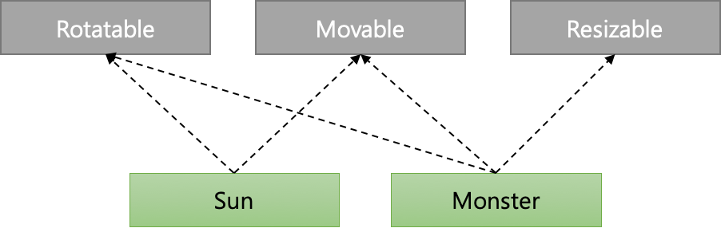
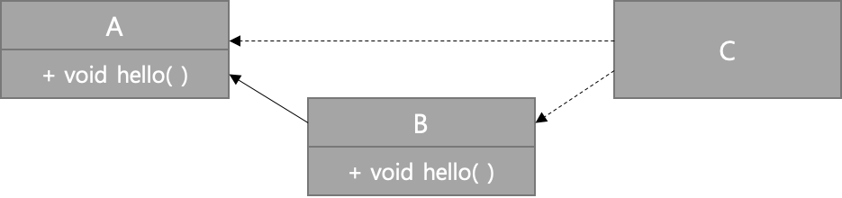
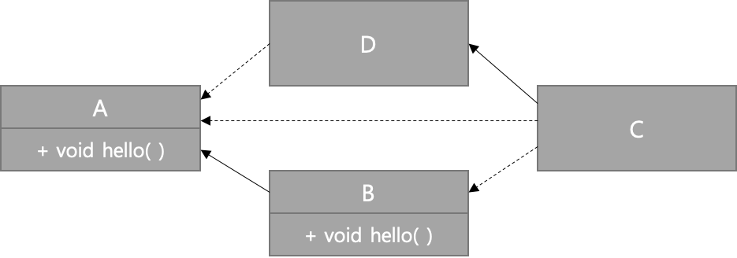
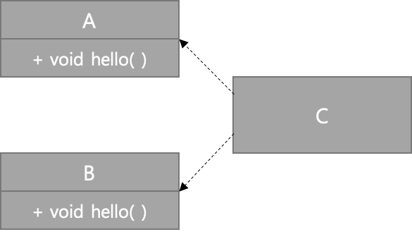
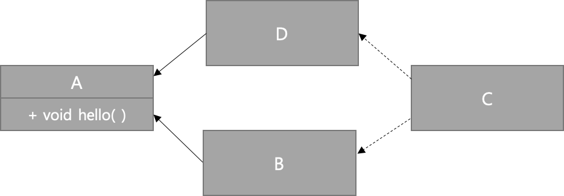

# 디폴트 메서드
- 전통적인 자바에서 인터페이스와 관련 메서드는 한 몸처럼 구성됨
- 평소에는 아무 문제가 없지만 인터페이스에 새로운 메스드를 추가하는 등 수정하게되면 문제가 발생<br>
(해당 인터페이스를 구현했던 모든 클래스의 구현도 함께 고쳐야 하기 때문)

## 변화하는 API
Version 1 API
````
interface CalculatorInterface {
    int plus(int a, int b);
    int minus(int a, int b);
}

class CalculatorClass implements CalculatorInterface {
    @Override
    public int plus(int a, int b) {
        return a + b;
    }

    @Override
    public int minus(int a, int b) {
        return a - b;
    }
}

public class Calculator {
    public static void main(String[] args) {
        CalculatorClass calc = new CalculatorClass();
        System.out.println( "plus : " + calc.plus(2, 1) );
        System.out.println( "minus : " + calc.minus(2, 1) );
}
````

`CalculatorInterface` 라는 더하기, 빼기의 메서드만 선언된 인터페이스에 사용자의 요구로 곱하기와 나누기의 메서드를 추가하게 된다면?<br> 

Version 2 API
````
interface CalculatorInterface {
    int plus(int a, int b);
    int minus(int a, int b);

    // 추가된 부분
    int multi(int a, int b);
    int div(int a, int b);
}

class CalculatorClass implements CalculatorInterface {
    @Override
    public int plus(int a, int b) {
        return a + b;
    }

    @Override
    public int minus(int a, int b) {
        return a - b;
    }

    // 추가된 부분
    @Override
    public int multi(int a, int b) {
        return a * b;
    }

    @Override
    public int div(int a, int b) {
        if(b == 0) {
            return 0;
        }
        return a / b;
    }
}

public class Calculator {
    public static void main(String[] args) {
        CalculatorClass calc = new CalculatorClass();
        System.out.println( "plus : " + calc.plus(2, 1) );
        System.out.println( "minus : " + calc.minus(2, 1) );
        System.out.println( "multi : " + calc.multi(2, 1) );
        System.out.println( "div : " + calc.div(2, 1) );
}
````

`CalculatorInterface` 수정하면 나타나는 문제점
1. `CalculatorInterface` 를 구현하는 모든 클래스에 메서드를 구현해줘야함<br>
(`CalculatorClass` 에 `CalculatorInterface` 추가된 메서드를 구현하지 않아도 *바이너리 호환성*은 유지)
2. *바이너리 호환성*은 유지하지만 빌드시 컴파일 에러 발생

````
바이너리 호환성
: 뭔가를 바꾼 이후에도 에러 없이 기존 바이너리가 실행될 수 있는 상황을 바이너라 호환성이라 한다.

소스 호환성
: 코드를 고쳐도 기존 프로그램을 성공적으로 재컴파일할 수 있음을 의미한다.
  (인터페이스에 메서드를 추가하면 소스 호환성이 아니다. 추가한 메서드를 클래스에서 구현하도록 고쳐야 하기 때문이다.)

동작 호환성
: 코드를 바꾼 다음에도 같은 입력값이 주어지면 프로그램이 같은 동작을 실행한다는 것을 의미한다.
````

[호환성 - 자세한 사항](https://blogs.oracle.com/darcy/kinds-of-compatibility:-source,-binary,-and-behavioral)

위와 같은 이유로 공식 자바 컬렉션 API 같은 기존의 API는 고치기 어려움<br>
API를 별도로 만들어 직접 관리하는 방법도 있지만 여러 가지로 불편함<br>

## 디폴트 메서드란 무엇인가?
- 이 모든 문제를 자바 8 에서 호환성을 유지하면서 API를 바꿀 수 있도록 추가한 '디폴트 메서드' 로 해결 가능함
- 디폴트 메서드는 인터페이스 내부에서 기본 구현을 제공하므로 구현된 클래스를 수정하지 않아도 됨<br>
(새로운 메서드 시그니처를 제공)
- 디폴트 메서드는 default 키워드로 사용

예제 1
````
public interface Sized {
    int size();
    default boolean isEmpty() {
        return size() == 0;
    }
}
````

`Sized` 인터페이스는 size 라는 추상 메서드와 isEmpty 라는 디폴트 메서드를 포함<br>
`Sized` 인터페이스를 구현하는 모든 클래스는 isEmpty 의 구현도 상속 받게됨

Version 2 API(디폴트 메서드로 수정)
````
interface CalculatorInterface {
    int plus(int a, int b);
    int minus(int a, int b);
    
    // 디폴트 메서드는 재정의 가능
    default int multi(int a, int b) {
        return a * b;
    }

    // 정적 메소드는 재정의 불가능
    static int div(int a, int b) {
        if(b == 0) {
            return 0;
        }
        return a / b;
    }
}

class CalculatorClass implements CalculatorInterface {
    @Override
    public int plus(int a, int b) {
        return a + b;
    }

    @Override
    public int minus(int a, int b) {
        return a - b;
    }
}

public class Calculator {
    public static void main(String[] args) {
        CalculatorClass calc = new CalculatorClass();
        System.out.println( "plus : " + calc.plus(2, 1) );
        System.out.println( "minus : " + calc.minus(2, 1) );
        // 참조 변수로 호출 가능
        System.out.println( "multi : " + calc.multi(2, 1) );
        // 인터페이스 명으로 호출 가능
        System.out.println( "div : " + CalculatorInterface.div(2, 1) );
    }
}
````

## 디폴트 메서드 활용 패턴
- 디폴트 메서드를 이용하는 두 가지 방식, '선택형 메서드' 와 '동작 다중 상속'

#### 선택형 메서드
Iterator 인터페이스
````
public interface Iterator<E> {
    boolean hasNext();
    E next();
    default void remove() {
        throw new UnsupportedOperationException("remove");
    }
}
````

`Iterator` 인터페이스는 hasNext 와 next 뿐 아니라 remove 메서드도 정의함<br>
사용자들이 remove 기능을 잘 사용하지 않으므로 `Iterator` 를 구현하는 많은 클래스에서 remove 에 빈 구현을 함<br>
자바 8 에서는 remove 를 디폴트 메서드로 정의해서 선택적으로 사용할 수 있도록 함

#### 동작 다중 상속
자바에서 클래스는 한 개의 다른 클래스만 상속할 수 있지만 인터페이스는 여러 개 구현할 수 있음<br>
a 라는 동작(기능)을 하는 인터페이스 A 와 b 라는 동작(기능)을 하는 인터페이스 B 를 다중으로 조합하여 구현할 수 있음<br>
ArrayList 클래스
````
public class ArrayList<E> extends AbstractList<E>
        implements List<E>, RandomAccess, Cloneable, java.io.Serializable {}
````

`ArrayList` 클래스는 한 개의 클래스를 상속받고, 여섯 개의 인터페이스를 구현함<br>
`ArrayList` 는 AbstractList, List, RandomAccess, Cloneable, Serializable, Collection, Iterable 의 서브형식(subtype) 이 됨<br>

*기능이 중복되지 않는 최소의 인터페이스*<br>
회전을 담당하는 Rotatable 인터페이스
````
public interface Rotatable {
    void setRotationAngle(int angleInDegrees);
    int getRotationAngle();
    default void rotateBy(int angleInDegrees) { 
        setRotationAngle((getRotationAngle() + angleInDegrees) % 360);
    }
}
````

움직임을 담당하는 Movable 인터페이스
````
public interface Movable {
    int getX();
    int getY();
    void setX(int x);
    void setY(int y);

    default void moveHorizontally(int distance) {
        setX(getX() + distance);
    }

    default void moveVertically(int distance) {
        setY(getY() + distance);
    }
}
````

크기를 담당하는 Resizable 인터페이스
````
public interface Resizable {
    int getWidth();
    int getHeight();
    void setWidth(int width);
    void setHeight(int height);
    void setAbsoluteSize(int width, int height);

    default void setRelativeSize(int wFactor, int hFactor) {
        setAbsoluteSize(getWidth() / wFactor, getHeight() / hFactor);
    }
}
````

*인터페이스 조합*<br>
위의 인터페이스를 조합하여 다양한 클래스를 구현할 수 있음<br>
움직일 수 있고(Movable), 회전할 수 있으며(Rotatable), 크기를 조절할 수 있는(Resizable) Monster 클래스
````
public class Monster implements Rotatable, Movable, Resizable {
... 모든 추상 메서드의 구현은 제공해야 하지만 디폴트 메서드의 구현은 제공할 필요가 없다.
}
````
````
Monster m = new Monster();
m.rotateBy(180); // Rotatable 의 rotateBy 디폴트 메서드 호출
m.moveVertically(10); // Movable 의 moveVertically 디폴트 메서드 호출
````

움직일 수 있고(Movable), 회전할 수 있지만(Rotatable), 크기는 조절할 수 없는 Sun 클래스
````
public class Sun implements Movable, Rotatable {
... 모든 추상 메서드의 구현은 제공해야 하지만 디폴트 메서드의 구현은 제공할 필요가 없다.
}
````



디폴트 메서드 덕분에 인터페이스를 직접 고칠 수 있고 따라서 인터페이스를 구현하는 모든 클래스도 자동으로 변경한 코드를 상속 받음(Override 하지 않은 상황에 한해서)

## 해석 규칙
알아야 할 세 가지 해결 규칙
````
1. 클래스가 항상 이긴다.
   클래스나 슈퍼클래스에서 정의한 메서드가 디폴트 메서드보다 우선권을 갖는다.

2. 1번 규칙 이외의 상황에서는 서브인터페이스가 이긴다.
   상속관계를 갖는 인터페이스에서 같은 시그니처를 갖는 메서드를 정의할 때는 서브인터페이스가 이긴다.
   즉, B가 A를 상속받는다면 B가 A를 이긴다.

3. 여전히 디폴트 메서드의 우선순위가 결정되지 않았다면 여러 인터페이스를 상속받는 클래스가 명시적으로 디폴트 메서드를 오버라이드하고 호출해야한다.
````



2번 규칙에 의해서 서브인터페이스가 이김
````
interface A {
    default void hello() {
        System.out.println("hello A");
    }
}

interface B extends A {
    default void hello() {
        System.out.println("hello B");
    }
}

public class C implements B, A {
    public static void main(String[] args) {
        new C().hello();
    }
}
````



1번 규칙에 의하면 클래스 메서드가 이긴다고 설명하지만 D는 hello를 오버라이드 하지 않음<br>
따라서 2번 규칙에 의해서 서브인터페이스가 이김
````
interface A {
    default void hello() {
        System.out.println("hello A");
    }
}

interface B extends A {
    default void hello() {
        System.out.println("hello B");
    }
}

class D implements A {}

public class C extend D implements B, A {
    public static void main(String[] args) {
        new C().hello();
    }
}
````



1번 2번 규칙 모두 적용 불가능<br>
따라서 3번 규칙을 적용해야함 그렇지 않다면 충돌 발생
````
interface A {
    default void hello() {
        System.out.println("hello A");
    }
}

interface B {
    default void hello() {
        System.out.println("hello B");
    }
}

public class C implements B, A {}
````

발생하는 충돌을 해결하기 위해서 3번 규칙에 의해서 hello 메서드를 오버라이드한 다음에 명시적으로 선택해야 함
````
public class C implements B, A {
    @Override
    public void hello() {
        B.super.hello();
    }
}
````



다이아몬드 문제<br>
C클래스는 B와 D를 모두 구현하고 있지만 실제로 선택할 수 있는 메서드 선언은 A의 디폴트 메서드 뿐
````
interface A {
    default void hello() {
        System.out.println("hello A");
    }
}

interface B extends A {}

interface D extends A {}

public class C implements B, D {
    public static void main(String[] args) {
        new C().hello();
    }
}
````

만약 D에서 디폴트 메서드 hello가 아닌 추상 메서드 hello를 선언하게 된다면?
````
interface D extends A {
    void hello();
}

public class C implements B, D {
    @Override
    public void hello() {
        System.out.println("hello C");
    }
    
    public static void main(String[] args) {
        new C().hello();
    }
}
````