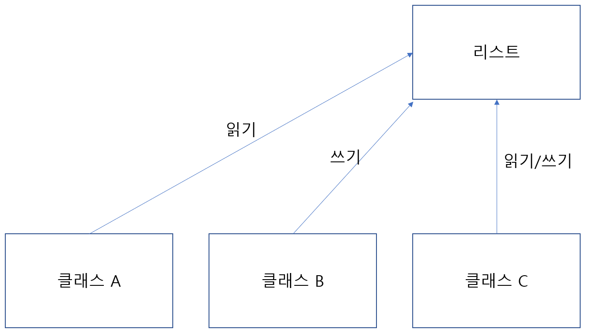
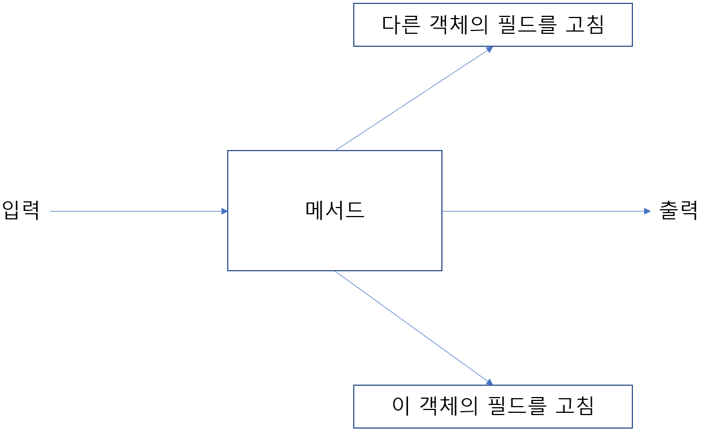
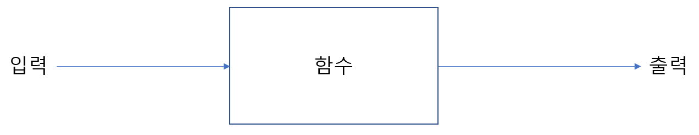
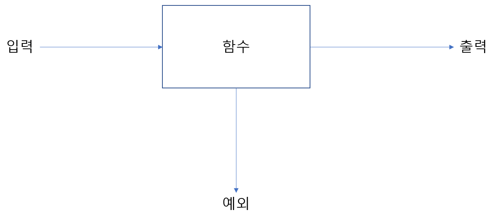

# 함수형 관점으로 생각하기
함수형이란?  
람다, 일급 함수와 관련 있으며 때로는 객체 변화를 제한하는 것이 함수형과 밀접한 관련을 가짐  

## 18.1 시스템 구현과 유지보수
기존의 자바 코드에서 유지보수를 하려는 경우 변수가 변경하는 것을 추적하고 디버깅을 해야하는데 함수형 프로그래밍의 부작용 없음(non side effect)과 불변성(immutability) 이라는 개념을 이용해 이 문제를 해결

### 18.1.1 공유된 가변 데이터
프로그램에서 변수가 예상하지 못하는 값을 가지는 이유는 결국 변수의 값이 프로그램 동작 중 변화하기 때문인데 함수형 프로그래밍에서의 불변성은 이 문제를 해결  


불변성은 자신을 포함하는 클래스의 상태 그리고 다른 객체의 상태를 바꾸지 않고 return문을 통해서만 결과를 반환하는 순수 메서드 또는 부작용 없는 메서드라 함

부작용(함수 내에 포함되지 못한 기능)
- 자료구조를 고치거나 필드에 값을 할당
- 예외 발생
- 파일에 쓰기 등의 I/O 동작 수행

### 18.1.2 선언형 프로그래밍
프로그램을 구현할 때 무엇을에 집중할 지 어떻게에 집중할지에 따라 형식이 많이 바뀌는데
어떻게에 집중하느냐 무엇을에 집중하는냐에 따라 나뉨  

어떻게에 집중하는 프로그래밍 방식
- 작업을 어떻게 수행할 것인지에 집중하는 방법
- 어떻게(how)에 집중하는 프로그래밍 형식으로 객체지향 프로그래밍에서 사용하는 방식
명령형 프로그래밍이라고 하기도 함 

무엇을에 집중하는 프로그래밍 방식
- 원하는 것이 무엇이고 시스템이 어떻게 그 목표를 달성할 것인지에 대한 규칙을 정하는 방식  
코드에 원하는 것이 명확하게 드러남

[선언형 프로그래밍](https://ko.wikipedia.org/wiki/%EC%84%A0%EC%96%B8%ED%98%95_%ED%94%84%EB%A1%9C%EA%B7%B8%EB%9E%98%EB%B0%8D)

### 18.1.3 왜 함수형 프로그래밍인가?
- 선언형 프로그래밍에 기반을 둠
- 부작용 없는 계산을 지향
- 시스템을 좀 더 쉽게 구현하고 유지보수 할 수 있음

## 18.2 함수형 프로그래밍이란 무엇인가?
함수형 프로그래밍은 함수를 이용하는 프로그래밍
함수란 0개 이상의 인수를 가지고 한 개 이상의 결과를 반환하지만 부작용이 없어야 하는 것  
  
위의 예시는 부작용이 발생할 수 있는 함수의 예를 보여준다.
다른 객체의 필드 값을 수정하거나 해당 객체의 필드 값을 수정해 언제나 같은 결과가 나오지 않을 수 있다  
  
18-2의 예제와 달리 위의 예제는 다른 객체에 영향을 미치지 않으며 같은 값이 input으로 들어오는 경우 항상 같은 값이 output되어 나올 것이다

함수형이란 말은 이와 같이 부작용 없는 것을 의미
함수 그리고 if-then-else 등의 수학적 표현만 사용 하는 방식을 순수 함수형 프로그래밍  
시스템의 다른 부분에 영향을 미치지 않는다면 내부적으로는 함수형이 아닌 기능도 사용하는 방식을 함수형 프로그래밍이라 함

### 18.2.1 함수형 자바
자바에서 함수형 프로그래밍을 사용하려면 어떻게 해야할까
자바에서는 완벽한 순수 함수형 프로그래밍을 구현하기 어려움
(Scanner.nextLine를 호출하면 파일의 행을 소비하게 되어 순수 함수형을 구현할 수 없음)
자바 I/O 모델 자체에는 부작용 메서드가 포함되어 있어 순수 함수형 프로그래밍이 아닌 함수형 프로그래밍 형식으로 구현

함수형을 구현하기 위해서 함수나 메서드는 지역 변수만을 변경해야 함  
다른 객체의 값이나 객체가 가지는 값을 변경하는 경우에는 불변객체가 아니게 되고 다른 결과 값이 나올 수 있어 함수형이라 할 수 없음

또한 함수나 메서드가 어떤 예외도 일으키지 않아야 한다.
예외가 발생하게 되면 블랙박스 모델에서 return으로 결과를 반환할 수 없게 되는 경우도 있을 수 있기 때문  
  
위의 그림과 같이 함수에서 입출력이 아닌 다른 제어 흐름이 추가되는 경우 블랙박스의 모델이 깨지게 되고 이런 경우 함수형 프로그래밍이 아니게 되어 버린다

그렇다면 예외가 발생하는 경우에는 어떻게 처리를 해야할까  
Optional\<T>를 이용하여 처리할 수 있는데 
```java
//double sqrt(double)를 대신하여 아래와 같이 사용
Optional<Double> sqrt(double)
```
위와 같이 Optional을 사용하는 경우 함수의 예외 없이 결과값로 연산이 성공했는지 성공하지 못했는지를 파악할 수 있는데 이 경우 반환값이 빈 값인지를 확인하는 과정이 필요

### 18.2.2 참조 투명성
[참조 투명성](https://ko.wikipedia.org/wiki/%EC%B0%B8%EC%A1%B0_%ED%88%AC%EB%AA%85%EC%84%B1)

같은 함수를 호출했을때 항상 같을 결과를 반환해야 것

참조 투명성으로 얻을 수 있는 효과는 부작용을 없애는 것도 있지만 오랜 시간이 걸리는 연산에 대 해 캐싱 기능을 제공해 다시 계산하지 않고 저장하는 최적화 기능도 제공
