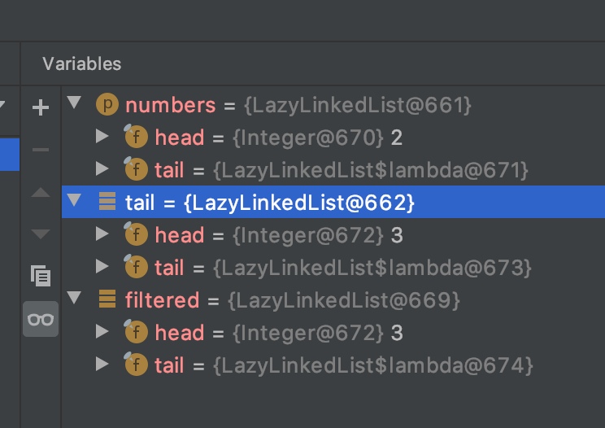
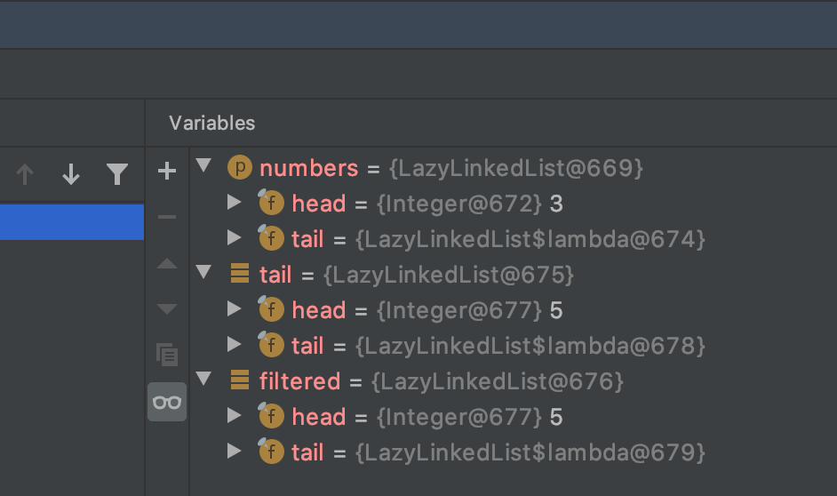
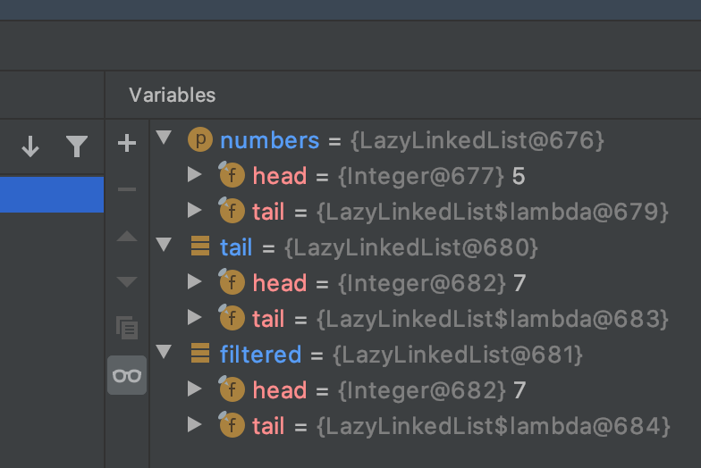
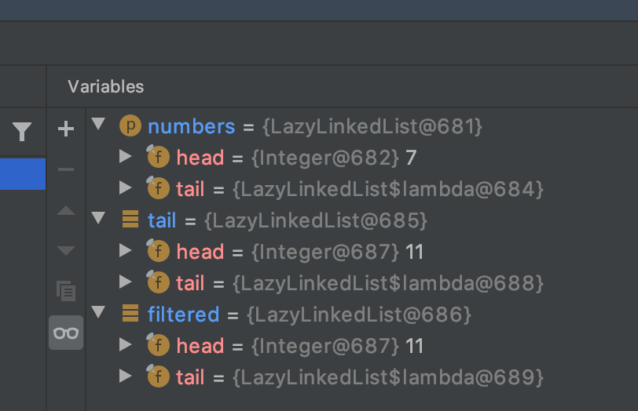
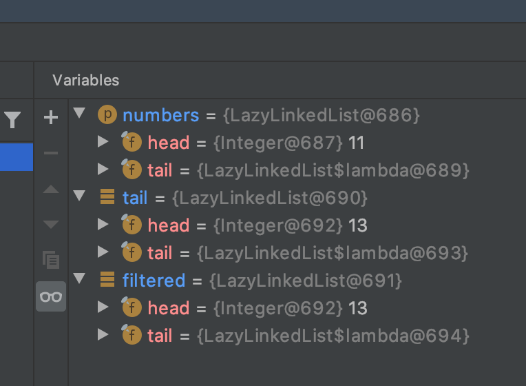
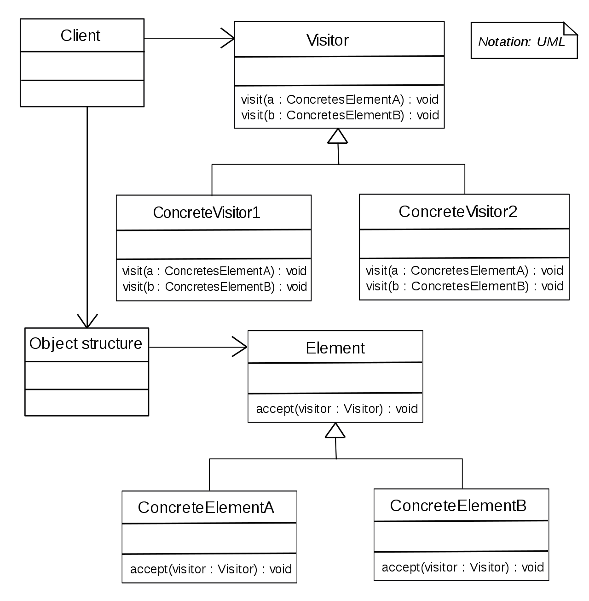

# 함수형 프로그래밍 기법 

## 함수형 프로그래밍 이란
함수나 메서드가 수학의 함수처럼 동작하는 것
함수를 일반 값처럼 사용가능하며, 인수로 전달하거나 반환 가능하고 자료구조에 저장가능 
 
## 일급 함수 (first-class function)
[위키피디아](https://en.wikipedia.org/wiki/First-class_function) 에 따르면,  
함수를 일반 값 처럼 사용가능한 함수로써 인수로 전달하거나 결과 값으로써 반환 가능하며 데이터 구조에 저장될 수 있는 함수   
일반 변수에 함수를 담아서 사용할 수 있음 (익명함수)   
일급 함수는 함수형 프로그래밍 스타일에서 필수요소로써 고차함수를 사용하는 것이 관행   
자바8 에서는 람다나 메소드 참조를 이용해서 일급 함수를 생성할 수 있음  

```java
Function<String, Integer> strToInt = Integer::parseInt
```

## 고차함수 (Higher-order function)
고차함수는 함수를 인자로 받거나 또는 함수를 반환함으로써 동작하는 함수를 말함  
  
일반적으로 정렬에 사용하는 Comparator.comparing()
```java
// Function 이라는 함수형 인터페이스를 인자로 갖는다 
public static <T, U> Comparator<T> comparing(
            Function<? super T, ? extends U> keyExtractor,
            Comparator<? super U> keyComparator){
    // ... 
}
```
comparing 함수는 java 에서 함수와 매칭되는 함수형 인터페이스 (Function, Comparator) 를 받아 Comparator 를 반환 
 
### 부작용(side effects)과 고차원 함수
[위키](https://en.wikipedia.org/wiki/Side_effect_(computer_science))
side effects 는 함수 외부에서 감지할 수 있는 프로그램의 상태 변경이라고 함 

> 
개인적으로 실무에서는 side effects 라고 불리는 것들은 어떤 코드를 수정했을때, 의도하지 않은 것들에 영향을 미쳐서 문제가 발생하는 것을 말함 
실무에서 얘기하는 것은 side effects 의 결과에 중점을 두고 얘기하는것 같음  
   

7장 스트림에 전달하는 함수는 side effects 가 없어야 하고 side effects 가 있는 함수를 사용하면 문제가 발생한다는것도 설명했음    
(멀티 스레드 환경에서 부정확한 결과를 초래하거나 레이스 컨디션이 발생할 수 있음)  
고차원 함수에서도 **인수로 전달되는 함수가 부작용을 포함할 가능성**을 염두에 두고 개발해야함   
    
## 커링
커링은 x,y 라는 두 인자를 받은 함수 f 를 한개의 인수를 받는 g 라는 함수로 대체하는 기법     
결국 함수의 인자를 줄여서 함수 시그니쳐도 일반화 하는것  
  
섭씨를 화씨로 바꾸는 예제
- 공식 
```
CtoF(x) = x * 9 / 5 + 32
```   
여기서 9/5 를 f(conversion factor) 변환 요소, 32 를 b(baseline adjustment factor) 기준치 조정 요소 로 추상화 해보자   
  
- 순수한 구현 
```java
static double converter(double x, double f, double b){
    return x * f + b;
}
```
  
- 커링을 적용해보자 
```java
static DoubleUnaryOperator curriedConverter(double f, double b){
    return (double x) -> x * f + b;
}
public static void main(String[] args) {
   
    DoubleUnaryOperator converterCtoF = curriedConverter(0.9/5, 32);
    DoubleUnaryOperator converterUSDtoGBP = curriedConverter(0.6, 0);
    DoubleUnaryOperator converterKmtoMi = curriedConverter(0.6214, 0);

    converterCtoF.onverterCtoF(32.5);
    converterCtoF.converterCtoF(45.5);
}
```
이렇게 자주 호출될 것들을 초기화 하여 필요할 때에민 호출해서 사용할 수 있음   
  
## 영속 자료구조
함수형 프로그래밍에서 사용하는 자료구조를 함수형 자료구조, 불변 자료구조 라고 하기도 하지만 일반적으로 **영속 자료구조** 라고 부름    
- 여기서 말하는 영속은 DB 에서 사용하는 프로그램이 종료되어도 데이터가 유지된다는 영속(persistent) 과는 의미가 다름  
함수형에서 영속성 자료구조는 저장된 값이 다른 누군가에게 의해 영향을 받지 않는 상태를 말함 (p595)  

### 파괴적인 갱신과 함수형 
A 지역에서 B 지역까지 기차여행을 의미하는 가변 TrainJourney 클래스가 있다고 가정하자  
TrainJourney 는 단방향 연결 리스트로 구현되어 다음 지역 정보를 나타낸다  

```java
public class TrainJourney {
    public int price;                
    public TrainJourney onward;
    
    public TrainJourney(int price, TrainJourney onward){
        this.price = price;
        this.onward = onward;
    }
}
```

1. 먼저 X -> Y 를 표현하는 firstTrainJourney 와 Y -> Z secondTrainJourney 가 있다고 가정해보자   
2. 그리고 X -> Y -> Z 순으로 기차여행을 표현하려고 한다    
3. 그렇다면 X -> Y 를 표현하는 first 와 Y -> Z 를 표현하는 second 를 연결하여 X -> Y -> Z 를 나타내는 TrainJourney 를 만들어보자    
   
```java
/** start 부터 시작해서 마지막에 end 를 추가 */
static TrainJourney link(TrainJourney start, TrainJourney end){
    if(start == null)
        return end;
    TrainJourney current = start;
    while(current.onward != null){
        current = current.onward;
    }
    current.onward = end;

    return start;
}
static void linkTest(){
    // X -> Y
    TrainJourney firstTrainJourney = new TrainJourney(10, new TrainJourney(20, null));

    // Y -> Z
    TrainJourney secondTrainJourney = new TrainJourney(20, new TrainJourney(30, null));

    TrainJourney result = link(firstTrainJourney, secondTrainJourney);

    printTrainJourney(result);
    printTrainJourney(firstTrainJourney);
}
static void printTrainJourney(TrainJourney start){
    TrainJourney copyStart = start;
    while(copyStart != null){
        System.out.print(copyStart.price + " -> ");
        copyStart = copyStart.onward;
    }
    System.out.println("\n");
}
``` 
- link 라는 메소드에서 2개의 TrainJourney 를 이용하여 연결하는 작업을 구현해보았다   
ㄴ 실제로 출력해보면 10, 20, 20, 30 (X -> Y -> Y -> Z) 가 출력됨   
ㄴ 이게 원하는게 맞는지 의문이 들긴 함 .. 
  
- 어쨋든 책에서 얘기하는 것은 link 라는 메소드는 firstTrainJourney 의 정보를 바꾼다는 점이다  
- firstTrainJourney 는 X -> Y 를 표현하고 있었는데, link 메소드를 호출한 뒤에는 X -> Y -> Y -> Z 를 표현하게 됨  
ㄴ 이런 문제는 기존에 firstTrainJourney 참조하고 있던 다른 객체들에게 영향을 주게됨 (side effects)  
- 따라서 기존 자료구조를 갱신하지 않고 새로운 자료구조를 생성하도록 변경이 필요함  
ㄴ 이는 객체지향 프로그래밍 관점에서도 좋은 기법  
  
새로운 자료구조를 생성하는 메소드 구현   
```java
/** start, end 를 매번 객체를 생성하면서 연결 */
static TrainJourney append(TrainJourney start, TrainJourney end){
    if (start == null){
        return end;
    }else{
        return new TrainJourney(start.price, append(start.onward, end));
    }
}
static void appendTest(){
    // X -> Y
    TrainJourney firstTrainJourney = new TrainJourney(10, new TrainJourney(20, null));

    // Y -> Z
    TrainJourney secondTrainJourney = new TrainJourney(20, new TrainJourney(30, null));

    TrainJourney result = append(firstTrainJourney, secondTrainJourney);

    printTrainJourney(result);
    printTrainJourney(firstTrainJourney);
}
```
- append 메소드는 매번 객체를 생성하면서 재귀적으로 TrainJourney 를 연결한다 
- 기존에 있었던 firstTrainJourney 정보가 변하지 않음 
- 대신, 단일 연결리스트를 아예 새로 생성하는 것이기 때문에 객체를 생성하는 비용이 좀 더 든다 
- 단일 연결리스트 전체를 새로 생성하는 것이 아니라 firstTrainJourney 의 onward 가 secondTrainJourney 를 가리키는 새로운 단일 연결리스트를 생성한다   
ㄴ firstTrainJourney 부분만 새로 생성했기 때문에 firstTrainJourney 의 price 가 변경되어도 result 의 price 는 변경되지 않음 
  
  
이진 탐색 트리를 이용한 다른 예제 
- 이진 탐색 트리 
```java
public class Tree {
    private String key;
    private int val;
    private Tree left, right;

    public Tree(String key, int val, Tree left, Tree right){
        this.key = key;
        this.val = val;
        this.left = left;
        this.right = right;
    }
    
    public String getKey(){
        return key;
    }

    public void setVal(int val){
        this.val = val;
    }
    public int getVal(){
        return val;
    }
    public Tree getLeft(){
        return left;
    }
    public void setLeft(Tree left){
        this.left = left;
    }
    public Tree getRight(){
        return right;
    }
    public void setRight(Tree right){
        this.right = right;
    }
}
```

- 이진 탐색 트리 연산 
```java
public class TreeProcessor {
    /** 2진 탐색 트리 검색 */
    public static int lookup(String key, int defaultValue, Tree tree){
        if(tree == null){
            return defaultValue;
        }
        if(key.equals(tree.getKey())){
            return tree.getVal();
        }
        return lookup(key, defaultValue, key.compareTo(tree.getKey()) < 0 ? tree.getLeft() : tree.getRight());
    }
    
    /** 2진 탐색 트리 수정
     * - 찾으려는 key 가 이진 탐색 트리에 있다고 가정  
     */
    public static Tree update(String key, int newValue, Tree tree){
        if(tree == null){
            tree = new Tree(key, newValue, null, null);
        }else if(key.equals(tree.getKey())){
            tree.setVal(newValue);
        }else if(key.compareTo(tree.getKey()) < 0){
            tree.setLeft(update(key, newValue, tree.getLeft()));   
        }else{
            tree.setRight(update(key, newValue, tree.getRight()));
        }
        return tree;
    }
}
```
- update 메소드는 기존 Tree 를 변경하는 방법이다 
  
이제 함수형으로 접근해보자   
새로운 노드를 생성하면 루트에서 해당 노드까지의 경로를 새로 생성할 것이다  
```java
    /** 함수형을 적용한 update 
     * - root 에서 업데이트 하려는 node 까지만 새로 생성한다 
     */
    public static Tree functionalUpdate(String key, int newValue, Tree tree){
        if(tree == null){
            return new Tree(key, newValue, null, null);
        }else if(key.equals(tree.getKey())){
            return new Tree(key, newValue, tree.getLeft(), tree.getRight());
        }else if(key.compareTo(tree.getKey()) < 0){
            return new Tree(tree.getKey(), tree.getVal(), functionalUpdate(key, newValue, tree.getLeft()), tree.getRight());
        }else{
            return new Tree(tree.getKey(), tree.getVal(), tree.getLeft(), functionalUpdate(key, newValue, tree.getRight()));
        }
    }
```
ㄴ 책에서는 3항 연산자를 쓰지만 그지 같아서 풀었다 
- functionalUpdate 는 함수형 프로그래밍에 패러다임에 맞도록 매번 객체를 새로 생성한다 
- 모든 트리를 새로 생성하는 것이 아니라 root 노드 부터 업데이트 하려는 노드까지만 새로운 Tree 객체를 생성하고 나머지는 기존에 사용하던 Tree 노드들의 래퍼런스만 연결함 
ㄴ 대충 예상은 하겠지만 예제를 통해서 비교해보자 


```shell script
              Marry
    Emily             Tian
Alan    Georgie           Raoul
```
- 이런 트리에서 Emily 를 찾아 업데이트 해보기 

```java
private static void updateTest(){
    Tree tree = buildTreeByBook();

    Tree newTree = TreeProcessor.update("Emily", 50, tree);

    System.out.println(TreeProcessor.lookup("Emily", 0, tree));
    System.out.println(TreeProcessor.lookup("Emily", 0, newTree));
}

private static void functionalUpdateTest(){
    Tree tree = buildTreeByBook();

    Tree newTree = TreeProcessor.functionalUpdate("Emily", 50, tree);

    System.out.println(TreeProcessor.lookup("Emily", 0, tree));
    System.out.println(TreeProcessor.lookup("Emily", 0, newTree));
}
```
- update 의 결과는 tree, newTree 모두 50이 출력됨
- functionalUpdate 의 결과는 tree 는 20, newTree 는 50이 출력 
- functionalUpdate 는 기존 구조를 변화시키지 않기 때문에 A 사용자의 트리와 B 사용자의 갱신된 트리는 공유 데이터는 공유하고 서로에게 영향을 주지 않을 수 있음  
ㄴ 하지만, 알다시피 객체를 복사해서 사용하기 때문에 A와 B가 같은 값을 수정했다면, A 가 바라보는 트리와 B 가 바라보튼 트리 간의 데이터의 차이가 발생함   

## 스트림과 게으른 평가

자바의 스트림은 1번만 소비할 수 있기 때문에 재귀적으로 사용될 수 없다    
그렇기 때문에 생길 수 있는 문제를 **소수 구하기** 예제로 살펴본다  
  
먼저 소수구하기
1. 소수를 선택할 숫자 스트림 선언
2. 스트림에서 첫 번째수(스트림의 머리)를 가져옴 (이 숫자는 소수)
3. 이제 스트림의 마지막 수(꼬리)로 나누어 떨어지는 모든수를 제외 
4. 이렇게 남은 숫자만 포함하는 새로운 스트림에서 소수를 찾음 
5. 1-4 의 과정을 반복한다 (따라서 이 알고리즘은 재귀)  
ㄴ 이 알고리즘은 단순히 스트림이 어떻게 동작하는지 보여주기 위해서 사용하는 것  

```java
static IntStream primes(IntStream numbers){
    int head = numbers.findFirst().getAsInt();
    IntStream tail = numbers.skip(1);

    return IntStream.concat(
            IntStream.of(head),
            primes(tail.filter(n -> n % head != 0))
    );
}

static void primesTest(){
    // 무한 스트림 생성
    IntStream numbers = IntStream.iterate(2, n -> n+1);

    IntStream primes = primes(numbers);
}
```
- 위 코드를 실행하면 "stream has already been operated upon or closed" 라는 에러가 발생하는 데, 이는 스트림은 1번 사용하면 재사용할 수 없기 때문이다 
ㄴ 우리는 head 와 tail 을 구하기 위해서 findFirst 와 skip 을 이용했는데, findFirst 가 최종 연산이기 때문에 해당 스트림은 재사용 할 수 없다  

### 게으른 평가
스트림은 재귀적 정의를 허용하지 않으며 그 덕분에 데이터베이스 같은 질의를 표현하고 병렬화 할 수 있는 능력을 갖게 되었음    
ㄴ 스칼라, 하스켈 같은 함수형 언어에서는 자바보다 좀 더 일반적인 기능과 모델을 제공함  
게으른 평가(lazy evaluation) 을 비엄격한 평가(nonstrict evaluation) 또는 이름에 의한 호출(call by name) 이라고 부르기도 함
자바의 스트림은 게으른 평가를 수행하여 요청 할 때 (최종연산)만 값을 생성하는 블랙박스이다    

위 예제에서도 prime 에 게이른 평가를 적용하여 소수를 처리할 필요가 있을 때만 스트림을 실제로 평가하도록 할 수 있다
ㄴ 스칼라이에서도 이와 같은 기능을 제공함 
```scala
def numbers(n: Int): Stream[Int] = n #:: numbers(n+1)

def primes(numbers: Stream[Int]): Stream[Int] = {
    numbers.head #:: primes(numbers.tail filter ( n -> n $ numbers.head != 0 )
}
``` 

### 게으른 리스트 만들기 
스트림과 유사한 게으른 리스트를 만들어서 스트림의 개녕에 대해서 이해해보자  
게으른 리스트를 구현하면서 고차원 함수 개념도 함께 구현할 것이다  

- 인터페이스  
```java
public interface LazyList<T> {
    T head();

    LazyList<T> tail();

    default boolean isEmpty(){
        return true;
    }
}
```

- 연결리스트 
```java
public class LazyLinkedList<T> implements LazyList<T> {
    private final T head;
    private final Supplier<LazyLinkedList<T>> tail;

    public LazyLinkedList(T head, Supplier<LazyLinkedList<T>> tail) {
        this.head = head;
        this.tail = tail;
    }

    @Override
    public T head() {
        return head;
    }

    @Override
    public LazyLinkedList<T> tail() {
        return tail.get();
    }

    public boolean isEmpty(){
        return false;
    }

    /** 소수 구하기에서 사용할 filter 메소드 */
    public LazyLinkedList<T> filter(Predicate<T> predicate){
        if(isEmpty()){
            return this;
        }else if(predicate.test(this.head())){
            return new LazyLinkedList<T>(head(), () -> tail().filter(predicate));
        }else{
            return tail().filter(predicate);
        }
    }

    public static LazyLinkedList<Integer> from(int n){
        return new LazyLinkedList<Integer>(n, () -> from(n+1));
    }

    public static <T> void printAll(LazyList<T> lazyList){
        while(!lazyList.isEmpty()){
            System.out.println(lazyList.head());
            lazyList = lazyList.tail();
        }
    }
    
    public static <T> void printAllRecursive(LazyList<T> lazyList){
        if(lazyList.isEmpty()){
            return;
        }
        System.out.println(lazyList.head());
        printAllRecursive(lazyList.tail());
    }
}
```

- tail 을 Supplier 을 적용해서 n 으로 시작하는 무한히 게으른 리스트를 생성할 수 있음 
```java
static void lazyListTest(){
    LazyList<Integer> numbers = LazyLinkedList.from(2);
    int two = numbers.head();
    int three = numbers.tail().head();
    int four = numbers.tail().tail().head();

    System.out.println(two + ", " + three + ", " + four);
}
```

- from() 메소드는 n 부터 시작하는 스트림을 생성해준다 
- printAll 메소드는 lazyList 가 empty 가 아닌동안 계속 출력을 한다
ㄴ isEmpty 가 true 이기 때문에 무한루프 
    
다시 소수 구하기로 돌아와서 소수를 구해보자
```java
static LazyLinkedList<Integer> lazyPrimes(LazyLinkedList<Integer> numbers){
    return new LazyLinkedList<Integer>(
            numbers.head(),
            ()->lazyPrimes(numbers.tail().filter(n -> n % numbers.head() != 0))
    );
}
// 책에 나온 구현을 디버깅을 위해 펼쳤다 
static LazyLinkedList<Integer> lazyPrimes(LazyLinkedList<Integer> numbers){
    return new LazyLinkedList<Integer>(
            numbers.head(),
            () -> {
                LazyLinkedList<Integer> tail = numbers.tail();
                LazyLinkedList<Integer> filtered = tail.filter(n -> n % numbers.head() != 0);
                return lazyPrimes(filtered);
            }
    );
}
``` 
- 기존 소수구하기에서 바꿘것은 스트림이 아닌 게으른 리스트를 적용한것이다 
- head 를 추출하기 위해서 종단 연산을 사용하지도 않았고 tail 을 추출 하는 시점에만 스트림이 소비됨으로 에러가 발생하지 않는다  

```java
static void lazyPrimesTest(){
    LazyLinkedList.printAll(Prime.lazyPrimes(LazyLinkedList.from(2)));
}
```
- 실제로 테스트를 돌려보면 소수가 무한히 찍히는 것을 확인할 수 있다 

### 게으른 스트림, 리스트의 장단점 
자료구조의 10퍼센트 미만의 데이터만 활용되는 경우에는 게으른 실행이 일반 구현보다 성능이 떨어진다  
ㄴ 게으른 실행을 수행하기 위한 오버헤드가 더 크기 때문  
위에서 구현한 소수 구하기 경우에 LazyLinkedList 값을 탐색하면서 10번째 항목까지는 모든 노드를 2번씩 생성하게 된다
  
디버깅을 통해서 살펴보자   
- from(2) 를 통해서 2로 시작하는 연결리스트 생성 
- numbers 는 head 가 2, tail 3  
  
- numbers 는 head 가 3, tail 5  
   
   
   
  
ㄴ 값을 탐색하기 위해서 Supplier 가 반복 호출되기 때문에 발생하는 현상인데 이러한 문제점을 결과를 캐시 하도록 해서 해결할 수 있음  
ㄴ private Optional<LazyLinkedList<T>> alreadyComputed 필드를 추가해서 tail 메서드가 적절하게 리스트를 업데이트 하도록 할 수 있다  
ㄴ 실제로 하스켈 같은 언어에서는 자신의 자료구조를 적당히 정리한다  
ㄴ 만약, 게으른 자료구조로 인해서 성능이 떨어진다면 기존처럼 작성하고, 게으른 자료구조가 어플리케이션에 도움이된다면 게으른 자료구조를 적용하자   
 
  
## 패턴 매칭  
패턴 매칭은 if-then-else, switch 문을 줄일수 있는 방법이다.  
숫자와 바이너리 연산자로 구성된 수학언어가 있다고 가정해보자  
```java
public class Expr {}
public class Number extends Expr{ int val; }
public class BinOp extends Expr {
    String opname;
    Expr left;
    Expr right;
}
```
표현식을 단순화하고 싶다고 가정하자. 예를 들어 5 + 0 은 5 로 표현할 수 있기 때문에 Number(5) + Number(0) 은 Number(5) 로 단순화 할 수 있다  
단순화 하는 코드를 만나보자  
```java
public static Expr simplifyExpr(Expr expr){
    if(expr instanceof BinOp && ((BinOp) expr).opname.equals("+")
        && ((BinOp) expr).right instanceof Number
        && ((BinOp) expr).left instanceof Number){
        if ( ((Number) ((BinOp) expr).right).val == 0){
            return ((BinOp) expr).left;
        }
        //..
    }
    //...
    
    return null;
}
```
더럽게 복잡하다 ...   

### 방문자 디자인 패턴
[위키](https://en.wikipedia.org/wiki/Visitor_pattern) 에 따르면, 방문자 패턴은 실제 로직을 갖고 있는 객체(Visitor)가 로직을 적용할 객체(Element) 를 방문하면서 실행하는 패턴  
즉, 로직과 구조를 분리하는 패턴으로 로직과 구조를 분리함으로써 구조를 수정하지 않고도 새로운 동작을 기존 객체 구조에 추가할 수 있음   
이는 Open-Closed Principle 을 따르는 한가지 방법임  
  
**클래스 다이어그램**  
  
- Visitor : 실제 ConcreteElement 들에 대한 처리에 대해 기술
    * 실제 로직이 포함되어 있지는 않음 
    * 필요한 메소드를 단순히 나열하는 것 
- ConcreteVisitor: Visitor 의 구현으로 각 ConcreteElement 에 대한 처리 로직을 구현 
    * 알고리즘이 운영될 수 있는 상황정보를 제공하며 자체 상태를 저장 
    * 구조를 순회하면서 누적되는 경우가 많음 
- Element(Node): 방문자를 인자로 받아들이는 accept(visitor) 정의 
- ConcreteElement: accept 에 대해 구현을 갖고 객체의 연산 노드를 담당 
- ObjectStructure: 객체 구조 내의 원소들을 나열할 수 있음 
    * List, Set 과 같은 컬랙션일 수도 있음    
 
방문자 패턴을 적용하여 조금 더 단순화 해보자 
```java
class BinOp extends Expr {
    // ...
    
    public Expr accept(SimplifyVisitor visitor){
        return visitor.visit(this);
    }
}
public class SimplifyVisitor {

    public Expr visit(BinOp binOp){
        if("+".equals(binOp.opname) && binOp.right instanceof Number && ((Number) binOp.right).val == 0){
            return binOp.left;
        }
        //..
        return null;
    }
}
```
- 방문자 패턴을 간소화해서 추가했다
- 아까보다 조금 더 나아진거 같지만, 사실 크게 장점은 없어 보인다 
 
### 패턴 매칭 적용해보기 
자바는 패턴 매칭을 지원하지 않으므로 스칼라의 예제를 보자   
```scala
def simplifyExpr(expr: Expr) : Expr = expr match {
    case BinOp("+", e, Number(0)) => e
    case BinOp("*", e, Number(1)) => e
    case BinOp("/", e, Number(1)) => e
    case _ => expr
}
```   
스칼라에서는 수식을 분해하는 코드를 쉽게 작성할 수 있다  

>  
스칼라와 자바의 구문론적인 가장 큰 차이는 **스칼라는 표현지향**인 반면 **자바는 구문지향** 이라는 점이다  
스칼라와 같은 패턴매칭을 지원하는 언어들은 switch 문이나 if-then-else 문을 피하면서 작성할 수 있다   
반면, 자바에서는 switch 문이 기본형, 열거형 등에 제약이 있다는 단점이 있다  
  
자바 람다를 이용해서 패턴매칭을 흉내내보자   
```java
public class PatternMatchSimplify {
    static <T> T patternMatchExpr(Expr e, TriFunction<String, Expr, Expr, T> binopcase, Function<Integer, T> numcase, Supplier<T> defaultcase){
        return (e instanceof BinOp) ?
                binopcase.apply(((BinOp) e).opname, ((BinOp) e).left, ((BinOp) e).right) :
                (e instanceof Number) ?
                        numcase.apply(((Number) e).val) : defaultcase.get();
    }

    public static Expr simplify(Expr expr){
        TriFunction<String, Expr, Expr, Expr> binopcase = (opname, left, right) -> {
            if ("+".equals(opname)){
                if(left instanceof Number && ((Number) left).val == 0){
                    return right;
                }
                if(right instanceof Number && ((Number) right).val == 0){
                    return left;
                }
            }
            if("*".equals(opname)){
                if(left instanceof Number && ((Number) left).val == 1){
                    return right;
                }
                if(right instanceof Number && ((Number) right).val == 1){
                    return left;
                }
            }

            return new BinOp(opname, left, right);
        };

        // 숫자 처리
        Function<Integer, Expr> numcase = val -> new Number(val);
        Supplier<Expr> defaultcase = () -> new Number(0);

        return patternMatchExpr(expr, binopcase, numcase, defaultcase);
    }
}
```
- patternMatchExpr 을 이용해서 Expr 이 BinOp 이면 binopcase 를 적용하고 Number 이면 numcase 를 적용하도록 구현했다 
    * BinOp, Number 가 아닌 경우에는 defaultcase 가 적용된다 
- simplify 를 이용해서 덧셈과 곱셈에 대한 패턴매칭을 구현해봤다 
    * 확실히 스칼라보다 코드가 복잡해보인다 

## 캐싱 or 기억화(memorization)
네트워크 (그래프, 트리) 내에 존재하는 모든 노드의 수를 계산하는 computeNumberOfNodes(Range) 라는 부작용이 없는 메소드가 있다고 가정하자  
부작용이 없는 해당 메소드를 호출하면 재귀적으로 탐색해야 하기 때문에 계산비용이 비싸다는 문제가 있다  
게다가 이와 같은 계산이 반복적으로 이뤄질 가능성이 높고 **참조 투명성** 유지되는 상황이라면 기억화(memorization) 이라는 표준 해결책이 존재한다  
이 방법은 캐시(Map)를 추가하는 방법이다.  
1. 재귀함수가 호출될 때 마다 매번 캐시를 검사하고  
2. 이미 값이 존재하면 캐시의 값을 반환  
3. 값이 존재하지 않으면 계산 후에 캐시에 저장후 반환   
이는 여러 사용자가 하나의 캐시를 사용하는 기법으로 순수한 함수형 프로그래밍 기법은 아니지만 해당 코드를 감싼 형태로 참조 투명성을 유지시킬수 있다   

```java
final Map<Range, Integer> cache = new HashMap<>();
Integer computeNumberOfUsingCache(Range range){
    return cache.computeIfAbsent(range, this::computeNumberOfNodes);
}
```
computeNumberOfUsingCache 메소드는 computeNumberOfNodes 가 참조 투명성이 있다는 가정하에 참조 투명성을 갖는다고 할 수 있음   
하지만 HashMap 을 사용했기 때문에 스레드에 안전하지 않은 코드다  
따라서 이런 문제를 해결하기 위해서 함수형 프로그래밍을 이용하여 **동시성** 과 **가변 상태** 가 만나는 상황을 완전히 없애는 것이다.

> 
우선 메모제이션은 알고리즘에서 자주 사용하는 테크닉으로써 대표적으로 Dynamic Programing 메모제이션을 이용한 기법이다.  
메모제이션은 위에서 살펴본 것처럼 미리 수행한 연산을 담아놓는 캐시의 역할을 수행한다고 볼 수 있다.  
  

### 참조 투명성의 의미 
참조 투명성이란 "인수가 같다면 결과도 항상 같아야 한다" 라는 규칙을 만족하는 것을 말한다  
위에서 했던 Tree 의 functionalUpdate 를 다시 떠올려보자   
functionalUpdate 메소드는 호출하면 항상 새로운 객체를 생성해서 반환한다 (root 부터 특정 업데이트 하려는 노드까지)  
그렇다면 functionalUpdate 는 호출될 때마다 항상 같은 값을 반환한다고 볼 수 있을까 ?  
실제 래퍼런스는 같지 않지만 논리적으로 같다고 볼 수 있기 때문에 참조 투명성을 지켰다고 볼 수 있다  
- identity 와 equality 에 대해서 얘기하고 싶은거 같다 

## 콤비네이터 (combinator)
함수형 프로그래밍에서는 두 합수를 인자로 받아서 다른 함수를 반환하는 등의 함수를 조합하는 **고차원 함수** 를 많이 사용하게 됨  
이처럼 함수를 조합하는 기능을 **콤비네이터** 라고 부른다  
ex) CompletableFuture 에서 thenCombine 이라는 메서드는 CompletionStage, BiFunction 2개를 인자로 받아서 새로운 ComputableFuture 를 생성한다 
```java
public class CompletableFuture<T> implements Future<T>, CompletionStage<T> {
    //...
    public <U,V> CompletableFuture<V> thenCombine(
        CompletionStage<? extends U> other,
        BiFunction<? super T,? super U,? extends V> fn) {
        return biApplyStage(null, other, fn);
    }
}
```
콤비네이터를 자세히 살펴보는 것은 이 책에서는 무리일 것 같다 
ㄴ 맨날 이런식이네 ...
  
이번에는 함수의 조합의 예제
```java
static <A, B, C> Function<A, C> compose(Function<B, C> g, Function<A, B> f){
    return x -> g.apply(f.apply(x));
}
```
- g(f(x)) 의 예제를 보여주고 싶은가 보다 

```java
static <A> Function<A, A> repeat(int n, Function<A, A> f){
    return n == 0 ? x -> x : compose(f, repeat(n-1, f));
}
```
- 이번에는 반복을 수행하는 함수를 이용해서 내부반복을 구현했다 
 