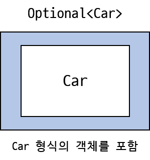

- 자바 8은 하스켈과 스칼라의 영향을 받아서 ```java.util.Optional<T>```라는 새로운 클래스를 제공
- Optional은 선택형값을 캡슐화하는 클래스다.



- 값이 있으면 Optional 클래스는 값을 감싼다.
- 값이 없으면 Optional.empty() 메서드로 Optional을 반환
    - Optional.empty()는 Optional의 특별한 싱글턴 이니스턴스를 반환하는 정적 팩토리 메서드다
- null을 참조하려 하면 NullPointerException이 발생하지만 Optional.empty()는 Optional 객체이므로 이를 다양한 방식으로 활용할 수 있다.
- Optional을 사용하면서 Car의 형식이 ```Optional<Car>```로 바뀌었는데, 이는 값이 없을 수 있음을 명시적으로 보여준다.
- Optional을 사용하지 않는 경우에는 반드시 객체가 존재해야 함을 의미한다. (null 처리를 하지 않은 경우)
    - null 처리를 하지 않았으므로 값이 없는 객체에 접근을 하면 NullPointerException이 발생한다.
    - 이 때, null 처리를 할 경우에는 고쳐야 할 문제를 감추는 꼴이 될 수 있다.
    - null 처리를 하지 않는 경우는 해당 객체에 왜 값이 없는지를 밝혀야 할 필요가 있을 경우이다.
    - 따라서 모든 null 참조를 Optional로 대치하는 것은 바람직하지 않다.
- Optional의 역할은 더 이해하기 쉬운 API를 설계하도록 돕는 것이다.
- 메서드의 시그니처만 보고도 선택형값인지 여부를 구별할 수 있다.