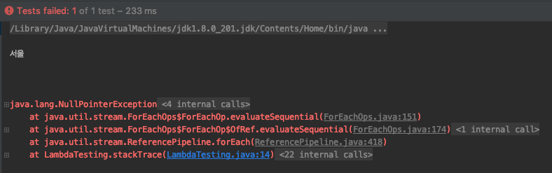

# 리팩터링, 테스팅, 디버깅
- 모던 자바 인 액션 9장 

## 리팩터링
리팩터링(refactoring) 은 **결과의 변경없이 코드의 구조를 재정의** 하는것  
주로 가독성을 높이고 유지보수를 편하게 하기 위해서 수행함  
버그 제거, 새로운 기능 추가는 리팩터링이 아님  
- [위키피디아](https://ko.wikipedia.org/wiki/%EB%A6%AC%ED%8C%A9%ED%84%B0%EB%A7%81)
   
이 장에서는 **기존 코드를 람다로 리팩터링** 하기 위한 방법들을 소개하고 있음  

리팩터링 적용할 내용들 ...

### 익명 클래스 -> 람다 표현식 
흔히들 사용하는 익명 클래스를 람다 표현식으로 변경함으로써 가독성을 높일 수 있음  
```java
@Test
public void 익명_클래스(){
    Runnable runnable = new Runnable() {
        @Override
        public void run() {
            System.out.println("익명 클래스");
        }
    };
    runnable.run();

    Runnable lambda = () -> System.out.println("람다");
    lambda.run();
}
```
하지만 모든 익명클래스를 람다로 변경할 수 있는 것은 아님  
  
변경시 주의해야할 사항들 
- this, super 키워드는 람다에서 다른 의미를 갖음 
- shadow 변수를 사용할 수 없음 
- 람다 표현식으로 변경시 context 오버로딩에 따른 모호함이 초래할 수 있음 

### this, super 키워드는 람다에서 다른 의미를 갖음 
책에서는 익명 클래스는 this 가 자신을 가리킨다고 하나, 실제로 수행해보면 functional interface 들은 람다와 같이 자신을 감싸는 클래스를 가리키고 있음 
```java
@Test
public void 익명_클래스_this_super(){
    Runnable runnable = new Runnable() {
        @Override
        public void run() {
            System.out.println(this.getClass());
        }
    };
    runnable.run();

    Runnable lambda = () -> System.out.println(this.getClass());
    lambda.run();
}
```

### shadow 변수를 사용할 수 없음 
shadow 변수는 변수가 선언된 위치에 따라서 외부 변수가 내부 변수에 의해서 감춰지는 것을 말하며 은닉변수라고 불림  
- [위키피디아](https://en.wikipedia.org/wiki/Variable_shadowing)  
익명 클래스에서는 shadow 변수를 사용할 수 있지만 람다에서는 불가능하며 컴파일 에러를 발생시킴 
```java
@Test
public void 익명_클래스_shadow_변수_불가능(){
    int a = 10;

    // 가능
    Runnable runnable = new Runnable() {
        @Override
        public void run() {
            int a = 2;
            System.out.println(a);
        }
    };
    runnable.run();

    // 컴파일 에러
    Runnable lambda = () -> {
        int a = 3;
        System.out.println(a);
    };
    lambda.run();
}
```

### 람다 표현식으로 변경시 context 오버로딩에 따른 모호함이 초래할 수 있음 
익명 클래스는 인스턴스를 생성할 때 명시적으로 형식이 정해짐  
하지만, 람다의 경우는 그렇지 않아서 모호함이 발생할 수 있음  
따라서 명시적 타입 캐스팅이 필요함 
```java
public class OverloadingRunner {

    public void run(Consumer consumer){
        consumer.accept("consumer");
    }

    public void run(Runnable runnable){
        runnable.run();
    }
}

// 테스트 
@Test
public void 익명_클래스_context_모호함(){
    OverloadingRunner overloadingRunner = new OverloadingRunner();

    overloadingRunner.run(new Consumer() {
        @Override
        public void accept(Object o) {
            System.out.println(o.toString());
        }
    });

    // 명시적 타입 캐스팅이 필요
    overloadingRunner.run((Consumer) (s) -> System.out.println(s.toString()));
}
```


### 람다 -> 메서드 참조 
람다 표현식을 이용하는 것보다 메서드 참조를 이용하면 **메서드명 으로 코드의 의도**를 명확하게 표현할 수 있어 가독성을 높일 수 있음 

```java
@Test
public void 람다_to_메서드_참조(){
    // 람다 예제
    IntBinaryOperator lambdaOperator = (x, y) -> Calculator.staticAdd(x, y);
    System.out.println(lambdaOperator.applyAsInt(1, 2));

    // 메서드 참조
    IntBinaryOperator methodReferencer = Calculator::staticAdd;
    System.out.println(methodReferencer.applyAsInt(2, 3));
    
    Calculator calculator = new Calculator();
    methodReferencer = calculator::add;
    System.out.println(methodReferencer.applyAsInt(20, 30));
}
```  

### 명령형 데이터 처리 -> 스트림 
컬랙션을 이용한 데이터 처리를 스트림으로 바꾸면 소트서킷과 lazy 를 이용한 최적화가 가능함  
또한 쉽게 병렬처리를 할 수 있음  

```java
public List<String> getCategoryNameListByParentNoFor(long parentNo){
    List<String> categoryNameList = new ArrayList<>();
    for(Category category : CATEGORY_LIST){
        if(category.getParentNo() != null && parentNo == category.getParentNo()){
            categoryNameList.add(category.getName());
        }
    }
    return categoryNameList;
}

public List<String> getCategoryNameListByParentNoStream(long parentNo){
    return CATEGORY_LIST.parallelStream()//병렬 쉽게 가능 
            .filter(category -> category.getParentNo() != null)
            .filter(category -> parentNo == category.getParentNo())
            .map(Category::getName)
            .collect(Collectors.toList());
}
```

### 코드 유연성 개선 
람다 표현식을 이용하면 동작 파라미터화를 쉽게 구현할 수 있음  
ㄴ 쉽게 말해서 행위(함수) 자체를 변수로써 파라미터, 반환 값등에 사용가능  
자바에서는 람다를 사용하기 위해서 함수형 인터페이스를 추가해야함  
ㄴ 기존에 정의된 것을 사용해도 되지만, 커스텀이 필요하다면 .. ?  


### 조건부 연기 실행 (conditional deferred execution)
책에서는 조건부 연기 실행은 조건이 만족할때 원하는 행위를 연기하여 실행할수 있는 것이라고 하는 것 같음 ...   
ㄴ 하지만 구글링 해봐도 해당 내용관련 패턴은 잘 안나옴  
  
[람다를 이용한 프로그래밍 article](https://www.informit.com/articles/article.aspx?p=2171751) 에서는 람다의 요점은 실행을 지연하는 것에 있다고 설명하면서 아래의 이유를 예로 들고 있음  
- 별도의 스레드에서 코드를 실행
- 코드를 여러면 실행 
- 알고리즘의 올바른 지점에서 실행 (정렬의 비교 연산)
- 문제가 발생했을 경우 실행 (이벤트 발생)
- 필요한 경우에만 코드 실행 
ㄴ 개인적으로 이걸 조건부 연기 실행이라고 하는듯  
  
아래의 예제는 로깅관련된 예제인데, 일반적으로 로그는 log level 을 이용해서 로그를 관리하곤 하는데, log level 이 변경되었을 경우를 예를들어 설명하고 있음  
java.util 패키지의 Logger 는 info 라는 메소드가 오버로딩되어 있는데, 문자열을 파라미터로 받는 메소드와 Supplier를 파라미터로 받는 메소드가 있음  

```java
@Test
public void 조건부_연기_실행(){
    Logger logger = Logger.getLogger("Test");
    String msg = "abcdefg";

    // 단순히 로깅
    logger.log(Level.FINER, "Test logging: " + msg);

    // 람다를 이용한 로깅
    logger.log(Level.FINER, () -> "Test logging: " + msg);
}
```

위 코드에서 2개의 메소드의 차이점은 문자열에 대한 연결 연산은 언제하는지에 따라 다른데, Logger 내부 메소드를 보면 알 수 있음  
```java
// java.util.loggin.Logger
public void log(Level level, String msg) {
    if (!isLoggable(level)) {
        return;
    }
    LogRecord lr = new LogRecord(level, msg);
    doLog(lr);
}
public void log(Level level, Supplier<String> msgSupplier) {
    if (!isLoggable(level)) {
        return;
    }
    LogRecord lr = new LogRecord(level, msgSupplier.get());
    doLog(lr);
}
```
- 문자열을 바로 전달하게 되면 실제로 로그를 찍지 않더라고 문자열 연결 연산을 한 뒤에 메소드를 호출
- 문자열을 연결연산은 로그를 찍을 때만 수행 

### 실행 어라운드
자원 처리(파일 입출력, DB)의 경우 항상 자원을 열고, 원하는 처리 후에 자원을 닫는 행위들의 반복이 나타나게 되는데,  
이를 람다로 변환해서 재사용성을 높여보자는 것  
```java
public interface BufferedReaderProcessor {
    String process(BufferedReader bufferedReader) throws IOException;
}

public class ClassFileProcessor {

    public String processFile(BufferedReaderProcessor processor) throws IOException {
        try(BufferedReader reader = new BufferedReader(new FileReader(System.getProperty("user.dir") + "/src/main/java/fileReader/ClassFileProcessor.java"))){
            return processor.process(reader);
        }
    }

    public void run() throws IOException {
        String twoLine = processFile((BufferedReader br) -> br.readLine() + br.readLine());
        System.out.println(twoLine);
    }
}
```

### 객체지향 디자인 패턴에 람다 적용 
- 전략 패턴 
- 템플릿 메서드 패턴
- 옵저버 패턴 
- 의무 체인 패턴
- 팩토리 패턴 

### 전략패턴
런타임에 여러가지 유형의 알고리즘을 가진 상태에서 적절한 알고리즘을 선택하는 기법  
ㄴ 사실 알고리즘이라기 보다는 1가지 기능을 추상화해서 그것을 외부(클라이언트)에서는 인지하지 않아도 되도록 하는 기법  
```
                        <- 전략 1
클라이언트 -> 전략 인터페이스  <- 전략 2
```
- 전략 패턴에는 추상화된 정보를 나타내는 인터페이스 
- 해당 전략을 호출하는 클라이언트 
- 전략을 구현하고 있는 구현체 
ㄴ 람다로 변경하는 것은 아주 쉽게 인터페이스를 호출하는 쪽에서만 적용하면 됨  
전략 
```java
public interface ValidatorStrategy {
    boolean execute(String str);
}
public class IsNumericValidator implements ValidatorStrategy{
    @Override
    public boolean execute(String str) {
        return str.matches("\\d+");
    }
}
public class IsAllLowerCaseValidator implements ValidatorStrategy {
    @Override
    public boolean execute(String str) {
        return str.matches("[a-z]+");
    }
}
```
  
전략을 사용하는 클라이언트 
```java
public class Validator {
    private ValidatorStrategy validatorStrategy;

    public Validator(ValidatorStrategy validatorStrategy){
        this.validatorStrategy = validatorStrategy;
    }

    public boolean validate(String str){
        return validatorStrategy.execute(str);
    }
}
```
  
테스트 
```java
@Test
public void 전략패턴(){
    Validator numeric = new Validator(new IsNumericValidator());
    Assert.assertFalse(numeric.validate("aaa"));
    Assert.assertTrue(numeric.validate("123"));

    // 람다
    Validator lambdaNum = new Validator((String str) -> str.matches("\\d+"));
    Assert.assertFalse(lambdaNum.validate("aaa"));
    Assert.assertTrue(lambdaNum.validate("123"));
}
```

### 템플릿 메소드 패턴 
템플릿 메소드 패턴은 추상 클래스를 이용한 기능을 확장하는 방법으로 공통기능은 부모 클래스에 유지하고 확장해야 할 기능을 자식 클래스에서 오버라이드하는 기법 
ㄴ 추상클래스에 있는 추상 메서드를 람다를 이용해서 파라미터로 변환해서 적용 

### 옵저버 패턴 
이벤트가 발생했을 때 주체가 옵저버에 자동으로 알림을 보내야 하는 상황에서 사용하는 패턴   
일반적으로 GUI 에서 자주 사용되며, 버튼을 클릭하면 옵저버에 알림이 전달되고 정해진 동작을 수행하도록 함  


### 의무 체인 
작업 처리 객체의 체인을 만들 때 사용하는 패턴  
한 객체가 어떤 작업을 처리한 다음 다른 객체로 결과를 전달하는 패턴  
ㄴ 대표적으로 톰캣에서 서블릿 필터 

### 팩토리 패턴 
하나의 팩토리에서 객체를 대신 생성해주는 패턴  


## 테스팅
개발자는 개발한 코드가 의도한 대로 동작하는지 확인하기 위해서 **단위 테스트** 를 진행함  
ㄴ TDD 책에서는 단위 테스트 코드를 작성하면서 생기는 장점들에 얘기하고 있는데 ...  
ㄴ 객체지향을 극대화 할 수 있도록 리팩토링을 수행할 수도 있고 오픈소스의 학습 테스트 코드를 작성하면서 오픈소스를 이해하는데 도움이 되기도 한다고 함   

### 람다를 사용하는 메서드의 동작에 집중 
- 이전에 작성했던 category 관련내용 소환 !!  
```java
public List<String> getCategoryNameListByParentNoStream(long parentNo){
    return CATEGORY_LIST.parallelStream()
            .filter(category -> category.getParentNo() != null)
            .filter(category -> parentNo == category.getParentNo())
            .map(Category::getName)
            .collect(Collectors.toList());
}
```
위 코드에서 filter, map 에 적용된 내용을 테스트 할 수 없는데, 예를들어 category -> parentNo == category.getParentNo() 은 익명 클래스이기 때문에 호출이 불가능함   
ㄴ 굳이 해야 한다면 테스트 코드에서 해당 내용만을 복붙 해서 실행해 볼 수 있음   
  
책에서는 해당 메소드의 결과와 예상된 결과를 비교해서 검증을 수행하고 있음 
ㄴ 마틴 파울러는 단위 테스트에 검증에 대해서 크게 2가지로 분리하였는데, **상태 검증과 행위 검증** 이다   
ㄴ 상태 검증: 메서드를 호출한 결과물에 대한 데이터에 대한 테스트로 볼 수 있음   
ㄴ 행위 검증: 특정 메서드가 호출이 되었었는지를 검증하는 것  
ㄴ [my 블로그](https://kimkoungho.github.io/testing/test-double/#mock-vs-stub)

### 고차원 함수 테스트 
고차원 함수: 함수를 인수로 받거나 다른함수를 반환하는 메서드  
메서드가 람다를 인수로 받는다면 다른 람다로 메서드의 동작을 테스트 할 수 있음  
ㄴ 어떻게 하는지 안나옴 ... ㅋㅋ 

## 디버깅 
코드를 디버깅하는 경우 크게 2 가지를 확인함 
- 스택 트레이스
- 로깅 

### 스택 트레이스 
예외기 발생하면 스택 트레이스 내용을 이용해서 디버깅이 가능한데, 람다는 이름이 없기 때문에 복잡한 스택 트레이스가 생성됨  

```java 
@Test
public void stackTrace(){
    List<Category> categoryList = Arrays.asList(new Category(1L, null, "서울"), null);
    categoryList.stream()
            .map(Category::getName)
            .forEach(System.out::println);
}
```

   

- 의도하지 않았던 복잡한 스택 트레이스가 생성됨 
- 실제 에러가 생성된 람다에 대한 메서드명이 나타나지 않음 
> 
메서드 참조를 사용하는 클래스와 같은 곳에 선언된 메서드를 참조할 때는 스택 트레이스에 나타남 

### 스트림에서 로깅
스트림은 익명 클래스이기 때문에 로깅이 어렵다는 단점이 있는데 stream api 의 peek 을 이용해서 로깅을 수행할 수 있음 

```java
@Test
public void logging(){
    List<Category> categoryList = Arrays.asList(
            new Category(1L, null, "서울"),
            new Category(2L, null, "경기도"),
            new Category(3L, 1L, "강남구"),
            new Category(4L, 1L, "송파구"),
            new Category(5L, 2L, "수원시"),
            new Category(6L, 2L, "안양시"),
            new Category(7L, 2L, "성남시")
    );

    long parentNo = 2L;
    List<String> result = categoryList.stream()
            .peek(category -> System.out.println(category))
            .filter(category -> category.getParentNo() != null)
            .peek(category -> System.out.println(category))
            .filter(category -> parentNo == category.getParentNo())
            .peek(category -> System.out.println(category))
            .map(Category::getName)
            .peek(categoryName -> System.out.println(categoryName))
            .collect(Collectors.toList());

}
```

출력결과
```log
Category{no=1, parentNo=null, name='서울}
Category{no=2, parentNo=null, name='경기도}
Category{no=3, parentNo=1, name='강남구}
# category.getParentNo() != null 필터 적용 
Category{no=3, parentNo=1, name='강남구}
Category{no=4, parentNo=1, name='송파구}
# category.getParentNo() != null 필터 적용 
Category{no=4, parentNo=1, name='송파구}
Category{no=5, parentNo=2, name='수원시}
# category.getParentNo() != null 필터 적용 
Category{no=5, parentNo=2, name='수원시}
# category -> parentNo == category.getParentNo() 필터 
Category{no=5, parentNo=2, name='수원시}
# Category::getName 
수원시
Category{no=6, parentNo=2, name='안양시}
# category.getParentNo() != null 필터 적용 
Category{no=6, parentNo=2, name='안양시}
# category -> parentNo == category.getParentNo() 필터 
Category{no=6, parentNo=2, name='안양시}
# Category::getName 
안양시
Category{no=7, parentNo=2, name='성남시}
# category.getParentNo() != null 필터 적용 
Category{no=7, parentNo=2, name='성남시}
# # category -> parentNo == category.getParentNo() 필터 
Category{no=7, parentNo=2, name='성남시}
# Category::getName 
성남시
```
