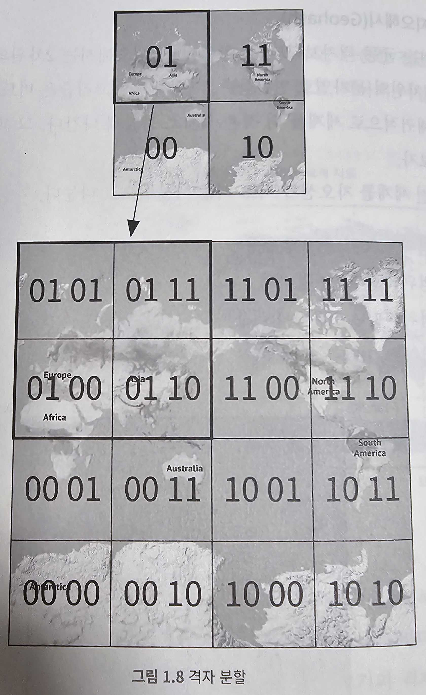
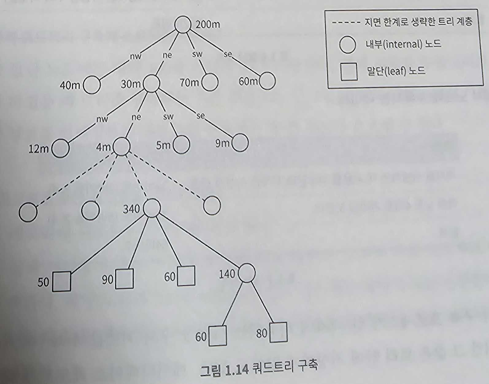

# 근접성 서비스(proximity service)

문제) 주변 식당 검색 기능 구현

## 1단계: 문제 이해 및 설계 범위 확정

```
지원자 : 사용자가 검색 반경(radius)을 지정할 수 있어야 하나요? 검색 반경 내에 표시할 샇업장이 충분치 않은 경우 검색 반경을 시스템에서 알아서 넓혀도 괜찮을까요?
면접관 : 일단은 주어진 반경 내의 사업자만 검색하는 걸로 하고 시간이 남으면 주어진 범위 안에 사업장이 많지 않은 경우를 어떻게 처리할지 이야기 해보시죠

지원자 : 최대 허용 반경은 얼마입니까? 20km(12.5mile)로 가정해도 괜찮을까요?
면접관 : 네

지원자 : 사용자가 UI에서 검색 반경을 변경할 수 있어야 하나요?
면접관 : 네. 다음과 같은 선택지가 주어져야 합니다. 0.5km(0.31mile), 1km(0.62mile), 2km(1.24mile), 5km(3.1mile) 그리고 20km(12.42mile)

지원자 : 사업장 정보는 어떻게 시스템에 추가되고, 삭제되고, 갱신됩니까? 사업장 정보에 대한 작업 결과가 사용자에게 실시간으로 보여져야 할까요?
면접관 : 사업장 소유주가 시스템에 추가﹒삭제﹒갱신할 수 있어야 합니다. 새로 추가하거나 갱신한 정보는 다음날까지 반영되어야 한다고 하시죠.

지원자 : 사용자가 이동 중에 앱이나 웹사이트를 이용한다면 검색 결과를 항상 현재 위치 기준으로 유지하기 위해 화면을 자동 갱신해야 할까요?
면접관 : 사용자의 이동 속도가 그리 빠르지 않아서 그럴 필요는 없다고 칩시다.
```

### 기능 요구사항(functional requirements)
- 사용자의 위치(경위도 쌍)와 검색 반경 정보에 매치되는 사업장 목록을 반환
- 사업자 소유주가 사업장 정보를 추가﹒삭제﹒갱신할 수 있도록 하되, 그 정보가 검색 결과에 실시간으로 반영될 필요는 없음
- 고객은 사업장의 상세 정보를 살펴볼 수 있어야 함

### 비기능 요구사항(non-functional requirements)
- 낮은 응답 지연(latency): 사용자는 주변 사업장을 신속히 검색할 수 있어야 한다.
- 데이터 보호(data privacy): 사용자 위치는 민감한 정보다. 위치 기반 서비스(Location-Based Service, LBS)를 설계할 때는 언제나 사용자의 정보를 보호할 방법을 고려해야 한다. GDPR(General Data Protection Regulation)이나 CCPA(California Consumer Privacy Act) 같은 데이터 사생활 보호 법안을 준수하도록 해야 한다. (한국의 경우 ISMS?)
- 고가용성(high availability) 및 규모 확장성(scalability) 요구사항: 인구 밀집 지역에서 이용자가 집중되는 시간에 트래픽이 급증해도 감당할 수 있도록 시스템을 설계해야 한다.

### 개략적 규모 추정(back-of-the-envelope calculation)
- 일간 능동 사용자(Daily Active User, DAU)는 1억 명(100million)
- 등록된 사업장 수는 2억(200million)이라고 가정

```
QPS 계산

1d = 24h * 60m * 60s = 86,400s (계산을 쉽게 하기 위해 100,000s라 가정, 10^5)
한 사용자는 하루에 5회 검색을 시도한다고 가정
QPS = (1억 * 5) / 10^5 = 5,000
```

## 2단계: 개략적 설계안 제시 및 동의 구하기

### API 설계

#### GET /v1/search/nearby
- 특정 검색 기준에 맞는 사업장 목록을 반환
- 실제 애플리케이션의 경우 보통 페이지 단위로 나눠서 반환(이번 장에서는 제외)
- 파라미터
    - latitude: decimal 타입. 검색할 위도
    - longitude: decimal 타입. 검색할 경도
    - radius: int 타입. 선택적 인자(optional). 기본값 5,000m(대략 3마일)
- 응답
```json
{
    "total": 10,
    "businesses": [{business object}]
}
```

#### 사업장 관련 API
- GET /v1/businesses/:id => 상세 정보 반환
- POST /v1/businesses => 신규 사업장 정보 추가
- PUT /v1/businesses/:id => 사업장 정보 갱신
- DELETE /v1/businesses/:id => 사업장 정보 삭제

### 데이터 모델

#### 읽기/쓰기 비율
읽기 연산은 아래 두 기능으로 빈도 높게 발생
- 주변 사업장 검색
- 사업장 정보 확인

쓰기 연산은 비교적 빈도가 낮음
- 사업장 정보 추가, 삭제, 편집

#### 데이터 스키마 (MySQL 같은 RDB 사용)
**business 테이블**
|business||
|---|---|
|business_id|PK|
|address||
|city||
|state||
|country||
|latitude||
|longitude||

**지리적 위치 색인 테이블**
- 위치 정보 관련 연산의 효율성을 높이는 데 쓰인다.
- 지오해시(geohash)에 대한 지식이 필요하므로, 뒤에서 다시 설명

### 개략적 설계


#### 로드밸런서
- 로드밸런서(load balancer)는 유입 트래픽을 자동으로 여러 서비스에 분산시키는 컴포넌트
- 통상적으로는 로드밸런서에 단일 DNS 진입점(entry point)을 지정하고, URL 경로를 분석하여 어느 서비스에 트래픽을 전달할지 결정한다.

#### 위치 기반 서비스(LBS)
- 시스템의 핵심 부분으로 주어진 위치와 반경 정보를 이용해서 주변 사업장을 검색한다.
- 아래와 같은 특성을 갖는다.
    - 쓰기 요청이 없는, 읽기 요청만 빈번하게 발생하는 서비스
    - QPS가 높다. 특히 특정 시간대의 인구 밀집 지역일수록 그 경향이 심하다.
    - 무상태(stateless) 서비스이므로 수평적 규모 확장이 쉽다. (지속적인 연결성(socket 등)이 불필요한 서비스)

#### 사업장 서비스
- 주로 다음 같은 두 종류의 요청을 처리
    - 사업장 소유자가 사업장 정보를 생성﹒갱신﹒삭제한다. 기본적으로 쓰기 요청이며 QPS가 낮다.
    - 고객이 사업장 정보를 조회한다. 특정 시간대에 QPS가 높아진다.

#### 데이터베이스 클러스터
- 주-부(primary-secondary) 데이터베이스 형태로 구성 가능
- 주 데이터베이스에서 쓰기 요청을 처리
- 부 데이터베이스(사본 데이터베이스)는 읽기 요청을 처리
- 데이터는 주 데이터베이스에 기록된 후 사본 데이터베이스로 복사된다.
- 복제 delay로 인해서 주-부 데이터베이스 간의 데이터 차이가 존재할 수는 있지만 사업장 정보가 실시간으로 갱신될 필요가 없기 때문에 큰 문제가 되지는 않는다.

#### 사업장 서비스와 LBS의 규모 확장성(scalability)
- 사업장 서비스와 LBS 모두 stateless 서비스이므로 점심시간 등의 특정 시간 대에 집중적으로 트래픽이 몰릴 수 있어서 자동으로 서버를 추가하여 대응하고, 야간 등 유휴 시간 대에는 서버를 삭제하도록 구성할 수 있다.
- 시스템을 클라우드에 둔다면 여러 지역, 여러 가용성 구역(availablity zone)에 서버를 두어 시스템 가용성을 높일 수 있다.

### 주변 사업장 검색 알고리즘

#### 방안1: 2차원 검색
- 주어진 반경으로 그린 원 안에 놓인 사업장을 검색하는 방법


- 이 절차를 유사(pseudo) SQL 질의문으로 옮기면 다음과 같다.
```sql
SELECT business_id, latitude, longitude
FROM business
WHERE (latitude BETWEEN {:my_lat} - radius AND {:my_lat} + radius)
AND (longitude BETWEEN {:my_long} - radius AND {:my_long} + radius)
```

- 이 질의는 테이블 전부를 읽어야 하므로 효율적이지 않다.
- 위도와 경도 칼럼에 색인을 만들어 두어도 썩 좋아지지 않는다.
- 데이터가 2차원적이므로 칼럼별로 가져온 결과도 여전히 엄청난 양이다.
- 위도 칼럼과 경도 칼럼에 색인을 만들어 놓으면 아래 이미지처럼 '데이터 집합1', '데이터 집합2'는 신속히 추출할 수 있을 것이다.
- 하지만 주어진 반경 내 사업장을 얻으려면 두 집합의 교집한을 구해야 한다.
- 이 연산은 각 집합에 속한 데이터의 양 때문에 효율적일 수 없다.


색인을 만드는 방법은 두 종류다.
- 해시 기반 방안 : 균등 격자(even grid), 지오해시(geohash), 카르테시안 계층(cartesian tiers) 등
- 트리 기반 방안 : 쿼드트리(quadtree), 구글 S2, R 트리(R-tree) 등


- 각 색인법의 구현 방법은 서로 다르지만 개략적인 아이디어는 같다.
- **지도를 작은 영역으로 분할하고 고속 검색이 가능하도록 색인을 만드는** 것이다.
- 지오해시, 쿼드트리, 구글 S2는 실제로 가장 널리 사용되는 방안이다.

#### 방안2: 균등 격자
- 지도를 아래 그림과 같이 작은 격자 또는 구획으로 나누는 단순한 접근법이다.
- 이렇게 하면 하나의 격자는 여러 사업장을 담을 수 있고, 하나의 사업장은 오직 한 격자 안에만 속하게 된다.
- 이 방법은 중요한 문제가 있다.
  - 사업장 분포가 균등하지 않다는 것
  - 전 세계를 동일한 크기의 격자로 나누면 데이터 분포는 전혀 균등하지 않다.
  - 주어진 격자의 인접 격자를 찾기가 까다로울 수 있다.
  - 격자 식별자 할당에 명확한 체계가 없기 때문이다.


#### 방안3: 지오해시(Geohash)
- 2차원의 위도 경도 데이터를 1차원의 문자열로 변환
- 지오해시 알고리즘은 비트를 하나씩 늘려가면서 재귀적으로 셰게를 더 작은 격자로 분할해 나간다.
- 우선, 전 셰게를 자오선과 적도 기준 사분면으로 나눈다.
  - 위도 범위 [-90, 0]은 0에 대응
  - 위도 범위 [0, 90]은 1에 대응
  - 경도 범위 [-180, 0]은 0에 대응
  - 경도 범위 [0, 180]은 1에 대응


- 그 각각의 격자를 또다시 사분면으로 나눈다. 이때 각 격자는 경도와 위도 비트를 앞서 살펴본 순서대로 반복하여 표현


- 이 절차를 원하는 정밀도(precision)를 얻을 때까지 반복
- 지오해시는 통상적으로 base32 표현법을 사용한다.
  - 구글 본사 지오해시 (길이=6): 1001 11010 01001 10001 11111 11110 (base32 이진 표기) -> 9q9hvu (base32)
  - 메타(구 페이스북) 본사 지오해시 (길이=6): 1001 11010 01001 10011 10001 11011 (base32 이진 표기) -> 9q9jhr (base32)
- 지오해시는 12단계(level) 정밀도를 갖는다. 이 정밀도가 격자 크기를 결정한다.
- 지오해시는 길이가 4에서 6사이인데, 6보다 길어지면 한 격자가 너무 작아지기 때문이다. 4보다 작으면 반대로 격자가 너무 커진다.

| 지오해시 길이 | 격자 너비 X 높이 |
| --- | --- |
| 1 | 5,009.4km X 4,992.6km (지구 전체) |
| 2 | 1,252.3km X 624.1km |
| 3 | 156.5km X 156km |
| 4 | 39.1km X 19.5km |
| 5 | 4.9km X 4.9km |
| 6 | 1.2km X 609.4m |
| 7 | 152.9m X 152.4km |
| 8 | 38.2m X 19m |
| 9 | 4.8m X 4.8m |
| 10 | 1.2m X 59.5cm |
| 11 | 14.9cm X 14.9cm |
| 12 | 3.7cm X 1.9m |

- 최적 정밀도는 정하는가?
- 사용자가 지정한 반경으로 그린 원을 덮는 최소 크기 격자를 만드는 지오해시 길이를 구해야 한다.

| 반경 (킬로미터) | 지오해시 길이 |
| --- | --- |
| 0.5km (0.31마일) | 6 |
| 1km (0.62마일) | 5 |
| 2km (1.24마일) | 5 |
| 5km (3.1마일) | 4 |
| 20km (12.4마일) | 4 |

- 격자 가장자리 처리 방식에 관한 경계 조건(edge case)이 몇 가지 있다.

##### 격자 가장자리 관련 이슈
= 지오해시는 해시값이 공통 접두어(prefix)가 긴 격자들이 서로 더 가깝게 놓이도록 보장


###### 격자 가장자리 이슈 1
- 하지만 그 역은 참이 이니다.
- 아주 가까운 두 위치가 어떤 공통 접두어도 갖지 않는 일이 발생할 수 있다.
- 두 지점이 적도의 다른 쪽에 놓이거나, 자오선상의 다른 반쪽에 높이는 경우다.


- 이 문제점 때문에 아래와 같이 단순한 접두어 기반 SQL 질의문을 사용하면 주변 모든 사업장을 가져올 수 없다.
```sql
SELECT * FROM geohash_index WHERE geohash LIKE '9q8zn%';
```

###### 격자 가장자리 이슈 2
- 또 다른 문제점은 두 지점이 공통 접두어 길이는 길지만 서로 다른 격자에 놓이는 경우다.


- 가장 흔히 사용되는 해결책은 현재 격자를 비롯한 인접한 모든 격자의 모든 사업장 장보를 가져오는 것이다.
- 특정 지오해시의 주변 지오해시를 찾는 것은 상수 시간(constant time)에 가능한 연산이다.

##### 표시할 사업장이 충분하지 않은 경우
- 선택지1: 주어진 반경 내 사업장만 반환
- 선택지2: 검색 반경을 키운다.
  - 지오해시 값의 마지막 비트를 삭제하여 얻은 새 지오해시 값을 사용해 주변 사업장을 검색하는 것이다.
  - 그래도 충분한 사업장이 없을 경우 또 한 비트를 지워서 범위를 다시 확장한다.
  - 이를 반복하면 원하는 수 이상의 사업장을 얻을 때까지 격자 크기는 확장된다.


#### 방안4: 쿼드트리
- 쿼드트리는 격자의 내용이 특정 기준을 만족할 때까지 2차원 공간을 재귀적으로 사분면 분할하는 데 흔히 사용되는 자료 구조다.
- 쿼드트리를 사용한다는 것은 결국 질의에 답하는 데 사용될 트리 구조를 메모리 안에 만드는 것이다.
- 이 자료 구조는 각각의 LBS 서버에 존재해야 하며, 서버가 시작하는 시점에 구축된다.
- 아래 그림은 세계를 쿼드트리를 사용해 분할하는 과정을 개념적으로 요약한 것이다. 전 세계에 200m(2억)개의 사업장이 있다고 가정


- 그 과정을 좀 더 자세하게 시각화한 것이 아래 그림이다.
- 이 트리의 루트 노드(root node)는 세계 전체 지도를 나타낸다.



- 그 과정을 의사 코드(pseudocode)로 나타내면 다음과 같다.
```java
public void buildQuadTree(TreeNode node) {
    if (countNumberOfBusinessesInCurrentGrid(node) > 100) {
        node.subdivide();
        for (TreeNode child : node.getChildren()) {
            buildQuadTree(child);
        }
    }
}
```

##### 쿼드트리 전부를 저장하는 데 얼마나 많은 메모리가 필요한가?

###### 말단 노드에 수록되는 데이터
| 이름 | 크기 |
| --- | --- |
| 격자를 식별하는 데 사용될 좌상단과 우하단 꼭짓점 좌표 | 32바이트 (8바이트 X 4) |
| 격자 내부 사업장 ID 목록 | ID당 8바이트 X 100 (한 격자에 허용되는 사업장 수의 최댓값) |
| 합계 | 832바이트 |

###### 내부 노드에 수록되는 데이터
| 이름 | 크기 |
| --- | --- |
| 격자를 식별하는 데 사용될 좌상단과 우하단 꼭짓점 좌표 | 32바이트 (8바이트 X 4) |
| 하위 노드 4개를 가리킬 포인터 | 32바이트 (8바이트 X 4) |
| 합계 | 64바이트 |

- 메모리 사용량을 살펴보자
  - 격자 안에는 최대 100개 사업장이 있을 수 있다.
  - 말단 노드의 수는 약 (2억 / 100 = 약 2백만) 개
  - 내부 노드의 수는 200만 X (1 / 3) = 약 67만 개
  - 총 메모리 요구량은 200만 X 832바이트 + 67만 X 64바이트 = 약 1.71GB (총 메모리 요구량이 꽤 작은 편)

- 쿼드트리 인덱스가 메모리를 많이 잡아먹지 않으므로 서버 한 대에 충분히 올릴 수 있다는 점만 확실히 알아두면 된다.
- 읽기 연산 양이 많아지면 서버 한 대의 CPU나 네트워크 대역폭으로는 감당하기 어려워진다.
- 그런 상황이 실제로 닥치면 읽기 연산을 여러 대 쿼드트리 서버로 분산시켜야 할 것이다.

##### 전체 쿼드트리 구축에 소요되는 시간은?
- 각 말단 노드에는 대략 100개 사업장 ID가 저장된다.
- 전체 사업장 수를 n이라고 하였을 때 트리 구축하는 시간 복잡도는 (n /100)log(n / 100)다.
- 2억 개의 사업장 정보를 인덱싱하는 쿼드트리 구축에는 몇 분 정도가 소요될 수 있다.

##### 쿼드트리로 주변 사업장을 검색하려면?
1. 메모리에 쿼드트리 인덱스를 구축
2. 검색 시작점이 포함된 말단 노드를 만날 때까지, 트리의 루트 노드부터 탐색. 해당 노드에 100개 사업장이 있는 경우에는 해당 노드만 반환. 그렇지 않은 경우에는 충분한 사업장 수가 확보될 때까지 인접 노드도 추가

##### 쿼드트리 운영 시 고려사항
- 2억 개 사업장을 갖는 쿼드트리를 구축하는 데는 몇 분이 소요된다.
  - 서버를 시작하는 순간에 트리를 구축하면 서버 시작 시간이 길어질 수 있다는 점을 따져 봐야 한다.
  - 쿼드트리를 만들고 있는 동안 서버는 트래픽을 처리할 수 없기 때문
  - 이를 피하기 위해 blue/green deployment를 할 경우, 모든 서버에서 2억 개의 사업장 정보를 데이터베이스에서 동시에 읽게 되어 시스템에 큰 부가가 가해질 수 있다.
  - 면접 시에 반드시 그 사실을 언급하도록 하자
- 시간이 흘러 사업장이 추가/삭제되었을 때 쿼드 트리를 갱신하는 문제
  - 가장 쉬운 방법은 점진적으로 갱신하는 것
  - 클러스터 내의 모든 서버를 한 번에 갱신하는 대신 점진적으로 몇 개씩만 갱신하는 것
  - 이 경우, 짧은 시간 동안이지만 낡은 데이터가 반환될 수 있다. (요구사항이 엄격하지 않다면 용인 가능)
  - 밤 사이에 캐시를 일괄 갱신하면 되는데, 이 접근법의 문제는 수많은 키(key)가 한 번에 무효화되어 캐시 서버에 막대한 부하가 가해질 수 있다는 점
  - 쿼드트리를 실시간으로 갱신하는 것도 가능 (하지만 설계가 복잡해짐)
  - 여러 스레드가 쿼드트리 자료 구조를 동시 접근하는 경우 모종의 락(lock) 메커니즘을 사용해야 하기 때문

##### 실제로 쓰이는 쿼드트리 사례
엑스트(Yext)가 제공한 덴버(Denver) 인근 쿼드트리 구축 사례를 보자.


#### 방안5: 구글 S2
- 쿼드트리와 마찬가지로, 이 해법도 메모리 기반(in-memory)이다.
- 지구(sphere)를 힐베르트 곡선(Hilbert curve)이라는 공간 채움 곡선(space-filling curve)을 사용하여 1차원 색인화(indexing)하는 방안
- 힐베르트 곡선에는 아주 유명한 특성이 하나 있는데, 힐베르트 곡선 상에서 인접한 두 지점은 색인화 이후 1차원 공간 내에서도 인접한 위치에 있다는 것
- 이 1차원 공간 내에서의 검색은 2차원 공간에서의 검색보다 훨씬 더 효율적


- 복잡한 라이브러리라 구조를 정확히 알 필요는 없지만 구글이나 틴더(Tinder) 같은 회사에서 널리 사용하고 있으니 장정만 알아보자
  - 임의 지역에 다양한 수준의 영역 지정이 가능하기 때문에 지오펜스(geofence) 구현에 적합
  - 지오펜스는 실세계 지리적 영역에 설정한 가상의 경계(perimeter)다.
  - 지오펜스를 활용하면 관심 있는 영역의 경계를 정한 다음 해당 경계를 벗어난 사용자에게 알림을 보낼 수도 있다.
  - 단순히 주변 사업장을 검색할 때보다 훨씬 풍부한 기능을 제공할 수 있다.
  - S2가 제공하는 영역 지정 알고리즘(Region Cover Algorithm)은 지오해시처럼 고정된 정밀도를 사용하는 대신 최소 수준(min level), 최고 수준(max level) 그리고 최대 셀 개수(max cells) 등을 지정할 수 있다.
  - 셀 크기를 유연하게 조정할 수 있으므로 S2가 반환하는 결과가 좀 더 상세하다.


#### 추천
| 색인 방법 | 회사 |
| --- | --- |
| **지오해시** | 빙(Bing) 지도, 레디스(Redis), 몽고DB(MongoDB), 리프트(Lyft) |
| **쿼드트리** | 엑스트(Yext) |
| 지오해시 + 쿼드트리 | 엘라스틱서치(Elasticsearch) |
| S2 | 구글 맵(Google Maps), 틴더(Tinder) |

#### 지오해시 vs 쿼드트리

##### 지오해시
- 구현이 쉽고 트리를 구축할 필요가 없다
- 지정 반경 이내 사업장 검색을 지원
- 정밀도를 고정하면 격자 크기도 고정된다. 인구 밀도에 따라 동적으로 격자 크기를 조정할 수 없다. 그러려면 더욱 복잡한 논리를 적용해야 함
- 색인 갱신이 쉽다.

(사업장 정보 삭제)
| **geohash** | **business_id** |
| --- | --- |
| 9q8zn | 3 |
| ~~9q8zn~~ | ~~0~~ |
| 9q8zn | 4 |

##### 쿼드트리
- 구현하기가 살짝 더 까다롭다. 트리 구축이 필요
- k번째로 가까운 사업장까지의 목록을 구할 수 있다.
  - 때로 사용자는 검색 반경과 상관없이 내 위치에서 가까운 사업장 k개를 찾기를 원한다.
  - 그런 연산에는 쿼드트리가 적당한데 하위 노드 분할 과정이 숫자 k에 기반하는 데다 k개 사업장을 찾을 때까지 검색 범위를 자동으로 조정할 수 있기 때문이다.
- 인구 밀도에 따라 격자 크기를 동적으로 조정할 수 있다.
- 지오해시보다 색인 갱신이 까다롭다.
  - 사업장 정보를 삭제하려면 루트 노드부터 말단 노드까지 트리를 순회해야 한다.
  - 따라서 색인 갱신 시간 복잡도는 O(log n)이다.
  - 다중 스레드(multi-thread)를 지원해야 하는 경우에는 그 구현이 더욱 복잡해진다.
  - 가령 말단 노드에 새로운 사업장을 추가할 수 없는 경우에는 리밸런싱을 해야 한다.
  - 한 가지 해결책은 말단 노드가 담당해야 하는 구간의 크기를 필요한 양보다 크게 잡는 것이다.


## 3단계: 상세 설계

### 데이터베이스의 규모 확장성

#### 사업장 테이블
- 사업장(business) 테이블은 데이터가 많아서 샤딩(sharding)을 적용하기 좋은 후보다.
- 샤딩을 쉬운 방법은 사업장 ID를 기준으로 하는 것이다.
- 모든 샤드에 부하를 고르게 분산할 수 있을 뿐 아니라 운영적 측면에서 보자면 관리하기도 쉽다.

#### 지리 정보 색인 테이블
지오해시 테이블 구성 방법은 두 가지다.
1. 각각의 지오해시에 연결되는 모든 사업장 ID를 JSON 배열로 만들어 같은 열에 저장하는 방안이다.
2. 같은 지오해시에 속한 사업장 ID 각각을 별도 열로 저장하는 방안이다.

##### 추천
- 두 번째 방안을 추천
  - 방안 1을 갱신하려면 일단 JSON 배열을 읽은 다음 갱신할 사업장 ID를 찾아야 한다.
  - 새 사업장을 등록해야 하는 경우에도 같은 사업장 정보가 이미 있는지 확인을 위해 데이터를 전부 살펴야 한다.
  - 또한 병력적으로 실행되는 갱신 연산 결과로 데이터가 소실되는 경우를 막기 위해 락을 사용해야 한다.
  - 방안 2의 경우에는 지오해시와 사업장 ID 칼럼을 합친 (geohash, business_id)를 복합 키(compound key)로 사용하면 사업장 정보를 추가하고 삭제하기가 쉽다. 락을 사용할 필요도 없다.

#### 지리 정보 색인의 규모 확장
- 관계형 데이터베이스 서버의 경우 부하 분산에는 두 가지 전략이 흔히 사용된다.
  - 하나는 읽기 연산을 지원할 사본 데이터베이스 서버를 늘리는 것
  - 다른 하나는 샤딩을 적용하는 것
- 지오해시 테이블은 샤딩이 까다롭다. (애플리케이션 계층에 구현해야하기 때문)

### 캐시
- 정말 필요할까?
- 처리 부하가 읽기 중심이고 데이터베이스 크기는 상대적으로 작아서 모든 데이터는 한 대 데이터베이스 서버에 수용 가능하다.
- 읽기 성능이 병목이라면 사본 데이터베이스를 증설해서 읽기 대역폭을 늘릴 수 있다.

#### 캐시 키
- 직관적인 캐시 키는 사용자 위치의 위경도 정보다.
  - 사용자 기기에서 반환되는 위치 정보는 추정치일 뿐 아주 정확하지는 않다.
  - 움직이지 않더라도 측정할 때마다 조금씩 정보가 달라진다.
  - 사용자가 이동하면 해당 경위도 정보도 미세하게 변경된다. 대부분의 애플리케이션에 이 변화는 아무런 의미가 없다.
- 지오해시나 쿼드트리는 이 문제를 효과적으로 해결한다.
  - 같은 격자 내 모든 사업장이 같은 해시 값을 갖도록 만들 수 있기 때문

#### 캐시 데이터 유형
| 키 | 값 |
| --- | --- |
| 지오해시 | 해당 격자 내의 사업장 ID 목록 |
| 사업장 ID | 사업장 정보 객체 |

##### 격자 내 사업장 ID
- 사업장 정보는 상대적으로 안정적이라 자주 변경되지 않는다.
- 특정 지오해시에 해당하는 사업장 ID 목록을 미리 계산한 다음 레디스(Redis) 같은 키﹒값 저장소에 캐시할 수 있다.

```sql
SELECT business_id FROM geohash_index WHERE geohash LIKE `{: geohash}%`;
```

```java
public List<String> getNearByBusinessIds(String geohash) {
  String cacheKey = hash(geohash);
  List<String> listOfBusinessIds = Redis.get(cacheKey);
  if (listOfBusinessIds == null) {
    listOfBusinessIds = /* 위 DB에서 질의한 쿼리 실행 */;
    Redis.set(cacheKey, listOfBusinessIds, "1d");
  }
  return listOfBusinessIds;
}
```

- 사업장을 추가﹒수정﹒삭제하는 경우에는 데이터베이스를 갱신하고 캐시에 보관된 항목을 무효화(invalidate)한다.
- 이 연산은 빈도가 상대적으로 낮아서  락을 사용할 필요가 업스므로, 사업장 정보 갱신은 구현하기 쉽다.
- ...

### 지역 및 가용성 구역


### 최종 설계도


#### 주변 사업장 검색


## 4단계: 마무리

## 1장 요약
