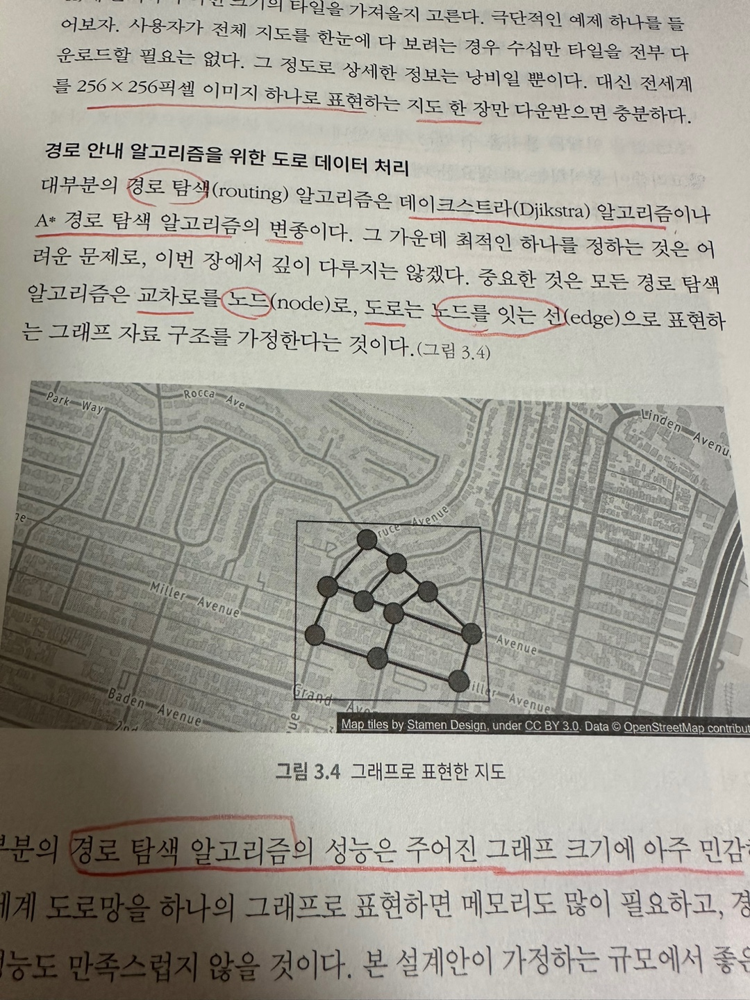
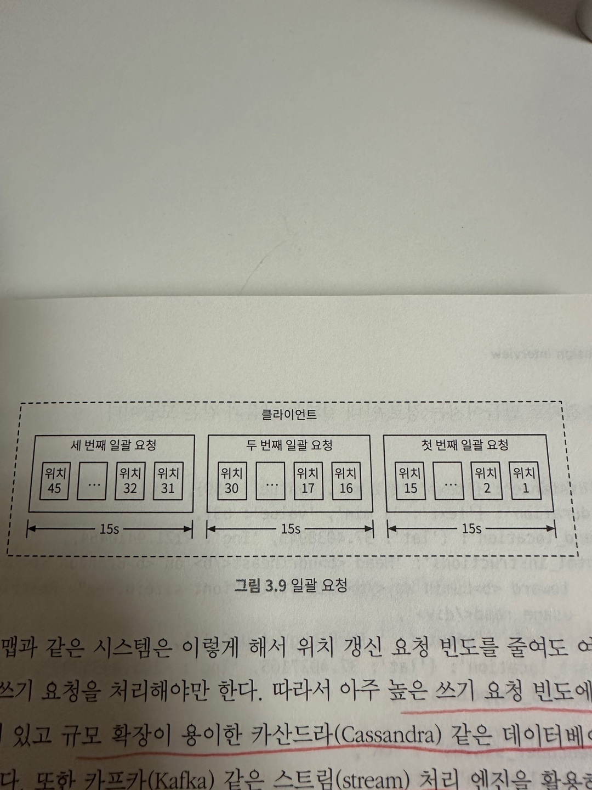

# 구글 맵 

이번 장에서는 단순한 형태의 구글 맵을 설계해 보도록 하자.  
구글은 2005년에 웹 기반 지도 서비스 구글 맵을 개발했다.  
구글 맵은 위성 이미지, 거리 뷰, 실시간 교통 상황, 경로 계획 등 다양한 서비스를 제공하고 있다.

## 1단계: 문제 이해 및 설계 범위 확정 
면접관과의 대화 사례 
> 지원자: 일간 사용자 수는 어느 정도로 가정할까요?  
> 면접관: 10억 DAU 를 가정하시면 됩니다.
> 지원자: 어느 기능에 초점을 맞추어야 합니까?   
> 면접관: 위치 갱신, 경로 안내, ETA, 지도 표시 등에 초점을 맞추죠.  
> 지원자: 도로 데이터는 어느 정도 규모 입니까?  
> 면접관: 도로 데이터는 가공 되지 않은 수 TB 수준입니다.  
> 지원자: 교통 상황도 고려 대상일까요?  
> 면접관: 네. 교통 상황은 도착 시간을 정확하게 추정하는 데 아주 중요합니다.  
> 지원자: 어떻게 이동하는지도 고려해야 할까요?  
> 면접관: 다양한 이동 방법을 지원할 수 있어야 합니다.  

### 기능 요구 사항
이번 장에서는 아래 세 가지 기능에 집중할 것이다. 지원할 단말은 스마트폰이다. 

- 사용자의 위치 갱신 
- 경로 안내 서비스 (ETA 서비스 포함)
- 지도 표시 

### 비기능 요구사항 및 제약 사항 

- 정확도: 사용자에게 잘못된 경로를 안내하면 안 된다.
- 부드러운 경로 표시: 경로 안내 지도는 화면에 부드럽게 표시되고 갱신되어야 한다. 
- 데이터 및 배터리 사용량: 클라이언트는 가능한 최소한의 데이터와 베터리를 사용해야 한다.
- 일반적으로 널리 통용되는 가용성 및 규모 확장성 요구사항을 만족해야 한다. 

설계에 들어가기 전에 기본 개념 및 용어를 소개하겠다. 

### 지도 101

**측위 시스템**  
측위 시스템은 구 표면 상의 위치를 표현하는 체계를 말한다.  
위경도 기반 측위 시스템의 경우 최상단에 북극이고 최남단은 남극이다.
(위경도 설명 생략)

**3차원 위치의 2차원 변환**  
3차원 구 위의 위치를 2차원 평면에 대응 시키는 절차를 '지도 투영법' 또는 '도법' 이라고 부른다.  
도법은 다양하며, 각각은 다른 도법과의 차별되는 장단점을 갖는다.
   
구글 맵은 메르카토르 도법을 조금 변경한 웹 마르카토르 도법을 택하고 있다.  

**지오코딩**  
지오코딩은 주소를 지리적 측위 시스템의 좌표로 변화하는 프로세스다.  
ex) 앰파이어 파크웨이, 마운틴 뷰, CA 를 위도 37.423021 경도 -122.083739  
위경도를 다시 주소로 변환하는 것을 역 지오코딩이라 부른다.
  
지오코딩을 수행하는 한 가지 방법은 인터폴레이션이다.  
GIS 와 같은 다양한 시스템이 제공하는 데이터를 결합한다는 뜻이다.  

**지오해싱**  
지오해싱은 지도 위 특정 영역을 영문자와 숫자로 구성된 짧은 문자열에 대응시키는 인코딩 체계다.  
2차원의 평면 공간으로 표현된 지리적 영역 위의 격자를 더 작은 격자로 재귀적으로 분할해 나간다.  
어떤 격자를 재귀적으로 분할 한 결과로 생성된 더 작은 격자에는 0부터 3까지 번호가 부여된다.  
  
ex) 20,000km / 10,000 km 영역이 주어졌다고 하자.  
이 영역을 분할하면 네 개의 10,000 x 5,000 크기 영역이 만들어지고 각가에는 00, 01, 10, 11 번호가 붙는다.  
     
각 영역을 더 분할해야 한다면 똑같은 방식을 따른다. 결과로 5,000 x 2,500 사분면이 만들어 질 것이다. 
원하는 크기의 격자가 될 때 까지 이 과정을 반복한다.  
  
본 설계안은 맵 타일 관리에 지오해싱을 적용한다.  

**지도 표시**  
지도를 화면에 표시하는데 가장 기본이 되는 개념은 타일이다.  
지도 전부를 하나의 이미지로 표현하지 않고 작은 타일로 쪼개어 표시하는 것이다.  
클라이언트는 사용자가 보려는 영역에 관계된 타일만 다운받아 이어 붙인 다음 화면에 뿌린다.  
지도의 확대 수준에 따라 다른 종류의 타일을 준비해야 한다. 
클라이언트는 확대 수준에 근거하여 타일의 크기를 가져올지 고른다.  

**경로 안내 알고리즘을 위한 도로 데이터 처리**  
대부분의 경로 탐색 알고리즘은 다이크스트라, A* 경로 탐색 알고리즘의 변종이다.  
그 가운데 최적의 하나를 정하는 것은 어려운 문제로 이번 장에서 다루지는 않는다.  
중요한 것은 모든 경로 탐색 알고리즘은 교차로를 '노드'로 도로는 '노드를 잇는 선(간선)' 으로 표현하는 그래프 자료 구조를 가정한다는 것이다.  
       
경로 탐색 알고리즘의 성능은 주어진 그래프의 크기에 아주 민감하다.  
전 셰계 도로망을 하나의 그래프로 표현하면 경로 탐색에 많은 자원이 든다.  
그래서 그래프를 관리 가능한 단위로 분할할 필요가 있다.  
  
도로망을 더 작은 단위로 분할하는 방법 가운데 하나는 지오해상과 비슷한 분할 기술을 적용하여 세계를 작은 격자로 나누고,
격자 안의 도로망을 노드와 선으로 구성된 그래프 자료구조로 변환한다.  
이 때 각 격자는 경로 안내 타일이라 부른다. 각 타일은 다른 타일에 대한 참조를 유지한다.  
그래야 경로 탐색 알고리즘이 연결된 타일들을 지나갈 때 보일 더 큰 도로망 그래프를 만들어 낼 수 있다.  
  

**계층적 경로 안내 타일**  
경로 안내가 효과적으로 동작하려면 필요한 수전의 구체성을 갖추 도로 데이터가 필요하다.  
예를들어 국토 종단 여행을 위한 경로 탐색을 하려는데 지번 수준의 타일을 가지고 알고리즘을 돌리면 결과를 얻는데 너무 오랜시간이 걸린다.  
그래서 보통 구체성 정도를 상, 중, 하로 구분하여 세 가지 종류의 경로 안내 타일을 준비한다.  

- 상 타일: 가장 구체성이 높은 타일로 크기는 아주 작으며 지방도로 데이터만 둔다.
- 중 타일: 더 넓은 지역을 커버하며 관할구를 잇는 간선 도로 데이터만 둔다. 
- 하 타일: 구체성이 가장 낮은 타일로 도시와 주를 연결하는 주요 고속도로 데이터만 둔다. 

각 타일에는 다른 정밀도 타일로 연결되는 선이 있을 수 있다.  
예를들어 지방도 A 에서 고속도로 F 로 진입하는 경로를 표시하려면 도로 A 의 노드에서 도로 F 노드 사이의 연결 선이 있어야한다.  
  

### 개략적 규모 추정 
이제 풀어야 할 문제 규모를 간단히 추정해보자.  
설계 초점이 모바일 단말이므로, 데이터 사용량과 배터리 효율을 중요하게 따져봐야 한다.  

**저장소 사용량**  
다음 세 가지 종류의 데이터를 저장해야 한다. 

- 세계지도: 상세한 저장 용량 계산식은 잠시 후 다룬다. 
- 메타 데이터: 각 지도 타일의 메타데이터는 크기 아주 작아서 무시해도 지장이 없을 정도이기 때문에 본 추정에서는 무시한다. 
- 도로 정보: 외부에서 받은 수 TB 용량의 도로 데이터를 보유하고 있음을 알 수 있다. 이 데이터를 경로 안내 탈로 변환하여야 한다. 

세계지도  
지원하는 확대 수준 별로 지도 타일을 한 벌씩 두어야 한다.  
그 타일 전부를 보관하는 데 필요한 용량을 가늠하려면 최대 확대 수준에 따른 타일 개수를 따져보면 좋다.  
지도를 확대할 때마다 하나의 타일을 네 장의 타일로 펼친다고 가정하자.  
세계지도를 21번 확대하여 볼 수 있으려면 약 4.4조개의 타일이 필요하다.  
  
한 장의 타일이 256x256 픽셀 압축 PNG 파일이라면 한 장당 100KB 저장 공간이 필요하므로, 
최대 확대 시 필요 타일을 전부 저장하는 데는 총 4.4조 x 100KB = 440PB 의 저장 공간이 필요할 것이다.  
하지만 지구 표면의 90% 는 인간이 살지 않는 자연 그대로의 바다, 사막, 호수, 산간 지역임에 유의하자.  
이 지역들은 아주 높은 비율로 압축 할 수 있으므로, 보수적으로 보아 80%~90% 의 저장 용량을 절감 할 수 있다.  
따라서 44PB, 88PB 가량으로 저장 공간 요구량이 줄어든다. 어림잡아 50PB 필요하다고 보고 넘어가자.  
  
표 3.1 을 보면 확대 수준이 1 떨어질 때마다 필요한 타일의 수는 1/4 로 줄어든다.  
따라서 저장 공간 요구량도 1/4 줄어들 것이다. 이를 토대로 계산하면 50 + 50/4 + 50/16 ... = ~67PB 정도로 추정할 수 있다.  
  
서버 대역폭  
서버 대역폭을 추정하기 위해 어떤 유형의 요청을 처리해야 하는지 살펴봐야 한다.  
서버가 처리하는 요청은 크게 2가지다.  

- 경로 안내 요청: 클라이언트가 경로 안내를 시작할 때 전송하는 메시지  
- 위치 갱신 요청: 경로 안내를 진행하는 동안 변경된 사용자의 위치를 전송하는 메시지 

구글 맵에서는 이 위치 정보를 실시간 교통 상황 데이터 계산 과정의 입력으로 사용하는 등 다양하게 이용한다.  
  
서버 대역폭을 분석해보자.  
DAU 는 10억이고 경로 안내 기능을 평균적으로 주당 35분 사용한다고 가정하자.  
이를 계산하면 주당 350억분, 즉 하루에 50억분이다.  
위치 정보 갱신을 위한 간단한 접근법 중 하나는 GPS 좌표를 매초 전송하는 것인데(폴링),
그러면 하루에 3000(50억분 x 60)억 건의 요청이 발생하고 300만 QPS 에 해당한다.  
하지만 매초 GPS 를 전송하는 대신 요청을 클라이언트 쪽에서 모아 두었다가 덜 자주 보내도록 하면(15초, 30초) 쓰기 QPS 를 낮출 수 있을 것이다.  
얼마나 자주 보낼 지는 사용자의 이동 속도 등 다양한 요건에 좌우된다.  
사용자가 꽉 막힌 도로에 있다면 GPS 위치 업데이트를 자주 보내지 않아도 된다.  
15초 마다 한 번씩 서버로 보낸다고 가정하자. 이렇게 하면 QPS 는 20만으로 줄어든다. 

## 2단계: 개략적인 설계안 제시 및 동의 구하기 

### 개략적 설계안 

  
이 설계안은 세 가지 기능을 제공한다.

- 위치 서비스
- 경로 안내 서비스 
- 지도 표시 

**위치 서비스**  
위치 서비스는 사용자의 위치를 기록하는 역할을 담당한다.  
클라이언트가 t초 마다 자기 위치를 전송한다고 가정한다. 여기서 t는 설정이 가능한 값이다.  
이렇게 주기적으로 위치 정보를 전송하면 몇 가지 좋은 점이 있다.

- 첫번째 해당 데이터 스트림을 활용하여 시스템을 점차 개선 할 수 있다는 점이다. 실시간 교통 상황을 모니터링하는 용도로 사용할 수 있다. 
- 두번째는 위치 정보가 거의 실시간 정보에 가까우므로 ETA 를 좀 더 정확하게 산출 할 수 있고, 교통 상황에 따라 다른 정보를 안내 할 수도 있다는 점이다.
  
하지만 사용자 위치가 바뀔 때 마다 즉시 서버로 전송해야 할까?  
위치 이력을 클라이언트에 버퍼링해 두었다가 일괄 요청하면 전송 빈도를 줄일 수 있다.  
  
그림 3.9 를 보면 위치 변경 내역은 매초 측정하지만 서버로는 15초마다 한 번 보내도록 설정해 놓은 사례다.  
이렇게 갱신 요청 빈도를 줄여도 높은 쓰기 요청 빈도에 최적화 되어 있고 확장이 용이한 카산드라 같은 데이터베이스가 필요하다.  
또한 카프카 같은 스트림 처리 엔징을 활용해 위치 데이터를 로깅해야 할 수도 있다.  
  
**경로 안내 서비스**  
이 컴포넌트는 A에서 B 지점으로 가는 합리적으로 빠른 경로를 찾아주는 역할을 담당한다.  
결과를 얻는 데 드는 지연 시간은 어느 정도 감내 할 수 있다.  
해당 경로가 최단 시간 경로일 필요는 없으나 정확도는 보장되어야 한다.  
