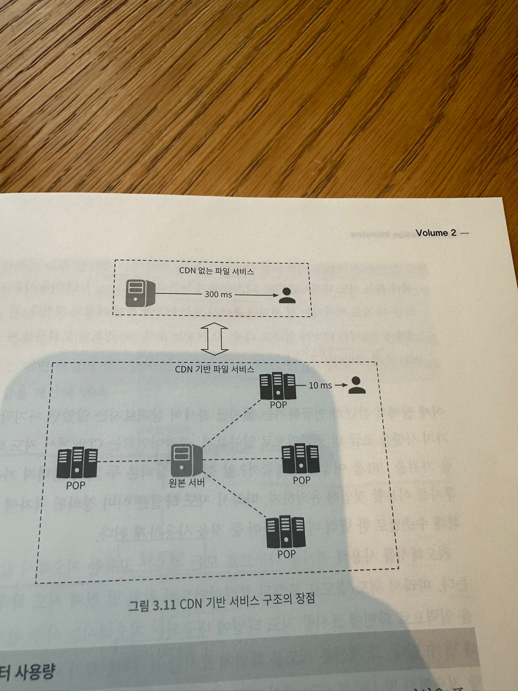

# 구글 맵 

이번 장에서는 단순한 형태의 구글 맵을 설계해 보도록 하자.  
구글은 2005년에 웹 기반 지도 서비스 구글 맵을 개발했다.  
구글 맵은 위성 이미지, 거리 뷰, 실시간 교통 상황, 경로 계획 등 다양한 서비스를 제공하고 있다.

## 1단계: 문제 이해 및 설계 범위 확정 
면접관과의 대화 사례 
> 지원자: 일간 사용자 수는 어느 정도로 가정할까요?  
> 면접관: 10억 DAU 를 가정하시면 됩니다.
> 지원자: 어느 기능에 초점을 맞추어야 합니까?   
> 면접관: 위치 갱신, 경로 안내, ETA, 지도 표시 등에 초점을 맞추죠.  
> 지원자: 도로 데이터는 어느 정도 규모 입니까?  
> 면접관: 도로 데이터는 가공 되지 않은 수 TB 수준입니다.  
> 지원자: 교통 상황도 고려 대상일까요?  
> 면접관: 네. 교통 상황은 도착 시간을 정확하게 추정하는 데 아주 중요합니다.  
> 지원자: 어떻게 이동하는지도 고려해야 할까요?  
> 면접관: 다양한 이동 방법을 지원할 수 있어야 합니다.  

### 기능 요구 사항
이번 장에서는 아래 세 가지 기능에 집중할 것이다. 지원할 단말은 스마트폰이다. 

- 사용자의 위치 갱신 
- 경로 안내 서비스 (ETA 서비스 포함)
- 지도 표시 

### 비기능 요구사항 및 제약 사항 

- 정확도: 사용자에게 잘못된 경로를 안내하면 안 된다.
- 부드러운 경로 표시: 경로 안내 지도는 화면에 부드럽게 표시되고 갱신되어야 한다. 
- 데이터 및 배터리 사용량: 클라이언트는 가능한 최소한의 데이터와 베터리를 사용해야 한다.
- 일반적으로 널리 통용되는 가용성 및 규모 확장성 요구사항을 만족해야 한다. 

설계에 들어가기 전에 기본 개념 및 용어를 소개하겠다. 

### 지도 101

**측위 시스템**  
측위 시스템은 구 표면 상의 위치를 표현하는 체계를 말한다.  
위경도 기반 측위 시스템의 경우 최상단에 북극이고 최남단은 남극이다.
(위경도 설명 생략)

**3차원 위치의 2차원 변환**  
3차원 구 위의 위치를 2차원 평면에 대응 시키는 절차를 '지도 투영법' 또는 '도법' 이라고 부른다.  
도법은 다양하며, 각각은 다른 도법과의 차별되는 장단점을 갖는다.
   
구글 맵은 메르카토르 도법을 조금 변경한 웹 마르카토르 도법을 택하고 있다.  

**지오코딩**  
지오코딩은 주소를 지리적 측위 시스템의 좌표로 변화하는 프로세스다.  
ex) 앰파이어 파크웨이, 마운틴 뷰, CA 를 위도 37.423021 경도 -122.083739  
위경도를 다시 주소로 변환하는 것을 역 지오코딩이라 부른다.
  
지오코딩을 수행하는 한 가지 방법은 인터폴레이션이다.  
GIS 와 같은 다양한 시스템이 제공하는 데이터를 결합한다는 뜻이다.  

**지오해싱**  
지오해싱은 지도 위 특정 영역을 영문자와 숫자로 구성된 짧은 문자열에 대응시키는 인코딩 체계다.  
2차원의 평면 공간으로 표현된 지리적 영역 위의 격자를 더 작은 격자로 재귀적으로 분할해 나간다.  
어떤 격자를 재귀적으로 분할 한 결과로 생성된 더 작은 격자에는 0부터 3까지 번호가 부여된다.  
  
ex) 20,000km / 10,000 km 영역이 주어졌다고 하자.  
이 영역을 분할하면 네 개의 10,000 x 5,000 크기 영역이 만들어지고 각가에는 00, 01, 10, 11 번호가 붙는다.  
     
각 영역을 더 분할해야 한다면 똑같은 방식을 따른다. 결과로 5,000 x 2,500 사분면이 만들어 질 것이다. 
원하는 크기의 격자가 될 때 까지 이 과정을 반복한다.  
  
본 설계안은 맵 타일 관리에 지오해싱을 적용한다.  

**지도 표시**  
지도를 화면에 표시하는데 가장 기본이 되는 개념은 타일이다.  
지도 전부를 하나의 이미지로 표현하지 않고 작은 타일로 쪼개어 표시하는 것이다.  
클라이언트는 사용자가 보려는 영역에 관계된 타일만 다운받아 이어 붙인 다음 화면에 뿌린다.  
지도의 확대 수준에 따라 다른 종류의 타일을 준비해야 한다. 
클라이언트는 확대 수준에 근거하여 타일의 크기를 가져올지 고른다.  

**경로 안내 알고리즘을 위한 도로 데이터 처리**  
대부분의 경로 탐색 알고리즘은 다이크스트라, A* 경로 탐색 알고리즘의 변종이다.  
그 가운데 최적의 하나를 정하는 것은 어려운 문제로 이번 장에서 다루지는 않는다.  
중요한 것은 모든 경로 탐색 알고리즘은 교차로를 '노드'로 도로는 '노드를 잇는 선(간선)' 으로 표현하는 그래프 자료 구조를 가정한다는 것이다.  
       
경로 탐색 알고리즘의 성능은 주어진 그래프의 크기에 아주 민감하다.  
전 셰계 도로망을 하나의 그래프로 표현하면 경로 탐색에 많은 자원이 든다.  
그래서 그래프를 관리 가능한 단위로 분할할 필요가 있다.  
  
도로망을 더 작은 단위로 분할하는 방법 가운데 하나는 지오해상과 비슷한 분할 기술을 적용하여 세계를 작은 격자로 나누고,
격자 안의 도로망을 노드와 선으로 구성된 그래프 자료구조로 변환한다.  
이 때 각 격자는 경로 안내 타일이라 부른다. 각 타일은 다른 타일에 대한 참조를 유지한다.  
그래야 경로 탐색 알고리즘이 연결된 타일들을 지나갈 때 보일 더 큰 도로망 그래프를 만들어 낼 수 있다.  
  

**계층적 경로 안내 타일**  
경로 안내가 효과적으로 동작하려면 필요한 수전의 구체성을 갖추 도로 데이터가 필요하다.  
예를들어 국토 종단 여행을 위한 경로 탐색을 하려는데 지번 수준의 타일을 가지고 알고리즘을 돌리면 결과를 얻는데 너무 오랜시간이 걸린다.  
그래서 보통 구체성 정도를 상, 중, 하로 구분하여 세 가지 종류의 경로 안내 타일을 준비한다.  

- 상 타일: 가장 구체성이 높은 타일로 크기는 아주 작으며 지방도로 데이터만 둔다.
- 중 타일: 더 넓은 지역을 커버하며 관할구를 잇는 간선 도로 데이터만 둔다. 
- 하 타일: 구체성이 가장 낮은 타일로 도시와 주를 연결하는 주요 고속도로 데이터만 둔다. 

각 타일에는 다른 정밀도 타일로 연결되는 선이 있을 수 있다.  
예를들어 지방도 A 에서 고속도로 F 로 진입하는 경로를 표시하려면 도로 A 의 노드에서 도로 F 노드 사이의 연결 선이 있어야한다.  
  

### 개략적 규모 추정 
이제 풀어야 할 문제 규모를 간단히 추정해보자.  
설계 초점이 모바일 단말이므로, 데이터 사용량과 배터리 효율을 중요하게 따져봐야 한다.  

**저장소 사용량**  
다음 세 가지 종류의 데이터를 저장해야 한다. 

- 세계지도: 상세한 저장 용량 계산식은 잠시 후 다룬다. 
- 메타 데이터: 각 지도 타일의 메타데이터는 크기 아주 작아서 무시해도 지장이 없을 정도이기 때문에 본 추정에서는 무시한다. 
- 도로 정보: 외부에서 받은 수 TB 용량의 도로 데이터를 보유하고 있음을 알 수 있다. 이 데이터를 경로 안내 탈로 변환하여야 한다. 

세계지도  
지원하는 확대 수준 별로 지도 타일을 한 벌씩 두어야 한다.  
그 타일 전부를 보관하는 데 필요한 용량을 가늠하려면 최대 확대 수준에 따른 타일 개수를 따져보면 좋다.  
지도를 확대할 때마다 하나의 타일을 네 장의 타일로 펼친다고 가정하자.  
세계지도를 21번 확대하여 볼 수 있으려면 약 4.4조개의 타일이 필요하다.  
  
한 장의 타일이 256x256 픽셀 압축 PNG 파일이라면 한 장당 100KB 저장 공간이 필요하므로, 
최대 확대 시 필요 타일을 전부 저장하는 데는 총 4.4조 x 100KB = 440PB 의 저장 공간이 필요할 것이다.  
하지만 지구 표면의 90% 는 인간이 살지 않는 자연 그대로의 바다, 사막, 호수, 산간 지역임에 유의하자.  
이 지역들은 아주 높은 비율로 압축 할 수 있으므로, 보수적으로 보아 80%~90% 의 저장 용량을 절감 할 수 있다.  
따라서 44PB, 88PB 가량으로 저장 공간 요구량이 줄어든다. 어림잡아 50PB 필요하다고 보고 넘어가자.  
  
표 3.1 을 보면 확대 수준이 1 떨어질 때마다 필요한 타일의 수는 1/4 로 줄어든다.  
따라서 저장 공간 요구량도 1/4 줄어들 것이다. 이를 토대로 계산하면 50 + 50/4 + 50/16 ... = ~67PB 정도로 추정할 수 있다.  
  
서버 대역폭  
서버 대역폭을 추정하기 위해 어떤 유형의 요청을 처리해야 하는지 살펴봐야 한다.  
서버가 처리하는 요청은 크게 2가지다.  

- 경로 안내 요청: 클라이언트가 경로 안내를 시작할 때 전송하는 메시지  
- 위치 갱신 요청: 경로 안내를 진행하는 동안 변경된 사용자의 위치를 전송하는 메시지 

구글 맵에서는 이 위치 정보를 실시간 교통 상황 데이터 계산 과정의 입력으로 사용하는 등 다양하게 이용한다.  
  
서버 대역폭을 분석해보자.  
DAU 는 10억이고 경로 안내 기능을 평균적으로 주당 35분 사용한다고 가정하자.  
이를 계산하면 주당 350억분, 즉 하루에 50억분이다.  
위치 정보 갱신을 위한 간단한 접근법 중 하나는 GPS 좌표를 매초 전송하는 것인데(폴링),
그러면 하루에 3000(50억분 x 60)억 건의 요청이 발생하고 300만 QPS 에 해당한다.  
하지만 매초 GPS 를 전송하는 대신 요청을 클라이언트 쪽에서 모아 두었다가 덜 자주 보내도록 하면(15초, 30초) 쓰기 QPS 를 낮출 수 있을 것이다.  
얼마나 자주 보낼 지는 사용자의 이동 속도 등 다양한 요건에 좌우된다.  
사용자가 꽉 막힌 도로에 있다면 GPS 위치 업데이트를 자주 보내지 않아도 된다.  
15초 마다 한 번씩 서버로 보낸다고 가정하자. 이렇게 하면 QPS 는 20만으로 줄어든다. 

## 2단계: 개략적인 설계안 제시 및 동의 구하기 

### 개략적 설계안 

  
이 설계안은 세 가지 기능을 제공한다.

- 위치 서비스
- 경로 안내 서비스 
- 지도 표시 

**위치 서비스**  
위치 서비스는 사용자의 위치를 기록하는 역할을 담당한다.  
클라이언트가 t초 마다 자기 위치를 전송한다고 가정한다. 여기서 t는 설정이 가능한 값이다.  
이렇게 주기적으로 위치 정보를 전송하면 몇 가지 좋은 점이 있다.

- 첫번째 해당 데이터 스트림을 활용하여 시스템을 점차 개선 할 수 있다는 점이다. 실시간 교통 상황을 모니터링하는 용도로 사용할 수 있다. 
- 두번째는 위치 정보가 거의 실시간 정보에 가까우므로 ETA 를 좀 더 정확하게 산출 할 수 있고, 교통 상황에 따라 다른 정보를 안내 할 수도 있다는 점이다.
  
하지만 사용자 위치가 바뀔 때 마다 즉시 서버로 전송해야 할까?  
위치 이력을 클라이언트에 버퍼링해 두었다가 일괄 요청하면 전송 빈도를 줄일 수 있다.  
  
그림 3.9 를 보면 위치 변경 내역은 매초 측정하지만 서버로는 15초마다 한 번 보내도록 설정해 놓은 사례다.  
이렇게 갱신 요청 빈도를 줄여도 높은 쓰기 요청 빈도에 최적화 되어 있고 확장이 용이한 카산드라 같은 데이터베이스가 필요하다.  
또한 카프카 같은 스트림 처리 엔징을 활용해 위치 데이터를 로깅해야 할 수도 있다.  
  
**경로 안내 서비스**  
이 컴포넌트는 A에서 B 지점으로 가는 합리적으로 빠른 경로를 찾아주는 역할을 담당한다.  
결과를 얻는 데 드는 지연 시간은 어느 정도 감내 할 수 있다.  
해당 경로가 최단 시간 경로일 필요는 없으나 정확도는 보장되어야 한다.  
  
해당 API 의 요청 예제
```shell
GET /v1/nav?origin=1355+market+street,SF&destination=Disneyland

{
  'distance': {'text': '0.2 mi', 'value': '259'},
  'duration': {'text': '1 min', 'value': 83},
  'end_location': ...
  'start_location': 
  'geocoded_waypoints': 
  'travel_mode': 'DRIVING'
}
```
  
**지도 표시**  
이전에 살펴 본 바에 따르면 확대 수준별로 한 벌씩 지도 타일을 저장하려면 수백 PB 가 필요하다.  
그 모두를 클라이언트에 저장하는 것은 실용적인 방법이 아니다.  
클라이언트는 위치 및 현재 확대 수준에 대한 정보를 제공하고 필요한 타일을 서버에서 가져오는 접근법이 적합하다.  
그렇다면 클라이언트는 언제 타일을 서버에서 가져올까?  

- 사용자가 지도를 확대 또는 이동 시킬 때 
- 경로 안내를 진행하는 동안 사용자의 위치가 현재 지도 타일을 벗어나 이동한 경우 

다량의 지도 타일 데이터를 서버에서 효과적으로 가져오려면 어떻게 해야 하는지 알아보자.  
  
선택지 1  
클라이언트의 위치, 현재 클라이언트가 보는 지도의 확대 수준에 근거해 지도 타일을 즉석에서 만드는 방법이다.  
사용자의 위치 + 확대 수준 조합이 굉장히 많다는 것을 고려하면 이 방법에는 큰 문제점들이 존재한다.  

- 모든 지도 타일을 동적으로 만들어야 하는 서버에 부하가 있다.
- **캐시**를 활용하기 어렵다.
  
선택지 2  
확대 수준별로 미리 만들어 둔 지도 타일을 클라이언트에 전달하는 방법이 있다.  
각 지도 타일은 지오 해싱들으로 분할 된 정적인 데이터이다.  
클라이언트는 현재 확대 수준에 근거하여 지도 타일 집합을 결정한다. 
그리고 서버에서는 미리 만들어준 정적 이미지를 CDN 등을 이용하여 제공한다.  
  
위 그림을 보면 클라이언트는 CDN 에 미리 만들어둔 지도 타일을 요청한다.  
CDN 을 통해 서비스 된 적이 없는 경우 (캐시 미스) CDN 은 원본 서버에서 해당 파일을 가져와 캐시 한 다음 클라이언트에 응답한다.  
그 뒤로 같은 지도 타일에 대한 요청은 CDN 을 통해서 서비스 된다.  
이 접근법은 규모 확장이 용이하고 성능 측면에서도 유리하다.  
사용자에게 가장 가까운 POP(Point Of Presence)에서 파일을 서비스하기 때문이다. 
지도 파일은 정적이기 때문에 캐시를 통해 서비스 하기에 적합하다.  
  
모바일 데이터 사용량을 줄이는 것은 중요하다. 그러니 경로 안내를 진행하는 동안 클라이언트가 사용할 데이터 양을 계산해보자.  
클라이언트 캐시를 사용하면 데이터 사용량을 많이 줄일 수 있겠지만 여기서는 고려하지 않겠다.  
  
> 데이터 사용량  
> 사용자가 30km/h 속도로 이동중이며, 한 이미지가 200mx200m 영역을 표현한다고 하자.  
> 1kmx1km 를 표현하려면 이미지 25장이 필요하며 이는 저장 용량으로 환산하면 2.5MB(25x100KB) 이다.  
> 그러므로 30km/h 이동하면 시간당 75MB (30x2.5MB) 가 소진되며 이는 분당 1.25MB 이다.  
  
이제 CDN 데이터 사용량을 추정해보자. 주어진 문제의 규모를 보았을 때 비용도 생각해보아야 한다.  
> CDN을 통해 서비스 되는 트래픽 규모  
> 앞에서 설명 했듯이 우리는 매일 50억 분(minutes) 가량의 경로 안내를 처리한다.  
> 이는 50억 x 1.25MB = 6.25PB/day 에 해당하는 양이다.  
> 그러므로 초당 지도 데이터의 양은 62,500MB 에 달한다.  
> CDN 은 전세계에 흩어진 POP 로 서비스 될 것이고 200개 라고 가정하면 각 POP 당 62,500/200 PB 서비스 될 것이다. 
  
클라이언트는 CDN에서 지도 타일을 어떻게 가져올까? URL 을 어떻게 결정할까?  
지오해시를 사용해 격자를 나누므로 모든 격자는 고유한 지오해시 값을 갖는다.  
따라서 사용자의 위경도 + 확대 수준에 따른 지오해시 값을 쉽게 계산해 낼 수 있다.  
그 계산은 클라이언트가 수행하여 해당 지오해시 및 URL 로 CDN 에서 지도 타일을 가져오면 된다.  
ex) https://cdn.map-provider.com/tiles/9q9hvu.png  
  
앞에서 설명한 대로 지오해시를 클라이언트가 직접 수행해도 된다.  
하지만 해당 알고리즘을 클라이언트에 구현해 놓으면 서비스 해야 할 플랫폼이 늘어나면 문제가 될 수 있다.  
모바일 앱 업데이트는 시간도 많이 걸리고 때로는 위험한 프로세스이다.  
따라서 위도/경도 및 확대 수준을 타일 URL 로 변환하는 알고리즘을 별도 서비스로 둘 수 있다.  
이 서비스는 아주 간단한 서비스 이지만 운영 유연성이 높아지는 이점이 있으므로 고려할 가치가 있다.  
장단점을 면접관과 논의해보면 아주 흥미로울 것이다.  

## 상세 설계 

### 데이터 모델 
본 설계안에서는 네 가지 데이터를 취급한다.  
1. 경로 안내 타일 
2. 사용자 위치 
3. 지오코딩 데이터 
4. 미리 계산해 둔 지도 타일 데이터 

**경로 안내 타일**  
필요한 도로 데이터는 외부 사업자나 기관이 제공한 것을 이용한다고 밝힌 바 있다.  
이 데이터는 수 테라 바이트에 달하며 수집한 사용자의 위치 데이터를 이용해 끊임 없이 개선된다.  
데이터는 방대한 양의 도로 및 메타 데이터(이름, 관할구, 위/경도 등)으로 구성된다.  
그래프 자료 구조 형태로 가공되지 않은 데이터이므로 주어진 상태 그대로 경로 안내 알고리즘의 입력으로 사용할 수 없다.  
그러므로 "경로 안내 타일 처리 서비스" 가 오프라인 데이터 가공 파이프라인을 주기적으로 실행하여 경로 안내 타일로 변환한다.  
도로에서 발생한 새로운 경로 안내 데이터를 반영하기 위해서다.  
  
각 타일에는 그래프의 노드와 선분으로 표현된 해당 지역 내 교차로와 도로 정보가 들어있다.  
다른 타일의 노드와 연결되는 경우에는 해당 타일에 대한 참조 정보도 포함된다.  
경로 안내 알고리즘은 이 타일들이 모인 결과의 도로망 데이터를 소비한다.  
  
그렇다면 "경로 안내 타일 처리 서비스" 가 만들어 낸 가공 데이터는 어디에 저장해야 할까?  
그래프 데이터는 메모리에 인접 리스트 형태로 저장하는 것이 일반적이다.  
하지만 본 설계안에서 다루는 타일 데이터는 메모리에 저장하기에는 너무 많다.  
타일을 저장하는 효율적인 방법은 S3 같은 객체 저장소에 파일을 보관하고 그 파일을 이용할 경로 안내 서비스에서 적극적으로 캐싱하는 것이다.  
인접 리스트를 이진 파일 형태로 직렬화 해주는 고성능 소프트웨어 패키지는 많다.  
타일을 객체 저장소에 보관할 때는 지오해시 기준으로 분류해두는 것이 좋다. 그러면 위경도가 주어졌을 때 타일을 신속하게 찾을 수 있다.  
  
**사용자의 위치 데이터**   
이 데이터는 아주 값진 데이터로 도로 데이터 및 경로 안내 타일을 갱신하는데 사용되며, 실시간 교통 상황이나 교통상황 이력 데이터베이스를 구축하는 데도 사용된다.  
"데이터 스트림 프로세싱 서비스" 는 이 위치 데이터를 처리하여 지도 데이터를 갱신한다.  
위치 데이터를 저장하려면 많은 양의 쓰기 연산을 잘 처리할 수 있는 데이터 베이스가 필요하다.  
카산드라는 해당 기준을 잘 만족시키는 후보다.  
    
**지오코딩 데이터베이스**  
데이터베이스는 주소를 위/경도 쌍으로 변환하는 정보를 저장한다.  
레디스 처럼 빠른 일기 연산을 제공하는 키-값 저장소가 이 용도에 적당한데, 읽기 연산은 빈번한 반면 쓰기 연산은 드물게 발생하기 떄문이다.  
  
**미리 만들어 둔 지도 이미지**  
앞에서 설명 했지만 사용자의 요청한 지도 이미지는 정적이기 때문에 미리 만들어 캐싱하는 것이 효율적이다.  
이미지는 확대 수준별로 미리 만들어 두고 CDN 을 통해서 전송한다.  
CDN 원본 서버로는 아마존 S3 같은 클라우드 저장소를 활요한다.

### 서비스 
이제 구글 맵 구현에 가장 중요한 서비스들을 살펴보자. 
  
**위치 서비스**  
사용자의 위치 데이터는 키-값 데이터베이스를 이용한다.  
초당 백만 건의 위치 정보 업데이트가 발생한다는 점을 감안하면 쓰기 연산 지원이 탁월한 데이터베이스가 적합하다.  
NoSQL 데이터베이스나 열-중심 데이터베이스가 적합하다.  
한 가지 유의할 사항은 사용자의 위치 데이터는 계속 변화하며 변경되고 나면 이전 데이터는 무용지물이기 때문에 데이터 일관성 보다는 가용성이 더 중요하다는 점이다.  
CAP 정리에 따르면 일관성, 가용성, 분할 내성 모두를 만족 시킬 방법은 없다.  
그러므로 본 설계안에서는 가용성과 분할 내성 두 가지를 만족 시키는 데 집중한다.  
이 요구사항에 가장 적합한 데이터베이스 중 하나가 "카산드라" 이다.  
  
데이터베이스 키는 (user_id, timestamp) 조합을 사용하며, 값으로는 위도/경도 쌍을 저장한다.  
이 때 user_id 는 파티션 키이며 timestamp 는 클러스터링 키로 활용한다.  
user_id 를 파티션 키로 사용하는 이유는 특정 사용자의 최근 위치를 신속하게 읽어내기 위함이다.  
같은 파티션 키를 갖는 데이터는 함께 저장되며 클러스터링 키로 정렬되어 저장된다.  
이렇게 해두면 특정 사용자의 위치 이력도 효율적으로 조회할 수 있다.  
  
**사용자의 위치 데이터는 어떻게 이용되는가?**  
사용자의 위치 데이터는 중요한 데이터이다.  
이 데이터는 지도 데이터의 정확성을 점차 개선하는 입력으로도 활용될 수 있다.  
이런 용례를 지원하기 위해서 사용자 위치를 데이터베이스에 기록하는 것과 별개로 카프카 같은 메시지 큐에 로깅한다.  
카프카는 응답 지연이 낮고 많은 데이터를 동시 처리하기 위해 고안된 데이터 스트리밍 플랫폼으로 실시간 데이터 피드를 지원하기 위해 고안되었다.  
  
위 그림은 카프카를 활용하여 개선한 설계안이다.  
개별 서비스는 카프카를 통해 전달되는 사용자 위치 데이터 스트림을 각 용도에 맞게 활용한다.  
ex) 실시간 교통 상황 서비스는 해당 스트림을 통해 실시간 교통량 데이터베이스를 갱신한다.
결로 안내 타일 처리 서비스는 데이터를 활용해 신규 도로나 폐쇠 도록를 탐지하고 변경 내역을 경로 안내 타일에 반영함으로써 지도의 품질을 개선한다.  
  
**지도 표시**  

**지도 타일 사전 계산**  
구글 맵에서 지원하는 21개의 확대 수준을 지원한다. 본 설계안에서도 동일하다.  

- 확대 수준 0 : 세계를 256x256 하나의 이미지로 표현한다. 
- 확대 수준 1 : 세계를 4(2x2) 이미지로 표현한다. (각 이미지는 256x256)
- 확대 수준 2 : 세계를 16(4x4) 이미지로 표현한다.

확대 수준 1단계를 늘릴 때 마다 이전 수준의 4배씩 늘어난다.(4분할 하니까 ..)  
사용자는 확대 수준에 따른 지도의 상세 정보를 제공 받는다.  
클라이언트는 타일 다운 받기 위해서 많은 네트워크 대역폭을 소진하지 않고도 최적 크기의 지도를 표시할 수 있다.  
화면에 한 번에 표시 가능한 지도 타일 개수는 달라지지 않기 때문이다.  

  
  
**최적화: 벡터 사용**  
지도 표시에 WebGL 기술을 채택하면 어떤 혜택이 있을까?  
이미지를 전송하는 대신 경로(path)와 다각형(polygon) 등의 벡터 정보를 보내는 것이다.  
클라이언트는 수신된 경로와 다각형 정보를 통해 지도를 그려내면 된다.  
벡터 타일의 한 가지 분명한 장점은 이미지에 비해 월등한 압축률이다. 따라서 대역폭을 줄일 수 있다.  
기대할 수 있는 또 다른 장점은 훨씬 매끄러운 지도 확대 경험이다.  
래스터 방식 이미지(rasterized image)를 사용하면 클라이언트가 확대 수준을 높이는 순간에 이미지가 늘어지거 픽셀이 도드라져 보이는 문제가 있다.  
벡터화 된 이미지를 사용하면 클라이언트는 각 요소 크기를 적절하게 조정할 수 있어서 매끄러운 확대 경험을 제공할 수 있다.  
  
**경로 안내 서비스**  
이 서비스는 가장 빠른 경로를 안내하는 역할을 담당한다.  
  
지금 부터 이 그림에 등장하는 각 컴포넌트를 살펴보겠다.  
  
**지오코딩 서비스** 
주소를 위도와 경도 쌍으로 바꿔주는 서비스가 필요하다.  
주소의 표현 방식은 다양할 수 있다는 점을 고려해야 한다. (도로명, 지번)  
```shell
# 요청
https://maps.googleapis.com/maps/geocode/json?address=1600+amphitheartre+Parkway,+Mountain+View,+CA

# 응답 
{
  "results": [
    {
      "formatted_address": "1600 Amphitheatre Parkway, Mountain View, CA 94043, USA",
      "geometry": {
        "location": {
          "lat": 37.4224764,
          "lng": -122.0842499
        }
        "location_type": "ROOFTOP",
        "place_id": // ...
      }
    }
  ]
}
```
경로 안내 서비스는 이 서비스를 호출하여 출발지와 목적지 주소를 위/경도로 변환한 뒤 추후 다른 서비스 호출에 이용한다.  
  
**경로 계획 서비스**  
현재 교통 상황과 도로 상태에 입가하여 이동 시간 측면에서 최적화된 경로를 제안하는 역할을 담당한다.  
  
**최단 경로 서비스**  
출발지와 목적지 위도/경도를 입력으로 받아 k개 최단 경로를 반환하는 서비스이다.  
이 때 교통이나 도로 상황등은 고려하지 않는다.  
다시 말해서 도로 구조에만 의존하여 계산을 수행한다.  
도로망 그래프는 거의 정적이므로 캐시해 두면 좋다.  
이 서비스는 객체 저장소에 저장된 타일들에 대해서 A* 경로 탐색 알고리즘의 한 형태를 실행한다.  
- 입력으로 출발지와 목적지 위도/경도를 받는다. 이 위치 정보를 지오해시로 변환한 다음 출발지와 목적지 경로 안내 타일을 얻는다. 
- 출발지 타일에서 그래프 자료 구조를 탐색해 나간다. 탐색 범위를 넓히는 과정에서 주변 타일을 가져온다. 현재 노출되지 않는 같은 지역의 타일을 존재할 수 있음에 유의하자. 최단 경로가 확보 될 때까지 알고리즘은 검색 범위를 계속 확대해 나가면서 타일을 가져오는 작업을 반복한다.

아래 그림은 그래프 탐색 과정에서 타일이 어떻게 이용되는 지 보여준다.
  

**예상 도착 시간 서비스**  
경로 계획 서비스는 최단 경로 목록을 수신하면 예상 도착 시간 서비스를 호출하여 그 경로 각각에 대한 소요 시간 추정치를 구한다.  
예상 도착 시간 서비스는 기계학습을 활용해 현재 교통 상황 및 과거 이력에 근거하여 예상 도착 시간을 계산한다.  
이때 문제는 실시간 교통 상황 데이터만 필요한게 아니라 앞으로 10분에서 20분 뒤에 교통 상황이 어떻게 달리질지도 예측해야 한다는 것이다.  
이런 문제는 알고리즘 차원에서 풀어야 하며 궁금하면 [15][16] 을 참고하기 바란다.  
  
**순위 결정 서비스**  
경로 계획 서비스는 ETA 예상치를 구하고 나면 순위 결정 서비스에 관련 정보를 전달하여 사용자가 정의한 필터링 조건을 적용한다.  
필터링이 끝나고 남은 경로를 소요 시간 순으로 정렬하여 최단 시간 경로 k 개를 구한 다음 경로 안내 서비스에 반환한다.  
  
**중요 정보 갱신 서비스들**  
이 부류의 서비스는 카프카 위치 데이터 스트림을 구독하고 있다가 데이터를 비동기적으로 업데이트 하여 그 상태를 최신으로 유지하는 역할을 한다.  
실시간 교통 정보 데이터베이스나 경로 안내 타일 등이 그 사례이다.  
  
**적응형 ETA와 경로변경**  
현 설계안은 적응형 ETA 와 경로 변경을 허용하지 않는다.  
이 문제를 해결하려면 서버는 현재 경로 안내를 받고 있는 모든 사용자를 추적하면서 교통 상황이 달라질 때마다 각 사용자의 ETA 를 변경해 주어야한다.  
그러려면 다음 질문에 답할 수 있어야 한다. 
- 현재 경로 안내를 받고 있는 사용자는 어떻게 추적하는지?
- 수백만 경로 가운데 교통 상황 변화에 영향을 받는 경로와 사용자를 효율적으로 가려내는 방법은 무엇인지 ?

간단하긴 하지만 효율적이지 않은 방법부터 살펴보자.  
  
사용자가 안내 받은 경로가 위 그림처럼 구성되어 있다고 하자.  
경로 정보를 데이터베이스에 저장한다고 하면 아마도 아래처럼 저장할 것이다.  
```shell
user_1: r_1, r_2, r_3, .. r_k 
user_2: r_4, r_6, r_9, .. r_n 
user_3: r_2, r_8, r_9, .. r_m
...
```

이 때 r_2 에서 교통사고가 발생했다고 하자. 어떤 사용자가 영향을 받는지 알아내려면 레코드를 전수 조사해서 알아내야 한다.  
이 테이블에 보관된 레코드가 n 이고 경로의 평균 길이가 m 이라면 검색 시간 복잡도는 O(nxm) 일 것이다.  
  
검색 속도를 더 높일 방법은 없을까?  
경로 안내 사용자 각각의 현재 경로 안내 타일, 그 타일을 포함하는 상위 타일(즉 확대 수준이 더 낮은 타일), 그 상위 타일의 상위 타일을 출발지와 목적지가 모두 포함된 타일을 찾을때까지 재귀적으로 더하여 보관하는 것이다.  
  
위 그림이 하나의 레코드의 예시이다.  
이렇게 해두면 어떤 타일의 교통 상황이 변했을 때 경로 안내 ETA 달라지는 사용자는 데이터베이스 레코드 마지막 타일에 그 타일이 속하는 사용자다.  
그 이외의 사용자에게는 아무 영향이 없다. 검색 시간 복잡도가 O(n) 으로 줄어들기 때문에 좀 더 효율적이다.  
그러나 이 접근법은 교통 상황이 개선되었을 때 해야하는 일까지 해결해주지 않는다.  
예를들어 타일2의 교통 상황이 회복되어서 타일2를 지나가도 된다고 하자.  
경로 재설정 가능하다는 사실을 어떻게 감지하고 알릴 것인가?  
한 가지 방법은 현재 경로 안내를 받는 사용자가 이동 가능한 경로의 ETA를 주기적으로 재계산해서 더 짧은 ETA를 갖는 경로가 발견되면 알리는 것이다.  
  
**전송 프로토콜**  
경로 안내 중에 경로의 상황이 변할 수 있기 때문에 데이터를 모바일에 전송할 안정적인 방법이 필요하다.  
이 경우 서버에서 클라이언트로 데이터를 전송 할 수 있는 프로토콜은 "모바일 푸시 알림", "롱 폴링", "웹 소켓", "서버 전송 이벤트(SSE)" 등이 있다.  
- 모바일 푸시 알림: 보낼 수 있는 메시지 크기가 매우 제한적(ios 최대 4,096byte)이므로 사용하지 않는게 바람직하다.
- 웹소켓은 서버에 주는 부담이 크지 않아서 일반적으로 롱 폴링보다 좋은 방안이다.

본 설계안에서는 웹 소켓을 사용할 것이다. 양방향 통신을 지원하기 때문인데, 가령 패키지 상퓸이 목적지에 가까워졌을 때는 실시간 양방향 통신이 필요한 경우도 있기 때문이다.  
  
위 그림이 최종 설계안이다!
