# 분산 메시지 큐 
메시지 큐를 사용하면 얻을 수 있는 이점 
- 결합도 완화: 컴포넌트 간의 강한 결합이 사라짐 
- 규모 확장성 개선: 생산자와 소비자 시스템 규모를 트래픽 부하에 맞게 독립적으로 늘릴 수 있음 
- 가용성 개선: 특정 컴포넌트에 장애가 발생해도 다른 컴포넌트로 장애가 전파 되지 않음 
- 성능 개선: 메시지 큐를 이용하여 비동기 통신이 가능하여 생산자와 소비자는 기다릴 필요 없음 

## 메시지 큐 대 이벤트 스트리밍 플랫폼 
아파치 카프카는 메시지 큐가 아니라 "이벤트 스트리밍 플랫폼" 이다.  
하지만 메시지 큐(RabbitMQ)와 이벤트 스트리밍 플랫폼이 지원하는 기능이 서로 수렴하면서 그 경계가 점차 희미해짐  
예를들어 RabbitMQ 에서 옵션으로 제공하는 스트리밍 기능을 이용하면 데이터 추가만 가능한 로그를 통해 메시지를 반복적으로 소비할 수 있다.  
이번 장에서는 데이터 장기 보관, 메시지 반복 소비 등의 부가 기능을 갖춘 분산 메시지 큐를 설계해 볼 것이다.  

# 1단계: 문제 이해 및 설계 범위 확정 

> 지원자: 메시지의 format 과 평균 크기를 알려 주실수 있나요? 텍스트와 멀티 미디어도 지원해야 하나요?  
> 면접관: 텍스트 형태의 메시지만 지원하면 됩니다. 메시지의 크기는 수 KB 라고 보면 됩니다.  
> 지원자: 메시지는 반복적으로 소비 될 수 있어야 하나요?  
> 면접관: 네. 하나의 메시지는 여러 소비자가 수신 하는 것이 가능해야 합니다. 하지만 부가기능입니다.    
> 전통적인 분산 메시지 큐는 받아간 메시지는 지워버립니다.   
> 지원자: 메시지는 큐에 전달된 순서대로 소비되어야 하나요?  
> 면접관: 네. 그런데 이것도 부가 기능입니다. 전통적인 메시지 큐는 순서를 보장하지 않아요.  
> 지원자: 데이터의 지속성이 보장되어야 하나요?  
> 면접관: 네. 2주 정도 지속성을 보장해야 한다고 합시다.  
> 지원자: 지원해야 하는 생산자와 소비자의 수는 얼마나 됩니까?  
> 면접관: 많을 수록 좋죠.  
> 지원자: 어떤 메시지 전달 방식을 지원해야 하나요? at-most-once, at-least-once, exactly once 중에서요.  
> 면접관: at-least-once 는 반드시 지원해야 하구요. 이상적으로는 모두 지원하는 게 좋습니다.  
> 지원자: 대역폭과 end-to-end 지연 시간을 알려 주실 수 있으실까요?  
> 면접관: 로그 수집 등을 위해 사용할 수 도 있어야 하므로 높은 수준의 대역폭을 제공해야 합니다. 일반적인 메시지큐가 지원하는 전통적인 방법도 제공해야 하니 낮은 지연도 필수입니다.  

## 기능 요구사항 
- 생산자는 메시지 큐에 메시지를 보낸다  
- 소비자는 메시지 큐를 통해 메시지를 수신한다 
- 메시지는 반복적으로 소비 가능하고 단 한번만 수신하도록 설정할 수 있다 
- 오래된 이력 데이터는 삭제 될 수 있다 
- 메시지 크기는 킬로바이트 수준 
- 메시지가 생산된 순서대로 소비자에게 전달 한다 
- 메시지 전달 방식은 최소 한번, 최대 한번, 정확히 한번 모두 지원한다 

## 비기능 요구사항 
- 높은 대역폭과 낮은 전송 지연 가운데 하나를 설정할 수 있다 
- 규모 확장성. 분산 시스템이기 때문에 메시지가 급증해도 처리가 가능해야 한다 
- 지속성 및 내구성. 데이터는 디스크에 지속적으로 보관되어야 하며 여러 노드에 복제된다. 

## 전통적 메시지 큐와 다른점 
전통적인 메시지 큐는 메시지 보관 문제를 중요하게 다루지 않는다. 전통적인 큐는 메시지를 메모리에 보관한다.  
전통적인 큐는 순서도 보존하지 않는다. 생산된 순서와 소비되는 순서는 다를 수 있다.  

# 2단계: 개략적 설계안 제시 및 동의 구하기 
메시지 큐의 기본 기능부터 살펴 보자.  
  
- 생산자는 메시지를 발행 
- 소비자는 큐를 구독하고 메시지를 소비 
- 메시지 큐는 생산자와 소비자 사이의 결합을 느슨하게 하는 서비스 

## 메시지 모델 
가능 널리 쓰이는 메시지 모델은 일대일(point-to-point)과 발행 구독(publish-subscribe) 모델이다.  

### 일대일 모델 
전통적인 메시지 큐에서 흔히 발견되는 모델. 이 모델에서 큐에 전송된 메시지는 오직 한 소비자만 가져갈 수 있다.  
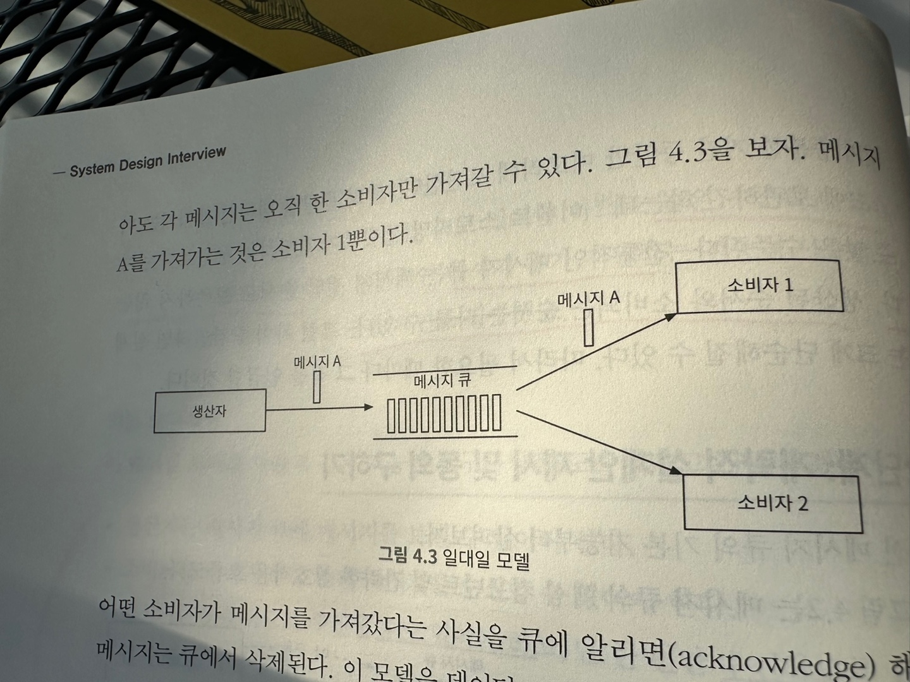  
메시지 A 를 가져가는 것은 소비자 1 뿐이다.  
소비자가 메시지를 가져갔다는 사실을 큐에 알리면 해당 메시지는 큐에서 삭제된다. 이 모델은 데이터 보관을 지원하지 않는다.  
반면 본 설계에서는 메시지를 2주 동안 보관해야 하는데 persistence layer 를 포함하여 해당 계층을 통해 메시지가 반복적으로 소비 될 수 있게 할 수 있다.  
본 설계안이 일대일 모델을 지원하긴 하지만 발행-구독 모델 쪽이 좀 더 자연스럽다.  

### 발행-구독 모델 
토픽이라는 새로운 개념을 먼저 소개한다. 토픽은 메시지를 주제별로 정리하는 데 사용된다.  
각 토픽은 메시지 큐 서비스 전반에 고유한 이름을 갖는다. 메시지는 토픽에 보내고 토픽에서 받는다.  
이 모델에서 토픽을 통해 전달된 메시지는 토픽을 구독하는 모든 소비자에게 전달된다.  
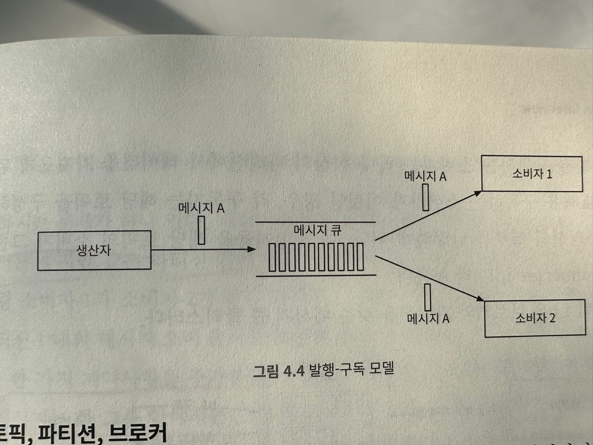  
본 설계안이 제시할 분산 메시지 큐는 발행-구독 모델은 토픽을 통해 구현할 수 있고 일대일 모델은 소비자 그룹을 통해 지원할 수 있다.  

## 토픽, 파티션, 브로커 
메시지는 토픽에 보관된다. 토픽에 보관되는 데이터 양이 커져서 서버 한 대로 감당하기 힘들게 되면 어떻게 될까?  
이 문제를 해결하는 방법은 파티션, 즉 샤딩 기법을 활용하는 것이다.  
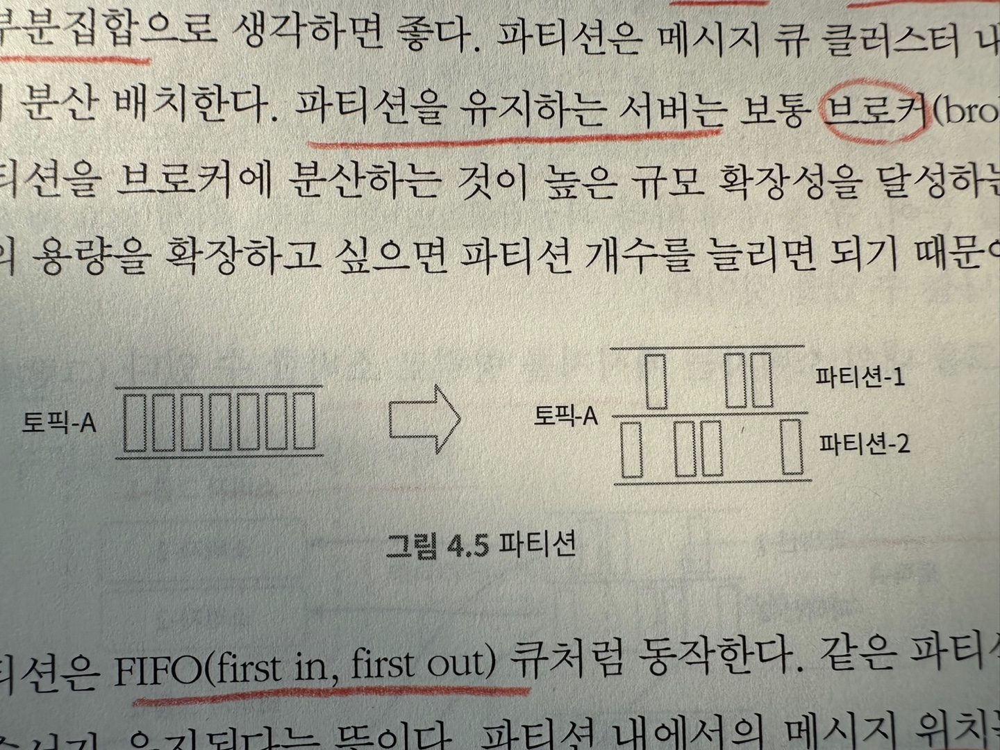  
위 그림 같이 토픽을 여러 파티션으로 분할해서 나눠 보낸다. 파티션은 토픽에 보낼 메시지의 작은 부분 집합으로 생각하면 좋다.  
파티션을 유지하는 서버를 보통 브로커라 부른다. 파티션을 브로커에 분산하는 것이 높은 규모 확장성을 달성하는 비결이다.  
토픽을 확장하고 싶다면 파티션 개수를 늘리면 되기 때문이다.  
각 파티션은 FIFO 큐처럼 동작한다. 파티션 내에서 메시지의 위치는 오프셋이라고 한다.  
메시지에는 사용자 ID 같은 키를 전달 할 수 있는데 같은 키는 같은 파티션으로 전송된다.  
키가 없는 메시지는 무작위 키를 생성하여 파티션으로 전달된다.  
토픽을 구독하는 소비자는 하나 이상의 파티션에서 데이터를 가져올 수 있다. 소비자가 여럿인 경우 이들을 소비자 그룹이라 한다.  
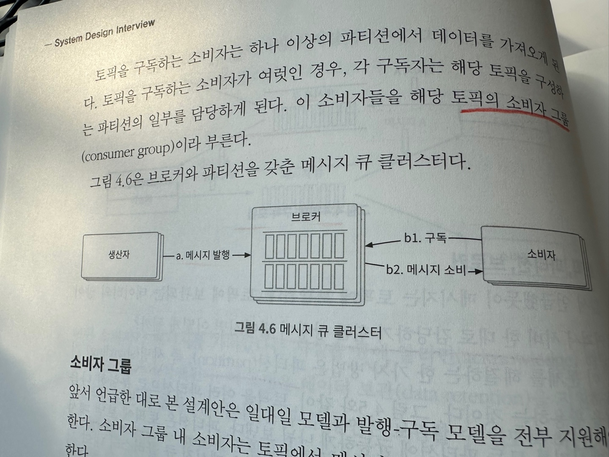  

## 소비자 그룹
소비자 그룹 내 소비자는 토픽에서 메시지를 소비하기 위해 서로 협력한다.  
하나의 소비자 그룹은 여러 토픽을 구독할 수 있고 오프셋을 별도로 관리한다.  
예를들어 과금용 그룹, 회계용 그룹을 나눌 수 있다.  
같은 그룹 내의 소비자는 메시지를 병렬로 소비할 수 있다.  
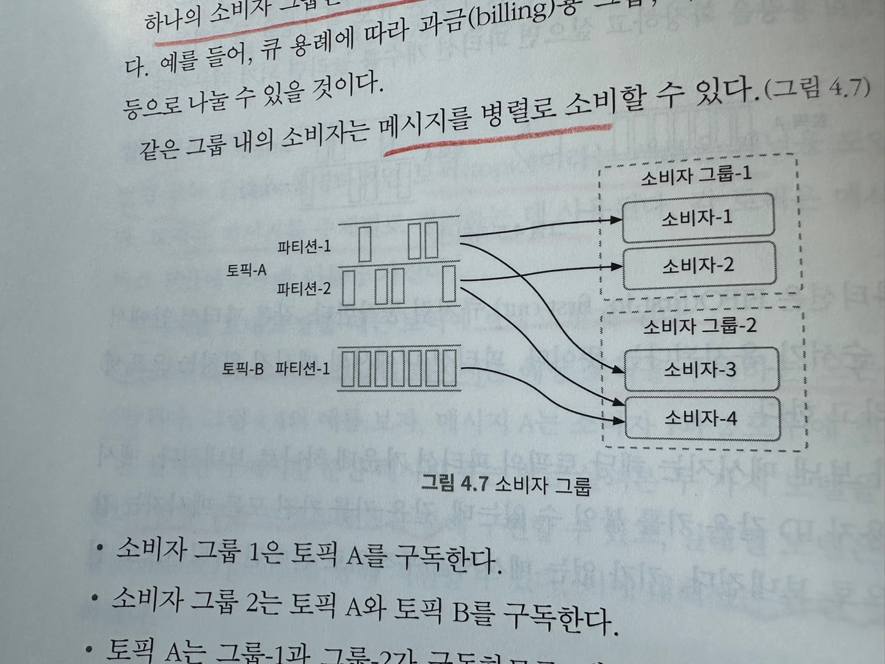  
- 소비자 그룹 1은 토픽 A 를 구독 
- 소비자 그룹 2는 토픽 A 와 토픽 B 를 구독 
- 토픽 A 는 그룹 1과 그룹 2 가 구독하므로 소비자에게 발행-구독 모델로 메시지가 전달 

하지만 문제가 하나 있다. 데이터를 병렬로 읽으면 대역폭 측면에서는 좋지만 같은 파티션 안에 있는 메시지를 순서대로 소비할 수 없다.  
예를들어 소비자 1과 소비자 2가 파티션 A 에서 메시지를 읽으면 순서를 보장할 수 없다.  
한 가지 제약을 추가해 이 문제를 해결할 수 있다. 어떤 파티션의 메시지는 한 그룹안에서는 한 소비자만 읽을 수 있도록 하는 것이다.  
다만 이렇게 되면 소비자의 수가 파티션의 수 보다 크면 토픽을 구독하지 못하는 소비자가 생긴다.  
위 그림에서 그룹 2에 있는 소비자 3은 토픽 B 의 메시지를 수신 할 수 없다.  
결국 같은 그룹내에서는 소비자 하나만 가져갈 수 있기 때문에 일대일 모델에 수렴하게 된다.  

## 개략적 설계안 
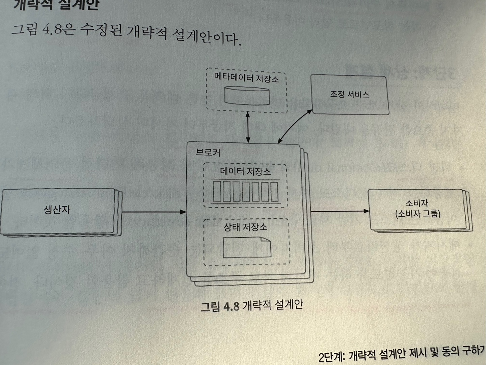  

클라이언트 
- 생산자: 메시지를 토픽으로 보낸다 
- 소비자 그룹: 토픽을 구독하고 메시지를 소비한다 

핵심 서비스 및 저장소 
- 브로커: 파티션을 유지 
- 저장소
  - 데이터 저장소: 메시지는 파티션 내 데이터 저장소에 보관 
  - 상태 저장소: 소비자 상태는 이 저장소에 보관 
  - 메타데이터 저장소: 토픽 설정, 토픽 속성 등은 이 저장소에 유지 
- 조정 서비스 
  - 서비스 탐색: 어떤 브로커가 살아있는 체크
  - 리더 선출: 브로커 가운데 하나는 컨트롤러 역할을 담당해야 하며 클러스터에는 반드시 활성 상태 컨트롤러가 있어야 함 (컨트롤러가 파티션 배치를 책임진다)
  - 아파치 주키퍼나 etcd 가 보통 컨트폴러 선출을 담당하는 컴포넌트로 이용된다.

# 상세 설계 
데이터 장기 보관과 높은 대역폭을 제공하기 위해서 3가지 결정을 내렸다.

- 회전 디스크는 높은 순차 탐색 성능과 현대적 운영체제가 제공하는 디스크 캐시 전략을 이용하는 디스크 기반 자료 구조를 활용할 것이다.
- 메시지가 생산자로부터 소비자에게 전달되는 순간까지 수정 없이도 전송이 가능하도록 하는 메시지 자료구조를 설계하고 운용할 것이다. (전송되는 데이터 양이 많은 경우 메시지 복사에 드는 비용을 최소화 하기 위해서)
- 일괄 처리를 우선시하는 시스템을 설계할 것이다. (소규모 I/O 가 많으면 높은 대역폭을 지원하기 어려움)

## 데이터 저장소 
메시지를 어떻게 지속적으로 저장할지 상세하게 살펴보자.    
가장 좋은 방법ㅂ을 선택하기 위해 메시지 큐의 트래픽 패턴부터 살펴본다.  

- 읽기와 쓰기가 빈번하게 일어남 
- 갱신/삭제 연산은 발생하지 않음 
- 순차적인 읽기/쓰기가 대부분

### 선택지 1: 데이터베이스 
- 관계형 데이터베이스: 토픽별로 테이블을 만들어 토픽에 보내는 메시지는 해당 테이블에 레코드로 저장 
- NoSQL: 토픽별로 컬랙션을 만들고 토픽에 보내는 메시지는 하나의 문서가 된다. 

데이터베이스라면 영속성 요구사항을 만족 시킬 수 있지만 이상적인 방법은 아니라고 할 수 있는데, 읽기/쓰기 연산이 동시에 대규모로 빈번하게 발생하는 상황을 잘 처리하는 데이터베이스를 만들기 어렵기 때문이다.  
따라서 본 설계안에서 데이터베이스는 좋은 선택이 아니며 오히려 병목을 야기할 수 있다.  

### 선택지 2: 쓰기 우선 로그(WAL: Write-Ahead Log)
WAL 은 새로운 항목이 추가되기만 하는 일반 파일이다.  
WAL 은 다양한 시스템에서 사용되는 기술로 MySQL 의 복구 로그나 아파치 주키퍼도 해당 기술을 이용한다.  
영속적인 메시지는 WAL 을 이용하여 저장하는 것을 추천한다. WAL 에 접근 패턴은 읽기/쓰기 모두 순차적이다.  
(접근 패턴이 순차적일 때 디스크는 아주 좋은 성능을 보인다.)  
아래 그림에서 보듯이 새로운 메시지는 파티션 꼬리 부분에 추가되며 그 결과 오프셋은 점진적으로 증가한다.  
오프셋의 구현하는 가장 쉬운 방법은 로그 파일의 줄 번호를 이용하는 것이다.  
하지만 파일의 크기가 무한정 커질 수 없기 때문에 세그먼트 단위로 나누는 것이 바람직하다.  
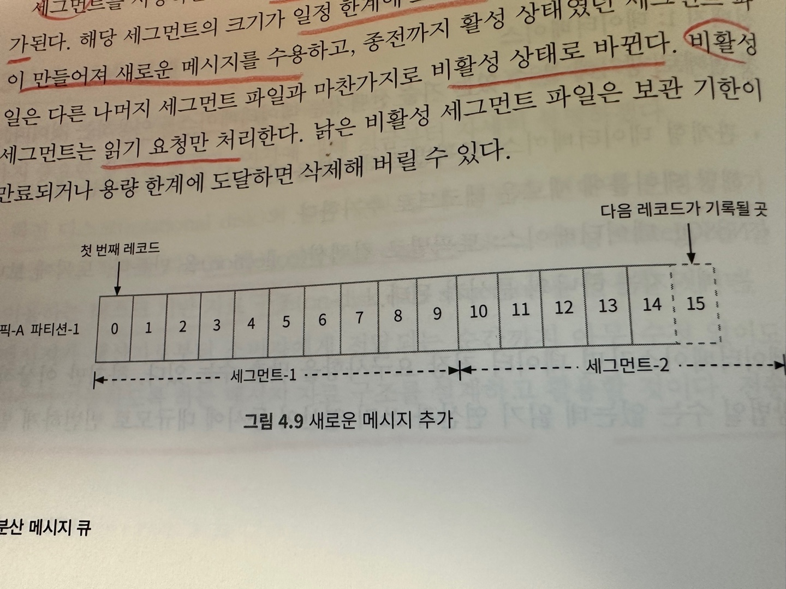  
세그먼트를 사용하는 경우 새 메시지는 활성 상태의 세그먼트 파일에만 추가된다.  
세그먼트의 크기가 한계에 도달하면 새 활성 세그먼트 파일이 만들어져 새 메시지를 수용하고 이전에 활성 상태였던 세그먼트는 비활성 상태로 바뀐다.  
비활성 세그먼트는 읽기 요청만 처리한다. 오래된 세그먼트 파일은 보관기간이 지난 뒤 삭제 할 수 있다.  
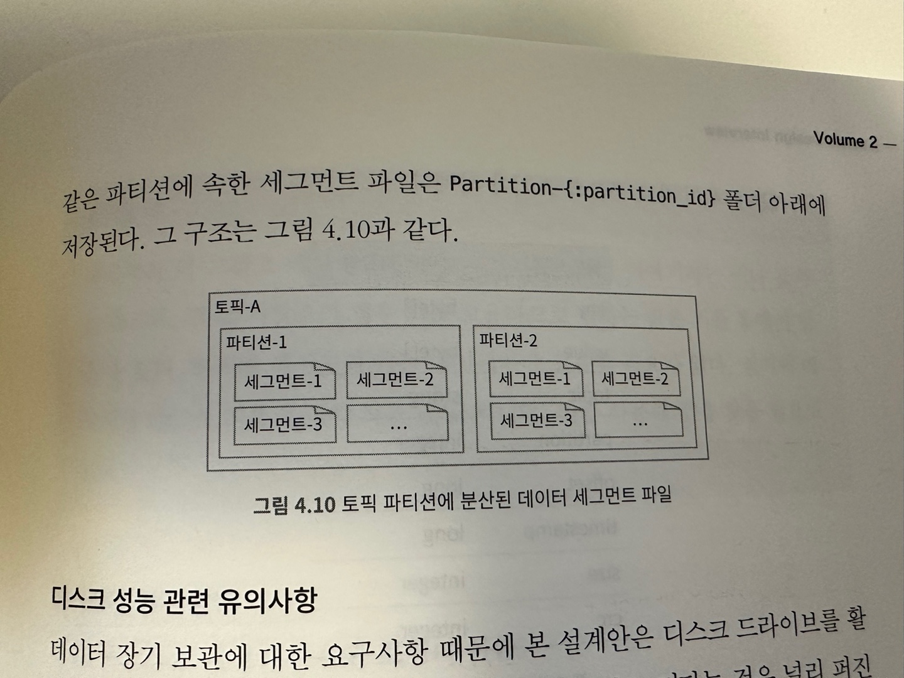  
같은 파티션에 속한 세그먼트 파일은 Partition-(:partition_id) 폴더 아래에 저장된다. 위 그림이 이를 설명한다.  

### 디스크 성능 관련 유의 사항 
본 설계안에서는 데이터 장기 보관을 위해서 디스크를 활용하고 있는데  
회전식 디스크가 느리다는것은 편견이다. 디스크가 느려지는 것은 데이터 접근 패턴이 무작위 일 때다.  
순차적 데이터 접근 패턴은 RAID 로 구성된 현대적 디스크 드라이브에서 수백 MB/s 수준의 읽기/쓰기를 달성하는 것은 어렵지 않다.  
우리의 요구사항을 충분히 만족하며 비용적인 측면에서도 유리하다.  
또한 현대적인 운영체제들은 디스크 캐시를 적극적으로 활용하며 WAL 도 OS의 디스크 캐시를 적극 이용한다.  

## 메시지 자료 구조 
메시지 구조는 높은 대역폭 달성의 열쇠이다. 메시지 구조는 생산자와 소비자간의 계약이다.  
본 설계안에서는 메시지가 전달되면서 불필요한 복사가 일어나지 않도록 함으로써 높은 대역폭을 달성할 것이다.  
컴포넌트 사이에 이 계약이 다른 경우 메시지는 변경이 일어나야 하고 이는 값비싼 복사가 발생하게 된다. 그 결과 성능은 낮아진다.

### 메시지 키 
키는 파티션을 정할 때 사용된다. 키가 주어지지 않으면 무작위로 결정된다.  
키가 주어진 경우 파티션은 hash(key) % numPartitions 공식에 따라 결정된다.  
더 유연한 설계가 필요하다면 생산자는 파티션 선정 메커니즘을 직접 정의 할 수도 있다.  
파티션 번호는 메시지 큐 내부적으로 상용되는 개념이므로 클라이언트에 노출되어선 안된다. (클라이언트에서 파티션 번호를 이용한 처리를 하면 안된다는 얘기)  
키를 파티션에 대응시키는 알고리즘을 적절히 정의해 놓으면 파티션 수가 달라져도 메시지가 모든 파티션에 균등히 분산되도록 할 수 있다. 

### 메시지 값 
메시지 값은 메시지의 내용, 즉 페이로드를 말한다.  
메시지의 값은 일반 텍스트, 압축된 이진 블록 일 수도 있다.  

### 메시지의 기타 필드 
- 토픽: 메시지가 속한 토픽의 이름 
- 파티션: 메시지가 속한 파티션의 ID 
- 오프셋: 파티션 내의 메시지의 위치 
- 타임스탬프: 메시지가 저장된 시각 
- 크기: 메시지의 크기
- CRC: 순환 중복 검사의 약자로 데이터의 무결성을 보장하는데 이용됨 

## 일괄 처리 
일괄 처리는 시스템 성능에 아주 중요하다. 이번 절에서는 메시지 큐 안에서 메시지를 일괄 처리를 위해 무슨일을 하는지 중점적으로 살펴본다.  
일괄 처리가 성능 개선에 중요한 이유는 다음과 같다.  

- 운영체제로 하여금 여러 메시지를 한 번의 네트워크 요청으로 전송하여 값비싼 네트워크 비용을 제거 할 수 있다.
- 브로커가 여러 메시지를 한 번에 로그에 기록하면 더 큰 규모의 순차 쓰기가 발생하고 운영체제가 관리하는 디스크 캐시에서 더 큰 규모의 연속된 공간을 점유하게 된다. 그 결과 높은 디스크 접근 대역폭을 달성할 수 있다.

그러나 높은 대역폭과 낮은 응답 지연은 동시에 달성하기 어려운 목표다.  
낮은 응답 지연을 위한 시스템에서는 전통적 메시지 큐로 이용하여 일괄 처리 메시지 양을 낮춘다. 이렇게 하면 디스크 성능은 다소 낮아진다.  
처리량을 높여야 한다면 토픽당 파티션의 수를 늘린다. 그래야 낮아진 순차 쓰기 연산 대역폭을 벌충할 수 있다.  

## 생산자 측 작업 흐름 
생산자가 어떤 파티션에 메시지를 보낸ㄴ다고 하자. 어느 브로커에 연결 해야 할까?
한 가지 해결책은 라우팅 계층을 도입하는 것이다. 이 계층은 '적절한' 브로커에 메시지를 전달하년 역할을 담당한다.  
브로커를 여러 개로 복제하며 운영하고 있다면 '적절한' 브로커는 '리더 브로커' 이다.  
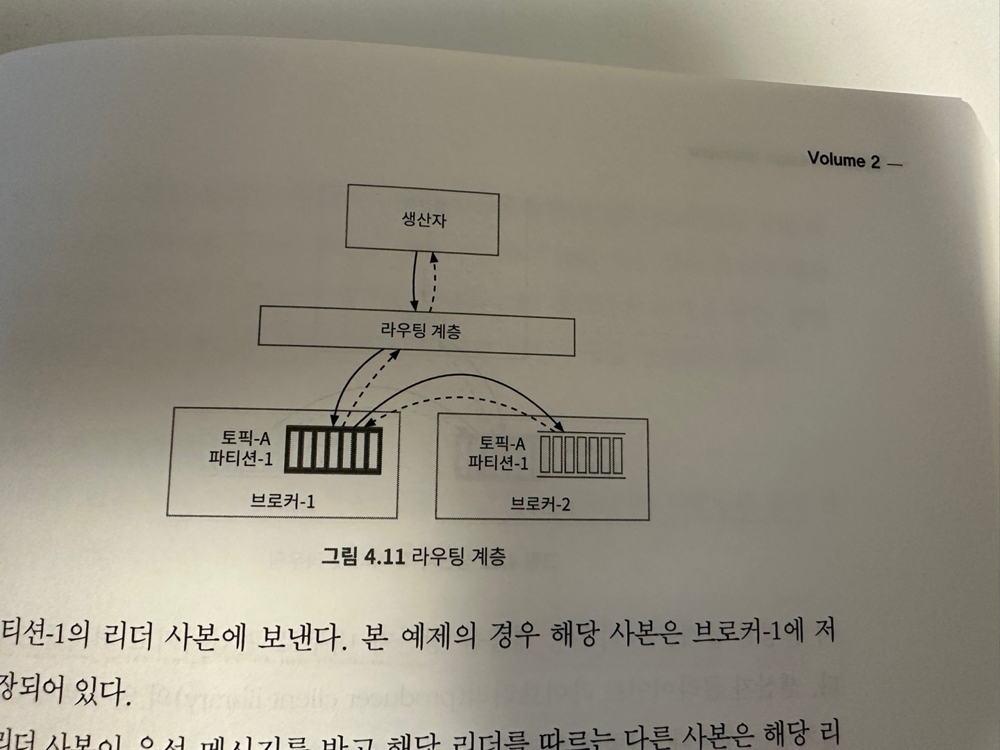  
위 그림을 보면 생산자는 토픽-A 의 파티션-1로 메시지를 보내려고 한다.

- 우선 생산자는 메시지를 라우팅 계층으로 보냄 
- 라우팅 계층은 메타데이터 저장소에서 사본 분산 계획을 읽어 자기 캐시에 저장하고 메시지가 도착하면 파티션-1의 리더에 보냄 
- 리더가 우선 메시지를 받고 해당 리더를 따르는 사본이 리더로 부터 데이터를 받음 
- '충분한' 수의 사본이 동기화 되면 리더는 데이터를 디스크에 기록 (데이터 소비 가능 상태가 되는 것이 이 시점) 후 생산자에게 회신 

라우팅 계층이 갖는 단점 
- 거쳐야 할 네트워크 노드가 하나 더 늘어나게 되므로 네트워크 전송 지연이 증가함 
- 일괄 처리가 가능하면 효율을 많이 높일 수 있는데 그 부분은 고려하지 않은 설계 

아래 그림은 이 문제를 고려하여 수정한 설계안이다.  
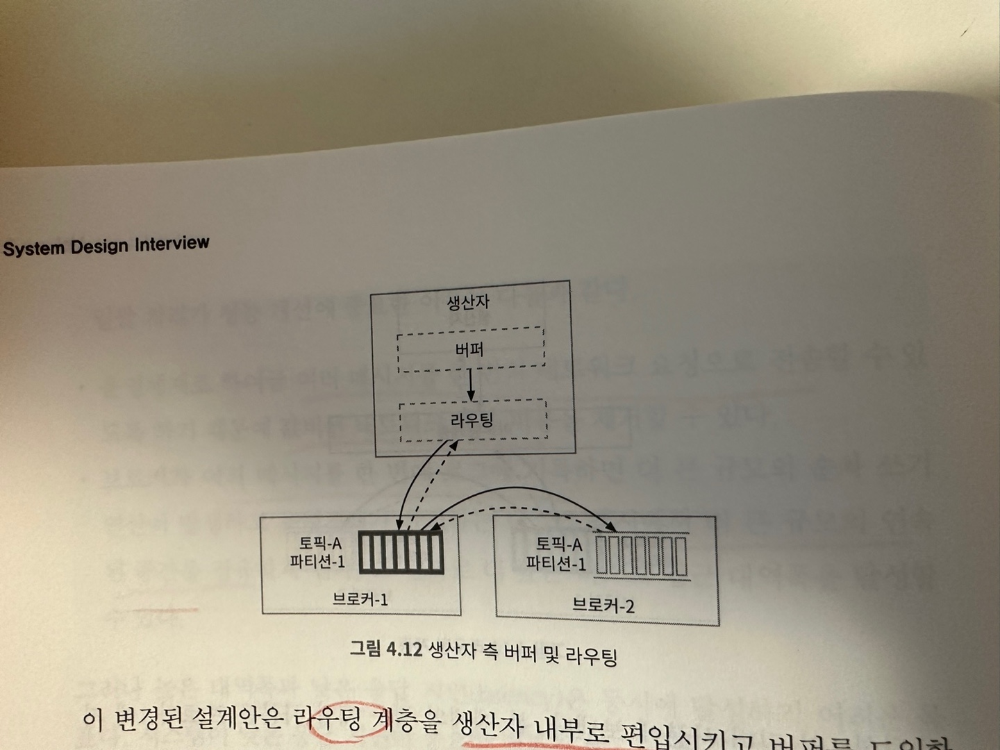  
변경된 설계안은 라우팅 계층을 생산자 내부로 편입시키고 버퍼를 도입한다.  
생산자 클라이언트 라이브러리의 일부로 생산자에 설치하는 것이다.  
이렇게 하면 몇 가지 장점이 있다.
- 네트워크를 거칠 필요가 없다. 전송 지연도 줄어든다.
- 생산자는 메시지를 어느 파티션에 보낼지 결정하는 자신만의 로직을 가질 수 있다. 
- 전송할 메시지를 버퍼 메모리에 보관했다가 목적지로 일괄 전송하여 대역폭을 높일 수 있다.

얼마나 많은 메시지를 일괄 처리하는 것이 좋을까?  
결국 대역폭과 응답 지연 사이에서 타협점을 찾는 문제다.  
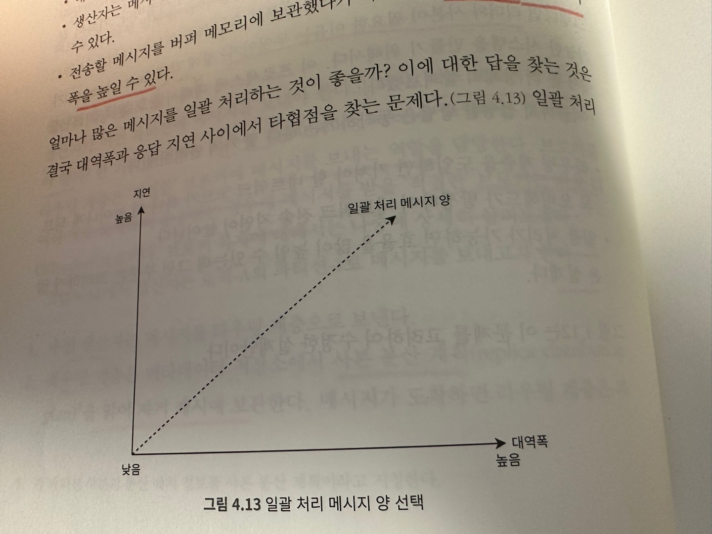  
위 그래프에서 일괄 처리할 메시지의 양을 늘리면 대역폭은 늘어나지만 응답 속도는 느려진다. (일괄 처리 할 양이 모두 모이지 않으니까)  
양을 줄이면 메시지는 더 빨리 전송하여 지연은 줄일 수 있지만 대역폭은 손해를 본다.  
메시지 큐의 용도를 감안하여 메시지의 양을 조절해야 한다.

## 소비자 측 작업 흐름 
소비자는 특정 파티션의 오프셋을 주고 해당 위치에서부터 이벤트를 묶어 가져온다.
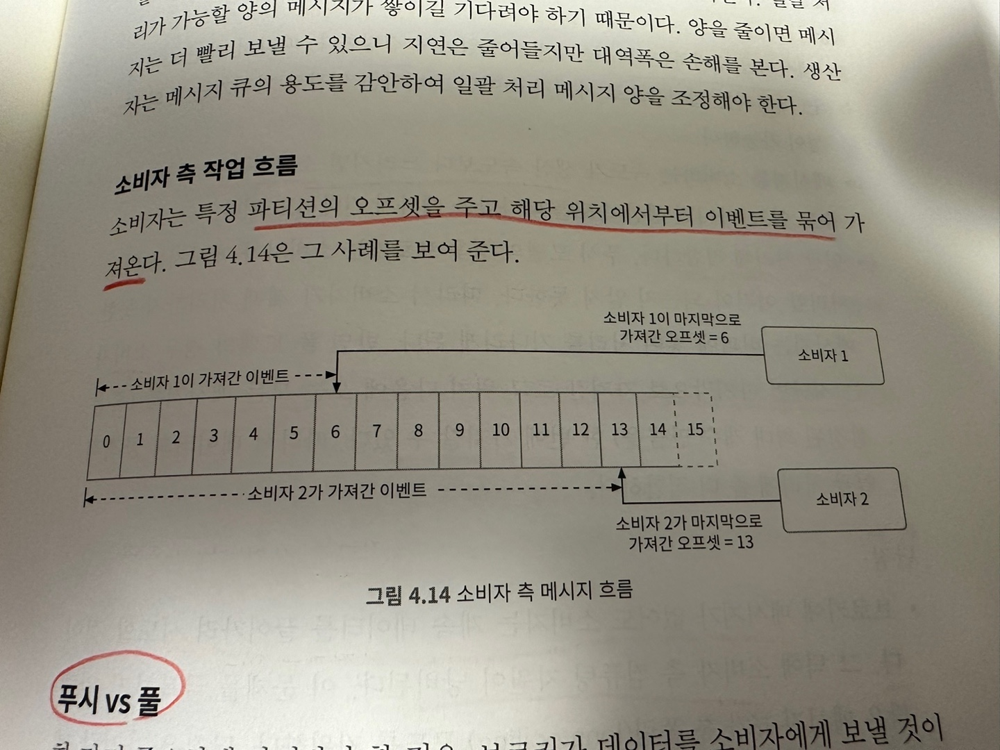  

### push vs pull 
소비자에게 메시지가 전달되는 방법은 2가지 이다.  
브로커가 소비자에게 전달하는 push 방식과 소비자가 브로커에서 가져가는 pull 방식  

### push 
장점
- 낮은 지연: 브로커는 메시지를 받는 즉시 소비자에게 보낼 수 있다. 

단점 
- 소비자가 메시지를 처리하는 속도가 생산자가 메시지 만드는 속도보다 느릴 경우 부하가 걸린다 
- 생산자가 데이터 전송 속도를 좌우하므로 소비자는 항상 그에 맞는 자원을 준비해 두어야 한다. 

### pull
장점 
- 메시지를 소비하는 속도는 소비자가 알아서 결정 
  - 따라서 어떤 소비자는 실시간으로 어떤 소비자는 일괄처리를 사용할 수 있다 
- 메시지를 소비하는 속도가 생산 속도보다 느려지면 소비자를 늘릴 수도 있고 소비될 때까지 기다릴 수 도 있다.
- 일괄 처리에 적합하다.
  - 풀 모델은 소비지가 마지막으로 읽은 메시지 이후 메시지들을 한 번에 가져 갈 수 있다 

단점 
- 브로커에 메시지가 없어도 소비자는 계속 메시지를 가져가려 시도한다
  - 그 결과 소비자 측 컴퓨팅 자원이 낭비된다 
  - 이 문제를 극복하기 위해 메시지 큐가 롱 폴링 모드를 지원한다. 
  - 당장 가져갈 메시지가 없더라도 일정 시간은 기다리도록 하는 것이다. 

이런 이유들로 대부분의 메시지 큐는 푸시 모델 대신 풀 모델을 지원한다.  
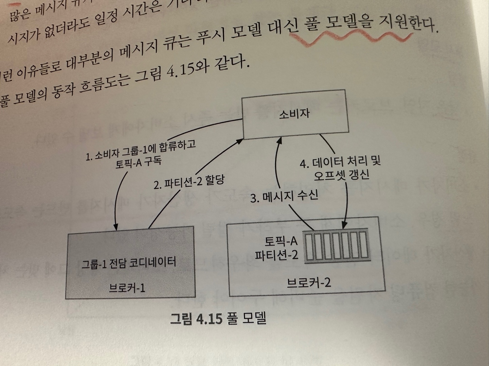  

1. 그룹-1에 합류하고 토픽-A 를 구독하기 원하는 새로운 소비자가 있다고 하자  
소비자는 그룹 이름을 해싱하여 접속할 브로커 노드를 찾는다.  
따라서 소비자 그룹은 동이한 브로커에 접속하고 이 노드를 코디네이터라 부른다.  
이 코디네이터는 소비자 그룹의 조정 작업을 담당한다.
2. 코디네티어는 해당 소비자를 그룹에 참여시키고 파티션-2를 해당 소비자에 할당한다.  
파티션 배치 정책에는 라운드 로빈 이나 범위 기반 정책 등 여러가지가 존재 
3. 소비자는 마지막으로 소비한 오프셋 이후 메시지를 가져온다.  
4. 소비자는 메시지를 처리하고 새로운 오프셋을 브로커에 보낸다.  
데이터 처리와 오프셋 갱신 순서는 메시지 전송 시맨틱에 영향을 미치는데, 이에 대해서는 잠시후 논의한다.

### 소비자 재조정
소비자 재조정은 어떤 소비자가 어떤 파티션을 챔임 지는지 다시 정하는 프로세스이다.  
소비자가 새롭게 합류 하거나, 기존 소비자가 그룹을 떠나거나, 장애가 발생하거나, 파티션 재조정이 필요할 때 발생한다.  
이 절차에서 코디네이터가 중요한 역할을 한다.  
코디네이터는 소비자 재조정을 위해서 소비자와 통신하는 브로커 노드로 소비자로 부터 오는 heartbeat 메시지를 살펴서 각 소비자의 파티션 내 오프셋 정보를 관리한다.  
아래 그림은 코디네이터가 소비자와 상호작용하는 예시이다.  
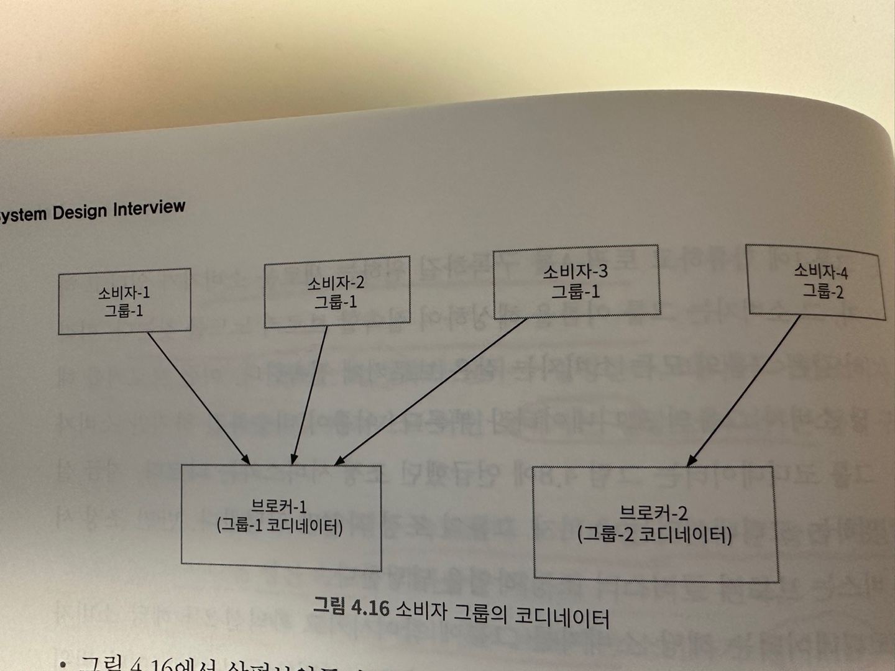  
- 각 소비자 그룹은 하나의 코디네이터에 연결된다. 
- 코디네이터는 연결된 소비자 목록을 유지한다. 이 목록에 변화가 생기면 새 리더를 선출한다. 
- 새 리더는 새 파티션 배치계획을 만들고 코디네이터로 전달한다. 코디네이터는 해당 계획은 그룹 내 다른 소비자에게 알린다.

코디네이터는 heartbeat 를 통해 소비자의 장애를 감지하고 장애가 감지되면 재조정 프로세스를 시작하여 파티션을 재배치한다.
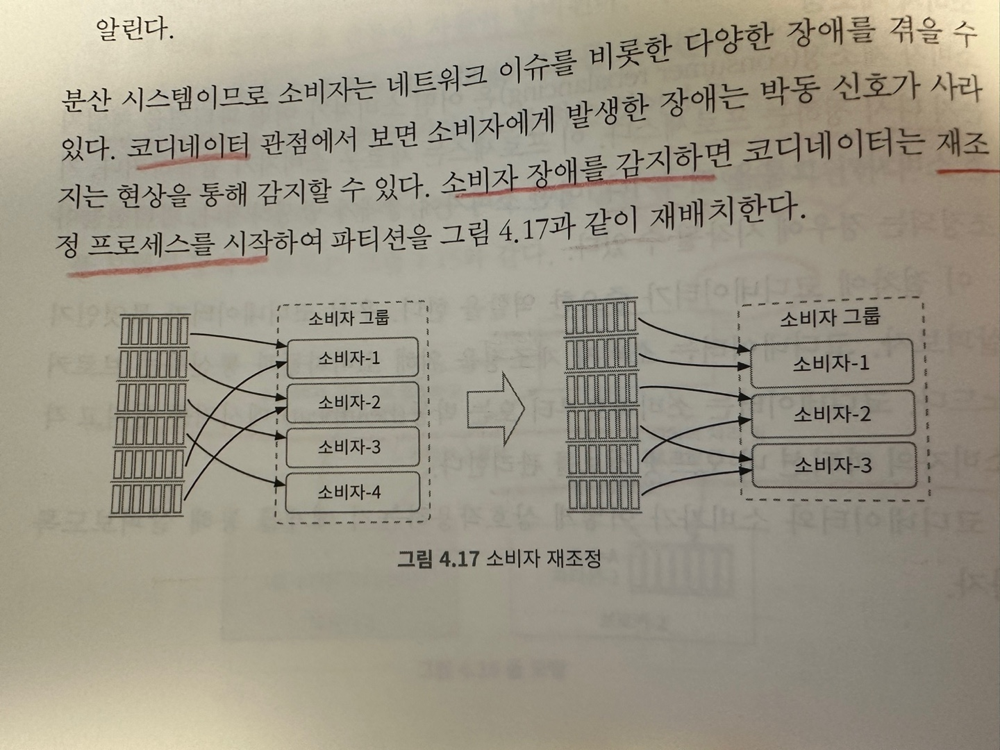  
  
지금부터 몇 가지 재조정 시나리오를 살펴보자. 소비자 수는 2로 가정하고 파티션은 4개로 가정한다.  
  
**새로운 소비자 참여**  
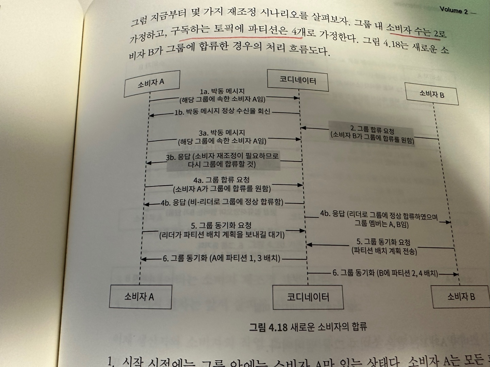  
1. 시작 시점에는 소비자 A만 그룹에 존재함 
2. 소비자 B가 그룹에 합류를 요청 
3. 코디네이터는 재조정이 필요한 시점으로 판단하고 모든 소비자에게 통지한다. 소비자 A의 heartbeat 가 왔을때 응답으로 그룹에 다시 합류하고 함 
4. 모든 소비자가 그룹에 합류하면 코디네이터는 한 노드를 리더로 선출하고 모든 소비자에게 알림 
5. 리더는 파티션 배치 계획을 생성해서 코디네이터에 전달하고 리더가 아닌 소비자는 코디네이터에게 파티션 배치 계획을 받아온다.
6. 소비자는 자신에게 배치된 파티션에서 메시지를 가져옴 
  
**소비자의 이탈**  
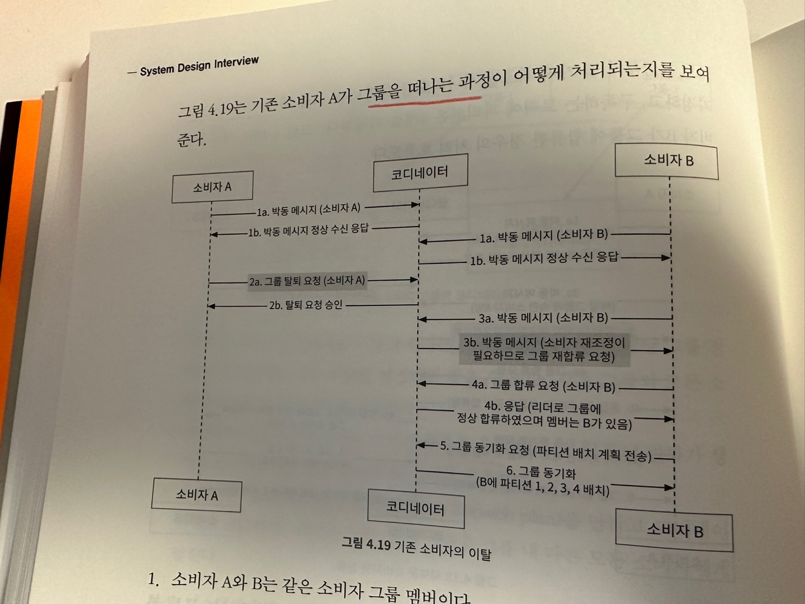  
1. 소비자 A, B 는 같은 그룹내 맴버 
2. 소비자 A가 가동 중단이 필요하여 그룹 탈퇴를 요청 
3. 코디네이터는 소비자 재조정이 필요한 시점으로 판단하고 소비자 B의 heartbeat 도착하면 응답으로 다시 합류하도록 전달
4. 나머지 절차는 이전과 동일 
  
**소비자 장애상황**  
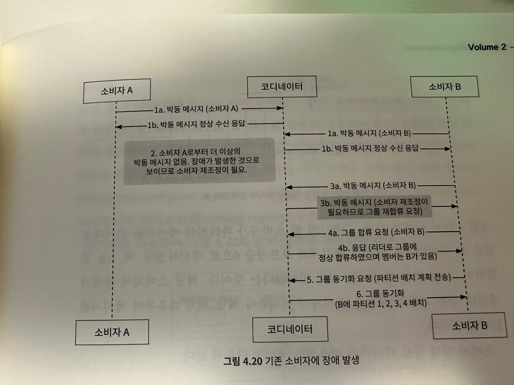  
1. 소비자 A, B 는 같은 그룹내 맴버 
2. 소비자 A 가 장애가 발생하여 더 이상 heartbeat 가 코디네이터에 전달되지 못함. 일정시간 동안 heartbeat 가 없으므로 코디네이터는 해당 소비자가 사라진 것으로 판단 
3. 코디네이터는 재조정 프로세스를 시작
4. 나머지는 이전과 동일 

## 상태 저장소 
브로커의 상태 저장소에는 다음과 같은 정보들이 저장됨 
- 소비자에 대한 파티션의 배치 관계 
- 각 소비자 그룹이 마지막으로 가져간 메시지의 오프셋

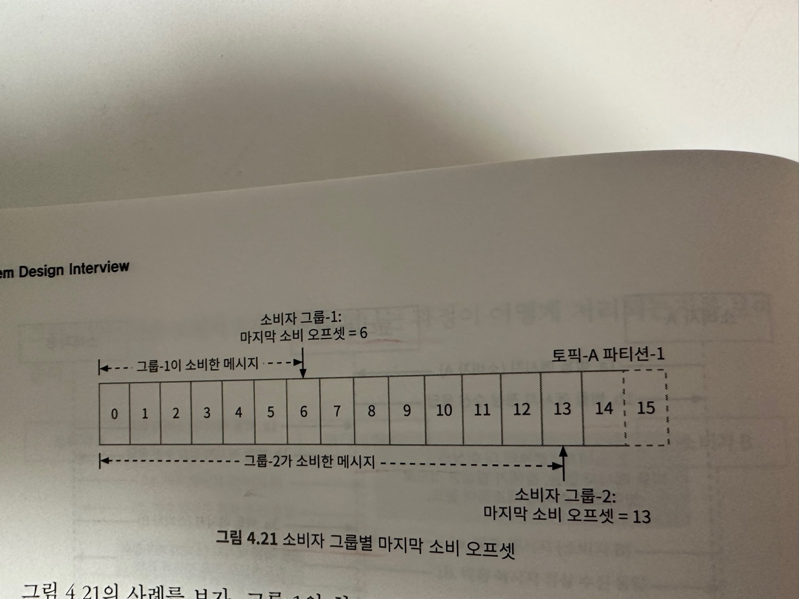
- 그룹-1 의 한 소비자가 파티션의 메시지의 오프셋을 6으로 갱신 
- 해당 소비자에 장애가 생기면 같은 그룹의 새로운 소비자가 이어받아 해당 위치 다음부터 메시지를 읽어감 

소비자 상태 정보 데이터가 이용되는 패턴 
- 읽기와 쓰기가 빈번하게 발생하지만 양은 많지 않음 
- 데이터 갱신은 빈번하게 일어나지만 삭제되는 일은 거의 없음 
- 읽기와 쓰기는 무작위 패턴
- 데이터의 일관성이 중요함 

어떤 저장소를 이용하는 것이 좋을까 ?  
데이터 일관성 및 높은 읽기/쓰기 속도에 대한 요구를 고려했을 때, 주키퍼 같은 키-값 저장소를 사용하는 것이 바람직하다.  

## 메타데이터 저장소 
저장소 에는 토픽 설정이나 속성 정보를 보관한다. 파티션 수, 메시지 보관 기간, 사본 배치 정보 등이 이에 해당한다.  
- 메타 데이터는 자주 변경되지 않으며 양도 적다.
- 하지만 높은 일관성을 요구한다 

따라서 주키퍼가 저장소로 적합하다. 

## 주키퍼 
주키퍼는 분산 메시지 큐를 설계하는 데 아주 유용하다.  
주키퍼는 계층적 키-값 저장소로 분산 시스템에서 필수적인 서비스이다.  
일반적으로 "분산 설정 서비스", "동기화 서비스", "이름 레지스트리" 등으로 이용된다.  

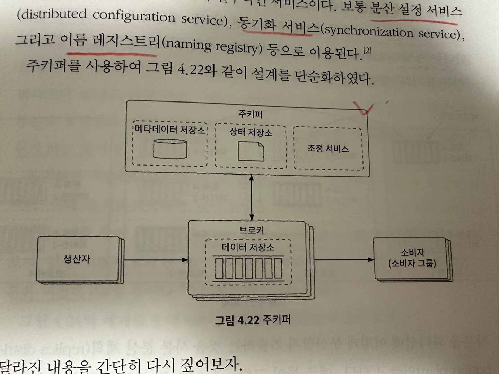  
주키퍼를 이용한 분산 메시지 큐 아키텍쳐 
- 메타 데이터와 상태 저장소는 주키퍼를 이용함 
- 브로커는 이제 메시지 데이터 저장소만 유지 
- 주키퍼가 브로커 클러스터의 리더 선출 과정을 돕는다 

## 복제 
분산 시스템에서 하드웨어 장애는 흔한 일이므로 이를 고려해야 한다.  
이런 문제를 해결하고 높은 가용성을 보장하기 위해 전통적으로 많이 사용되는 방법이 "복제"이다.  
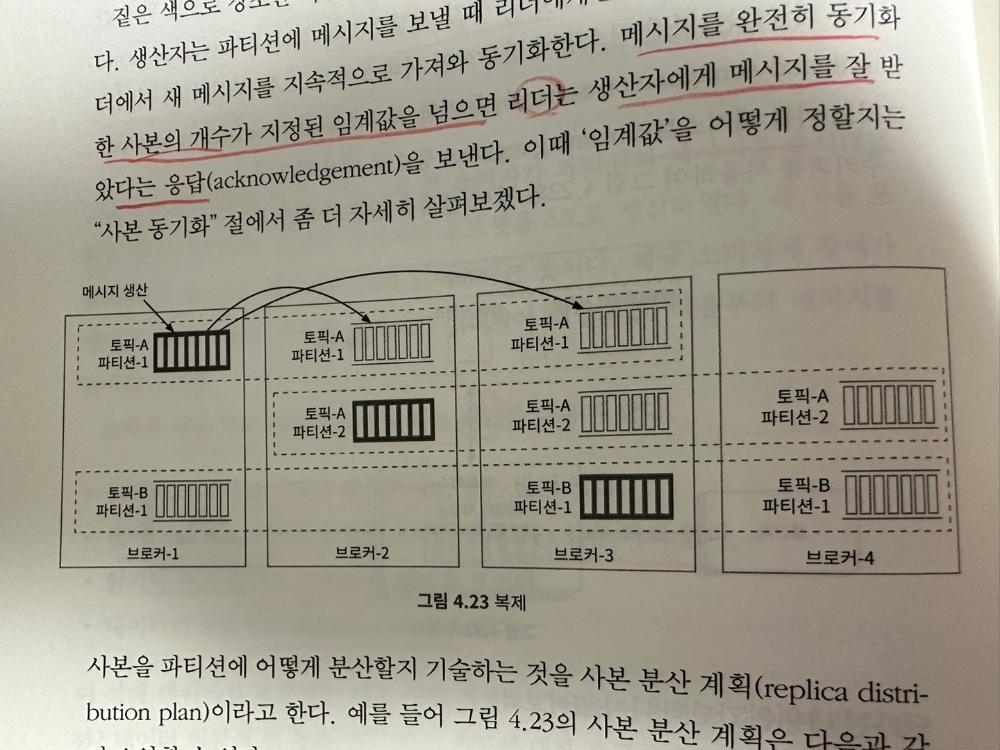  
- 위 예제에서 각 파티션은 3개의 사본을 갖고 각 다른 노드에 분산되어 저장된다.  
- 짙은 색은 해당 파티션의 리더이고 파티션에 메시지를 보낼 때 리더에만 보낸다.  
- 다른 사본은 리더에서 메시지를 가져와 동기화 
- 메시지를 완전히 동기화 한 사본의 개수가 **임계 값** 을 넘으면 리더는 생산자에게 메시지를 받았다는 응답(ack) 를 보낸다 

사본을 파티션에 어떻게 분산할지 기술하는 것을 "사본 분산 계획" 이라고 한다.  
위 그림의 사본 분산 계획 
- 토픽-A 의 파티션-1: 사본 3개, 리더는 브로커-1, 단순 사본은 브로커-2와 3에 배치 
- 토픽-A 의 파티션-2: 사본 3개, 리더는 브로커-2, 단순 사본은 브로커-3과 4에 배치 
생략 ..
  
사본 분산 계획은 누가 어떻게 만드는가?  
조정 서비스의 도움으로 브로커 노드 하나가 리더로 선툴되면 해당 리더 브로커 노드가 사본 분산 계획을 만들고 메타데이터 저장소에 저장한다.  

## 사본 동기화 
복제에 대해서 살펴보았는데 이번에 살펴 볼 문제는 복제를 위한 동기화를 어떻게 시킬지 이다.  
동기화된 사본(ISR)은 리더와 동기화된 사본을 일컫는 용어이다.  
이 때 "동기화 되었다" 의 의미는 토픽의 설정에 따라 달라진다.  
예를들어 replica.lag.max.messages 의 값이 4 라면 단순 사본에 보관된 메시지 개수와 리더 사이의 차이가 3이라면 사본은 여전히 ISR 일 것이다.
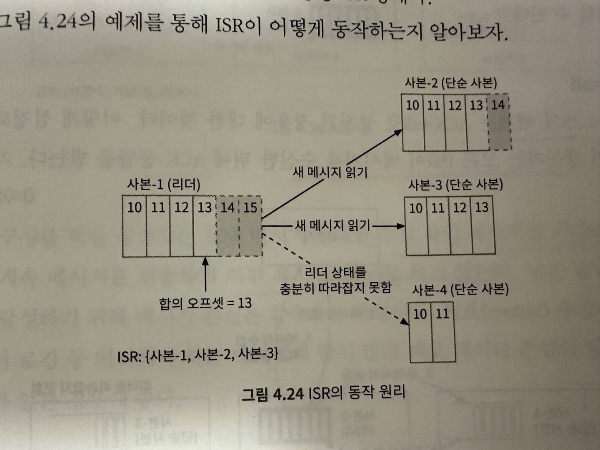  
- 리더 사본의 합의 오프셋은 13이다. 
- 합의 오프셋이 의미하는 바는 이 오프센 이전에 기록된 모든 메시지는 이미 ISR 집합 내 모든 사본에 동기화가 끝났다는 의미 
- 사본-2, 사본-3은 리더 상태를 동기화하여 ISR 이 되었기 때문에 새로운 메시지를 가져올 수 있다
- 사본-4는 리더 상태를 따라잡지 못하였으므로 아직 ISR 이 아니다. 리더를 따라잡은 뒤 ISR 이 될 수 있다. 

ISR 이 필요한 이유는 무었일까?  
"ISR 은 성능과 영속성 사이의 타협점이다."  
생산자의 메시지를 소실하지 않는 최선의 방법은 모든 사본 동기화 후에 생산자에게 ack 를 보내는 것이다.  
하지만 어느 사본 하나가 느리다면 전부가 느려지거나 못 쓰게 될 수 있다.  
  
이번에는 메시지 수신 응답(ack) 설정을 살펴 보도록 하자.

### ACK=all
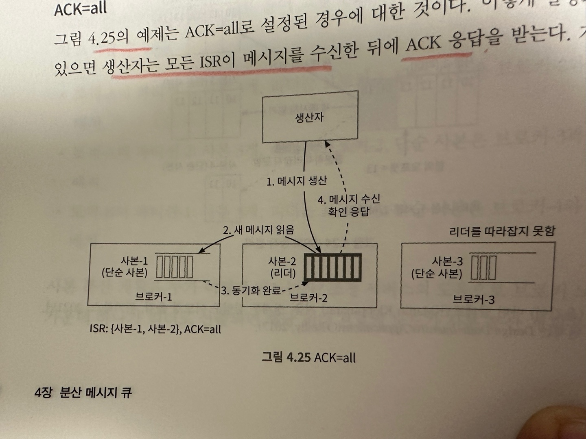  
생산자는 모든 ISR 이 메시지를 수신한 뒤 ACK 응답을 받는다.  
영속성 측면에서 가장 좋지만 느린 사본을 기다려야 한다.  

### ACK=1
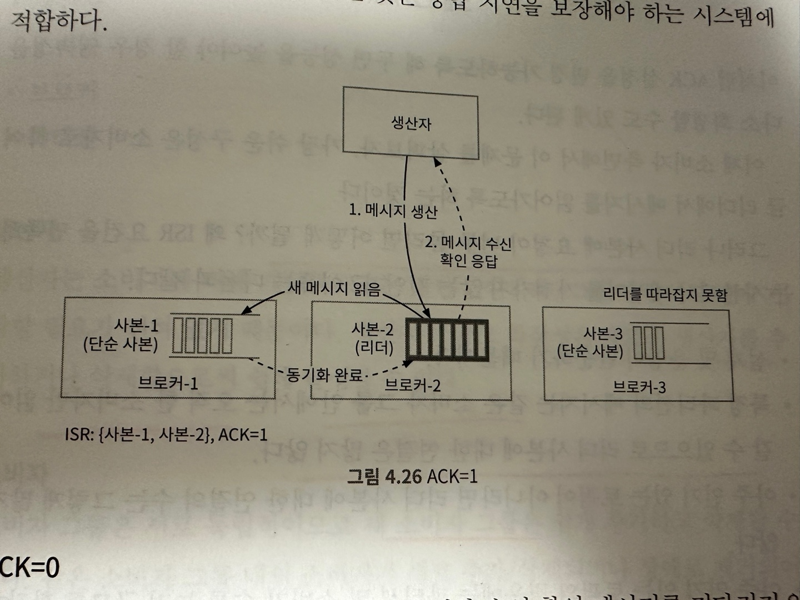  
생산자는 리더가 메시지를 저장하고 나면 바로 ACK 응답을 받는다.  
데이터가 동기화 될 때까지 기다리지 않으니 응답 지연은 개선된다.  
하지만 리더에 장애가 생기면 해당 메시지는 복구할 길이 없다.  
이런 구성은 데이터가 사려자도 상관 없는 대신 낮은 응답 지연을 보장해야 하는 시스템에 적합하다.  

### ACK=0
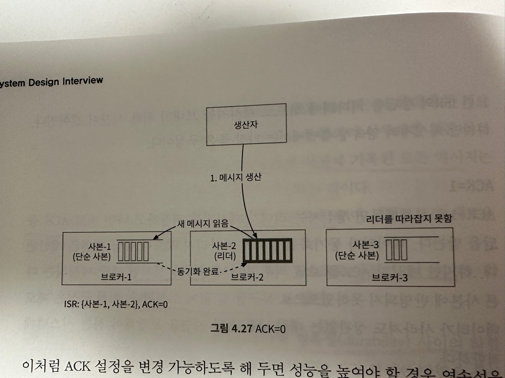  
보낸 메시지에 대한 수신 확인 메시지를 기다리지 않고 계속 메시지를 전송하며 어떤 재시도도 하지 않는다.  
낮은 응답 지연을 위해서 메시지 손실을 감수하는 구성이다.  
지표 수집이나 데잍터 로깅 등 처리해야 하는 메시지 양이 많고 메시지 손실이 상관 없을 경우에 좋다.  
  
이제 소비자 측면에서 이 문제를 살펴보자.  
가장 쉬운 구성은 리더에서 메시지를 소비자가 읽어가는 구성이다.  
그러나 리더 사본에 요청이 몰리면 어떻게 될까? 왜 ISR 요건을 만족하는 사본에서 메시지를 가져가지 않는 것인가?  
그 이유는 다음과 같다
- 설계 및 운영이 단순함
- 특정 파티션의 메시지는 같은 소비자 그룹 안에서는 오직 한 소비자만 읽어 갈 수 있으므로 리더 사본에 대한 연결은 많지 않다.
- 아주 인기 있는 토픽이 아니라면 리더 사본에 대한 연결의 수는 그렇게 많지 않음 
- 아주 인기 있는 토픽의 경우에는 파티션 및 소비자 수를 늘려 규모를 확장할 수 있다.
  
하지만 리더 사본에서 메시지를 가져가는 것이 바람직하지 않는 용례도 있다.  
예를 들어 소비자의 위치가 리더와 다른 지역의 데이터 센터라고 해보자.  
읽기 성능은 나빠질 것이다. 이런 경우에는 지역적으로 가까운 ISR 사본에서 메시지를 읽는 것을 고려해 볼 수 있다.  
어떤 사본이 ISR인지 아닌지 어떻게 판별할 수 있나?  
보통 각 파티션 담당 리더는 자기 사본들이 어느 메시지까지 가져갔는지 추적하여 ISR 목록을 관리한다.

## 규모 확장성 
지금까지 분산 메시지 큐 시스템의 많은 부분의 설계를 마쳤으니 주요 시스템 컴포넌트의 규모 확장성을 알아보자.  

### 생산자 
생산자는 그냥 생산자를 추가하거나 삭제하여 규모 확장성을 조절 가능 

### 소비자
소비자 그룹은 서로 독립적이므로 새 소비자 그룹을 쉽게 추가/삭제 할 수 있다.  
소비자 그룹 내 소비자도 추가/삭제 되어도 재조정 메커니즘이 발동하여 문제가 없다. 

### 브로커
브로커 규모 확장성을 살펴보기 전에 브로커의 결함 내성에 대해 먼저 짚어보자.  
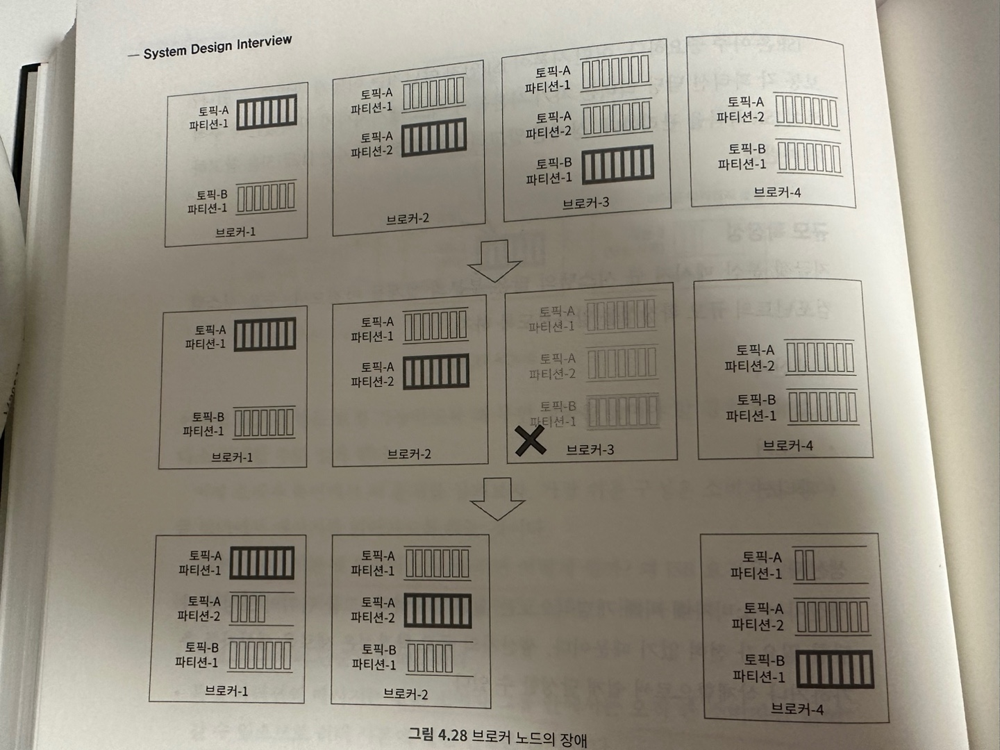  
위 사례를 통해 브로커 노드 장애가 어떻게 복구되는지 알아보자.  

1. 4개의 브로커가 있고 파티션 분산 계획은 다음과 같다.
   1. 토픽-A 파티션-1: 사본은 각각 브로커-1(리더), 2, 3 에 존재 
   2. 토픽-A 파티션-2: 사본은 각각 브로커-2(리더), 3, 4 에 존재
   3. 토픽-B 파티션-1: 사본은 각각 브로커-3(리더), 4, 1 에 존재 
2. 브로커-3에 장애가 발생하여 해당 노드의 모든 파티션이 소실 되었다.  
   1. 토픽-A 파티션-1: 사본은 각각 브로커-1(리더), 2 에 존재
   2. 토픽-A 파티션-2: 사본은 각각 브로커-2(리더), 4 에 존재
   3. 토픽-B 파티션-1: 사본은 각각 브로커-4, 1 에 존재
3. 브로커 컨트롤러는 브로커-3이 사라졌음을 감지하고 남은 브로커 노드를 위해 파티션 분산 계획을 만들어 낸다.
   1. 토픽-A 파티션-1: 사본은 각각 브로커-1(리더), 2, 4(신규) 에 존재
   2. 토픽-A 파티션-2: 사본은 각각 브로커-2(리더), 4, 1(신규) 에 존재
   3. 토픽-B 파티션-1: 사본은 각각 브로커-4(리더), 1, 2(신규) 에 존재
  
브로커의 결함 내성을 높이기 위해 다음과 같은 사항도 추가로 고려해야 한다. 
- 메시지가 성공적으로 합의 되었다고 판단 하려면 얼마나 많은 사본에 메시지가 반영되어야 하는가?
- 파티션의 모든 사본이 같은 브로커 노드에 있으면 해당 노드에 장애가 발생 할 경우 파티션은 완전히 소실된다. 따라서 같은 노드에 데이터를 복제하는 것은 의미없는 행동
- 파티션의 모든 사본에 문제가 생기면 파티션의 데이터는 영원히 사라진다. 사본 수와 사본 위치등을 이를 고려헤 여러 데이터 센터에 분산하는 것이 안전하다. 하지만 데이터 동기화 때문에 응답 지연과 비용은 늘어난다. 
  - 데이터 미러링을 도입하여 데이터 센터 간 데이터 복사를 용이하게 하는 것도 방법이지만 여기서는 다루지 않는다. 
  
이제 다시 브로커의 규모 확장성 문제를 살펴보자.  
가장 간단한 방법은 브로커 노드가 추가되거나 삭제 될 때 사본을 재배치 하는 것이다.  
하지만 그 보다 나은 방법이 있다. 브로커 컨트롤러로 하여금 한시적으로 시스템에 설정된 사본 수 보다 많은 사본을 허용하는 것이다.  
추가된 브로커 노드가 상태를 따라잡고 나면 더 이상 필요 없는 노드는 제거하면 된다.  
  
1. 최초 구성: 3개의 브로커, 2개의 파티션, 파티션 당 3개의 사본 
2. 새로운 브로커-4가 추가: 브로커 컨트롤러는 파티션-2의 사본 분산 계획을 (2,3,4) 로 변경한다는 결정을 하고 브로커-4에 추가된 사본은 브로커-2 파티션에서 메시지를 가져온다.
3. 브로커-3의 사본이 상태를 완전히 따라잡으면 브로커-1에 불필요한 사본을 삭제한다 

이 절차를 통해 브로커 추가하는 도중에 발생할 수 있는 데이터 손실을 피할 수 있다.  
브로커를 제거 할 때도 비슷한 방법을 적용하면 안전하게 제거 할 수 있다.  

### 파티션 
토픽의 규모를 늘리거나, 대역폭을 조정하거나, 가용성과 대역폭 사이의 균형을 맞추는 등의 이유로 파티션 수를 조정해야 할 수 있다.  
생산자는 브로커와 통신할 때 그 사실을 통지 받으며, 소비자는 재조정을 시행한다.  
파티션 수가 달라지면 데이터 저장 계층에 무슨 일이 일어나는지 살펴보자.  
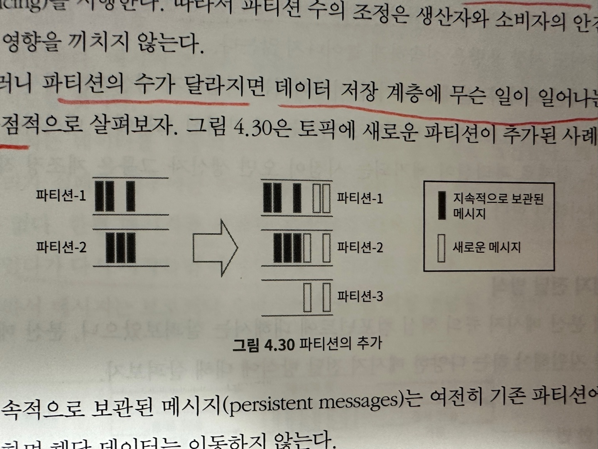  
- 지속적으로 보관된 메시지는 여전히 기존 파티션에 존재하며 해당 데이터는 이동하지 않음 
- 새로운 파티션이 추가되면 (파티션-3) 그 이후 오는 메시지는 3개의 파티션 전부에 지속적으로 보관 

따라서 파티션을 늘리면 간단히 토픽의 규모를 늘릴 수 있다.  
  
**파티션 삭제**  
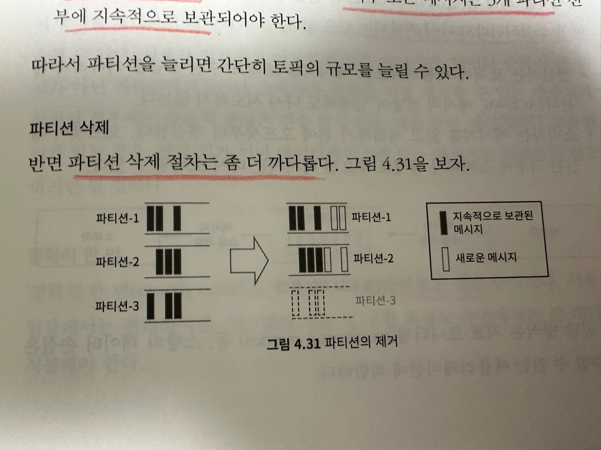  
반면 파티션 삭제는 좀 더 까다롭다.  
- 파티션-3을 제거한다는 결정을 내리면 새로운 메시지는 다른 파티션에만 보관된다.
- 제거할 파티션은 바로 제거하지 않고 일정 시간동안 유지한다.
- 해당 파티션에서 데이터를 읽고 있는 소비자가 있을 수 있기 때문이다. 
- 해당 유지 시간이 지나고 나면 데이터를 삭제하고 저장 공간을 반환한다. 
- 파티션 제거 결정 후 실제로 제거가 이루어지는 시점까지 소비자는 세 파티션 모두에서 메시지를 읽는다.
- 실제로 파티션이 제거되는 시점에 생산자 그룹은 재조정 작업을 개시해야 한다.  

## 메시지 전달 방식 

### 최대 한 번 
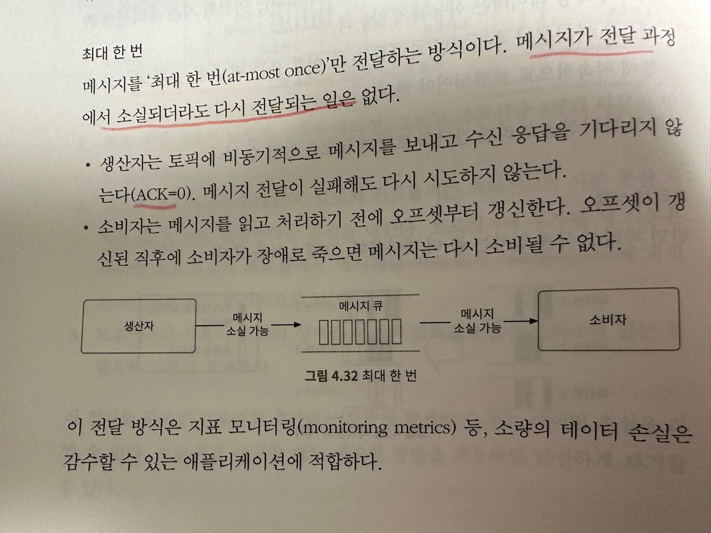  
메시지가 전달 과정에 소실되더라도 다시 전달되는 일이 없다. 
- 생산자는 토픽에 비동기적으로 메시지를 보내고 수신 응답을 기다리자 않는다(ACK=0). 메시지 전달이 실패해도 다시 시도하지 않음 
- 소비자는 메시지를 읽고 처리하기 전에 오프셋부터 갱신한다. 오프셋이 갱신된 직후에 소비자가 장애로 죽으면 메시지는 다시 소비 될 수 없다. 

이 전달 방식은 지표 모니터링 등에 적합하다.

### 최소 한 번
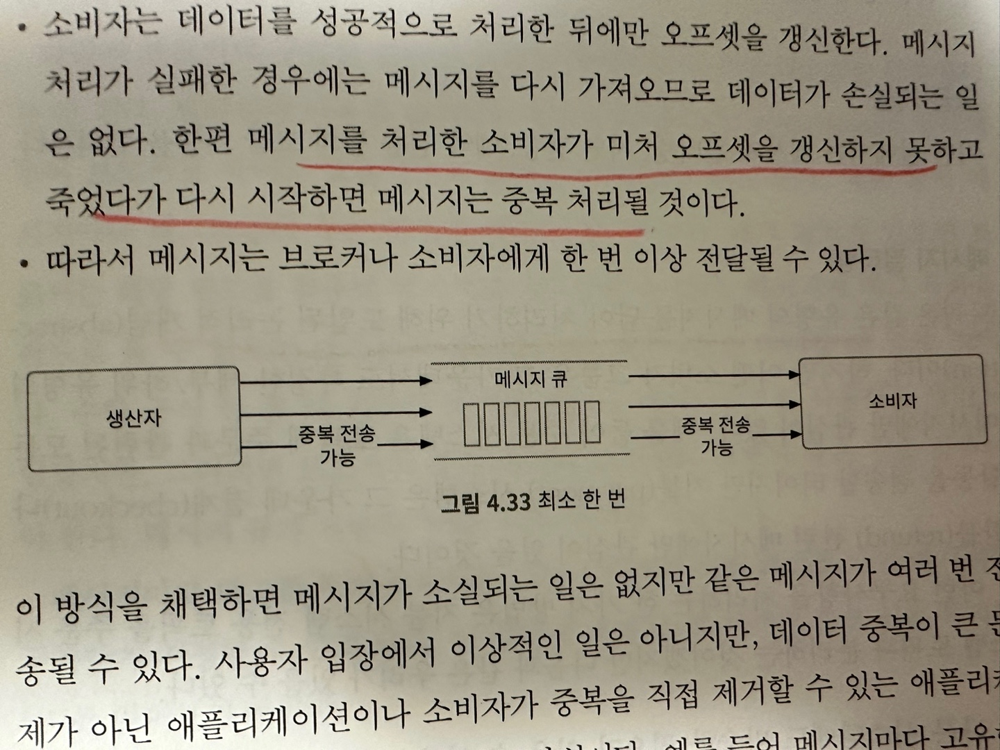  
메시지가 한 번 이상 전달될 수 있나 메시지 소실은 발생하지 않는 전달 방식이다.  
- 생산자는 메시지를 동기적/비동기적으로 보낼 수 있으며, ACK=1 또는 ACK=all 구성을 이용한다. 
- 소비자는 데이터를 성공적으로 처리한 뒤에만 오프셋을 갱신한다. 메시지 처리가 실패하면 메시지를 다시 가져오므로 데이터 손실되는 일이 없다.
- 메시지를 처리한 소비자가 미처 오프셋을 갱신하지 못하고 다시 시작하면 메시지는 중복 처리 될 것이다.
- 따라서 메시지는 브로커나 소비자에게 한 번 이상 전달 될 수 있다.

데이터 중복이 큰 문제가 아닌 어플리케이션이나 소비자가 중복을 제거 할 수 있는 어플리케이션의 경우 괜찮은 전송 방식이다.  
예를들어 해당 키를 데이터베이스에 저장하고 이미 있는 경우 아무 처리하지 않는 방법이 있다. 

### 정확히 한 번 
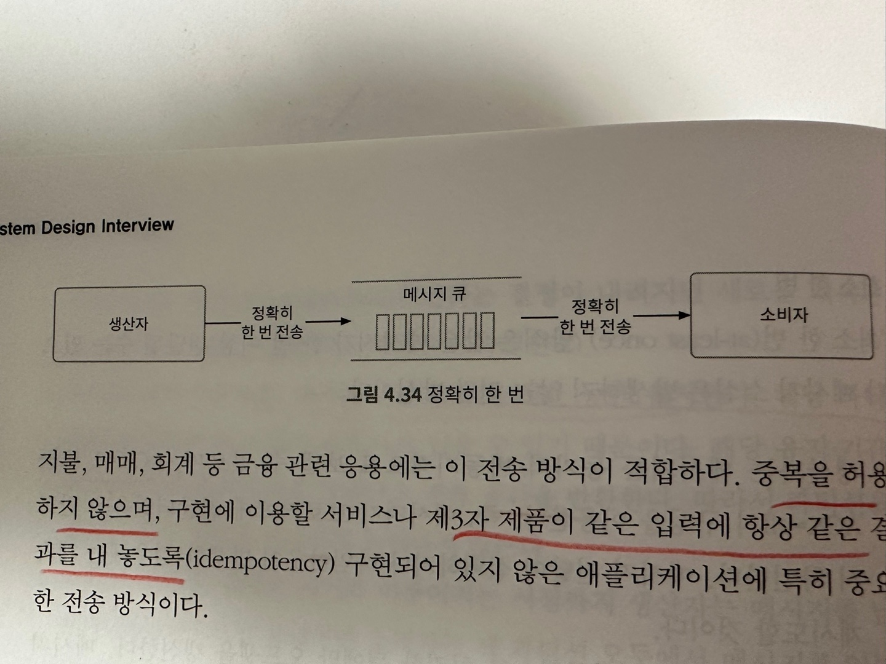  
가장 까다로운 전송 방식으로 사용자 입장에서 편하지만 시스템 성능 및 구현 복잡도 측면에서 큰 대가를 치뤄야 한다.  
지불, 매매, 회계 등 금융 관련 응용에는 이 방식이 적합하다.  
중복을 허용하지 않으며 구현에 이용할 서비스나 제3자 제품이 같은 입력에 항상 같은 결과를 내 놓도록 구현되어 있지 않은 어플리케이션에 특히 중요한 전송방식이다.  

## 고급 기능 
### 메시지 필터링 
토픽은 같은 유형의 메시지를 담아 처리하기 위해 도입된 논리적 개념이다.  
하지만 소비자 그룹은 특정한 메시지에만 관심이 있다.  
예를들어 주문 시스템은 토픽에 주문과 관련된 모든 메시지를 전송하지만 지불 시스템은 그 중 결제나 환불 메시지에만 관심이 있다.  
이런 요구사항을 처리하는 한 방법은 지불 시스템 전용 토픽을 주문 시스템 토픽과 분리하는 것이지만 다음과 같은 우려가 있을 수 있다.  
- 다른 시스템에도 비슷한 필요가 있을 수 있다. 그때 마다 전용 토픽을 만들 것인가? 
- 같은 메시지를 여러 토픽에 저장하는 것은 자원 낭비 
- 새로운 소비자 측 요구사항이 등장할 때마다 생산자 구현이 바뀌어야 할 수 있다. 생산자와 소비자의 결합도가 높아졌기 때문이다. 

다른 접근법으로 메시지 필터링을 사용하면 이런 문제를 해결할 수 있다.  
메시지를 필터링 하는 가장 쉬운 방법은 소비자가 메시지를 읽어가서 필요 없는 메시지는 버리는 것이다.  
하지만 불필요한 트래픽으로 시스템 성능이 떨어진다.  
더 나은 방법은 브로커에서 메시지를 필터링하여 소비자가는 원하는 메시지만 받도록 하는 것이다.  
브로커에 구현할 필터링 로직은 메시지의 메타 데이터 영역을 이용하여 구현해야 한다.  
(payload 를 읽는건 부하가 있음, 복호화 or 데이터 크기)  
예를들어 메시지 마다 tag 를 두는 방안을 생각해 볼 수 있다.  
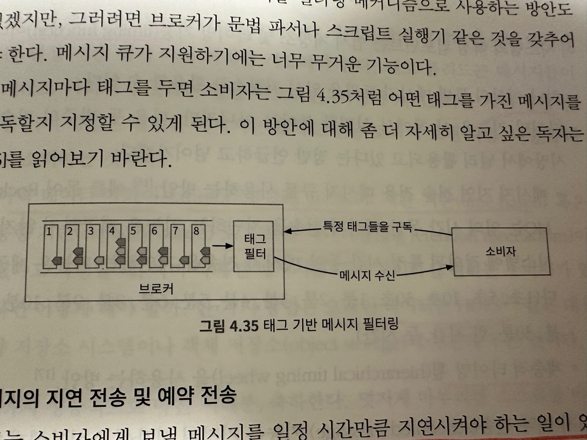  

### 메시지의 지연 전송 및 예약 전송 
소비자에게 보낼 메시지를 일정 시간만큼 지연시켜야 하는 일이 있을 수 있다.  
예를들어 주문을 넣은 후 30분 안에 결제가 이루어지지 않으면 해당 주문을 취소하고 싶다고 하자.  
결제 완료 확인을 지시하는 메시지는 바로 전송하고 소비자에게는 30분 뒤 전달 되도록 해두면, 소비자는 결제 여부만 확인하면 된다.  
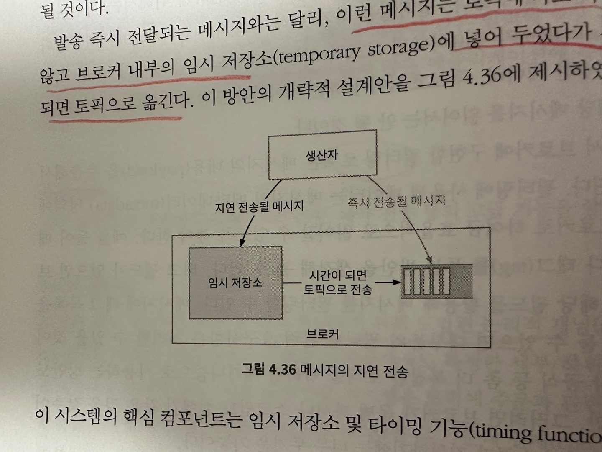   
이런 메시지는 토픽에 바로 저장하지 않고 브로커 내부 임시 저장소에 넣어 두었다가 시간이 되면 토픽으로 옮긴다.  
위 그림이 계략적인 설계안이다.  
- 하나 이상의 특별 메시지 토픽을 임시 저장소로 활용 할 수 있다.
- 타이밍 기능은 이 책에서 설명할 분야는 아니지만 다음 두 범주의 기술이 널리 상요된다.
  - 메시지 지연 전송 전용 메시지 큐를 사용하는 방안. 
  - 계층적 타이밍 휠을 사용하는 방안.

메시지 예약 전송 기능은 지정된 시간에 소비자에게 메시지를 보낼 수 있도록 하는 기능으로 전반적인 시스템 설계 철학은 메시지 지연 전송 시스템과 유사하다.  

# 마무리 
이번 장에서는 데이터 스트리밍 플랫폼에서 발견되는 고급 기능을 지원하는 분산 메시지 큐 시스템 설계안을 살펴보았다.  
면접시 시간이 남는다면 다응 사항에 대해 얘기해보는 것이 좋을 것이다.  
- 프로토콜: 프로토콜은 노드 사이에 오고 가는 데이터에 관한 규칙, 문법, API 를 규정한다. 분산 메시지 큐 시스템의 경우 프로토콜은 다음 사항을 기술해야 한다.
  - 메시지 생산과 소비, heartbeat 메시지 교환 
  - 대용량 데이터를 효과적으로 전송할 방법을 설명 
  - 데이터 무결성을 검증할 방법을 기술 
  - 유명한 프로토콜로는 AMQP, 카프카 프로토콜이 있다.
- 메시지 소비 재시도: 제대로 처리하지 못한 메시지는 일정 시간 뒤에 재시도 해야한다.
  - 어떻게 재시도 하는 것이 좋을까?
  - 한 가지 방법은 재시도 전용 토픽에 보낸 다음 나중에 다시 소비하는 것이다.
- 이력 데이터 아카이브: 시간 기반, 용량 기반 로그 보관 메커니즘이 있다고 가정할 때 이미 삭제된 메시지를 다시 처리하길 원하는 소비자가 있다면 어떻게 해야 할까? 
  - 한 가지 방법은 오래된 데이터는 HDFS 같은 대용량 시스템이나 객체 저장소에 보관해 두는 것이다. 

