# 광고 클릭 이벤트 집계(ad click event aggregation)

디지털 광고의 핵심 프로세스는 RTB(Real-Time Bidding)

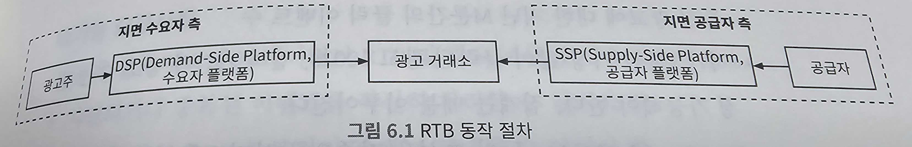

- RTB는 프로세스는 속도가 중요해서 보통 1초 내에 모든 프로세스가 마무리되어야 한다.
- 광고주가 얼마나 많은 돈을 지불할지 영향을 끼치기 때문에 데이터의 정확성도 중요하다.
- 온라인 광고에 사용되는 핵심 지표로는 CTR(Click-Through Rate, 클릭률), CTR(Conversion Rate, 전환률) 등이 있으며, 집계된 광고 클릭 데이터에 기반하여 계산한다.

## 1단계: 문제 이해 및 설계 범위 확정
```
지원자: 입력 데이터는 어떤 형태입니까?
면접관: 여러 서버로 분산된 로그 파일입니다. 클릭 이벤트는 수집될 때마다 이 로그 파일의 끝에 추가됩니다. 클릭 이벤트에는 ad_id, click_timestamp, user_id, ip, country 등의 속성이 있습니다. 
지원자: 데이터의 양은 어느 정도입니까?
면접관: 매일 10억 개의 광고 클릭이 발생하고, 광고는 약 2백만 회 게재됩니다. 광고 클릭 이벤트의 수는 매년 30%씩 증가한다고 하겠습니다.
지원자: 가장 중요하게 지원해야 할 질의는 어떤 것입니까?
면접관: 다음의 3가지 질의를 지원해야 합니다.
    - 특정 광고에 대한 지난 M분간의 클릭 이벤트 수
    - 지난 1분간 가장 많이 클릭된 광고 100개. 질의 기간과 광고 수는 변경 가능해야 한다. 집계는 매분 이루어진다.
    - ip, user_id, country 등의 속성을 기준으로 상기 2개 질의 결과를 필터링할 수 있어야 한다.
지원자: 엣지 케이스(edge case)에 대해 걱정해야 하나요? 다음과 같은 경우를 생각해 볼 수 있을 것 같습니다.
    - 예상보다 늦게 도착하는 이벤트가 있을 수 있다.
    - 중복된 이벤트가 있을 수 있다.
    - 시스템 일부가 언제든지 다운될 수 있으므로 시스템 복구를 고려해야 한다.
면접관: 좋네요. 그런 점들을 고려하기로 합시다.
지원자: 지연 시간 요건은 어떻습니까?
면접관: 모든 처리가 수 분 내에 이루어져야 합니다. RTB와 광고 클릭 집계의 지연 시간 요건은 매우 다르다는 점에 유의하세요. RTB 지연 시간은 응답성 요구사항 때문에 일반적으로 1초 미만이어야 하지만, 광고 클릭 이벤트 집계는 주로 광고 과금 및 보고에 사용되기 때문에 몇 분 정ㅈ도의 지연은 허용입니다.
```

### 기능 요구사항
- 지난 M분 동안의 ad_id 클릭 수 집계
- 매분 가장 많이 클릭된 상위 100개 광고 아이디를 반환
- 다양한 속성에 따른 집계 필터링을 지원
- 데이터의 양은 페이스북이나 구글 규모

### 비기능 요구사항
- 집계 결과 정확성 데이터가 RTB 및 광고 과금에 사용되므로 중요
- 지연되거나 중복된 이벤트를 적절히 처리할 수 있어야 함
- 견고성(reliablity): 부분적인 장애는 감내할 수 있어야 함
- 지연 시간 요구사항 : 전체 처리 시간은 최대 수 분을 넘지 않아야 함

### 개략적 추정
- 일간 능동 사용자(DAU) 수는 10억 명(1billion)
- 각 사용자는 하루에 평균 1개 광고를 클릭한다고 가정. 따라서 하루에 10억 건의 광고 클릭 이벤트가 발생
- 광고 클릭 QPS = 10^9 / 하루 10^5 초 = 10,000
- 최대 광고 클릭 QPS는 평균 QPS의 다섯 배, 즉 50,000QPS로 가정
- 광고 클릭 이벤트 하나당 0.1KB의 저장 용량이 필요하다고 가정. 따라서 일일 저장소 요구량은 0.1KB X 10억 = 100GB이며, 월간 저장 용량 요구량은 대략 3TB

## 2단계: 개략적 설계안 제시 및 동의 구하기

### 질의 API 설계
- 본 설계안의 클라이언트는 대시보드를 이용하는 데이터 과학자, 제품 관리자, 광고주 같은 사람이다. 그들이 대시보드를 이용하는 순간 집계 서비스에 질의를 발생한다.
- 요구사항
    - 지난 M분 동안 각 ad_id에 발생한 클릭 수 집계
    - 지난 M분 동안 가장 많은 클릭이 발생한 상위 N개 ad_id 목록 반환
    - 다양한 속성을 기준으로 집계 결과를 필터링하는 기능 지원

#### API 1: 지난 M분간 각 ad_id에 발생한 클릭 수 집계
|API|용도|
|---|---|
|GET /v1/ads/{:ad_id}/aggregated_count|주어진 ad_id에 발생한 이벤트 수를 집계하여 반환|

위 API 호출 인자는 다음과 같다.
|인자명|뜻|자료형|
|---|---|---|
|from|집계 시작 시간 (기본값은 현재 시각부터 1분 전)|long|
|to|집계 종료 시간 (기본값은 현재 시각)|long|
|filter|필터링 전략 식별자. 가령 filter=001는 미국 이외 지역에서 발생한 클릭은 제외하라는 뜻|long|

응답 결과는 다음과 같다.
|필드명|뜻|자료형|
|---|---|---|
|ad_id|광고(ad) 식별자|string|
|count|집계된 클릭 횟수|long|

#### API 2: 지난 M분간 가장 많은 클릭이 발생한 상위 N개 ad_id 목록
|API|용도|
|---|---|
|GET /v1/ads/popular_ads|지난 M분간 가장 많은 클릭이 발생한 상위 N개 광고 목록 반환|

위 API 호출 인자는 다음과 같다.
|인자명|뜻|자료형|
|---|---|---|
|count|상위 몇 개의 광고를 반환할 것인가|integer|
|window|분 단위로 표현된 집계 윈도 크기|integer|
|filter|필터링 전략 식별자|long|

응답 결과는 다음과 같다.
|필드명|뜻|자료형|
|---|---|---|
|ad_ids|광고 식별자 목록|array|

### 데이터 모델

#### 원시 데이터(raw data)
```
[AdClickEvent] ad001, 2021-01-01 00:00:01, user 1, 207.148.22.22, USA
```

|ad_id|click_timestamp|user_id|ip|country|
|---|---|---|---|---|
|ad001|2021-01-01 00:00:01|user1|207.148.22.22|USA|
|ad001|2021-01-01 00:00:02|user1|207.148.22.22|USA|
|ad002|2021-01-01 00:00:02|user2|209.153.56.11|USA|

#### 집계 결과 데이터(aggregated)

|ad_id|click_minute|count|
|---|---|---|
|ad001|202101010000|5|
|ad001|202101010001|7|

광고 필터링을 지원하기 위해 이 테이블에 filter_id를 추가한다.
|ad_id|click_minute|filter_id|count|
|---|---|---|---|
|ad001|202101010000|0012|2|
|ad001|202101010000|0023|3|
|ad001|202101010001|0012|1|
|ad001|202101010001|0023|6|

필터 테이블
|filter_id|region|ip|user_id|
|---|---|---|---|
|0012|US|0012|*|
|0013|*|0012|123.1.2.3|

지난 M분 동안 가장 많이 클릭된 상위 N개의 광고를 반환하는 질의를 지원하기 위해서는 다음과 같은 구조를 사용
||most_clicked_ads||
|---|---|---|
|window_size|integer|분 단위로 표현된 집계 윈도 크기|
|update_time_minute|timestamp|마지막으로 갱신된 타임스탬프(1분 단위)|
|most_clicked_ads|array|JSON 형식으로 표현된 ID 목록|

#### 비교
||원시 데이터만 보관하는 방안|집계 결과 데이터만 보관하는 방법|
|---|---|---|
|장점|- 원본 데이터를 손실 업이 보관<br>- 데이터 필터링 및 재계산 지원|- 데이터 용량 절감<br>- 빠른 질의 성능|
|단점|- 막대한 데이터 용량<br>- 낮은 질의 성능|- 데이터 손실. 원본 데이터가 아닌 계산/유도된 데이터를 저장하는 데서 오는 결과. 예를 들어 10개의 원본 데이터는 1개의 데이터로 집계/축약될 수 있다.|

원시 데이터와 집계 결과 데이터를 모두 저장하는 것을 추천한다.
- 문제가 발생하면 디버깅에 활용할 수 있도록 원시 데이터도 보관하는 것이 좋다. (버그로 집계 데이터가 손상되면 버그 수정 후에 원시 데이터에서 집계 결과를 다시 만들 수 있다.)
- 원시 데이터는 양이 엄청나므로 직접 질의하는 것은 비효율적이다. 이 문제를 완화하려면 집계 결과 데이터를 질의하는 것이 바람직하다.
- 원시 데이터는 백업 데이터로 활용된다. 재계산을 하는 경우가 아니라면 일반적으로는 원시 데이터를 질의할 필요가 없다. 오래된 원시 데이터는 냉동 저장소(cold storage)로 옮기면 비용을 절감할 수 있다.
- 집계 결과 데이터는 활성 데이터(active data) 구실을 한다. 질의 성능을 높이기 위해 튜닝을 하는 것이 보통이다.

### 올바른 데이터베이스의 선택
- 데이터는 관계형인가? 문서 데이터인가? 아니면 이진 대형 객체(Binary Large Object, BLOB)인가?
- 작업 흐름이 읽기 중심인가? 쓰기 중심인가? 둘 다인가?
- 트랙잭션(transaction)을 지원해야 하는가?
- 질의 과정에서 SUM이나 COUNT 같은 온라인 분석 처리(OLAP) 함수를 많이 사용해야 하는가?

개략적 추정치를 통해 확인해본 이 설계안은 평균 쓰기가 10,000QPS, 최대 50,000QP로 쓰기 중심 시스템이다.<br>
관계형 데이터베이스보다 쓰기 및 시간 범위 질의에 최적화된 카산드라나 InfluxDB를 사용하는 것이 바람직하다.<br>
ORC, 파케이(Parquet), AVRO 같은 칼럼형(columnar) 데이터 형식 가운데 하나를 사용하여 AWS S3에 데이터를 저장하는 방법도 있다.<br>
여기서는 사람들에게 비교적 익숙한 카산드라를 활용한다.<br>
집계 데이터는 본질적으로 시계열 데이터이며 이 데이터를 처리하는 워크플로는 읽기 연산과 쓰기 연산을 둘 다 많이 사용한다.
- 총 200만 개의 광고가 있다고 하였으므로 읽기 연산이 많이 발생할 수밖에 없다.
- 집계 서비스가 데이터를 매 분 집계하고 그 결과를 기록하므로 쓰기 작업도 아주 빈번하게 이루어진다.

원시 데이터와 집계 결과 데이터를 저장하는데는 같은 유형의 데이터베이스를 활용하는 것이 가능하다.

### 개략적 설계안

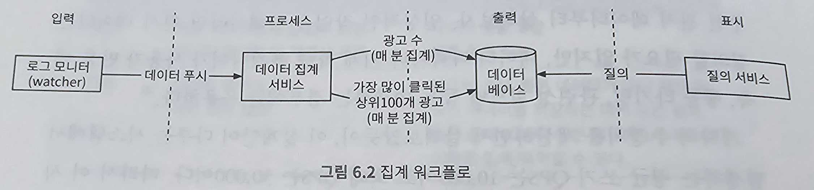

#### 비동기 처리
위 설계안은 데이터를 동기식으로 처리하기 때문에 여러 문제를 겪을 수 있다.
- 생산자와 소비자의 용량이 항상 같을 수 없다.
- 트래픽이 갑자기 급증하여 이벤트 수가 소비자의 처리 용량을 넘어설 수 있다.
- 메모리 부족 오류 등 예기치 않은 문제가 발생할 수 있다.
- 특정 컴포넌트의 장애가 전체 시스템 장애로 이어진다.


첫 번째 메시지 큐에 들어오는 내용

|ad_id|click_timestamp|user_id|ip|country|
|---|---|---|---|---|
|ad001|2021-01-01 00:00:01|user1|207.148.22.22|USA|

두 번째 메시지 큐에 들어오는 내용
1. 분 단위로 집계된 광고 클릭수

|ad_id|click_minute|count|
|---|---|---|
|ad001|202101010000|2|

2. 분 단위로 집계한, 가장 많이 클릭한 상위 N개 광고

|update_time_minute|most_clicked_ads|
|---|---|
|202101010000|[ad001, ad002]|

집계 결과를 데이터베이스에 바로 기록하지 않는 이유는 정확 하게 한 번(exactly once) 데이터를 처리하기 위해(atomic commit, 즉 원자적 커밋) 카프카 같은 시스템을 두 번째 메시지 큐로 도입해야 하기 때문이다.

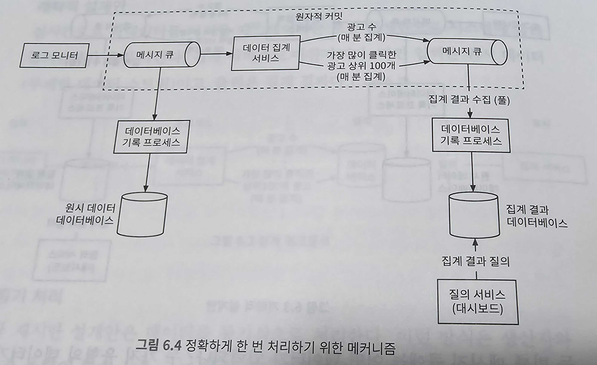

#### 집계 서비스
- 광고 클릭 이벤트를 집계하는 좋은 방안 하나는 맵리듀스(MapReduce) 프레임워크를 사용하는 것이다.
- 맵리듀스 프레임워크에 좋은 모델은 유향 비순환 그래프(directed acyclic graph, DAG)다.
- DAG 모델의 핵심은 시스템을 맵/집계/리듀스 노드 등의 작은 컴퓨팅 단위로 세분화하는 것이다.
- 각 노드는 한 가지 작업만 처리하며, 처리 결과를 다음 노드에 인계한다.

##### 맵 노드
- 맵 노드(map node)는 데이터 출처에서 읽은 데이터를 필터링하고 변환하는 역할을 담당
- 맵 노드가 필요한 이유(필수는 아님)
    - 입력 데이터를 정리하거나 정규화해야 하는 경우
    - 데이터가 생성되는 방식에 대한 제어권이 없는 경우에는 동일한 ad_id를 갖는 이벤트가 서로 다른 카프카 파티션에 입력될 수도 있기 때문

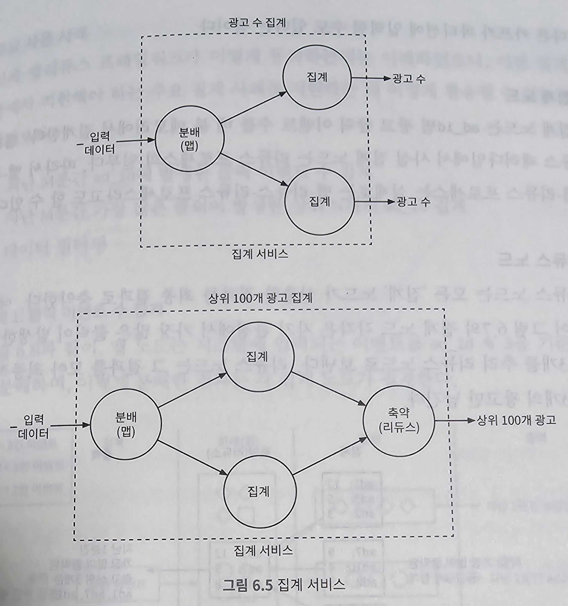
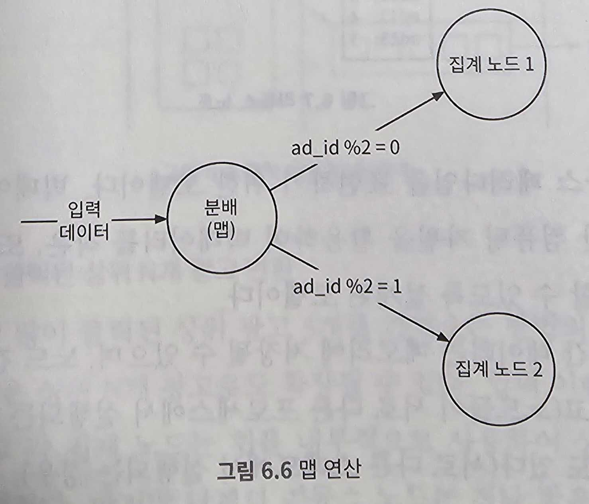

##### 집계 노드
- 집계 노드는 ad_id별 광고 클릭 이벤트 수를 매 분 메모리에서 집계한다.
- 맵리듀스 패러다임에서 집계 노드는 리듀스 프로세스의 일부

##### 리듀스 노드
- 리듀스 노드는 모든 '집계' 노드가 산출한 결과를 최종 결과로 축약한다.

아래 이미지에서는 집계 노드 각각은 자기 관점에서 가장 많은 클릭이 발생한 광고 3개를 추려 리듀스 노드로 보낸다. 리듀스 노드는 그 결과를 모아 최종적으로 3개의 광고만 남긴다.
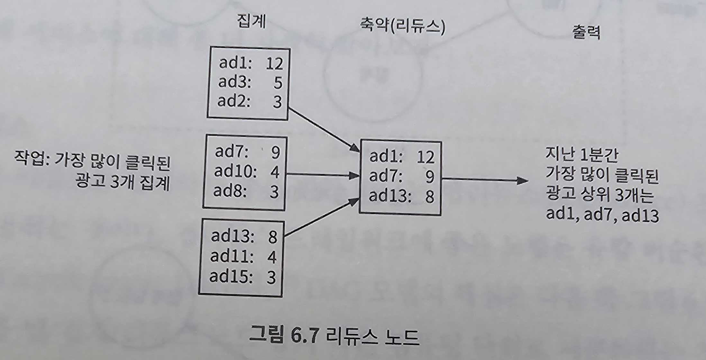

- DAG는 맵리듀스 패러다임을 표한하기 위한 모델이다.
- 빅데이터를 입력으로 받아 병렬 분산 컴퓨팅 자원을 활용하여 빅데이터를 작은, 또는 일반적 크기 데이터로 변환할 수 있도록 설계된 모델이다.
- 이 모델의 중간 데이터는 메모리에 저장될 수 있으며, 노드 간 통신은 TCP로 처리할 수도 있고(노드들이 서로 다른 프로세스에서 실행되는 경우) 공유 메모리로 처리할 수도 있다(서로 다른 스레드에서 실행되는 경우).

##### 주요 사용 사례
- 지난 M분간 ad_id에 발생한 클릭 이벤트 수 집계
- 지난 M분간 가장 많은 클릭이 발생한 상위 N개의 ad_id 집계
- 데이터 필터링

###### 사례1. 클릭 이벤트 수 집계
아래 이미지에서 맵 노드는 시스템에 입력되는 이벤트를 ad_id % 3을 기준으로 분배하며, 이렇게 분배한 결과는 각 노드가 집계한다.
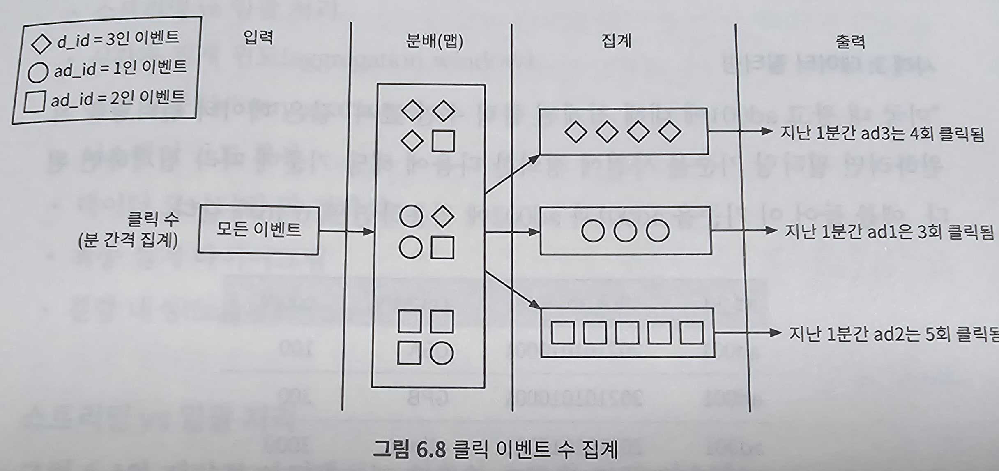

###### 사례2. 가장 많이 클릭된 상위 N개 광고 반환
아래 이미지는 가장 많이 클릭된 상위 광고 3개를 가져오는 방법의 단순화된 설계안이다.
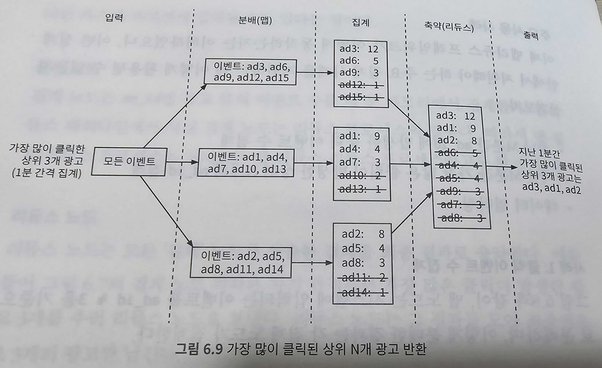

이 방안은 상위 N개 광고로도 확장될 수 있다.<br>
입력 이벤트는 ad_id 기준으로 분배되고 각 집계 노드는 힙을 내부적으로 사용하여 상위 3개 광고를 효율적으로 식별한다.<br>
마지막 단계의 리듀스 노드는 전달 받은 9개의 광고 가운데 지난 1분간 가장 많이 클릭된 광고 3개를 골라낸다.

###### 사례3. 데이터 필터링
"미국 내 광고 ad001"에 대해 집계된 클릭 수만 표시" 같은 데이터 필터링을 지원하려면 필터링 기준을 사전에 정의한 다음 해당 기준에 따라 집계하면 된다.
|ad_id|click_minute|country|count|
|---|---|---|---|
|ad001|202101010001|USA|100|
|ad001|202101010001|GPB|200|
|ad001|202101010001|others|3000|
|ad002|202101010001|USA|10|
|ad002|202101010001|GPB|25|
|ad002|202101010001|others|12|

이런 기법을 스타 스키마(star schema)라고 부른다.<br>
데이터 웨어하우스(data warehouse)에서 널리 쓰는 기법으로, 필터링에 사용되는 필드는 차원(dimension)이라고 부른다.<br>
이 기법은 다음과 같은 장점이 있다.
- 이해하기 쉽고 구축하기 간단
- 기존 집계 서비스를 재사용하여 스타 스키마에 더 많은 차원을 생성할 수 있다. 다른 추가 컴포넌트는 필요하지 않다.
- 결과를 미리 계산해 두는 방식이므로, 필터링 기준에 따라 데이터에 빠르게 접근할 수 있다.

이 접근법에는 많은 버킷(bucket)과 레코드가 생성된다는 한계가 있다.

## 3단계: 상세 설계

### 스트리밍 vs 일괄 처리
앞에서 본 개략적 아키텍처는 일종의 스트림 처리 시스템(stream processing system)이다.<br>
본 설계안은 스트림 처리와 일괄 처리 방식을 모두 사용한다.<br>
스트림 처리는 데이터를 오는 대로 처리하고 거의 실시간으로 집계된 결과를 생성하는 데 사용한다.<br>
일괄 처리는 이력 데이터를 백업하기 위해 활용한다.<br>
일괄 및 스트리밍 처리 경로를 동시에 지원하는 시스템의 아키텍처를 람다(lambda)라고 부른다.<br>
람다 아키텍처의 단점은 두 가지 처리 경로를 지원하므로 유지 관리해야 할 코드가 두 벌이라는 점이다.<br>
카파 아키텍처(kappa architecture)는 일괄 처리와 스트리밍 처리 경로를 하나로 통합하여 이 문제를 해결한다.<br>
핵심 아이디어는 단일 스트림 처리 엔진을 사용하여 실시간 데이터 처리 및 끊임없는  데이터 재처리 문제를 모두 해결하는 것이다.<br>
본 시스템의 개략적 설계안은 카파 아키텍처를 따른다.

||서비스 (온라인 시스템)|일괄 처리 시스템(오프라인 시스템)|스트리밍 시스템(실시간에 가깝게 처리하는 시스템)|
|---|---|---|---|
|응답성|클라이언트에게 빠르게 전달|클라이언트에게 응답할 필요가 없음|클라이언트에게 응답할 필요가 없음|
|입력|사용자의 요청|유한한 크기를 갖는 입력. 큰 규모의 데이터|입력에 경계가 없음(무한 스트림)|
|출력|클라이언트에 대한 응답|구체화 뷰, 집계 결과 지표 등|구체화 뷰, 집계 결과 지표 등|
|성능 측정 기준|가용성, 지연 시간|처리량|처리량, 지연 시간|
|사례|온라인 쇼핑|맵리듀스|플링크(Flink)|

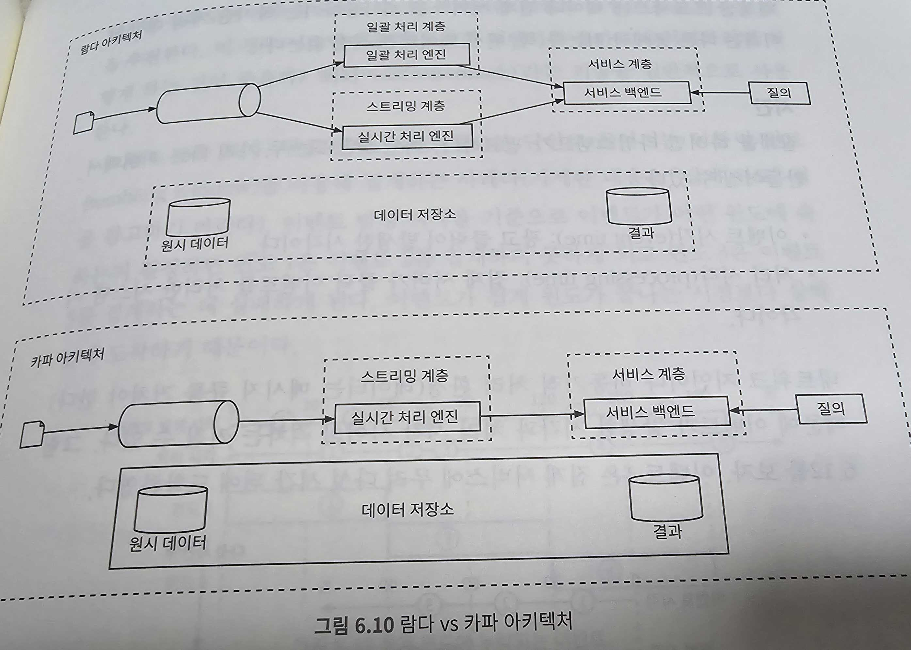

### 데이터 재계산
때로 이미 집계한 데이터를 다시 계산해야 하는 경우가 있는데, 이를 이력 데이터 재처리(historical data replay)라고도 부른다.<br>
집계 서비스에 중대한 버그가 있었다면, 버그 발생 시점부터 원시 데이터를 다시 읽어 집계 데이터를 재계산하고 고쳐야 할 것이다.
1. 재 계산 서비스는 원시 데이터 저장소에서 데이터를 검색한다. 일괄 처리 프로세스를 따른다.
2. 추출된 데이터는 전용 집계 서비스로 전송된다. 전용 집계 서비스를 두는 것은 실시간 데이터 처리 과정이 과거 데이터 재처리 프로세스와 간섭하는 일을 막기 위해서다.
3. 집계 결과는 두 번째 메시지 큐로 전송되어 집계 결과 데이터베이스에 반영된다. 

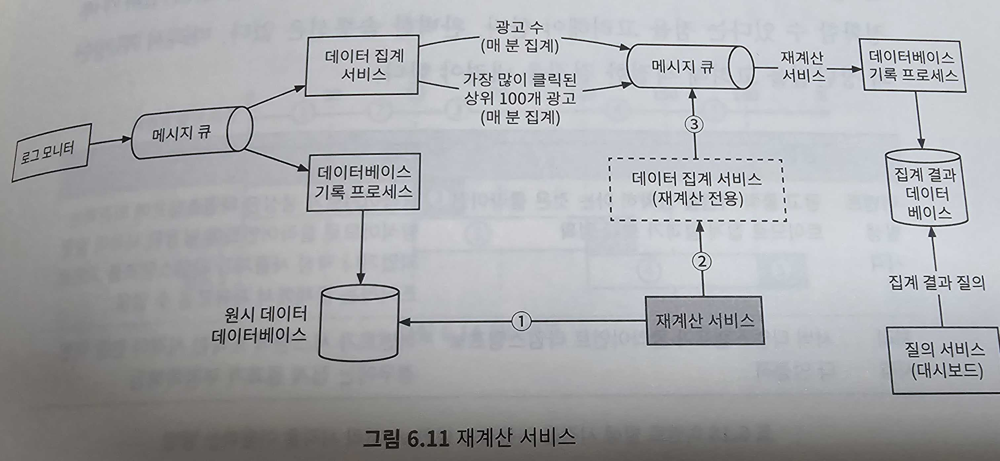

재계산 프로세스는 데이터 집계 서비스를 사용하기는 하지만 처리 대상 데이터는 다른 곳에서 읽는다.(즉, 원시 데이터를 직접 읽는다.)

### 시간
타임스탬프는 두 가지 다은 위치에서 만들어질 수 있다.
- 이벤트 시각(event time): 광고 클릭이 발생한 시각
- 처리 시각(processing time): 집계 서버가 클릭 이벤트를 처리한 시스템 시각

네트워크 지연이나 비동기적 처리 환경(데이터는 메시지 큐를 거쳐야한다) 때문에 이벤트가 발생한 시각과 처리 시각 사이의 격차는 커질 수 있다.

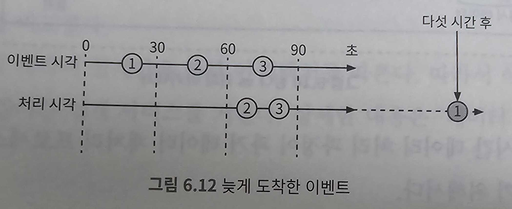

이벤트가 발생한 시각을 집계에 사용하는 경우에는 지연된 이벤트 처리 문제를 잘 해결해야 한다.<br>
처리 시각을 집계에 사용하는 경우에는 집계 결과가 부정확할 수 있다는 점을 고려해야 한다.

||장점|단점|
|---|---|---|
|이벤트 발생 시각|광고 클릭 시점을 정확히 아는 것은 클라이언트이므로집계 결과가 보다 정확|클라이언트가 생성한 타임스탬프에 의존하는 방식이므로 클라이언트에 설정된 시각이 잘못되었거나 악성 사용자가 타임스탬프를 고의로 조작하는 문제에서 자유로울 수 없음|
|처리 시각|서버 타임스탬프가 클라이언트 타임스탬프보다 안정적|이벤트가 시스템에 도착한 시각이 한참 뒤인 경우에는 집계 결과가 부정확해짐|

데이터의 정확도는 중요하므로, 이 책에서는 이벤트 발생 시각을 사용할 것을 추천한다.<br>
이 경우 시스템에 늦게 도착한 이벤트는 올바르게 처리하려면 어떻게 하는 것이 좋을까?<br>
'워터마크(watermark)'라는 기술을 일반적으로 사용한다.<br>
아래 이미지에서 광고 클릭 이벤트를 1분 단위로 끊어지는 텀블링 윈도우(tumbling window)를 사용해 집계하는 사례다.<br>
이벤트 발생 시각을 기준으로 이벤트가 어떤 윈도에 속하는지 결정하면 윈도 1은 이벤트 2를 집계하지 못하게 되고 윈도 3은 이벤트 5를 집계하는 데 실패하게 된다.<br>
이벤트가 집계 윈도가 끝나는 시점보다 살짝 늦게 도착하기 때문이다.

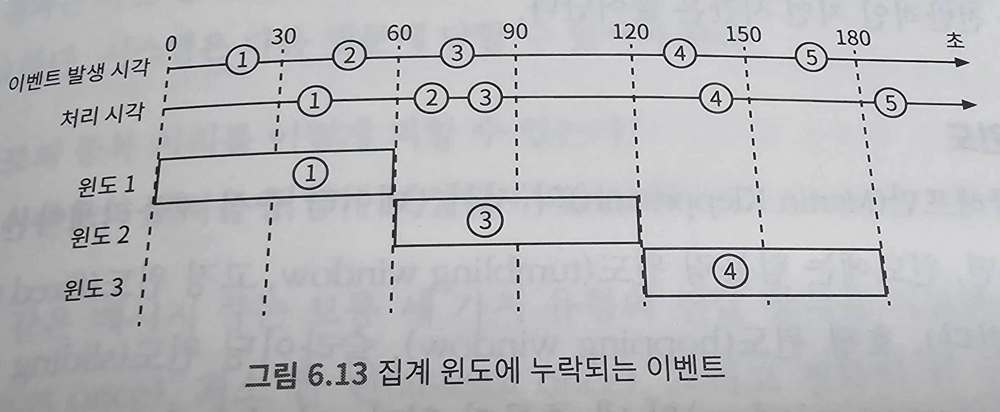

워터마크는 집계 윈도의 확장으로 본다.(아래 이미지에서 각 윈도 마지막에 붙는 여분의 사각형)<br>
이렇게 하면 집계 결과의 정확도를 높일 수 있다.<br>
가령 15초 워터마크를 윈도마다 붙이면 윈도 1은 이벤트 2를 집계할 수 있고 윈도 3은 이벤트 5를 집계할 수 있게 된다.

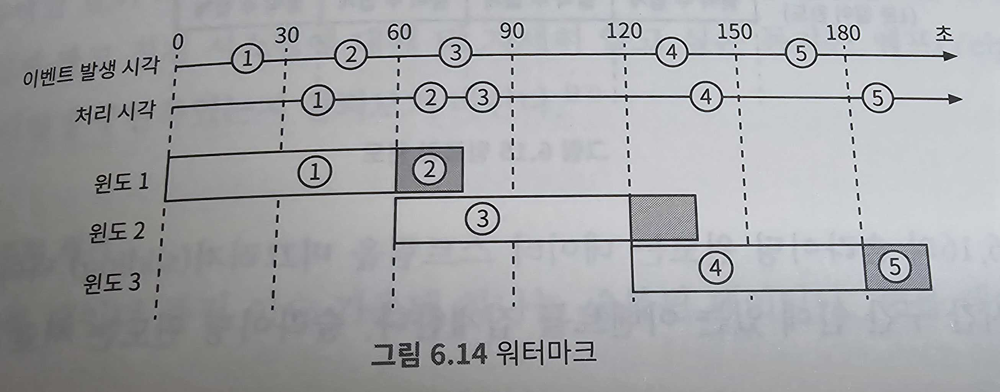

워터마크의 크기는 비즈니스 요구사항에 따라 달리 잡는다.<br>
워터마크 구간이 길면 늦게 도착하는 이벤트도 포착할 수 있지만 시스템이 이벤트 처리 시간은 늘어난다.<br>
워터마크가 짧으면 데이터 정확도는 떨어지지만 시스템의 응답 지연은 낮아진다.<br>
워터마크 기법으로도 시간이 한참 흐른 후에 시스템에 도달하는 이벤트는 처리할 수 없다.<br>
발생할 확률이 낮은 이벤트 처리를 위해 시스템을 복잡하게 설계하면 투자 대비 효능(Return on Investment, ROI)은 떨어진다.<br>
게다가 사소한 데이터 오류는 하루치 데이터 처리를 마감할 때 조정할 수 있다.<br>
워터마크를 사용하면 데이터의 정확도는 높아지지만 대기 시간이 늘어나 전반적인 지연 시간이 늘어난다.

### 집계 윈도
마틴 클레프만(Martin Kleppmann)의 저서 <데이터 중심 애플리케이션 설계>에 따르면 아래의 윈도가 있다.
- **텀블링 윈도(tumbling window, 고정 윈도(fixed window)라고도 함)**
- 호핑 윈도(hopping window)
- **슬라이딩 윈도(sliding window)**
- 세션 윈도(session window)
  
아래 이미지에서 텀블링 윈도는 시간을 같은 크기의 겹치지 않는 구간으로 분할한다.<br>
따라서 매 분 발생한 클릭 이벤트를 집계하기에 아주 적합하다.

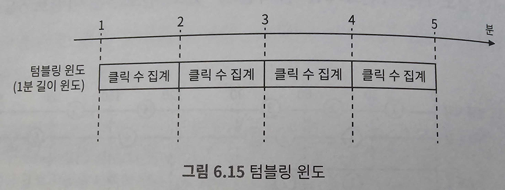

아래 이미지에서 슬라이딩 윈도는 데이터 스트림을 미끄러쳐(sliding) 나아가면서 같은 시간 구간 안에 있는 이벤트를 집계한다.<br>
슬라이딩 윈도는 서로 겹칠 수 있다.<br>
따라서 본 시스템의 두 번째 요구사항, 즉 지난 M분간 가장 많이 클릭된 상위 N개 광고를 알아내기에 적합하다.

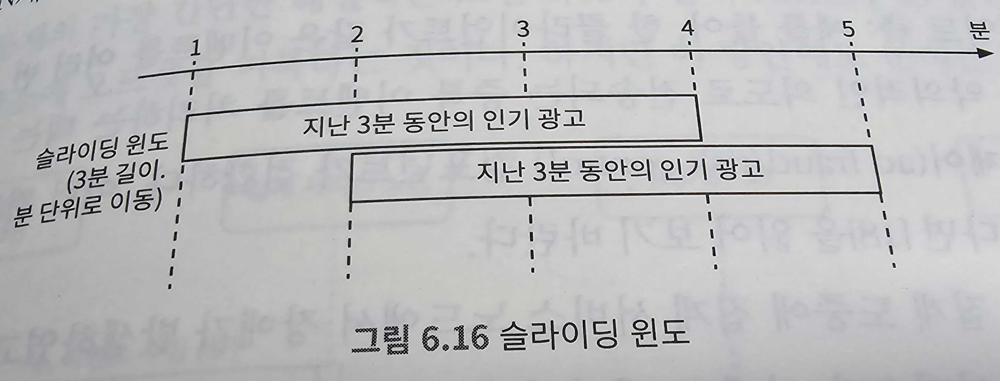

### 전달 보장
집계 결과는 과금 등에 활용될 수 있기 때문에 데이터의 정확성과 무결성이 아주 중요하다.
- 이벤트의 중복 처리를 어떻게 피할 수 있는가?
- 모든 이벤트의 처리를 어떻게 보장할 수 있는가?

카프카와 같은 메시지 큐는 보통 세 가지 유형의 전달 방식을 지원한다.
- 최대 한 번(at-most once)
- 최소 한 번(at-least once)
- 정확히 한 번(exactly once)

#### 어떤 전달 방식을 택할 것인가
약간의 중복은 괜찮다면 대체로 '최소 한 번'이 적절하다.<br>
본 설계안에서는 데이터의 몇 퍼센트 차이가 수백만 달러 차이로 이어질 수 있기 때문에 '정확히 한 번' 방식을 권장한다.

##### 데이터 중복 제거
- 가장 흔한 데이터 품질 이슈 가운데 하나
- 중복 데이터는 다양한 곳에서 발생 가능
  - 클라이언트 측: 예를 들어, 한 클라이언트가 같은 이벤트를 여러 번 보내는 경우. 악의적인 의도로 전송되는 중복 이벤트를 처리하는 데는 광고 사기/위험 제어(ad fraud/risk control) 컴포넌트가 적합하다.
  - 서버 장애: 집계 도중에 집계 서비스 노드에서 장애가 발행하였고 업스트림(upstream) 서비스가 이벤트 메시지에 대해 응답(acknowledgement)을 받지 못하였다면, 같은 이벤트가 다시 전송되어 재차 집계될 가능성이 있다.

아래 이미지에서 집계 서비스 노드(aggregator)에 발생한 장애의 결과로 중복 데이터가 생기는 과정을 보여준다.<br>
이 노드는 업스트림 카프카에 오프셋을 저장하여 데이터 소비 상태를 관리한다.

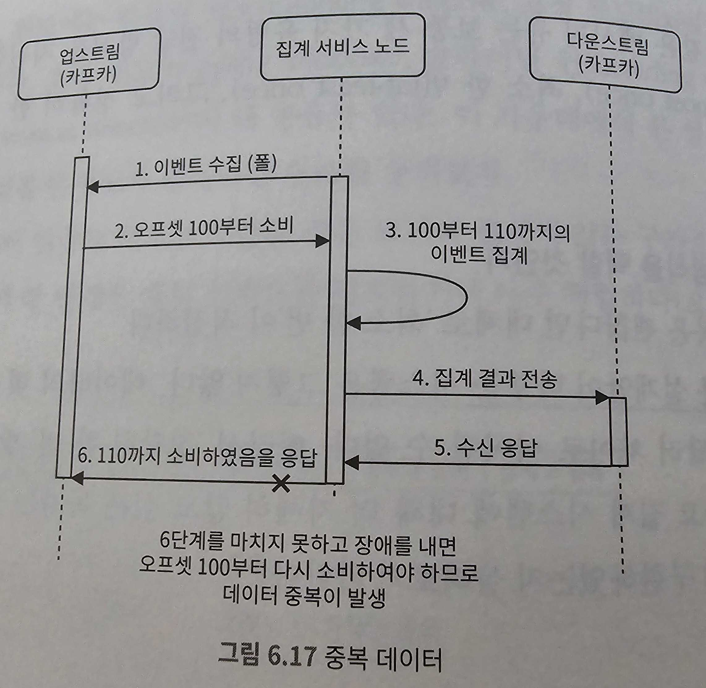

집계 서비스 노드에 장애가 생겨 6단계를 실행하지 못하면 100에서 110까지의 이벤트는 이미 다운스트림에 전송되었으나 새 오프셋은 업스트림 카프카에 반영되지 않았다.<br>
따라서 새로 복구된 집계 서비스 노드는 오프셋 100부터 이벤트를 다시 소비하려 할 것이고, 그 결과로 데이터 중복이 발생한다.<br>
이 문제의 가장 간단한 해결책은 아래 이미지와 같이 HDFS나 S3 같은 외부 파일 저장소에 오프셋을 기록하는 것이다.

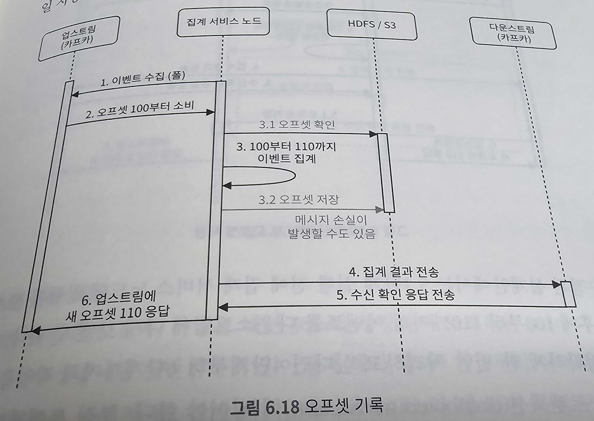

3단계에서 집계 서비스 노드는 외부 저장소에 보관된 마지막 오프셋이 100인 경우에만 오프셋 100부터 110까지의 이벤트를 처리한다.<br>
저장소에 저장된 오프셋이 110이었다면 오프셋 110 이전 이벤트는 전부 무시한다.<br>
하지만 이 설계에는 큰 문제가 있다.
- 집계 결과를 다운스트림으로 전송하기 전에 오프셋을 HDFS나 S3에 저장하고 있는데, 만일 그 직후 집계 서비스 노드에 장애가 발생하여 4단계를 완료하지 못했다면?
- 외부 저장소에 저장된 오프셋은 110이므로, 복구된 집계 서비스 노드는 100부터 110까지의 이벤트를 다시 처리할 시도는 하지 않을 것이다.
따라서 데이터 손실을 막으려면 다운스트림에서 집계 결과 수신 확인 응답을 받은 후에 오프셋을 저장해야 한다.

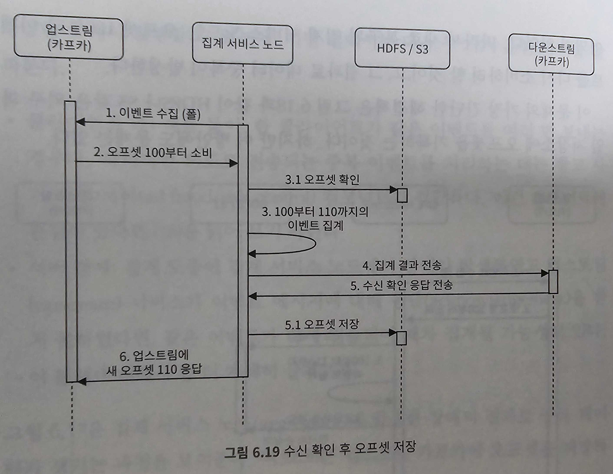

이 수정된 설계안에서는 5.1단계 실행 전에 집계 서비스 노드에 장애가 생기면 복구 후에 100부터 110까지의 이벤트를 다운스트림에 다시 보낼 수 있다.<br>
이벤트를 정확하게 한 번만 처리하고 싶다면 4단계부터 6단계까지의 작업을 하나의 분산 트랜잭션(distributed transaction)에 넣어야 한다.<br>
분산 트랜잭션은 여러 노드에서 작동하는 트랜잭션으로, 그 안에서 실행하는 작업 가운데 하나라도 실패하면 모든 작업 상태를 실행 전으로 되돌리게 된다.

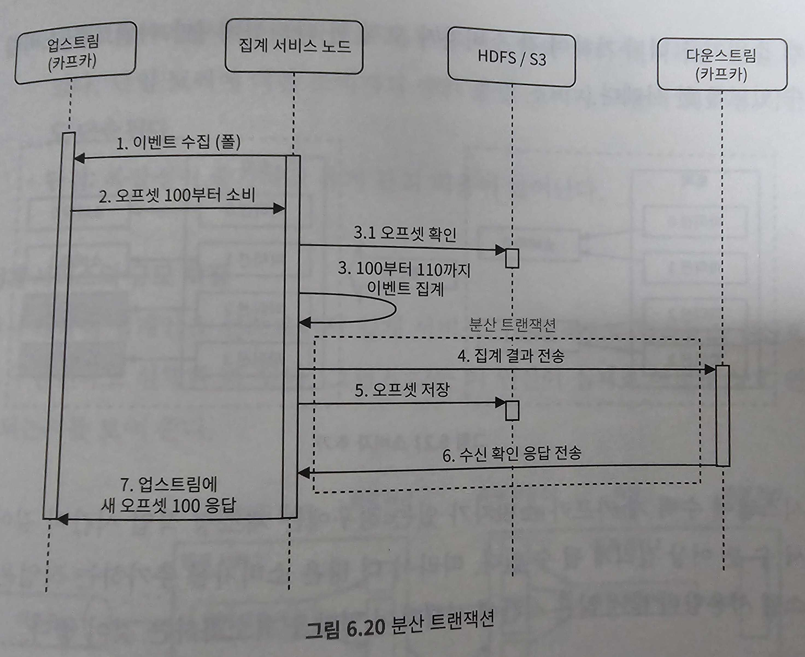

### 시스템 규모 확장
사업은 매년 30%씩 성장하며 트래픽은 3년마다 두 배가 된다면, 이 성장세를 뒷받침하기 위해 어떻게 해야 할까?<br>
메시지 큐, 집계 서버, 데이터베이스의 세 가지 독립 구성 요소의 규모를 독립적으로 늘릴 수 있다.

#### 메시지 큐의 규모 확장
**생산자(producer)**: 생산자 인스턴스 수에는 제한을 두지 않으므로 따라서 확장성은 쉽게 달성할 수 있다.<br>
**소비자(consumer)**: 소비자 그룹 내의 재조정(rebalancing) 메커니즘은 노드 추가/삭제를 통해 그 규모를 수비게 조정할 수 있도록 한다.

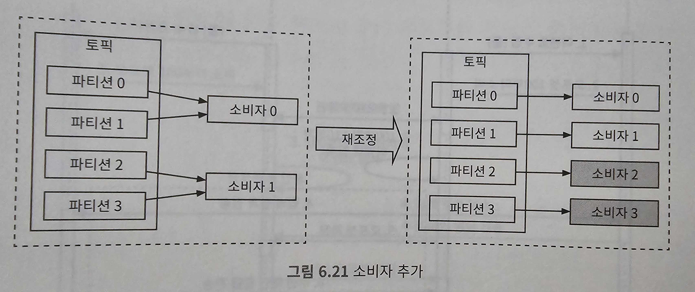

시스템에 수백 개의 카프카 소비자가 있는 경우에는 재조정 작업 시간이 길어져서 수 분 이상 걸리게 될 수 있다.<br>
따라서 더 많은 소비자를 추가하는 작업은 시스템 사용량이 많지 않은 시간에 실행하여 영향을 최소화하는 것이 좋다.

##### 브로커(broker)
- 해시 키
같은 해시 ad_id를 갖는 이벤트를 같은 카프카 파티션에 저장하기 위해 ad_id를 해시 키로 사용한다. 그렇게 하면 집계 서비스는 같은 ad_id를 갖는 이벤트를 전부 같은 파티션에서 구독할 수 있다.

- 파티션의 수
파티션의 수가 변하면 ad_id를 갖는 이벤트가 다른 파티션에 기록되는 일이 생길 수 있다. 따라서 사전에 충분한 파티션을 확보하여 프로덕션 환경에서 파티션의 수가 동적으로 늘어나는 일은 피하는 것이 좋다.

- 토픽의 물리적 샤딩
보통 하나의 토픽만으로 충분한 경우는 거의 없다. 지역에 따라 여러 토픽을 둘 수도 있고(topic_north_america, topic_europe, topic_asia 등) 사업 유형에 따라 둘 수도 있을 것이다(topic_web_ads, topic_mobile_ads).
    - 장점: 데이터를 여러 토픽으로 나누면 시스템의 처리 대역폭을 높일 수 있다. 단이 토픽에 대한 소비자의 수가 줄면 소비자 그룹의 재조정 시간도 단축된다.
    - 단점: 복잡성이 증하가고 유지 관리 비용이 늘어난다.

#### 집계 서비스의 규모 확장

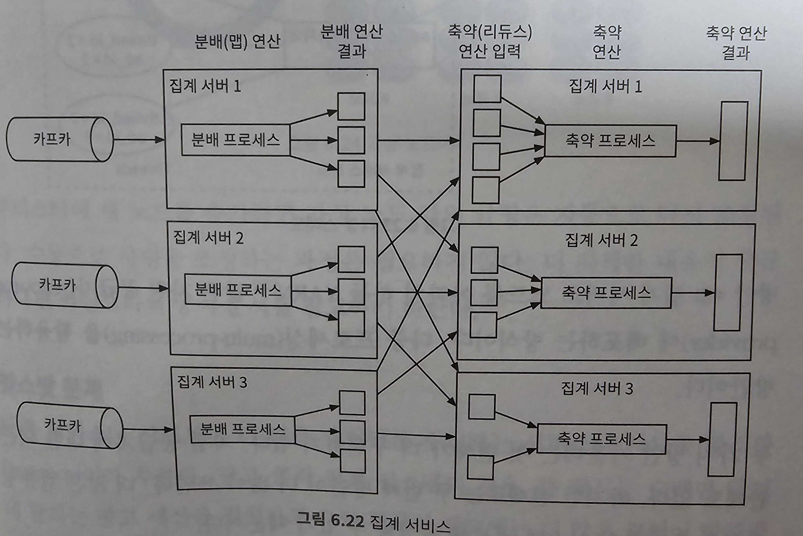

집계 서비스의 규모는 노드의 추가/삭제를 통해 수평적으로 저정이 가능하다.<br>
관련된 한 가지 흥미로운 질문은 집계 서비스의 처리 대역폭을 높이려면 어떻게 하느냐는 것이다.

- 방안 #1: 아래 이미지처럼 ad_id마다 별도의 처리 스레드를 두는 방안
  
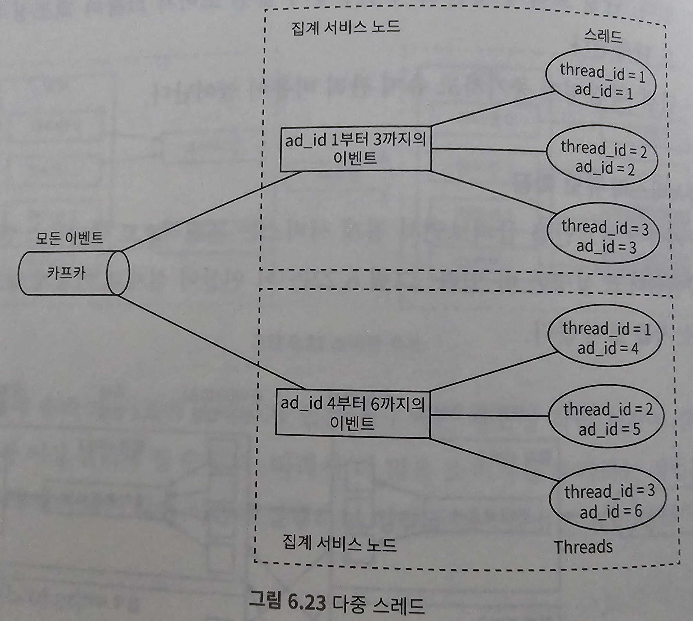

- 방안 #2: 집계 서비스 노드를 아파치 하둡 YARN 같은 자원 공급자(resource provider)에 배포하는 방식이다. 다중 프로세싱(multi-processing)을 활용하는 방안

두 가지 방안 가운데는 첫 번째가 더 구현하기 쉽다.<br>
자원 공급자에 대한 의존 관계도 없다.<br>
실제로는 두 번째 방안이 더 많이 쓰인다.<br>
더 많은 컴퓨팅 자원을 추가하여 시스템 규모를 확장할 수 있기 때문이다.

#### 데이터베이스의 규모 확장
- 카산드라(Cassandra)는 안정 해시(consistent hash)와 유사한 방식으로 수평적인 규모 확장을 기본적으로 지원
- 데이터는 각 노드에 균등하게 분산(이 때 사본도 적당한 수만큼 만들어 분산)
- 각 노드는 해시 링 위의 특정 해시 값 구간의 데이터 보관을 담당하며, 다른 가상 노드의 데이터 사본도 보관

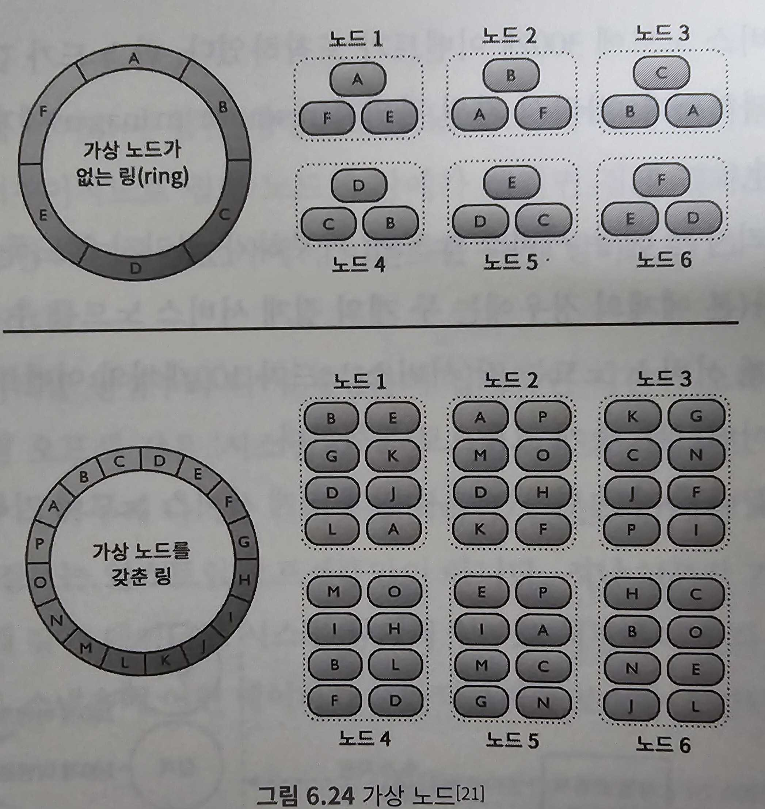

- 클러스터에 새 노드를 추가하면 가상 노드 간의 균형은 자동으로 재조정됨.
- 수동으로 샤딩을 조정하는 과정은 필요치 않다.

#### 핫스팟 문제
다른 서비스나 샤드보다 더 많은 데이터를 수신하는 서비스나 샤드를 핫스팟(hotspot)이라 부른다.<br>
광고 클릭 집계 시스템의 경우, 큰 회사는 수백만 달러에 달하는 광고 예산을 집행하고 그런 회사의 광고에는 더 많은 클릭이 발생하기 때문에 핫스팟 문제가 발생할 수 있다.<br>
이벤트 파티션을 ad_id로 나누기 때문에, 어떤 집계 서비스 노드는 다른 노드보다 더 많은 광고 클릭 이벤트를 수신하게 될 것이고, 그러다 보면 서버 과부하 문제가 발생할 수 있다.<br>
이 문제는 더 많은 집계 서비스 노드를 할당하여 완화할 수 있다.<br>
아래 이미지에서는 각 집계 서비스 노드는 100개 이벤트만 처리할 수 있다고 가정하였다.

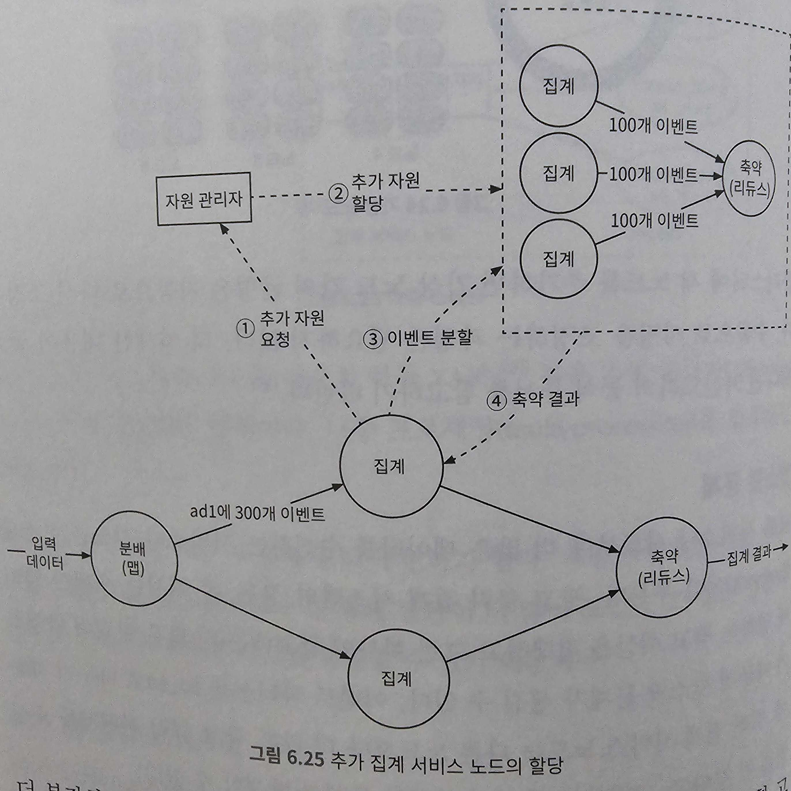

1. 집계 서비스 노드에 300개 이벤트가 도착하였다. 한 노드가 감당할 수 있는 양을 초과하였다. 따라서 자원 관리자(resource manager)에게 추가 자원을 신청
2. 자원 관리자는 해당 서비스 노드에 과부하가 걸리지 않도록, 추가 자원을 할당
3. 원래 집계 서비스 노드는 각 서비스 노드가 100개씩의 이벤트를 처리할 수 있도록 이벤트를 세 개 그룹으로 분할
4. 집계가 끝나 축약된 결과는 다시 원래 집계 서비스 노드에 기록

더 복잡한 방법도 있다.
- 전역-지역 집계(Global-Local Aggregation)
- 분할 고유 집계(Split Distinct Aggregation)

### 결함 내성(fault tolerance)
집계는 메모리에서 이루어지므로 집계 노드에 장애가 생기면 집계 결과도 손실된다.<br>
하지만 업스트림 카프카 브로커에서 이벤트를 다시 받아오면 그 숫자를 다시 만들어 낼 수 있다.<br>
카프카 데이터를 원점부터 다시 재생하여 집계하면 시간이 오래 걸린다.<br>
그러니 업스트림 오프셋 같은 '시스템 상태'를 스냅숏으로 저장하고 마지막으로 저장된 상태부터 복구해 나가는 것이 바람직하다.<br>
본 설계안에서 '시스템 장애'에 해당하는 정보는 업스트림 오프셋뿐만 아니다.<br>
지난 M분간 가장 많이 클릭된 광고 N개 같은 데이터도 시스템 상태의 일부로 저장해야 한다.

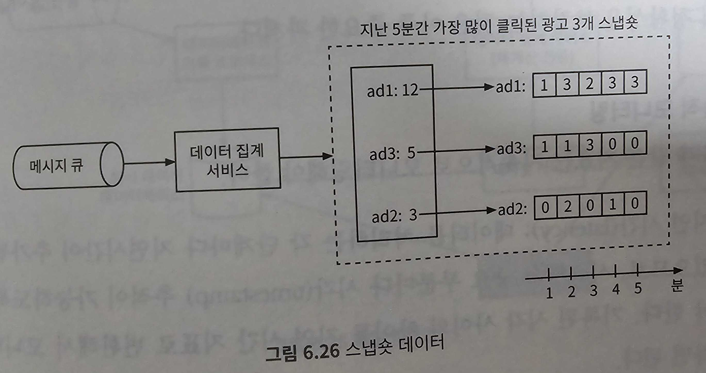

스냅숏을 이용하면 집계 서비스의 복구 절차가 단순해진다.<br>
어떤 집계 서비스 노드 하나에 장애가 발생하면 해당 노드를 새 것으로 대체한 다음 마지막 스냅숏에서 데이터를 복구하면 된다.<br>
스냅숏을 마지막으로 찍은 후에 도착한 새로운 이벤트는, 새 집계 서비스 노드가 카프카 브로커에서 읽어가 다시 처리할 것이다.

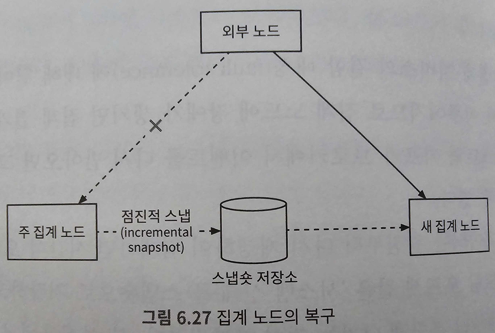

### 데이터 모니터링 및 정확성
집계 결과는 RTB(Real-Time Bidding) 및 청구서 발행 목적으로 사용될 수 있다.<br>
그러므로 시스템이 정상적으로 동작하는지 모니터링하고 데이터 정확성을 보장하는 것은 아주 중요한 과제다.

#### 지속적 모니터링

- 지연 시간(latency): 데이터를 처리하는 각 단계마다 지연시간이 추가될 수 있으므로, 시스템의 중요 부분마다 시각(timestamp) 추적이 가능하도록 해야한다. 기록된 시각 사이의 차이를 지연 시간 지표로 변환해서 모니터링하면 된다.
- 메시지 큐 크기: 큐의 크기가 갑자기 늘어난다면 더 많은 집계 서비스 노드를 추가해야 할 수 있다. 카프카는 분산 커밋 로그(distributed commit log) 형태로 구현된 메시지 큐이므로, 카프카를 사용하는 경우에는 레코드 처리 지연 지표(records-lag)를 대신 추적하면 된다.
- 집계 노드의 시스템 자원: CPU, 디스크, JVM 같은 것에 관계된 지표

#### 조정
조정(reconciliation)은 다양한 데이터를 비교하여 데이터 무결성을 보증하는 기법을 일컫는단.<br>
은행 업계라면 은행에서 만든 데이터와 비교하면 되겠지만 광고 클릭 집계 결과는 비교할 제3자가 없다.<br>
한 가지 방법은 매일 각 파티션에 기록된 클릭 이벤트를 이벤트 발생 시각에 따라 정렬한 결과를 일괄 처리하여 만들어 낸 다음, 실시간 집계 결과와 비교해 보는 것이다.<br>
더 높은 정확도가 필요하다면 일부 이벤트는 늦게 도착할 수 있으므로 배치 작업 결과가 실시간 집계 결과와 정확히 일치하지 않을 수 있다는 점은 유념해야 한다.<br>

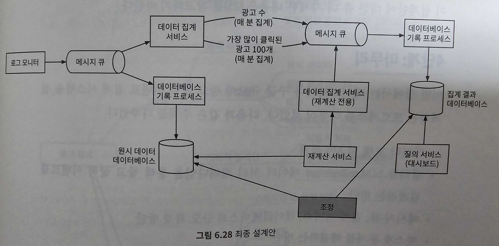

### 대안적 설계안
다른 한 가지 가능한 설계안은 광고 클릭 데이터를 하이브(Hive)에 저장한 다음 빠른 질의는 엘라스틱서치(Elasticsearch) 계층을 얹어서 처리하는 것이다.<br>
집계는 클릭하우스(ClickHouse)나 드루이드(Druid) 같은 OLAP 데이터베이스를 통해 처리할 수 있을 것이다.

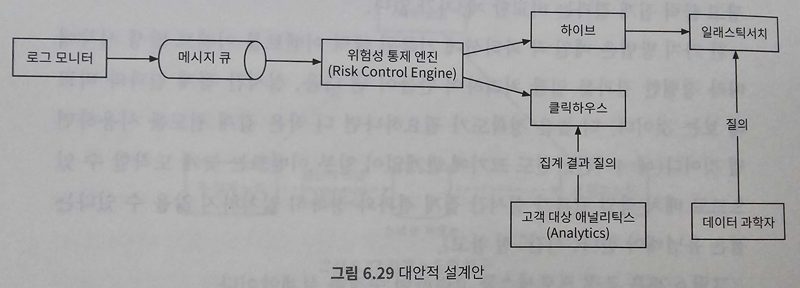

## 4단계: 마무리
광고 클릭 이벤트 집계 시스템은 전형적인 빅데이터 처리 시스템이다.<br>
아파치 카프카, 아파치 플링크, 아파치 스파크 같은 업계 표준 솔루션에 대한 사전 지식이나 경험이 있다면 이해하고 설계하기 쉬울 것이다.

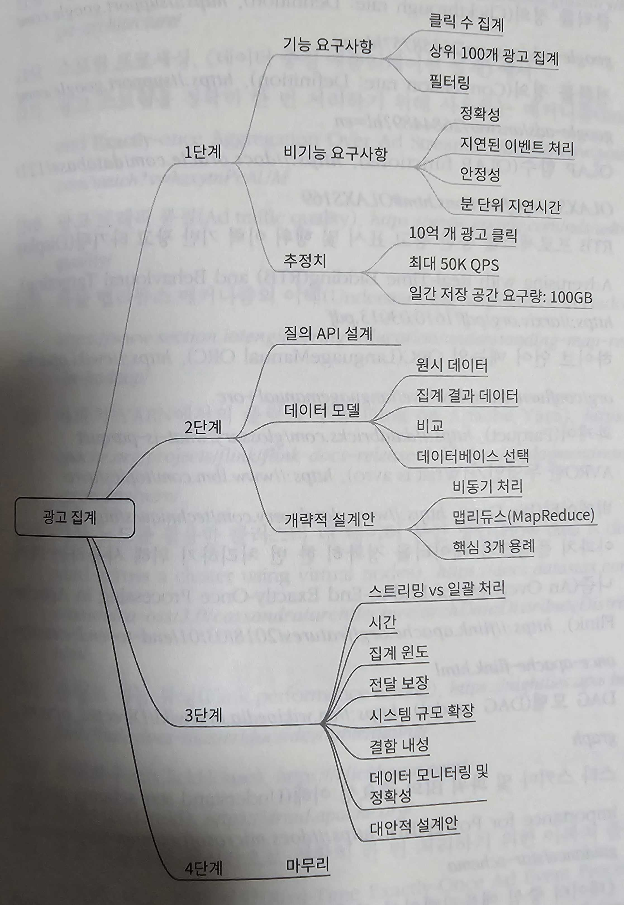


