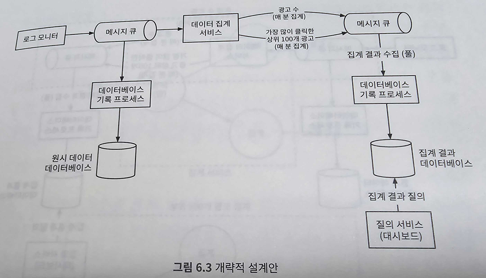

# 광고 클릭 이벤트 집계(ad click event aggregation)

디지털 광고의 핵심 프로세스는 RTB(Real-Time Bidding)


- RTB는 프로세스는 속도가 중요해서 보통 1초 내에 모든 프로세스가 마무리되어야 한다.
- 광고주가 얼마나 많은 돈을 지불할지 영향을 끼치기 때문에 데이터의 정확성도 중요하다.
- 온라인 광고에 사용되는 핵심 지표로는 CTR(Click-Through Rate, 클릭률), CTR(Conversion Rate, 전환률) 등이 있으며, 집계된 광고 클릭 데이터에 기반하여 계산한다.

## 1단계: 문제 이해 및 설계 범위 확정
```
지원자: 입력 데이터는 어떤 형태입니까?
면접관: 여러 서버로 분산된 로그 파일입니다. 클릭 이벤트는 수집될 때마다 이 로그 파일의 끝에 추가됩니다. 클릭 이벤트에는 ad_id, click_timestamp, user_id, ip, country 등의 속성이 있습니다. 
지원자: 데이터의 양은 어느 정도입니까?
면접관: 매일 10억 개의 광고 클릭이 발생하고, 광고는 약 2백만 회 게재됩니다. 광고 클릭 이벤트의 수는 매년 30%씩 증가한다고 하겠습니다.
지원자: 가장 중요하게 지원해야 할 질의는 어떤 것입니까?
면접관: 다음의 3가지 질의를 지원해야 합니다.
    - 특정 광고에 대한 지난 M분간의 클릭 이벤트 수
    - 지난 1분간 가장 많이 클릭된 광고 100개. 질의 기간과 광고 수는 변경 가능해야 한다. 집계는 매분 이루어진다.
    - ip, user_id, country 등의 속성을 기준으로 상기 2개 질의 결과를 필터링할 수 있어야 한다.
지원자: 엣지 케이스(edge case)에 대해 걱정해야 하나요? 다음과 같은 경우를 생각해 볼 수 있을 것 같습니다.
    - 예상보다 늦게 도착하는 이벤트가 있을 수 있다.
    - 중복된 이벤트가 있을 수 있다.
    - 시스템 일부가 언제든지 다운될 수 있으므로 시스템 복구를 고려해야 한다.
면접관: 좋네요. 그런 점들을 고려하기로 합시다.
지원자: 지연 시간 요건은 어떻습니까?
면접관: 모든 처리가 수 분 내에 이루어져야 합니다. RTB와 광고 클릭 집계의 지연 시간 요건은 매우 다르다는 점에 유의하세요. RTB 지연 시간은 응답성 요구사항 때문에 일반적으로 1초 미만이어야 하지만, 광고 클릭 이벤트 집계는 주로 광고 과금 및 보고에 사용되기 때문에 몇 분 정ㅈ도의 지연은 허용입니다.
```

### 기능 요구사항
- 지난 M분 동안의 ad_id 클릭 수 집계
- 매분 가장 많이 클릭된 상위 100개 광고 아이디를 반환
- 다양한 속성에 따른 집계 필터링을 지원
- 데이터의 양은 페이스북이나 구글 규모

### 비기능 요구사항
- 집계 결과 정확성 데이터가 RTB 및 광고 과금에 사용되므로 중요
- 지연되거나 중복된 이벤트를 적절히 처리할 수 있어야 함
- 견고성(reliablity): 부분적인 장애는 감내할 수 있어야 함
- 지연 시간 요구사항 : 전체 처리 시간은 최대 수 분을 넘지 않아야 함

### 개략적 추정
- 일간 능동 사용자(DAU) 수는 10억 명(1billion)
- 각 사용자는 하루에 평균 1개 광고를 클릭한다고 가정. 따라서 하루에 10억 건의 광고 클릭 이벤트가 발생
- 광고 클릭 QPS = 10^9 / 하루 10^5 ch = 10,000
- 최대 광고 클릭 QPS는 평균 QPS의 다섯 배, 즉 50,000QPS로 가정
- 광고 클릭 이벤트 하나당 0.1KB의 저장 용량이 필요하다고 가정. 따라서 일일 저장소 요구량은 0.1KB X 10억 = 100GB이며, 월간 저장 용량 요구량은 대략 3TB

## 2단계: 개략적 설계안 제시 및 동의 구하기

### 질의 API 설계
- 본 설계안의 클라이언트는 대시보드를 이용하는 데이터 과학자, 제품 관리자, 광고주 같은 사람이다. 그들이 대시보드를 이용하는 순간 집계 서비스에 질의를 발생한다.
- 요구사항
    - 지난 M분 동안 각 ad_id에 발생한 클릭 수 집계
    - 지난 M분 동안 가장 많은 클릭이 발생한 상위 N개 ad_id 목록 반환
    - 다양한 속성을 기준으로 집계 결과를 필터링하는 기능 지원

#### API 1: 지난 M분간 각 ad_id에 발생한 클릭 수 집계
|API|용도|
|---|---|
|GET /v1/ads/{:ad_id}/aggregated_count|주어진 ad_id에 발생한 이벤트 수를 집계하여 반환|

위 API 호출 인자는 다음과 같다.
|인자명|뜻|자료형|
|---|---|---|
|from|집계 시작 시간 (기본값은 현재 시각부터 1분 전)|long|
|to|집계 종료 시간 (기본값은 현재 시각)|long|
|filter|필터링 전략 식별자. 가령 filter=001는 미국 이외 지역에서 발생한 클릭은 제외하라는 뜻|long|

응답 결과는 다음과 같다.
|필드명|뜻|자료형|
|---|---|---|
|ad_id|광고(ad) 식별자|string|
|count|집계된 클릭 횟수|long|

#### API 2: 지난 M분간 가장 많은 클릭이 발생한 상위 N개 ad_id 목록
|API|용도|
|---|---|
|GET /v1/ads/popular_ads|지난 M분간 가장 많은 클릭이 발생한 상위 N개 광고 목록 반환|

위 API 호출 인자는 다음과 같다.
|인자명|뜻|자료형|
|---|---|---|
|count|상위 몇 개의 광고를 반환할 것인가|integer|
|window|분 단위로 표현된 집계 윈도 크기|integer|
|filter|필터링 전략 식별자|long|

응답 결과는 다음과 같다.
|필드명|뜻|자료형|
|---|---|---|
|ad_ids|광고 식별자 목록|array|

### 데이터 모델

#### 원시 데이터(raw data)
```
[AdClickEvent] ad001, 2021-01-01 00:00:01, user 1, 207.148.22.22, USA
```

|ad_id|click_timestamp|user_id|ip|country|
|---|---|---|---|---|
|ad001|2021-01-01 00:00:01|user1|207.148.22.22|USA|
|ad001|2021-01-01 00:00:02|user1|207.148.22.22|USA|
|ad002|2021-01-01 00:00:02|user2|209.153.56.11|USA|

#### 집계 결과 데이터(aggregated)

|ad_id|click_minute|count|
|---|---|---|
|ad001|202101010000|5|
|ad001|202101010001|7|

광고 필터링을 지원하기 위해 이 테이블에 filter_id를 추가한다.
|ad_id|click_minute|filter_id|count|
|---|---|---|---|
|ad001|202101010000|0012|2|
|ad001|202101010000|0023|3|
|ad001|202101010001|0012|1|
|ad001|202101010001|0023|6|

필터 테이블
|filter_id|region|ip|user_id|
|---|---|---|---|
|0012|US|0012|*|
|0013|*|0012|123.1.2.3|

지난 M분 동안 가장 많이 클릭된 상위 N개의 광고를 반환하는 질의를 지원하기 위해서는 다음과 같은 구조를 사용
||most_clicked_ads||
|---|---|---|
|window_size|integer|분 단위로 표현된 집계 윈도 크기|
|update_time_minute|timestamp|마지막으로 갱신된 타임스탬프(1분 단위)|
|most_clicked_ads|array|JSON 형식으로 표현된 ID 목록|

#### 비교
||원시 데이터만 보관하는 방안|집계 결과 데이터만 보관하는 방법|
|---|---|---|
|장점|- 원본 데이터를 손실 업이 보관<br>- 데이터 필터링 및 재계산 지원|- 데이터 용량 절감<br>- 빠른 질의 성능|
|단점|- 막대한 데이터 용량<br>- 낮은 질의 성능|- 데이터 손실. 원본 데이터가 아닌 계산/유도된 데이터를 저장하는 데서 오는 결과. 예를 들어 10개의 원본 데이터는 1개의 데이터로 집계/축약될 수 있다.|

원시 데이터와 집계 결과 데이터를 모두 저장하는 것을 추천한다.
- 문제가 발생하면 디버깅에 활용할 수 있도록 원시 데이터도 보관하는 것이 좋다. (버그로 집계 데이터가 손상되면 버그 수정 후에 원시 데이터에서 집계 결과를 다시 만들 수 있다.)
- 원시 데이터는 양이 엄청나므로 직접 질의하는 것은 비효율적이다. 이 문제를 완화하려면 집계 결과 데이터를 질의하는 것이 바람직하다.
- 원시 데이터는 백업 데이터로 활용된다. 재계산을 하는 경우가 아니라면 일반적으로는 원시 데이터를 질의할 필요가 없다. 오래된 원시 데이터는 냉동 저장소(cold storage)로 옮기면 비용을 절감할 수 있다.
- 집계 결과 데이터는 활성 데이터(active data) 구실을 한다. 질의 성능을 높이기 위해 튜닝을 하는 것이 보통이다.

### 올바른 데이터베이스의 선택
- 데이터는 관계형인가? 문서 데이터인가? 아니면 이진 대형 객체(Binary Large Object, BLOB)인가?
- 작업 흐름이 읽기 중심인가? 쓰기 중심인가? 둘 다인가?
- 트랙잭션(transaction)을 지원해야 하는가?
- 질의 과정에서 SUM이나 COUNT 같은 온라인 분석 처리(OLAP) 함수를 많이 사용해야 하는가?

개략적 추정치를 통해 확인해본 이 설계안은 평균 쓰기가 10,000QPS, 최대 50,000QP로 쓰기 중심 시스템이다.<br>
관계형 데이터베이스보다 쓰기 및 시간 범위 질의에 최적화된 카산드라나 InfluxDB를 사용하는 것이 바람직하다.<br>
ORC, 파케이(Parquet), AVRO 같은 칼럼형(columnar) 데이터 형식 가운데 하나를 사용하여 AWS S3에 데이터를 저장하는 방법도 있다.<br>
여기서는 사람들에게 비교적 익숙한 카산드라를 활용한다.<br>
집계 데이터는 본질적으로 시계열 데이터이며 이 데이터를 처리하는 워크플로는 읽기 연산과 쓰기 연산을 둘 다 많이 사용한다.
- 총 200만 개의 광고가 있다고 하였으므로 읽기 연산이 많이 발생할 수밖에 없다.
- 집계 서비스가 데이터를 매 분 집계하고 그 결과를 기록하므로 쓰기 작업도 아주 빈번하게 이루어진다.

원시 데이터와 집계 결과 데이터를 저장하는데는 같은 유형의 데이터베이스를 활용하는 것이 가능하다.

### 개략적 설계안


#### 비동기 처리
위 설계안은 데이터를 동기식으로 처리하기 때문에 여러 문제를 겪을 수 있다.
- 생산자와 소비자의 용량이 항상 같을 수 없다.
- 트래픽이 갑자기 급증하여 이벤트 수가 소비자의 처리 용량을 넘어설 수 있다.
- 메모리 부족 오류 등 예기치 않은 문제가 발생할 수 있다.
- 특정 컴포넌트의 장애가 전체 시스템 장애로 이어진다.



첫 번째 메시지 큐에 들어오는 내용

|ad_id|click_timestamp|user_id|ip|country|
|---|---|---|---|---|
|ad001|2021-01-01 00:00:01|user1|207.148.22.22|USA|

두 번째 메시지 큐에 들어오는 내용
1. 분 단위로 집계된 광고 클릭수

|ad_id|click_minute|count|
|---|---|---|
|ad001|202101010000|2|

2. 분 단위로 집계한, 가장 많이 클릭한 상위 N개 광고

|update_time_minute|most_clicked_ads|
|---|---|
|202101010000|[ad001, ad002]|

집계 결과를 데이터베이스에 바로 기록하지 않는 이유는 정확 하게 한 번(exactly once) 데이터를 처리하기 위해(atomic commit, 즉 원자적 커밋) 카프카 같은 시스템을 두 번째 메시지 큐로 도입해야 하기 때문이다.


#### 집계 서비스
- 광고 클릭 이벤트를 집계하는 좋은 방안 하나는 맵리듀스(MapReduce) 프레임워크를 사용하는 것이다.
- 맵리듀스 프레임워크에 좋은 모델은 유향 비순환 그래프(directed acyclic graph, DAG)다.
- DAG 모델의 핵심은 시스템을 맵/집계/리듀스 노드 등의 작은 컴퓨팅 단위로 세분화하는 것이다.
- 각 노드는 한 가지 작업만 처리하며, 처리 결과를 다음 노드에 인계한다.

##### 맵 노드
- 맵 노드(map node)는 데이터 출처에서 읽은 데이터를 필터링하고 변환하는 역할을 담당
- 맵 노드가 필요한 이유(필수는 아님)
    - 입력 데이터를 정리하거나 정규화해야 하는 경우
    - 데이터가 생성되는 방식에 대한 제어권이 없는 경우에는 동일한 ad_id를 갖는 이벤트가 서로 다른 카프카 파티션에 입력될 수도 있기 때문


##### 집계 노드
- 집계 노드는 ad_id별 광고 클릭 이벤트 수를 매 분 메모리에서 집계한다.
- 맵리듀스 패러다임에서 집계 노드는 리듀스 프로세스의 일부

##### 리듀스 노드
- 리듀스 노드는 모든 '집계' 노드가 산출한 결과를 최종 결과로 축약한다.

아래 이미지에서는 집계 노드 각각은 자기 관점에서 가장 많은 클릭이 발생한 광고 3개를 추려 리듀스 노드로 보낸다. 리듀스 노드는 그 결과를 모아 최종적으로 3개의 광고만 남긴다.


- DAG는 맵리듀스 패러다임을 표한하기 위한 모델이다.
- 빅데이터를 입력으로 받아 병렬 분산 컴퓨팅 자원을 활용하여 빅데이터를 작은, 또는 일반적 크기 데이터로 변환할 수 있도록 설계된 모델이다.
- 이 모델의 중간 데이터는 메모리에 저장될 수 있으며, 노드 간 통신은 TCP로 처리할 수도 있고(노드들이 서로 다른 프로세스에서 실행되는 경우) 공유 메모리로 처리할 수도 있다(서로 다른 스레드에서 실행되는 경우).

##### 주요 사용 사례
- 지난 M분간 ad_id에 발생한 클릭 이벤트 수 집계
- 지난 M분간 가장 많은 클릭이 발생한 상위 N개의 ad_id 집계
- 데이터 필터링

###### 사례1. 클릭 이벤트 수 집계
아래 이미지에서 맵 노드는 시스템에 입력되는 이벤트를 ad_id % 3을 기준으로 분배하며, 이렇게 분배한 결과는 각 노드가 집계한다.


###### 사례2. 가장 많이 클릭된 상위 N개 광고 반환
아래 이미지는 가장 많이 클릭된 상위 광고 3개를 가져오는 방법의 단순화된 설계안이다.


이 방안은 상위 N개 광고로도 확장될 수 있다.<br>
입력 이벤트는 ad_id 기준으로 분배되고 각 집계 노드는 힙을 내부적으로 사용하여 상위 3개 광고를 효율적으로 식별한다.<br>
마지막 단계의 리듀스 노드는 전달 받은 9개의 광고 가운데 지난 1분간 가장 많이 클릭된 광고 3개를 골라낸다.

###### 사례3. 데이터 필터링
"미국 내 광고 ad001"에 대해 집계된 클릭 수만 표시" 같은 데이터 필터링을 지원하려면 필터링 기준을 사전에 정의한 다음 해당 기준에 따라 집계하면 된다.
|ad_id|click_minute|country|count|
|---|---|---|---|
|ad001|202101010001|USA|100|
|ad001|202101010001|GPB|200|
|ad001|202101010001|others|3000|
|ad002|202101010001|USA|10|
|ad002|202101010001|GPB|25|
|ad002|202101010001|others|12|

이런 기법을 스타 스키마(star schema)라고 부른다.<br>
데이터 웨어하우스(data warehouse)에서 널리 쓰는 기법으로, 필터링에 사용되는 필드는 차원(dimension)이라고 부른다.<br>
이 기법은 다음과 같은 장점이 있다.
- 이해하기 쉽고 구축하기 간단
- 기존 집계 서비스를 재사용하여 스타 스키마에 더 많은 차원을 생성할 수 있다. 다른 추가 컴포넌트는 필요하지 않다.
- 결과를 미리 계산해 두는 방식이므로, 필터링 기준에 따라 데이터에 빠르게 접근할 수 있다.

이 접근법에는 많은 버킷(bucket)과 레코드가 생성된다는 한계가 있다.

## 3단계: 상세 설계

### 스트리밍 vs 일괄 처리


