# 호텔 예약 시스템(Hotel Reservation)

## 1단계: 문제 이해 및 설계 범위 확정
```
지원자: 시스템 규모는 어느 정도입니까?
면접관: 5000개 호텔에 100만 개 객실을 갖춘 호텔 체인을 위한 웹사이트를 구축한다고 가정합시다.
지원자: 대금은 예약 시에 지불하나요, 아니면 호텔에 도착했을 때 지불하나요?
면접관: 시간 제한이 있으니 예약할 때 전부 지불한다고 합시다.
지원자: 고객은 객실을 호텔의 웹사이트에서만 예약할 수 있나요, 아니면 전화 같은 다른 시스템으로도 할 수 있나요?
면접관: 호텔 사이트나 앱에서만 가능하다고 합시다.
지원자: 예약을 취소할 수도 있어야 하나요?
면접관: 물론입니다.
지원자: 고려할 다른 사항이 더 있을까요?
면접관: 네. 100% 초과 예약이 가능해야 합니다. 즉, 실제 객실 수보다 더 많은 객실을 판매할 수 있어야 한다는 것입니다. 호텔은 일부 고객이 예약을 취소할 것을 예상하여 초과 예약을 허용하곤 합니다.
지원자: 시간이 제한되어 있으므로, 객실 검색은 범위에 넣지 않겠습니다. 다음과 같은 사항에만 집중해 보려고 합니다.
- 호텔 정보 페이지 표시
- 객실 정보 페이지 표시
- 객실 예약 지원
- 호텔이나 객실 정보를 추가/삭제/갱신하는 관리자 페이지 지원
- 초과 예약 지원

면접관: 좋습니다.
면접관: 한 가지 잊은 게 있네요. 객실 가격은 유동적입니다. 그날 객실에 여유가 얼마나 있는지에 따라 달라진다고 하겠습니다. 또한 매일 달라질 수 있다고 가정하겠습니다.
지원자: 유념하겠습니다.
```

### 비기능 요구사항
- 높은 수준의 동시성(concurrency) 지원: 성수기, 대규모 이벤트 기간에는 일부 인기 호텔의 특정 객실을 예약하려는 고객이 많이 몰릴 수 있다.
- 적절한 지연 시간: 사용자가 예약을 할 때는 응답 시간이 빠르면 이상적이겠으나 예약 요청 처리에 몇 초 정도 걸리는 것은 괜찮다.

### 개략적 규모 측정
- 총 5,000개 호텔, 100만 개의 객실이 있다고 가정
- 평균적으로 객실의 70%가 사용 중이고, 평균 투숙 기간은 3일이라고 가정
- 일일 예상 예약 건수: (1백만 X 0.7) / 3 = 233.333 (올림하여 약 240,000)
- 초당 예약 건수 = 240,000 / (하루 10^5초) =~ 3. 따라서 초당 예약 트랜잭션 수(TPS)는 그다지 높지 않다.
  
시스템 내 페이지의 QPS(Quries-per-second) 계산
1. 호텔/객실 상세 페이지 (조회 발생)
2. 예약 상세 정보 페이지 (조회 발생)
3. 객실 예약 페이지 (트랜잭션 발생)

(대략 10%의 사용자가 다음단계로 진행하고 90%의 사용자는 최종 단계에 도달하기 전에 흐름을 이탈한다고 하자.)

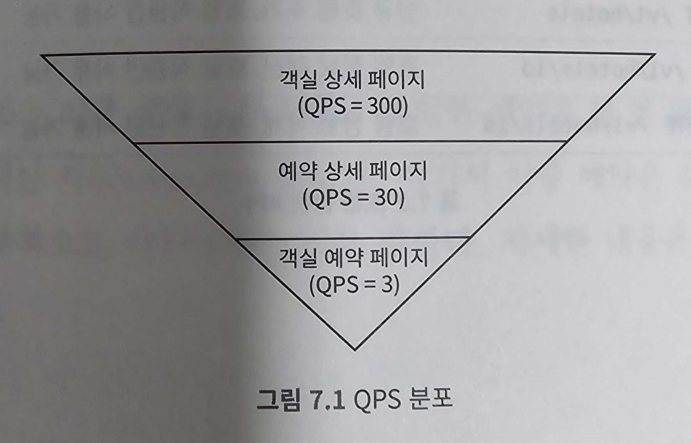

## 2단계: 개략적 설계안 제시 및 동의 구하기

### API 설계

#### 호텔 관련 API

|API|설명|
|---|---|
|GET /v1/hotels/id|호텔의 상세 정보 반환|
|POST /v1/hotels|신규 호텔 추가. 호텔 직원만 사용 가능|
|PUT /v1/hotels/id|호텔 정보 갱신. 호텔 직원만 사용 가능|
|DELETE /v1/hotels/id|호텔 정보 삭제. 호텔 직원만 사용 가능|

#### 객실 관련 API

|API|설명|
|---|---|
|GET /v1/hotels/:id/rooms/id|객실 상세 정보 반환|
|POST /v1/hotels/:id/rooms|신규 객실 추가. 호텔 직원만 사용 가능|
|PUT /v1/hotels/:id/rooms/id|객실 정보 갱신. 호텔 직원만 사용 가능|
|DELETE /v1/hotels/:id/rooms/id|객실 정보 삭제. 호텔 직원만 사용 가능|

#### 예약 관련 API

|API|설명|
|---|---|
|GET /v1/reservations|로그인 사용자의 예약 이력 반환|
|GET /v1/reservations/id|특정 예약의 상세 정보 반환|
|POST /v1/reservations|신규 예약|
|DELETE /v1/reservations/id|예약 취소|

새 예약을 만들 때 API에 전달하는 인자의 형태는 다음과 같다.
```json
{
    "startDate": "2021-04-28",
    "endDate": "2024-04-30",
    "hotelID": "245",
    "roomID": "U12345673389",
    "reservationID": "13422445"
}
```

reservationID는 이중 예약을 방지하고 동일한 예약은 단 한 번만 이루어지도록 보증하는 멱등 키(idempotent key)다.

### 데이터 모델

지원해야 하는 질의
1. 호텔 상세 정보 확인
2. 지정된 날짜 범위에 사용 가능한 객실 유형 확인
3. 예약 정보 기록
4. 예약 내역 또는 과거 예약 이력 정보 조회

관계형 데이터베이스 선택
- 읽기 빈도가 쓰기 연산에 비해 높은 작업 흐름을 잘 지원
- ACID 속성(원자성, 일관성, 격리성, 영속성)을 보장
- 데이터를 쉽게 모델링할 수 있음
  
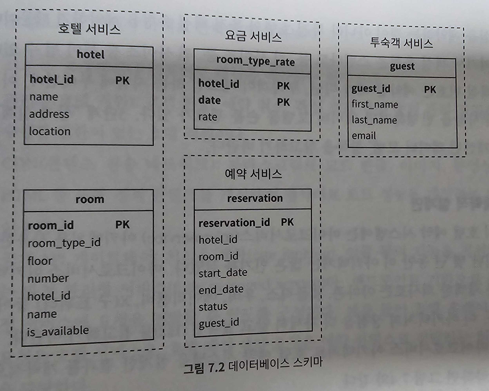

reservation 테이블의 status 필드
- pending(결제 대기), paid(결제 완료), refunded(환불 완료), canceled(취소), rejected(승인 실패)로 구성
- 상태 천이도(state machine) 다이어그램
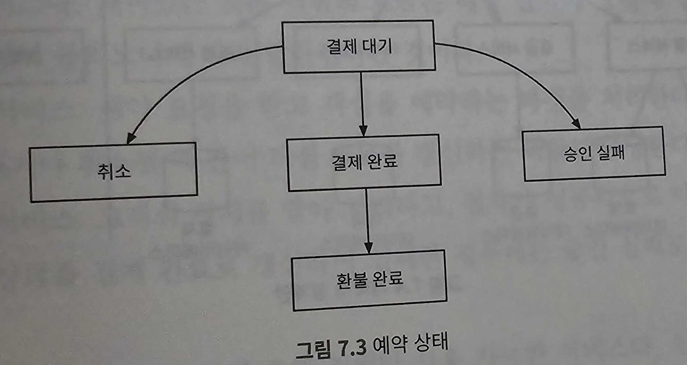

위 설계의 경우 문제가 있다.<br>
room_id의 경우 에어비엔비 같은 시스템에서는 적합하지만, 방을 예약하지 않고 객실 유형을 예약하는 호텔 시스템의 경우 적합하지 않다.<br>
여기서 객실 유형은 스탠다드 룸, 킹 사이즈 룸, 퀸 사이즈 룸 등이 될 수 있다.<br>
객실 번호는 예약할 때가 아닌, 투숙객이 체크인 하는 시점에 부여된다.<br>
뒤에서 데이터 모델을 손볼 예정이다.

### 개략적 설계안

이 호텔 예약 시스템에는 마이크로서비스(microservice) 아키텍처를 사용

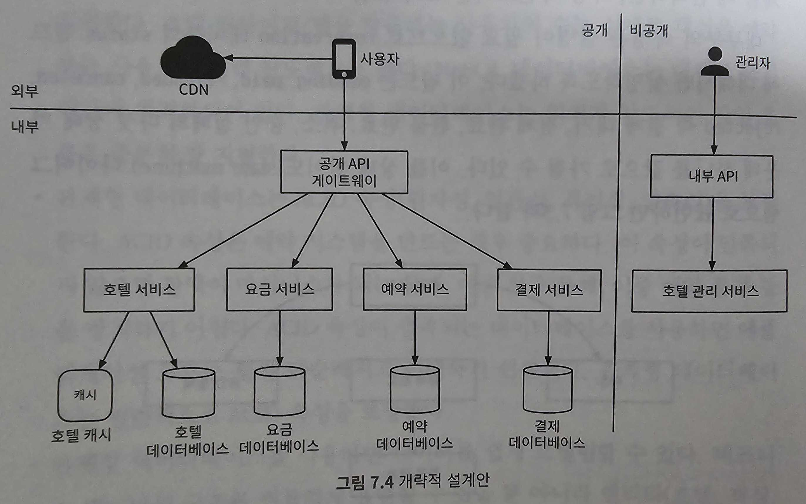

- 사용자: 휴대폰이나 컴퓨터로 객실을 예약하는 당사자
- 관리자(호텔 직원): 고객 환불, 예약 취소, 객실 정보 갱신 등의 관리 작업을 수행할 권한이 있는 호텔 직원
- CDN(Content Delivery Network): javascript 코드 번들, 이미지, 동영상, HTML 등 모든 정적 콘텐츠를 캐시하여 웹사이트 로드 성능을 개선하는데 이용
- Public API Gateway: 처리율 제한(rate limiting), 인증 등의 기능을 지원하는 완전 관리형 서비스(full managed service). 엔드포인트 기반으로 특정 서비스에 요청을 전달할 수 있도록 한다.
- Internal API: 승인된 호텔 직원만 사용 가능한 API로, 내부 소프트웨어나 웹사이트를 통해서 사용 가능. VPN(Virtual Private Network) 등의 기술을 사용해 외부 공격으로부터 보호
- 호텔 서비스: 호텔과 객실에 대한 상세 정보를 제공. 쉽게 캐시해 둘 수 있는 데이터
- 요금 서비스: 미래의 어떤 날에 어떤 요금을 받아야 하는지 데이터를 제공하는 서비스. 객실의 요금은 해당 날짜에 호텔에 얼마나 많은 손님이 몰리냐에 따라 달라진다.
- 예약 서비스: 예약 요청을 받고 객실을 예약하는 과정을 처리. 객실이 예약되거나 취소될 때 잔여 객실 정보를 갱신하는 역할도 담당
- 결제 서비스: 고객의 결제를 맡아 처리하고, 절차가 성공적으로 마무리되면 예약 상태를 결제 완료로 갱신하며 실패한 경우에는 승인 실패로 업데이트
- 호텔 관리 서비스: 승인된 호텔 직원만 사용 가능한 서비스. 임박한 예약 기록 확인, 고객 객실 예약, 예약 취소 등의 기능을 제공 (일종의 어드민툴)

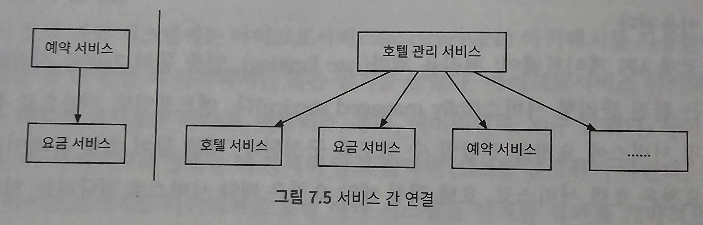

실제 상업적으로 이용되는 시스템의 서비스 간 통신에는 gRPC와 같응ㄴ 고성능 원격 프로시저 호출(Remote Procedure Call, RPC) 프레임워크를 사용하곤 한다.

## 3단계: 상세 설계

### 개선된 데이터 모델

예약 API의 경우 호출 인자 가운데 roomID는 roomTypeID로 변경

```json
POST /v1/reservations
{
    "startDate": "2021-04-28",
    "endDate": "2024-04-30",
    "hotelID": "245",
    "roomTypeID": "U12345673389",
    "reservationID": "13422445"
}
```

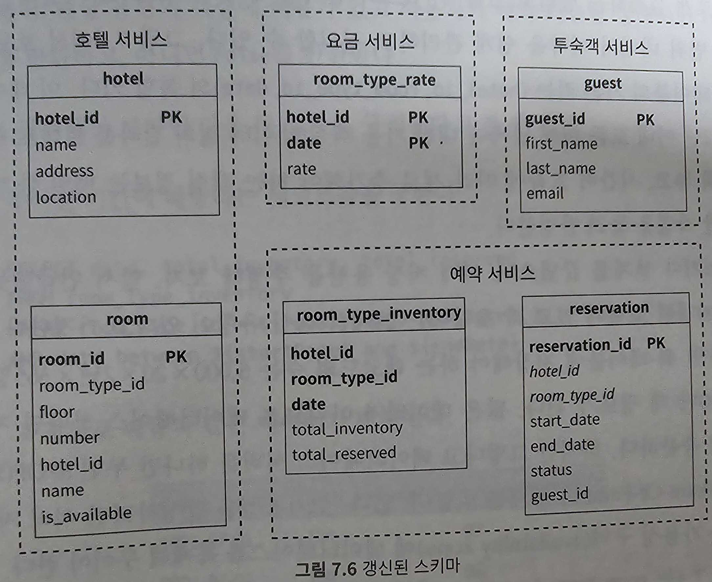

가장 중요하게 바뀐 부분
- room: 객실에 관계된 정보를 담는다.
- room_type_rate: 특정 객실 유형의 특정 일자 요금 정보를 담는다.
- reservation: 투숙객 예약 정보를 담는다.
- room_type_inventory: 호텔의 모든 객실 유형을 담는 테이블
  - hotel_id: 호텔 식별자
  - room_type_id: 객실 유형 식별자
  - date: 일자
  - total_inventory: 총 객실 수에서 일시적으로 제외한 객실 수를 뺀 값. 일부 객실은 유지보수를 위해 예약 가능 목록에서 빼 둘 수 있어야 함
  - total_reserved: 지정된 hotel_id, room_type_id, date에 예약된 모든 객실의 수

이 테이블의 기본 키는 (hotel_id, room_type_id, date)의 복합 키다.<br>
이 테이블은 2년 이내 모든 미래 날짜에 대한 가용 객실 데이터 질의 결과를 토대로 미리 채워 놓고, 시간이 흐름에 따라 새로 추가해야 하는 객실 정보는 매일 한 번씩 일괄 작업을 톨려 반영한다.<br>
저장해야 할 레코드 수는 5,000(호텔 수) X 20(객실 유형) X 2년 X 365일 = 7,300만 개<br>
많은 데이터가 아니긴 하지만 SPOF(Single-Point-Of-Failure) 문제를 피하기 위해 여러 지역, 또는 가용성 구역(availability zone)에 데이터를 복제해 둔다.

- room_type_inventory 테이블 데이터 예제

| hotel_id | room_type_id | date | total_inventory | total_reserved |
| --- | --- | --- | --- | --- |
| 211 | 1001 | 2021-06-01 | 100 | 80 |
| 211 | 1001 | 2021-06-02 | 100 | 82 |
| 211 | 1001 | 2021-06-03 | 100 | 86 |
| 211 | 1001 | ... | ... | ... |
| 211 | 1001 | 2025-05-31 | 100 | 0 |
| 211 | 1002 | 2021-06-01 | 200 | 164 |
| 2210 | 101 | 2021-06-01 | 30 | 23 |
| 2210 | 101 | 2021-06-02 | 30 | 25 |

1. 주어진 기간에 해당 하는 레코드들을 구한다.

```sql
SELECT date, total_inventory, total_reserved FROM room_type_inventory WHERE room_type_id = ${roomTypeId} AND hotel_id = ${hotelId} AND date BETWEEN ${startDate} AND ${endDate}
```

| date | total_inventory | total_reserved |
| --- | --- | --- |
| 2021-07-01 | 100 | 97 |
| 2021-07-02 | 100 | 96 |
| 2021-07-03 | 100 | 95 |

2. 반환된 각 레코드마다 다음 조건을 확인한다.

```
if ((total_reserved + ${numberOfRoomsToReserve}) <= total_inventory)
```

레코드의 모든 행을 검사한 결과 True가 반환되면 주어진 기간 내 모든 날짲에 충분한 객실이 있다는 뜻.<br>
요구사항 가운데 하나는 10%의 초과 예약이 가능하도록 해 달라는 것이 있다.

```
if ((total_reserved + ${numberOfRoomsToReserve}) <= 110% * total_inventory)
```

예약 데이터가 단일 데이터베이스에 담기에 너무 크면 어떻게 할까?
- 현재 및 향후 예약 데이터만 저장한다. 예약 이력은 아카이빙하거나 냉동 저장소(cold storage)로 옮길 수 있다.
- 데이터베이스를 샤딩한다. 데이터는 hash(hotel_id) % number_of_servers로 샤딩해 두면 된다.

### 동시성 문제

- 같은 사용자가 예약 버튼을 여러 번 누를 수 있다.
- 여러 사용자가 같은 객실을 동시에 예약하려 할 수 있다.

**시나리오 1**

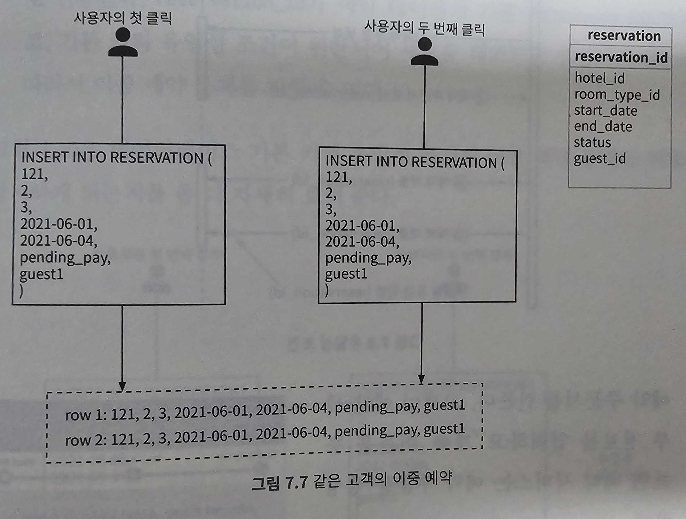

- 클라이언트 측 구현: 클라이언트가 요청을 전송하고 난 다음에 '예약' 버튼을 회색으로 표시하거나, 숨기거나, 비활성화하는 것. 안정적이지는 않다.
- 멱등(idempotent) API: 멱등 키를 추가하는 방안. 몇 번을 호출해도 같은 결과를 내는 API를 멱등 API라고 부른다. reservation_id를 멱등 키로 사용하여 이중 예약 문제를 해결하는 방안

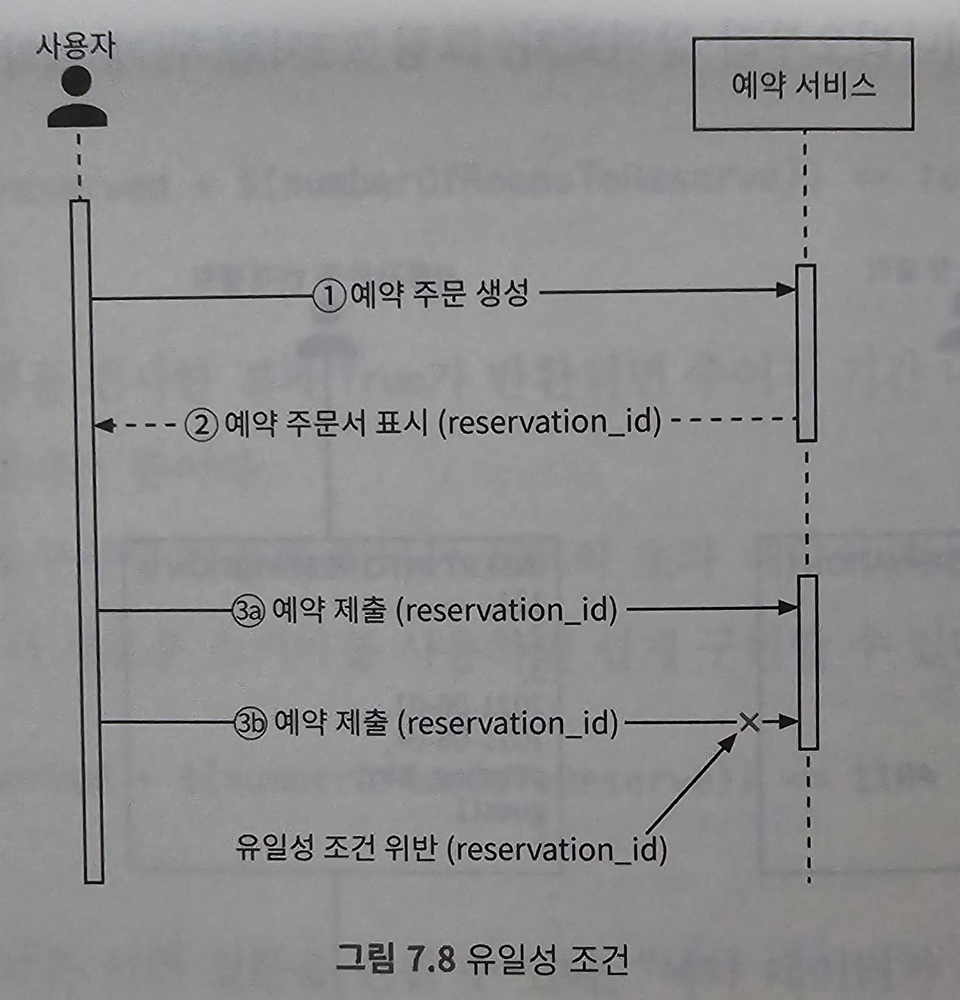

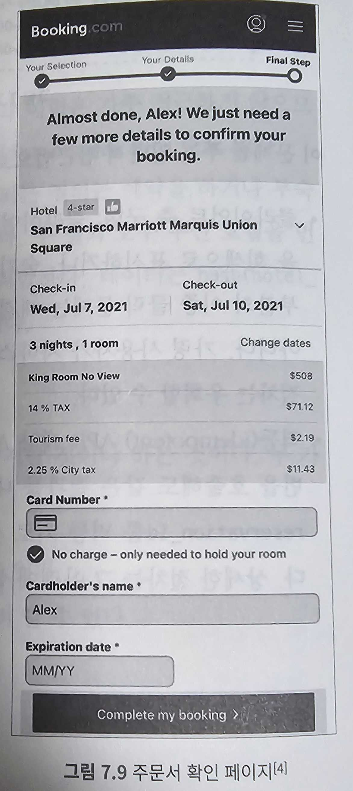

1. 예약 주문서를 만든다.
2. 고객이 검토할 수 있도록 예약 주문서를 반환한다. 이때 API는 반환 결과에 reservation_id를 넣는다.
3. 검토가 끝난 예약을 전송한다. reservaion_id가 붙는다.
   - 사용자가 예약 완료 버튼을 한 번 더 누르는 바람에 같은 예약이 다시 서버로 전송된다.
   - reservation_id가 예약 테이블의 기본 키(primary key)이므로, 기본 키의 유일성 조건이 위반되어 새로운 레코드는 생성되지 않는다.

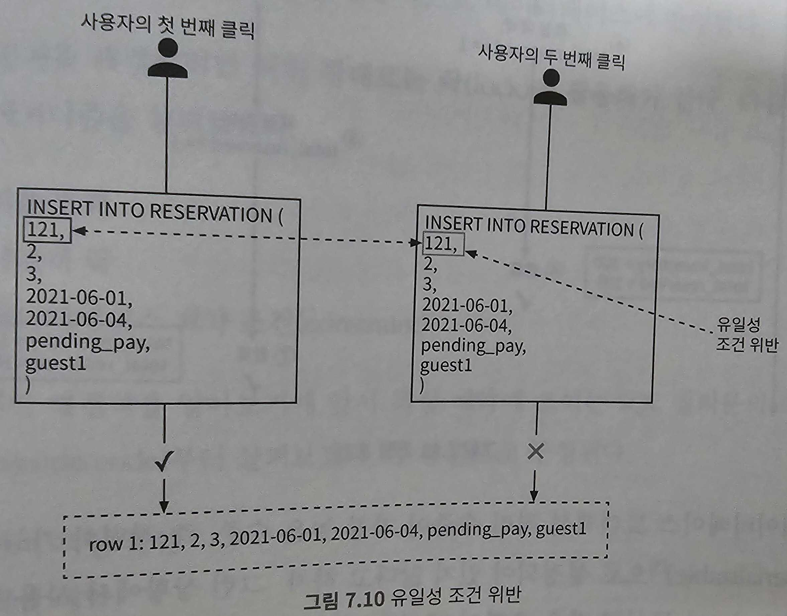

**시나리오 2**

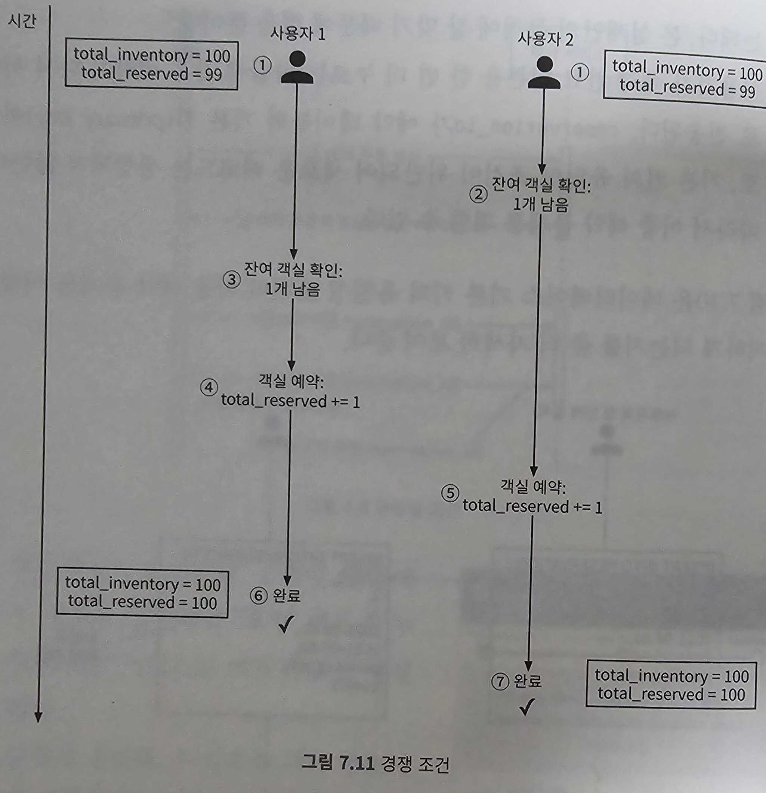

1. 데이터베이스 트랜잭션 격리 수준이 serializable로 설정되어 있지 않다고 하자.
   - 사용자 1과 사용자 2가 동시에 같은 유형의 객실을 예약하려고 하지만 남은 객실은 하나 뿐이다.
   - 사용자 1의 트랜잭션을 트랜잭션 1이라고 하고, 사용자 2는 트랜잭션 2라고 하자.
2. 트랜잭션 2는 (total_reserved + rooms_to_back) <= total_inventory인지 검사. 하나 남아있으니 True 반환
3. 트랜잭션 1도 (total_reserved + rooms_to_back) <= total_inventory인지 검사. 하나 남아있으니 True 반환
4. 트랜잭션 1이 먼저 객실을 예약하고 객실 예약 현황을 갱신하여 reserved_room의 값은 100이 된다.
5. 그 직후 트랜잭션 2가 해당 객실을 예약한다.
   - ACID 속성 중 I, 즉 Isolation은 각 트랜잭션은 다른 트랜잭션과 무관하게 작업을 완료해야만 한다
   - 트랜잭션 1이 변경한 데이터는 트랜잭션 1이 완료되기 전에는(commit) 트랜잭션 2에 보이지 않는다.
   - 트랜잭션 2 관점에서 total_reserved의 값은 여전히 99
   - 트랜잭션 2도 예약을 완료하고 객실 예약 현황을 갱신
   - 따라서 reserved_room의 값은 100이 되고, 결과적으로 이중 예약이 발생
6. 트랜잭션 1이 변경 사항을 성공적으로 데이터베이스에 반영
7. 트랜잭션 2이 변경 사항을 성공적으로 데이터베이스에 반영

이 문제를 해결하려면 어떤 형태로든 락(lock)을 활용해야 함
- 비관적 락
- 낙관적 락
- 데이터베이스 제약 조건(constraint)

1단계: 예약 가능한 객실 현황 확인
```sql
SELECT date, total_inventory, total_reserved FROM room_type_inventory WHERE room_type_id = ${roomTypeId} AND hotel_id = ${hotelId} AND date BETWEEN ${startDate} AND ${endDate}
```

- 1단계에서 반환되는 모든 객실에 다음 사항 확인
```
if ((total_reserved + ${numberOfRoomsToReserve}) > 110% * total_inventory) {
    Rollback
}
```

2단계: 객실 예약
```sql
UPDATE room_type_inventory SET total_reserved = total_reserved + ${numberOfRoomsToReserve} WHERE room_type_id = ${roomTypeId} AND date BETWEEN ${startDate} AND ${endDate}

COMMIT
```

#### 방안 1: 비관적(Pessimistic) 락
- 사용자가 레코드를 갱신하려고 하는 순간 즉시 락을 걸어 동시 업데이터를 방지하는 기술
- 해당 레코드를 갱신하려는 다른 사용자는 먼저 락을 건 사용자가 변경을 마치고 락을 해제할 때까지 기다려야 한다.
- MySQL의 경우 "SELECT ... FOR UPDATE 문을 실행하면 SELECT가 반환한 레코드에 락이 걸린다.

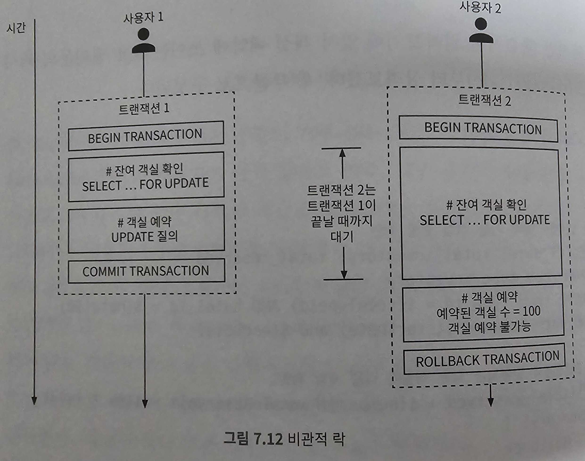

##### 장점
- 애플리케이션이 변경 중이거나 변경이 끝난 데이터를 갱신하는 일을 막을 수 있다.
- 구현이 쉽고 모든 갱신 연산을 직렬화하여 충돌을 막는다. 비관적 락은 데이터에 대한 경합이 심할 때 유용하다.

##### 단점
- 여러 레코드에 락을 걸면 교착 상태(deadlock)가 발생할 수 있다.
- 확장성이 낮다.

이런 이유로 **예약 시스템에 비관적 락 메커니즘을 사용하는 것을 권장하지 않는다.**

#### 방안 2: 낙관적(Optimistic) 락
- 일반적으로 버전 번호(version number)와 타임스탬프(timestamp)의 두 가지 방법으로 구현한다.
- 서버 시계는 시간이 지남에 따라 부정확해질 수 있으므로 일반적으로는 버전 번호를 더 나은 선택지로 본다.

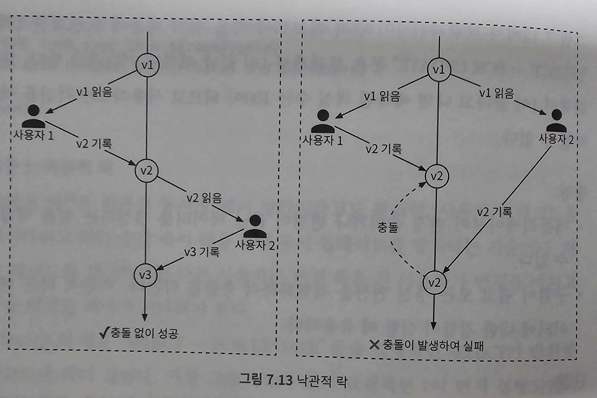

1. 데이터베이스 테이블에 version이라는 새 열을 추가
2. 사용자가 데이터베이스 레코드를 수정하기 전에 애플리케이션은 해당 레코드의 버전 번호를 읽는다.
3. 사용자가 레코드를 갱신할 때 애플리케이션은 버전 번호에 1을 더한 다음 데이터베이스에 다시 기록
4. 이때 유효성 검사를 한다. 즉, 다음 버전 번호는 현재 버전 번호보다 1만큼 큰 값이어야 한다. 이 유효성 검사가 실패하면 트랜잭션은 중단(abort)되고 사용자는 단계 2부터 다시 모든 절차를 반복

- 낙관적 락은 비관적 락보다 빠르다. 
  - 데이터베이스에 락을 걸지 않기 때문
- 동시성 수준이 아주 높으면 성능이 급격하게 나빠진다.
  - 많은 클라이언트가 같은 호텔 객실을 동시에 예약하는 경우 잔여 객실 수를 읽을 수 있는 클라이언트 수에 제한이 없으므로, 모든 클라이언트는 같은 잔여 객실 수와 같은 버전 번호 정보를 취득하게 될 것이다.
  - 하지만 실제로 버전 번호 갱신에 성공하는 클라이언트는 오직 하나이며, 다른 모든 클라이언트는 버전 번호 검사에 실패했다는 메시지를 받게 된다.
  - 실패한 클라이언트는 이제 다시 예약을 시도해야 한다. (retry)
  - 최종 결과는 정확하겠지만, 반복되는 재시도 때문에 사용자는 아주 불쾌한 경험을 하게 된다.

##### 장점
- 애플리케이션이 유효하지 않은 데이터를 편집하는 일을 막는다.
- 데이터베이스 자원에 락을 걸 필요가 없다.
- 낙관적 락은 데이터에 대한 경쟁이 치열하지 않은 상황에 적합

##### 단점
- 데이터에 대한 경쟁이 치열한 상황에서는 성능이 좋지 못하다.

**호텔 예약 시스템에 적합한 선택지다.** 예약 QPS가 일반적으로는 높지 않기 때문이다.

#### 방안 3: 데이터베이스 제약 조건
- 낙관적 락과 접근법은 아주 유사
- room_type_inventory 테이블에 다음 제약 조건을 추가
```sql
CONSTRAINT `check_room_count` CHECK((`total_inventory - total_reserved` >= 0))
```

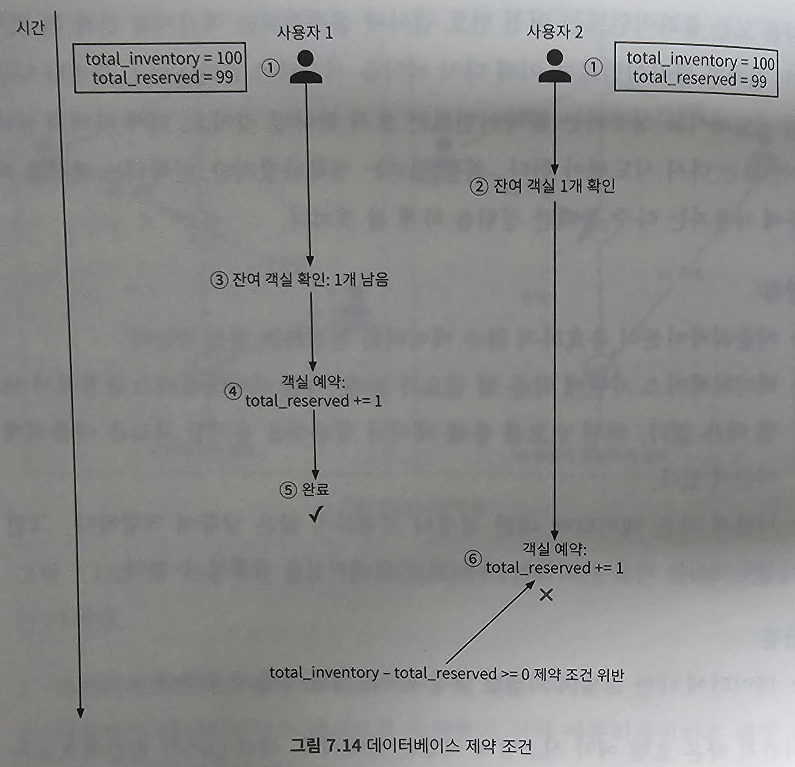

##### 장점
- 구현이 쉽다.
- 데이터에 대한 경쟁이 심하지 않을 때 잘 동작

##### 단점
- 데이터에 대한 경쟁이 심하면 실패하는 연산 수가 엄청나게 늘어날 수 있다.
- 데이터베이스 제약 조건은 애플리케이션 코드와 달라서 버전을 통제하기 어렵다.
- 제약 조건을 허용하지 않는 데이터베이스도 있으므로, 데이터베이스를 다른 제품으로 교체하려고 하면 문제가 생길 수 있다.

호텔 예약의 경우에는 데이터에 대한 경쟁이 심하지 않으므로(낮은 QPS), **좋은 선택지라고 할 수 있을 것이다.**

### 시스템 규모 확장

#### 데이터베이스 샤딩
- 데이터베이스를 여러 대 두고, 각각에 데이터의 일부만 보관하도록 하는 것이 기본적인 아이디어다.
- 이 시스템의 대부분 질의는 hotel_id를 필터링 조건으로 사용하다. 따라서 자연스럽게 hotel_id를 샤딩 조건으로 쓰면 좋다.
- 데이터베이스 부하를 16개 샤드로 분산하는 사례다.
  - QPS가 30,000이면 샤딩 후에 각 샤드는 30,000 / 16 = 1875QPS를 처리하게 된다. MySQL 한 대로 감당할 수 있는 부하다.

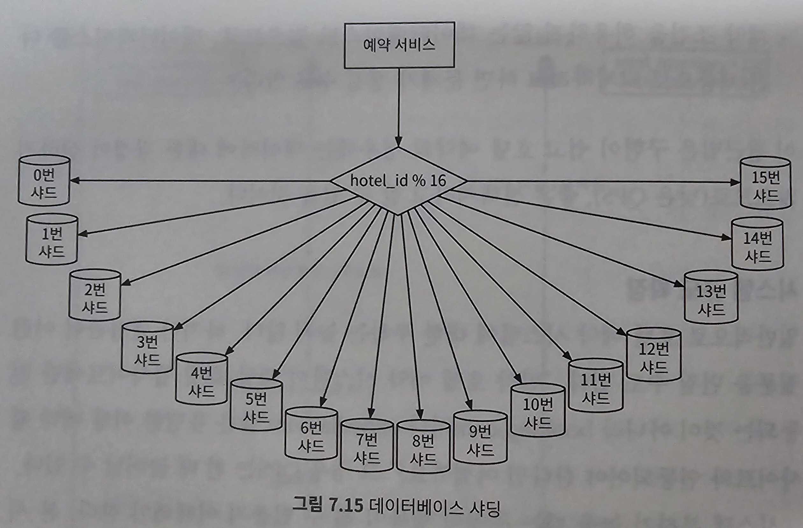

#### 캐시
- 호텔 잔여 객실 데이터는 오직 현재와 미래의 데이터만이 중요하다. 
  - 과거의 객실을 예약하지는 않기 때문
- 데이터를 보관할 때 낡은 데이터는 자동적으로 소멸되도록 TTL(Time-To-Live)을 설정할 수 있다면 바람직하다.
- 레디스(Redis)는 이런 상황에 적합한데 TTL과 LRU(Least Recently Used) 캐시 교체 정책을 사용하여 메모리를 최적으로 활용할 수 있기 때문
- 이렇게 하면 요청 가운데 일부만 잔여 객실 데이터베이스가 처리하고 나머지는 캐시가 담당
- 그러나 레디스 캐시 데이터에는 잔여 객실이 충분해 보여도 데이터베이스를 다시 한 번 확인할 필요가 있다는 점에 유의

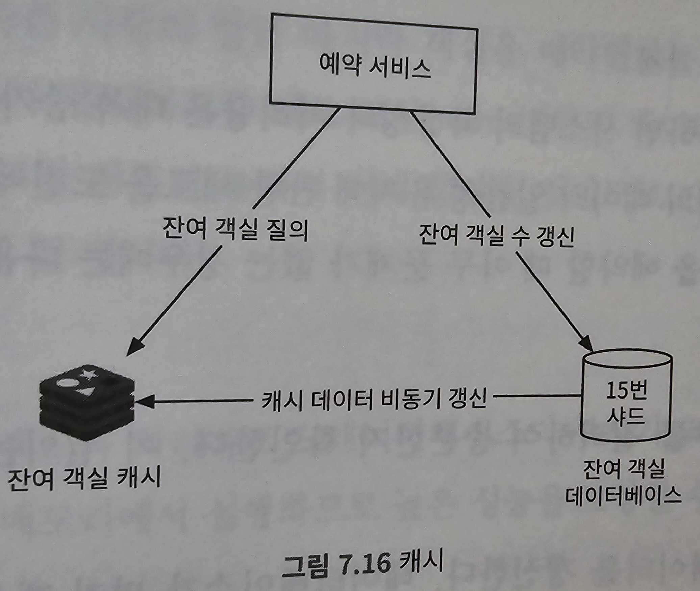

- 예약 서비스: 다음과 같은 잔여 객실 관리 API 제공
  - 지정된 호텔과 객실 유형, 주어진 날짜 범위에 이용 가능한 객실의 수를 질의
  - 객실을 예약하고 total_reserved의 값을 1 증가
  - 고객이 예약을 취소하면 잔여 객실 수를 갱신
- 잔여 객실 캐시: 모든 잔여 객실 관리에 필요한 질의는 레디스로 구현되는 잔여 객실 캐시로 옮긴다. 따라서 사전에 잔여 객실 정보를 캐시에 미리 저장해 두어야 한다.
  - 키: hotelID_roomTypeID_{날짜}
  - 값: 주어진 호텔ID, 객실 유형 ID, 그리고 날짜에 맞는 잔여 객실 수
- 잔여 객실 데이터베이스: 잔여 객실 수에 대한 가장 믿을 만한 정보가 보관되는 장소다.

##### 캐시가 주는 새로운 과제
- 캐시 계층을 추가하면 시스템의 확장성과 처리량을 대폭 증가하지만 데이터베이스와 캐시 사이의 데이터 일관성 유지에 관한 새로운 도전에 직면하게 된다.

1. 잔여 객실 수를 질의하여 충분한지 확인한다. 이 질의는 캐시에서 실행된다.
2. 잔여 객실 데이터를 갱신한다.
   - 데이터베이스가 먼저 갱신되고, 캐시에는 비동기적으로 변경 내역이 반영된다.
   - 이 비동기적 갱신 작업은 애플리케이션 측에서 수행할 수도 있는데, 그 경우 애플리케이션은 데이터베이스에 데이터를 저장한 다음에 캐시 데이터를 수정한다.
   - 변경 데이터 감지(Change Data Capture, CDC)라는 메커니즘을 사용하는 방법도 있다.
   - CDC는 데이터베이스에서 발생한 변화를 감지하여 해당 변경 내역을 다른 시스템에 적용할 수 있도록 하는 메커니즘이다.
   - 보편적으로 많이 사용되는 솔루션으로는 드베지움(Debezium)이라는 것이 있다.
   - 데이터베이스에서 발생한 변경 내역을 읽는 소스 커넥터(source connector)로 하여금 데이터베이스 변화를 감지하여 레디스 같은 캐시 시스템에 반영하도록 하는 방안이다.

잔여 객실 데이터에 대한 변화를 데이터베이스에 먼저 반영하므로 캐시에는 최신 데이터가 없을 가능성이 있다.<br>
하지만 이런 데이터 불일치는 데이터베이스가 최종적으로 잔여 객실 확인을 하도록 하면 문제가 되지 않는다.<br>
클라이언트는 다른 사람이 방금 마지막 객실을 예약했다는 오류 메시지를 보게된다.<br>
사용자가 웹사이트를 새로 고침(refresh)하면 데이터베이스와 캐시의 동기화는 새로 고침 버튼이 눌리기 전에 끝났을 것이므로 잔여 객실이 없다는 사실을 확인하게 될 것이다.

##### 장점
- 읽기 질의를 캐시가 처리하므로 데이터베이스의 부하가 크게 줄어든다.
- 읽기 질의를 메모리에서 실행하므로 높은 성능을 보장할 수 있다.

##### 단점
- 데이터베이스와 캐시 사이의 데이터 일관성을 유지하는 것은 어려운 문제다. 데이터 불일치가 사용자 경험에 어떤 영향을 끼치게 될지 신중하게 따져보아야 한다.

#### 서비스 간 데이터 일관성
- 모노리스 아키텍처(monolith architecture)의 경우 데이터의 일관성을 보장하기 위해 관계형 데이터베이스를 공유하는 것이 보통
- 본 설계안이 채택한 마이크로서비스 기반 아키텍처는 예약 서비스가 예약 및 잔여 객실 API를 모두 담당하도록 하고, 예약 테이블과 잔여 객실 테이블을 동일한 관계형 데이터베이스에 저장하는 하이브리드 접근법을 택했다.
  - 마이크로서비스 순수주의자라면 이런 하이브리드 접근법에 이의를 제기할 수도 있다.
  - 마이크로서비스 아키텍처라면 각 마이크로서비스가 독자적인 데이터베이스를 갖추고 있어야 하는 것으로 생각할 수 있기 때문
  - 이런 교조주의적 접근은 다양한 데이터 일관성 문제를 낳는다.

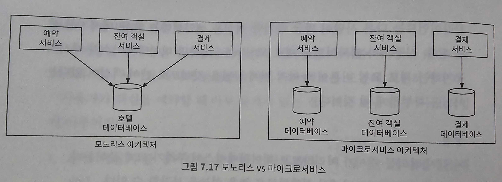

아래 이미지의 모노리스 아키텍처의 경우에는 여러 연산을 하나의 트랜잭션으로 묶어 ACID 속성이 만족되도록 보장할 수 있다.

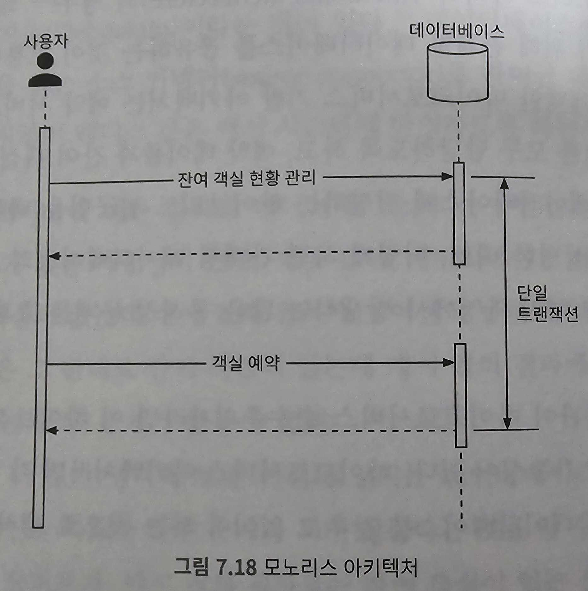

하지만 각 서비스가 독자적인 데이터베이스를 갖도록 하면, 논리적으로는 하나의 원자적 연산이 여러 데이터베이스에 걸쳐 실행되는 일을 피할 수 없다.<br>
하나의 트랜잭션으로 데이터 일관성을 보증하는 기법을 사용할 수 없다는 뜻이다.

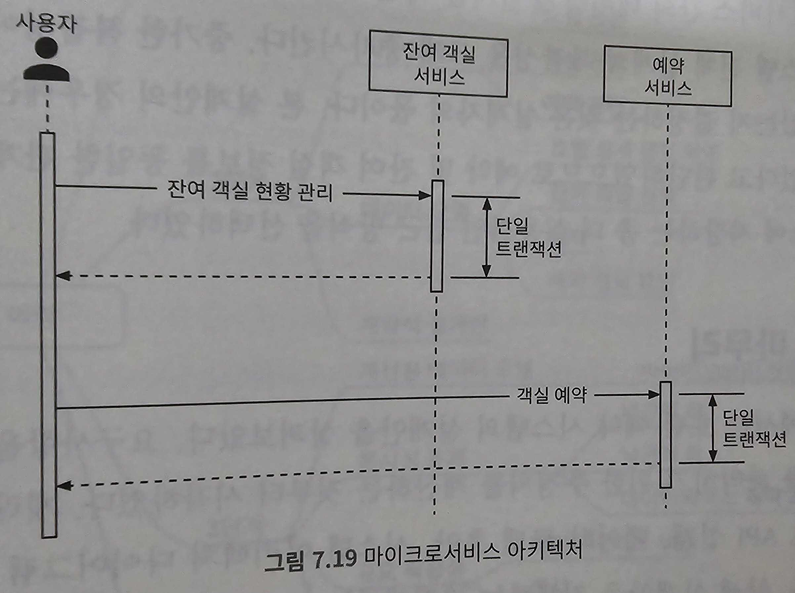

이런 데이터 일관성 문제를 해결하기 위해 업계에서 널리 사용되는 방법을 개략적으로 소개하면 다음과 같다.
- 2단계 커밋(2-phase commit, 2PC): 2PC는 여러 노드에 걸친 원자적 트랜잭션 실행을 보증하는 데이터베이스 프로토콜이다. 
  - 즉, 모든 노드가 성공하든 아니면 실패하든 둘 중 하나로 트랜잭션이 마무리되도록 보증한다는 것이다. 
  - 2PC는 비중단 실행이 가능한 프로토콜이 아니기 때문에(blocking protocol) 어느 한 노드에 장애가 발생하면 해당 장애가 복구될 때까지 진행이 중단된다. 
  - 성능이 뛰어난 프로토콜이 아니다.
- 사가(Saga): 사가는 각 노드에 국지적으로 발생하는 트랜잭션을 하나로 엮는 것이라 보면 된다. 
  - 각각의 트랜잭션은 완료되면 다음 트랜잭션을 시작하는 트리거로 쓰일 메시지를 만들어 보낸다.
  - 어느 한 트랜잭션이라도 실패하면 사가는 그 이전 트랜잭션의 결과를 전부 되돌리는 트랜잭션들을 순차적으로 실행한다.
  - 2PC는 여러 노드에 걸친 하나의 트랜잭션을 통해 ACID 속성을 만족시키는 개념이지만 사가는 각 단계가 하나의 트랜잭션이라서 결과적 일관성(eventual consistency)에 의존하는 것으로 보아야 한다.

마이크로서비스 간의 데이터 불일치를 해결하기 위해 사용되는 복잡한 메커니즘은 시스템 전체 설계의 복잡성을 크게 증가시킨다.

## 4단계: 마무리

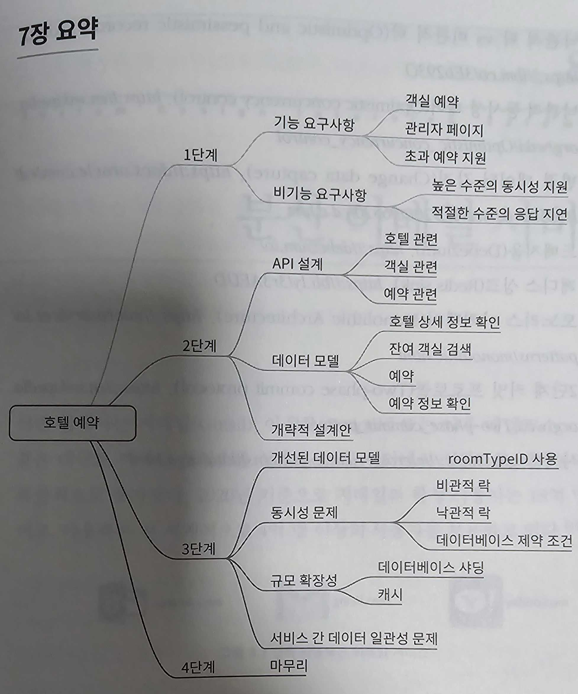