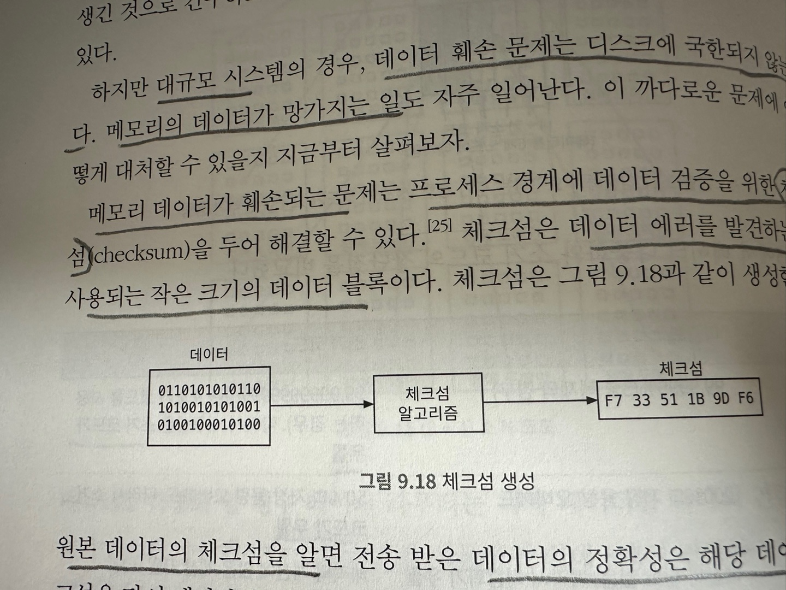

# S3 와 유사한 객체 저장소 

이번 장에서는 아마존 S3(Simple Storage Service) 와 유사한 객체 저장소 서비스를 설계해보겠다.  
S3 는 AWS 가 제공하는 서비스로 RESTful API 기반 인터페이스로 이용 가능한 객체 저장소이다.  
  
먼저 일반적인 저장소란 어떤 시스템인지 알아보자.  
# 저장소 시스템 101 

개략적으로 보면 저장소 시스템에는 다음 세 가지 부류가 있다. 
- 블록(block) 저장소 
- 파일(file) 저장소 
- 객체(object) 저장소 

## 블록 저장소 
- 1990년 대에 처음 등장 
- HDD(Hard Disk Drive) 나 SSD(Solid State Drive) 처럼 서버에 물리적으로 연결되는 형태의 드리아브
- 블록 저장소는 원시 블록을 서버의 볼륨 형태로 제공 
- 가장 유연하고 융통성이 높은 저장소 
- 서버는 원시 블록을 포맷한 다음 파일 시스템으로 이용 가능 
- 어플리케이션에서 블록 제어권을 갖고 사용 가능 ex) 데이터베이스, 가상 머신 엔진
- 업계 표준 연결 프로토콜인 FC(Fibre Channel) 이나 iSCSI 를 통해서 네트워크로 연결될 수 있음 

## 파일 저장소 
- 파일 저장소는 블록 저장소 위에 구현됨 
- 파일과 디렉터리를 손쉽게 다루는 데 필요한 더 높은 수준의 추상화를 제공 
- 데이터는 계층적으로 디렉터리 안에 보관됨 
- 가장 널리 사용되는 범용 저장소 솔루션 
- SMB/CIFS 이나 NFS 와 같은 파일 수준 네트워크 프로토콜을 이용하면 하나의 저장소를 여러 서버에 동시에 붙일 수 있음 

## 객체 저장소
- 새로운 형태의 저장소다. 
- 데이터 영속성을 높이고 대규머 어플리케이션을 지원하며 비용을 낮추기 위해 의도적으로 성능을 희생함 
- 실시간으로 갱신 할 필요가 없는 상대적으로 '차가운' 데이터를 보관
- 주로 데이터 아카이브나 백업에 주로 쓰인다 
- 모든 데이터를 수평적 구조로 객체로 보관함 
- 데이터 접근은 보통 RESTful API 를 이용 
- 다른 유형의 저장소에 비해 상대적으로 느림 
- 대부분의 클라우드 사업자는 AWS S3, Azure Blob Storage 같은 객체 저장소를 제공 

## 비교 

  
  
각 저장소별 특성 
  

## 용어 정리 
객체 저장소의 핵심 개념을 먼저 이해 하기 위해서 용어를 개괄하겠다. 
- 버킷(bucket): 객체를 보관하는 논리적 컨테이너. 버킷 이름은 전역적으로 유일해야 한다. (S3 에서 데이터 업로드 하기전에 버킷을 생성해야함)
- 객체(object): 객체는 버킷에 저장되는 개별 데이터. 객체는 데이터(payload)와 메타 데이터를 갖는다. 메타 데이터는 객체를 기술하는 용도 
- 버전(versioning): 한 객체의 여러 버전은 같은 버킷 안에 둘 수 있도록 하는 기능. 버킷마다 별도 설정이 가능하고 실수 지웠거나 덮어쓴 객체를 복구하는 용도로 사용됨 
- URI(Uniform Resource Identifier): 객체 저장소는 RESTful API 로 제공되기 때문에 각 개체는 API URI 를 통해 고유하게 식별 가능 
- SLA(Service Level Agreement): 서비스 수준 협약은 서비스 제공자와 클라이언트 사이의 맺어지는 계약
  
ex) S3 저장소는 다음 SLA 만족한다고 공개하고 있음  
- 여러 가용성 규역에 걸쳐 99.9999% 의 객체 내구성을 제공하도록 설계 
- 하나의 가용성 구연 전체가 소실되어도 데이터 복원 가능 
- 연간 99.9%의 가용성 제공 

# 1단계: 문제 이해 및 설계 범위 확정 

> 지원자: 어떤 기능을 지원해야 하나요?  
> 면접관: 다음 기능을 제공하는 S3와 유사한 객체 저장소 시스템을 설계해봅시다.    
> - 버킷 생성
> - 객체 업로드 및 다운로드
> - 객체 버전 
> - 버킷 내 객체 목록 출력 기능 (aws s3 ls 명령어와 유사)
> 
> 지원자: 데이터 크기는 어느정도 인가요?   
> 면접관: 아주 큰 객체(GB) 와 다량의 소형 객체(KB) 를 효율적으로 저장할 수 있어야 합니다.  
> 지원자: 매년 추가되는 데이터는 어느 정도 입니까?  
> 면접관: 100PB 입니다.  
> 지원자: 99.9999% 데이터 내구성과 99.99%의 서비스 가용성을 보장해야 할까요?  
> 면접관: 네. 그정도면 만족스러운 것 같습니다.

## 비기능 요구사항 
- 100PB 데이터 
- 식스 나인(six nines, 99.9999%) 수준의 데이터 내구성 
- 포 나인(four nines, 99.99%) 수준의 서비스 가용성 
- 저장소 효율설: 높은 수준의 안정성과 성능은 보장하되 저장소 비용은 최대한 낮춰야 한다. 

## 대략적인 규모 추정 
객체 저장소는 디스크 용량이나 초당 디스크 IO 가 병목이 될 가능성이 높다.  
- 디스크 용량: 객체 크기가 다음 분포를 따른다고 가정 
  - 객체 가운데 20%는 그 크기가 1MB 미만의 작은 객체
  - 60% 정도의 객체는 1MB ~ 64MB 정도 크기의 중간 크기의 객체
  - 20% 정도는 64MB 이상의 대형 객체 
- IOPS: SATA 인터페이스를 탑재하고 7200rpm을 지원하는 하드 디스크 하나가 초당 100~150 회의 임의 데이터 탐색을 지원할 수 있다고 가정 

이 가정에 기반해서 저장 가능한 객체 수를 가늠할 수 있다.  
객체 유형별 중앙값을 이용해 계산을 쉽게 하자.  
(소형 0.5MB, 중형 32MB, 대형 200MB)  
40% 의 저장 공간 사용률을 유지하는 경우 다음과 같이 계산할 수 있다.  
- 100PB = 10<sup>11</sup> MB
- 10<sup>11</sup> x 0.4 (40%) / 0.2x0.5MB + 0.6x32MB + 0.2x200MB = 6억 8천만 개 객체 
- 모든 객체의 메타 데이터 크기가 대략 1KB 라고 가정하면, 모든 메타 데이터 저장 = 0.68TB 필요 

이 수치들을 직접 사용하지는 않지만 시스템 규모가 어느 정도 일지 예측해보는 것은 좋다.

# 2단계: 개략적 설계안 제시 및 동의 구하기 
먼저 객체 저장소의 몇 가지 흥미로운 속성을 알아보자.
- 객체 불변성: 객체 저장소에 저장되는 객체들은 변겅이 불가능함. 삭제한 다음 새 버전으로 대체 될 수는 있어도 값을 변경하는건 불가능
- 키-값 저장소: 객체의 URI 사용하여 데이터를 가져오기 때문에 URI 는 하나의 key 로 키-값 저장소라고 볼 수 있다. 

```shell
GET /bucket1/object1.txt HTTP/1.1

HTTP/1.1 200 OK
Content-Length: 4257
객체 데이터
```

- 저장은 1회, 읽기는 여러 번: 데이터 접근 패턴 측면에서 쓰기는 1회 읽기는 여러 번 발생 
- 소형 및 대형 객체 동시 지원: 다양한 크기의 객체를 저장할 수 있다.
  
객체 저장소의 설계 철학은 UNIX 파일 시스템의 설계 철학과 아주 비슷하다.  
  

UNIX 파일 시스템 
- UNIX 의 경우 로컬 파일 시스템에 저장하면, 파일의 이름과 데이터는 같은 곳에 저장하지 않음 
- 파일 이름은 '아이노드(inode)' 라는 자료구조에 저장하고 데이터는 디스크의 다른 곳에 저장됨 
- 아이 노드에는 데이터가 저장되는 디스크 상의 위치를 가리키는 블록 포인터 목록이 저장됨 
- 따라서 파일을 읽을 때 아이노드에서 메타 데이터를 읽어서 블록 포인터 목록을 확보한 다음 그 포인터를 따라가 데이터를 읽어야 함 
  
객체 저장소 
- 객체 저장소의 메타 데이터 저장소는 아이노드에 해당 
- 객체 데이터가 저장되는 데이터 저장소는 하드 디스크에 해당
- 메타 데이터 저장소에는 객체를 요청하는데 필요한 식별자가 보관됨 
- 메타 데이터와 객체의 실제 데이터를 분리하면 설계가 단순해짐 
- 데이터는 불변이고 메타 데이터 저장소에 봐관하는 데이터는 변경 가능함 

버킷과 객체 
  

## 개략적 설계안 
  

- API 서비스: IAM(Identity & Access Management) 서비스, 메타 데이터 서비스, 저장소 서비스에 대한 호출을 조율하는 역할
- IAM 서비스: 인증, 권한 부여, 접근 제어 등을 중앙에서 맡아서 처리함 
  - 인증은 호출 주제를 확인 하는 용도
  - 권한 부여는 인증된 사용자가 해당 작업을 수행할 수 있는지 검사 
- 데이터 저장소: 실제 데이터를 보관하고 필요할 때마다 읽어가는 장소 
- 메타데이터 저장소: 객체 메타 데이터를 보관하는 장소

메타 데이터 저장소와 데이터 저장소는 논리적 구분일 뿐이며 구현 방법은 여러가지가 있을 수 있다.  
  
객체 저장소가 지원해야 하는 작업 흐름
- 객체 업로드
- 객체 다운로드 
- 객체 버전 및 버킷 내 모든 객체 목록 출력 

## 객체 업로드 


1. 클라이언트는 bucket-to-share 버킷을 생성하기 위한 PUT 요청을 보냄 
2. API 서비스는 IAM 호출하여 WRITE 권한이 있는지 검사 
3. API 서비스는 메타데이터 DB에 버킷 정보를 등록요청 후 클라이언트로 응답 
4. 버킷이 만들어지고 나면 클라이언트는 script.txt 객체를 생성하기 위한 PUT 요청 
5. API 서비스는 해당 사용자 인증 및 WRITE 권한 검사 
6. API 서비스는 HTTP PUT 요청 body 의 객체 데이터를 데이터 저장소로 보내고 데이터 저장소는 객체를 저장 한 뒤 UUID 를 반환 
7. API 서비스는 메타 데이터 저장소를 호출해 새로운 항목을 등록 

메타 데이터 저장소에 저장되는 항목 
  

객체를 업로드 하는 API 호출 
```shell
PUT /bucket-to-share/script.txt HTTP/1.1
Host: foo.s3example.org
Date: Sun, 12 Sept 2021 17:51:00 GMT
Authorization: [권한]
Content-Type: text/plain
Content-Length: 4267
x-amz-meta-author: Alex
객체 데이터 ..
```

## 객체 다운로드 
버킷은 계층 구조를 지원하지 않지만 버킷 이름과 객체 이름을 연결해서 폴더 구조를 흉내낼 수 있다.  
예를들어 객체 이름을 bucket-to-share/script.txt 같이 만드는 것이다.  
객체를 가져오는 GET 요청  
```shell
GET /bucket-to-share/script.txt HTTP/1.1
Host: foo.s3example.org
Date: Sun, 12 Sept 2021 17:51:00 GMT
Authorization: [권한]
```

  
데이터 저장소는 객체 이름을 보관하지 않으며 Object-id(UUID) 를 통한 객체 연산만 지원한다.  
1. 클라이언트는 GET /bucket-to-share/script.txt 요청
2. API 서비스는 IAM 질의하여 사용자가 GET 권한 검사 
3. API 서비스는 해당 객체의 UUID 를 메타 데이터 저장소에서 가져온다 
4. API 서비스는 해당 UUID 를 사용해 데이터 저장소에서 객체 데이터를 가져온다 
5. API 서비스는 GET 요청에 대한 응답으로 해당 데이터를 반환 

# 3단계: 상세 설계 
이번 에는 다음 몇 가지 주제에 대해 더 자세히 살펴본다.
- 데이터 저장소
- 메타 데이터 데이터 모델
- 버킷 내의 객체 목록 확인 
- 객체 버전 
- 큰 파일의 업로드 성능 최적화 
- 쓰레기 수집 

## 데이터 저장소 
데이터 저장소 설계를 좀 더 깊이 살펴보자.  
객체 업로드/다운로드 를 처리하기 위해 API 서비스와 데이터 저장소 연동 예제  
  

### 데이터 저장소의 개략적 설계 
  

### 데이터 라우팅 서비스 
데이터 노드 클러스터에 접근하기 위한 RESTful 또는 GRPC 서비스  
stateless 서비스로 쉽게 확장 가능함  
- 배치 서비스를 호출하여 데이터를 저장할 최적의 데이터 노드를 판단 
- 데이터 노드에서 데이터를 읽어 API 서비스에 반환 
- 데이터 노드에 데이터 기록 

### 배치 서비스 
어느 데이터 노드에 데이터를 저장할지 결정하는 서비스  
데이터 노드에는 primary, secondary 데이터 노드가 있음  
배치 서비스는 가상 클러스터 지도를 관리하는데, 이 지도에는 클러스터의 물리적 형상 정보가 보관됨  
가상 클러스터 지도를 이용해서 데이터 노드 사본을 물리적으로 다른 위치 놓이도록 한다.
  

배치 서비스는 모든 데이터 노드와 heartbeat 을 주고 받으며 데이터 노드의 life cycle 을 관리한다.  
(클러스터링에서 노드 heartbeat 와 동일 해서 생략)  
배치 서비스는 중요한 서비스 이므로 5개에서 7개의 노드로 구성하고 Paxos, Raft 같은 합의 프로토콜을 사용하여 구축할 것을 권장한다.  
합의 프로토콜은 건강한 노드 수가 클러스터 크기의 절반 이상이면 서비스를 지속할 수 있도록 보장한다.  

### 데이터 노드 
실제 객체 데이터가 보관되는 곳이다.  
여러 노드에 데이터를 복제함으로써 데이터의 안정성과 내구성을 보증하는데 이를 다중화 그룹이라 부름  
각 데이터 노드는 배치 서비스에 주기적으로 heartbeat 를 보내는 데몬이 돈다.  
heartbeat 메시지 내용 
- 해당 데이터 노드에 부착된 디스크 드라이브 수 
- 각 드라이브에 저장된 데이터 양 
  
배치 서비스는 데이터 노드가 추가되면 해당 노드에 ID 를 부여하고 가상 클러스터 지도에 추가한 뒤 아래 정보를 반환 
- 해당 데이터 노드에 부여한 고유 식별자 
- 가상 클러스터 지도 
- 데이터 사본을 보관할 위치 

### 데이터 저장 흐름 
  
1. API 서비스는 객체 데이터를 데이터 저장소로 포워딩 
2. 데이터 라우팅 서비스는 객체에 UUID 를 할당하고 배치 서비스에 객체를 저장할 노드를 질의한다. 배치 서비스는 가상 클러스터 지도를 확인하여 데이터를 저장할 primary 데이터 노드를 반환한다.
3. 데이터 라우팅 서비스는 저장할 데이터를 UUID 와 함께 primary 데이터 노드에 직접 전송
4. primary 데이터 노드는 데이터를 자기 노드에 저장하고 2개의 secondary 데이터 노드에 다중화한다. 모든 secondary 노드에 데이터가 저장되면 데이터 라우팅 서비스에 응답을 보낸다.
5. 객체의 UUID 를 API 서비스에 반환 

2 번에서 UUID 입력을 주고 질의하면 배치 서비스는 다중화 그룹을 반환하는데 어떻게 그 계산을 수행할까?  
이런 종류의 조회 연산 구현에는 보통 consistent hash 를 사용한다. (샤딩할 때 맨날 쓰는 그것)  
  
4 번에서 모든 데이터 노드에 저장이 완료되면 응답을 하는데 이렇게 하면 강력한 데이터 일관성이 보장된다.  
하지만 가장 느린 사본에 대한 응답 지연이 발생 할 수 있다.  
아래 그림은 데이터 일관성과 응답 지연 시간 사이의 타협적 관계를 보여준다.  
  
1. 첫 번째 선택지 (모든 데이터 노드에 저장) : 데이터 일관성이 최고, 응답 지연 높음 
2. 두 번째 선택지 (2개의 노드에 저장) : 중간 정도의 데이터 일관성 및 응답 지연 
3. 세 번째 선택지 (primary 에 저장) : 일관성은 최악이지만 응답 지연은 가장 낮음 

### 데이터는 어떻게 저장되는가? 
데이터 노드가 실제로 데이터를 어떻게 저장하는지 살펴보자.
  
가장 단순한 방법은 각각 개체를 파일로 저장하는 방법이다.  
- 그래도 동작은 하지만 작은 파일이 많아지면 낭비되는 데이터 블록의 수가 늘어난다.
  - 파일 시스템은 파일을 디스크 블록으로 저장하는데 이 블록의 크기는 보통 4KB 이다.
  - 그런데 4KB 보다 작은 파일을 저장할 때에도 4KB 를 써야 한다.
- 시스템의 아이노드 용량 한계를 초과하는 문제가 있다. 
  - 사용 가능한 아이노드의 수는 디스크가 초기화 되는 순간에 결정된다.
  - 작은 파일의 수가 수백만개에 달하면 아이노드가 전부 소진될 수 있다. 

따라서 작은 객체를 개별 파일로 저장하는 형태는 현실에서는 쓸 모가 없다.  
  
작은 객체들을 큰 파일 하나로 모아서 저장하는 방법 
- 개념적으로는 WAL(Write-Ahead Log) 와 같이 객체를 저장할 때 이미 존재하는 파일에 추가하는 방식이다.
- 용량 임계치에 도달한 파일은 읽기 전용 파일로 변경하고 새로운 파일을 만든다.

  
위 그림에서 보이듯이 객체는 파일에 일렬로 저장된다.  
이 레이아웃을 유지하려면 여러 CPU 가 쓰기 연산을 병렬로 진행하더라도 객체 내용이 뒤섞이는 일이 없어야 한다.  
많은 코어를 갖는 현대적 서버 시스템의 경우 파일에 객체를 기록하기 위해서 지연이 발생한다.  
이를 해결하기 위해 서버에 오는 요청을 처리하는 코어별로 전담 읽기-쓰기 파일을 두어야 한다. 

### 객체 소재 확인 
각각의 파일안에 많은 작은 개체가 들어있다면 데이터 노드는 UUID 로 객체 위치를 어떻게 찾을까?  
다음 정보가 필요할 것이다.  
- 객체가 보관된 데이터 파일 
- 데이터 파일 내 객체의 오프셋 
- 객체 크기 

이 작업에 필요한 데이터 베이스 스키마는 아래와 같다.
  
이 정보를 저장하는 방법은 크게 2가지 방법이 있다. 
- RocksDB 같은 파일 기반 키-값 저장소: SSTable 기반한 방법으로 쓰기 연상 성능은 아주 좋지만 읽기 성능은 느리다.
- 관계형 데이터 베이스: 보통 B+ 트리 기반으로 읽기 연산 성능은 아주 좋지만 쓰기 성능이 느리다.

이 객체 데이터는 한 번 기록된 후에는 변경되지 않으며 읽기 연산은 빈번하게 발생하기 때문에 관계형 데이터베이스가 좋은 선택지이다.  
그렇다면 관계형 데이터베이스는 어떻게 구성하면 좋을까?  
객체 위치를 저장하는 데이터 양은 막대 하다. 하나의 거대 클러스터에 모든 데이터를 저장하는 방안도 있지만 관리하기 까다로울 것이다.  
유의할 점은 데이터 노드에 저장되는 위치 데이터를 다른 데이터 노드와 공유할 필요가 없다는 점이다.  
이 점을 활요하면 데이터 노드마다 관계형 데이터베이스를 설치하는 방안이 있다.  
(각 데이터 노드에 저장되는 정보만 관리함)  

### 개선된 데이터 저장 흐름 
  
1. API 서비스는 새로운 객체를 저장하는 요청을 데이터 노드 서비스에 전송 
2. 데이터 노드 서비스는 객체를 읽기-쓰기 파일 (/data/c) 의 마지막에 추가 
3. 해당 객체에 대한 새로운 레코드를 object_mapping 테이블에 추가 
4. 데이터 노드 서비스는 API 서비스에 해당 객체의 UUID 를 반환 

## 데이터 내구성 
데이터 안정성은 데이터 저장 시스템에서 아주 중요하다.  
99.99999%(six nine) 수준의 데이터 내구성을 구성하려면 무엇이 필요할까?  
장애가 발생할 상황을 고려해더 다중화가 필요하다.  

### 하드웨어 장애와 장애 도메인 
하드 디스크 장애는 피할 수 없다.  
내구성을 높이는 검증된 방법은 데이터를 여러 대의 하드 드라이브에 복제하여 발생한 장애가 전체 데이터 가용성에 영향을 주지 않도록 하는 것이다.  
본 설계안에서는 데이터를 3중 복제를 한다.  
  
회전식 드라이브에 연간 장애율이 0.81% 라고 해보자. 
데이터를 3중 복제하면 내구성은 1 - 0.0081<sup>3</sup> = ~0.999999 이다.  
완전한 내구성 평가를 위해서는 여러 장애 도메인의 영향을 복합적으로 고려할 필요가 있다.  
장애 도메인은 중요한 서비스에 문제가 생겼을 때 부정적인 영향을 받는 물리적 또는 논리적 구획을 일컫는다.  
현대 데이터 센터에서 랙 내 모든 서버는 랙에 부설된 네트워크 스위치와 파워 서플라이를 공유하므로 랙이 나태내는 장애 도메인 안에 있다.  
  
대규모 장애 도메인 사례로는 데이터센터의 가용성 구역을 예로들수 있다.  
가용성 구역은 보통 다른 데이터센터와 물리적 인프라를 공유하지 않는 독립적 데이터 센터 하나다.  
어떤 수준의 장애 도메인을 선택하는것이 데이터 내구성에 직접적 영향을 주지는 않지만,  
대규모 정전, 냉방 설비 장애, 자연 재해 등의 극단적 문제에 대한 안정성을 높인다는 점에 유의하자.  

  

### 소거 코드 
내구성을 달성하는 다른 방법은 없을까?  
소거 코드(erasure coding) 라는 방안이 있다.  
소거 코드는 데이터 내구성을 다른 관점에서 달성하려 시도한 방법으로 데이터를 작은 단위로 분할하여 다른 서버에 배치하고 일부가 소실되었을 때 복구를 위한 패리티로 중복성 확보하는 것이다.  
장애가 생기면 남은 데이터와 패리티를 조합하여 소실된 부분을 복구한다.  
  

1. 데이터를 4개의 같은 크기로 분할한다
2. 수학 공식을 이용하여 패리티 계산한다 / p1 = d1 + 2 x d2 - d3 + 4 x d4 , p2 = -d1 + 5 x d2 + d3 - 3 x d4
3. 데이터 d3, d4 가 소실되었다고 하자.
4. 남은 값 d1, d2, p1, p2 와 계산에 쓰인 수직을 결합하면 d3, d4 를 복원할 수 있다.

(8+4) 소거코드를 사용한 사례 (원본 8, 패리티 4)   
  
- 12 조각의 데이터는 전부 같은 크기로 12개의 장애 도메인에 분산했다.
- 소거 코드 덕에 최대 4대 노드에 장애가 동시에 발생해도 원본 데이터를 복원할 수 있다.
- 다중화에서는 데이터를 건강한 노드 1대에서 읽으면 되지만 소거 코드는 최대 8개 건강한 노드에서 데이터를 가져와야 한다. (소거 코드의 구조적 단점)
- 따라서 소거 코드는 응답 지연이 높아지는 대신 저장소 비용은 낮아진다.
- 소거 코드를 사용하면 2개의 패리티 블록이 필요하기 때문에 저장소 오버헤드는 50% 이다.
- 3중 복제 다중화 방안은 200% 이다.

소거 코드가 정말로 내구성을 높이는가?  
백블리이즈 사의 계산 결과에 따르면 소거 코드는 99.999999999(11-nine) 내구성을 달성할 수 있다.  
(이 계산에 관계된 수학은 복잡하다. 여기서 설명하지 않음)  

  
  
데이터 다중화와 소거 코드의 장단점  
  

### 정확성 검증 
대규모 시스템의 경우 메모리 데이터가 망가지는 일도 자주 일어난다.  
메모리 데이터가 훼손되는 문제는 프로세스 경계에 데이터 검증을 위한 체크섬을 두어 해결할 수 있다.  
체크섬은 데이터 에러를 발견하는 데 사용되는 작은 크기의 데이터 블록이다.  
  
원본 데이터의 체크섬을 알면 데이터의 정확성은 해당 데이터 체크섬을 다시 계산한 후 다음 절차로 확인 가능하다.  
- 새로 계산한 체크섬이 원본 체크섬과 다르면 데이터가 망가진 것 
- 같은 경우에는 아주 높은 확률로 데이터는 온전하다고 볼 수 있다. 

  
체크섬 알고리즘은 MD5, SHA1, HMAC 등 다양하다.  
여기서는 MD5 같은 간단한 알고리즘을 사용하겠다.  
본 설계안의 경우 체크섬은 객체 데이터 끝에 둔다.  
  
(8+4) 소거 코드와 체크섬 확인 메커니즘을 동시에 활용하는 경우 
1. 객체 데이터와 체크섬을 가져온다 
2. 수신된 데이터의 체크섬을 계산한다.
   1. 두 체크섬이 일치하면 데이터 에러가 없다고 간주 
   2. 체크섬이 다르면 다른 장애 도메인에서 데이터를 가져와 복구를 시도 
3. 데이터 8조각을 전부 수신할 때 까지 1과 2를 반복한다. 그런 다음 객체를 복원후 클라이언트에 응답한다.

## 메타데이터 데이터 모델 

### 스키마 
이 데이터베이스 스키마는 다음 3가지 질의를 지원해야 한다. 
- 객체 이름으로 객체 ID 찾기 
- 객체 이름에 기반하여 객체 삽입 또는 삭제 
- 같은 접두어를 갖는 버킷 내의 모든 객체 목록 확인 

  

### bucket 테이블의 규모 확장 
보통 한 사용자가 만들 수 있는 버킷의 수에는 제한이 있으므로 이 테이블의 크기는 작다.  
고객은 100만명, 1명당 버킷을 10개 만들 수 있다고 가정하자.   
레코드 1개가 10KB 라면 10GB 의 저장 공간이 필요하다.  

### object 테이블의 규모 확장 
객체 메타데이터를 보관하는 테이블이다.  
본 설계안의 경우 데이터 베이스 서버 한 대에 모두 보관히기는 불가능하다.  
따라서 샤딩을 통해 겍체 메타 데이터 테이블의 규모를 확장한다.  
  
bucket_id 를 기준으로 샤딩하는 방법 
- 같은 버킷 내 객체는 같은 샤드에 배치됨 
- 하지만 버킷안 에 수십억 개의 객체가 있는 핫 스팟 샤드를 지원하지 못함 

object_id 를 기준으로 샤딩하는 방법 
- 부하를 균등하게 분산할 수 있음 
- 하지만 질의 3을 효율적으로 지원하기 어려움 

bucket_name, object_name 결합하여 샤딩하는 방법 
- 대부분의 메타 데이터 연산이 객체 URI 기준으로 하기 때문에 이 설계안 에서는 이 방법을 이용한다. 
- 이 샤딩 방안도 질의 3에 대해서 조금 애매하지만 다음 절에서 자세히 살펴보자.

## 버킷 내 객체 목록 확인
s3 에서는 접두어 라는 개념을 지원한다.  
객체 이름의 시작 부분 문자열을 이용해서 디렉터리와 비슷하게 데이터를 조회할 수 있다.  
  
1 어떤 사용자가 가진 모든 버킷 목록 출력
```shell
aws s3 list-buckets
```

2 주어진 접두어를 가진, 같은 버킷 내 모든 객체 목록 출력
```shell
aws s3 ls s3://mybucket/abc/

# 실제 데이터 
CA/cities/losangeles.txt
CA/cities/sanfranciso.txt
NY/cities/ny.txt
federal.txt

# 명령어 결과
CA/
NY/
federal.txt 
```
이렇게 출력하는 이유는 디렉터리 계층을 질의하는 듯한 느낌을 주기위한 aws 의 기능이다.

3 주어진 접두어를 가진, 같은 버킷 내 모든 객체를 재귀적으로 출력 명령하면 모든 객체 목록을 출력함 
```shell
aws s3 ls s3://mybucket/abc/ --recursive
```

### 단일 데이터 베이스 서버 
특정 사용자가 가진 모든 버킷을 출력 
```sql
SELECT * FROM bucket WHERE owner_id={id}
```

같은 접두어를 갖는 버킷 내 모든 객체를 출력 
```sql
SELECT * FROM object
WHERE bucketd_id = "123" AND object_name LIKE "abc/%"
```
이 질의를 실행한 뒤 디렉터리처럼 보이도록 하는 작업은 어플리케이션이 담당한다. 

### 분산 데이터 베이스 
메타 데이터 테이블을 샤딩하면 어떤 샤드에 데이터가 있는지 모르기 때문에 목록 출력 기능을 구현하기가 어렵다.  
단순한 해결책은 검색 질의를 모든 샤드에 돌린다음 결과를 취합하는 것이다.  
1 모든 샤드에 질의를 돌림  
```sql
SELECT * FROM object
WHERE bucketd_id = "123" AND object_name LIKE "abc/%"
```

2 메타 데이터 서비스는 각 샤드가 반환한 결과를 취합하여 결과를 클라이언트에 반환  
  
동작하기는 하는데 이 방법은 페이징 기능을 구현하기 복잡하다.  
샤드 마다 반환하는 객체 수는 제각각 이기 때문에 모든 결과를 취합해서 어플리케이션에서 정렬하여 페이징을 구현해야 한다.  
  
다른 방법으로는 버킷 ID 로 샤딩하는 별도 테이블 목록을 비정규화 하는 것도 방법이다.  

## 객체 버전 
버킷 안에 한 객체의 여러 버전을 둘 수 있도록 하는 기능이다.  
실수로 지우거나 덮어 쓴 객체를 쉽게 복구할 수 있다.  
예를들어 문서를 수정한 다음 같은 버킷 안에  같은 이름으로 저장했다고 하자.  
버전 기능이 없으면 해당 문서의 이전 메타 데이터는 새 메타 데이터로 대체된다.  
이전 문서는 삭제 된 것으로 표시되고 쓰레기 수집기가 회수한다.  
버전 기능이 활성화 되어 있으면 객체 저장소는 해당 문서의 모든 이전 버전을 메타 데이터 저장소에 유지하고 이전 버전에 삭제 표시를 하지 않는다.  

  
1. 클라이언트는 script.txt 객체럴 업로드 
2. API 서비스는 사용자의 신원을 확인 및 권한 검사 
3. API 서비스는 데이터를 데이터 저장소로 업로드 하고 UUID 를 반환 
4. 메타데이터 저장소를 호출하여 새 객체의 메타데이터 정보를 보관 
5. 버전 기능을 지원하기 위해 메타데이터 저장소 객체 테이블에는 object_version 이라는 이름의 열이 있다. bucket_id, object_name 은 같지만 object_id, object_version 새로운 값이 추가하는 것이다. object_version 은 레코드가 추가될 때 만들어지는 TIMEUUID 값이다.

  
  
삭제 기능은 어떻게 구현되는지 살펴보자.  
객체의 모든 버전을 버킷 안에 그대로 둔채 단순히 삭제 표식만 추가한다.
  
삭제 표식은 객체의 새로운 버전이다.  
따라서 삽입되는 순간에 해당 객체의 새로운 버전은 삭제 버전이 된다.  

## 큰 파일의 업로드 성능 최적화 
객체 가운데 20% 정도는 크키가 크다고 가정했었다.  
몇 GB 인 객체도 있을 수 있다.  
그런 파일을 버킷에 직접 업로드하면 시간이 아주 오래 걸릴 것이다.  
업로드 중간에 네트워크 문제가 생기면 처음부터 다시 업로드 해야한다.  
더 나은 방법으로 객체를 작게 쪼갠 다음 독립적으로 업로드 하고 모든 조각을 모아서 원본 객체를 복원하는 방법이 있다.  
이 과정을 multipart 업로드라고 부른다.  
  
1. 클라이언트가 멀티파트 업로드 요청 
2. 데이터 저장소가 uploadID 를 반환 
3. 클라이언트는 파일을 작은 객체로 분할 하고 업로드 시작, 클라이언트는 각 파트를 2단계 에서 받은 ETag 와 함께 데이터 저장소에 올린다.
4. 조각 하나가 업로드 될 때마다 데이터 저장소는 ETag 를 반환한다. ETag 는 해당 조각에 대한 MD5 해시 체크섬이다.
5. 모든 조각을 업로드 하고 나면 클라이언트는 멀티 파티 업로드 종료 요청을 보내는데 이때 uploadID, 조각 번호 목록, ETag 목록이 포함된다.
6. 데이터 저장소는 조각 번호 목록을 사용해 원본 객체를 복원한다.

이 방식에 한 가지 문제는 객체 조립이 끝난 뒤에는 조각들은 더 이상 쓸모가 없다는 것이다.  
이런 조각을 삭제하여 저장 용량은 확보하는 쓰레기 수집 프로세스를 구현할 필요가 있다.

## 쓰레기 수집 
더 이상 사용되지 않는 데이터에 할당된 저장 공간을 자동으로 회수하는 절차하.  
- 객체의 지연된 삭제 
- 갈 곳 없는 데이터 
- 훼손된 데이터 

쓰레기 수집기는 객체를 데이터 저장소에서 바로 지우지 않는다.  
삭제된 객체는 정리 매커니즘으로 주기적으로 지운다.  
  
쓰레기 수집기는 사용되지 않는 사본에 할당된 저장 공간을 회수하는 역할도 담당한다.  
  
1. 쓰레기 수집기는 /data/b 의 객체를 /data/d 로 복사한다.
   1. 이 과정에서 객체 2, 5 는 건너 뛴다 (삭제 플레그)
2. 모든 객체를 복사한 다음 object_mapping 테이블을 갱신한다.
   1. 예를 들어 객체 3의 경우 object_id, object_size 는 변경되지 않고 file_name, start_offset 이 변경된다.

쓰레기 수집기는 보통 압축할 읽기 전용 파일이 많이질 때까지 기다렸다가 압축을 진행한다.
