# 결제 시스템(Payment System)

## 1단계: 문제 이해 및 설계 범위 확정

- 어떤 사람은 애플 페이(Apple Pay)나 구글 페이(Google Pay) 같은 디지털 지갑(digital wallet)을 결제 시스템이라고 생각
- 다른 사람들은 페이팔(PayPal)이나 스트라이프(Stripe) 같은 결제 처리 백엔드를 결제 시스템이라고 생각

```
지원자: 어떤 결제 시스템을 만들어야 하나요?
면접관: 아마존닷컴(Amazon.com)과 같은 전자상거래 애플리케이션을 위한 결제 백엔드를 구축한다고 가정. 고객이 아마존에서 주문을 하면 결제 시스템은 돈의 흐름에 대한 모든 것을 처리해야 합니다.
지원자: 어떤 결제 방법을 지원해야 하나요? 신용 카드, 페이팔, 은행 카드?
면접관: 결제 시스템은 실생활에서 사용 가능한 모든 옵션을 지원해야 합니다. 하지만 이번 면접에서는 신용 카드 결제만 처리해봅시다.
지원자: 신용 카드 결제 처리를 직접해야 하나요?
면접관: 아닙니다. 스트라이프, 브레인트리(Braintree), 스퀘어(Square) 같은 전문 결제 서비스 업체를 사용합시다.
지원자: 신용 카드 데이터를 시스템에 저장해야 하나요?
면접관: 보안 및 법규 준수에 대한 요건이 아주 까다로운 관계로, 카드 번호를 시스템에 직접 저장하지는 않을 겁니다. 민감한 신용 카드 데이터 처리는 결체 처리 업체에 의존합니다.
지원자: 전 세계를 대상으로 해야 하나요? 다양한 통화 및 국제 결제를 지원해야 합니까?
면접관: 좋은 질문입니다. 예, 전 세계적으로 사용될 수 있는 애플리케이션이지만 이번 면접 동안에는 하나의 통화만 사용한다고 가정하시죠.
지원자: 하루에 몇 건의 결제가 이루어지나요?
면접관: 하루 100만 건의 거래가 이루어진다고 하겠습니다.
지원자: 아마존과 같은 전자상거래 사이트에서 매월 판매자에게 대금을 지급하는 절차를 지원해야 하나요?
면접관: 예.
지원자: 요구사항을 다 파악한 것 같은데요. 다른 주의사항이 있을까요?
면접관: 네. 결제 시스템은 많은 내부 서비스(계정, 분석 등) 및 외부 서비스(결제 서비스 공급자)와 연동합니다. 한 서비스에 장애가 발생하면 서비스 간 상태가 달라지는 일이 벌어질 수 있는데요.
        따라서 조정 작업을 수행하고 불일치하는 부분이 발견되면 교정해야 합니다. 이것도 필수 요건이죠.
```

### 기능 요구사항
- 대금 수신(pay-in) 흐름: 결제 시스템이 판매자를 대신하여 고객으로부터 대금을 수령
- 대금 정산(pay-out) 흐름: 결제 시스템이 전 세계의 판매자에게 제품 판매 대금을 송금

### 비기능 요구사항
- 신뢰성 및 내결함성: 결제 실패는 신중하게 처리해야 한다.
- 내부 서비스(결제 시스템, 회계 시스템)와 외부 서비스(결제 서비스 제공업체) 간의 조정 프로세스: 시스템 간의 결제 정보가 일치하는지 비동기적으로 확인

### 개략적인 규모 추정
- 하루에 100만 트랜잭션 / 10 ^ 5초 = 초당 10건의 트랜잭션(TPS)
- 10TPS는 일반적인 데이터베이스로 별 문제 없이 처리 가능한 양이므로, 처리 대역폭 대신 결제 트랜잭션의 정확한 처리에 초점을 맞춰 진행

## 2단계: 개략적 설계안 제시 및 동의 구하기
- 대금 수신 흐름
- 대금 정산 흐름

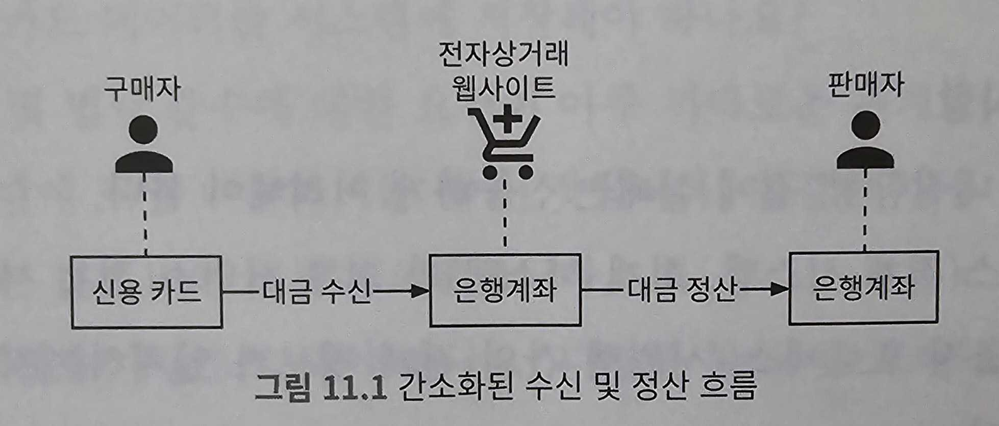

### 대금 수신 흐름

#### 결제 서비스
결제 서비스(payment service)는 사용자로부터 결제 이벤트를 수락하고 결제 프로세스를 조율한다.<br>
일반적으로 가장 먼저 하는 일은 AML/CFT와 같은 규정을 준수하는지, 자금 세탁이나 테러 자금 조달과 같은 범죄 행위의 증거가 있는지 평가하는 위험 점검(risk check)이다.<br>
일반적으로 위험 확인 서비스는 매우 복잡하고 고도로 전문화되어 있기 때문에 제3자 제공업체를 이용한다.

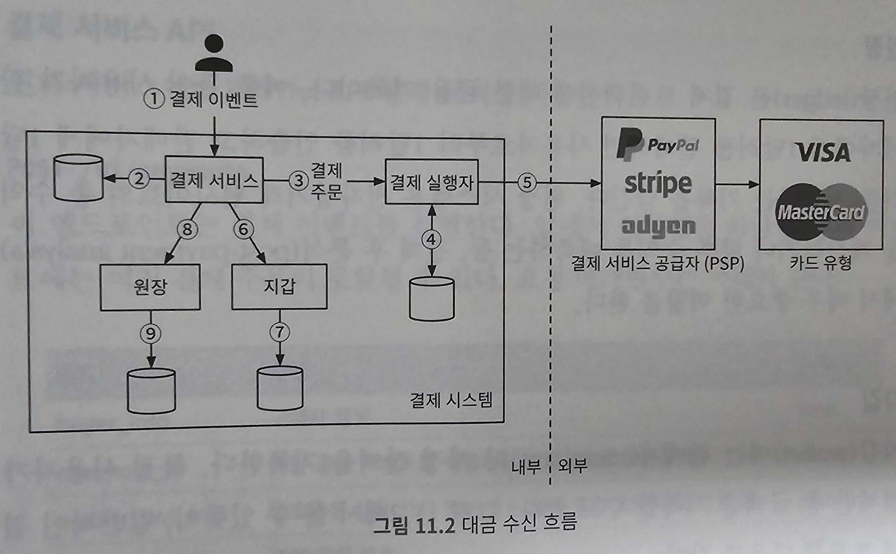

#### 결제 실행자
결제 실행자(payment executor)는 결제 서비스 공급자(PSP)를 통해 결제 주문(payment order) 하나를 실행한다.<br>
하나의 결제 이벤트에는 여러 결제 주문이 포함될 수 있다.

#### 결제 서비스 공급자
결제 서비스 공급자(Payment Service Provider, PSP)는 A 계정에서 B 계정으로 돈을 옮기는 역할을 담당. 본 예제에서는 구매자의 신용 카드 계좌에서 돈을 인출하는 역할을 담당

##### 카드 유형
비자, 마스터카드, 디스커버리(Discovery) 등이 있다.

##### 원장(ledger)
원장은 결제 트랜잭션ㄴ에 대한 금융 기록이다.<br>
원장 시스템은 전자상거래 웹사이트의 총 수익을 계산하거나 향후 수익을 예측하는 등, 결제 후 분석(post-payment analysis)에서 매우 중요한 역할을 한다.

##### 지갑(wallet)
판매자(merchant)의 계정 잔액을 기록<br>
특정 사용자가 결제한 총 금액을 기록할 수도 있다.

1. 사용자가 '주문하기' 버튼을 클릭하면 결제 이벤트가 생성되어 결제 서비스로 전송
2. 결제 서비스는 결제 이벤트를 데이터베이스에 저장
3. 때로는 단일 결제 이벤트에 여러 결제 주문이 포함될 수도 있다. 한 번 결제로 여러 판매자의 제품을 처리하는 경우가 그 예다. 전자상거래 웹사이트에서 한 결제를 여러 결제 주문으로 분할하는 경우, 결제 서비스는 결제 주문마다 결제 실행자를 호출
4. 결제 실행자는 결제 주문을 데이터베이스에 저장
5. 결제 실행자가 외부 PSP를 호출하여 신용 카드 결제를 처리
6. 결제 실행자가 결제를 성공적으로 처리하고 나면 결제 서비스는 지갑을 갱신하여 특정 판매자의 잔고를 기록
7. 지갑 서버는 갱신된 잔고 정보를 데이터베이스에 저장
8. 지갑 서비스가 판매자 잔고를 성공적으로 갱신하면 결제 서비스는 원장을 호출
9. 원장 서비스는 새 원장 정보를 데이터베이스에 추가

#### 결제 서비스 API

**POST /v1/payments**

|필드|설명|자료형|
|---|---|---|
|buyer_info|구매자 정보|json|
|checkout_id|해당 결제 이벤트를 식별하는 전역적 고유한 ID|string|
|credit_card_info|암호화된 신용 카드 정보 또는 결제 토큰. PSP마다 다른 값.|json|
|payment_orders|결제 주문 목록|list|

**payment_orders**

|필드|설명|자료형|
|---|---|---|
|seller_account|대금을 수령할 판매자|string|
|amount|해당 주문으로 전송되어야 할 대금|string|
|currency|주문에 사용된 통화 단위|string(ISO 4217)|
|payment_order_id|해당 주문을 식별하는 전역적으로 고유한 ID|string|

payment_order_id가 전역적(globally)으로 고유한 ID라는 점에 유의<br>
결제 실행자가 타사 PSP에 결제 요청을 전송할 때, PSP는 payment_order_id를 중복 제거 ID(deduplication ID)로 사용. (멱등키)<br>
'amount' 필드의 데이터 유형이 'double'이 아닌 'string'이라는 것에 유의<br>
자료형 'double'은 이 경우 바람직하지 않다.

1. 프로토콜, 소프트웨어, 하드웨어에 따라 직력화/역직렬화에 사용하는 숫자 정밀도가 다르다. 의도치 않은 반올림을 유발할 수 있다.
2. 이 숫자는 매우 클 수도 있고, 매우 작을 수도 있다.

따라서 전송 및 저장 시 숫자는 문자열로 보관하는 것이 좋다.<br>
표시하거나 계산할 때만 숫자로 변환<br>

**GET /v1/payments/{:id}** : payment_order_id가 가리키는 단일 결제 주문의 실행 상태를 반환

#### 결제 서비스 데이터 모델

결제 서비스에는 결제 이벤트(payment event)와 결제 주문(payment order)의 두 개 테이블이 필요<br>
결제 시스템용 저장소 솔루션을 고를 때 일반적으로 성능은 가장 중요한 고려사항은 아니다.<br>
다음 사항에 중점을 둔다

1. 안정성이 검증되었는가?
2. 모니터링 및 데이터 탐사(investigation)에 필요한 도구가 풍부하게 지원되는가?
3. 데이터베이스 관리자(DBA) 채용 시장이 성숙했는가?

일반적으로 NoSQL/NewSQL보다는 ACID 트랜잭션을 지원하는 전통적인 관계형 데이터베이스를 선호

결제 이벤트

|이름|자료형|
|---|---|
|checkout_id|string PK|
|buyer_info|string|
|seller_info|string|
|credit_card_info|카드 제공업체에 따라 다르다|
|is_payment_done|boolean|

결제 주문

|이름|자료형|
|---|---|
|payment_order_id|string PK|
|buyer_account|string|
|amount|string|
|currency|string|
|checkout_id|string FK|
|payment_order_status|string|
|ledger_updated|boolean|
|wallet_updated|boolean|

- checkout_id는 외래키다.
- 구매자의 신용 카드에서 금액을 공제하기 위해 타사 PSP를 호출하면 판매자 대신 전자상거래 웹사이트의 은행 계좌에 이체가 이루어지는데, 이 프로세스를 대금 수신(pay-in)이라 부른다.
  - 제품이 배송되는 등 대금 정산 조건이 충족되면 해당 대금을 팬마자에게 정산하는 절차를 시작한다.
  - 그 결과로 전자상거래 웹사이트의 은행 계좌에서 판매자의 은행 계좌로 금액이 이체된다.
  - 따라서 사용자의 결제를 처리하는 중에는 판매자의 은행 계좌가 아닌, 구매자의 카드 정보만 필요하다.

결제 주문 테이블에서 payment_order_status는 결제 주문의 실행 상태를 유지하는 열거 자료형(enumerated type, 즉 enum)이다.<br>
실행 상태로는 NOT_STARTED, EXECUTING, SUCCESS, FAILED 등이 있다.<br>
업데이트 로직은 다음과 같다.

1. payment_order_status의 초깃값은 NOT_STARTED다.
2. 결제 서비스는 결제 실행자에 주문을 전송하면 payment_order_status의 값은 EXECUTING로 바꾼다.
3. 결제 서비스는 결제 처리자의 응답에 따라 payment_order_status의 값을 SUCCESS 또는 FAIL로 변경한다.

payment_order_status의 값이 SUCCESS로 결정되면 결제 서비스는 지갑 서비스를 호출하여 판매자 잔액을 업데이트 하고 wallet_updated 필드의 값은 TRUE로 업데이트한다.<br>
여기서는 지갑 업데이트가 항상 성공한다고 가정하여 설계를 단순화하였다.<br>
이 절차가 끝나고 나면 결제 서비스는 다음 단계로 원장 서비스를 호출하여 원장 데이터베이스의 ledger_updated 필드를 TRUE로 갱신한다.<br>
동일한 checkout_id 아래의 모든 결제 주문이 성공적으로 처리되면 결제 서비스는 결제 이벤트 테이블의 is_payment_done을 TRUE로 업데이트한다.<br>
일반적으로, 종결되지 않은 결제 주문을 모니터링 하기 위해 주기적으로 실행되는 작업(scheduled job)을 마련해 둔다.<br>
이 작업은 임계값 형태로 설정된 기간이 지나도록 완료되지 않은 결제 주문이 있을 경우 살펴보도록 엔지니어에게 경보를 보낸다.

#### 복식부기 원장 시스템

원장 시스템에는 복식부기(double-entry)라는 아주 중요한 설계 원칙이 있다.<br>
복식부기는 모든 결제 시스템에 필수 요소이며 정확한 기록을 남기는 데 핵심적 역할을 한다.<br>
모든 결제 거래를 두 개의 별도 원장 계좌에 같은 금액으로 기록한다.<br>
한 계좌에서는 차감이 이루어지고 다른 계좌에는 입금이 이루어진다.<br>

|계정|차감|증가|
|---|---|---|
|구매자|$1||
|판매자||$1|

복식부기 시스템에서 모든 거래 금액 항목의 합계는 0이어야 한다.<br>
이 시스템을 활용하면 자금의 흐름을 시작부터 끝까지 추적할 수 있으며 결제 주기 전반에 걸쳐 일관성을 보장할 수 있다.<br>

#### 외부 결제 페이지

신용 카드 정보를 내부에 저장할 경우 미국의 PCI DSS(Payment Card Industry Data Security Standard) 같은 복잡한 규정을 준수해야 한다.<br>
신용 카드 정보르 취급하지 않기 위해 기업들은 PSP에서 제공하는 외부 신용 카드 페이지(hosted credit card page)를 사용한다.<br>
웹 사이트의 경우 이 외부 신용 카드 페이지는 위젯(widget) 또는 iframe이며, 모바일 애플리케이션의 경우에는 결제 SDK에 포함된 사전에 구현된 페이지다.<br>
여기서 중요한 점은 우리 결제 서비스가 아니라 PSP가 제공하는 외부 결제 페이지가 직접 고객 카드 정보를 수집한다는 것이다.

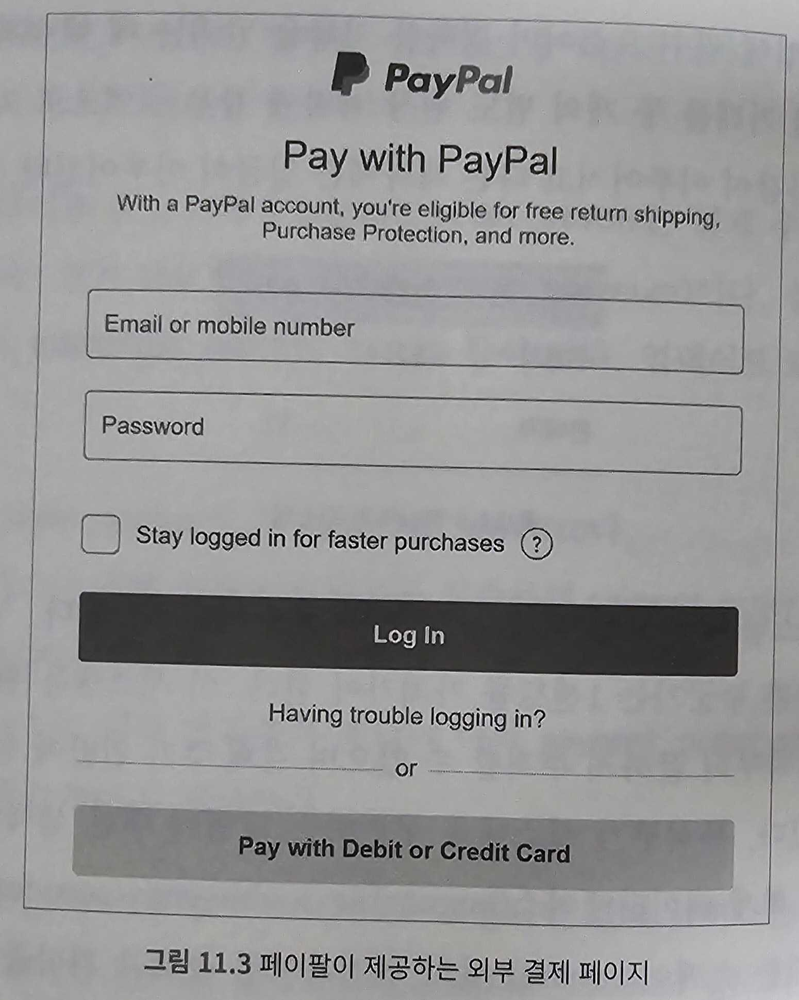

### 대금 정산 흐름

대금 정산(pay-out) 흐름의 구성요소는 대금 수신 흐름과 아주 유사하지만 한 가지 차이는 PSP를 사용하는 대신 정산 흐름에서 타사 정산 서비스를 사용하여 전자상거래 웹사이트 은행 계좌에서 판매자 은행 계좌로 돈을 이체한다는 점이다.<br>
일반적으로 결제 시스템은 대금 정산을 위해 티팔티(Tipalti)와 같은 외상매입금(accounts payable) 지급 서비스 제공업체를 이용한다.<br>

## 3단계: 상세 설계

### PSP 연동

결제 시스템이 직접 은행이나 비자 또는 마스터카드와 같은 카드 시스템에 직접 연결하지 않고 PSP를 다음 두 가지 방법 중 하나로 연동한다.

1. 회사가 민감한 결제 정보를 안전하게 저장할 수 있다면 API를 통해 PSP와 연동하는 방법을 택할 수 있다. 회사는 결제 웹페이지를 개발하고 민감한 결제 정보를 수집하며, PSP는 은행 연결, 다양한 카드 유형을 지원하는 역할을 한다.
2. 복잡한 규정 및 보안 문제로 인해 민감한 결제 정보를 저장하지 않기로 결정한 경우, PSP는 카드 결제 세부 정보를 수집하여 PSP에 안전하게 저장할 수 있도록 외부 결제 페이지를 제공한다. 대부분의 기업이 택하는 접근법

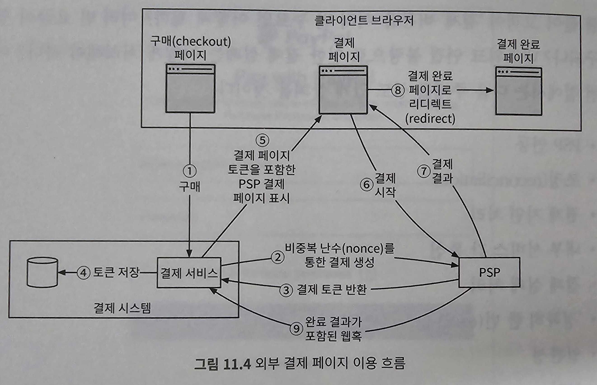

1. 사용자가 클라이언트 브라우저에서 '결제' 버튼을 클릭. 클라이언트는 결제 주문 정보를 담아 결제 서비스를 호출
2. 결제 주문 정보를 수신한 결제 서비스는 결제 등록 요청(payment registration request)을 PSP로 전송. 결제 주문이 정확히 한 번만 등록될 수 있도록 UUID 필드를 둔다. 일반적으로 이 UUID는 결제 주문의 ID로 사용된다.
3. PSP는 결제 서비스에 토큰을 반환. 토큰은 등록된 결제 요청을 유일하게 식별하는, PSP가 발급한 UUID다. 나중에 이 토큰을 사용하여 결제 등록 및 결제 실행 상태를 확인할 수 있다.
4. 결제 서비스는 PSP가 제공하는 외부 결제 페이지를 호출하기 전에 토큰을 데이터베이스에 저장
5. 토큰을 저장하고 나면 클라이언트는 PSP가 제공하는 외부 결제 페이지를 표시. 모바일 애플리케이션은 일반즉으로 이를 위해 PSP SDK를 연동. 여기서는 스트라이프 사의 웹 연동 사례를 든다.
   - 스트라이프가 제공하는 자바스크립트 라이브러리에는 결제 UI를 표시하고, 민감한 결제 정보를 수집하고, 결제를 완료하는 등의 작업을 위해 PSP를 직접 호출하는 로직이 포함되어 있다.
   - 민감한 결제 정보는 스트라이프가 수집하며, 이런 정보는 우리 시스템으로는 절대 넘어오지 않는다.
   - 외부 결제 페이지는 일반적으로 다음 두 가지 정보를 필요로 한다.
      1. 4단계에서 받은 토큰: PSP의 자바스크립트 코드는 이 토큰을 사용하여 PSP의 백엔드에서 결제 요청에 대한 상세 정보를 검색. 이 과정을 통해 알아내야 하는 중요 정보 하나는 사용자에게서 받을 금액
      2. 리디렉션 URL: 결제가 완료되면 호출될 웹 페이지 URL이다. PSP의 자바스크립트는 결제가 완료되면 브라우저를 리디렉션 URL로 돌려보낸다. 일반적으로 리디렉션 URL은 결제 상태를 표시하는 전자상거래 웹 사이트 상의 한 페이지다. 9번 단계에 언급된 웹훅(webhook) URL과는 다른 것.
6. 사용자는 신용 카드 번호, 소유자 이름, 카드 유효기간 등의 결제 세부 정보를 PSP의 웹 피이지에 입력한 다음 결제 버튼을 클릭한다. PSP가 결제 처리를 시작
7. PSP가 결제 상태를 반환
8. 이제 사용자는 리디렉션 URL이 가리키는 웹 페이지로 보낸다. 이때 보통 7단계에서 수신된 결제 상태가 URL에 추가된다. ex. `https://your-company.com/?tokenID=...&payResult=X324FSa`
9. 비동기적으로 PSP는 웹훅을 통해 결제 상태와 함께 결제 서비스를 호출. 웹훅은 결제 시스템 측에서 PSP를 처음 설정할 때 등록한 URL. 결제 시스템이 웹훅을 통해 결제 이벤트를 수신하면 결제 상태를 추출하여 결제 주문 데이터베이스 테이블의 payment_order_status 필드를 최신화

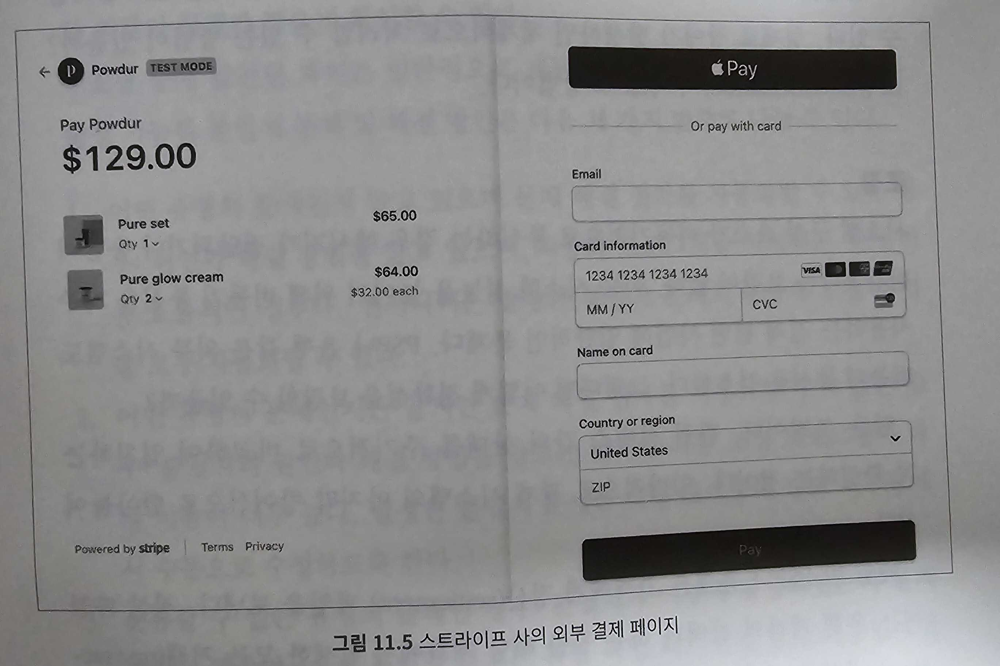

### 조정(reconciliation)

시스템 구성 요소가 비동기적으로 통신하는 경우 메시지가 전달되거나 응답이 반환된다는 보장은 없다.<br>
시스템 성능을 톺이기 위해 비동기적 통신을 자주 사용하는 결제 관련 사업에 일반적인 문제<br>
조정을 통해서 관련 서비스 간의 상태를 주기적으로 비교하여 일치하는지 확인<br>
매일 밤 PSP나 은행은 고객에게 정산(settlement) 파일을 보낸다.<br>
정산 파일에는 은행 계좌의 잔액과 하루 동안 해당 계좌에서 발생한 모든 거래(transaction) 내역이 기재되어 있다.<br>
조정 시스템은 정산 파일의 세부 정보를 읽어 원장 시스템과 비교

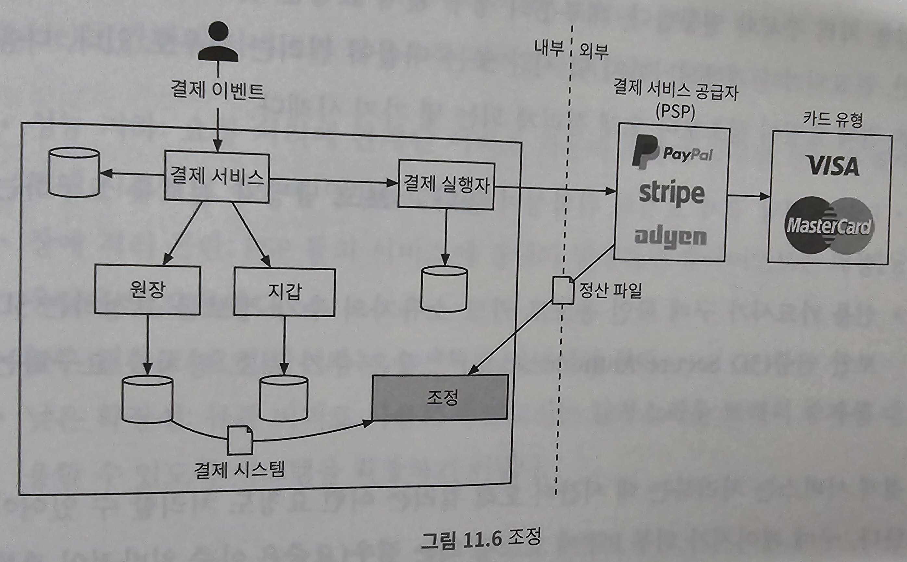

조정은 결제 시스템의 내부 일관성을 확인할 때도 사용<br>
조정 중에 발견된 차이는 일반적으로 재무팀에 의뢰하여 수동으로 고친다.<br>
발생 가능한 불일치 문제 및 해결 방안은 다음 세 가지 범주로 나눌 수 있다.

1. 어떤 유형의 문제인지 알고 있으며 문제 해결 절차를 자동화할 수 있는 경우: 원인과 해결 방법을 알고 있으며, 자동화 프로그램을 작성하는 것이 비효율적인 경우다. 엔지니어는 발생한 불칠치 문제의 분류와 조정 작업을 모두 자동화할 수 있다.
2. 어떤 유형의 문제인지는 알지만 문제 해결 절차를 자동화 할 수는 없는 경우: 불일치의 원인과 해결 방법을 알고는 있지만 자동 조정 프로그램의 작성 비용이 너무 높다. 발생한 불일치 문제는 작업 대기열에 넣고 재무팀에서 수동으로 수정하도록 한다.
3. 분류할 수 없는 유형의 문제인 경우: 불일치가 어떻게 발생하였는지 알지 못하는 경우다. 이런 불일치 문제는 특별 작업 대기열에 넣고 재무팀에서 조사하도록 한다.

### 결제 지연 처리

결제 요청이 평소보다 오래 걸리게 되는 몇 가지 사례
- PSP가 해당 결제 요청의 위험성이 높다고 보고 담당자에게 검토를 요구하는 경우
- 싱용 카드사가 구매 확인 용도로 카드 소유자의 추가 정보를 요청하는 3D 보안 인증(3D Secure Authentication) 같은 추가 보호 장치를 요구하는 경우

결제 서비스는 처리하는 데 시간이 오래 걸리는 이런 요청도 처리할 수 있어야 한다.<br>
구매 페이지가 외부 PSP에 호스팅 되는 경우 PSP는 다음과 같이 처리한다.

1. PSP는 결제가 대기(pending) 상태임을 알리는 상태 정보를 클라이언트에 반환하고, 클라이언트는 이를 사용자에게 표시. 클라이언트는 또한 고객이 현재 결제 상태를 확인할 수 있는 페이지도 제공
2. PSP는 우리 회사를 대신하여 대기 중인 결제의 진행 상황을 추적하고, 상태가 바뀌면 PSP에 등록된 웹훅을 통해 결제 서비스에 알림.

결제 요청이 최종적으로 완료되면 PSP는 방금 언급한 사전에 등록된 웹훅을 호출<br>
결제 서비스는 내부 시스템에 기록된 정보를 업데이트하고 고객에게 배송을 완료<br>
어떤 PSP는 웹훅을 통해 결제 서비스에 결제 상태 변경을 알리는 대신, 결제 서비스로 하여금 대기 중인 결제 요청의 상태를 주기적으로 확인(polling)하도록 하기도 한다.

### 내부 서비스 간 통신

#### 동기식 통신

HTTP 같은 동기식 통신은 소규모 시스템에서는 잘 작동하지만 규모가 커지면 단점이 분명해진다.<br>

- 성능 저하: 요청 처리에 관계된 서비스 가운데 하나에 발생한 성능 문제가 전체 시스템에 영향을 끼친다.
- 장애 격리 곤란: PSP 등의 서비스에 장애가 발생하면 클라이언트는 더 이상 응답을 받지 못한다.
- 높은 결합도: 요청 발신자는 수신자를 알아야만 한다.
- 낮은 확장성: 큐를 버퍼로 사용하지 않고서는 갑작스러운 트래픽 증가에 대응할 수 있도록 시스템을 확장하기 어렵다.

#### 비동기 통식

- 단일 수신자: 각 요청(메시지)은 하나의 수신자 또는 서비스가 처리. 일반적으로 공유 메시지 큐를 사용해 구현. 큐에는 복수의 구독자가 있을 수 있으나 처리된 메시지는 큐에서 바로 제거

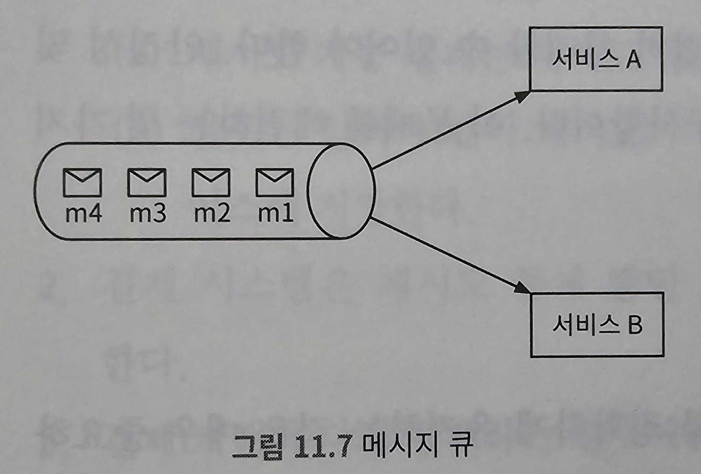

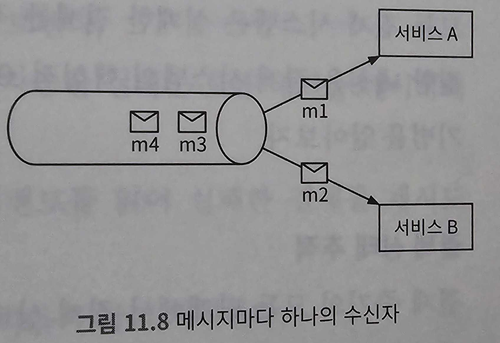

- 다중 수신자: 각 요청(메시지)은 여러 수신자 또는 서버가 처리. 카프카는 이런 시나리오를 잘 처리할 수 있다. 소비자가 수신한 메시지는 카프카에서 바로 사라지지 않는다. 따라서 동일한 메시지를 여러 서비스가 받아서 처리할 수 있다. 따라서 결제 시스템 구현에 적합한데, 하나의 요청이 푸시 알림 전송, 재무 보고 업데이트, 분석 결과 업에디트 등의 다양한 용도에 쓰일 수 있기 때문

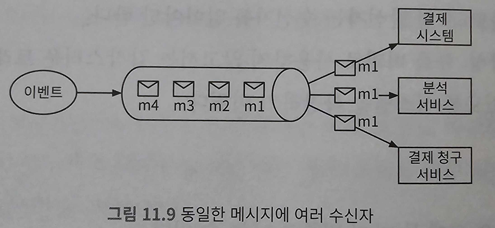

비즈니스 로직이 복잡하고 타사 서비스 의존성이 높은 대규모 결제 시스템에는 비동기 통신이 더 나은 선택

### 결제 실패 처리

#### 결제 상태 추적

실패가 일어날 때마다 결제 거래의 현재 상태를 파악하고 재시도 또는 환불이 필요한지 여부를 결정.<br>
결제 상태는 데이터 추가만 가능한 데이터베이스 테이블에 보관

#### 재시도 큐 및 실패 메시지 큐

- 재시도 큐: 일시적 오류 같은 재시도 가능 오류는 재시도 큐로 보낸다.
- 실패 메시지 큐: 반복적으로 처리에 실패한 메시지는 결국에는 실패 메시지 큐로 보낸다. 이 큐는 문제가 있는 메시지를 디버깅하고 격리하여 성공적으로 처리되지 않는 이유를 파악하기 위한 검사에 유용

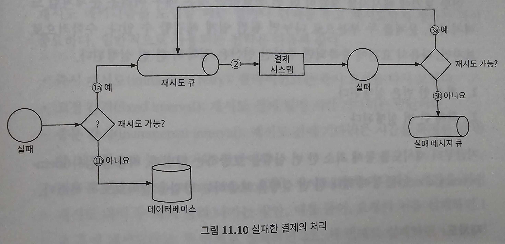

1. 재시도 가능한지 확인
   1. 재시도 가능 실패는 재시도 큐로 보낸다.
   2. 잘못된 입력과 같이 재시도가 불가능한 실패는 오류 내역을 데이터베이스에 저장
2. 결제 시스템은 재시도 큐에 쌓인 이벤트를 읽어 실패한 결제를 재시도
3. 결제 거래가 다시 실패하는 경우에는 다음과 같이 처리
   1. 재시도 횟수가 임계값 이내라면 해당 이벤트를 다시 재시도 큐로 보낸다.
   2. 재시도 횟수가 임계값을 넘으면 해당 이벤트를 실패 메시지 큐에 넣는다. 이런 이벤트에 대해서는 별도 조사가 필요할 수도 있다.

### '정확히 한 번(exact-once)' 전달

결제 주문이 정확히 한 번만 실행되도록 결제 시스템을 설계하는 것이 중요<br>
어려운 문제처럼 보이지만 수학적으로 보자면, 다음과 같은 요건이 충족되면 주어진 연산은 정확히 한 번 실행된다.

1. 최소 한 번은 실행된다.
2. 최대 한 번 실행된다.

#### 재시도

간혹 네트워크 오류나 시간 초과로 인해 결제 거래를 다시 시도해야 하는 경우가 있다.<br>
재시도 메커니즘을 활용하면 어떤 결제가 최소 한 번은 실행되도록 보장 가능하다.<br>

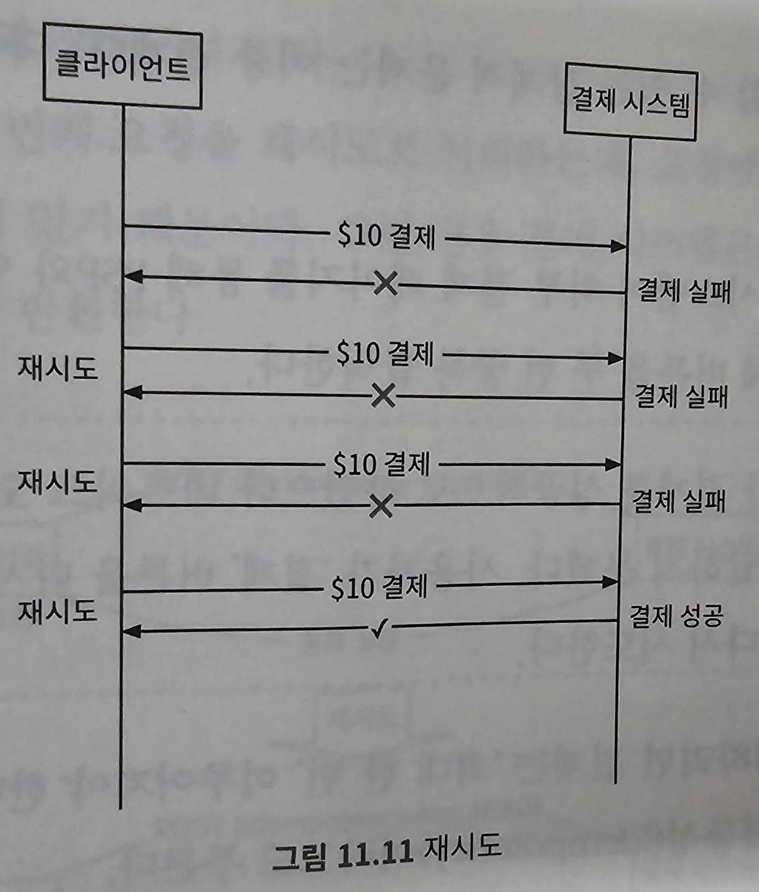

재시도 메커니즘을 도입할 때는 얼마나 간격을 두고 재시도할지 정하는 것이 중요

- 즉시 재시도(immediate retry): 클라이언트는 즉시 요청을 다시 보냄
- 고정 간격(fixed interval): 재시도 전에 일정 시간을 기다리는 방안
- 증분 간격(incremental interval): 재시도 전에 기다리는 시간을 특정한 양만큼 점진적으로 늘려가는 방안
- 지수적 백오프(expotential backoff): 재시도 전에 기다리는 시간을 직전 재시도 대비 두 배씩 늘려 나가는 방안
- 취소(cancel): 요청을 철회하는 방안. 재시도를 하더라도 성공할 가능성이 낮은 경우 흔히 사용하는 방안

'모든 상황에 맞는' 해결책은 없지만 일반적으로 네트워크 문제가 단시간 내에 해결될 것 같지 않다면 지수적 백오프를 사용하는 것을 권장.<br>
지나치게 공격적인 재시도 전략은 컴퓨팅 자원을 낭비하고 서비스 과부하를 유발<br>
에러 코드를 반환할 때는 Retry-After 헤더를 같이 붙여 보내는 것이 바람직<br>
재시도 시 발생할 수 있는 잠재적 문제는 이중 결제다.

- 시나리오1: 결제 시스템이 외부 결제 페이지를 통해 PSP와 연동하는 환경에서 클라이언트가 결제 버튼을 두 번 중복 클릭
- 시나리오2: PSP가 결제를 성공적으로 하였으나 네트워크 오류로 인해 응답이 결제 시스템에 도달하지 못한 경우, 사용자가 '결제' 버튼을 다시 클릭하거나 클라이언트가 결제를 재시도

이중 결제를 방지하려면 결제는 '최대 한 번(멱등성)' 이루어져야 한다.<br>

#### 멱등성

최대 한 번 실행을 보장하기 위한 개념<br>
API 관점에서 보자면 멱등성은 클라이언트가 같은 API 호출을 여러 번 반복해도 항상 동일한 결과가 나온다는 뜻<br>
클라이언트와 서버 같의 통신을 위해서는 일반적으로 클라이언트가 생성하고 일정 시간이 지나면 만료되는 고유한 값을 멱등 키로 사용<br>
스트라이프, 페이팔 같은 많은 기술 회사가 UUID를 멱등 키로 권장하며 실제로 널리 쓰인다.<br>
결제 요청의 멱등성을 보장하기 위해서는 HTTP 헤더에 <멱등 키: 값>의 형태로 멱등 키를 추가하면 된다.<br>
멱등성이 이중 결제 문제를 해결하는 방식

- 시나리오1: 고객이 '결제' 버튼을 빠르게 두 번 클릭한 경우
  - 전자상거래 웹사이트에서 멱등 키는 일반적으로 결제가 이루어지기 직전의 장바구니 ID다.
  - 결제 시스템은 두 번째 요청을 재시도 처리하는데, 요청에 포함된 멱등 키를 이전에 받은 적이 있기 때문
  - 그런 경우 결제 시스템은 이전 결제 요청의 가장 최근 상태를 반환
  
  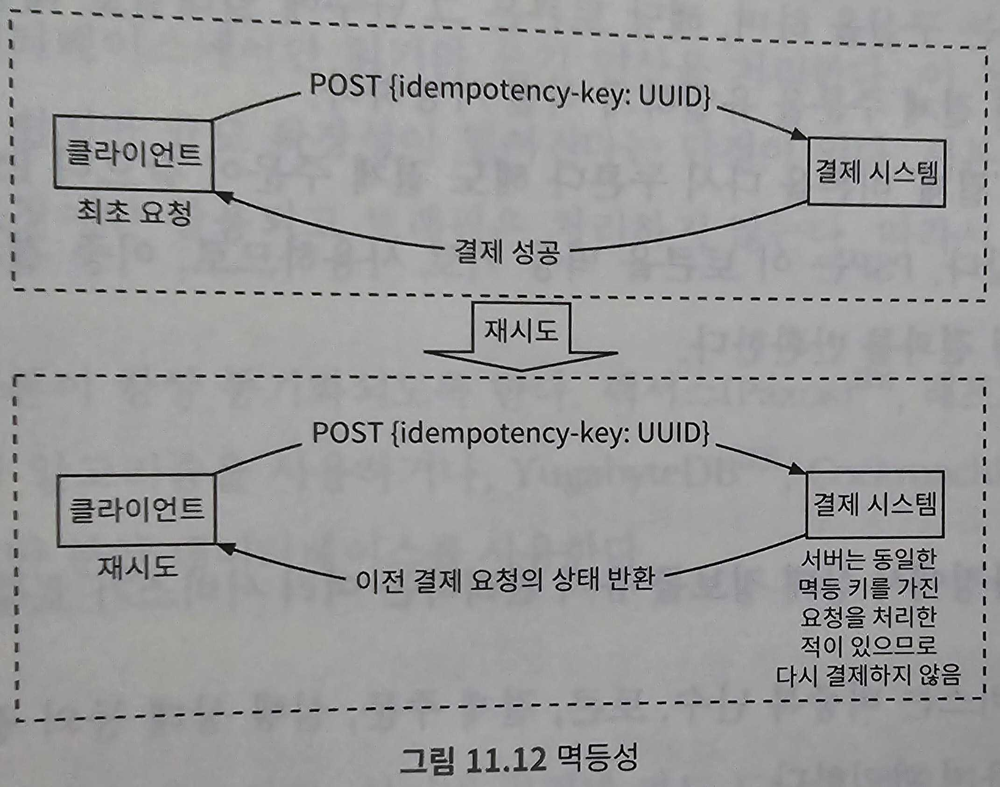

  - 동일한 멱등 키로 동시에 많은 요청을 받으면 결제 서비스는 그 가운데 하나만 처리하고 나머지에 대해서는 **429 Too Many Requests** 상태 코드를 반환
  - 멱등성을 지원하는 한 가지 방법은 데이터베이스의 고유 키 제약 조건(unique key constraint)을 활용하는 것
    1. 결제 시스템은 결제 요청을 받으면 데이터베이스 테이블에 새 레코드를 넣으려 시도
    2. 새 레코드 추가에 성공했다는 것은 이전에 처리한 적이 없는 결제 요청이라는 뜻
    3. 새 레코드 추가에 실패했다는 것은 이전에 받은 적이 있는 결제 요청이라는 뜻

- 시나리오2: PSP가 결제를 성공적으로 처리했지만 네트워크 오류로 응답이 결제 시스템에 전달되지 못하여, 사용자가 '결제' 버튼을 다시 클릭하는 경우
  - 결제 서비스는 PSP에 비중복 난수를 전송하고 PSP는 해당 난수에 대응되는 토큰을 반환
  - 이 난수는 결제 주문을 유일하게 식별하는 구실을 하며, 해당 토큰은 그 난수에 일대일로 대응된다.
  - 사용자가 '결제' 버튼을 다시 누른다 해도 결제 주문이 같으니 PSP로 전송되는 토큰이 같다.

### 일관성

결제 실행 과정에서 상태 정보를 유지 관리하는 여러 서비스가 호출된다.

1. 결제 서비스는 비중복 난수, 토큰, 결제 주문, 실행 상태 등의 결제 관련 데이터를 유지 관리
2. 원장은 모든 회계 데이터를 보관
3. 지갑은 판매자의 계정 잔액을 유지
4. PSP는 결제 실행 상태를 유지
5. 데이터는 안정성을 높이기 위해 여러 데이터베이스 사본에 복제될 수 있다.

분산 환경에서는 서비스 간 통신 실패로 데이터 불일치가 발생할 수 있다.<br>
내부 서비스와 외부 서비스(PSP) 간의 데이터 일관성 유지를 위해서는 일반적으로 멱등성과 조정 프로세스를 활용<br>
외부 서비스가 멱등성을 지원하는 경우, 결제를 재시도할 때는 같은 멱등 키를 사용해야 한다.<br>
그러나 외부 서비스가 멱등 API를 지원하더라도 외부 시스템이 항상 옳다고 가정할 수는 없으므로, 조정 절차를 생략할 수는 없다.<br>
데이터를 다중화하는 경우에는 복제 지연으로 인해 기본 데이터베이스와 사본 데이터가 불일치하는 일이 생길 수 있다.<br>
일반적으로 이 문제에는 두 가지 해결 방법이 있다.

1. 주 데이터베이스에서만 읽기와 쓰기 연산을 처리. 이 접근법은 설정하기는 쉽지만 규모 확장성이 떨어진다. 사본 데이터 안정성 보장에만 활용되고 트래픽은 처리하지 않는다. 따라서 자원 낭비다.
2. 모든 사본이 항상 동기화되도록 한다. 팩서스(Paxos), 래프트(Raft) 같은 합의 알고리즘을 사용하거나, YugabyteDB, CockroachDB와 같은 합의 기반 분산 데이터베이스를 사용한다.

### 결제 보안

|문제|해결책|
|---|---|
|요청/응답 도청(request/response eavesdropping)|HTTPS 사용|
|데이터 변조(data tempering)|암호화 및 무결성 강화 모니터링|
|중간자 공격(man-in-the-middle attack)|인증서 고정(certificate pinning)과 함께 SSL 사용|
|데이터 손실|여러 지역에 걸쳐 데이터베이스 복제 및 스냅숏 생성|
|분산 서비스 거부 공격(DDoS)|처리율 제한 및 방화벽|
|카드 도난|토큰화(tokenization). 실제 카드 번호를 사용하는 대신 토큰을 저장하고 결제에 사용|
|PCI 규정 준수|PCI DSS는 브랜드 신용 카드를 처리하는 조직을 위한 정보 보안 표준|
|사기(fraud)|주소 확인. 카드 확인번호(CW). 사용자 행동 분석 등|

## 4단계: 마무리

돌아볼만 한 주제

- 모니터링: 광범위한 모니터링을 통해 "특정 결제 수단의 평균 승인율은 얼마인가?", "서버의 CPU 사용량은 얼마인가?"
- 경보: 비정상적인 상황이 발생하면 오콜(on-call)중인 개발자에게 알려 신속하게 대응할 수 있도록 하는 것이 중요
- 디버깅 도구: "왜 결제가 샐패했나요". 엔지니어와 고객 지원팀이 더 쉽게 디버깅할 수 있도록 결제 거래의 상태, 처리 서버 기록, PSP 기록 등을 검토할 수 있는 도구를 개발하는 것이 중요
- 환율: 국제적인 결제 시스템을 설계할 때 중요한 고려 사항
- 지역: 지역마다 가용한 결제 수단이 완전히 달라질 수 있다.
- 현금 결제: 혈금 결제는 인도, 브라질 등의 국가에서 매우 일반적. 우버와 에어비앤비가 현금 결제 방법에 대해 자세한 엔지니어링 블로그 기사를 퍼낸 바 있으니, 참고
- 구글/애플 페이 연동

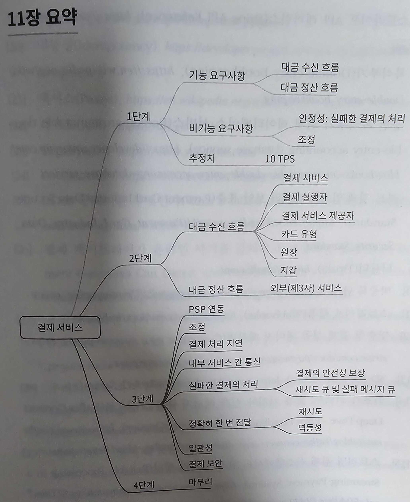