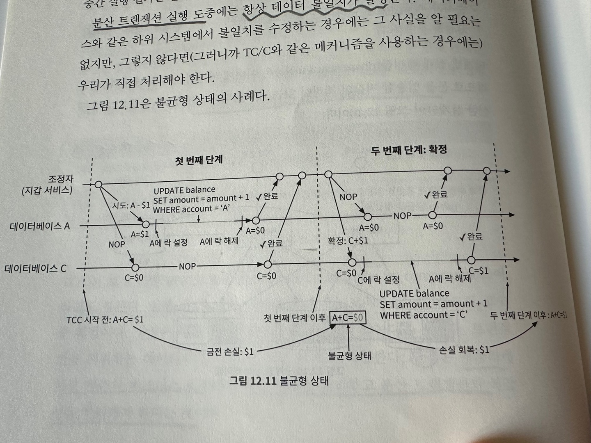
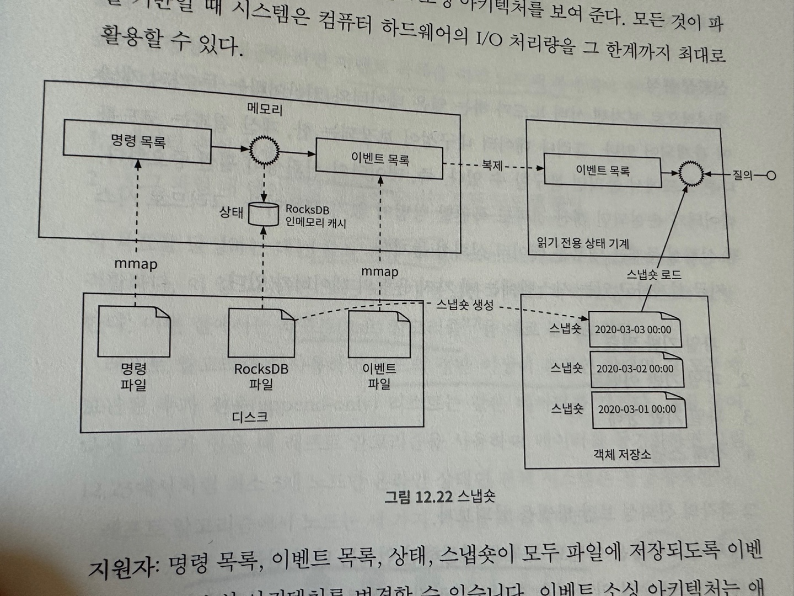

# 전자 지갑 

전자 지갑은 은행에서 돈을 이체해 두면 전자 상거래 사이트에서 제품을 구매할 때 지갑의 돈을 사용해 결제할 수 있다.  
  
  
더불어서 페이팔 같은 플랫폼은 다른 사용자 지갑으로 직접 송금을 지원한다.  
전자 지갑 간 이체는 은행보다 빠르며 추가 수수료를 부과하지 않는다.  
  

지갑 간 이체를 지원하는 전자 지갑 애플리케이션의 백엔드를 설계 하라는 요청을 받았다고 가정하자.

# 1단계: 문제 이해 및 설계 범위 확정 

> 지원자: 두 지갑 간의 이체에만 집중하면 될까요?   
> 면접관: 이체 기능에 집중합시다.  
> 지원자: 시스템이 지원해야 하는 초당 트랜잭션 수 (TPS)는 얼마인가요?   
> 면접관: 1,000,000 TPS 로 가정하겠습니다.  
> 지원자: 전자 지갑은 정확성에 대한 요건이 있을 텐데요. 데이터베이스가 제공하는 트랜잭션 보증이면 충분하다고 볼 수 있나요?  
> 면접관: 좋습니다.
> 지원자: 정확성을 증명해야 하나요?  
> 면접관: 좋은 질문입니다. 일반적으로 정확성은 트랜잭션이 완료된 뒤에나 확인 할 수 있습니다.  
> 한 가지 검증 방법은 내부 기록과 은행의 명세서를 비교하는 것이죠.   
> 그러나 이런 조정 작업으로는 데이터 일관성이 깨졌다는 것을 알 수 있지만 그 차이가 왜 발생했는지 알 기 힘듭니다.  
> 따라서 우리는 **재현성을 갖춘 시스템** 을 설계하고자 합니다.  
> 처음부터 데이터를 재생하여 언제든지 과거 잔액을 재구성 할 수 있는 시스템을 만들겁니다.  
>   
> 지원자: 가용성 요구사항이 99.99% 라고 가정해도 되나요?  
> 면접관: 좋습니다.
> 지원자: 환전이 가능해야 하나요?
> 면접관: 아니요.

이번 장에서 설계할 전자 지갑은 다음을 지원해야 한다.
- 전자 지갑 간 이체 
- 1,000,000 TPS
- 99.99% 의 안정성 
- 트랜잭션
- 재현성 

## 개략적 추정 
오늘날 일반적인 데이터 센터 노드에서 실행되는 관계형 데이터베이스는 **초당 수천 건**의 트랙잭션을 지원할 수 있다.  
본 설계안 에서도 노드당 1000 TPS 를 지원할 수 있다고 가정하겠다.  
따라서 1백만 TPS 를 지원하기 위해서 1,000 개의 노드가 필요하다.  
하지만 사실 이체연산은 2개의 명령을 실행해야 한다. 한 계좌에서는 인출을 해야하고 다른 계좌에서는 입금 연산을 해야한다.  
결국 2,000 개의 노드가 필요하다는 뜻이다.  
  
아래 표는 '노드 당 TPS' 가 달라지면 필요한 노드 수가 어떻게 다른지 보여준다.  
  
한 노드가 초당 처리할 수 있는 트랜잭션의 수가 많을 수록 필요한 총 노드 수가 줄어든다.  
따라서 이번 장의 설계 목표 중 하나는 단일 노드가 처리 할 수 있는 트랜잭션의 수를 늘리는 것이다.  

# 2단계: 개략적 설계안 제시 및 동의 구하기 

이번 절에서는 다음 내용을 설명한다.
- API 설계
- 세 가지 개략적 설계안 

1. 간단한 메모리 기반 솔루션 
2. 데이터베이스 기반 분산 트랜잭션 솔루션 
3. 재현성을 갖춘 이벤트 소싱 솔루션 

## API 설계 
RESTful 규약을 따를것이다.
    

응답 예제 
```json
{
  "status": "success",
  "transaction_id": "01589980-2664-11ec-**"
}
```
  
한 가지 유의할 점은 'amount' 필드의 자료형이 double 이 아니라 string 이라는 점이다.  
그 이유는 11장 "결제 시스템" 에서 설명한 바 있다.  
그럼에도 정밀도(precision)를 잃을 위험이 있음에도 이를 이해하고 double 을 사용한다면 적절할 수 있다.  

## 인메모리 샤딩 
지갑 애플리케이션은 사용자의 모든 잔액을 유지해야 한다.  
**<사용자, 잔액>** 관계를 나타내기에 좋은 자료 구조는 해시 테이블이라고 불리는 키-값 저장소이다.  
  
인메모리 저장소로 레디스는 하나의 선택지이다. 그러나 레디스 노드 한 대로 100만 TPS 처리하기에는 벅차다.  
클러스터를 구성하고 사용자 계정을 모든 노드에 균등하게 분산시켜야 한다. 이 절차를 파티셔닝 또는 샤딩이라고 한다.  
키-값 데이터를 n개 파티션에 고르게 분배하려면 키의 해시 값을 계산해서 n 으로 나누는 것이 한 가지 방법이다.  
그 결과로 얻은 값이 파티션 번호다. 그 절차를 의사코드로 표현하면 아래와 같다.  

```kotlin
val accountId = "A"
val partitionNumber = 7
val myPartition = accountId.hashCode() % partitionNumber
```
  
모든 레디스 노드의 파티션 수 및 주소는 한군데 저장해 둔다. 높은 가용성을 보장하는 주키퍼를 이 용도로 쓰면 좋다.  

이 방안의 마지막 구성 요소는 이체 명령을 처리하는 서비스로 지갑 서비스 라고 부르겠다.  
1. 이체 명령의 수신
2. 이체 명령의 유효성 검증 
3. 명령이 유효한 것으로 확인되면 이체에 관계된 두 계정의 잔액 갱신, 이 두 계정은 다른 레디스 노드에 있을 수 있다.
  
아래 그림에서 작업 흐름을 확인 할 수 있다.  
  
- 이 예제에서는 3개의 레디스 노드와 A, B, C 세 클라이언트가 있다.
- 계정 잔액 정보는 레디스에 균등하게 분산되어 있다.
- 이체 요청을 처리하는 지갑 서비스는 2개의 노드로 구성되어 있다.  
- 클라이언트 A 에서 B 로 1달러 이체하는 명령을 받으면 두개의 레디스 노드에 명령이 전달된다. 
- A 를 저장하는 레디스는 1달러 차감하는 명령을 받고 
- B 를 저장하는 레디스는 1달러를 더하라는 명령을 받는다.
  
이 설계에서 주키퍼는 레디스 노드를 찾는(Service Discovery) 역할을 담당한다.  
하지만 이 설계는 정확성 요구사항을 충족하지 못한다. 2개의 레디스 노드에 명령을 전달하지만 해당 연산이 모두 성공한다는 보장은 없다.  
그러니 두 연산은 하나의 원자적 트랜잭션으로 실행되어야 한다.  

## 분산 트랜잭션 

### 데이터베이스 샤딩 
서로 다른 두 개 저장소 노드를 갱신하는 연산을 원자적으로 수행하려면 어떻게 해야 할까?  
첫번째 단계는 각 레디스 노드를 트랜잭션을 지원하는 관계형 데이터베이스 노드로 교체하는 것이다.  
  
- 위 그림에서 볼 수 있듯이 A, B, C 의 잔액 정보가 3개의 관계형 데이터베이스 노드로 분산됨 
- 하지만 트랜잭션을 사용해도 문제의 일부만 해결할 수 있다. 
- 이전에도 살펴 보았듯 하나의 이체명령으로 2개의 계정의 정보를 업데이트 해야 할 수 있는데 두 작업이 정확히 동시에 처리된다는 보장이 없다
- 첫번째 계정의 잔액을 업데이트 한 뒤 지갑 서비스가 재시작 된다면 두번째 계정의 잔액도 갱신하려면 어떻게 해야 할까?

### 분산 트랜잭션: 2단계 커밋 
분산 트랜잭션은 여러 노드의 프로세스를 원자적인 하나의 트랜잭션으로 묶는 방안이다.  
분산 트랜잭션 구현은 저수준 방안과 고수준 방안이 있다.  
  
저수준 방안은 데이터베이스 자체에 의존하는 방법이다. 가장 일반적으로 사용하는 알고리즘은 2단계 커밋(2PC)이다.  
  

1. 위 그림과 같이 조정자는 데이터베이스 A, C 에 락을 건다 
2. 애플리케이션이 트랜잭션 커밋하려 할 때 모든 데이터베이스에 **트랜잭션 준비** 요청을 보낸다
3. 두 번째 단계에서 조정자는 모든 데이터베이스 응답을 받아 다음 절차를 수행한다.
   1. 모든 데이터베이스가 yes 응답하면 트랜잭션을 커밋한다.
   2. 어느 데이터베이스라도 no 응답하면 트랜잭션을 중단한다. 
  
이 방안이 저수준인 이유는, 준비 단계를 실행하려면 데이터베이스 트랜잭션 실행 방식을 변경해야 하기 때문이다.  
예를들어 서로 다른 데이터베이스 사이에 2PC 를 실행하려면 모든 데이터베이스가 X/Open XA 표준을 만족해야 한다.  
2PC 가장 큰 문제점은 다른 노드의 메시지를 기다리는 동안 락이 잠긴 상태로 남아 있어서 성능에 좋지 않다.  
또 다른 문제는 아래 그림에서 볼 수 있듯이 조장자가 단일 장애 지점(SPO) 가 될 수 있다는 것이다.  
  

### 분산 트랜잭션: TC/C 
TC/C(Try-Confirm/Cancel) 는 두 단계로 구성된 보상 트랜잭션이다.  
1. 조정자는 모든 데이터베이스에 트랜잭션에 필요한 자원 예약을 요청 
2. 조정자는 모든 데이터베이스로부터 회신을 받음 
   1. 모두 yes 응답하면 조정자는 데이터베이스에 작업 확인을 요청하는데 이것이 '시도-확정(Try-Confirm)' 이다.
   2. 어느 하나라도 no 응답하면 조정자는 모든 데이터베이스에 작업 취소 요청하며 이것이 '시도-취소(Try-Cancel)' 이다 

2PC 에서는 두 단계가 모두 하나의 트랜잭션이지만, TC/C 는 각 단계가 별도의 트랜잭션이다.  
  
TC/C 사례  
계좌 A에서 계좌 C로 1달러를 이체한다고 가정해보자.  
아래 표에 각 단계에서 TC/C 어떻게 실행되는지 요약했다.  
  
지갑 서비스가 TC/C 의 조정자라고 가정해보겠다. 분산 트랜잭션이 시작될 때 A의 잔액은 1달러이고 C의 잔액은 0달러이다.  
  
**첫번째 단계** = 시도 
시도 단계에서는 조정자 역할을 하는 지갑 서비스가 두 개의 트랜잭션 명령을 두 데이터베이스에 전송한다.  
1. 조정자는 계정 A가 포함된 데이터베이스에 잔액을 1달러 감소시키는 트랜잭션을 시작한다.
2. 조정자는 계정 C가 포함된 데이터베이스에는 아무 작업도 하지 않는다. 다른 시나리오에서도 적용할 수 있도록 하기 위해서 NOP(No Operation) 명령을 보낸다고 가정한다.

**두번째 단계** = 확정  
두 데이터베이스가 모두 yes 응답하면 지갑 서비스는 확정 단계를 시작한다.  
계정 A는 이미 잔액을 감소시켰다. 하지만 C는 아직 $1를 받지 못했다.  
따라서 확정 단계에서 C 의 잔액을 $1 추가해야 한다.  
  
위 그림은 확정 단계 동작을 보여준다.  

**두번째 단계** = 취소 
첫 번째 시도 단계가 실패하면 어떻게 해야 할까?  
위 예제에서 계정 C 에 대한 NOP 는 항상 성공한다고 했지만 실제로는 실패할 수 있다.  
C 계정이 불법 계정일 경우 당국의 규제에 의해서 입금 불가 처리되었을 수 있다.  
따라서 이런 경우 분산 트랜잭션을 취소하고 관련된 자원을 반환해야 한다.  
  
시도 단계에서 A의 잔액이 바뀌었기 때문에 다시 $1 를 추가해야 한다.  
  
위 그림은 취소 단계를 보여준다.  

### 2PC 와 TC/C 비교  
아래 표는 2PC 와 TC/C 간의 유사점과 차이점을 보여준다.  
  
- 2pc 에서는 두 번째 단계가 시작될 때 모든 로컬 트랜잭션이 완료되지 않는다 
- tc/c 에서는 두 번째 단계가 시작될 때 모든 로컬 트랜잭션이 완료 상태이다.

따라서 2pc 에서는 단일 트랜잭션 처리를 위해 락을 걸지만 tc/c 에서는 락을 걸지않고 두번째 단계에서 보상 트랜잭션을 수행한다.  
tc/c 는 보상 기반 분산 트랜잭션이라고 부르며 실행 취소 절차를 비지니스 로직으로 구현하므로 고수준 해법이다.  
장점은 특정 데이터베이스에 구애받지 않는다는 점이다.  
단점은 애플리케이션 계층의 비지니스 로젝에서 세부 사항을 관리하고 분산 트랜잭션의 복잡성을 처리해야 한다는 것이다.  

### 단계별 상태 테이블 
하자만 아직 한 가지 문제가 더 있다. TC/C 중간에 지갑 서비스가 다시 시작되면 어떻게 될까?  
그러면 과거 작업기록이 없어서 어떻게 복구해야 할 지 알 수 없게된다.  
해결책은 TC/C 의 진행상황 즉 각 단계 상태 정보를 트랜잭션 데이터베이스에 저장하면 된다.  
이 상태 정보는 최소한 다음 내용을 포함해야 한다. 
- 분산 트랜잭션 ID와 내용 
- 각 데이터베이스에 대한 try 단계의 상태 (not sent yet, has been sent, response received)
- 두 번째 단계의 이름. Confirm, Cacnel
- 두 번째 단계의 상태 
- 순서가 어긋났음을 나타내는 플래그 ("잘못된 순서로 실행된 경우" 절에서 설명한다)

단계별 상태 테이블은 일반적으로 돈을 인출할 지갑의 계정이 있는 데이터베이스에 둔다.  
아래 설계안은 이를 반영한 것이다.  
  

### 불균형 상태 
TC/C 에서 시도 단계가 끝나고 나면 A 계정의 $1 가 사라진다. 하지만 C 에는 변화가 없다.  
이는 거래 후에도 잔액 총합은 동일해야 한다는 회계 기본 원칙을 위반한다.  
다행스럽게도 트랜잭션 보증은 TC/C 방안에서도 여전히 유효하다.  
TC/C 는 여러 개의 독립적인 로컬 트랜잭션으로 구성된다. 실행 주체는 애플리케이션이며 이런 독립적 로컬 트랜잭션이 만드는 중간 결과를 볼 수 있다.  
반면 2PC 는 데이터베이스가 실행주체이며 애플리케이션은 그 중간 결과를 알 수 없다.  
  
분산 트랜잭션 실행 도중에는 항상 데이터 불일치가 발생한다.  
아래 그림은 불균형 상태의 사례다.  
  

### 유효한 연산 순서 
시도 단계에서 할 수 있는 일은 세 가지다. 
  
모두 그럴듯해 보이기는 하지만 일부는 유효하지 않다.  
두 번째 선택지의 경우, 계정 C의 연산은 성공하였으나 계정 A에서 실패한 경우(NOP) 지갑 서비스는 취소 단계를 실행해야 한다.  
그러나 취소 단계 실행전에 누군가 C 계정에서 $1를 이미 이체하였다면?  
나중에 지갑 서비스가 C에서 1달러를 차감하려고 하면 아무것도 남지 않는다.  
이는 분산 트랜잭션의 트랜잭션 보증을 위반하는 것이다.  
  
세 번째 선택지의 경우, $1를 A 계좌에서 차감하고 동시에 C에 추가하면 많은 문제가 발생 할 수 있다.  
예를 들어 C 계좌 에는 $1 이 추가되었으나 A에서 해당 금액을 차감하는 연산이 실패한다면?  
따라서 두 번째, 세 번째 선택지는 유효하지 않다. 1안이 옳은 방법이다.

### 잘못된 순서로 실행된 경우 
TC/C 에는 실행 순서가 어긋날 수 있다는 문제가 있다.  
계정 A에서 C로 1달러를 이체하는 예제를 여기서도 살펴본다.  
아래 그림은 시도 단계에서 계정 A에 대한 작업이 실패하여 취소 단계로 진입한 다음 계정 A와 C 모두에 취소 명령을 전송하는 과정을 보여준다.  
  
이 때 계정 C를 관리하는 데이터베이스 네트워크에 문제가 있어서 시도 명령 전에 취소 명령부터 받게 되었다고 해보자.  
이렇게 순서가 바뀌어도 처리할 수 있도록 하려면 기존 로직을 다음과 같이 수정하면 된다.  
- 취소 명령이 먼저 도착하면 시도 명령을 못보았음을 나태는 플래그를 true 저장
- 시도 명령이 도착하면 먼저 도착한 취소 명령이 있었는지 확인하고 있었으면 실패를 반환 

"단계별 상태 테이블" 에서 순서가 어긋난 경우를 처리하기 위한 플래그를 마련했던 것은 이런 이유에서다. 

### 분산 트랜잭션: 사가 
선형적 명령 수행  
사가는 유명한 분산 트랜잭션 솔루션 가운데 하나로 마이크로서비스 아키텍처에서는 사실상 표준이다.  
1. 모든 연산은 순서대로 정렬된다. 각 연산은 자기 데이터베이스에 독립 트랜잭션으로 실행된다.
2. 연산은 순서대로 실행되고 한 연산이 완료되면 다음 연산이 개시된다.
3. 연산이 실패하면 전체 프로세스는 실패한 연산부터 맨 처음 연산까지 역순으로 보장 트랜잭션을 통해 롤백된다. 

아래 그림으로 예제를 살펴보자.  
  
연산 실행 순서는 어떻게 조율할까? 두 가지 방법이 있다. 
1. 분산 조율: MSA 에서 사가 분산 트랜잭션에 관련된 모든 서비스가 다른 서비스의 이벤트를 구독하여 작업을 수행하는 방식
2. 중앙 집중형 조율: 하나의 조정가가 모든 서비스가 올바른 순서로 작업을 실행하도록 조율한다.

어떤 방식으로 조율할지는 사업상 필요와 목표에 따라 정하면된다.  
모든 이벤트는 비동기적으로 수행되기 때문에 내부적으로 상태 기계를 유지해야 한다.  
일반적으로 중앙 집중형 조율 방식을 선호하는데, 복잡한 상황을 잘 처리하기 때문이다.  

### TC/C vs saga 
TC/C 와 사가 모두 애플리케이션 수준 분산 트랜잭션이다.  
  
실무에서는 어떤 방안이 좋을까?  
지연 시간 요구 사항에 따라 다르다. 표에서 봤듯이 사가는 연산은 순서대로 실행해야 하지만 TC/C 에서는 병렬로 수행할 수 있다.  
따라서 다음 요건을 고려해 결정을 내려야 한다.  
1. 지연 시간 요구사항이 없거나 송금 사례처럼 서비스 수가 적다면 아무것이나 사용하면 된다.
2. 지연 시간에 민감하고 많은 서비스/운영에 관계된 시스템이라면 TC/C 가 더 낫다.

분산 트랜잭션 방안도 제대로 동작하지 않는 경우가 있을 수 있음.  
예를 들어 사용자가 애플리케이션 수준에서 잘못 된 작업을 입력할 수 있기 때문에 문제의 근본 원인을 역추적할 수 있어야 함.  

## 이벤트 소싱 

### 배경 
실제로 전자 지갑 서비스는 제공 업체도 감사를 받을 수 있다.  
예를 들어 외부 감사는 다음과 같은 까다로운 질문들을 던질 수 있다.  
1. 특정 시점의 계정 잔액을 알 수 있나요?
2. 과거 및 현재 계정 잔액이 정확한지 어떻게 알 수 있나요?
3. 코드 변경 후에도 시스템 로직이 올바른 지는 어떻게 검증하나요? 

이런 질문에 체계적으로 답할 수 있는 설계 철학 중 하나는 도메인 주도 개발에서 개발된 이벤트 소싱이다. 

### 정의 
이벤트 소싱에는 네 가지 중요한 용어가 있다.
1. 명령
2. 이벤트
3. 상태
4. 상태 기계 

### 명령 
명령은 외부에서 전달된 의도가 명확한 요청이다.  
예를 들어 고객 A에서 C로 $1를 이체하라는 명령은 요청은 명령이다.  
이벤트 소싱에서 순서는 아주 중요하기 때문에 일반적으로 FIFO 큐에 명령을 저장한다.  

### 이벤트 
명령은 의도가 명확하지만 사실은 아니기 때문에 유효하지 않을 수 있다.  
작업 이행 전에는 반드시 명령의 유효성을 검사해야 한다.  
검사를 통과한 명령은 **반드시 이행** 되어야 한다. 명령 이행 결과를 이벤트라고 부른다.
  
명령과 이벤트 사이에는 두 가지 중요한 차이점이 있다.  
1. 이벤트는 검증된 사실로, 실행이 끝난 상태다. 따라서 과거 시제를 이용한다. (A에서 C로 $1 송금을 완료하였음)
2. 명령에는 무작위성이나 I/O 가 포함될 수 있지만 이벤트는 결정론적이다. 
  
이벤트 생성 프로세스는 두 가지 중요한 특성이 있다.
1. 하나의 명령으로 여러 이벤트가 만들어 질 수 있다. 
2. 이벤트 생성 과정에는 무작위성이 개입될 수 있어서, 같은 명령에 항상 동일한 이벤트들이 만들어진다는 보장이 없다.  

이벤트 순서는 명령 순서를 따라야 한다.

### 상태 
상태는 이벤트가 적용될 때 변경되는 내용이다.  
지갑 시스템에서 상태는 계정의 잔액으로, map 자료 구조로 사용하여 표현할 수 있다.  
key 는 계정 이름, ID 가 되고 value 는 잔액이 된다.  

### 상태 기계 
상태 기계는 이벤트 소싱 프로세스를 구동한다. 크게 2가지 기능이 있다. 
1. 명령의 유효성을 검사하고 이벤트를 생성한다.
2. 이벤트를 적용하여 상태를 갱신한다.

이벤트 소싱을 위한 상태 기계는 **결정론적으로 동작해야 한다**  
따라서 무작위성을 내포할 수 없으며 이벤트를 상태에 반영하는 것 또한 항상 같은 결과를 보장해야 한다.  
아래 그림은 이벤트 소싱 아키텍처를 정적으로 표현한 것이다.  
  
명령을 이벤트로 변환하고 이벤트를 적용하는 두 가지 기능을 지원해야 하므로, "명령 유효성 검사를 위한 상태 기계" 와 "이벤트 적용을 위한 상태 기계" 를 두었다.  
여기에 시간을 하나의 차원으로 추가하면 아래 그림 같은 동적 관점으로도 표현할 수 있다.
  

### 지갑 서비스 예시 
지갑 서비스의 경우 명령은 요청이고 해당 명령은 카프카와 같은 FIFO 큐에 기록한다.  
  
상태, 즉 계정 잔액은 관계형 데이터베이스에 있다고 가정하자.  
상태 기계는 명령을 큐에 들어간 순서대로 확인하고 명령을 읽을 때 마다 잔액이 충분히 있는지 확인한다.  
충분하다면 상태 기계는 각 계정에 대한 이벤트를 만든다.  
  
  

1. 명령 대기열에서 명령을 읽음 
2. 데이터베이스에서 잔액 상태를 읽음
3. 명령의 유효성 검사 수행. 유효하면 계정 별로 이벤트를 생성 
4. 다음 이벤트를 읽음
5. 데이터베이스의 잔액을 갱신하여 이벤트를 적용 

### 재현성 
이벤트 소싱이 다른 아키텍처에 비해 갖는 가장 중요한 장점은 재현성이다.  
앞에서 언급한 분산 트랜잭션의 데이터베이스의 경우 계정 잔액만을 저장한다. 따라서 변경된 이유를 알기가 어렵다.  
데이터베이스는 특정 시점의 잔액이 얼마인지만 보여준다.  
하지만 이벤트를 처음부터 다시 재생하면 과거 잔액 상태는 언제든 재구성 할 수 있다.  
이벤트 리스트는 불변이고 상태 기계 로직은 결정론적이므로 이벤트 이력을 재생하여 만들어낸 상태는 언제나 동일하다.  
  
아래 그림은 이벤트를 재생하여 지갑 서비스 상태를 재현하는 과정의 사례다.  
  

### 명령-질의 책임의 분리 (CQRS)
지금까지 효과적인 계좌 이체가 가능한 지갑 서비스를 설계했다. 하지만 클라이언트는 여전히 계정 잔액을 알 수 없다.  
직관적은 해결책 하나는 상태 이력 데이터베이스의 읽기 전용 사본을 생성한 다음 외부와 공유하는 것이다.  
이벤트 소싱은 이와는 조금 다른 해결책을 제시한다.  
이벤트 소싱은 계정 잔액을 공개하는 대신 모든 이벤트를 외부에 보낸다. 따라서 이벤트를 수신하는 외부 주체가 직접 상태를 구축할 수 있다.  
이런 설계 철학은 명령-질의 책임 분리라고 한다.  
CQRS 에서는 상태 기록을 담당하는 상태 기계는 하나고, 읽기 전용 상태 기계는 여러 개 있을 수 있다.  
예를 들어 클라이언트 잔액 질의 요청을 처리하기 위해 별도 데이터베이스에 데이터를 기록하여 이중 청구 문제를 쉽게 조사할 수 있도록 특정 기간 동안의 상태를 복원할 수 있다.  
복원되니 상태 정보는 재무 기록과 대조할 감사 기록으로 활용 가능하다.  
읽기 전용 상태 기계는 실제 상태에 비해 어느 정도 뒤처질 수 있지만 결과적 일관성 모델을 따르므로 결국에는 같아진다.  
아래 그림은 CQRS 아키텍처 이다.  
  

# 3단계: 상세 설계 
이번 절에서는 높은 성능과 안정성 및 확장성을 달성하기 위한 기술에 대해 살펴본다.

## 고성능 이벤트 소싱 

### 파일 기반의 명령 및 이벤트 목록 
명령과 이벤트를 카프카 같은 원격 저장소가 아닌 로컬 디스크에 저장하는 방안을 생각해 볼 수 있다.  
이렇게 하면 네트워크 전송시간을 줄일 수 있다.  
이벤트 목록은 추가 연산만 가능한 자료 구조에 저장하고 순차적 쓰기는 일반적으로 매우 빠르다.  
순차적 디스크 접근은 경우에 따라서 무작위 메모리 접근보다도 빠르게 실행될 수 있다.  
  
최근 명령과 이벤트를 메모리에 캐시하는 방안도 생각해 볼 수 있다.  
명령과 이벤트는 지속성 저장소에 보관된 이후에 처리된다. 메모리에 캐시해 높으면 디스크에서 다시 로드하지 않아도 된다.  
  
구체적은 구현 방법의 예시를 살펴보자. mmap 기술은 앞서 언급한 최적화 구현에 유용하다.  
mmap을 사용하면 로컬 디스크에 쓰는 동시에 최근 데이터는 메모리에 자동으로 캐시할 수 있다.  
mmap은 디스크 파일을 메모리 배열에 대응시킨다. 운영체제는 파일의 특정 부분을 메모리에 캐시하여 읽기, 쓰기 연산의 속도를 높인다.  
아래 그림은 파일 기반의 명령 및 이벤트 저장소를 보여준다.  
  

### 파일 기반 상태 
이전 설계안 에서는 상태 (잔액) 를 관계형 데이터베이스에 저장했었다.  
상태 정보도 이벤트와 같이 로컬 디스크에 저장할 수 있다.  
더 구체적으로 이야기 하자면 로컬 관계형 데이터베이스 SQLite 사용하거나 로컬 파일 기반 키-값 저장소 RocksDB 를 사용할 수 있다.  
본 설계안에서는 RocksDB 를 사용할 것인데, 쓰기 작업에 최적화된 자료 구조 LSM(Log-Structured Merge-tree) 를 사용하기 때문이다.  
최근 데이터는 캐시하여 읽기 성능을 높여준다.  
아래 그림은 명령, 이벤트 및 상태 저장에 파일 기반 솔루션을 적용한 아키텍처이다.  


### 스냅숏 
모든 것이 파일 기반일 때 재현 프로세스의 속도를 높일 방법을 생각해보자.  
이전에 재현성 확보를 위해서 상태 기계로 하여금 항상 이벤트를 처음부터 다시 읽도록 하는 것이었다.  
그 대신 현재 상태를 파일에 저장한다면 시간을 절약 할 수 있을 것이다. 이 파일을 스냅숏이라 부른다.  
  
스냅숏은 특정 시점의 상태로, 변경이 불가능하다. 때문에 상태기계는 최초 이벤트가 아닌 스냅숏 시점 부터 이벤트를 처리 할 수 있다.  
지갑 서비스 같은 금융 애플리케이션은 00:00 에 스냅숏을 찍는 일이 많다.  
그래야 재무팀이 당일 발생한 모든 거래를 확인 할 수 있다.  
스냅숏은 거대한 이진 파일이며 일반적으로 HDFS 와 같은 객체 저장소에 저장한다.  
아래 그림은 파일 기반의 이벤트 소싱 아키텍처를 보여준다.  
모든 것이 파일 기반일 때 시스템은 컴퓨터 하드웨어의 I/O 처리량을 그 한계까지 최대로 활용할 수 있다.  
  
  
하지만 로컬 디스크에 데이터를 저장하는 서비스는 더 이상 무상태 서버가 아니며 단일 장애 지점이 된다는 문제가 있다.  

## 신뢰할 수 있는 고성능 이벤트 소싱 

### 신뢰성 분석 
서버 노드가 하는 일은 데이터와 연산이라는 두 가지 개념에 관계되어 있다.  
그러나 데이터 내구성이 보장되는 한, 계산 결과는 코드를 다른 노드에서 돌리면 복구 할 수 있다.  
즉, 데이터의 신뢰성이 훨씬 중요하다. 데이터가 손실되면 계산 결과도 복원할 방법이 없기 때문이다.  
따라서 시스템 신뢰성은 데이터 신뢰성 문제다.  
지금 설계하고 있는 시스템의 데이터 유형 
1. 파일 기반 명령
2. 파일 기반 이벤트 
3. 파일 기반 상태
4. 상태 스냅숏 

각각의 신뢰성 보장 방법을 살펴보자.  
**상태** 와 **스냅숏** 은 이벤트 목록을 재생하면 언제든 다시 만들 수 있다.  
그러니 **이벤트 목록** 의 신뢰성만 보장하면 된다.  
  
이제 명령어를 살펴보자. 이벤트는 명령어에서 만들어지지만 이벤트 생성은 결정론적 과정이 아니며 외부 개입에 의해서 이벤트의 재현성 보장을 할 수 없다.  
이벤트는 상태에 변화를 가져오는 과거의 사실이다. 이벤트는 불변이며 상태 재구성에 사용할 수 있다.  
따라서 높은 신뢰성을 보장할 유일한 데이터는 이벤트다.  

### 합의 
높은 안정성을 제공하려면 이벤트 목록을 여러 노드에 복제해야 한다.  
복제 과정은 다음을 보장해야 한다.
1. 데이터 손실 없음 
2. 로그 파일 내 데이터의 상대적 순서는 모든 노드에 동일 
  
이 목표를 달성한 데는 합의 기반 복제 방안이 적합하다.  
이 알고리즘은 모든 노드가 동일한 이벤트 목록에 합의하도록 보장한다.  
이번 절에서는 래프스(Raft) 알고리즘을 예로 들어보겠다.  
래프트 알고리즘을 사용하면 노드의 절반 이상이 온라인 상태면 그 모두에 보관된 추가 전용 리스트는 같은 데이터를 갖는다.  
예를 들어 5개 노드가 있을 때 3개 노드만 온라인 상태면 전체 시스템은 정상 동작한다.  
이 알고리즘에서 노드는 세 가지 역할을 가질 수 있다.  
1. 리더
2. 후보
3. 팔로워
  
래프트 알고리즘의 구현은 래프트 관련 논문에서 확인하기 바란다. 여기서는 개략적으로 개념만 다루고 자세한 내용은 다루지 않는다.  
이 알고리즘에서 하나의 노드만 리더가 되고 나머지 노드는 팔로워가 된다.  
- 리더는 외부의 명령을 수신하고 클러스터 노드 간에 데이터를 안정적으로 복제한 역할

### 고신뢰성 솔루션 
복제 메커니즘을 활용하면 파일 기반 이벤트 소싱 아키텍처에서 단일 장애 지점 문제를 없앨 수 있다.  
아래 그림에서 구현 세부 사항을 살펴 볼 수 있다.  
 

- 세 개의 이벤트 소싱 노드가 있다.
- 이 노드들은 래프트 알고리즘을 사용하여 이벤트 목록을 동기화한다.
- 리더는 외부 사용자로부터 요청을 받아 이벤트를 처리하고 로컬 이벤트 목록에 추가한다.
- 래프트 알고리즘은 새로운 이벤트를 모든 팔로워에 복제한다.
- 팔로워를 포함한 모든 노드가 이벤트 목록을 처리하고 상태를 업데이트 한다. 
  
리더에 장애가 발생하면 래프트 알고리즘은 나머자 팔로워 중에서 리더를 선출한다.  
새 리더는 외부 사용자로 부터 오는 명령을 수신할 책임을 갖는다.  
유의할 것은 리더 장애가 명령 목록이 이벤트로 변환되기 전에 발생할 수 있다는 것이다.  
그러면 클라이언트는 timeout 또는 오류 응답을 받는다는 것이다.  
따라서 클라이언트는 새로 선출된 리더에세 같은 명령을 다시 보내야 한다.  

### 분산 이벤트 소싱 
앞에서 설명한 아키텍처는 신뢰성 문제를 해결하지만 다른 문제가 있다.  
1. 전자 지갑 업데이트 결과를 즉시 받고 싶다. 하지만 CQRS 시스템에서 요청/응답 흐름이 느릴 수 있다. 디지털 지갑의 업데이트 시점을 정확히 알 수 없어서 폴링에 의존해야 할 수 있기 때문이다.
2. 단일 래프트 그룹의 용량은 제한되어 있다. 일정 규모 이상에서는 데이터를 샤딩하고 분산 트랜잭션을 구현해야 한다. 

이 두가지 문제를 해결하는 방안을 살펴보자 

### 풀 vs 푸시 
풀 모델에서는 외부 사용자가 읽기 전용 상태 기계에서 주기적으로 실행 상태를 읽는다.  
이 모델은 실시간이 아니며 읽는 주기를 짧게 설정하면 지갑 서비스에 과부하가 걸릴 수도 있다.  
  

풀 모델은 외부 사용자와 이벤트 소싱 노드 사이에 역방향 프락시를 추가하면 개선 할 수 있다.  
역방향 프락시는 명령을 이벤트 소싱 노드로 전달하는 한편 주기적으로 실행 상태를 질의한다.  
물론 이렇게 해도 실시간은 아니지만 클라이언트 로직은 단순해진다.  
아래 그림은 역방향 프락시가 추가된 풀 모델이다.  
  

이렇게 역방향 프락시를 추가하면 읽기 전용 상태 기계를 수정하여 응답 속도를 높일 수 있다.  
읽기 전용 상태 기계로 하여금 이벤트를 수신하자마자 실행 상태를 역방향 프락시에 푸시하도록 한다고 해보자.  
그러면 사용자에게 실시간으로 응답이 이루어지는 느낌을 줄 수 있다.  
아래 그림은 이 아이디어에 기반한 푸시 기반 모델이다.  
  

### 분산 트랜잭션 
모든 이벤트 소싱 노드 그룹이 동기적 실행 모델을 채택하면 TC/C 나 사가 같은 분산 트랜잭션 솔루션을 재사용할 수 있다.  
여기서는 키의 해시 값을 2로 나누어 데이터가 위치할 파티션을 정한다고 가정하겠다.  
아래 그림은 수정된 설계안이다.  
  

최종 설계안에서 사가 분산 트랜잭션 모델로 롤백없이 정상 실행이 이루어지는 경로만 가볍게 살펴보자.  
송금 연산에는 2개의 분산 연산이 필요하다. 즉 A:-$1, C:+$1 이다.  
아래 그림 같이 실행을 조율한다. 
  

1. A가 사가 조정자에게 분산 트랜잭션을 보낸다.
2. 사가 조정자는 단계별 상태 테이블에 레코드를 생성하여 트랜잭션 상태를 추적한다.
3. 사가 조정자는 작업 순서를 검토 한 후 A:-$1을 먼저 처리하기로 결정하고 A 정보가 있는 파티션 1로 보낸다.
4. 파티션 1의 래프트 리더는 명령을 수신하고 명령 목록에 저장한다. 명령의 유효성 검사를 한 뒤 이벤트로 변환한다. 
5. 이벤트가 동기화되면 파티션 1의 이벤트 소싱 프레임워크가 CQRS 를 사용하여 데이터를 읽기 전용 경로로 동기화한다. 
6. 파티션1의 읽기 경로는 이벤트 소싱 프레임워크를 호출한 사가 조정에 상태를 푸시한다.
7. 사가 조정자는 파티션 1에서 성공 상태를 수신한다.
8. 사가 조정자는 단계별 상태 테이블에 파티션 1의 작업이 성공했음을 기록한다.
9. 첫 번째 작업이 성공 했으므로 두 번째 작업인 C:+$1 을 실행한다.
10. 파티션 2의 래프트 리더가 명령을 수신하여 명령 목록에 저장한다. 유효한 명령이면 이벤트로 변환한다.
11. 이벤트가 동기화되면 파티션2의 이벤트 소싱 프레임워크 CQRS 를 사용하여 데이터 읽기 경로를 동기화한다.
12. 파티션2의 이벤트 소싱 프레임워클ㄹ 호출한 사가 조정자에 상태를 푸시한다.
13. 사가 조정자는 파티션2의 성공 상태를 수신한다.
14. 사가 조정자는 단계별 상태 테이블에 파티션 2의 작업이 성공했음을 기록한다.
15. 이때 모든 작업이 성공하고 분산 트랜잭션이 완료된다. 사가 조정자는 호출자에게 결과를 응답한다.


