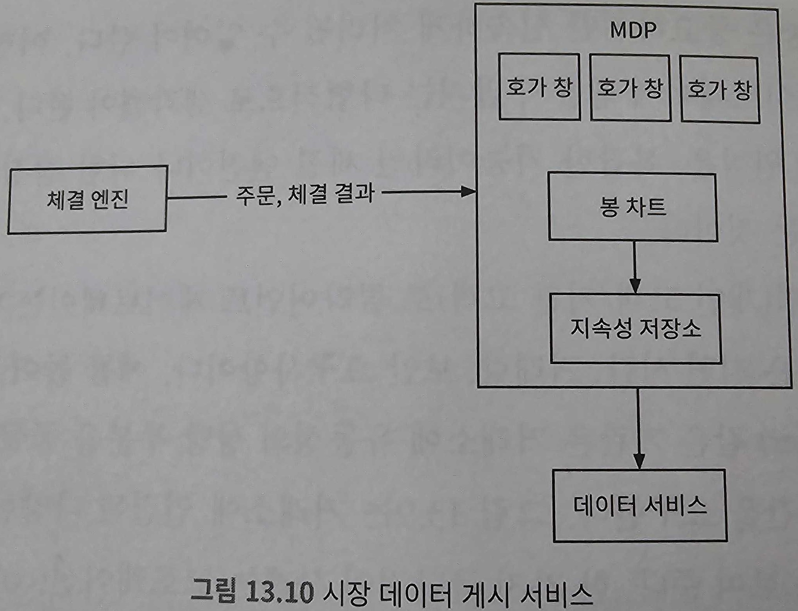

# 증권 거래소(Stock Exchange)


## 1단계: 문제 이해 및 설계 범위 확정

```
지원자: 어떤 증권을 거래한다고 가정할까요? 주식, 옵션, 선물 등이 가능할 것 같습니다만.
면접관: 간단하게 주식만 거래한다고 가정하도록 합시다.
지원자: 새 주문, 주문 취소, 주문 교체 중 어떤 유형의 주문을 지원해야 하나요? 지정가 주문(limit order), 시장가 주문(market order), 조건부 주문(conditional order) 등의 주문 유형을 전부 지원해야 하나요?
면접관: 새 주문을 넣을 수 있고, 체결되지 않은 주문은 취소할 수도 있어야 합니다. 주문 유형으로는 지정가 주문만 가능하다고 하겠습니다.
지원자: 시간 외 거래(after-hours trading)가 가능해야 할까요?
면접관: 아니요, 시간 내 거래만 처리할 수 있으면 됩니다.
지원자: 이 거래소가 갖추어야 할 기본 기능을 설명해 주시면 좋겠습니다. 사용자 수, 증권(symbol) 가짓수나 주문 수 등, 거래소 규모에 관한 부분도 설명해 주시면 감사하겠습니다.
면접관: 새로운 지정가 주문을 접수하거나 기존 주문을 취소할 수 있어야 합니다. 주문이 체결된 경우에는 실시간으로 그 사실을 알 수 있어야 합니다. 호가 창(order book)의 정보는 실시간으로 갱신되어야 합니다. 호가 창은 매수 및 매도 주문 목록이 표시되는 곳입니다. 최소 수만 명 사용자가 동시에 거래할 수 있어야 하고, 최소 100가지 주식 거래가 가능해야 합니다. 거래의 경우 하루에 수십억 건의 주문이 발생할 수 있다고 하겠습니다. 또한 거래소는 규제 시설(regulated facility)이므로 위험성 점검(risk check)이 가능해야 합니다.
지원자: 위험성 점검에 대해서 조금만 더 자세히 설명 부탁드립니다.
면접관: 간단한 점검만 가능하면 됩니다. 일례로, 한 사용자가 하루에 거래할 수 있는 애플 주식을 백만 주 이하로 제한하는 규칙이 있다고 했을 때, 해당 규칙을 위반하는 거래가 이루어지지 않도록 점검할 수 있으면 됩니다.
지원자: 사용자 지갑 관리에 대해서는 언급하지 않으셨는데요. 그 부분도 고려해야 할까요?
면접관: 좋은 지적입니다! 주문 전에 충분한 자금이 있는지 먼저 확인할 필요가 있죠. 아울러 아직 체결되지 않은 주문이 있는 경우, 해당 주문에 이용된 자금은 다른 주문에 쓰일 수 없어야 합니다.
```

### 비기능 요구사항

- 가용성(availability): 최소 99.99%. 거래소의 가용성은 매우 중요한 문제다. 단 몇 초의 장애로도 평판이 손상될 수 있다.
- 결함 내성(fault tolerance): 프로덕션 장애의 파급을 줄이려면 결함 내성과 빠른 복구 메커니즘이 필요
- 지연 시간(latency): 왕복 지연 시간(round trip latency)은 밀리초 수준이어야 하며, 특히 p99(99th 백분위수) 지연 시간이 중요하다. 왕복 지연 시간은 주문이 거래소에 들어오는 순간부터 주문의 체결 사실이 반환되는 시점까지다. p99 지연 시간이 계속 높으면 일부 사용자의 거래소 이용 경험이 아주 나빠진다.
- 보안(security): 거래소는 계정 관리 시스템을 갖추어야 한다. 법률 및 규정 준수를 위해 거래소는 새 계좌 개설 전에 사용자 시원 확인을 위한 KYC(Know Your Client) 확인을 수행한다. 시장 데이터가 포함된 웹 페이지 등의 공개 자원의 경우에는 DDoS(Distributed Denial-of-Service) 공격을 방지하는 장치를 구비해 두어야 한다.

### 개략적 규모 추정

- 100가지 주식
- 하루 10억 건의 주문
- 뉴욕증권거래소는 월요일부터 금요일까지, 오전 9시 30분부터 오후 4시까지(EST) 영업한다. 총 6.5시간이다.
- QPS: 10억 / 6.5시간 X 3600 =~ 43,000
- 최대 QPS: 5 X QPS = 215,000. 거래량은 장 시작 직후, 그리고 장 마감 직전에 훨씬 높다.

## 2단계: 개략적 설계안 제시 및 동의 구하기

### 증권 거래 101

#### 브로커

대부분의 개인 고객은 브로커 시스템을 통해 거래소와 거래한다.<br>
브로커 시스템은 개인 사용자가 증권을 거래하고 시장 데이터를 확인할 수 있도록 편리한 사용자 인터페이스를 제공

#### 기관 고객

기관 고객(institutional client)은 전문 증권 거래 소프트웨어를 사용하여 대량으로 거래한다.<br>
기관 고객마다 거래 시스템에 대한 요구사항은 다르다.<br>
이들은 아주 낮은 응답 시간으로 거래하길 원한다.<br>
일반 사용자들처럼 웹페이지나 모바일 앱에서 시장 데이터를 확인하게 하면 곤란하다.

#### 지정가 주문

지정가 주문(limit order)은 가격이 고정된 매수 또는 매도 주문이다.<br>
시장가 주문과는 달리 체결이 즉시 이루어지지 않을 수 있고, 부분적으로만 체결될 수도 있다.

#### 시장가 주문

시장가 주문(market order)은 가격을 지정하지 않는 주문으로, 시장가로 즉시 체결된다.<br>
체결은 보장되나 비용 면에서는 손해를 볼 수 있다.<br>
급변하는 특정 시장 상황에서 유용하다.

#### 시장 데이터 수준

미국 주식시장에는 L1, L2, L3의 세 가지 가격 정보(price quote) 등급이 있다.(L은 Level을 의미)<br>
L1 시장 데이터(market data)에는 최고 매수 호가(best bid price), 매도 호가(ask price) 및 수량(quantity)이 포함된다.<br>
최고 매수 호가는 구매자가 주식에 지불할 의사가 있는 최고 가격이다.<br>
매도 호가는 매도자가 주식을 팔고자 하는 최저 가격이다.


L2에는 더 많은 수준의 가격 정보가 제공된다.<br>
아래 그림에서 '깊이(depth)'는 체결을 기다리는 물량의 호가를 어디까지 보여 주느느지 나타낸다.


L3는 L2에서 한 걸음 더 나아가, 각 주문 가격에 체결을 기다리는 물량 정보까지 보여준다.


#### 봉 차트

봉 차트(candle chart)는 특정 기간 동안의 주가다.<br>
일반적인 봉('캔들'이라고도 한다)의 모습은 아래 그림과 같다.<br>
하나의 봉 막대로 일정 시간 간격 동안 시장의 시작가, 종가, 최고가, 최저가를 표시할 수 있다.<br>
일반적으로 지원되는 시간 간격은 1분, 5분, 1시간, 1일, 1주일, 1개월이다.


#### FIX

FIX(Financial Information Exchange Protocol, 금융 정보 교환 프로토콜)은 1991년에 만들어졌다.<br>
증권 거래 정보 교환을 위한 기업 중립적 통신 프로토콜이다.<br>
다음은 FIX로 인코딩한 증권 거래의 사례다.

```
8=FIX.4.2 | 9=176 | 35=8 | 49=PHLX | 56=PERS | 52=20071123-05:30:30... | 11=ATOMNOCCC9990900 | 20=3 | 150=E | 39=E | 55=MSFT | 167=CS | 54=1 | 38=15 | 40=2 |
44=15 | 58=PHLX EQUITY TESTING | 59=0 | 47=C | 32=0 | 31=0 | 151=15 | 14=0 | 6=0 | 10=128 |
```

### 개략적 설계안


**거래 흐름(trading flow)** 을 통해 하나의 주문이 어떤 절차로 처리되는지 살펴보자.<br>
지연 시간 요청이 엄격한, 중요 경로(critical path)다.<br>
이 경로를 따라 흐르는 모든 정보는 신속하게 처리되어야 한다.

- 1단계: 고객이 브로커의 웹 또는 모바일 앱을 통해 주문
- 2단계: 브로커가 주문을 거래소에 전송
- 3단계: 주문이 클라이언트 게이트웨이를 통해 거래소로 들어간다. 클라이언트 게이트웨이는 입력 유효성 검사, 속도 제한, 인증, 정규화 등과 같은 기본적인 게이트키핑(gatekeeping) 기능을 수행한 후 주문을 주문 관리자에게 전달
- 4~5단계: 주문 관리자가 위험 관리자가 설정한 규칙에 따라 위험성 점검을 수행
- 6단계: 위험성 점검 과정을 통과한 주문에 대해, 주문 관리자는 지갑에 주문 처리 자금이 충분한지 확인
- 7~9단계: 주문이 체결 엔진으로 전송. 체결 가능 주문이 발간되면 체결 엔진은 매수 측과 매도 측에 각각 하나씩 두 개의 집행(execution, Fill(충족)이라고도 부른다) 기록을 생성. 나중에 그 과정을 재생할 때 항상 결정론적(deterministic)으로 동일한 결과가 나오도록 보장하기 위해 시퀀서(sequencer)는 주문 및 집행 기록을 일정 순서로 정렬
- 10~14단계: 주문 집행 사실을 클라이언트에 전송

다음으로 **시장 데이터 흐름(market data flow)** 을 따라서, 하나의 주문이 체결 엔진부터 데이터 서비스를 거쳐 브로커로 전달되어 집행되기 까지의 과정을 추적해보자.

- M1 단계: 체결 엔진은 주문이체결되면 집행 기록 스트림(또는 충족 기록 스트림)을 만든다. 이 스트림은 시장 데이터 게시 서비스로 전송됨
- M2 단계: 시장 데이터 게시 시버시는 집행 기록 및 주문 스트림에서 얻은 데이터를 시장 데이터로 사용하여 봉 차트와 호가 창을 구성. 그런 다음 시장 데이터를 데이터 서비스로 보냄
- M3 단계: 시장 데이터는 실시간 분석 전용 스토리지에 저장된다. 브로커는 데이터 서비스를 통해 실시간 시장 데이터를 읽는다. 브로커는 이 시장 데이터를 고객에게 전달

마지막으로 **보고 흐름(report flow)** 을 살펴보자

- R1~R2단계(보고 흐름): 보고 서비스(reporter)는 주문 및 실행 기록에서 보고에 필요한 모든 필드의 값을 모든 다음(client_id, price, quantity, order_type, filled_quantity, remaining_quantity 등) 그 값을 종합해 만든 레코드를 데이터베이스에 기록

#### 거래 흐름

##### 체결 엔진(matching engine)

교차 엔진(cross engine)이라고도 한다.<br>
역할

1. 각 주식 심벌에 대한 주문서(order book) 내지 호가 창을 유지 관리. 주문서 또는 호가 창은 특정 주식에 대한 매수 및 매도 주문 목록이다.
2. 매수 주문과 매도 주문을 연결. 다시 말해 주문 체결 결과로 두 개의 집행 기록이 만들어진다. 체결은 빠르고 신속하게 처리되어야 한다.
3. 집행 기록 스트림을 시장 데이터로 배포

가용성 높은 체결 엔진 구현체가 만드는 체결 순서는 결정론적(deterministic)이어야 한다.<br>
즉, 입력으로 주어지는 주문 순서가 같으면 체결 엔진이 만드는 집행 기록 순서는 언제나 동일해야 한다.<br>
이러한 결정론적 특성이 고가용성의 토대가 된다.

##### 시퀀서(sequencer)

체결 엔진을 결정론적으로 만드는 핵심 구성 요소<br>
시퀀서는 체결 엔진에 주문을 전달하기 전에 순서 ID(sequence ID)를 붙여 보낸다.<br>
또한 체결 엔진이 처리를 끝낸 모든 집행 기록 쌍에도 순서 ID를 붙인다.<br>
시퀀서는 입력 시퀀서(inbound sequencer)와 출력 시퀀서(outbound sequencer) 두 가지가 있으며, 각각 고유한 순서를 유지<br>
시퀀서가 만드는 순서 ID는 누락된 항목을 쉽게 발견할 수 있는 일련번호여야 한다.


입력되는 주문과 출력하는 실행 명령에 순서 ID를 찍는 이유

1. 시의성(timeliness) 및 공정성(fairness)
2. 빠른 복구(recovery) 및 재생(replay)
3. 정확한 1회 실행 보증(exactly-once qurantee)

시퀀서는 순서 ID만 생성하는 것이 아니며, 메시지 큐 역할도 한다.<br>
하나는 체결 엔진에 메시지(수신된 주문)를 보내는 큐 역할을 하고, 다른 하나는 주문 관리자에게 메시지(집행 기록)을 회신하는 큐 역할을 한다.<br>
한편 주문과 집행 기록을 위한 이벤트 저장소로 볼 수도 있다.<br>

##### 주문 관리자(order manager)

한쪽에서는 주문을 받고 다른 쪽에서는 집행 기록을 받는다.<br>
주문 상태를 관리하는 것이 주문 관리자의 역할이다.<br>
주문 관리자는 클라이언트 게이트웨이를 통해 주문을 수신하고 다음을 실행

- 종합적 위험 점검 담당 컴포넌트에 주문을 보내어 위험성을 검토
- 사용자의 지갑에 거래를 처리하기에 충분한 자금이 있는지 확인
- 주문을 시퀀서에 전달. 시퀀서는 해당 주문에 순서 ID를 찍고 체결 엔진에 보내어 처리

또한 주문 관리자는 시퀀서를 통해 체결 엔진으로부터 집행 기록을 받는다.<br>
주문 관리자는 체결된 주문에 대한 집행 기록을 클라이언트 게이트웨이를 통해 브로커에 반환<br>
주문 관리자는 빠르고 효율적이며 정확해야 한다.<br>
주문 관리자는 주문의 현재 상태를 유지 관리<br>
다양한 상태 관리(state transition)를 관리해야 하는 문제 때문에 주문 관리자의 구현은 아주 까다롭다.<br>
실제 거래소 시스템이라면 수만 가지 경우를 처리해야 한다.<br>
이벤트 소싱은 주문 관리자 설계에 적합하다. (이후에 살펴볼 예정)

##### 클라이언트 게이트웨이(client gateway)

클라이언트로부터 주문을 받아 주문 관리자에게 보낸다.


클라이언트 게이트웨이는 중요 경로상에 놓이며, 지연 시간에 민감(가벼워야 함)<br>
가능한 한 빨리 올바른 목적지로 주문을 전달해야 함<br>
어떤 기능을 클라이언트 게이트웨이에 넣을지 말지는 타협적으로 생각해야 함<br>
일반적으로 적용 가능한 원칙은, 복잡한 기능이라면 체결 엔진이나 위험 점검 컴포넌트에 맡겨야 한다는 것이다.<br>
고객 유형별(개인 고객/기관 고객)로 클라이언트 게이트웨이는 다양하다.<br>
주요 고려 사항은 지연 시간, 거래량, 보안 요구사항이다.<br>


#### 시장 데이터 흐름

시장 데이터 게시 서비스(Market Data Publisher, MDP)는 체결 엔진에서 집행 기록을 수신하고 집행 기록 스트림에서 호가 창과 봉 차트를 만들어 낸다.<br>
호가 창과 봉 차트를 통칭하여 시장 데이터라고 한다.<br>
시장 데이터는 데이터 서비스로 전송되어 해당 서비스의 구독자(subscriber)가 사용할 수 있게 된다.



#### 보고 흐름

거래소에서 필수적인 부분 가운데 하나는 보고(reporting)다.<br>
보고 서비스는 거래의 중요 경로상에 있지만 여전히 시스템의 중요한 부분이다.<br>
보고 서비스는 거래 이력, 세금 보고, 규정 준수 여부 보고, 결산(settlement) 등의 기능을 제공<br>
거래 흐름에는 효율성과 짧은 지연 시간이 중요하지만, 보고 서비스는 오히려 정확성과 규정 준수가 핵심<br>
입력으로 들어오는주문과 그 결과로 나가는 집행 기록 모두에서 정보를 모아 속성(attributes)들을 구성하는 것이 일반적인 관례<br>
들어오는 새 주문에는 주문 세부 정보만 있고, 나가는 집행 기록에는 보통 주문 ID, 가격, 수량 및 집행 상태 정보만 있기 때문<br>
보고 서비스는 그 두 가지 출처에서 오는 정보를 잘 병합하여 보고서를 만든다.


### API 설계

RESTful API 든 어떤 프로토콜이든 간에 아래 기본 기능은 동일하게 제공되어야 한다.

#### 주문

**요청**

```
POST /v1/order
-H "Authorization: ~" // 무언가 인증이 필요
-d
{
    "symbol": "", // 주식을 나타내는 심벌(symbol)
    "side": "", // buy(매수) 또는 sell(매도)
    "price": 0L, // 지정가 주문의 가격
    "orderType": "", // limit(지정가) 또는 market(시장가). 이번 장에서는 지장가 주문만 지원함에 유의
    "quantity": 0L // 주문 수량
}
```

**응답**

```
{
    "id": 0L, // 주문 ID
    "creationTime": 0L, // 주문이 시스템에 생성된 시간
    "filledQuantity": 0L, // 집행이 완료된 수량
    "remainingQuantity": 0L, // 아직 체결되지 않은 주문 수량
    "status": "" // new/canceled/filled
}
```

**코드**

|코드|의미|
|---|---|
|200|성공|
|40x|인자 오류/접근 불가/권한 없음|
|500|서버 오류|

#### 집행

**요청**

```
GET /v1/order/execution?symbol={:symbol}&orderId={:orderId}&startTime={:startTime}&endTime={:endTime}
-H "Authorization: ~" // 무언가 인증이 필요
-d
{
    "symbol": "", // 주식 심벌
    "orderId": "", // 주문의 ID. 선택적 인자(optional)
    "startTime": 0L, // 질의 시작 시간. 기원 시간(epoch) 기준.
    "endTime": 0L // 질의 종료 시간. 기원 시간 기준
}
```

**응답**

```
{
    "executions": [], // 범위 내 모든 집행 기록의 배열
    "id": 0L, // 집행 기록 ID
    "orderId": 0L, // 주문 ID
    "symbol": "", // 주식 심벌
    "side": "", // buy(매수) 또는 sell(매도)
    "price": "", // 체결 가격
    "orderType": "", // limit(지정가) 또는 market(시장가)
    "quantity": 0L // 체결 수량
}
```

**코드**

|코드|의미|
|---|---|
|200|성공|
|40x|인자 오류/해당 자원 없음/접근 불가/권한 없음|
|500|서버 오류|

#### 호가 창/주문서

**요청**

```
GET /v1/marketdata/orderBook/L2?symbol={:symbol}&depth={:depth}
-d
{
    "symbol": "", // 주식 심벌
    "depth": 0, // 반환할 호가 창의 호가 깊이
    "startTime": 0L, // 질의 시작 시간. 기원 시간(epoch) 기준.
    "endTime": 0L // 질의 종료 시간. 기원 시간 기준
}
```

**응답**

```
{
    "bids": [], // 가격과 수량 장보를 담은 배열
    "asks": [] // 가격과 수량 정보를 담은 배열
}
```

**코드**

|코드|의미|
|---|---|
|200|성공|
|40x|인자 오류/해당 자원 없음/접근 불가/권한 없음|
|500|서버 오류|

#### 가격 변동 이력(봉 차트)

**요청**

```
GET /v1/marketdata/candles?symbol={:symbol}&resolution={:resolution}&startTime={:startTime}&endTime={:endTime}
-d
{
    "symbol": "", // 주식 심벌
    "resolution": 0L, // 봉 차트의 윈도 길이(초 단위)
    "startTime": 0L, // 질의 시작 시간. 기원 시간(epoch) 기준.
    "endTime": 0L // 질의 종료 시간. 기원 시간 기준
}
```

**응답**

```
{
    "candles": [], // 각 봉의 데이터를 담은 배열
    "open": 0d, // 해당 봉의 시가
    "close": 0d, // 해당 봉의 종가
    "high": 0d, // 해당 봉의 고가
    "low": 0d // 해당 봉의 저가
}
```

**코드**

|코드|의미|
|---|---|
|200|성공|
|40x|인자 오류/해당 자원 없음/접근 불가/권한 없음|
|500|서버 오류|

### 데이터 모델

#### 상품, 주문, 집행

상품(product)은 거래 대상 주식(즉, 심벌)이 가진 속성으로 정의된다.<br>
상품의 유형, 거래에 쓰이는 심벌, UI에 표시도리 심벌, 결산에 이용되는 통화 단위, 매매 수량 단위(lot size), 호가 가격 단위(tick size) 등이다.<br>
이 데이터는 자주 변경되지 않는다. (주로 UI 표시를 위한 데이터)<br>
아무 데이터베이스에나 저장 가능하며, 캐시를 적용하기 좋다.<br>
주문(order)은 매수 또는 매도를 실행하라는 명령이며, 집행 기록은 체결이 이러우진 결과다.<br>
집행 기록(execution)은 충족(fill)이라고도 부른다.<br>
모든 주문이 집행되지는 않는다.<br>
체결 엔진은 하나의 주문 체결에 관여한 매수 행위와 매도 행위를 나타내는 두 개의 집행 기록을 결과로 출력한다.


주문과 집행 기록은 거래소가 취급하는 가장 중요한 데이터다.

- 중요 거래 경로는 주문과 집행 기록을 데이터베이스에 저장하지 않는다. 성능을 높이기 위해 메모리에서 거래를 체결하고 하드디스크나 공유 메모리를 활용하여 주문과 집행 기록을 저장하고 공유한다. 특히 주문과 집행 기록은 빠른 복구를 위해 시퀀서에 저장하며, 데이터 보관은 장 마감 후에 실행한다.
- 보고 서비스는 조정이나 세금 보고 등을 위해 데이터베이스에 주문 및 집행을 기록한다.
- 집행 기록은 시장 데이터 프로세서로 전달되어 호가 창/주문서와 봉 차트 데이터 재구성에 쓰인다.

#### 호가 창/주문서

호가 창은 특정 증권 또는 금융 상품에 대한 매수 및 매도 주문 목록으로, 가격 수준별로 정리되어 있다.<br>
체결 엔진이 빠른 주문 체결을 위해 사용하는 핵심 자료 구조다.<br>
호가 창의 자료 구조는 다음 요구사항을 만족할 수 있는, 효율성이 높은 것이어야 한다.

- 일정한 조회 시간: 이 요건을 만족해야 하는 작업에는 특정 가격 수준의 주문량 조회, 특정 가격 범위 내의 주문량 조회 등이 포함
- 빠른 추가/취소/실행 속도: 가급적 O(1) 시간 복잡도를 만족해야 한다. 여기 해당하는 작업에는 새 주문 넣기, 기존 주문 취소하기, 주문 체결하기 등이 있다.
- 빠른 업데이트: 여기 해당하는 작업에는 주문 교체 등이 있다.
- 최고 매수 호가/최저 매도 호가 질의
- 가격 수준 순회(iteration)


이 예제에서는 애플 주식 2,700주에 대한 대량 시장가 매수 주문은 어떻게 처리될까?<br>
최저 매도 호가 큐의 모든 매도 주문과 체결도니 후에 호가 100.11 큐의 첫 번째 매도 주문과 체결되며 거래가 끝난다.<br>
이 대량 주문의 체결 결과로 매수/매도 호가 스프레드, 즉 둘 간의 가격 차이가 넓어지고 주식 간격은 한 단계 상승한다. (최저 매도 호가는 100.11으로 바뀐다.)<br>

```java
class PriceLevel {
    private Price limitPrice;
    private long totalVolume;
    private List<Order> orders;
}

class Book<Side> {
    private Side side;
    private Map<Price, PriceLevel> limitMap;
}

class OrderBook {
    private Book<Buy> buyBook;
    private Book<Sell> sellBook;
    private PriceLevel bestBid;
    private PriceLevel bestOffer;
    private Map<OrderID, Order> orderMap;
}
```

위 코드는 앞서 살펴본 모든 설계 요구사항을 만족할 수 있을까?<br>
아니다. `private List<Order> orders` 보다 효율적인 호가 창을 만들려면 "orders"의 자료 구조는 이중 연결 리스트(doubly linked list)로 변경하여 모든 삭제 연산이 O(1)에 처리되도록 해야 한다.

1. 새 주문을 넣는다는 것은 PriceLevel 리스트 마지막(tail)에 새 Order를 추가하는 것을 의미. 이중 연결 리스트에서 이 연산은 O(1)에 처리된다.
2. 주문을 체결한다는 것은 PriceLevel 리스트의 맨 앞(head)에 있는 Order를 삭제한다는 것과 같다. 이중 연결 리스트의 경우 이 연산의 시간 복잡도는 O(1)이다.
3. 주문을 취소한다는 것은 호가 창, 즉 OrderBook에서 Order를 삭제한다는 뜻. OrderBook에 포함되어 있는 도움(helper) 자료 구조 `Map<OrderId, Order> orderMap` 을 활용하면 O(1) 시간 내에 취소한 주문을 찾을 수 있다. 주문을 찾았다더라도 orders가 단일 연결 리스트였더라면 전체 목록을 순회하여 이전 포인터를 찾아야 주문을 삭제할 수 있으므로 O(n)의 시간이 걸렸을 것이다. 하지만 이중 연결 리스트를 사용하는 경우에는 발견된 Order 안에 이전 주문을 가리키는 포인터가 있으므로 전체 주문 목록을 순회하지 않고도 주문을 삭제할 수 있다.


호가 창 자료 구조는 시장 데이터 프로세서도 많이 사용한다는 점에 유의하자.<br>
체결 엔진이 생성한 집행 기록 스트림에서 L1, L2, L3 데이터를 재구성하기 위해서다.

#### 봉 아트

봉 차트(candle chart)는 시장 데이터 프로세서가 가장 시장 데이터를 만들 때 호가 창과 더불어 사용하는 핵심 자료 구조다.<br>
봉 차트 모델링하기 위해서 Candlestick 클래스와 CandlestickChart 클래스를 사용<br>
하나의 봉이 커버하는 시간 범위가 경과하면 다음 주기(interval)를 커버할 새 Candlestick 클래스 객체를 생성하여 CandlestickChart 객체 내부 연결 리스트에 추가

```java
class Candlestick {
    private long openPrice;
    private long closePrice;
    private long highPrice;
    private long lowPrice;
    private long volume;
    private long timestamp;
    private long interval;
}

class CandlestickChart {
    private LinkedList<Candlestick> sticks;
}
```

봉 차트에서 많은 종목의 가격 이력을 다양한 시간 간격을 사용해 추적하려면 메모리가 많이 필요한데 이를 최적화하기 위해서는 두 가지 방법이 있다.

1. 미리 메모리를 할당해 둔 링(ring) 버퍼에 봉을 보관하면 새 객체 할당 횟수를 줄일 수 있다.
2. 메모리에 두는 봉의 개수를 제한하고 나머지는 디스크에 보관

시장 데이터는 일반적으로 실시간 분석을 위해 메모리 상주 칼럼형 데이터베이스(가령 KDB)에 둔다.<br>
시장이 마감된 후에는 데이터를 이력 유지 전용 데이터베이스에도 저장

## 3단계: 상세 설계

### 성능

지연 시간은 거래소에 아주 중요한 문제다.<br>
평균 지연 시간은 낮아야 하고, 전반적인 지연 시간 분포는 안정적이어야 한다.<br>
지연 시간이 안정적인지 보든 좋은 척도는 p99(99% 백분위수) 지연시간이다.<br>
`지연 시간=중요 경로상의 컴포넌트 실행 시간 합계`
지연 시간을 줄이는 방법에는 두 가지가 있다.

1. 중요 경로에서 실행할 작업 수를 줄인다.
2. 각 작업의 소요 시간을 줄인다.
   1. 네트워크 및 디스크 사용량 경감
   2. 각 작업의 실행 시간 경감

중요 매매 경로에는 다음과 같은 컴포넌트가 포함된다.

```
게이트웨이 -> 주문 관리자 -> 시퀀서 -> 체결 엔진
```

**첫 번째 방법** <br>
중요 경로에는 꼭 필요한 구성 요소만 둔다.<br>
심지어 로깅도 지연 시간을 줄이기 위해 중요 경로에서 뺀다.<br>
**두 번째 방법** <br>
왕복 네트워크 지연 시간은 약 500마이크로초다.<br>
핵심 경로에 네트워크를 통해 통신하는 컴포넌트가 많으면 총 네트워크 지연 시간은 한 자릿수 밀리초까지 늘어난다.<br>
또한 시퀀서는 이벤트를 디스크에 저장하는 이벤트 저장소다.<br>
순차적 쓰기의 성능 이점을 활용하여 효율적으로 설계한다 해도 디스크 엑세스 지연 시간은 여전히 수십 밀리초 단위다.<br>
네트워크 및 디스크 엑세스 지연 시간을 모두 고려하면 총 단대단(end-to-end) 지연 시간은 수십 밀리초에 달한다.<br>
거래소 초창기에는 이 정도도 놀라운 값이었지만, 모든 거래소가 지연 시간을 극도로 낮추는 경쟁에 나서면서 더 이상 충분하지 않게 되었다.<br>
결쟁에서 앞서 나가기 위해 거래소는 주로 네트워크 및 디스크 엑세스 지연 시간을 줄이거나 없애는 방안을 통해 중요 경로의 단대단 지연 시간을 숫비 마이크로초로 줄였다.<br>
오랜 시간 동안 검증된 그 설계안의 요체는 모든 것을 동일한 서버에 배치하여 네트워크를 통하는 구간을 없애는 것이다.<br>
같은 서버 내 컴포넌트 간 통신은 이벤트 저장소인 mmap을 통한다.<br>


애플리케이션 루프의 주된 작업 실행 메커니즘은 while 순환문을 통해 실행할 작업을 계속 폴링(polling)하는 것이다.<br>
엄격한 지연 시간 요건을 만족하려면 목적 달성에 가장 중요한 작업만 이 순환문 안에서 처리해야 한다.<br>
이 메커니즘의 목표는 각 구성 요소의 실행 시간을 줄여 전체적인 실행 시간이 예측 가능하도록 보장하는 것이다.<br>
다이어그램의 각 상자는 컴포넌트를 나타내는데, 컴포넌트는 서버의 프로세스를 의미한다.<br>
CPU 효율성을 극대화하기 위해 애플리케이션 루프(주 처리 루프라고 생각하면 된다)는 단일 스레드로 구현하며, 특정 CPU 코어에 고정시킨다.<br>


이 다이어그램에서 주문 관리자의 애플리케이션 루프는 CPU 1에 고정되어 있다.<br>
애플리케이션 루프를 CPU에 고정하면 상당한 이점이 있다.

1. 문맥 전환(context switch)가 없다. CPU 1이 주문 관리자의 애플리케이션 루프 처리에 온전히 할당된다.
2. 상태를 업데이트하는 스레드가 하나뿐이라서 락을 사용할 필요가 없고 잠금 경합(lock contention)도 없다.

이 두 가지 모두 p99 지연 시간 경감에 기여<br>
CPU를 고정하는 방안의 단점은 코딩이 더 복잡해진다는 것<br>
엔지니어는 각 작업이 애플리케이션 루프 스레드를 너무 오래 점유하지 않도록 각 작업에 걸리는 시간을 신중하게 분석해야 한다.<br>
그렇지 않으면 후속 작업을 제때 실행하지 못할 수 있다.<br>
'mmap'은 파일을 프로세스의 메모리에 매핑하는 mmap(2)라는 이름의 POSIX 호환 UNIX 시스템 콜(system call)을 일컫는다.<br>
mmap(2)은 프로세스 간 고성능 메모리 공유 메커니즘을 제공<br>
메모리에 매핑할 파일이 `/dev/shm` 에 있을 때 성능 이점이 더욱 커진다.<br>
`/dev/shm` 은 메모리 기반 파일 시스템<br>
`/dev/shm` 에 위치한 파일에 mmap(2)을 수행하면 공유 메모리에 접근해도 디스크 I/O가 발생하지 않는다.<br>
최신 거래소는 이를 활용하여 중요 경로에서 가능한 한 디스크 접근이 일어나지 않도록 한다.<br>
서버에서 mmap(2)를 사용하여 중요 경로에 놓인 구성 요소가 서로 통신할 때 이용할 메시지 버스를 구현하는 것이다.<br>
이 통신 경로를 사용하면 네트워크나 디스크에 접근하는 일은 없으며, 메시지 전송에 마이크로초 미만이 걸린다.<br>
이렇게 mmap(2)을 활용하여 만든 이벤트 저장소에 이벤트 소싱 설계 패러다임을 결합하면 거래소는 서버에 지연 시간이 낮은 마이크로서비스들을 구축할 수 있게 된다.

### 이벤트 소싱

전통적인 애플리케이션은 상태를 데이터베이스에 유지<br>
이런 구조에서는 문제가 발생하면 원인을 추적하기가 어렵다.<br>
데이터베이스는 현재 상태만 유지할 뿐, 현재 상태를 초래한 이벤트의 기록은 없다.<br>
이벤트 소싱 아키텍처는 현재 상태를 저장하는 대신 상태를 변경하는 모든 이벤트의 변경 불가능한(immutable) 로그를 유지<br>
이 로그를 절대적 진실의 원천으로 삼는 것


왼쪽은 일반적인 데이터베이스 스키마다.<br>
주문 상태를 추적하지만 현재 상태에 도달하는 방법에 대한 정보는 포함하지 않는다.<br>
오른쪽은 이벤트 소싱 아키텍처를 따르는 경우다.
주문 상태를 변경하는 모든 이벤트를 추적하므로, 모든 이벤트를 순서대로 재생하면 주문 상태를 복구할 수 있다.


mmap 이벤트 저장소를 메시지 버스로 사용하는 설계안<br>
카프카의 펍섭(Pub-Sub) 모델과 아주 유사<br>
사실, 지연 시간에 대한 엄격한 요구사항만 없었으면 카프카를 사용할 수도 있었을 것이다.<br>
다이어그램에서 외부 도메인(external domain)은 "증권 거래소 101"절에서 소개한 FIX를 사용하여 거래 도메인(trading domain)과 통신한다.

- 게이트웨이는 빠르고 간결한 인코딩을 위해 FIX를 SBE(FIX over Simple Binary Encoding)로 변환하고, 각 주문을 이벤트 저장소 클라이언트를 사용하여 미리 정의된 형식의 NewOrderEvent 형태로 저장
- 체결 엔진에 내장된 주문 관리자는 이벤트 저장소로부터 NewOrderEvent를 수신하면 유효성을 검사한 다음 내부 주문 상태에 추가한 후 해당 주문은 처리 담당 CPU 코어로 전송
- 주문이 체결되면 OverFilledEvent가 생성되어 이벤트 저장소로 전송
- 시장 데이터 프로세서 및 보고 서비스 같은 다른 구성요소는 이벤트 저장소를 구독하고, 이벤트를 받을 때마다 적절히 처리

이 설계는 앞서 살펴본 개략적 설계안에는 대체적으로 부합하지만, 이벤트 소싱 아키텍처에서 더 효율적으로 동작할 수 있도록 조정할 부분이 몇 가지 있다.<br>
첫 번째 차이는 **주문 관리자** 다.<br>
이벤트 소싱 아키텍처에서 주문 관리자는 컴포넌트에 내장되는 재사용 가능 라이브러리다.<br>
주문 상태는 많은 컴포넌트에 중요하므로 이런 설계가 말이 된다.<br>
다른 컴포넌트가 주문 상태 업데이트 또는 질의를 위해 중앙화된 주문 관리자를 이용하도록 할 경우, 지연 시간은 길어질 수 있다.<br>
보고 서비스처럼 중요 거래 경로에 있지 않은 컴포넌트는 더욱 그렇다.<br>
각 컴포넌트가 주문 상태를 자체적으로 유지하기는 하겠으나 이벤트 소싱 아키텍처의 특성상 그 모두는 전부 동일하며 재현 가능할 것이다.<br>
또 다른 주요 차이점은 **시퀀서가 없다는 점** 이다.<br>
이벤트 소싱 아키텍처를 따르게 되면 모든 메시지는 동일한 이벤트 저장소를 사용<br>
이벤트 저장소에 보관되는 항목에는 sequence 필드가 있다.<br>
이 필드의 값은 이벤트 저장소에 있는 시퀀서가 넣는다.<br>
각 이벤트 저장소에는 하나의 시퀀서만 있다.<br>
시퀀서가 여러 개 있으면 이벤트 저장소에 쓰는 권한을 두고 경쟁하게 되므로 좋지 않다.<br>
거래소 같이 바쁜 시스템의 경우에는 락 경합에 낭비할 시간이 없다.<br>
따라서 시퀀서는 이벤트 저장소에 보내기 전에 이벤트를 순서대로 정렬하는 유일한 쓰기 연산 주체다.<br>
개략적 설계에서 살펴본 시퀀서는 메시지 저장소 역할도 하였지만 지금 살펴보는 시퀀서는 한 가지 간단한 작업만 수행하며 아주 빠르다.<br>
이 시퀀서는 각 컴포넌트에 고유한 링 버퍼에서 이벤트를 가져온다.<br>
각 이벤트에서 순서 ID를 찍은 다음 이벤트 저장소로 보낸다.<br>
주 시퀀서가 다운될 경우를 대비해, 백업 시퀀서를 두면 가용성을 높일 수 있다.


### 고가용성

본 설계안은 99.99%의 가용성을 염두에 두고 설계하였다.<br>
거래소가 다운될 수 있는 시간은 하루에 8.64초를 넘으면 안 된다는 뜻이다.<br>
가용성을 높여야 할 때는 다음과 같은 사항을 살펴보아야 한다.

1. 거래소 아키텍처의 단일 장애 지점(SPOF)을 식별해야 한다.
2. 장애 감지 및 백업 인스턴스로의 장애 조치 결정이 빨라야 한다.

클라이언트 게이트웨이와 같은 무상태(stateless) 서비스의 경우, 서버를 추가하면 쉽게 수평적 확장이 가능<br>
주문 관리자나 체결 엔진처럼 상태를 저장하는 컴포넌트는, 사본 간에 데이터를 복사할 수 있어야 한다.<br>


주 체결 엔진은 소위 주 인스턴스이고, 부 체결 엔진은 동일한 이벤트를 수신하고 처리하지만 이벤트 저장소로 이벤트를 전송하지는 않는다.<br>
주 인스턴스가 다운되면 부 인스턴스는 즉시 주 인스턴스 지위를 승계한 후 이벤트를 전송<br>
부 인스턴스가 다운된 경우, 일단 재시작하고 나서 이벤트 저장소 데이터를 사용해 모든 상태를 복구한다.<br>
이벤트 소싱 아키텍처는 거래소에 적합<br>
그 결정론적(deterministic) 특성 때문에 상태 복구가 쉽고 정확하기 때문<br>
이 아키텍처에서는 주 체결 엔진의 문제를 자동 감지할 메커니즘이 필요<br>
하드웨어와 프로세스를 모니터링하는 일반적인 방안 외에도, 채결 엔진과 박동 메시지를 주고받는 방안도 생각해 볼 수 있다.<br>
박동 메시지를 시간 내에 받지 못하면 체결 엔진에 문제가 있는 것으로 판단하는 것<br>
이 주/부 체결 엔진 설계안의 문제점은 단일 서버 안에서만 동작한다는 것<br>
고가용성을 달성하려면 이 개념을 여러 서버 또는 데이터 센터 전반으로 확장해야 한다.<br>
아울러 주 서버의 이벤트 저장소는 모든 부 서버로 복제해야 한다.<br>
이벤트 저장소를 여러 서버로 복제하는 데는 시간이 걸린다.<br>
안정적 UDP(reliable UDP)를 사용하면 모든 부 서버에 이벤트 메시지를 효과적으로 브로드캐스트(broadcast)할 수 있다.<br>

### 결함 내성

대형 기술 기업에서는 핵심 데이터를 여러 지역의 데이터센터에 복제하여 이 문제를 해결<br>
결함 내성(fault-tolerant) 시스템을 만들려면 많은 질문에 답해야 한다.

1. 주 서버가 다운되면 언제, 그리고 어떻게 부 서버로 자동 전환하는 결정을 내리나?
    - 시스템에서 잘못된 정보를 전송하면 불필요한 장애 극복 절차, 즉 부 시스템으로의 자동 전환이 발생할 수 있다.
    - 또는 코드의 버그로 인해 주 서버가 다운되었다면 부 서버로 자동 전환되더라도 같은 버그 때문에 부 서버까지 다운될 수 있다. 그 결과 모든 주/부 서법가 중단되면 시스템은 더 이상 사용할 수 없는 상태에 빠진다.
    - 이런 문제는 해결하기 어렵다.
    - 새 시스템을 처음 출시할 때는 수동으로 장애 복구 조치를 수행한다.
    - 충분한 시그널, 운영 경험을 축적하여 시스템에 자신이 생기면 그때 자동화한다.
    - 카오스 엔지니어링(chaos engineering)은 드물게 발생하는 까다로운 사례를 수면으로 이끌어내고 우녕 경험을 빠르게 축적하는 데 좋은 방법
2. 부 서버 가운데 새로운 리더는 어떻게 선출하는가?
    - 실전에서 검증된 러더 선출 알고리즘이 많다.
    - 래프트(Raft) 예를 보자.
    - 
      - 자체 이벤트 저장소가 있는 5개의 서버가 있는 래프트 클러스터 사례다
      - 현재 리더는 모든 인스턴스, 즉 팔로어(follower)에 데이터를 전송
      - 래프트에서 작업 수행에 필요한 최수 투표수는 `(n / 2) + 1` 이며, 여기서 n은 클러스터의 구성 수다. (이 사례의 경우 최소 투표수는 3)
      - 위 그림에서 팔로어가 RPC를 통해 리더로부터 새 이벤트를 수신하는 과정을 보여준다.
      - 수신된 이벤트는 팔로어의 자체 mmap 이벤트 저장소에 저장된다.
      - 리더 선출 과정에서 리더는 팔로어에게 박동 메시지(내용이 없는 AppendEnties)를 보낸다.
      - 일정 시간 동안 박동 메시지를 받지 못한 팔로어는 새 리더를 선출하는 선거 타이머를 시작
      - 가장 먼저 그 타이머가 타임아웃된 팔로어는 후가가 되고, 다른 나머지 팔로어에게 투표를 요청(RequestVote 호출)
      - 그 팔로어가 과반수 이상의 표를 받으면 새로운 리더가 된다.
      - 첫 번째 팔로어의 임기(term) 값이 새 노드보다 짧으면 리더가 될 수 없다.
      - 여러 명의 팔로어가 동시에 후보가 되는 경우 '분할 투표(split vote)'라고 한다.
      - 이 경우 기존 선거의 타임아웃을 선언하고 새로운 선거를 시작
      - 
        - 시간축이 정상 운영 기간과 선거 기간을 나타내는 임의 구간으로 분할되어 있으며, 이 각 구간이 어떤 리더의 임기다.
3. 복구 목표 시간(Recovery Time Objective, RTO)는 얼마인가?
    - 복구 시간 목표(Recovery Time Objective, RTO)는 애플리케이션이 다운되어도 사업에 심각한 피해가 없는 시간의 최댓값
    - 증권 거래소의 경우, 2등급(second-level) RTO를 달성해야 하는데 그러려면 서비스의 자동 복구가 반드시 가능해야 한다.
    - 우선순위에 따라 서비스를 분류하고 최소 서비스 수준을 유지하기 위한 성능 저하(degradation strategey)을 정의한다.
4. 어떤 기능을 복구해야 하는가(Recovery Point Objective, RPO)? 시스템이 성능 저하 상태로도 동작할 수 있는가?
    - 복구 목표 지점(Recovery Point Objective, RPO)는 비즈니스에 심각한 피해가 발생하기 전에 손실될 수 있는 데이터의 양. 즉 손실 허용 범위를 의미
    - 실무에서는 '데이터는 자주 백업해야 한다'는 것과 같은 뜻으로 받아들인다.
    - 증권 거래소는 데이터 손실을 용납할 수 없으므로 RPO가 거의 0에 가깝다.
    - 래프트 메커니즘을 사용하면 데이터 사본은 많다.
    - 모든 클러스터 노드가 같은 상태를 갖도록 보장할 수도 있다.
    - 현재 리더에 장애가 생기면 새로운 리더가 중단 없이 작업을 계속할 수 있다.

### 체결 알고리즘

<br>

```java
Context handleOrder(OrderBook orderBook, OrderEvent orderEvent) {
    if (orderEvent.getSequenceId() != nextSequence) {
        return ERROR(OUT_OF_ORDER, nextSequence);
    }

    if (!validateOrder(symbol, price, quantity)) {
        return ERROR(INVALID_ORDER, orderEvent);
    }

    Order order = createOrderFromEvent(orderEvent);
    switch (msgType) {
        case NEW:
            return handleNew(orderBook, order);
        case CANCEL:
            return handleCancel(orderBook, order);
        default:
            return ERROR(INVALID_ID_MSG_TYPE, msgType);
    }
}

Context handleNew(OrderBook orderBook, Order order) {
    if (BUY.equals(order.side)) {
        return match(orderBook.sellBook, order);
    } else {
        return match(orderBook.buyBook, order);
    }
}

Context handleCancel(OrderBook orderBook, Order order) {
    if (!orderBook.orderMap.contains(order.orderId)) {
        return ERROR(CANNOT_CANCEL_ALREADY_MATCHED, order);
    }
    removeOrder(order);
    setOrderStatus(order, CANCELED);
    return SUCCESS(CANCEL_SUCCESS, order);
}

Context match(OrderBook book, Order order) {
    Quantity leavesQuantity = order.quantity - order.matchedQuantity;
    Iterator<Order> limitIter = book.limitMap.get(order.price).orders;
    while (limitIter.hasNext() && leavesQuantity > 0) {
        Quantity matched = min(limitIter.next.quantity, order.quantity);
        order.matchedQuantity += matched;
        leavesQuantity = order.quantity - order.matchedQuantity;
        remove(limitIter.next);
        generatedMatchedFill();
    }
    return SUCCESS(MATCH_SUCCESS, order);
}
```

이 의사코드는 FIFO(선입선출) 체결 알고리즘을 사용<br>
특정 가격 수준에서 먼저 들어온 주문이 먼저 체결되고, 마지막 주문이 가장 나중에 체결<br>
이런 알고리즘들은 선물 거래에 흔히 사용된다.<br>
예를 들어, FIFO에 LMM(Lead Market Maker)을 결합한 알고리즘의 경우, FIFO 대기열보다 LMM에 먼저 일정 수량을 할당<br>
그 비율은 LMM 회사가 거래소와 협상하여 결정<br>
체결 알고리즘은 다른 많은 시나리오에도 이용되는데, 대표적으로 다크 풀(dark pool)이 있다.

### 결정론

결정론(determinism)에는 기능적 결정론(functional determinism)과 지연 시간 결정론(latency determinism)이 있다.<br>
기능적 결정론은 시퀀서나 이벤트 소싱 아키텍처를 도입함으로써 이벤트를 동일한 순서로 재생하면 항상 같은 결과를 얻을 수 있도록 보장하는 것<br>
기능적 결정론에서는 이벤트가 발생하는 실제 시간은 대체로 중요하지 않고 순서가 중요하다.<br>


위 그림에서 시간 축 위에 불규칙하게 나열된 타임스탬프들이 연속된 점들로 반환되었는데, 그렇게 되면 재생과 복구에 소요되는 시간이 크게 줄어든다.<br>
지연 시간 결정론은 각 거래의 처리 시간이 거의 같다는 뜻이며 사업에서 가장 중요한 부분이다.<br>
이를 측정하는 수학적인 바업은, 99번 백분위수 지연 시간(p99)이나 99.99번 백분위수 지연 시간을 재는 것이다.<br>
지연 시간 계산에는 HdrHistogram을 활용<br>
p99 지연 시간이 낮다는 것은 거래소가 거의 모든 거래에 안정적인 성능을 제공한다는 뜻<br>
지연 시간 변동 폭이 커지면 원인을 파악해야 하는데, 자바의 경우에 안전 지점(safe point)이 원인인 경우가 많다.<br>
핫스팟 JVM의 Stop-the-World Garbage Collection 알고리즘이 그 사례다.<br>

## 시장 데이터 게시 서비스 최적화

시장 데이터 게시 서비스(Market Data Publisher, MDP)는 체결 엔진의 체결 결과를 받아 이를 기반으로 호가 창과 봉 차트를 재구축한 다음 구독자에게 그 데이터를 게시(publish)한다.<br>
MDP의 메모리는 무한대로 확장할 수 없으므로 봉 차트에는 상한선을 두어야 한다.<br>
이 설계안에서는 링 버퍼를 사용<br>
원형 버퍼(circular buffer)라고도 하는 링 버퍼는 앞과 끝이 연결된 고정 크기의 큐다.<br>
여기에 생산자는 계속 데이터를 넣고, 하나 이상의 소비자는 데이터를 꺼낸다.<br>
링 버퍼의 공간은 사전에 할당된 것(객체를 생성하거나 삭제하는 연산은 필요없다는 뜻)<br>
또한 이 데이터 구조는 락을 사용하지 않는다.<br>
그 외에도 데이터 구조를 더 효율적으로 만들기 위해 패딩(padding)을 사용해서 링 버퍼의 순서 번호가 다른 것과 같은 캐시 라인(cache line)에 오지 않도록 한다.


## 시장 데이터의 공정한 배포

똑똑한 고객들은 시장이 열리면 첫 번째 구독자가 되기 위해 달려들 것이다.<br>
이를 완화할 수 있는 몇 가지 방법이 있다.<br>
안정적 UDP(reliable UDP)를 사용하는 멀티캐스트(multicast)는 한 번에 많은 참가자에게 업데이트를 브로드캐스트 하기 좋은 솔루션이다.<br>
구독자가 연결하는 순서로 데이터를 주는 대신, 무작위로 순서를 주는 방법도 있다.

### 멀티캐스트

1. 유니캐스트(unicast): 하나의 출처에서 하나의 목적지로만 보내는 전송 프로토콜
2. 브로드캐스트(broadcast): 하나의 출처에서 전체 하위 네트워크로 보내는 방식
3. 멀티캐스트(multicast): 하나의 출처에서 다양한 하위 네트워크 상의 호스트들로 보내는 방식

거래소 설계에 보편적으로 이용되는 것은 멀티캐스트다.<br>
같은 멀티캐스트 그룹에 속한 수신자는 이론적으로는 동시에 데이터를 수신한다.<br>
그러나 UDP는 신뢰성이 낮은 프로토콜이며 그 데이터그램(datagram)은 모든 수신자에게 도달하지 못할 수도 있다.

### 코로케이션

많은 거래소가 헤지 펀드 또는 브로커의 서버를 거래소와 같은 데이터 센터에 둘 수 있도록 하는 코로케이션 서비스(colocation service)를 제공<br>
체결 엔진에 주문을 넣는 지연 시간은 기본적으로 전송 경로의 길이이 비례<br>
코로케이션 서비스가 공정성을 훼손한다고 보지는 않는다. 유료 VIP 서비스로 본다.

### 네트워크 보안

거래소는 일반적으로 몇 가지 인터페이스를 공개하고 있으며 DDoS 공격에 대응할 수 있는 능력을 갖추는 것이 중요

1. 공개 서비스와 데이터를 비공개 서비스에서 분리하여 DDoS 공격이 가장 중요한 클라이언트에 영향을 미치지 않도록 한다. 동일한 데이터를 제공해야 하는 경우에는 읽기 전용 사본을 여러 개 만들어 문제를 격리
2. 자주 업데이트되지 않는 데이터는 캐싱. 캐싱이 잘 되어 있으면 대부분의 질의는 데이터베이스에 영향을 미치지 않는다.
3. 디도스 공격에 대비해 URL을 강화 ( `https://my.website.com/data?from=123&to=456` -> `https://my.website.com/data/recent` ). CDN 단에서 캐시할 수도 있다.
4. 효과적인 허용/차단 리스트(safelist/blocklist) 메커니즘을 사용. 많은 네트워크 게이트웨이 제품이 이런 기능을 제공
5. 처리율 제한(rate limiting) 기능을 활용. DDoS 공격 방어에 자주 사용되는 기능

